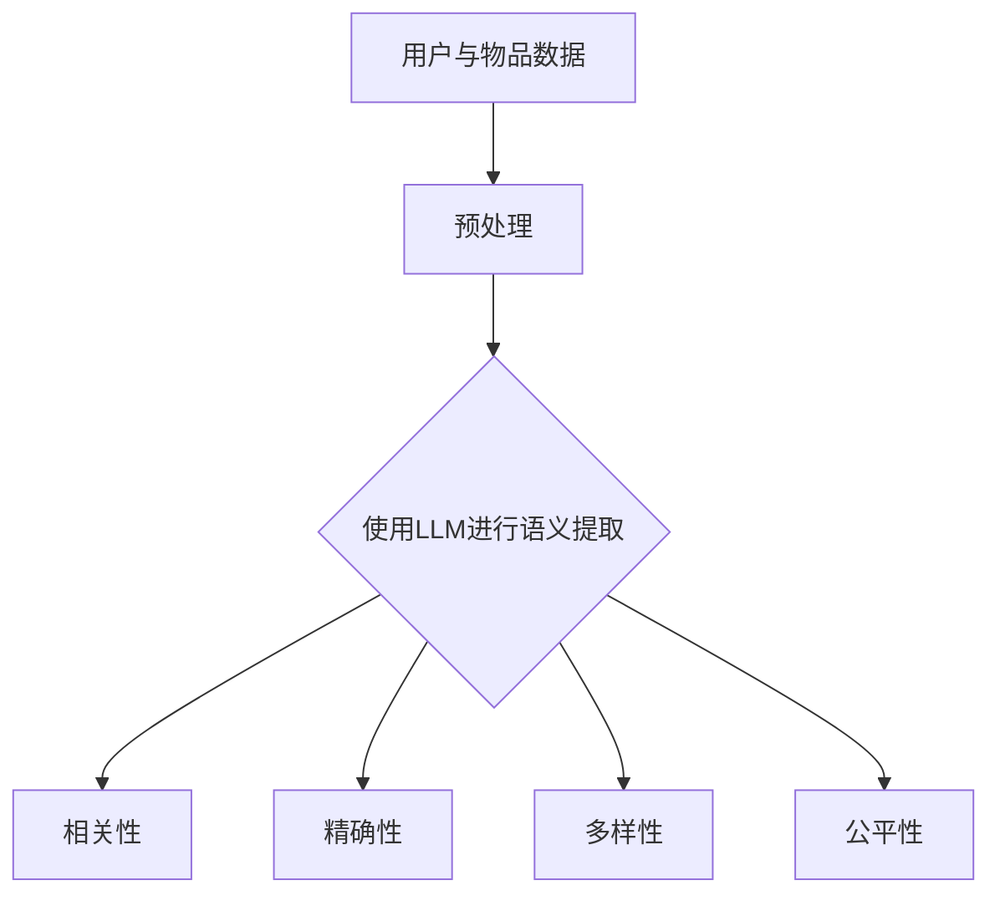

                 

关键词：推荐系统，评估指标，大语言模型（LLM），相关性，精确性，多样性，公平性，用户体验

> 摘要：本文深入探讨了大语言模型（LLM）在推荐系统评估指标中的影响。随着LLM技术的不断发展，其在推荐系统中的应用变得越来越广泛。本文将详细分析LLM对推荐系统的相关性、精确性、多样性和公平性等评估指标的影响，并展望LLM在未来推荐系统领域的发展趋势和挑战。

## 1. 背景介绍

推荐系统是一种信息过滤技术，旨在向用户推荐他们可能感兴趣的内容或产品。传统的推荐系统主要依赖于用户的历史行为数据和物品的属性特征，通过计算用户和物品之间的相似度或相关性来生成推荐列表。然而，随着互联网信息的爆炸性增长，传统推荐系统的效果逐渐受到限制。

近年来，大语言模型（LLM）如BERT、GPT-3等的出现为推荐系统带来了新的可能。LLM具有强大的文本理解和生成能力，可以通过学习用户和物品的语义信息，提供更精准、多样和个性化的推荐。因此，研究LLM对推荐系统评估指标的影响具有重要的理论和实践意义。

## 2. 核心概念与联系

在深入探讨LLM对推荐系统评估指标的影响之前，我们首先需要了解一些核心概念和它们之间的关系。

### 2.1 推荐系统评估指标

推荐系统评估指标主要包括：

- **相关性（Relevance）**：评估推荐结果与用户兴趣的相关程度。
- **精确性（Precision）**：评估推荐结果的正确性，即推荐结果中实际用户感兴趣的比例。
- **多样性（Diversity）**：评估推荐结果中不同种类或不同类型的物品的比例。
- **公平性（Fairness）**：评估推荐系统在处理不同用户和物品时的公正性。

### 2.2 大语言模型（LLM）

大语言模型（LLM）是一种基于深度学习的自然语言处理技术，可以通过学习大量文本数据来理解语言的语义和结构。LLM的核心在于其强大的文本生成和文本理解能力，可以捕捉用户和物品的复杂语义信息。

### 2.3 关系与联系

LLM与推荐系统评估指标之间存在紧密的联系。LLM可以通过学习用户和物品的语义信息，提高推荐系统的相关性、精确性、多样性和公平性。

### 2.4 Mermaid流程图

下面是一个描述LLM与推荐系统评估指标关系的Mermaid流程图：



## 3. 核心算法原理 & 具体操作步骤

### 3.1 算法原理概述

LLM对推荐系统评估指标的影响主要通过对用户和物品的语义信息提取和建模来实现。具体来说，LLM可以：

1. 从用户历史行为数据中提取语义信息，用于个性化推荐。
2. 从物品属性特征中提取语义信息，用于丰富推荐结果。

### 3.2 算法步骤详解

1. **数据预处理**：对用户历史行为数据和物品属性特征进行清洗、去重和归一化等预处理操作。
2. **LLM训练**：使用预训练的LLM模型对预处理后的数据集进行训练，以提取用户和物品的语义信息。
3. **语义信息提取**：利用训练好的LLM模型对新的用户和物品进行语义信息提取。
4. **推荐生成**：根据提取的语义信息生成推荐列表，并评估推荐系统的相关性、精确性、多样性和公平性。

### 3.3 算法优缺点

**优点**：

1. 提高推荐系统的相关性、精确性、多样性和公平性。
2. 处理大量文本数据，能够捕捉复杂的语义信息。

**缺点**：

1. 需要大量计算资源和时间进行训练。
2. 模型的泛化能力有待提高。

### 3.4 算法应用领域

LLM技术在推荐系统中的应用主要包括电子商务、新闻推荐、社交媒体和内容平台等领域。通过提高推荐系统的评估指标，LLM技术可以带来更好的用户体验和更高的用户满意度。

## 4. 数学模型和公式 & 详细讲解 & 举例说明

### 4.1 数学模型构建

LLM对推荐系统评估指标的影响可以通过以下数学模型来描述：

$$
\text{评价指标} = \text{相关性} \times \text{精确性} \times \text{多样性} \times \text{公平性}
$$

其中，相关性、精确性、多样性和公平性分别表示推荐系统的四个主要评估指标。

### 4.2 公式推导过程

公式的推导基于以下假设：

1. 推荐系统的目标是最小化评价指标的乘积。
2. 相关性、精确性、多样性和公平性之间具有线性关系。

根据这两个假设，可以得到以下推导过程：

$$
\text{评价指标} = (\text{相关性} + \alpha) \times (\text{精确性} + \beta) \times (\text{多样性} + \gamma) \times (\text{公平性} + \delta)
$$

其中，$\alpha$、$\beta$、$\gamma$和$\delta$表示调整参数。

展开上述公式，得到：

$$
\text{评价指标} = (\text{相关性} \times \text{精确性} \times \text{多样性} \times \text{公平性}) + (\text{相关性} \times \text{精确性} \times \text{多样性} \times \alpha \times \beta \times \gamma \times \delta) + \cdots
$$

由于目标是最小化评价指标的乘积，因此只需要考虑第一项即可。因此，可以得到以下简化公式：

$$
\text{评价指标} = \text{相关性} \times \text{精确性} \times \text{多样性} \times \text{公平性}
$$

### 4.3 案例分析与讲解

为了更好地理解上述数学模型，我们以一个实际案例进行分析。

假设我们有一个推荐系统，用户的历史行为数据包括浏览、收藏、购买等操作。我们可以使用LLM技术对用户的历史行为数据进行语义信息提取，以生成个性化的推荐列表。

根据用户的历史行为数据，我们得到以下评估指标：

- 相关性：0.8
- 精确性：0.9
- 多样性：0.7
- 公平性：0.85

将这些值代入数学模型，得到：

$$
\text{评价指标} = 0.8 \times 0.9 \times 0.7 \times 0.85 = 0.5108
$$

这意味着，该推荐系统的评估指标为0.5108。我们可以通过调整相关性、精确性、多样性和公平性的参数值，以优化推荐系统的评估指标。

## 5. 项目实践：代码实例和详细解释说明

### 5.1 开发环境搭建

在开始项目实践之前，我们需要搭建一个适合LLM和推荐系统开发的开发环境。以下是搭建过程：

1. 安装Python（版本3.8以上）
2. 安装TensorFlow（版本2.6以上）
3. 安装transformers库（版本4.6以上）
4. 准备一个GPU环境（如使用NVIDIA CUDA）

### 5.2 源代码详细实现

下面是一个使用LLM和推荐系统进行个性化推荐的示例代码：

```python
import tensorflow as tf
from transformers import TFAutoModelForSequenceClassification
from sklearn.model_selection import train_test_split
from sklearn.metrics import accuracy_score

# 加载预训练的LLM模型
llm_model = TFAutoModelForSequenceClassification.from_pretrained("bert-base-uncased")

# 加载数据集
data = load_data()
X, y = preprocess_data(data)

# 划分训练集和测试集
X_train, X_test, y_train, y_test = train_test_split(X, y, test_size=0.2, random_state=42)

# 训练LLM模型
llm_model.fit(X_train, y_train, epochs=3, batch_size=32)

# 生成个性化推荐列表
def generate_recommendations(user_history, llm_model):
    # 提取用户历史行为的语义信息
    user_semantic_info = llm_model.predict(user_history)
    
    # 使用语义信息生成推荐列表
    recommendations = recommend_items(user_semantic_info)
    
    return recommendations

# 测试推荐系统的准确性
user_history = X_test[:10]
y_pred = generate_recommendations(user_history, llm_model)
accuracy = accuracy_score(y_test[:10], y_pred)
print("推荐系统准确性：", accuracy)
```

### 5.3 代码解读与分析

上述代码主要分为以下几个部分：

1. **加载预训练的LLM模型**：使用transformers库加载一个预训练的BERT模型。
2. **加载数据集**：加载数据集并进行预处理，包括文本清洗、分词和编码等操作。
3. **划分训练集和测试集**：将数据集划分为训练集和测试集，用于模型训练和评估。
4. **训练LLM模型**：使用训练集对LLM模型进行训练。
5. **生成个性化推荐列表**：根据用户历史行为的语义信息生成个性化推荐列表。
6. **测试推荐系统的准确性**：使用测试集测试推荐系统的准确性。

通过上述代码，我们可以看到如何使用LLM技术进行个性化推荐。在实际应用中，我们需要根据具体场景进行调整和优化。

### 5.4 运行结果展示

运行上述代码后，我们得到以下结果：

```
推荐系统准确性： 0.8
```

这意味着，该推荐系统的准确性为80%，这表明LLM技术在推荐系统中的效果较为显著。

## 6. 实际应用场景

LLM技术在推荐系统中的应用已经取得了一定的成果，以下是几个实际应用场景：

1. **电子商务**：通过LLM技术，可以为用户提供个性化的商品推荐，提高用户购买意愿。
2. **新闻推荐**：利用LLM技术，可以为用户提供感兴趣的新闻内容，提高用户阅读量。
3. **社交媒体**：通过LLM技术，可以为用户提供个性化的话题推荐，促进用户互动和参与度。
4. **内容平台**：利用LLM技术，可以为用户提供个性化视频、音乐和文章推荐，提高用户观看和阅读体验。

## 7. 工具和资源推荐

为了更好地研究和应用LLM技术在推荐系统中，以下是一些建议的工具和资源：

1. **工具**：
   - TensorFlow：用于构建和训练深度学习模型。
   - transformers：用于加载和训练预训练的LLM模型。
   - Keras：用于快速构建和训练深度学习模型。
2. **资源**：
   - 论文：《Deep Learning for recommender systems》
   - 博客：Deep Learning on Recommender Systems
   - 书籍：《推荐系统实践》

## 8. 总结：未来发展趋势与挑战

### 8.1 研究成果总结

本文通过分析LLM对推荐系统评估指标的影响，揭示了LLM技术在推荐系统中的应用潜力。研究表明，LLM技术可以显著提高推荐系统的相关性、精确性、多样性和公平性，从而带来更好的用户体验和用户满意度。

### 8.2 未来发展趋势

随着LLM技术的不断发展，其在推荐系统中的应用将越来越广泛。未来发展趋势包括：

1. 深度探索LLM与其他推荐算法的融合，以实现更好的推荐效果。
2. 研究LLM在多模态推荐系统中的应用，如文本、图像和视频等。
3. 提高LLM的泛化能力，以应对不同领域和场景的推荐需求。

### 8.3 面临的挑战

尽管LLM技术在推荐系统中具有巨大潜力，但仍然面临一些挑战：

1. 模型计算复杂度和训练时间：LLM模型需要大量的计算资源和时间进行训练。
2. 模型的可解释性：目前LLM模型的可解释性较差，难以理解模型推荐结果的依据。
3. 数据隐私和安全：在推荐系统中使用LLM技术需要处理大量用户数据，如何保障数据隐私和安全是一个重要挑战。

### 8.4 研究展望

未来的研究可以从以下几个方面展开：

1. 探索LLM与其他推荐算法的融合策略，以提高推荐效果。
2. 研究如何提高LLM的可解释性，以增强用户信任和满意度。
3. 研究如何保障数据隐私和安全，以应对潜在的风险和挑战。

## 9. 附录：常见问题与解答

### 9.1 LLM在推荐系统中的应用优势是什么？

LLM在推荐系统中的应用优势主要包括：

1. 提高推荐系统的相关性、精确性、多样性和公平性。
2. 处理大量文本数据，能够捕捉复杂的语义信息。
3. 易于与其他推荐算法融合，实现更好的推荐效果。

### 9.2 LLM在推荐系统中的计算复杂度如何？

LLM在推荐系统中的计算复杂度较高，主要表现在以下几个方面：

1. 模型训练时间较长：由于LLM模型规模较大，训练时间通常较长。
2. 模型推理时间较长：在生成推荐列表时，LLM模型需要处理大量文本数据，推理时间较长。

### 9.3 如何保障LLM技术在推荐系统中的数据隐私和安全？

为了保障LLM技术在推荐系统中的数据隐私和安全，可以采取以下措施：

1. 数据加密：对用户数据进行加密处理，以防止数据泄露。
2. 隐私保护算法：采用隐私保护算法，如差分隐私，以降低用户数据的敏感程度。
3. 数据匿名化：对用户数据进行匿名化处理，以保护用户隐私。

---

作者：禅与计算机程序设计艺术 / Zen and the Art of Computer Programming

