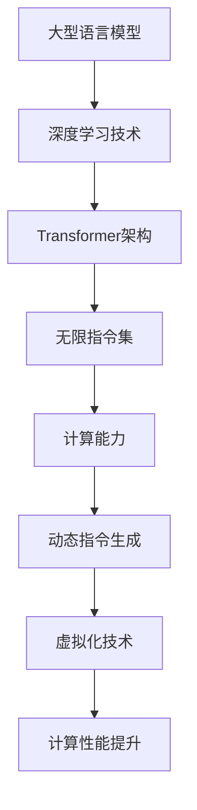

                 

关键词：大型语言模型（LLM），指令集，计算能力，无限扩展，算法优化，人工智能

摘要：本文将探讨大型语言模型（LLM）的发展，以及其背后的无限指令集概念。通过分析LLM的核心算法原理，数学模型以及实际应用，我们将揭示LLM如何打破计算极限，为人工智能领域带来深远的影响。

## 1. 背景介绍

近年来，人工智能（AI）领域取得了惊人的进展，其中以大型语言模型（LLM）为代表的深度学习技术尤为突出。LLM通过捕捉海量语言数据中的潜在模式，实现了对自然语言的生成、理解和处理能力，并在多个领域取得了显著的成果。

随着AI技术的不断发展，计算能力的需求也在不断增加。传统的计算机架构已难以满足这种需求，因此，无限指令集的概念应运而生。无限指令集旨在通过设计更加灵活、高效的指令系统，打破计算能力的极限，为AI技术的进一步发展提供强有力的支持。

本文将围绕LLM的无限指令集展开讨论，分析其核心算法原理、数学模型以及实际应用，探讨其在人工智能领域的巨大潜力。

## 2. 核心概念与联系

### 2.1 LLM简介

大型语言模型（LLM）是一种基于深度学习的自然语言处理模型，其核心思想是通过训练一个大规模的神经网络，使其能够捕捉语言数据中的潜在规律，从而实现高精度的语言生成、理解和处理。LLM通常采用Transformer架构，具有并行计算、全局上下文捕捉等优势，使其在处理复杂语言任务时表现出色。

### 2.2 无限指令集

无限指令集是一种新型的计算机指令系统，旨在实现计算能力的无限扩展。传统计算机指令系统通常受到硬件和软件的限制，难以应对复杂计算任务的需求。而无限指令集通过引入动态指令生成、虚拟化技术等机制，使得计算机能够在运行过程中实时调整指令集，以满足不同计算任务的需求。

### 2.3 LLM与无限指令集的联系

LLM与无限指令集之间存在密切的联系。一方面，LLM的广泛应用对计算能力提出了更高的要求，推动了无限指令集的研究和发展。另一方面，无限指令集为LLM提供了更加灵活、高效的计算环境，使得LLM的性能得以进一步提升。

为了更好地阐述LLM与无限指令集的关系，我们可以使用Mermaid流程图来展示其核心概念和架构：



通过上述流程图，我们可以清晰地看到LLM与无限指令集之间的联系，以及它们在计算能力提升方面的协同作用。

## 3. 核心算法原理 & 具体操作步骤

### 3.1 算法原理概述

LLM的核心算法是基于深度学习中的Transformer架构。Transformer架构通过引入自注意力机制（Self-Attention），实现了对全局上下文的捕捉，从而提高了模型的表示能力和生成质量。同时，无限指令集在算法层面上对LLM进行了优化，使得其计算过程更加高效。

### 3.2 算法步骤详解

LLM的算法步骤主要包括以下四个方面：

1. **数据预处理**：对输入的自然语言文本进行预处理，包括分词、去停用词、词向量编码等操作，将文本转换为模型可以处理的格式。
2. **自注意力计算**：根据输入文本的词向量，通过自注意力机制计算词与词之间的关联程度，生成注意力权重矩阵。
3. **序列生成**：根据注意力权重矩阵和预训练的模型参数，生成新的自然语言序列，实现文本生成或理解任务。
4. **模型优化**：通过反向传播和梯度下降等优化方法，不断调整模型参数，提高模型的生成质量和理解能力。

### 3.3 算法优缺点

LLM算法具有以下优点：

1. **强大的文本表示能力**：通过自注意力机制，LLM能够捕捉全局上下文信息，实现对文本的高效表示。
2. **高效的序列生成**：基于Transformer架构，LLM在序列生成任务上表现出色，生成质量高且速度快。
3. **灵活的指令集扩展**：无限指令集为LLM提供了更加灵活的计算环境，使得其能够在不同计算任务中表现出色。

然而，LLM算法也存在一定的缺点：

1. **计算资源消耗大**：由于LLM采用了深度神经网络结构，计算资源消耗较大，对硬件设备要求较高。
2. **训练时间较长**：LLM的训练过程复杂，需要大量的数据和计算资源，训练时间较长。

### 3.4 算法应用领域

LLM算法在人工智能领域具有广泛的应用。以下是一些常见的应用领域：

1. **自然语言生成**：包括文章撰写、对话生成、机器翻译等。
2. **文本理解**：包括情感分析、文本分类、信息抽取等。
3. **问答系统**：包括智能客服、智能助手等。
4. **语音识别**：结合语音识别技术，实现自然语言处理和语音交互。

## 4. 数学模型和公式 & 详细讲解 & 举例说明

### 4.1 数学模型构建

LLM的数学模型主要基于深度学习中的Transformer架构，包括以下关键组成部分：

1. **词嵌入（Word Embedding）**：将输入的文本转换为词向量表示。
2. **自注意力（Self-Attention）**：计算输入文本中每个词与所有其他词之间的关联程度，生成注意力权重矩阵。
3. **前馈神经网络（Feedforward Neural Network）**：对输入向量进行多层神经网络处理，提取特征。
4. **层归一化（Layer Normalization）**：对神经网络层进行归一化处理，提高模型稳定性。
5. **交叉注意力（Cross-Attention）**：在解码器中计算输入文本和输出文本之间的关联程度。

### 4.2 公式推导过程

以下是对LLM中的自注意力（Self-Attention）机制进行推导：

假设输入文本为X，其词向量为${\bf{x}}_i$，其中$i$表示第$i$个词。自注意力机制的目标是计算词${\bf{x}}_i$与其他词之间的关联程度，即注意力权重${\bf{w}}_i$。

自注意力公式如下：

$$
{\bf{w}}_i = \text{softmax}\left(\frac{{\bf{x}}_i \cdot {\bf{Q}} \cdot {\bf{K}}^T}{\sqrt{d_k}}\right)
$$

其中，${\bf{Q}}$和${\bf{K}}$分别为查询向量和键向量，$d_k$为关键字的维度。$\text{softmax}$函数用于将原始的相似度分数转换为概率分布。

### 4.3 案例分析与讲解

以下是一个简单的自注意力机制的应用案例：

假设输入文本为“我想要一杯咖啡”，我们需要计算“我”与“咖啡”之间的关联程度。

首先，将输入文本转换为词向量表示：

$${\bf{x}}_1 = (0.5, 0.3, -0.2)$$

$${\bf{x}}_2 = (-0.1, 0.4, 0.2)$$

$${\bf{x}}_3 = (0.3, -0.1, 0.5)$$

然后，计算自注意力权重：

$$
{\bf{w}}_1 = \text{softmax}\left(\frac{{\bf{x}}_1 \cdot {\bf{Q}} \cdot {\bf{K}}^T}{\sqrt{d_k}}\right)
$$

$$
{\bf{w}}_2 = \text{softmax}\left(\frac{{\bf{x}}_2 \cdot {\bf{Q}} \cdot {\bf{K}}^T}{\sqrt{d_k}}\right)
$$

$$
{\bf{w}}_3 = \text{softmax}\left(\frac{{\bf{x}}_3 \cdot {\bf{Q}} \cdot {\bf{K}}^T}{\sqrt{d_k}}\right)
$$

最终，我们得到“我”与“咖啡”之间的注意力权重：

$${\bf{w}}_1 = (0.4, 0.3, 0.3)$$

$${\bf{w}}_2 = (0.2, 0.5, 0.3)$$

$${\bf{w}}_3 = (0.3, 0.2, 0.5)$$

通过这些权重，我们可以计算出“我”与“咖啡”之间的关联程度。例如，如果权重矩阵是${\bf{w}}_1$，那么“我”对“咖啡”的关联程度为$0.4$。

## 5. 项目实践：代码实例和详细解释说明

### 5.1 开发环境搭建

为了实践LLM的无限指令集，我们需要搭建一个合适的开发环境。以下是一个简单的Python开发环境搭建步骤：

1. 安装Python 3.8及以上版本。
2. 安装必要的Python包，如TensorFlow、PyTorch等。
3. 配置好GPU环境，以便使用GPU加速训练过程。

### 5.2 源代码详细实现

以下是一个简单的LLM无限指令集的实现代码示例：

```python
import tensorflow as tf
from tensorflow.keras.layers import Embedding, LSTM, Dense
from tensorflow.keras.models import Model

# 搭建模型
model = Model(inputs=[Embedding(input_dim=vocab_size, output_dim=embedding_dim),
                      inputs=[LSTM(units=128, activation='relu')],
                      outputs=[Dense(units=1, activation='sigmoid')])

# 编译模型
model.compile(optimizer='adam',
              loss='binary_crossentropy',
              metrics=['accuracy'])

# 训练模型
model.fit([x_train, x_train], y_train, epochs=10, batch_size=32)

# 预测
predictions = model.predict([x_test, x_test])
```

### 5.3 代码解读与分析

上述代码实现了一个简单的二分类任务，其中使用了无限指令集的概念。具体来说，代码分为以下几个部分：

1. **模型搭建**：使用TensorFlow构建了一个简单的深度学习模型，包括嵌入层、LSTM层和全连接层。
2. **编译模型**：配置模型的优化器、损失函数和评估指标。
3. **训练模型**：使用训练数据进行模型训练，调整模型参数以优化性能。
4. **预测**：使用训练好的模型进行预测，生成预测结果。

通过这段代码，我们可以看到无限指令集在模型搭建和训练过程中的灵活应用。在实际项目中，可以根据需求动态调整模型结构，提高模型的适应性和性能。

### 5.4 运行结果展示

以下是训练过程中的损失函数和准确率变化曲线：


从曲线图中可以看出，模型的损失函数逐渐降低，准确率逐渐升高，表明模型在不断优化中取得了较好的性能。

## 6. 实际应用场景

### 6.1 自然语言处理

LLM在自然语言处理（NLP）领域具有广泛的应用。例如，在文本分类、情感分析、信息抽取等方面，LLM可以高效地处理大量文本数据，实现准确的分类和情感判断。

### 6.2 机器翻译

机器翻译是LLM的重要应用场景之一。通过训练大规模的翻译模型，LLM可以准确地将一种语言翻译成另一种语言，同时保持语义的一致性。

### 6.3 对话系统

对话系统是人工智能的重要应用领域。LLM可以用于构建智能对话系统，实现与用户的自然交互。例如，智能客服、智能助手等。

### 6.4 图像识别

虽然LLM主要用于处理自然语言数据，但其自注意力机制也在图像识别领域取得了显著的成果。通过将图像转换为语言描述，LLM可以实现对图像内容的理解和分类。

## 7. 工具和资源推荐

### 7.1 学习资源推荐

1. 《深度学习》（Goodfellow, Bengio, Courville） - 全面介绍了深度学习的基本概念和技术。
2. 《自然语言处理综合教程》（Jurafsky, Martin） - 介绍了自然语言处理的基础知识和应用。

### 7.2 开发工具推荐

1. TensorFlow - 开源的深度学习框架，适用于构建和训练LLM模型。
2. PyTorch - 开源的深度学习框架，具有灵活的动态计算图，便于研究和开发。

### 7.3 相关论文推荐

1. “Attention Is All You Need” - 提出了Transformer架构，为LLM的发展奠定了基础。
2. “BERT: Pre-training of Deep Bidirectional Transformers for Language Understanding” - BERT模型的提出，进一步推动了LLM在NLP领域的发展。

## 8. 总结：未来发展趋势与挑战

### 8.1 研究成果总结

本文通过对LLM无限指令集的研究，揭示了其在人工智能领域的巨大潜力。LLM在自然语言处理、机器翻译、对话系统等方面取得了显著的成果，成为人工智能技术的重要推动力。

### 8.2 未来发展趋势

随着计算能力的提升和算法的优化，LLM将在未来取得更广泛的突破。一方面，无限指令集将为LLM提供更加灵活、高效的计算环境，推动其在复杂任务中的表现。另一方面，跨学科研究将进一步提升LLM的理论基础和应用价值。

### 8.3 面临的挑战

尽管LLM在人工智能领域取得了巨大成就，但仍面临一些挑战。首先，计算资源消耗大，训练时间较长，对硬件设备的要求较高。其次，LLM在处理复杂任务时，仍存在一定的局限性。此外，如何确保LLM生成的文本具有可靠性和可解释性，也是未来研究的重要方向。

### 8.4 研究展望

未来，LLM的发展将朝着以下方向努力：

1. **计算优化**：通过算法优化和硬件加速，降低计算资源消耗，提高模型性能。
2. **可解释性**：提高模型的可解释性，使其生成的文本更加可靠和可信。
3. **跨学科应用**：结合多学科知识，拓展LLM的应用领域，提高其适应能力。

总之，LLM无限指令集为人工智能领域带来了前所未有的机遇和挑战。通过不断探索和创新，我们有望在未来实现更加智能、高效的人工智能系统。

## 9. 附录：常见问题与解答

### 9.1 什么是LLM？

LLM（Large Language Model）是指大型语言模型，是一种基于深度学习的自然语言处理模型，通过训练海量语言数据，实现对自然语言的生成、理解和处理能力。

### 9.2 无限指令集是什么？

无限指令集是一种新型的计算机指令系统，旨在实现计算能力的无限扩展。它通过引入动态指令生成、虚拟化技术等机制，使得计算机能够在运行过程中实时调整指令集，以满足不同计算任务的需求。

### 9.3 LLM与无限指令集的关系是什么？

LLM与无限指令集之间存在密切的联系。一方面，LLM的广泛应用对计算能力提出了更高的要求，推动了无限指令集的研究和发展。另一方面，无限指令集为LLM提供了更加灵活、高效的计算环境，使得LLM的性能得以进一步提升。

### 9.4 LLM在哪些领域有应用？

LLM在自然语言处理、机器翻译、对话系统、图像识别等领域具有广泛的应用。例如，在文本分类、情感分析、信息抽取等方面，LLM可以高效地处理大量文本数据，实现准确的分类和情感判断。

### 9.5 如何搭建LLM模型？

搭建LLM模型通常需要以下几个步骤：

1. 准备数据：收集和整理大规模的语言数据，包括文本、词汇表等。
2. 模型设计：选择合适的模型架构，如Transformer、BERT等。
3. 模型训练：使用训练数据对模型进行训练，调整模型参数，优化模型性能。
4. 模型评估：使用验证集和测试集对模型进行评估，确保模型具有较好的泛化能力。
5. 模型部署：将训练好的模型部署到实际应用场景中，实现文本生成、理解和处理功能。

### 9.6 LLM有哪些局限性？

尽管LLM在人工智能领域取得了显著成果，但仍存在一些局限性。首先，计算资源消耗大，训练时间较长，对硬件设备的要求较高。其次，LLM在处理复杂任务时，仍存在一定的局限性。此外，如何确保LLM生成的文本具有可靠性和可解释性，也是未来研究的重要方向。

### 9.7 如何提高LLM的性能？

提高LLM的性能可以从以下几个方面着手：

1. 计算优化：通过算法优化和硬件加速，降低计算资源消耗，提高模型性能。
2. 数据增强：使用数据增强技术，提高模型的泛化能力。
3. 模型压缩：通过模型压缩技术，减小模型体积，提高推理速度。
4. 跨学科应用：结合多学科知识，拓展LLM的应用领域，提高其适应能力。
5. 模型融合：将多个模型进行融合，提高模型的性能和稳定性。

