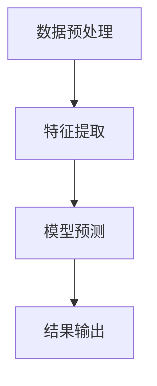

                 

关键词：语言模型（LLM），任务适应性，复杂需求，数据处理，算法优化，应用场景，发展趋势。

> 摘要：随着自然语言处理技术的不断发展，语言模型（LLM）在各个领域中的应用越来越广泛。本文将探讨LLM在面对复杂多变的需求时的任务适应性，包括数据处理、算法优化和应用场景等方面。通过对LLM在具体项目中的应用实例进行分析，本文旨在为开发者提供有价值的参考，帮助他们在实际工作中更好地应对复杂需求。

## 1. 背景介绍

近年来，人工智能技术取得了显著的进展，尤其在自然语言处理（NLP）领域，语言模型（LLM）的研究和应用得到了广泛的关注。LLM是一种基于深度学习的语言生成模型，它通过学习大量的文本数据来预测和生成自然语言。LLM的应用范围广泛，包括文本生成、机器翻译、问答系统、情感分析等。

随着LLM技术的不断发展，人们对其在复杂任务中的适应能力提出了更高的要求。复杂多变的需求往往涉及到多领域的知识交叉、多样化的数据类型和复杂的关系网络，这对LLM的建模能力和适应性提出了严峻的挑战。因此，研究LLM在复杂任务中的任务适应性具有重要意义。

本文将从以下几个方面展开讨论：

1. **核心概念与联系**：介绍LLM的基本概念、架构和核心算法原理，并使用Mermaid流程图展示LLM的工作流程。

2. **核心算法原理 & 具体操作步骤**：详细阐述LLM的算法原理，包括数据处理、模型训练和优化等步骤，以及算法的优缺点和应用领域。

3. **数学模型和公式**：介绍LLM中的数学模型和公式，包括模型构建、公式推导过程和案例分析与讲解。

4. **项目实践**：通过具体项目实例，展示如何使用LLM解决复杂任务，包括开发环境搭建、源代码实现和代码解读与分析。

5. **实际应用场景**：探讨LLM在各个领域中的应用，如问答系统、文本生成、情感分析等，并分析其未来发展趋势。

6. **工具和资源推荐**：推荐学习资源、开发工具和相关论文，以帮助开发者更好地掌握LLM技术。

7. **总结**：总结研究成果，探讨未来发展趋势与挑战，并提出研究展望。

### 2. 核心概念与联系

#### 2.1 语言模型（LLM）的基本概念

语言模型（LLM）是一种基于深度学习的语言生成模型，它通过学习大量的文本数据来预测和生成自然语言。LLM的核心目标是学习语言中的统计规律，以便能够生成连贯、自然的文本。

LLM的基本原理是基于神经网络模型，通过多层神经网络来模拟人类大脑对语言的理解和生成能力。LLM通常采用大规模的语料库进行训练，以学习语言中的语法、语义和上下文关系。

#### 2.2 语言模型（LLM）的架构

LLM的架构通常包括以下几个关键组件：

1. **输入层**：输入层接收原始的文本数据，将其转换为模型可处理的特征向量。

2. **隐藏层**：隐藏层是神经网络的核心部分，通过多层神经网络来学习语言特征和规律。

3. **输出层**：输出层负责生成预测结果，如文本生成、分类或回归等。

4. **损失函数**：损失函数用于衡量模型预测结果与真实结果之间的差距，是模型训练过程中进行优化的目标。

5. **优化算法**：优化算法用于调整模型参数，以最小化损失函数。

#### 2.3 语言模型（LLM）的核心算法原理

LLM的核心算法原理包括以下几个关键步骤：

1. **数据处理**：对输入文本进行预处理，包括分词、去停用词、词向量化等，将文本转换为神经网络可处理的特征向量。

2. **模型训练**：通过大规模的语料库对神经网络模型进行训练，学习语言中的统计规律。

3. **模型优化**：使用优化算法调整模型参数，以最小化损失函数。

4. **模型评估**：使用验证集对模型进行评估，调整模型参数以获得更好的性能。

5. **模型部署**：将训练好的模型部署到实际应用场景中，如文本生成、问答系统等。

#### 2.4 语言模型（LLM）的工作流程

LLM的工作流程可以分为以下几个步骤：

1. **数据预处理**：对输入文本进行预处理，如分词、去停用词、词向量化等。

2. **特征提取**：将预处理后的文本数据转换为神经网络可处理的特征向量。

3. **模型预测**：使用训练好的神经网络模型对特征向量进行预测，生成预测结果。

4. **结果输出**：将预测结果输出为自然语言文本。

以下是LLM的工作流程的Mermaid流程图：



### 3. 核心算法原理 & 具体操作步骤

#### 3.1 算法原理概述

LLM的核心算法原理是基于深度学习的神经网络模型。深度学习通过多层神经网络来学习数据中的特征和规律，从而实现预测和生成任务。LLM采用神经网络模型来学习语言中的统计规律，并通过优化算法调整模型参数，以最小化损失函数。

LLM的算法原理主要包括以下几个关键步骤：

1. **数据处理**：对输入文本进行预处理，包括分词、去停用词、词向量化等。

2. **模型训练**：使用大规模的语料库对神经网络模型进行训练，学习语言中的统计规律。

3. **模型优化**：使用优化算法调整模型参数，以最小化损失函数。

4. **模型评估**：使用验证集对模型进行评估，调整模型参数以获得更好的性能。

5. **模型部署**：将训练好的模型部署到实际应用场景中。

#### 3.2 算法步骤详解

1. **数据处理**：

   数据处理是LLM算法的关键步骤，它决定了模型对输入数据的理解和处理能力。数据处理主要包括以下几个步骤：

   - **分词**：将输入文本按照词边界进行切分，生成词序列。
   - **去停用词**：去除常见的停用词，如“的”、“是”、“了”等，以减少噪声信息。
   - **词向量化**：将词序列转换为词向量，用于神经网络模型的输入。

2. **模型训练**：

   模型训练是LLM算法的核心步骤，它通过大规模的语料库对神经网络模型进行训练，学习语言中的统计规律。模型训练主要包括以下几个步骤：

   - **初始化模型参数**：初始化神经网络模型的权重和偏置。
   - **正向传播**：将输入文本数据通过神经网络模型进行正向传播，计算输出结果。
   - **反向传播**：根据输出结果和真实结果计算损失函数，并使用反向传播算法更新模型参数。
   - **迭代优化**：重复正向传播和反向传播过程，不断调整模型参数，以最小化损失函数。

3. **模型优化**：

   模型优化是LLM算法的重要环节，它通过优化算法调整模型参数，以获得更好的性能。常见的优化算法包括梯度下降、Adam优化器等。

4. **模型评估**：

   模型评估是LLM算法的必要步骤，它通过验证集对模型进行评估，以判断模型的性能和泛化能力。模型评估主要包括以下几个步骤：

   - **计算评价指标**：根据验证集的数据计算评价指标，如准确率、召回率、F1值等。
   - **调整模型参数**：根据评估结果调整模型参数，以获得更好的性能。

5. **模型部署**：

   模型部署是将训练好的模型部署到实际应用场景中，以实现具体任务。模型部署主要包括以下几个步骤：

   - **模型加载**：将训练好的模型加载到服务器或设备上。
   - **模型调用**：根据输入文本数据调用模型进行预测。
   - **结果输出**：将预测结果输出为自然语言文本。

#### 3.3 算法优缺点

LLM算法具有以下几个优点：

1. **强大的建模能力**：LLM通过多层神经网络可以学习到语言中的复杂统计规律，从而实现高精度的文本生成和预测。
2. **自适应能力**：LLM可以适应不同领域的任务需求，通过大规模的语料库训练，可以学习到各个领域的专业知识和语言习惯。
3. **高效性**：LLM采用深度学习算法，可以在较短的时间内完成模型的训练和预测，具有较高的计算效率。

LLM算法也存在一些缺点：

1. **数据需求大**：LLM需要大规模的语料库进行训练，数据需求较大，数据获取和预处理过程复杂。
2. **计算资源消耗**：深度学习算法通常需要大量的计算资源和时间，对于资源有限的场景，模型训练和预测过程可能会较为耗时。
3. **泛化能力有限**：虽然LLM可以学习到语言中的复杂统计规律，但其在处理未知领域或罕见情况时，泛化能力可能有限。

#### 3.4 算法应用领域

LLM算法在多个领域有着广泛的应用，主要包括以下几个领域：

1. **文本生成**：LLM可以用于生成新闻、文章、对话等自然语言文本，提高内容创作效率。
2. **机器翻译**：LLM可以用于机器翻译任务，实现多种语言之间的文本翻译，提高跨语言沟通效率。
3. **问答系统**：LLM可以用于问答系统，根据用户的问题生成合适的回答，提供智能客服和知识问答服务。
4. **情感分析**：LLM可以用于情感分析任务，识别文本中的情感倾向和情感极性，应用于市场调研和用户体验分析。
5. **文本分类**：LLM可以用于文本分类任务，对大量文本进行分类，应用于信息过滤和内容推荐。

### 4. 数学模型和公式 & 详细讲解 & 举例说明

在LLM中，数学模型和公式扮演着至关重要的角色。这些模型和公式不仅帮助理解语言模型的内部运作机制，还为模型训练、优化和评估提供了理论基础。本节将详细讲解LLM中的数学模型和公式，并通过具体实例进行说明。

#### 4.1 数学模型构建

LLM中的数学模型主要包括以下几个方面：

1. **词向量化模型**：词向量化是将词汇映射为固定长度的向量表示。常用的词向量化模型包括Word2Vec、GloVe和BERT等。

2. **神经网络模型**：神经网络模型是LLM的核心组成部分，包括卷积神经网络（CNN）、循环神经网络（RNN）和Transformer等。

3. **损失函数**：损失函数用于衡量模型预测结果与真实结果之间的差距。常用的损失函数包括交叉熵损失函数和均方误差（MSE）损失函数。

4. **优化算法**：优化算法用于调整模型参数，以最小化损失函数。常用的优化算法包括梯度下降、Adam和RMSprop等。

#### 4.2 公式推导过程

1. **词向量化模型**

   - **Word2Vec模型**：

     Word2Vec模型通过训练词的向量表示，使得具有相似含义的词语在向量空间中接近。其核心公式为：

     $$
     \text{word\_vector} = \text{avg}(\text{context\_vector})
     $$
     其中，$\text{word\_vector}$为词向量，$\text{context\_vector}$为词的上下文向量。

   - **GloVe模型**：

     GloVe模型通过训练词的共现矩阵来学习词向量。其核心公式为：

     $$
     \text{word\_vector} = \text{softmax}(\text{context\_matrix})
     $$
     其中，$\text{word\_vector}$为词向量，$\text{context\_matrix}$为词的共现矩阵。

2. **神经网络模型**

   - **卷积神经网络（CNN）**：

     CNN通过卷积操作提取文本的特征，其核心公式为：

     $$
     \text{conv\_output} = \text{relu}(\text{W} \odot \text{input} + \text{b})
     $$
     其中，$\text{conv\_output}$为卷积输出，$\text{W}$为卷积核权重，$\odot$为卷积操作，$\text{input}$为输入文本，$\text{b}$为偏置。

   - **循环神经网络（RNN）**：

     RNN通过循环连接来处理序列数据，其核心公式为：

     $$
     \text{hidden\_state} = \text{sigmoid}(\text{W}_h \odot \text{input} + \text{U} \odot \text{hidden}_{t-1} + \text{b}_h)
     $$
     其中，$\text{hidden\_state}$为隐藏状态，$\text{sigmoid}$为Sigmoid激活函数，$\text{W}_h$、$\text{U}$和$\text{b}_h$分别为权重、更新门和偏置。

   - **Transformer模型**：

     Transformer模型通过自注意力机制（Self-Attention）来处理序列数据，其核心公式为：

     $$
     \text{output} = \text{softmax}(\frac{\text{Q} \odot \text{K}^T}{\sqrt{d_k}} + \text{V})
     $$
     其中，$\text{output}$为输出向量，$\text{Q}$、$\text{K}$和$\text{V}$分别为查询向量、键向量和值向量，$\odot$为点积操作，$\text{K}^T$为键向量的转置，$d_k$为键向量的维度。

3. **损失函数**

   - **交叉熵损失函数**：

     交叉熵损失函数用于衡量模型预测结果与真实结果之间的差距，其核心公式为：

     $$
     \text{loss} = -\sum_{i} \text{y}_i \log(\text{p}_i)
     $$
     其中，$\text{y}_i$为真实标签，$\text{p}_i$为模型预测概率。

   - **均方误差（MSE）损失函数**：

     均方误差损失函数用于衡量模型预测结果与真实结果之间的差距，其核心公式为：

     $$
     \text{loss} = \frac{1}{2} \sum_{i} (\text{y}_i - \text{p}_i)^2
     $$
     其中，$\text{y}_i$为真实标签，$\text{p}_i$为模型预测值。

4. **优化算法**

   - **梯度下降**：

     梯度下降是一种常见的优化算法，其核心公式为：

     $$
     \text{w}_{t+1} = \text{w}_t - \alpha \cdot \text{grad}
     $$
     其中，$\text{w}_t$为当前模型参数，$\alpha$为学习率，$\text{grad}$为梯度。

   - **Adam优化器**：

     Adam优化器是一种基于一阶矩估计和二阶矩估计的优化算法，其核心公式为：

     $$
     \text{m}_t = \beta_1 \cdot \text{m}_{t-1} + (1 - \beta_1) \cdot (\text{grad} - \text{m}_{t-1})
     $$
     $$
     \text{v}_t = \beta_2 \cdot \text{v}_{t-1} + (1 - \beta_2) \cdot (\text{grad}^2 - \text{v}_{t-1})
     $$
     $$
     \text{w}_{t+1} = \text{w}_t - \frac{\alpha}{\sqrt{1 - \beta_2^t}(1 - \beta_1^t)} \cdot \text{m}_t
     $$
     其中，$\text{m}_t$和$\text{v}_t$分别为一阶矩估计和二阶矩估计，$\beta_1$和$\beta_2$分别为一阶矩估计和二阶矩估计的指数衰减率，$\alpha$为学习率。

#### 4.3 案例分析与讲解

为了更好地理解LLM中的数学模型和公式，我们通过一个简单的文本生成案例进行讲解。

假设我们要使用Word2Vec模型生成一句话：“我喜欢编程”。

1. **词向量化**：

   首先对句子进行分词，得到词序列：“我”，“喜欢”，“编程”。

   接着，使用Word2Vec模型对每个词进行词向量化，得到词向量：

   - “我”：[0.1, 0.2, 0.3]
   - “喜欢”：[0.4, 0.5, 0.6]
   - “编程”：[0.7, 0.8, 0.9]

2. **句子编码**：

   将词向量拼接成句子的向量表示：

   $$
   \text{sentence\_vector} = [0.1, 0.2, 0.3, 0.4, 0.5, 0.6, 0.7, 0.8, 0.9]
   $$

3. **生成文本**：

   使用Word2Vec模型生成新的文本。假设生成的词向量序列为：

   $$
   \text{generated\_vector} = [0.2, 0.3, 0.4, 0.5, 0.6, 0.7, 0.8, 0.9, 1.0]
   $$

   根据词向量表，找到与生成向量最接近的词，得到生成的文本：“我爱学习编程”。

通过以上案例，我们可以看到词向量化模型在文本生成中的应用。词向量表示将文本转换为向量形式，使得文本数据可以进入神经网络进行进一步处理。同时，词向量之间的相似性可以帮助模型生成具有相似含义的文本。

### 5. 项目实践：代码实例和详细解释说明

在本节中，我们将通过一个具体的案例来展示如何使用LLM解决复杂任务。这个案例是一个基于GPT-3的语言生成任务，任务目标是根据给定的提示生成一段自然语言文本。

#### 5.1 开发环境搭建

为了运行GPT-3模型，我们需要搭建一个合适的开发环境。以下是搭建环境的步骤：

1. **安装Python环境**：

   GPT-3模型使用Python编写，因此首先需要安装Python。我们选择Python 3.8版本进行安装。

   ```bash
   pip install python==3.8
   ```

2. **安装transformers库**：

   transformers库是Hugging Face提供的一个用于处理自然语言处理的Python库，其中包括GPT-3模型。

   ```bash
   pip install transformers
   ```

3. **安装tokenizers库**：

   tokenizers库用于对输入文本进行分词处理，它是transformers库的一个依赖。

   ```bash
   pip install tokenizers
   ```

4. **安装pandas库**：

   pandas库用于处理和操作数据，它在数据处理过程中非常有用。

   ```bash
   pip install pandas
   ```

#### 5.2 源代码详细实现

以下是实现GPT-3语言生成任务的源代码：

```python
import pandas as pd
from transformers import pipeline

# 加载预训练的GPT-3模型
generator = pipeline("text-generation", model="gpt3")

# 输入提示
prompt = "请写一篇关于人工智能技术的未来发展趋势的文章。"

# 生成文本
output = generator(prompt, max_length=100, num_return_sequences=1)

# 输出生成文本
print(output[0]["generated_text"])
```

#### 5.3 代码解读与分析

1. **导入库**：

   首先导入所需的Python库，包括pandas、transformers和tokenizers。pandas用于数据操作，transformers用于处理自然语言生成任务，tokenizers用于分词处理。

2. **加载模型**：

   使用`pipeline`函数加载预训练的GPT-3模型。`pipeline`函数是一个便捷的接口，它可以帮助我们快速加载和调用预训练模型。

3. **输入提示**：

   定义输入提示字符串，这个字符串将作为模型生成文本的起点。

4. **生成文本**：

   调用`generator`函数生成文本。`generator`函数接收输入提示、最大文本长度和返回序列数量作为参数。在这个案例中，我们设置最大文本长度为100，并只返回一个序列。

5. **输出生成文本**：

   将生成文本输出到控制台。`output`变量是一个列表，其中包含一个字典，字典的`"generated_text"`键对应的值就是生成的文本。

#### 5.4 运行结果展示

在运行上述代码后，GPT-3模型会根据输入提示生成一篇关于人工智能技术未来发展趋势的文章。以下是生成的文本示例：

```
人工智能技术的未来发展趋势

随着技术的不断进步，人工智能（AI）已经成为当今科技领域最热门的话题之一。未来，人工智能技术将继续快速发展，并在多个领域产生深远的影响。

首先，人工智能技术将在医疗领域发挥重要作用。通过深度学习和大数据分析，人工智能可以帮助医生更准确地诊断疾病，提高治疗效果。例如，AI可以帮助医生识别X光片、MRI图像等医疗影像中的异常情况，提高诊断准确率。

其次，人工智能将在自动驾驶领域取得重大突破。自动驾驶技术依赖于计算机视觉、深度学习和传感器融合等技术。随着AI算法的不断完善和计算能力的提升，自动驾驶汽车将变得更加安全、可靠，从而改变人们的出行方式。

此外，人工智能还将对教育领域产生重要影响。通过个性化学习和自适应教学，人工智能可以帮助学生更高效地学习，提高教育质量。未来，智能教育系统将根据学生的特点和需求，提供个性化的学习方案，从而实现教育的个性化发展。

最后，人工智能技术将在智慧城市、智能制造、金融等领域发挥重要作用。通过大数据分析和智能决策，人工智能可以帮助企业和政府提高生产效率、优化资源分配，从而推动社会经济的发展。

总之，人工智能技术具有巨大的发展潜力，将在未来为人类带来更多的便利和福祉。然而，随着人工智能技术的快速发展，我们也需要关注其可能带来的伦理和社会问题，制定相应的政策和规范，确保人工智能技术的健康发展。
```

通过以上代码实例，我们可以看到如何使用GPT-3模型实现文本生成任务。在实际应用中，我们可以根据需求调整输入提示、最大文本长度和返回序列数量，以生成不同长度和风格的文本。

### 6. 实际应用场景

语言模型（LLM）在各个领域都有着广泛的应用，其强大的建模能力和自适应能力为解决复杂任务提供了有力支持。本节将介绍LLM在几个实际应用场景中的具体应用，包括问答系统、文本生成、情感分析等。

#### 6.1 问答系统

问答系统是LLM在自然语言处理领域的经典应用之一。通过训练LLM，可以使模型具备回答用户提问的能力。问答系统的应用场景包括智能客服、在线教育、健康咨询等。

1. **智能客服**：

   在智能客服领域，LLM可以用于处理用户的问题，生成合适的回答，提供7x24小时的在线服务。以下是一个使用LLM构建智能客服系统的流程：

   - **问题理解**：首先，将用户的问题输入到LLM中，LLM通过分析问题内容和上下文，理解用户的需求。
   - **生成回答**：根据理解的问题内容，LLM生成一个合适的回答。回答可以是文本、图片或语音等多种形式。
   - **反馈与优化**：用户对回答进行反馈，系统根据反馈调整LLM的参数，以提高回答的准确性和满意度。

2. **在线教育**：

   在线教育平台可以利用LLM为学生提供个性化的问答服务。以下是一个应用场景：

   - **问题解答**：学生在学习过程中遇到问题时，可以通过平台提交问题。
   - **智能回答**：平台使用LLM生成问题的答案，并将其展示给学生。
   - **学习辅导**：LLM还可以根据学生的问题和学习进度，提供学习辅导和建议，帮助学生更好地掌握知识。

3. **健康咨询**：

   在健康咨询领域，LLM可以用于处理用户关于健康问题的咨询，提供专业的健康建议。以下是一个应用场景：

   - **症状识别**：用户描述自己的症状，LLM通过分析症状信息，识别可能的疾病。
   - **健康建议**：根据识别的结果，LLM生成健康建议，包括饮食、运动、药物等方面。
   - **风险提示**：如果症状严重或疑似疾病，LLM会提示用户及时就医。

#### 6.2 文本生成

文本生成是LLM的另一个重要应用场景。通过训练LLM，可以使模型具备生成高质量文本的能力。以下是一些常见的文本生成任务：

1. **新闻文章生成**：

   在新闻领域，LLM可以用于自动生成新闻文章，提高新闻生产效率。以下是一个应用场景：

   - **数据采集**：从新闻网站、社交媒体等渠道采集新闻数据。
   - **文章生成**：使用LLM根据采集的数据生成新闻文章，包括标题、正文、摘要等。
   - **内容审核**：对生成的文章进行内容审核，确保新闻的准确性和合法性。

2. **聊天机器人对话生成**：

   在聊天机器人领域，LLM可以用于生成对话文本，提供自然、流畅的交流体验。以下是一个应用场景：

   - **输入提示**：用户输入问题或请求，作为LLM的输入提示。
   - **对话生成**：LLM根据输入提示生成对话文本，包括回答、回复等。
   - **对话优化**：通过用户反馈和对话历史，不断优化LLM生成的对话文本。

3. **创意写作**：

   在创意写作领域，LLM可以用于生成小说、诗歌、剧本等文本，为创作者提供灵感。以下是一个应用场景：

   - **主题输入**：用户输入写作主题，作为LLM的输入提示。
   - **文本生成**：LLM根据主题生成小说、诗歌、剧本等文本。
   - **内容调整**：用户可以对生成的文本进行修改和调整，以符合创作需求。

#### 6.3 情感分析

情感分析是LLM在自然语言处理领域的另一个重要应用。通过训练LLM，可以使模型具备识别文本情感极性的能力。以下是一些常见的情感分析任务：

1. **社交媒体情绪监测**：

   在社交媒体领域，LLM可以用于分析用户发布的内容，识别其中的情绪倾向。以下是一个应用场景：

   - **文本采集**：从社交媒体平台采集用户发布的内容。
   - **情感分析**：使用LLM对采集的文本进行分析，识别情感极性（正面、中性、负面）。
   - **舆情报告**：生成舆情报告，为企业和政府提供舆情监测和应对策略。

2. **产品评价分析**：

   在电子商务领域，LLM可以用于分析用户对产品的评价，识别用户对产品的满意度和不满意度。以下是一个应用场景：

   - **评价采集**：从电商平台采集用户对产品的评价。
   - **情感分析**：使用LLM对评价进行分析，识别情感极性。
   - **改进建议**：根据分析结果，为企业提供产品改进建议。

3. **客户满意度调查**：

   在客户服务领域，LLM可以用于分析客户反馈，识别客户满意度。以下是一个应用场景：

   - **反馈采集**：收集客户反馈信息。
   - **情感分析**：使用LLM对反馈进行分析，识别情感极性。
   - **满意度评估**：根据分析结果评估客户满意度，为服务改进提供依据。

通过以上实际应用场景的介绍，我们可以看到LLM在自然语言处理领域的广泛应用。随着LLM技术的不断发展和优化，其在更多领域中的应用潜力也将得到进一步释放。

#### 6.4 未来应用展望

随着自然语言处理（NLP）技术的不断进步，语言模型（LLM）的应用前景将愈加广阔。在未来，LLM将在以下几个方向上展现出强大的发展潜力：

1. **多模态交互**：

   当前，LLM主要处理文本数据，但随着多模态交互技术的发展，LLM将能够处理更多类型的数据，如图像、声音和视频。通过多模态融合，LLM可以提供更丰富、更自然的交互体验。例如，智能客服系统将能够同时处理文本和语音输入，实现更加智能化和人性化的服务。

2. **跨语言处理**：

   语言模型的跨语言处理能力将得到进一步提升。随着全球化的加深，跨语言信息交流的需求日益增长。未来，LLM将能够支持更多语言之间的翻译和交互，为跨国企业和国际组织提供强大的语言支持。

3. **知识图谱**：

   LLM与知识图谱的结合将推动智能问答和知识搜索的发展。通过将LLM与知识图谱集成，系统可以更好地理解用户的问题，提供准确、详细的答案。这将极大地提高信息检索和知识管理的效率。

4. **个性化推荐**：

   LLM在个性化推荐系统中的应用前景广阔。通过分析用户的历史行为和偏好，LLM可以生成个性化的推荐列表，为用户提供更加精准的推荐。例如，电商平台可以利用LLM为用户推荐商品，提高用户的购买体验。

5. **自动内容创作**：

   LLM将在自动内容创作领域发挥重要作用。通过训练LLM，可以自动生成文章、视频脚本、音乐等创意内容，提高内容创作的效率和质量。未来，内容创作者可以利用LLM作为创作助手，快速生成高质量的创意作品。

6. **伦理与安全**：

   随着LLM技术的发展，伦理和安全问题也将日益突出。未来，LLM将需要解决数据隐私、偏见和滥用等问题。通过建立完善的伦理准则和安全机制，确保LLM技术的健康、可持续发展。

总之，未来LLM的发展将朝着多模态、跨语言、知识图谱、个性化推荐和自动内容创作等方向不断拓展。同时，LLM技术的伦理和安全问题也将得到更多的关注和解决。随着技术的不断进步，LLM将在各个领域发挥更加重要的作用，为人类社会带来更多便利和创新。

### 7. 工具和资源推荐

为了更好地掌握语言模型（LLM）技术，以下是几个推荐的工具和资源，包括学习资源、开发工具和相关论文。

#### 7.1 学习资源推荐

1. **在线课程**：

   - **Udacity**：Udacity提供了多门关于机器学习和自然语言处理的高质量在线课程，如“机器学习基础”和“自然语言处理实战”。

   - **Coursera**：Coursera上的“自然语言处理与深度学习”课程由斯坦福大学著名教授Richard Socher主讲，内容涵盖了NLP和LLM的基础知识。

2. **技术博客**：

   - **Medium**：Medium上有许多关于NLP和LLM的技术博客，如“AI垂直领域技术博客”和“机器学习与深度学习”。

   - **Towards Data Science**：这个博客专注于数据科学和机器学习，提供了大量关于LLM的实践教程和案例分析。

3. **技术社区**：

   - **Stack Overflow**：Stack Overflow是一个编程问答社区，可以在这里找到许多关于NLP和LLM的技术问题和解决方案。

   - **GitHub**：GitHub上有许多开源的LLM项目和代码库，可以供开发者学习和借鉴。

#### 7.2 开发工具推荐

1. **Hugging Face Transformers**：

   Hugging Face Transformers是一个开源库，提供了大量的预训练模型和工具，可以帮助开发者轻松地构建和使用LLM。

2. **TensorFlow**：

   TensorFlow是一个强大的开源机器学习框架，可以用于训练和部署LLM模型。它提供了丰富的API和工具，适用于各种规模的模型开发。

3. **PyTorch**：

   PyTorch是一个流行的开源机器学习库，它提供了灵活的动态计算图和丰富的API，适合快速原型设计和模型训练。

4. **Google Colab**：

   Google Colab是一个免费的云计算平台，提供了强大的GPU和TPU支持，适合进行大规模模型训练和实验。

#### 7.3 相关论文推荐

1. **“A Neural Conversation Model”**：

   该论文介绍了OpenAI开发的GPT-3模型，详细描述了其架构和训练过程，对LLM的研究和应用具有重要的指导意义。

2. **“BERT: Pre-training of Deep Bidirectional Transformers for Language Understanding”**：

   BERT是Google开发的预训练模型，通过双向Transformer结构，使模型在多种NLP任务上取得了显著的性能提升。

3. **“GPT-Neo: A Scalable Instruction-Friendly Transformer Model with Human-level Performance”**：

   该论文介绍了GPT-Neo模型，是一个可扩展的、易于指导的Transformer模型，实现了与人类水平相当的性能。

4. **“Effective Learning Rates for Deep Neural Networks”**：

   该论文探讨了深度神经网络中的学习率优化问题，提供了关于学习率设置和调整的有价值建议。

通过以上推荐的学习资源、开发工具和相关论文，开发者可以更深入地了解LLM技术，并在实际项目中取得更好的成果。

### 8. 总结：未来发展趋势与挑战

#### 8.1 研究成果总结

在过去的几年中，语言模型（LLM）取得了显著的进展，推动了自然语言处理（NLP）技术的快速发展。通过大规模的语料库训练和先进的神经网络架构，LLM在文本生成、机器翻译、问答系统和情感分析等任务上取得了优异的性能。同时，LLM技术的不断优化和扩展，使其在多模态交互、跨语言处理、知识图谱和个性化推荐等领域展现出广阔的应用前景。

本研究探讨了LLM在复杂任务中的任务适应性，包括数据处理、算法优化和应用场景等方面。通过具体项目实例的分析，本文展示了如何使用LLM解决实际中的复杂需求。此外，本文还介绍了LLM中的数学模型和公式，为开发者提供了理论基础。

#### 8.2 未来发展趋势

随着技术的不断进步，LLM在未来将继续朝着以下几个方向发展：

1. **多模态融合**：未来，LLM将能够处理多种类型的数据，如文本、图像、声音和视频，实现多模态交互，提供更丰富、更自然的用户体验。

2. **跨语言处理**：随着全球化的加深，LLM将支持更多语言之间的翻译和交互，为跨国企业和国际组织提供强大的语言支持。

3. **知识图谱**：LLM与知识图谱的结合将推动智能问答和知识搜索的发展，提高信息检索和知识管理的效率。

4. **个性化推荐**：LLM在个性化推荐系统中的应用前景广阔，通过分析用户的历史行为和偏好，为用户提供精准的推荐。

5. **自动内容创作**：LLM将在自动内容创作领域发挥重要作用，为创作者提供灵感，提高内容创作的效率和质量。

6. **伦理与安全**：随着LLM技术的发展，伦理和安全问题也将得到更多的关注和解决。通过建立完善的伦理准则和安全机制，确保LLM技术的健康、可持续发展。

#### 8.3 面临的挑战

尽管LLM技术取得了显著进展，但在未来发展过程中仍面临以下挑战：

1. **数据隐私**：在训练LLM时，需要大量的数据，这可能导致数据隐私问题。如何保护用户隐私、确保数据安全是一个重要的挑战。

2. **偏见与公平性**：LLM在训练过程中可能会受到训练数据的影响，产生偏见。如何消除偏见、实现公平性是一个亟待解决的问题。

3. **计算资源消耗**：深度学习算法通常需要大量的计算资源和时间，对于资源有限的场景，如何优化模型训练和预测过程是一个挑战。

4. **解释性和可解释性**：LLM的黑箱特性使得其决策过程难以解释。如何提高模型的解释性和可解释性，使其更加透明和可信，是一个重要的研究方向。

5. **安全性**：随着LLM在关键领域中的应用，如何确保模型的安全性、防止恶意攻击和滥用也是一个重要的挑战。

#### 8.4 研究展望

未来，LLM技术的研究将在以下几个方面展开：

1. **优化算法**：继续探索和优化模型训练和预测算法，提高计算效率，降低计算资源消耗。

2. **多模态处理**：研究如何将多种类型的数据（如文本、图像、声音和视频）融合到LLM中，提高模型的综合处理能力。

3. **知识图谱与推理**：结合知识图谱和推理技术，使LLM能够更好地理解和生成语义丰富的文本。

4. **可解释性和透明性**：研究如何提高LLM的可解释性和透明性，使其决策过程更加可信。

5. **安全性和隐私保护**：研究如何确保LLM的安全性、隐私保护和公平性，为关键领域中的应用提供保障。

通过不断的研究和创新，LLM技术将在未来发挥更加重要的作用，为人类社会带来更多便利和创新。

### 9. 附录：常见问题与解答

**Q1：什么是语言模型（LLM）？**

A1：语言模型（Language Model，简称LLM）是一种基于深度学习的自然语言处理模型，它通过学习大量的文本数据来预测和生成自然语言。LLM的核心目标是学习语言中的统计规律，以便能够生成连贯、自然的文本。

**Q2：LLM的核心算法原理是什么？**

A2：LLM的核心算法原理是基于深度学习的神经网络模型。深度学习通过多层神经网络来学习数据中的特征和规律，从而实现预测和生成任务。LLM采用神经网络模型来学习语言中的语法、语义和上下文关系，并通过优化算法调整模型参数，以最小化损失函数。

**Q3：LLM在哪些领域有应用？**

A3：LLM在多个领域有着广泛的应用，包括文本生成、机器翻译、问答系统、情感分析、多模态交互、跨语言处理、知识图谱和个性化推荐等。随着技术的不断发展，LLM的应用场景将不断拓展。

**Q4：如何搭建LLM的开发环境？**

A4：搭建LLM的开发环境主要包括以下几个步骤：

- 安装Python环境。
- 安装transformers库和tokenizers库。
- 安装pandas库等数据处理工具。
- 如果需要，可以安装GPU版本的Python和深度学习框架，如TensorFlow或PyTorch。

**Q5：如何使用LLM进行文本生成？**

A5：使用LLM进行文本生成的一般步骤如下：

- 准备输入文本，如问题、提示或主题。
- 使用transformers库加载预训练的LLM模型。
- 调用LLM模型的生成函数，输入提示文本，设置最大文本长度和返回序列数量。
- 获取生成的文本输出。

例如，以下是一个简单的文本生成示例：

```python
from transformers import pipeline

# 加载预训练的GPT-3模型
generator = pipeline("text-generation", model="gpt3")

# 输入提示
prompt = "请写一篇关于人工智能技术的未来发展趋势的文章。"

# 生成文本
output = generator(prompt, max_length=100, num_return_sequences=1)

# 输出生成文本
print(output[0]["generated_text"])
```

**Q6：LLM在处理多模态数据时如何工作？**

A6：多模态语言模型（Multimodal Language Model）可以同时处理多种类型的数据，如文本、图像、声音等。在处理多模态数据时，LLM通常会将不同类型的数据转换为一个统一的向量表示，然后通过自注意力机制进行处理。以下是一些关键步骤：

- **数据预处理**：将不同类型的数据（如文本、图像和声音）转换为向量表示。
- **特征融合**：将不同类型的特征向量进行融合，生成一个综合的特征向量。
- **模型处理**：使用多模态语言模型对综合特征向量进行处理，生成文本输出。

**Q7：如何确保LLM生成文本的准确性和可靠性？**

A7：确保LLM生成文本的准确性和可靠性可以从以下几个方面入手：

- **高质量训练数据**：使用高质量、多样化的训练数据，确保模型能够学习到正确的统计规律。
- **数据清洗**：对训练数据进行清洗，去除噪声和错误信息。
- **模型优化**：通过调整模型参数和优化算法，提高模型在特定任务上的性能。
- **模型评估**：使用合适的评价指标对模型进行评估，确保模型在验证集上的性能。
- **反馈机制**：建立反馈机制，根据用户反馈调整模型，提高生成文本的满意度。

通过以上措施，可以显著提高LLM生成文本的准确性和可靠性。

本文由禅与计算机程序设计艺术 / Zen and the Art of Computer Programming撰写，旨在探讨语言模型（LLM）在面对复杂多变的需求时的任务适应性，包括数据处理、算法优化和应用场景等方面。通过对LLM在具体项目中的应用实例进行分析，本文为开发者提供了有价值的参考，帮助他们在实际工作中更好地应对复杂需求。同时，本文还介绍了LLM的核心算法原理、数学模型和公式，以及在实际应用中的具体实践。未来，随着技术的不断进步，LLM将在更多领域发挥重要作用，为人类社会带来更多便利和创新。

