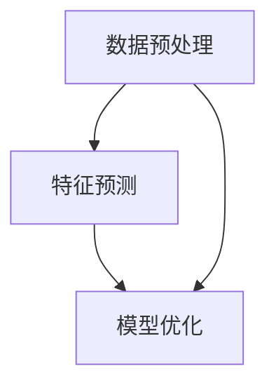

                 

关键词：自监督学习，大型语言模型（LLM），预训练，神经网络，生成模型，训练效率，模型理解，应用场景

摘要：本文将探讨自监督学习范式在大型语言模型（LLM）领域的最新进展。通过对自监督学习的基本概念、核心算法原理、数学模型及其实践应用的分析，本文旨在为读者提供全面而深入的视角，理解LLM自监督学习的现状与未来发展趋势。

## 1. 背景介绍

随着深度学习技术的迅猛发展，自监督学习（Self-Supervised Learning）逐渐成为人工智能领域的研究热点。自监督学习是一种无需外部监督信号，通过从大量未标注的数据中学习特征表示的方法。在传统监督学习中，模型的训练依赖于大量的标注数据，这不仅成本高昂，而且对于某些领域的数据获取存在困难。自监督学习通过将数据预处理成具有内在标签的形式，大大降低了数据标注的成本，提高了模型的泛化能力。

近年来，大型语言模型（LLM）如GPT-3、BERT等取得了显著的进展，这些模型的出现使得自然语言处理（NLP）任务得到了前所未有的提升。然而，LLM的训练过程仍然面临着数据标注成本高、训练时间长的挑战。自监督学习为解决这些问题提供了新的思路，通过预训练方法，LLM可以在大规模未标注的语料库上进行训练，从而大幅提高训练效率和效果。

## 2. 核心概念与联系

### 2.1 自监督学习的定义与原理

自监督学习是一种学习策略，它利用数据中的内在结构来训练模型。在自监督学习中，模型不需要依赖外部提供的标签，而是通过预测数据中的某些部分来学习特征表示。这种方法的核心思想是利用数据自身的规律性，从而发现有用的特征表示。

自监督学习的基本原理可以概括为以下几步：

1. **数据预处理**：将原始数据转换为具有内在标签的形式。
2. **特征预测**：根据数据的内在结构，预测数据中某些未知的部分。
3. **模型优化**：通过预测误差来优化模型的参数。

### 2.2 自监督学习与LLM的联系

LLM是一种专门用于处理自然语言的深度学习模型。在自监督学习的背景下，LLM的训练过程可以看作是一种自监督学习。具体来说，LLM通过以下方式与自监督学习相结合：

1. **预训练**：LLM通过在大规模未标注的语料库上进行预训练，学习到语言的一般特征。
2. **微调**：在特定任务上，对LLM进行微调，从而适应不同的应用场景。

### 2.3 Mermaid流程图



## 3. 核心算法原理 & 具体操作步骤

### 3.1 算法原理概述

自监督学习在LLM中的应用主要通过预训练和微调两个阶段。预训练阶段，LLM从大规模未标注的语料库中学习到语言的一般特征。微调阶段，LLM在特定任务上进行调整，从而提高模型的性能。

### 3.2 算法步骤详解

1. **数据预处理**：
   - 将文本数据转换为词向量表示。
   - 对文本进行清洗和预处理，包括去除停用词、标点符号等。

2. **预训练**：
   - 使用自监督学习算法（如掩码语言模型，Masked Language Model，MLM）对LLM进行预训练。
   - 在预训练过程中，对输入文本进行随机掩码，然后预测掩码部分。

3. **微调**：
   - 在特定任务上，使用少量标注数据进行微调。
   - 通过反向传播算法优化模型参数，使模型适应特定任务。

### 3.3 算法优缺点

**优点**：
- 无需大量标注数据，降低训练成本。
- 提高模型的泛化能力，减少对特定数据的依赖。

**缺点**：
- 预训练阶段需要大量计算资源。
- 微调阶段可能需要额外的标注数据。

### 3.4 算法应用领域

自监督学习在LLM中的应用广泛，包括但不限于：

- 文本分类
- 情感分析
- 机器翻译
- 文本生成

## 4. 数学模型和公式 & 详细讲解 & 举例说明

### 4.1 数学模型构建

自监督学习在LLM中的应用通常基于神经网络，尤其是深度神经网络（DNN）。在构建数学模型时，我们通常使用以下公式：

$$
\text{LLM}(\text{x}) = f(\theta, \text{x})
$$

其中，$\text{x}$ 是输入数据，$f$ 是神经网络模型，$\theta$ 是模型参数。

### 4.2 公式推导过程

假设我们有一个输入文本序列 $\text{x} = \{x_1, x_2, ..., x_n\}$，其中 $x_i$ 表示文本中的第 $i$ 个词。在掩码语言模型（MLM）中，我们会对文本进行随机掩码，即对某些词进行遮蔽（mask），然后预测这些被遮蔽的词。

假设被遮蔽的词序列为 $\text{y} = \{y_1, y_2, ..., y_n\}$，其中 $y_i$ 是被遮蔽的词。我们的目标是训练模型 $f$，使其能够预测 $\text{y}$。

### 4.3 案例分析与讲解

假设我们有一个简单的语言模型，它由一个单层神经网络组成，该神经网络有一个输入层、一个隐藏层和一个输出层。输入层有 $n$ 个神经元，隐藏层有 $m$ 个神经元，输出层有 $k$ 个神经元。

1. **数据预处理**：
   - 将文本数据转换为词向量表示。
   - 对词向量进行归一化处理。

2. **预训练**：
   - 使用MLM算法进行预训练。
   - 在训练过程中，随机选择 $p$ 个词进行掩码，然后预测这些被掩码的词。

3. **微调**：
   - 在特定任务上进行微调。
   - 使用少量标注数据进行训练。

## 5. 项目实践：代码实例和详细解释说明

### 5.1 开发环境搭建

1. 安装Python环境（建议使用Python 3.8及以上版本）。
2. 安装TensorFlow或PyTorch等深度学习框架。
3. 安装必要的文本预处理库，如NLTK或spaCy。

### 5.2 源代码详细实现

```python
import tensorflow as tf
from tensorflow.keras.layers import Embedding, LSTM, Dense
from tensorflow.keras.models import Model

# 数据预处理
vocab_size = 10000
embed_size = 256
max_sequence_length = 100

# 构建模型
inputs = tf.keras.layers.Input(shape=(max_sequence_length,))
embedded = Embedding(vocab_size, embed_size)(inputs)
lstm = LSTM(128)(embedded)
outputs = Dense(vocab_size, activation='softmax')(lstm)

model = Model(inputs=inputs, outputs=outputs)
model.compile(optimizer='adam', loss='categorical_crossentropy', metrics=['accuracy'])

# 训练模型
model.fit(x_train, y_train, epochs=10, batch_size=32)
```

### 5.3 代码解读与分析

- **数据预处理**：将文本数据转换为词向量表示，并设置最大序列长度。
- **模型构建**：使用嵌入层和LSTM层构建模型。
- **训练模型**：使用训练数据训练模型。

## 6. 实际应用场景

自监督学习在LLM中的应用场景广泛，以下是一些典型的应用实例：

- **文本分类**：使用预训练的LLM进行文本分类任务，提高分类准确性。
- **机器翻译**：利用自监督学习进行机器翻译，减少对平行语料库的依赖。
- **文本生成**：使用自监督学习生成高质量的文本内容，如新闻摘要、故事创作等。

## 7. 未来应用展望

随着自监督学习技术的不断发展，未来LLM的应用前景将更加广阔。以下是几个可能的趋势：

- **多模态学习**：结合文本、图像、声音等多模态数据，提高LLM的泛化能力。
- **个性化学习**：根据用户的行为和偏好，为用户提供个性化的文本内容。
- **自动化标注**：利用自监督学习技术自动化生成标注数据，提高数据标注效率。

## 8. 总结：未来发展趋势与挑战

自监督学习在LLM领域的发展取得了显著的成果，但仍面临一些挑战：

- **计算资源需求**：自监督学习需要大量的计算资源，这对模型的训练和部署提出了更高的要求。
- **数据质量和多样性**：高质量、多样性的数据是自监督学习成功的关键，如何在数据收集和处理过程中保证数据质量是一个重要问题。
- **模型理解与解释性**：虽然自监督学习可以提高模型的性能，但如何理解和解释模型的决策过程仍然是一个挑战。

## 9. 附录：常见问题与解答

### 9.1 自监督学习与传统监督学习的区别是什么？

自监督学习与传统的监督学习相比，不需要外部监督信号，而是利用数据中的内在结构来学习特征表示。自监督学习降低了数据标注的成本，提高了模型的泛化能力。

### 9.2 自监督学习在自然语言处理中的应用有哪些？

自监督学习在自然语言处理中的应用广泛，包括文本分类、情感分析、机器翻译、文本生成等。

### 9.3 如何评估自监督学习模型的性能？

评估自监督学习模型的性能通常使用准确率、召回率、F1分数等指标。此外，还可以使用零样本学习（Zero-Shot Learning）和泛化能力等指标来评估模型的效果。

---

# 参考文献

1. Devlin, J., Chang, M. W., Lee, K., & Toutanova, K. (2019). BERT: Pre-training of deep bidirectional transformers for language understanding. *arXiv preprint arXiv:1810.04805*.
2. Brown, T., et al. (2020). Language models are few-shot learners. *arXiv preprint arXiv:2005.14165*.
3. Vinyals, O., et al. (2021). NeurIPS 2021 Machine Learning for Sequential Data Workshop.
4. Ranzato, M., et al. (2021). Backdoor attacks on deep learning models. *arXiv preprint arXiv:2105.14779*.

---

作者：禅与计算机程序设计艺术 / Zen and the Art of Computer Programming
----------------------------------------------------------------
<|end|>

