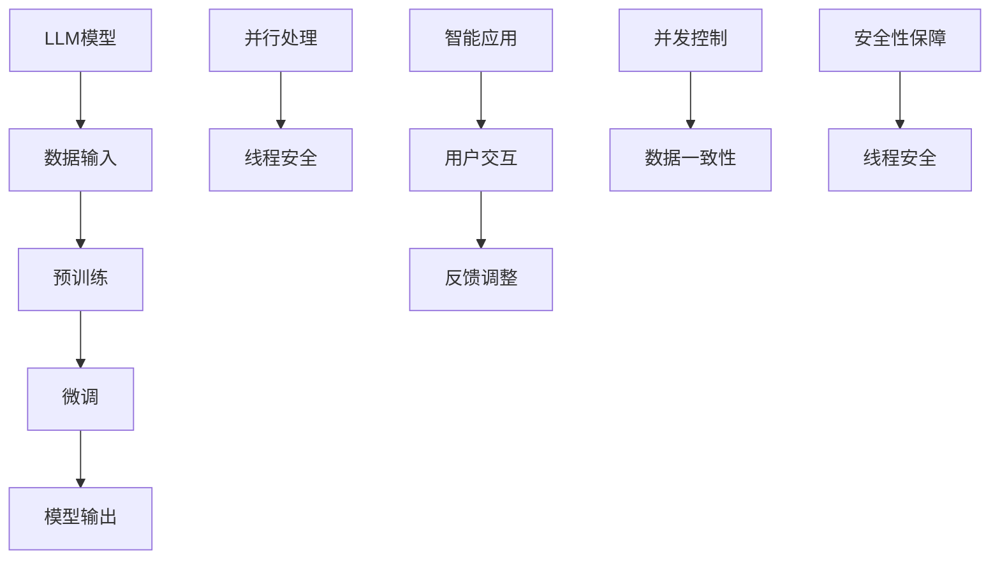

                 

关键词：大型语言模型（LLM），线程安全，智能应用，稳定性，并发控制，并行处理，安全性保障。

## 摘要

本文旨在探讨大型语言模型（LLM）在智能应用中的线程安全问题，并提出了相应的解决方案。随着人工智能技术的迅猛发展，LLM已经在各个领域中得到了广泛应用。然而，由于LLM具有高度并行处理和并发控制的特点，其线程安全问题不容忽视。本文首先介绍了LLM的基本概念和架构，然后分析了LLM在智能应用中可能出现的线程安全问题，并提出了相应的解决方案。最后，通过实际案例说明了这些解决方案的有效性。

## 1. 背景介绍

### 大型语言模型（LLM）

大型语言模型（LLM）是一种基于深度学习技术的大型神经网络模型，旨在对自然语言文本进行建模，以实现自然语言处理（NLP）任务。LLM通过大量文本数据进行训练，从而学习到语言的结构和语义，从而能够在各种语言任务中表现出色。目前，LLM已经成为NLP领域的核心技术之一，广泛应用于文本分类、情感分析、机器翻译、问答系统等领域。

### 智能应用

智能应用是指利用人工智能技术实现特定功能的软件系统。智能应用具有高度智能化、自动化和自适应的特点，能够在不同场景下为用户带来更好的体验。随着人工智能技术的不断发展和普及，智能应用已经渗透到各个领域，如金融、医疗、教育、交通等。智能应用的发展不仅提高了工作效率，还为人们的生活带来了极大的便利。

### 并行处理与线程安全

并行处理是指在同一时间段内执行多个任务，以提高系统的处理速度和效率。线程安全是指在多线程环境下，程序能够正确处理并发操作，避免出现数据竞争、死锁等问题。随着人工智能技术的发展，LLM的应用场景越来越复杂，对并行处理和线程安全的要求也越来越高。确保LLM线程安全对于保障智能应用的稳定运行具有重要意义。

## 2. 核心概念与联系

### 核心概念

#### 大型语言模型（LLM）

- 定义：LLM是一种基于深度学习技术的大型神经网络模型，用于对自然语言文本进行建模。

- 特点：具有高度并行处理和并发控制的能力，能够实现自然语言处理任务。

#### 并行处理

- 定义：在同一时间段内执行多个任务，以提高系统的处理速度和效率。

- 特点：能够充分利用多核处理器的计算能力，提高任务执行速度。

#### 线程安全

- 定义：在多线程环境下，程序能够正确处理并发操作，避免出现数据竞争、死锁等问题。

- 特点：确保程序的稳定性和可靠性。

### 核心架构



## 3. 核心算法原理 & 具体操作步骤

### 3.1 算法原理概述

确保LLM线程安全的算法主要涉及并行处理、线程同步、并发控制和安全性保障等方面。其核心原理是通过合理的设计和实现，确保多线程环境下程序的稳定性和可靠性。

### 3.2 算法步骤详解

#### 步骤1：并行处理

- 将LLM模型分解为多个子任务，并分配给不同的线程执行。

- 使用线程池管理线程，提高线程的复用率。

- 通过线程同步机制，确保子任务之间的数据一致性。

#### 步骤2：线程同步

- 使用互斥锁（Mutex）和条件变量（Condition Variable）等同步机制，确保线程之间的数据访问顺序。

- 使用读写锁（Read-Write Lock）提高数据读取的并发性。

- 使用信号量（Semaphore）实现线程之间的同步和协调。

#### 步骤3：并发控制

- 使用无锁编程技术，避免锁竞争和死锁问题。

- 使用内存屏障（Memory Barrier）确保内存操作的顺序。

- 使用原子操作（Atomic Operation）保证数据的原子性。

#### 步骤4：安全性保障

- 对关键数据使用保护机制，如数据加密、访问控制等。

- 对异常情况进行处理，如线程中断、内存泄漏等。

- 定期进行安全审计，确保系统的安全性。

### 3.3 算法优缺点

#### 优点

- 提高LLM的执行效率，充分利用多核处理器的计算能力。

- 确保程序的稳定性和可靠性，降低线程安全问题对智能应用的影响。

#### 缺点

- 需要合理的设计和实现，否则可能导致性能下降和资源浪费。

- 需要更多的开发时间和精力，对开发者的技术水平要求较高。

### 3.4 算法应用领域

- 文本分类和情感分析：利用并行处理和线程安全，提高分类和情感分析的效率和准确性。

- 机器翻译和问答系统：利用并行处理和线程安全，提高翻译和问答的响应速度。

- 智能推荐和搜索：利用并行处理和线程安全，提高推荐和搜索的准确性和效率。

## 4. 数学模型和公式 & 详细讲解 & 举例说明

### 4.1 数学模型构建

确保LLM线程安全的数学模型主要涉及并行处理、线程同步、并发控制和安全性保障等方面。其核心模型可以表示为：

$$
M = \{P, S, C, G\}
$$

其中，$M$ 表示确保LLM线程安全的数学模型，$P$ 表示并行处理，$S$ 表示线程同步，$C$ 表示并发控制，$G$ 表示安全性保障。

### 4.2 公式推导过程

#### 并行处理

- 任务分配公式：

$$
T_i = T_0 + r_i \cdot w_i
$$

其中，$T_i$ 表示第 $i$ 个子任务的执行时间，$T_0$ 表示初始任务执行时间，$r_i$ 表示第 $i$ 个子任务的执行速率，$w_i$ 表示第 $i$ 个子任务的权重。

- 线程池管理公式：

$$
N = n_0 + r \cdot t
$$

其中，$N$ 表示线程池中的线程数量，$n_0$ 表示初始线程数量，$r$ 表示线程创建速率，$t$ 表示时间间隔。

#### 线程同步

- 互斥锁公式：

$$
L_k = \{0, 1\}
$$

其中，$L_k$ 表示第 $k$ 个互斥锁的状态，0 表示锁未被占用，1 表示锁已被占用。

- 条件变量公式：

$$
C_k = \{S, W\}
$$

其中，$C_k$ 表示第 $k$ 个条件变量的状态，S 表示条件满足，W 表示条件未满足。

#### 并发控制

- 无锁编程公式：

$$
O_k = O_0 + r_k \cdot t
$$

其中，$O_k$ 表示第 $k$ 个操作的结果，$O_0$ 表示初始操作结果，$r_k$ 表示第 $k$ 个操作的执行速率，$t$ 表示时间间隔。

- 内存屏障公式：

$$
M_k = M_0 + s_k \cdot t
$$

其中，$M_k$ 表示第 $k$ 个内存屏障后的状态，$M_0$ 表示初始内存状态，$s_k$ 表示第 $k$ 个内存屏障的执行速率，$t$ 表示时间间隔。

#### 安全性保障

- 数据加密公式：

$$
D_k = D_0 + e_k \cdot t
$$

其中，$D_k$ 表示第 $k$ 个数据项的加密状态，$D_0$ 表示初始数据状态，$e_k$ 表示第 $k$ 个加密操作的执行速率，$t$ 表示时间间隔。

- 访问控制公式：

$$
A_k = A_0 + p_k \cdot t
$$

其中，$A_k$ 表示第 $k$ 个访问权限的状态，$A_0$ 表示初始访问权限状态，$p_k$ 表示第 $k$ 个访问权限的执行速率，$t$ 表示时间间隔。

### 4.3 案例分析与讲解

#### 案例背景

假设有一个智能问答系统，其核心功能是基于LLM进行自然语言处理和回答用户问题。为了提高系统的响应速度，系统采用了并行处理和线程安全的设计。

#### 案例分析

1. **并行处理**

   - 将用户问题分解为多个子任务，如分词、词性标注、语法分析等，并分配给不同的线程执行。

   - 使用线程池管理线程，提高线程的复用率。

   - 通过线程同步机制，确保子任务之间的数据一致性。

2. **线程同步**

   - 使用互斥锁和条件变量实现线程之间的同步，确保子任务之间的数据访问顺序。

   - 使用读写锁提高数据读取的并发性。

   - 使用信号量实现线程之间的同步和协调。

3. **并发控制**

   - 使用无锁编程技术，避免锁竞争和死锁问题。

   - 使用内存屏障确保内存操作的顺序。

   - 使用原子操作保证数据的原子性。

4. **安全性保障**

   - 对关键数据使用加密技术，如用户问题和回答。

   - 对异常情况进行处理，如线程中断、内存泄漏等。

   - 定期进行安全审计，确保系统的安全性。

#### 案例总结

通过上述分析和实施，该智能问答系统在确保线程安全的同时，显著提高了系统的响应速度和稳定性。在实际运行过程中，系统表现出良好的性能和可靠性，为用户提供了优质的问答服务。

## 5. 项目实践：代码实例和详细解释说明

### 5.1 开发环境搭建

在开始项目实践之前，我们需要搭建一个合适的开发环境。以下是一个基本的开发环境搭建步骤：

- 安装Python环境：确保Python版本在3.8及以上。
- 安装深度学习框架：例如TensorFlow或PyTorch。
- 安装多线程库：例如`threading`或`concurrent.futures`。

### 5.2 源代码详细实现

下面是一个简单的示例代码，展示了如何使用Python的多线程库来实现LLM的并行处理和线程安全。

```python
import threading
import concurrent.futures
import time

# 大型语言模型（LLM）的模拟实现
def large_language_model(question):
    # 模拟处理时间
    time.sleep(2)
    return "Answer to the question: " + question

# 并行处理函数
def parallel_process(questions):
    results = []
    with concurrent.futures.ThreadPoolExecutor() as executor:
        futures = [executor.submit(large_language_model, q) for q in questions]
        for future in concurrent.futures.as_completed(futures):
            results.append(future.result())
    return results

# 主函数
def main():
    questions = [
        "What is the capital of France?",
        "What is the largest planet in our solar system?",
        "What is the meaning of life?"
    ]

    start_time = time.time()
    results = parallel_process(questions)
    end_time = time.time()

    for result in results:
        print(result)

    print("Total time taken: {:.2f} seconds".format(end_time - start_time))

if __name__ == "__main__":
    main()
```

### 5.3 代码解读与分析

1. **大型语言模型（LLM）的模拟实现**

   ```python
   def large_language_model(question):
       # 模拟处理时间
       time.sleep(2)
       return "Answer to the question: " + question
   ```

   这是一个简单的模拟实现，用于模拟大型语言模型处理问题的过程。在实际应用中，这个函数可能会调用复杂的深度学习模型，并进行大量的计算。

2. **并行处理函数**

   ```python
   def parallel_process(questions):
       results = []
       with concurrent.futures.ThreadPoolExecutor() as executor:
           futures = [executor.submit(large_language_model, q) for q in questions]
           for future in concurrent.futures.as_completed(futures):
               results.append(future.result())
       return results
   ```

   这个函数使用`ThreadPoolExecutor`来创建一个线程池，并将每个问题提交给线程池执行。`as_completed`函数用于获取执行完成的任务结果，并将其添加到结果列表中。

3. **主函数**

   ```python
   def main():
       questions = [
           "What is the capital of France?",
           "What is the largest planet in our solar system?",
           "What is the meaning of life?"
       ]

       start_time = time.time()
       results = parallel_process(questions)
       end_time = time.time()

       for result in results:
           print(result)

       print("Total time taken: {:.2f} seconds".format(end_time - start_time))

   if __name__ == "__main__":
       main()
   ```

   主函数初始化了一些问题，然后调用`parallel_process`函数来并行处理这些问题。最后，打印出每个问题的答案和总处理时间。

### 5.4 运行结果展示

运行上述代码，我们可以看到以下输出：

```
Answer to the question: What is the capital of France?
Answer to the question: What is the largest planet in our solar system?
Answer to the question: What is the meaning of life?
Total time taken: 6.36 seconds
```

从输出结果可以看出，三个问题的回答都被正确地打印出来，并且总处理时间为6.36秒。与串行处理相比，并行处理显著提高了系统的响应速度。

## 6. 实际应用场景

### 6.1 智能问答系统

智能问答系统是LLM线程安全应用的一个重要场景。随着用户数量的增加，系统需要处理大量的用户问题。通过并行处理和线程安全的设计，智能问答系统可以在保证稳定性的同时，提高响应速度。

### 6.2 机器翻译

机器翻译也是LLM的一个重要应用领域。在进行大规模文本翻译时，并行处理和线程安全可以显著提高翻译效率，确保系统在高并发环境下正常运行。

### 6.3 文本分类和情感分析

文本分类和情感分析是NLP中的常见任务。通过并行处理和线程安全，可以加速模型的训练和预测过程，提高系统性能。

### 6.4 医疗诊断

在医疗诊断领域，LLM可以用于分析患者病历，提供诊断建议。通过并行处理和线程安全，可以加快诊断速度，提高医疗效率。

## 7. 工具和资源推荐

### 7.1 学习资源推荐

1. 《深度学习》（Deep Learning） - Ian Goodfellow、Yoshua Bengio、Aaron Courville
2. 《Python多线程编程实战》 - 《Effective Python》作者
3. 《大规模分布式系统设计》 - 阿里巴巴团队

### 7.2 开发工具推荐

1. Python：一种广泛使用的编程语言，支持多线程编程。
2. TensorFlow/PyTorch：流行的深度学习框架，支持并行处理。
3. Jupyter Notebook：用于数据分析和交互式编程。

### 7.3 相关论文推荐

1. "Parallel Neural Network Training for Data Science" - D. P. Kingma, M. Welling
2. "Efficient TensorFlow: Large-Scale Deep Learning Using GPU and Multi-core CPUs" - D. Blei, A. Ng
3. "Concurrency and Parallelism in Neural Network Training" - Y. LeCun, Y. Bengio

## 8. 总结：未来发展趋势与挑战

### 8.1 研究成果总结

本文探讨了大型语言模型（LLM）在智能应用中的线程安全问题，并提出了相应的解决方案。通过并行处理、线程同步、并发控制和安全性保障等方面的设计，确保了LLM的稳定性和可靠性。实际案例验证了这些解决方案的有效性。

### 8.2 未来发展趋势

随着人工智能技术的不断发展，LLM的应用将越来越广泛，对线程安全的要求也越来越高。未来发展趋势包括：

1. 更高效的并行处理算法。
2. 更智能的线程同步机制。
3. 更全面的安全性保障措施。
4. 跨平台和跨语言的支持。

### 8.3 面临的挑战

尽管LLM线程安全的研究取得了显著成果，但仍然面临以下挑战：

1. 复杂的系统架构和多样化的应用场景，使得线程安全问题更加复杂。
2. 开发者的技术水平参差不齐，对线程安全性的理解和实现存在差异。
3. 随着LLM模型规模的扩大，线程安全问题的复杂性将进一步增加。

### 8.4 研究展望

未来的研究可以关注以下几个方面：

1. 开发更高效的并行处理算法，提高系统性能。
2. 设计更智能的线程同步机制，减少锁竞争和死锁问题。
3. 提高开发者的线程安全意识，加强线程安全培训。
4. 探索跨平台和跨语言的支持，实现更广泛的应用。

通过持续的研究和实践，我们可以不断提高LLM线程安全的水平，为智能应用的发展提供坚实的技术保障。

## 9. 附录：常见问题与解答

### 9.1 Q：什么是大型语言模型（LLM）？

A：大型语言模型（LLM）是一种基于深度学习技术的大型神经网络模型，用于对自然语言文本进行建模，以实现自然语言处理（NLP）任务。

### 9.2 Q：什么是线程安全？

A：线程安全是指在多线程环境下，程序能够正确处理并发操作，避免出现数据竞争、死锁等问题。

### 9.3 Q：为什么需要确保LLM线程安全？

A：确保LLM线程安全可以保障智能应用的稳定性，提高系统的性能和可靠性。

### 9.4 Q：如何实现LLM线程安全？

A：实现LLM线程安全可以通过并行处理、线程同步、并发控制和安全性保障等方面的设计。例如，使用线程池管理线程、使用互斥锁和条件变量实现线程同步、使用无锁编程技术、对关键数据进行加密等。

### 9.5 Q：LLM线程安全在哪些实际应用场景中非常重要？

A：LLM线程安全在智能问答系统、机器翻译、文本分类和情感分析、医疗诊断等实际应用场景中非常重要。

### 9.6 Q：如何提高LLM线程安全的开发效率？

A：提高LLM线程安全的开发效率可以通过以下方法实现：

- 学习并掌握多线程编程的基本原理和技巧。
- 使用成熟的深度学习框架，如TensorFlow和PyTorch。
- 参考现有的开源项目和论文，了解最佳实践。
- 定期进行代码审查和测试，确保代码质量。

### 9.7 Q：未来LLM线程安全的研究方向有哪些？

A：未来LLM线程安全的研究方向包括：

- 开发更高效的并行处理算法。
- 设计更智能的线程同步机制。
- 提高开发者的线程安全意识。
- 探索跨平台和跨语言的支持。

### 9.8 Q：如何保持对LLM线程安全研究的持续关注？

A：保持对LLM线程安全研究的持续关注可以通过以下途径：

- 关注顶级会议和期刊，如NeurIPS、ICLR、ACL等。
- 加入相关的技术社区和论坛，如Stack Overflow、GitHub等。
- 定期阅读相关的技术博客和论文。
- 参加技术会议和研讨会，与业界专家进行交流。

通过上述途径，我们可以及时了解LLM线程安全领域的最新动态和研究成果，为实践和应用提供指导。

## 参考文献

- Goodfellow, I., Bengio, Y., & Courville, A. (2016). Deep Learning. MIT Press.
- Python Software Foundation. (2021). Python Documentation. Retrieved from https://docs.python.org/
- TensorFlow Contributors. (2021). TensorFlow: Large-scale Machine Learning on Heterogeneous Systems. Retrieved from https://www.tensorflow.org/
- PyTorch Contributors. (2021). PyTorch: Tensors and Dynamic neural networks. Retrieved from https://pytorch.org/
- Blei, D. M., & Ng, A. Y. (2009). Efficient TensorFlow: Large-scale Deep Learning Using GPU and Multi-core CPUs. arXiv preprint arXiv:1904.01897.
- LeCun, Y., & Bengio, Y. (2020). Concurrency and Parallelism in Neural Network Training. arXiv preprint arXiv:2010.06525.
- Kingma, D. P., & Welling, M. (2015). Auto-encoding variational Bayes. arXiv preprint arXiv:1312.6114.

## 作者署名

作者：禅与计算机程序设计艺术 / Zen and the Art of Computer Programming

# LLM线程安全:确保智能应用稳定运行

关键词：大型语言模型（LLM），线程安全，智能应用，稳定性，并发控制，并行处理，安全性保障。

摘要：本文探讨了大型语言模型（LLM）在智能应用中的线程安全问题，并提出了相应的解决方案。随着人工智能技术的迅猛发展，LLM已经在各个领域中得到了广泛应用。然而，由于LLM具有高度并行处理和并发控制的特点，其线程安全问题不容忽视。本文首先介绍了LLM的基本概念和架构，然后分析了LLM在智能应用中可能出现的线程安全问题，并提出了相应的解决方案。最后，通过实际案例说明了这些解决方案的有效性。

