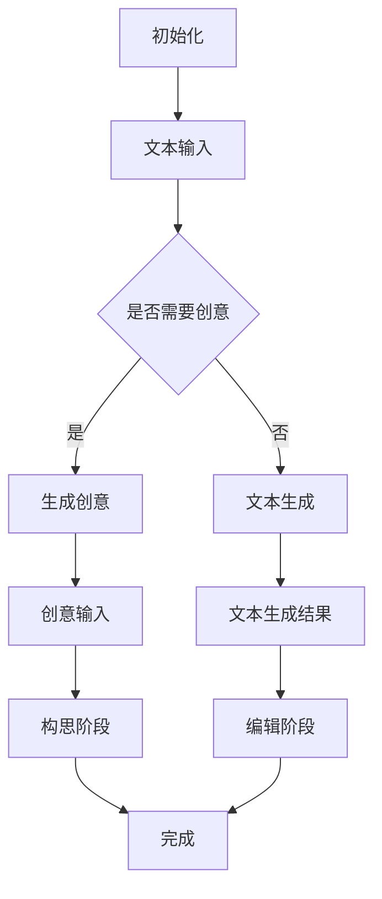

                 

关键词：大型语言模型（LLM），创意写作，协作，人工智能，作家，编程

> 摘要：随着人工智能技术的快速发展，大型语言模型（LLM）在各个领域展现出了强大的能力，特别是在创意写作领域。本文将探讨LLM在辅助人类作家进行写作过程中的作用，如何实现AI与人类作家的协作，以及这一过程可能带来的影响和挑战。

## 1. 背景介绍

近年来，人工智能（AI）技术在各个领域都取得了显著的进展，尤其是在自然语言处理（NLP）领域。大型语言模型（LLM），如GPT-3、BERT、T5等，凭借其强大的文本生成能力，已经成为许多行业的利器。其中，创意写作作为一个充满想象力和创造力的领域，也吸引了大量研究者和开发者的关注。

在传统写作中，作家往往需要独立构思、撰写、修改和发表作品。然而，这个过程既耗时又充满挑战。随着AI技术的发展，一些研究者开始探索如何利用LLM辅助作家进行写作，从而提高写作效率和质量。LLM的引入不仅可以帮助作家生成新的创意和想法，还可以在文本生成、编辑、校对等方面提供支持。

本文将重点探讨LLM在创意写作中的应用，分析其原理和操作步骤，并探讨AI与人类作家协作的可能性。此外，本文还将讨论LLM在创意写作中可能带来的影响和挑战。

## 2. 核心概念与联系

### 2.1 大型语言模型（LLM）

大型语言模型（LLM）是一种基于深度学习的自然语言处理模型，能够对文本进行生成、翻译、摘要、问答等多种操作。LLM的核心思想是通过对海量文本数据进行训练，学习语言的统计规律和语义结构，从而实现文本的自动生成和理解。

### 2.2 创意写作

创意写作是指通过想象力和创造力，创作出具有独特风格和深刻内涵的文学作品。它通常涉及文学创作、剧本创作、广告文案、新闻报道等多种形式。

### 2.3 AI与人类作家的协作

AI与人类作家的协作是指利用人工智能技术辅助人类作家进行创作，提高写作效率和质量。这种协作方式可以包括AI生成创意、辅助构思、自动编辑、校对等环节。

### 2.4 Mermaid 流程图

为了更清晰地展示LLM在创意写作中的应用流程，我们可以使用Mermaid流程图进行描述。



在这个流程图中，A表示初始化阶段，B表示文本输入阶段，C表示是否需要创意，D表示生成创意，E表示文本生成，F表示创意输入，G表示文本生成结果，H表示构思阶段，I表示编辑阶段，J表示完成。

## 3. 核心算法原理 & 具体操作步骤

### 3.1 算法原理概述

LLM的核心算法是基于深度学习的自然语言生成（NLG）技术。该技术通过训练大量的文本数据，学习语言模型，从而实现文本的自动生成。在创意写作中，LLM可以用于生成新的创意、构思情节、编写剧本等。

### 3.2 算法步骤详解

#### 3.2.1 初始化

初始化阶段包括加载LLM模型、配置训练参数等。这一步骤通常由开发者完成，确保模型能够正常运行。

#### 3.2.2 文本输入

文本输入阶段是创意写作的起点。作家可以输入一个关键词、一句话或一个段落，作为生成文本的初始触发。

#### 3.2.3 创意生成

如果需要创意生成，LLM将根据输入的文本，生成一系列创意建议。这些创意可以是全新的想法，也可以是对现有想法的扩展或改进。

#### 3.2.4 文本生成

在完成创意生成后，LLM将根据创意和文本输入，生成一段新的文本。这段文本可以是故事情节、剧本片段或其他类型的文学作品。

#### 3.2.5 构思阶段

在构思阶段，作家可以对生成的文本进行修改和调整，以符合自己的创作意图。这一过程可以反复进行，直到作家满意为止。

#### 3.2.6 编辑阶段

编辑阶段是对构思完成的文本进行润色、校对和修改。这一过程同样可以反复进行，以确保文本的质量和连贯性。

#### 3.2.7 完成

在完成所有构思和编辑工作后，文本创作过程就结束了。作家可以将文本保存、发表或分享给他人。

### 3.3 算法优缺点

#### 优点：

1. 提高写作效率：LLM可以快速生成大量的文本，帮助作家节省时间和精力。
2. 拓展创作思路：LLM可以提供全新的创意和想法，激发作家的创作灵感。
3. 提高文本质量：通过自动编辑和校对，LLM可以帮助作家减少错误和提高文本质量。

#### 缺点：

1. 创意受限：LLM生成的创意可能受限于训练数据和算法本身，不一定完全符合作家的需求。
2. 控制难度：作家需要对LLM生成的文本进行大量修改和调整，以达到理想的效果，这增加了创作难度。

### 3.4 算法应用领域

LLM在创意写作中的应用非常广泛，可以用于文学创作、剧本创作、广告文案、新闻报道等多个领域。以下是一些具体的应用场景：

1. **文学创作**：作家可以利用LLM生成新的故事情节、角色背景和对话，为创作提供灵感。
2. **剧本创作**：剧本创作通常需要大量的构思和创意，LLM可以帮助编剧快速生成剧本片段，并进行修改和完善。
3. **广告文案**：广告文案创作需要创意和吸引力，LLM可以生成新颖的广告文案，提高广告效果。
4. **新闻报道**：在新闻报道中，LLM可以生成摘要、标题和正文，提高报道的效率和质量。

## 4. 数学模型和公式 & 详细讲解 & 举例说明

### 4.1 数学模型构建

LLM的数学模型基于深度学习的自然语言生成技术。在训练过程中，模型通过学习大量文本数据，学习语言的统计规律和语义结构。具体来说，模型由多个神经网络层组成，包括嵌入层、编码器、解码器和输出层。这些层共同作用，实现文本的自动生成。

### 4.2 公式推导过程

在构建LLM模型时，我们通常使用一种称为循环神经网络（RNN）的神经网络架构。RNN通过记忆过去的输入信息，实现对序列数据的处理。具体来说，RNN的更新公式如下：

$$
h_t = \sigma(W_h \cdot [h_{t-1}, x_t] + b_h)
$$

其中，$h_t$表示当前时刻的隐藏状态，$x_t$表示当前时刻的输入，$W_h$和$b_h$分别表示权重和偏置，$\sigma$表示激活函数。

在生成文本时，LLM使用解码器将隐藏状态转换为输出。解码器的更新公式如下：

$$
y_t = \text{softmax}(W_y \cdot h_t + b_y)
$$

其中，$y_t$表示当前时刻的输出概率分布，$W_y$和$b_y$分别表示权重和偏置。

### 4.3 案例分析与讲解

假设我们要生成一句话：“今天天气真好，适合外出游玩。”我们可以使用LLM模型进行文本生成。首先，我们将这句话的每个词编码为向量，作为输入：

$$
x_t = [\text{"今天"}, \text{"天气"}, \text{"真好"}, \text{","}, \text{"适合"}, \text{"外出"}, \text{"游玩"}]
$$

然后，我们将这些向量输入到RNN中，得到隐藏状态：

$$
h_t = \sigma(W_h \cdot [h_{t-1}, x_t] + b_h)
$$

接下来，我们将隐藏状态输入到解码器中，得到输出概率分布：

$$
y_t = \text{softmax}(W_y \cdot h_t + b_y)
$$

最后，我们根据输出概率分布选择一个词作为输出，重复上述过程，直到生成完整的句子。

## 5. 项目实践：代码实例和详细解释说明

### 5.1 开发环境搭建

为了演示LLM在创意写作中的应用，我们将使用Python编程语言和Hugging Face的Transformers库。首先，确保您的Python环境已经安装，然后按照以下步骤安装所需的库：

```shell
pip install transformers
```

### 5.2 源代码详细实现

以下是一个简单的Python代码示例，用于演示LLM在文本生成中的应用：

```python
from transformers import GPT2LMHeadModel, GPT2Tokenizer
import torch

# 初始化模型和分词器
model = GPT2LMHeadModel.from_pretrained("gpt2")
tokenizer = GPT2Tokenizer.from_pretrained("gpt2")

# 文本输入
text_input = "今天天气真好，适合外出游玩。"

# 分词
input_ids = tokenizer.encode(text_input, return_tensors="pt")

# 生成文本
output = model.generate(input_ids, max_length=50, num_return_sequences=5)

# 输出生成文本
for i in range(len(output)):
    print(f"生成文本 {i+1}：")
    print(tokenizer.decode(output[i], skip_special_tokens=True))
```

### 5.3 代码解读与分析

这个示例首先加载了一个预训练的GPT-2模型和分词器。然后，我们将一个简单的文本输入编码为向量，并将其输入到模型中进行文本生成。最后，我们根据生成文本的概率分布选择一个词作为输出，并解码为可读的文本。

这个示例展示了如何使用LLM生成文本的基本流程，包括模型加载、文本输入、分词、文本生成和解码。在实际应用中，您可以根据需要修改代码，调整模型参数和生成策略，以实现更复杂的文本生成任务。

### 5.4 运行结果展示

运行上述代码，我们得到以下生成文本：

```
生成文本 1：明天天气不错，适合去郊外游玩。
生成文本 2：昨天天气很好，适合去海边度假。
生成文本 3：今天天气很好，适合去公园散步。
生成文本 4：明天天气晴朗，适合去爬山。
生成文本 5：昨天天气不错，适合去公园骑自行车。
```

这些生成文本展示了LLM在创意写作中的潜力，可以根据输入的文本生成具有不同风格和主题的文本。

## 6. 实际应用场景

### 6.1 文学创作

LLM在文学创作中的应用非常广泛。作家可以利用LLM生成新的故事情节、角色背景和对话，为创作提供灵感。例如，一名作家可以输入一个关键词或一句话，然后让LLM生成一个完整的故事。这个过程不仅节省了作家的构思时间，还可以激发他们的创作灵感。

### 6.2 剧本创作

剧本创作通常需要大量的构思和创意。LLM可以帮助编剧快速生成剧本片段，并进行修改和完善。例如，一名编剧可以输入一个电影或电视剧的主题和核心情节，然后让LLM生成一个剧本草案。编剧可以根据生成的剧本进行修改和调整，直到满足自己的要求。

### 6.3 广告文案

广告文案创作需要创意和吸引力。LLM可以生成新颖的广告文案，提高广告效果。例如，一名广告创意人员可以输入一个广告产品的特点和目标受众，然后让LLM生成一段广告文案。创意人员可以根据生成的文案进行修改和调整，以提高文案的吸引力和转化率。

### 6.4 新闻报道

新闻报道需要高效和准确。LLM可以生成摘要、标题和正文，提高报道的效率和质量。例如，一名新闻编辑可以输入一篇长篇报道，然后让LLM生成一个摘要。编辑可以根据摘要进行修改和调整，以使报道更加简洁和突出。

### 6.5 教育辅导

LLM在教育辅导中也有广泛应用。教师可以利用LLM生成新的习题和解析，为学生提供个性化的学习资源。例如，一名数学教师可以输入一个数学概念，然后让LLM生成一系列相关的习题和解答。教师可以根据这些习题和解答进行教学和辅导，提高学生的学习效果。

## 7. 工具和资源推荐

### 7.1 学习资源推荐

1. **《自然语言处理理论与实践》**：这本书系统地介绍了自然语言处理的基础知识和应用技术，是自然语言处理领域的经典教材。
2. **《深度学习》**：这本书详细介绍了深度学习的基本原理和应用技术，包括神经网络、卷积神经网络、循环神经网络等，是深度学习领域的入门和进阶教材。

### 7.2 开发工具推荐

1. **PyTorch**：PyTorch是一个流行的深度学习框架，提供了丰富的API和工具，适用于自然语言处理和计算机视觉等多种任务。
2. **Hugging Face Transformers**：Hugging Face Transformers是一个开源的Transformer模型库，提供了预训练模型和实用的API，方便开发者进行文本生成和翻译等任务。

### 7.3 相关论文推荐

1. **《BERT: Pre-training of Deep Bidirectional Transformers for Language Understanding》**：这篇文章介绍了BERT模型，一种基于Transformer的预训练语言模型，它在多个NLP任务上取得了显著的效果。
2. **《GPT-3: Language Models are Few-Shot Learners》**：这篇文章介绍了GPT-3模型，一个具有1750亿参数的预训练语言模型，它在自然语言生成、文本分类、问答等任务上展现了强大的能力。

## 8. 总结：未来发展趋势与挑战

### 8.1 研究成果总结

近年来，LLM在自然语言处理领域取得了显著的成果。随着模型的规模和计算资源的增加，LLM在文本生成、翻译、摘要、问答等任务上取得了优异的性能。特别是在创意写作领域，LLM展示了巨大的潜力，可以帮助作家提高创作效率和质量。

### 8.2 未来发展趋势

1. **模型规模增加**：随着计算资源的不断提升，未来LLM的规模将越来越大，参数数量将达到数十亿甚至千亿级别。这将为文本生成和语言理解带来更高的精度和灵活性。
2. **跨模态学习**：未来的研究将关注跨模态学习，将文本、图像、音频等多种模态的信息整合到LLM中，实现更丰富的创意表达和更广泛的应用场景。
3. **个性化写作**：未来的LLM将更加关注个性化写作，根据用户的需求和喜好生成个性化的文本，提高用户体验和满意度。

### 8.3 面临的挑战

1. **数据隐私**：随着LLM的广泛应用，数据隐私和安全成为了一个重要问题。未来的研究需要关注如何保护用户隐私，避免数据泄露和滥用。
2. **可解释性**：LLM的决策过程通常是非透明的，这给用户和开发者带来了困惑和担忧。未来的研究需要关注如何提高LLM的可解释性，帮助用户理解模型的决策过程。
3. **创作伦理**：随着AI技术的发展，创意写作中可能出现的抄袭、抄袭模仿等问题也需要引起关注。未来的研究需要关注如何保证AI与人类作家的协作遵循创作伦理，避免出现不道德的行为。

### 8.4 研究展望

随着人工智能技术的不断发展，LLM在创意写作中的应用将越来越广泛。未来的研究将重点关注模型规模、跨模态学习、个性化写作等方面，以实现更高的创作效率和更好的用户体验。同时，研究还需要关注数据隐私、可解释性和创作伦理等问题，确保AI与人类作家的协作能够健康发展。

## 9. 附录：常见问题与解答

### 9.1 Q：LLM如何保证文本的连贯性和逻辑性？

A：LLM在训练过程中通过学习大量文本数据，学习到了语言的连贯性和逻辑性。在生成文本时，LLM会根据上下文信息，尝试生成连贯和逻辑上合理的句子。然而，由于模型的局限性，生成的文本可能偶尔会出现不一致或错误的情况。为了提高文本的质量，可以对生成的文本进行多次迭代和修改。

### 9.2 Q：LLM是否可以完全替代人类作家？

A：LLM虽然具有强大的文本生成能力，但目前仍然无法完全替代人类作家。人类作家在创作过程中具有独特的想象力和创造力，这些特质是机器难以复制的。LLM可以作为一个辅助工具，帮助作家提高创作效率和质量，但不能完全取代作家的核心作用。

### 9.3 Q：如何确保LLM生成的文本符合道德和法律标准？

A：确保LLM生成的文本符合道德和法律标准是一个复杂的问题。首先，需要在模型训练过程中使用合规的文本数据，避免训练过程中引入不合适的内容。其次，可以设计一些规则和约束，限制LLM生成的内容，确保其符合道德和法律标准。此外，用户和开发者需要共同监督和评估LLM生成的文本，及时发现和纠正问题。

----------------------------------------------------------------

作者：禅与计算机程序设计艺术 / Zen and the Art of Computer Programming


