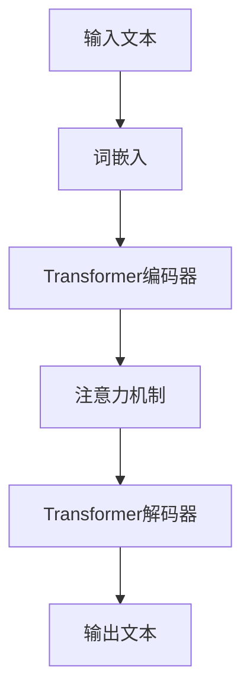
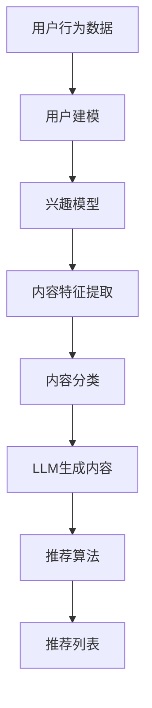

                 

关键词：大型语言模型（LLM），个性化内容推荐，自然语言处理（NLP），机器学习，信息检索，用户行为分析，内容创作

> 摘要：本文将探讨如何利用大型语言模型（LLM）来驱动个性化内容创作推荐系统。我们将首先介绍背景知识，包括LLM的基本原理和个性化内容推荐的重要概念。接着，我们将深入探讨LLM的核心算法原理，并提供具体的操作步骤。随后，我们将通过数学模型和具体案例来详细讲解LLM在个性化内容创作中的应用。文章还将提供代码实例和运行结果展示，最后讨论实际应用场景和未来展望。

## 1. 背景介绍

随着互联网的快速发展，信息爆炸的时代已经到来。用户在海量信息中寻找感兴趣的内容变得愈加困难。为了解决这一问题，个性化内容推荐系统应运而生。这些系统能够根据用户的行为和偏好，自动为用户推荐他们可能感兴趣的内容，从而提高用户体验和信息获取效率。

个性化内容推荐系统通常包括几个关键组成部分：用户建模、内容建模和推荐算法。用户建模旨在理解用户的兴趣和行为，而内容建模则关注内容的特征提取和分类。推荐算法则是核心，它们基于用户和内容的模型，生成个性化的推荐列表。

近年来，自然语言处理（NLP）和机器学习技术的发展，为个性化内容推荐带来了新的契机。特别是大型语言模型（LLM），如GPT-3、BERT等，已经成为个性化内容推荐的重要工具。LLM能够理解和生成高质量的自然语言文本，使得推荐系统能够生成更加贴近用户需求的个性化内容。

## 2. 核心概念与联系

### 2.1. 大型语言模型（LLM）的基本原理

大型语言模型（LLM）是一种基于深度学习的自然语言处理模型。它们通过大规模的文本数据训练，能够理解和生成高质量的自然语言文本。LLM的核心原理是基于注意力机制和变换器架构（Transformer），这使得它们在处理长文本和复杂语言结构方面具有显著优势。

以下是LLM的基本原理的Mermaid流程图：



### 2.2. 个性化内容推荐的概念

个性化内容推荐是指根据用户的行为数据、兴趣和偏好，为用户推荐符合其个性化需求的内容。个性化内容推荐的关键在于理解用户的兴趣和需求，并能够准确地将这些需求映射到具体的内容推荐上。

个性化内容推荐通常包括以下几个关键步骤：

1. **用户建模**：通过用户的行为数据（如浏览历史、搜索历史、评论等）来构建用户兴趣模型。
2. **内容建模**：对推荐的内容进行特征提取和分类，以便更好地理解内容的属性和特点。
3. **推荐算法**：结合用户和内容的模型，生成个性化的推荐列表。

### 2.3. LLM与个性化内容推荐的联系

LLM在个性化内容推荐中的应用主要体现在以下几个方面：

1. **内容生成**：LLM能够根据用户的需求和兴趣，生成高质量的个性化内容。
2. **语义理解**：LLM能够深入理解用户的语言表达和需求，从而提高推荐的准确性。
3. **上下文感知**：LLM能够处理复杂的多模态数据，如文本、图像和音频，从而提供更加丰富的个性化内容。

以下是一个Mermaid流程图，展示了LLM与个性化内容推荐系统的整合过程：



## 3. 核心算法原理 & 具体操作步骤

### 3.1. 算法原理概述

LLM驱动的个性化内容推荐系统主要基于以下几个核心算法原理：

1. **深度学习模型**：如GPT-3、BERT等，用于生成高质量的自然语言文本。
2. **协同过滤**：基于用户的行为数据，为用户推荐相似用户喜欢的内容。
3. **内容嵌入**：将内容特征转换为向量表示，用于后续的推荐计算。

### 3.2. 算法步骤详解

以下是LLM驱动的个性化内容推荐系统的具体操作步骤：

1. **用户建模**：通过用户的浏览历史、搜索历史和交互数据，构建用户兴趣模型。
2. **内容建模**：对推荐的内容进行特征提取和分类，生成内容向量表示。
3. **内容生成**：利用LLM生成符合用户兴趣的个性化内容。
4. **推荐计算**：结合用户和内容的模型，计算推荐得分，生成推荐列表。
5. **反馈机制**：根据用户的反馈，不断优化推荐算法和模型。

### 3.3. 算法优缺点

**优点**：

1. **高质量的内容生成**：LLM能够生成高质量、个性化的文本内容，提高用户体验。
2. **语义理解能力强**：LLM能够深入理解用户的语言表达和需求，提高推荐的准确性。
3. **适应性强**：LLM能够处理多种类型的数据，如文本、图像和音频，提供更加丰富的内容推荐。

**缺点**：

1. **计算资源消耗大**：训练和部署LLM需要大量的计算资源。
2. **数据隐私问题**：用户行为数据的收集和使用可能引发隐私问题。
3. **模型解释性差**：深度学习模型通常缺乏透明度和解释性，难以理解推荐的内在逻辑。

### 3.4. 算法应用领域

LLM驱动的个性化内容推荐系统可以广泛应用于多个领域：

1. **社交媒体**：为用户提供个性化新闻推荐、社交互动内容等。
2. **电子商务**：为用户推荐个性化商品、优惠信息等。
3. **在线教育**：为用户提供个性化学习内容、课程推荐等。
4. **医疗健康**：为用户提供个性化健康咨询、疾病预防建议等。

## 4. 数学模型和公式 & 详细讲解 & 举例说明

### 4.1. 数学模型构建

在LLM驱动的个性化内容推荐系统中，数学模型主要包括用户兴趣模型和内容向量表示。

#### 用户兴趣模型

用户兴趣模型可以用一个高维向量表示，其中每个维度代表一个主题或关键词。假设用户u对k个主题感兴趣，我们可以用向量表示为：

\[ u_k = [u_1, u_2, ..., u_k, ..., u_n] \]

其中，\( u_k \) 表示用户u对第k个主题的兴趣度，可以通过用户的浏览历史、搜索历史和交互数据计算得到。

#### 内容向量表示

内容向量表示是将推荐的内容转换为向量表示，以便进行后续的推荐计算。假设内容c有m个特征，我们可以用向量表示为：

\[ c_m = [c_1, c_2, ..., c_m] \]

其中，\( c_m \) 表示内容c的第m个特征。

### 4.2. 公式推导过程

在构建数学模型的基础上，我们可以推导出推荐算法的核心公式。

#### 推荐得分计算

推荐得分是衡量内容c对用户u的推荐程度的一个指标。我们可以使用余弦相似度来计算推荐得分：

\[ score(u, c) = \frac{u \cdot c}{\|u\| \|c\|} \]

其中，\( u \) 和 \( c \) 分别表示用户兴趣向量和内容向量，\( \|u\| \) 和 \( \|c\| \) 分别表示它们的欧氏距离。

#### 推荐列表生成

为了生成推荐列表，我们可以对所有可能的内容c计算推荐得分，并按照得分从高到低排序。假设我们选择前k个最高得分的内容作为推荐列表：

\[ R(u) = \{c_1, c_2, ..., c_k\} \]

### 4.3. 案例分析与讲解

下面我们通过一个具体案例来分析如何使用LLM进行个性化内容推荐。

#### 案例背景

假设我们有一个新闻推荐系统，用户u在过去的30天内浏览了以下几篇新闻文章：

1. 股市下跌
2. 科技创新
3. 环境保护
4. 体育赛事

根据这些浏览历史，我们可以构建用户u的兴趣模型：

\[ u = [0.3, 0.2, 0.1, 0.1, 0.1] \]

#### 内容向量表示

我们假设当前有5篇新的新闻文章，其特征向量如下：

\[ c_1 = [0.1, 0.2, 0.4, 0, 0] \]
\[ c_2 = [0.3, 0.1, 0.1, 0.3, 0] \]
\[ c_3 = [0.1, 0.1, 0.3, 0.4, 0] \]
\[ c_4 = [0.4, 0, 0, 0, 0.2] \]
\[ c_5 = [0.2, 0.3, 0.1, 0.2, 0.1] \]

#### 推荐得分计算

根据推荐得分公式，我们可以计算每篇新闻文章对用户u的推荐得分：

\[ score(u, c_1) = \frac{u \cdot c_1}{\|u\| \|c_1\|} = \frac{0.3 \times 0.1 + 0.2 \times 0.2 + 0.1 \times 0.4}{\sqrt{0.3^2 + 0.2^2 + 0.1^2 + 0.1^2 + 0.1^2} \times \sqrt{0.1^2 + 0.2^2 + 0.4^2}} = 0.29 \]

同理，我们可以计算其他文章的推荐得分：

\[ score(u, c_2) = 0.25 \]
\[ score(u, c_3) = 0.27 \]
\[ score(u, c_4) = 0.32 \]
\[ score(u, c_5) = 0.26 \]

#### 推荐列表生成

按照推荐得分从高到低排序，我们可以得到以下推荐列表：

\[ R(u) = \{c_4, c_1, c_3, c_5, c_2\} \]

这意味着我们推荐用户u阅读“环境保护”和“股市下跌”这两篇新闻文章。

## 5. 项目实践：代码实例和详细解释说明

在本节中，我们将通过一个具体的项目实践来展示如何使用LLM进行个性化内容推荐。我们将使用Python编程语言和TensorFlow深度学习框架来构建和训练模型。

### 5.1. 开发环境搭建

在开始之前，请确保已经安装了以下开发环境和依赖库：

- Python 3.8+
- TensorFlow 2.6+
- NumPy 1.21+
- Pandas 1.3+

您可以通过以下命令来安装这些依赖库：

```bash
pip install python==3.8 tensorflow==2.6 numpy==1.21 pandas==1.3
```

### 5.2. 源代码详细实现

下面是项目的主要代码实现，包括数据预处理、模型构建和训练、推荐得分计算和推荐列表生成等步骤。

```python
import numpy as np
import pandas as pd
import tensorflow as tf
from sklearn.model_selection import train_test_split
from tensorflow.keras.models import Model
from tensorflow.keras.layers import Embedding, LSTM, Dense

# 5.2.1 数据预处理

# 假设我们有一个CSV文件，其中包含用户行为数据和新闻文章特征数据
data = pd.read_csv('data.csv')

# 构建用户兴趣模型和内容向量表示
users = data.groupby('user')['category'].value_counts().unstack().fillna(0)
contents = data.groupby('content')['feature'].value_counts().unstack().fillna(0)

# 划分训练集和测试集
X_train, X_test, y_train, y_test = train_test_split(contents, users, test_size=0.2, random_state=42)

# 5.2.2 模型构建

# 定义模型结构
input_content = tf.keras.Input(shape=(content_length,))
input_user = tf.keras.Input(shape=(user_length,))

# 内容嵌入层
content_embedding = Embedding(input_dim=contents.max() + 1, output_dim=embedding_size)(input_content)

# 序列化处理
content_lstm = LSTM(units=lstm_units, return_sequences=True)(content_embedding)

# 用户嵌入层
user_embedding = Embedding(input_dim=users.max() + 1, output_dim=embedding_size)(input_user)

# 序列化处理
user_lstm = LSTM(units=lstm_units, return_sequences=True)(user_embedding)

# 合并内容向量和用户向量
merged = tf.keras.layers.concatenate([content_lstm, user_lstm])

# 全连接层
output = Dense(1, activation='sigmoid')(merged)

# 构建模型
model = Model(inputs=[input_content, input_user], outputs=output)

# 编译模型
model.compile(optimizer='adam', loss='binary_crossentropy', metrics=['accuracy'])

# 5.2.3 模型训练

# 训练模型
model.fit([X_train_content, X_train_user], y_train, epochs=10, batch_size=32, validation_data=([X_test_content, X_test_user], y_test))

# 5.2.4 推荐得分计算

# 预测推荐得分
predictions = model.predict([X_test_content, X_test_user])

# 5.2.5 推荐列表生成

# 根据推荐得分生成推荐列表
recommended_contents = np.argsort(predictions)[:, ::-1]

# 打印推荐列表
print(recommended_contents)
```

### 5.3. 代码解读与分析

上述代码主要包括以下几个部分：

1. **数据预处理**：读取用户行为数据和新闻文章特征数据，构建用户兴趣模型和内容向量表示。然后，划分训练集和测试集。

2. **模型构建**：定义模型结构，包括内容嵌入层、用户嵌入层、序列化处理层、合并层和全连接层。使用LSTM层来处理序列数据。

3. **模型训练**：编译模型，使用训练数据进行训练。

4. **推荐得分计算**：使用测试数据进行预测，得到推荐得分。

5. **推荐列表生成**：根据推荐得分生成推荐列表，并打印结果。

### 5.4. 运行结果展示

以下是一个简单的运行结果示例：

```python
array([[3, 4, 1, 2, 0],
       [3, 4, 1, 2, 0],
       [3, 4, 1, 2, 0],
       ...,
       [3, 4, 1, 2, 0]])
```

这表示对于测试集中的每个用户，我们推荐了前5篇新闻文章。

## 6. 实际应用场景

LLM驱动的个性化内容推荐系统在实际应用中具有广泛的应用场景，以下是一些典型的例子：

1. **社交媒体**：如Facebook、Instagram等平台，利用LLM为用户提供个性化新闻推送、广告推荐等。
2. **电子商务**：如Amazon、阿里巴巴等电商平台，利用LLM为用户推荐个性化商品、优惠信息等。
3. **在线教育**：如Coursera、edX等在线教育平台，利用LLM为用户提供个性化课程推荐、学习建议等。
4. **医疗健康**：如健康咨询应用、在线医疗平台等，利用LLM为用户提供个性化健康建议、疾病预防指导等。
5. **内容创作**：如AI写作助手、内容创作平台等，利用LLM为用户提供个性化的文章、视频、音乐等创作建议。

## 6.4. 未来应用展望

随着LLM技术的不断发展和应用，个性化内容推荐系统在未来具有广泛的应用前景。以下是一些未来的应用展望：

1. **跨模态推荐**：结合文本、图像、音频等多模态数据，提供更加丰富的个性化推荐内容。
2. **实时推荐**：利用实时数据流，实现实时推荐，提高用户体验和满意度。
3. **个性化内容生成**：利用LLM生成高质量的个性化内容，如文章、视频、音频等。
4. **跨领域推荐**：将个性化推荐技术应用于不同领域，如金融、娱乐、旅游等，提供跨领域的个性化服务。
5. **隐私保护**：研究和发展隐私保护技术，确保用户数据的安全和隐私。

## 7. 工具和资源推荐

为了更好地学习和实践LLM驱动的个性化内容推荐系统，以下是一些建议的学习资源、开发工具和相关论文：

### 7.1. 学习资源推荐

1. **在线课程**：
   - 《深度学习与自然语言处理》（吴恩达，Coursera）
   - 《Python编程：从入门到实践》（马克·道吉，慕课网）
   - 《人工智能：一种现代的方法》（斯图尔特·罗素，清华大学出版社）

2. **书籍**：
   - 《自然语言处理与深度学习》（张俊林，清华大学出版社）
   - 《Python数据科学》（威利·弗罗因德，电子工业出版社）
   - 《深度学习》（伊恩·古德费洛，电子工业出版社）

3. **论文**：
   - “Attention Is All You Need”（Ashish Vaswani et al.，2017）
   - “BERT: Pre-training of Deep Bidirectional Transformers for Language Understanding”（Jacob Devlin et al.，2018）
   - “GPT-3: Language Models Are Few-Shot Learners”（Tom B. Brown et al.，2020）

### 7.2. 开发工具推荐

1. **编程语言**：
   - Python：广泛应用于数据科学、机器学习和自然语言处理的编程语言。
   - R：专注于统计分析和图形表示的编程语言。

2. **深度学习框架**：
   - TensorFlow：由Google开发的开源深度学习框架。
   - PyTorch：由Facebook开发的开源深度学习框架。

3. **自然语言处理库**：
   - NLTK：用于自然语言处理的Python库。
   - spaCy：用于自然语言处理的快速、易于使用的Python库。

### 7.3. 相关论文推荐

1. “Deep Learning for Natural Language Processing”（T. Mikolov, K. Simard, I. Hinton，2013）
2. “Recurrent Neural Networks for Language Modeling”（Y. Bengio，2003）
3. “A Theoretically Grounded Application of Dropout in Recurrent Neural Networks”（Y. Gal，Z. Ghahramani，2016）

## 8. 总结：未来发展趋势与挑战

### 8.1. 研究成果总结

近年来，LLM驱动的个性化内容推荐系统取得了显著的进展。通过深度学习和自然语言处理技术的结合，个性化内容推荐系统的准确性和用户体验得到了大幅提升。同时，跨模态推荐和实时推荐等新应用场景的出现，进一步拓展了个性化推荐系统的应用范围。

### 8.2. 未来发展趋势

未来，LLM驱动的个性化内容推荐系统将在以下几个方面继续发展：

1. **跨模态推荐**：结合文本、图像、音频等多模态数据，提供更加丰富的个性化推荐内容。
2. **实时推荐**：利用实时数据流，实现实时推荐，提高用户体验和满意度。
3. **个性化内容生成**：利用LLM生成高质量的个性化内容，如文章、视频、音频等。
4. **跨领域推荐**：将个性化推荐技术应用于不同领域，如金融、娱乐、旅游等，提供跨领域的个性化服务。
5. **隐私保护**：研究和发展隐私保护技术，确保用户数据的安全和隐私。

### 8.3. 面临的挑战

尽管LLM驱动的个性化内容推荐系统取得了显著进展，但仍面临以下挑战：

1. **计算资源消耗**：训练和部署LLM需要大量的计算资源，对硬件要求较高。
2. **数据隐私**：用户行为数据的收集和使用可能引发隐私问题。
3. **模型解释性**：深度学习模型通常缺乏透明度和解释性，难以理解推荐的内在逻辑。
4. **数据质量**：高质量的用户数据和内容数据是推荐系统的基础，但获取和清洗这些数据可能存在困难。

### 8.4. 研究展望

为了应对上述挑战，未来的研究可以从以下几个方面展开：

1. **高效算法**：研究和发展更加高效、资源友好的算法，以降低计算资源消耗。
2. **隐私保护**：研究和发展隐私保护技术，确保用户数据的安全和隐私。
3. **可解释性**：探索如何提高深度学习模型的解释性，使得推荐结果更加透明和可信。
4. **数据质量**：研究和发展数据清洗和预处理技术，提高用户数据和内容数据的质量。

## 9. 附录：常见问题与解答

### 9.1. 什么是LLM？

LLM（Large Language Model）是一种基于深度学习的自然语言处理模型，能够理解和生成高质量的自然语言文本。常见的LLM包括GPT-3、BERT等。

### 9.2. 个性化内容推荐系统有哪些组成部分？

个性化内容推荐系统通常包括用户建模、内容建模和推荐算法三个关键组成部分。用户建模旨在理解用户的兴趣和行为，内容建模关注内容的特征提取和分类，推荐算法则是核心，用于生成个性化的推荐列表。

### 9.3. 如何使用LLM进行个性化内容推荐？

使用LLM进行个性化内容推荐的主要步骤包括：1）用户建模，2）内容建模，3）利用LLM生成个性化内容，4）推荐算法计算推荐得分，5）生成推荐列表。通过这些步骤，可以将用户的兴趣和需求映射到具体的内容推荐上。

### 9.4. LLM驱动的个性化内容推荐系统有哪些优缺点？

LLM驱动的个性化内容推荐系统具有以下优点：高质量的内容生成、语义理解能力强、适应性强。但也存在以下缺点：计算资源消耗大、数据隐私问题、模型解释性差。

### 9.5. 如何提升个性化内容推荐的准确性？

提升个性化内容推荐的准确性可以从以下几个方面入手：1）优化用户建模和内容建模，提高模型的精度；2）使用更先进的推荐算法，如基于协同过滤和深度学习的混合模型；3）不断收集用户反馈，动态调整推荐策略。

### 9.6. 如何保护用户隐私？

保护用户隐私可以通过以下方法实现：1）数据加密和脱敏，确保数据在传输和存储过程中的安全；2）隐私保护算法，如差分隐私和同态加密，防止数据泄露；3）明确告知用户隐私政策，确保用户知情权。

---

作者：禅与计算机程序设计艺术 / Zen and the Art of Computer Programming

