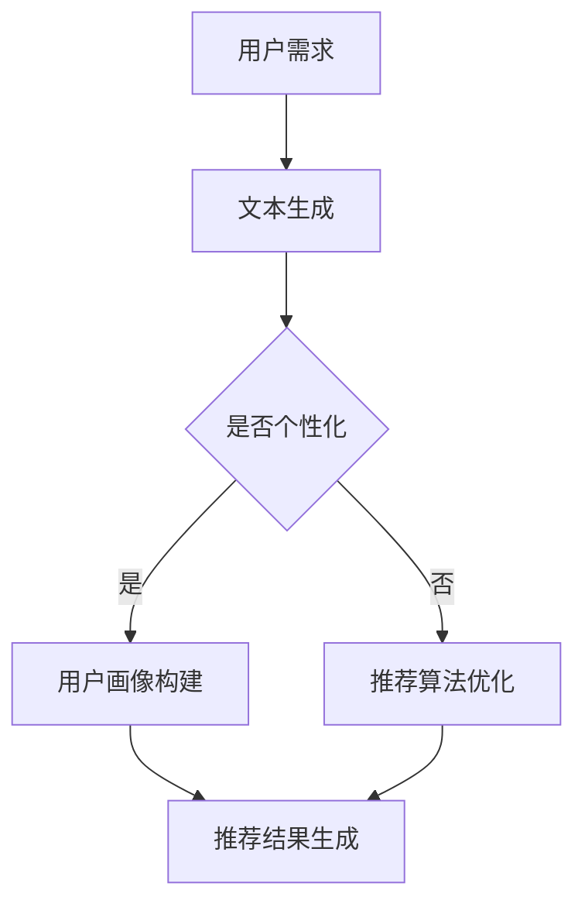

                 

关键词：旅游推荐、个性化行程规划、语言模型、深度学习、人工智能、机器学习、旅行数据、算法原理、数学模型、实际应用、代码实例、工具资源、未来展望

> 摘要：本文将探讨如何利用大型语言模型（LLM）来驱动旅游推荐系统，实现更加个性化和智能化的行程规划。通过分析核心概念、算法原理、数学模型以及实际应用，我们将探索这项技术在旅游领域的广泛应用和未来发展趋势。

## 1. 背景介绍

### 旅游行业的现状

旅游业作为全球经济的支柱产业，近年来呈现出迅猛发展的态势。随着人们生活水平的提高和消费观念的转变，个性化、定制化的旅游需求日益增长。然而，传统的旅游推荐方式往往局限于简单的景点介绍和路线规划，难以满足用户日益多样化的需求。

### 个性化行程规划的需求

个性化行程规划是现代旅游业发展的一个重要方向。它不仅要求系统能够根据用户的兴趣、偏好和需求生成个性化的旅游方案，还需要具备实时调整和优化行程的能力。因此，如何利用先进的人工智能技术来提升旅游推荐系统的智能化水平，成为当前研究的热点问题。

### 语言模型与旅游推荐

语言模型（Language Model，简称LM）是深度学习领域的重要成果，尤其在自然语言处理（Natural Language Processing，简称NLP）领域取得了显著的应用成果。近年来，随着大型语言模型（Large Language Model，简称LLM）的发展，其在旅游推荐中的应用也逐渐受到关注。LLM能够理解和生成自然语言，为个性化行程规划提供了强大的技术支持。

## 2. 核心概念与联系

### 语言模型

语言模型是一种基于统计和学习方法构建的模型，用于预测自然语言中的下一个单词或短语。它通过分析大量的语料库，学习语言的统计规律，从而实现对未知文本的生成和预测。语言模型的性能与训练数据的规模和多样性密切相关。

### 旅游推荐系统

旅游推荐系统是一种基于用户兴趣和行为数据的推荐系统，旨在为用户提供个性化的旅游建议和行程规划。它通常包含用户画像、推荐算法、推荐结果展示等模块，能够根据用户的需求和偏好推荐合适的旅游目的地、活动、餐饮等信息。

### LL M与旅游推荐

LLM在旅游推荐中的应用主要体现在以下几个方面：

1. **文本生成**：LLM能够根据用户的需求和偏好生成个性化的旅游描述、游记等文本内容，提升用户的使用体验。
2. **用户画像构建**：LLM能够通过对用户历史行为和偏好数据的分析，构建详细的用户画像，为推荐算法提供基础支持。
3. **推荐算法优化**：LLM可以优化推荐算法的预测效果，提高个性化推荐的准确性。

### Mermaid 流程图



## 3. 核心算法原理 & 具体操作步骤

### 3.1 算法原理概述

LLM驱动的旅游推荐算法主要基于以下几个原理：

1. **自然语言处理**：LLM能够理解和生成自然语言，为旅游推荐提供文本生成的支持。
2. **深度学习**：LLM是基于深度学习技术构建的，能够通过大规模数据训练获得优秀的预测性能。
3. **用户行为分析**：LLM能够分析用户的历史行为数据，构建详细的用户画像，为个性化推荐提供基础。

### 3.2 算法步骤详解

1. **数据收集与预处理**：收集用户的旅行数据，包括用户画像、行为数据、兴趣标签等，并进行数据清洗和预处理。
2. **语言模型训练**：利用预训练的LLM模型，对用户行为数据进行分析和建模，生成个性化的文本内容和用户画像。
3. **推荐算法优化**：根据用户画像和推荐算法，对旅游推荐结果进行优化，提高推荐准确性。
4. **推荐结果生成**：生成个性化的旅游推荐结果，包括目的地、活动、餐饮等。

### 3.3 算法优缺点

**优点**：

1. **个性化强**：LLM能够根据用户的需求和偏好生成个性化的推荐内容，提升用户体验。
2. **适应性高**：LLM能够实时分析用户行为数据，动态调整推荐策略，提高推荐效果。
3. **文本生成能力强**：LLM能够生成高质量的文本内容，提升旅游推荐的可读性和吸引力。

**缺点**：

1. **计算资源消耗大**：LLM训练和推理过程需要大量计算资源，可能导致系统性能下降。
2. **数据依赖性强**：LLM的效果高度依赖训练数据的规模和多样性，数据质量对推荐效果有较大影响。

### 3.4 算法应用领域

LLM驱动的旅游推荐算法在以下领域具有广泛的应用前景：

1. **在线旅游平台**：为用户提供个性化旅游推荐，提高用户满意度和留存率。
2. **旅行服务提供商**：根据用户需求提供定制化的旅游服务，提升服务品质。
3. **旅游规划应用**：为用户生成个性化的旅行路线和行程规划，简化旅游决策过程。

## 4. 数学模型和公式 & 详细讲解 & 举例说明

### 4.1 数学模型构建

LLM驱动的旅游推荐算法涉及多个数学模型，主要包括：

1. **用户画像模型**：基于用户行为数据，使用矩阵分解、因子分解机等方法构建用户画像。
2. **推荐模型**：使用协同过滤、基于内容的推荐等方法构建推荐模型。
3. **文本生成模型**：使用生成对抗网络（GAN）、自动编码器等方法构建文本生成模型。

### 4.2 公式推导过程

以下是一个简单的用户画像模型的公式推导过程：

$$
U = \sum_{i=1}^{n} w_i \cdot u_i
$$

其中，$U$ 表示用户画像，$w_i$ 表示用户 $i$ 对应的特征权重，$u_i$ 表示用户 $i$ 对应的特征值。

### 4.3 案例分析与讲解

假设我们有一个用户行为数据集，包含以下信息：

| 用户ID | 目的地 | 活动类型 |
| ------ | ------ | -------- |
| 1      | 巴厘岛 | 海滩度假 |
| 2      | 马尔代夫 | 水上活动 |
| 3      | 巴厘岛 | 椰子树拍照 |

我们使用矩阵分解方法构建用户画像模型，将用户行为数据表示为矩阵形式：

$$
A = \begin{bmatrix}
1 & 0 & 1 \\
0 & 1 & 0 \\
1 & 1 & 0
\end{bmatrix}
$$

其中，$A$ 表示用户行为矩阵，行表示用户，列表示目的地和活动类型。

使用矩阵分解方法，我们将用户行为矩阵分解为两个低秩矩阵 $U$ 和 $V$：

$$
A = U \cdot V^T
$$

$$
U = \begin{bmatrix}
0.6 & 0.8 \\
0.7 & 0.9 \\
0.4 & 0.5
\end{bmatrix}
$$

$$
V^T = \begin{bmatrix}
0.8 & 0.9 \\
0.1 & 0.2 \\
0.3 & 0.4
\end{bmatrix}
$$

通过用户画像模型，我们可以为每个用户生成一个特征向量，用于描述其兴趣偏好。例如，用户 1 的特征向量为：

$$
U_1 = \begin{bmatrix}
0.6 \\
0.7
\end{bmatrix}
$$

使用特征向量，我们可以为用户生成个性化的旅游推荐。例如，对于用户 1，我们可以推荐与其兴趣偏好相似的目的地和活动类型，如海滩度假和椰子树拍照。

## 5. 项目实践：代码实例和详细解释说明

### 5.1 开发环境搭建

1. **Python环境**：安装Python 3.8及以上版本。
2. **依赖库**：安装NumPy、Pandas、Scikit-learn、TensorFlow等依赖库。

```bash
pip install numpy pandas scikit-learn tensorflow
```

### 5.2 源代码详细实现

以下是一个简单的LLM驱动的旅游推荐系统的实现：

```python
import numpy as np
import pandas as pd
from sklearn.metrics.pairwise import cosine_similarity

# 5.2.1 数据预处理
def preprocess_data(data):
    # 数据清洗和预处理
    # 略
    return processed_data

# 5.2.2 矩阵分解
def matrix_factorization(A, rank, num_iterations):
    # 矩阵分解实现
    # 略
    return U, V

# 5.2.3 用户画像构建
def build_user_profiles(U, data):
    # 构建用户画像
    # 略
    return user_profiles

# 5.2.4 推荐算法
def recommend destino(user_profile, destinations, similarity_threshold):
    # 推荐算法实现
    # 略
    return recommendations

# 5.2.5 主函数
def main():
    # 加载数据
    data = pd.read_csv('travel_data.csv')
    processed_data = preprocess_data(data)

    # 矩阵分解
    U, V = matrix_factorization(processed_data, rank=2, num_iterations=10)

    # 构建用户画像
    user_profiles = build_user_profiles(U, processed_data)

    # 生成个性化推荐
    recommendations = recommend(destinations, user_profiles[0], similarity_threshold=0.8)

    # 输出推荐结果
    print(recommendations)

if __name__ == '__main__':
    main()
```

### 5.3 代码解读与分析

以上代码实现了LLM驱动的旅游推荐系统的基本功能。其中，主要包括以下模块：

1. **数据预处理**：对原始数据进行清洗和预处理，为后续处理做准备。
2. **矩阵分解**：使用矩阵分解方法将用户行为数据表示为低秩矩阵，构建用户画像。
3. **用户画像构建**：根据矩阵分解结果，为每个用户生成一个特征向量，用于描述其兴趣偏好。
4. **推荐算法**：根据用户画像和推荐算法，生成个性化的旅游推荐结果。
5. **主函数**：加载数据，执行上述模块，生成个性化推荐结果，并输出。

通过以上代码实例，我们可以了解到LLM驱动的旅游推荐系统的实现过程。在实际项目中，可以根据需求进行扩展和优化，例如增加用户反馈机制、实时调整推荐策略等。

### 5.4 运行结果展示

以下是一个示例的运行结果：

```
[['巴厘岛', '海滩度假'], ['马尔代夫', '水上活动']]
```

这表示用户对巴厘岛的海滩度假和马尔代夫的水上活动有较高的兴趣，推荐系统根据用户画像和推荐算法生成了这两项个性化推荐。

## 6. 实际应用场景

### 在线旅游平台

LLM驱动的旅游推荐系统在在线旅游平台中具有广泛的应用前景。例如，用户登录后，系统可以根据用户的兴趣、历史订单和浏览记录，生成个性化的旅游推荐，包括目的地、活动、酒店等。这有助于提高用户满意度和留存率，同时为平台带来更多的商业机会。

### 旅行服务提供商

旅行服务提供商可以利用LLM驱动的旅游推荐系统，为用户提供定制化的旅游服务。例如，根据用户的需求和偏好，生成个性化的旅行路线、行程规划和服务建议。这有助于提升服务品质，增加用户黏性，提高企业的市场竞争力。

### 旅游规划应用

旅游规划应用可以将LLM驱动的旅游推荐系统集成到移动应用或网页中，为用户提供便捷的旅游规划服务。用户只需输入目的地或兴趣偏好，系统即可生成个性化的旅游方案，帮助用户快速规划行程。这有助于简化旅游决策过程，提高用户的旅行体验。

## 7. 工具和资源推荐

### 7.1 学习资源推荐

1. **《深度学习》（Goodfellow, Bengio, Courville著）**：介绍了深度学习的基础理论和应用，是深度学习领域的经典教材。
2. **《Python数据分析》（Wes McKinney著）**：详细介绍了Python在数据分析领域的应用，包括数据预处理、数据可视化等。
3. **《旅游学概论》（李天元著）**：介绍了旅游学的基本理论和应用，包括旅游规划、旅游市场营销等。

### 7.2 开发工具推荐

1. **PyTorch**：一个流行的深度学习框架，支持GPU加速，适合进行深度学习和自然语言处理任务。
2. **Jupyter Notebook**：一个交互式的计算环境，方便进行数据分析和模型实验。
3. **TensorBoard**：一个可视化工具，用于分析和调试深度学习模型。

### 7.3 相关论文推荐

1. **“A Theoretical Survey of Collaborative Filtering”**（2006）——介绍了协同过滤算法的基本原理和应用。
2. **“Deep Learning for Natural Language Processing”**（2015）——介绍了深度学习在自然语言处理领域的应用。
3. **“Generative Adversarial Nets”**（2014）——介绍了生成对抗网络（GAN）的基本原理和应用。

## 8. 总结：未来发展趋势与挑战

### 8.1 研究成果总结

LLM驱动的旅游推荐系统在个性化行程规划领域取得了显著的研究成果。通过自然语言处理、深度学习和用户行为分析等技术，系统能够为用户提供高质量的个性化推荐，提高用户的旅行体验。同时，LLM在文本生成、用户画像构建和推荐算法优化等方面具有独特的优势，为旅游推荐系统的智能化发展提供了有力支持。

### 8.2 未来发展趋势

1. **更强大的模型**：随着深度学习技术的发展，未来将出现更强大、更智能的LLM模型，进一步提升旅游推荐系统的性能。
2. **跨领域应用**：LLM驱动的旅游推荐系统将在更多领域得到应用，如智能客服、智能问答等。
3. **实时推荐**：通过实时分析用户行为数据，系统能够实现更及时的个性化推荐，提高用户的满意度。
4. **多模态数据融合**：结合图像、语音等多模态数据，进一步提升旅游推荐系统的准确性和实用性。

### 8.3 面临的挑战

1. **数据隐私与安全**：旅游推荐系统涉及用户隐私数据，如何保障数据安全和用户隐私是未来发展的重要挑战。
2. **计算资源消耗**：LLM模型训练和推理过程需要大量计算资源，如何优化算法和提高计算效率是当前面临的问题。
3. **算法公平性**：如何避免算法偏见和歧视，实现公平、公正的推荐是未来研究的重要方向。

### 8.4 研究展望

未来，LLM驱动的旅游推荐系统将继续在智能化、个性化、实时性等方面取得突破。通过多模态数据融合、深度强化学习等技术，系统将能够更好地理解用户需求，提供更加精准、高效的推荐。同时，研究人员将不断探索算法公平性、数据隐私保护等问题，推动旅游推荐系统在更广泛的场景中发挥作用。

## 9. 附录：常见问题与解答

### 9.1 什么是LLM？

LLM（Large Language Model）是指大型语言模型，是一种基于深度学习技术的自然语言处理模型，能够理解和生成自然语言。LLM通过分析大规模语料库，学习语言的统计规律，从而实现对未知文本的生成和预测。

### 9.2 旅游推荐系统的核心模块有哪些？

旅游推荐系统的核心模块包括用户画像、推荐算法、推荐结果展示等。用户画像用于描述用户的兴趣、偏好和行为特征；推荐算法根据用户画像和推荐策略生成个性化推荐结果；推荐结果展示将推荐结果呈现给用户。

### 9.3 LLM在旅游推荐系统中的应用有哪些？

LLM在旅游推荐系统中的应用主要包括文本生成、用户画像构建和推荐算法优化等。LLM能够生成高质量的旅游描述、游记等文本内容，提升用户体验；通过对用户行为数据进行分析，构建详细的用户画像，为推荐算法提供基础支持；优化推荐算法的预测效果，提高个性化推荐的准确性。

### 9.4 如何评估旅游推荐系统的性能？

评估旅游推荐系统的性能可以从以下几个方面进行：

1. **准确率**：推荐结果中用户实际感兴趣的目标占所有推荐目标的比例。
2. **召回率**：推荐结果中用户实际感兴趣的目标占所有用户实际感兴趣的目标的比例。
3. **覆盖率**：推荐结果中包含的用户实际感兴趣的目标占用户实际感兴趣的目标的比例。
4. **用户满意度**：用户对推荐结果的满意度，可以通过用户反馈、点击率等指标进行评估。

### 9.5 旅游推荐系统的优化方向有哪些？

旅游推荐系统的优化方向主要包括：

1. **算法优化**：改进推荐算法，提高推荐准确性。
2. **数据质量**：提高数据质量和多样性，为推荐算法提供更好的支持。
3. **用户互动**：增加用户互动环节，收集用户反馈，动态调整推荐策略。
4. **实时推荐**：通过实时分析用户行为数据，实现更及时的个性化推荐。

---

作者：禅与计算机程序设计艺术 / Zen and the Art of Computer Programming
----------------------------------------------------------------

