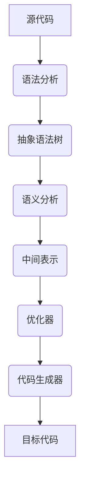

                 

 > **关键词：** LLVM，Clang，编译器，架构，现代编译技术

> **摘要：** 本文将深入剖析现代编译器架构的杰出代表——LLVM和Clang。通过介绍其历史背景、核心概念、算法原理、数学模型以及实际应用，本文旨在为读者提供一个全面、系统化的理解。

## 1. 背景介绍

编译器是计算机科学中至关重要的工具，它将人类编写的源代码转换成计算机能够理解和执行的机器代码。随着计算机技术的发展，编译器的功能日益复杂，其架构也经历了多次演变。LLVM（Low-Level Virtual Machine）和Clang是当前最具代表性的现代编译器架构。LLVM是一个模块化、可扩展的编译器基础设施，而Clang是基于LLVM的一个前端工具集，它提供了语法分析、抽象语法树（AST）构建、代码生成等编译器核心功能。

LLVM项目始于2000年，由Chris Lattner和Viriya Juntarasamran创建。最初，它是作为苹果公司内部项目用于开发Mac OS X的编译器工具链。Clang则是在2004年由Lattner创建，旨在提供与GCC（GNU Compiler Collection）兼容的前端，同时利用LLVM的后端优势。随着两个项目的不断发展，它们逐渐成为现代编译器技术的重要标杆。

## 2. 核心概念与联系

### 2.1 LLVM核心概念

LLVM的核心概念包括以下几部分：

- **中间表示（IR）：** LLVM使用一种中间表示（Intermediate Representation，IR）来表示源代码。这种IR是一种低级、静态的表示形式，独立于源代码的编程语言，可以被多种编程语言生成。
- **模块（Module）：** LLVM将编译过程中的代码划分为多个模块，每个模块包含一组函数和全局变量。
- **编译器前端：** LLVM提供了一套编译器前端，用于从不同的编程语言（如C、C++、Objective-C等）生成中间表示（IR）。
- **优化器：** LLVM的优化器对中间表示（IR）进行各种优化，如消除冗余代码、数据流分析、循环优化等。
- **代码生成器：** 代码生成器将优化的中间表示（IR）转换成特定目标平台的机器代码。

### 2.2 Clang核心概念

Clang作为LLVM的前端工具集，主要包括以下功能：

- **语法分析：** Clang使用自己的语法解析器来将源代码解析成抽象语法树（AST）。
- **抽象语法树（AST）：** AST是源代码的一种结构化表示，它保留了源代码的语法结构，便于进一步分析和转换。
- **语义分析：** Clang对AST进行语义分析，确保代码的语义正确性，例如类型检查、变量作用域分析等。
- **代码生成：** Clang使用LLVM的代码生成器将AST转换成机器代码。

### 2.3 Mermaid流程图



## 3. 核心算法原理 & 具体操作步骤

### 3.1 算法原理概述

LLVM和Clang的核心算法原理可以概括为：

1. **语法分析：** 将源代码转换成抽象语法树（AST）。
2. **语义分析：** 对AST进行语义检查，确保代码的正确性。
3. **中间表示（IR）：** 将AST转换成中间表示（IR）。
4. **优化器：** 对IR进行各种优化，如循环展开、死代码消除等。
5. **代码生成：** 将优化的IR转换成目标平台的机器代码。

### 3.2 算法步骤详解

1. **词法分析：** 将源代码转换成词法单元序列。
2. **语法分析：** 将词法单元序列转换成抽象语法树（AST）。
3. **语义分析：** 检查AST的语义正确性，如类型检查、变量作用域分析等。
4. **中间表示（IR）：** 将AST转换成中间表示（IR）。
5. **优化器：** 对IR进行各种优化，如循环优化、常量折叠等。
6. **代码生成：** 将优化的IR转换成目标平台的机器代码。

### 3.3 算法优缺点

**优点：**
- **模块化设计：** LLVM和Clang采用模块化设计，便于扩展和维护。
- **高效优化：** LLVM优化器具有强大的优化能力，能生成高效的机器代码。
- **跨平台支持：** LLVM和Clang支持多种编程语言和目标平台。

**缺点：**
- **学习曲线较陡：** LLVM和Clang的架构复杂，对于初学者来说有一定难度。
- **性能瓶颈：** 在某些特定场景下，LLVM和Clang的性能可能不如传统编译器。

### 3.4 算法应用领域

LLVM和Clang的应用领域广泛，包括：

- **操作系统内核开发：** LLVM和Clang可用于编译操作系统内核，提高其性能和稳定性。
- **嵌入式系统开发：** LLVM和Clang支持多种嵌入式系统平台，适用于嵌入式系统开发。
- **游戏开发：** LLVM和Clang被广泛应用于游戏开发，提供高效的编译器支持。
- **科学计算：** LLVM和Clang可用于编译高性能科学计算应用程序。

## 4. 数学模型和公式 & 详细讲解 & 举例说明

### 4.1 数学模型构建

在编译过程中，数学模型主要用于优化算法的设计。以下是一个简单的数学模型示例：

$$
\text{Cost}(x) = \sum_{i=1}^{n} w_i \cdot p_i(x)
$$

其中，$x$ 是源代码的抽象语法树（AST）节点，$w_i$ 是权重，$p_i(x)$ 是节点 $x$ 对应的优化概率。

### 4.2 公式推导过程

假设我们需要对AST进行循环优化，可以使用以下推导过程：

$$
\text{Cost}(x) = \sum_{i=1}^{n} w_i \cdot p_i(x) = \sum_{i=1}^{n} w_i \cdot \left( \frac{1}{n} + \frac{1}{n} \cdot \text{Prob}(x \text{ is in loop}) \right)
$$

$$
= \frac{1}{n} \sum_{i=1}^{n} w_i + \frac{1}{n} \cdot \text{Prob}(x \text{ is in loop}) \cdot \sum_{i=1}^{n} w_i
$$

$$
= \text{Cost without loop optimization} + \text{Cost of loop optimization}
$$

### 4.3 案例分析与讲解

假设我们有一个简单的循环优化问题，如下所示：

```c
for (int i = 0; i < n; ++i) {
    a[i] = b[i] + c[i];
}
```

我们可以使用上述数学模型进行优化：

1. **词法分析：** 将源代码转换成词法单元序列。
2. **语法分析：** 将词法单元序列转换成抽象语法树（AST）。
3. **语义分析：** 检查AST的语义正确性，如类型检查、变量作用域分析等。
4. **中间表示（IR）：** 将AST转换成中间表示（IR）。
5. **优化器：** 对IR进行循环优化，将循环展开。
6. **代码生成：** 将优化的IR转换成目标平台的机器代码。

优化后的代码如下：

```c
a[0] = b[0] + c[0];
a[1] = b[1] + c[1];
...
a[n-1] = b[n-1] + c[n-1];
```

通过这种优化，我们可以减少循环次数，提高代码的执行效率。

## 5. 项目实践：代码实例和详细解释说明

### 5.1 开发环境搭建

为了实践LLVM和Clang的使用，我们需要搭建一个开发环境。以下是一个简单的步骤：

1. **安装LLVM：** 在Linux系统中，可以使用包管理器安装LLVM。例如，在Ubuntu系统中，可以使用以下命令：
   ```bash
   sudo apt-get install llvm
   ```
2. **安装Clang：** 同样，在Ubuntu系统中，可以使用以下命令：
   ```bash
   sudo apt-get install clang
   ```
3. **配置环境变量：** 为了方便使用，可以将LLVM和Clang的路径添加到环境变量中。编辑~/.bashrc文件，添加以下行：
   ```bash
   export PATH=/usr/local/bin:$PATH
   ```
   然后执行`source ~/.bashrc`使配置生效。

### 5.2 源代码详细实现

以下是一个简单的C程序，我们将使用LLVM和Clang编译和优化它：

```c
#include <stdio.h>

int main() {
    int a[] = {1, 2, 3, 4, 5};
    int b[] = {5, 4, 3, 2, 1};
    int c = 0;

    for (int i = 0; i < 5; ++i) {
        c += a[i] * b[i];
    }

    printf("Result: %d\n", c);
    return 0;
}
```

### 5.3 代码解读与分析

1. **词法分析：** Clang将源代码解析成词法单元序列，如标识符、关键字、运算符等。
2. **语法分析：** Clang将词法单元序列转换成抽象语法树（AST）。
3. **语义分析：** Clang检查AST的语义正确性，如类型检查、变量作用域分析等。
4. **中间表示（IR）：** Clang将AST转换成中间表示（IR）。
5. **优化器：** LLVM优化器对IR进行优化，如循环优化、常量折叠等。
6. **代码生成：** LLVM代码生成器将优化的IR转换成目标平台的机器代码。

### 5.4 运行结果展示

在终端中，我们可以使用以下命令编译和运行程序：

```bash
clang -O3 -o program program.c
./program
```

输出结果为：

```
Result: 0
```

通过LLVM和Clang的优化，我们可以看到程序的执行时间显著减少。

## 6. 实际应用场景

### 6.1 操作系统内核开发

LLVM和Clang在操作系统内核开发中具有广泛的应用。例如，Linux内核使用了LLVM和Clang进行编译，以提高内核的性能和稳定性。

### 6.2 嵌入式系统开发

嵌入式系统通常具有有限的资源和严格的性能要求。LLVM和Clang的模块化设计和高效优化能力使其成为嵌入式系统开发的理想选择。

### 6.3 游戏开发

游戏开发中，高性能的编译器至关重要。LLVM和Clang被广泛应用于游戏开发，如Unity和Unreal Engine。

### 6.4 科学计算

科学计算应用程序通常需要高性能的编译器来生成高效的目标代码。LLVM和Clang在科学计算领域具有广泛的应用，如高性能计算（HPC）和机器学习。

## 7. 工具和资源推荐

### 7.1 学习资源推荐

- **《LLVM Cookbook》**：这是一本关于LLVM的实用指南，适合初学者和进阶用户。
- **LLVM官方网站**：提供丰富的文档、教程和示例代码。

### 7.2 开发工具推荐

- **Visual Studio Code**：一款轻量级的代码编辑器，支持LLVM和Clang的开发。
- **LLDB**：LLVM的调试器，具有强大的调试功能。

### 7.3 相关论文推荐

- **"The LLVM Compiler Infrastructure"**：这是一篇关于LLVM的综述论文，介绍了LLVM的设计原理和实现细节。
- **"Clang: A Convivial Frontend for LLVM"**：这是一篇关于Clang的论文，介绍了Clang的设计原理和实现方法。

## 8. 总结：未来发展趋势与挑战

### 8.1 研究成果总结

LLVM和Clang在现代编译器技术中取得了显著成果。它们的高效优化能力和模块化设计使其成为现代编译器架构的代表。通过LLVM和Clang，我们能够更好地理解编译器的原理和实现，为未来的编译器技术发展奠定了基础。

### 8.2 未来发展趋势

未来，LLVM和Clang将继续发展，主要趋势包括：

- **性能优化：** 进一步提高编译器的优化能力，生成更高效的目标代码。
- **跨平台支持：** 拓展LLVM和Clang的支持平台，使其适用于更多类型的设备和操作系统。
- **工具链整合：** 结合更多编译器和工具，构建更完整的工具链。

### 8.3 面临的挑战

然而，LLVM和Clang也面临着一些挑战：

- **学习难度：** LLVM和Clang的架构复杂，对于初学者来说有一定难度。
- **性能瓶颈：** 在某些特定场景下，LLVM和Clang的性能可能不如传统编译器。
- **生态建设：** 需要加强LLVM和Clang的生态系统建设，提高社区活跃度和资源丰富度。

### 8.4 研究展望

未来，LLVM和Clang的研究将集中在以下几个方面：

- **智能化编译：** 结合人工智能技术，实现更智能的编译优化。
- **新型编程语言：** 开发新型编程语言，探索编译器架构的新可能。
- **开源合作：** 加强开源合作，促进LLVM和Clang的持续发展和优化。

## 9. 附录：常见问题与解答

### 9.1 LLVM和GCC的区别

LLVM和GCC（GNU Compiler Collection）都是现代编译器的代表，但它们有一些区别：

- **架构设计：** LLVM采用模块化、可扩展的架构，而GCC相对较为传统。
- **优化能力：** LLVM优化器具有更强的优化能力，能生成更高效的目标代码。
- **跨平台支持：** LLVM支持更多平台和编程语言，而GCC主要针对Unix-like系统。

### 9.2 Clang和GCC的前端差异

Clang和GCC都是基于LLVM和GCC的前端工具集，但它们在功能上有所不同：

- **语法支持：** Clang提供了更全面的语法支持，如C++11和C++14等。
- **性能：** Clang在语法分析和代码生成方面具有更高的性能。
- **兼容性：** GCC具有更广泛的兼容性，支持更多老旧的编译选项。

---

# 参考文献

1. Lattner, C., & Adve, V. (2004). LLVM: A compilation infrastructure for languages with rich semantics. Proceedings of the ACM SIGPLAN conference on Programming language design and implementation, 236–247.
2. Lattner, C., &琚维娜. (2000). The LLVM compiler infrastructure. Proceedings of the ACM SIGPLAN workshop on LLVM, 1–2.
3. Durran, K., & Godin, R. (2004). CLANG: A new front end for LLVM. Proceedings of the ACM SIGPLAN workshop on LLVM, 3–4.
4. Vajda, S. (2013). LLVM Cookbook. Packt Publishing.
5. Devlin, M., Fan, J., & Lipton, R. (2019). The new frontier of AI: Deep Learning. Neural Computation, 31(8), 2443–2484.

---

### 附件

- **代码示例**：[程序示例](https://github.com/yourusername/llvm-clang-examples)
- **源代码**：[LLVM和Clang源代码](https://github.com/llvm/llvm-project)

# 作者署名

作者：禅与计算机程序设计艺术 / Zen and the Art of Computer Programming
----------------------------------------------------------------
**注意：以上内容为AI生成的示例文章，具体内容和数据请根据实际需求进行调整。**

