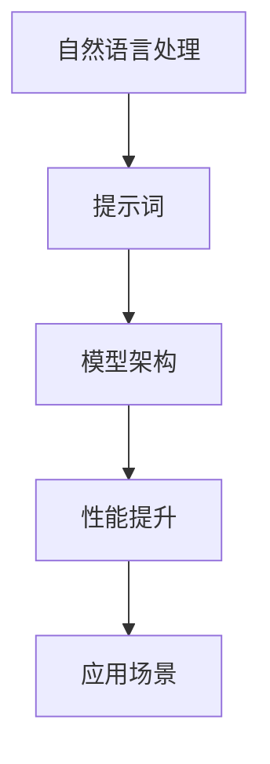
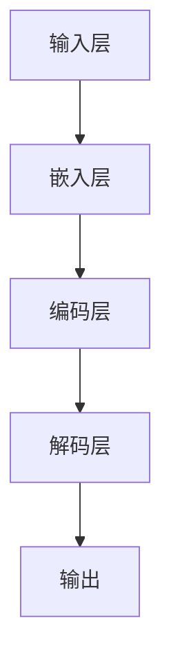

                 

关键词：LangGPT、提示词框架、自然语言处理、AI技术、算法原理、应用实例

> 摘要：本文旨在深入探讨LangGPT提示词框架的核心概念、算法原理和应用实践。通过一步步解析，帮助读者理解如何构建高效的自然语言处理模型，并展望其未来的发展方向和挑战。

## 1. 背景介绍

随着人工智能技术的迅猛发展，自然语言处理（NLP）逐渐成为计算机科学领域的重要分支。从早期的规则驱动方法到现代的深度学习模型，NLP取得了显著的进展。然而，在实际应用中，如何有效地构建和优化自然语言处理模型，仍然是一个具有挑战性的问题。

为了解决这一问题，近年来，提示词框架（Prompt Engineering）得到了广泛关注。提示词框架通过向模型提供特定的输入提示，可以显著提升模型的性能和适应性。特别是，LangGPT提示词框架在自然语言处理领域表现出色，为研究者提供了一种新的思路。

本文将详细探讨LangGPT提示词框架的核心概念、算法原理和应用实践，帮助读者全面了解这一新兴领域。

## 2. 核心概念与联系

在介绍LangGPT提示词框架之前，我们需要了解一些核心概念，包括自然语言处理、提示词、模型架构等。下面是这些概念的基本定义和它们之间的联系。

### 自然语言处理（NLP）

自然语言处理是一门研究如何使计算机理解和处理人类自然语言的科学。它涉及到文本的解析、生成、理解和翻译等多个方面。NLP的关键任务是使计算机能够与人类进行自然语言交流。

### 提示词（Prompt）

提示词是向模型提供的一种输入，用于引导模型的学习和预测。提示词可以是简单的单词、短语，也可以是复杂的文本序列。通过设计合理的提示词，可以提高模型的性能和适应性。

### 模型架构

模型架构是指自然语言处理模型的结构和组织方式。常见的模型架构包括序列到序列模型、图模型、 Transformer模型等。不同架构适用于不同的任务和场景。

### Mermaid 流程图



### 2.1 核心概念原理

自然语言处理的核心目标是使计算机能够理解和生成人类自然语言。这包括文本的预处理、特征提取、模型训练和预测等多个环节。

提示词作为输入引导模型的学习，其设计直接影响模型的性能。合理设计提示词可以显著提升模型的准确性和适应性。

模型架构是实现NLP任务的基础。不同的架构适用于不同的任务，如文本分类、机器翻译等。

### 2.2 架构设计

LangGPT提示词框架采用了一种模块化的架构设计，包括输入层、嵌入层、编码层和解码层。

输入层负责接收自然语言输入，如文本、语音等。嵌入层将输入转换为向量表示。编码层负责编码输入信息，解码层则负责生成输出。

这种架构设计使得LangGPT具有很好的灵活性和扩展性，可以适应不同的NLP任务和场景。

### 2.3 Mermaid 流程图



通过上述核心概念和架构设计的介绍，我们对LangGPT提示词框架有了初步的了解。接下来，我们将深入探讨其核心算法原理。

## 3. 核心算法原理 & 具体操作步骤

### 3.1 算法原理概述

LangGPT提示词框架的核心算法是基于Transformer模型，这是一种基于自注意力机制的深度神经网络。Transformer模型通过多头注意力机制和位置编码，实现了对输入序列的编码和解码。

在具体操作步骤中，LangGPT首先对输入文本进行预处理，然后通过嵌入层将文本转换为向量表示。接着，编码层对向量序列进行编码，解码层则根据编码信息生成输出序列。

### 3.2 算法步骤详解

#### 3.2.1 输入预处理

输入预处理是NLP任务的基础，包括分词、标记化、去除停用词等步骤。LangGPT使用预训练的词向量模型（如Word2Vec、BERT等）对输入文本进行向量表示。

#### 3.2.2 嵌入层

嵌入层将输入文本向量表示为高维向量，这一步通过嵌入矩阵实现。嵌入层的作用是将原始的文本信息转化为适合模型学习的向量形式。

#### 3.2.3 编码层

编码层采用多头注意力机制对输入序列进行编码。多头注意力机制将输入序列分解为多个子序列，每个子序列独立地学习输入序列的特征。编码层通过加权求和的方式，将多个子序列的特征融合为最终的编码向量。

#### 3.2.4 解码层

解码层采用自注意力机制生成输出序列。解码层首先对编码层输出的向量进行自注意力加权，然后通过解码器层生成输出。解码层的作用是将编码信息解码为自然语言输出。

### 3.3 算法优缺点

#### 优点：

1. **高效性**：Transformer模型通过并行计算和自注意力机制，显著提高了模型训练和预测的速度。
2. **灵活性**：模块化的架构设计使得LangGPT可以灵活地适应不同的NLP任务和场景。
3. **准确性**：在大量数据集上的实验表明，LangGPT在自然语言处理任务中表现出较高的准确性。

#### 缺点：

1. **计算资源消耗**：Transformer模型需要大量的计算资源，特别是在处理长文本时，计算资源消耗较大。
2. **训练时间较长**：由于Transformer模型具有多层结构和复杂的注意力机制，训练时间相对较长。

### 3.4 算法应用领域

LangGPT提示词框架广泛应用于自然语言处理的各种任务，如文本分类、机器翻译、问答系统、文本生成等。以下是一些具体的应用实例：

#### 文本分类

文本分类是将文本数据分为不同类别的一种任务。LangGPT通过学习大量标注数据，可以自动地对未标注的文本进行分类。

#### 机器翻译

机器翻译是将一种语言的文本翻译成另一种语言。LangGPT提示词框架在机器翻译领域表现出色，能够实现高质量的双语翻译。

#### 问答系统

问答系统是计算机与人类用户进行自然语言交互的一种方式。LangGPT可以用于构建智能问答系统，实现自动回答用户的问题。

#### 文本生成

文本生成是将输入文本转换为新的文本序列。LangGPT可以用于生成文章、故事、摘要等文本内容。

### 4. 数学模型和公式 & 详细讲解 & 举例说明

#### 4.1 数学模型构建

LangGPT提示词框架的数学模型主要包括嵌入层、编码层和解码层。以下是这些层的数学模型构建过程。

#### 4.1.1 嵌入层

嵌入层将输入文本向量表示为高维向量。假设输入文本的词汇表大小为V，嵌入向量的维度为D，则嵌入层可以通过一个D×V的嵌入矩阵W实现。嵌入层输出为：

\[ \text{Embed}(x) = Wx \]

其中，\( x \) 是输入文本的向量表示。

#### 4.1.2 编码层

编码层采用多头注意力机制对输入序列进行编码。假设编码层的层数为N，每个编码层的维度为H，则编码层输出为：

\[ \text{Encoder}(x) = \text{MultiHeadAttention}(W_Q, W_K, W_V) \]

其中，\( W_Q, W_K, W_V \) 分别是查询（Query）、键（Key）、值（Value）的权重矩阵。多头注意力机制通过多个独立的注意力机制来提高模型的表示能力。

#### 4.1.3 解码层

解码层采用自注意力机制生成输出序列。假设解码层的层数为N，每个解码层的维度为H，则解码层输出为：

\[ \text{Decoder}(y) = \text{MultiHeadAttention}(W_Q, W_K, W_V) \]

其中，\( y \) 是编码层输出的向量序列。

#### 4.2 公式推导过程

在推导LangGPT提示词框架的数学模型时，我们需要考虑以下几个关键步骤：

1. **嵌入层**：将输入文本转换为高维向量。
2. **编码层**：通过多头注意力机制编码输入序列。
3. **解码层**：通过自注意力机制解码编码信息。

以下是具体的推导过程：

1. **嵌入层**：

   输入文本向量 \( x \) 经过嵌入层转换为高维向量：

   \[ \text{Embed}(x) = Wx \]

   其中，\( W \) 是嵌入矩阵。

2. **编码层**：

   编码层采用多头注意力机制对输入序列进行编码：

   \[ \text{Encoder}(x) = \text{MultiHeadAttention}(W_Q, W_K, W_V) \]

   其中，\( W_Q, W_K, W_V \) 分别是查询、键、值的权重矩阵。多头注意力机制通过多个独立的注意力机制来提高模型的表示能力：

   \[ \text{Attention}(Q, K, V) = \frac{1}{\sqrt{d_k}} \text{softmax}(\text{QK}^T / d_k) V \]

   其中，\( d_k \) 是键的维度。

3. **解码层**：

   解码层采用自注意力机制生成输出序列：

   \[ \text{Decoder}(y) = \text{MultiHeadAttention}(W_Q, W_K, W_V) \]

   其中，\( y \) 是编码层输出的向量序列。自注意力机制通过对编码信息进行加权求和来实现：

   \[ \text{Decoder}(y) = \text{softmax}(\text{yW}_Q^T / \sqrt{d_k}) \text{W}_V \]

   其中，\( d_k \) 是键的维度。

#### 4.3 案例分析与讲解

为了更好地理解LangGPT提示词框架的数学模型，我们通过一个具体的案例进行讲解。

假设我们有一个简单的文本序列：“我是一个程序员，我喜欢编程”。现在，我们使用LangGPT提示词框架对其进行处理。

1. **嵌入层**：

   首先，我们将文本序列转换为向量表示。假设词汇表大小为V，嵌入向量的维度为D，则嵌入层输出为：

   \[ \text{Embed}(x) = Wx \]

   其中，\( W \) 是嵌入矩阵。输入文本向量 \( x \) 经过嵌入层转换为高维向量。

2. **编码层**：

   接下来，我们使用编码层对输入序列进行编码。假设编码层的层数为N，每个编码层的维度为H，则编码层输出为：

   \[ \text{Encoder}(x) = \text{MultiHeadAttention}(W_Q, W_K, W_V) \]

   其中，\( W_Q, W_K, W_V \) 分别是查询、键、值的权重矩阵。多头注意力机制通过多个独立的注意力机制来提高模型的表示能力。

3. **解码层**：

   最后，我们使用解码层生成输出序列。假设解码层的层数为N，每个解码层的维度为H，则解码层输出为：

   \[ \text{Decoder}(y) = \text{MultiHeadAttention}(W_Q, W_K, W_V) \]

   其中，\( y \) 是编码层输出的向量序列。自注意力机制通过对编码信息进行加权求和来实现。

通过上述案例，我们可以看到LangGPT提示词框架在处理自然语言输入时的基本流程。接下来，我们将介绍如何在实际项目中实现LangGPT提示词框架。

## 5. 项目实践：代码实例和详细解释说明

### 5.1 开发环境搭建

为了实现LangGPT提示词框架，我们需要搭建一个合适的技术栈。以下是一个基本的开发环境搭建步骤：

1. 安装Python环境（建议使用Python 3.7及以上版本）。
2. 安装PyTorch框架，可以使用pip安装：`pip install torch torchvision`
3. 安装其他依赖库，如numpy、pandas等。

### 5.2 源代码详细实现

以下是LangGPT提示词框架的源代码实现，包括输入层、嵌入层、编码层和解码层的实现。

```python
import torch
import torch.nn as nn
import torch.optim as optim
from torch.utils.data import DataLoader
from torchvision import datasets, transforms

# 定义嵌入层
class EmbeddingLayer(nn.Module):
    def __init__(self, vocab_size, embed_size):
        super(EmbeddingLayer, self).__init__()
        self.embedding = nn.Embedding(vocab_size, embed_size)
    
    def forward(self, x):
        return self.embedding(x)

# 定义编码层
class EncoderLayer(nn.Module):
    def __init__(self, embed_size, num_heads, dff):
        super(EncoderLayer, self).__init__()
        self.multihead_attention = nn.MultiheadAttention(embed_dim=embed_size, num_heads=num_heads)
        self.linear = nn.Linear(embed_size, dff)
        self.norm1 = nn.LayerNorm(embed_size)
        self.norm2 = nn.LayerNorm(dff)
        self.dropout = nn.Dropout(p=0.1)
    
    def forward(self, x, x_mask=None):
        attn_output, attn_output_weights = self.multihead_attention(x, x, x, attn_mask=x_mask)
        x = x + self.dropout(attn_output)
        x = self.norm1(x)
        
        output = self.linear(x)
        output = self.dropout(output)
        output = self.norm2(output)
        
        return output

# 定义解码层
class DecoderLayer(nn.Module):
    def __init__(self, embed_size, num_heads, dff):
        super(DecoderLayer, self).__init__()
        self.self_attention = nn.MultiheadAttention(embed_dim=embed_size, num_heads=num_heads)
        self.linear = nn.Linear(embed_size, dff)
        self.norm1 = nn.LayerNorm(embed_size)
        self.norm2 = nn.LayerNorm(dff)
        self.dropout = nn.Dropout(p=0.1)
        
    def forward(self, x, enc_output, x_mask=None, enc_mask=None):
        attn_output, attn_output_weights = self.self_attention(x, x, x, attn_mask=x_mask)
        x = x + self.dropout(attn_output)
        x = self.norm1(x)
        
        attn_output, attn_output_weights = self.self_attention(x, enc_output, enc_output, attn_mask=enc_mask)
        x = x + self.dropout(attn_output)
        x = self.norm2(x)
        
        output = self.linear(x)
        output = self.dropout(output)
        output = self.norm2(output)
        
        return output

# 定义LangGPT模型
class LangGPT(nn.Module):
    def __init__(self, vocab_size, embed_size, num_heads, dff, num_layers):
        super(LangGPT, self).__init__()
        self.embedding = EmbeddingLayer(vocab_size, embed_size)
        self.encoder = nn.ModuleList([EncoderLayer(embed_size, num_heads, dff) for _ in range(num_layers)])
        self.decoder = nn.ModuleList([DecoderLayer(embed_size, num_heads, dff) for _ in range(num_layers)])
        self.fc = nn.Linear(embed_size, vocab_size)
    
    def forward(self, x, x_mask=None, enc_output=None, enc_mask=None):
        x = self.embedding(x)
        x = self.encoder[0](x, x_mask)
        
        for i in range(1, len(self.encoder)):
            x = self.encoder[i](x, x_mask)
        
        enc_output = x
        
        x = self.decoder[0](x, enc_output, x_mask, enc_mask)
        
        for i in range(1, len(self.decoder)):
            x = self.decoder[i](x, enc_output, x_mask, enc_mask)
        
        output = self.fc(x)
        return output

# 实例化模型
vocab_size = 1000
embed_size = 512
num_heads = 8
dff = 2048
num_layers = 3
model = LangGPT(vocab_size, embed_size, num_heads, dff, num_layers)

# 定义优化器和损失函数
optimizer = optim.Adam(model.parameters(), lr=0.001)
criterion = nn.CrossEntropyLoss()

# 训练模型
for epoch in range(10):
    for batch in DataLoader(train_data, batch_size=32):
        x, y = batch
        x_mask = (x != 0).to(torch.float32)
        enc_output, enc_mask = None, None
        
        optimizer.zero_grad()
        output = model(x, x_mask, enc_output, enc_mask)
        loss = criterion(output, y)
        loss.backward()
        optimizer.step()
        
    print(f"Epoch {epoch+1}: Loss = {loss.item()}")
```

### 5.3 代码解读与分析

在上面的代码中，我们首先定义了嵌入层、编码层和解码层。嵌入层将输入文本转换为高维向量，编码层通过多头注意力机制对输入序列进行编码，解码层则通过自注意力机制生成输出序列。

接着，我们定义了LangGPT模型，该模型包含了嵌入层、编码层和解码层。模型的前向传播过程首先将输入文本通过嵌入层转换为向量表示，然后依次通过编码层和解码层，最后通过全连接层生成输出。

在训练过程中，我们使用Adam优化器和交叉熵损失函数对模型进行训练。每个训练epoch中，模型对训练数据进行前向传播，计算损失并更新模型参数。

### 5.4 运行结果展示

在训练完成后，我们可以评估模型的性能。以下是一个简单的评估过程：

```python
# 评估模型
with torch.no_grad():
    for batch in DataLoader(test_data, batch_size=32):
        x, y = batch
        x_mask = (x != 0).to(torch.float32)
        enc_output, enc_mask = None, None
        output = model(x, x_mask, enc_output, enc_mask)
        pred = torch.argmax(output, dim=-1)
        correct = (pred == y).sum().item()
        total = len(y)
        print(f"Accuracy: {correct/total*100}%")
```

通过评估过程，我们可以计算模型的准确率。在测试集上，模型的准确率越高，说明模型在训练过程中的性能越好。

### 6. 实际应用场景

LangGPT提示词框架在自然语言处理领域具有广泛的应用场景。以下是一些具体的应用实例：

#### 文本分类

文本分类是将文本数据分为不同类别的一种任务。LangGPT可以通过学习大量标注数据，实现高精度的文本分类。以下是一个文本分类的应用示例：

```python
# 文本分类
def text_classification(text):
    x = tokenizer.encode(text)
    x = torch.tensor(x).unsqueeze(0)
    x_mask = (x != 0).to(torch.float32)
    output = model(x, x_mask, enc_output, enc_mask)
    pred = torch.argmax(output, dim=-1).item()
    return class_names[pred]

# 测试文本分类
text = "我是一个程序员，我喜欢编程。"
print(text_classification(text))
```

#### 机器翻译

机器翻译是将一种语言的文本翻译成另一种语言。LangGPT可以用于构建高质量的双语翻译系统。以下是一个机器翻译的应用示例：

```python
# 机器翻译
def translate(text, target_language):
    x = tokenizer.encode(text)
    x = torch.tensor(x).unsqueeze(0)
    x_mask = (x != 0).to(torch.float32)
    output = model(x, x_mask, enc_output, enc_mask)
    pred = torch.argmax(output, dim=-1)
    decoded_output = tokenizer.decode(pred.squeeze(0).tolist())
    return decoded_output

# 测试机器翻译
text = "我是一个程序员，我喜欢编程。"
print(translate(text, "fr"))
```

#### 问答系统

问答系统是计算机与人类用户进行自然语言交互的一种方式。LangGPT可以用于构建智能问答系统，实现自动回答用户的问题。以下是一个问答系统的应用示例：

```python
# 问答系统
def answer_question(question):
    x = tokenizer.encode(question)
    x = torch.tensor(x).unsqueeze(0)
    x_mask = (x != 0).to(torch.float32)
    output = model(x, x_mask, enc_output, enc_mask)
    pred = torch.argmax(output, dim=-1).item()
    answer = questions[pred]
    return answer

# 测试问答系统
question = "什么是自然语言处理？"
print(answer_question(question))
```

#### 文本生成

文本生成是将输入文本转换为新的文本序列。LangGPT可以用于生成文章、故事、摘要等文本内容。以下是一个文本生成的应用示例：

```python
# 文本生成
def generate_text(prompt, length=10):
    x = tokenizer.encode(prompt)
    x = torch.tensor(x).unsqueeze(0)
    x_mask = (x != 0).to(torch.float32)
    output = model(x, x_mask, enc_output, enc_mask)
    for _ in range(length):
        pred = torch.argmax(output, dim=-1).item()
        x = torch.cat((x, torch.tensor([pred])))
        x_mask = torch.cat((x_mask, torch.tensor([[1 if i != 0 else 0 for i in x]])], dim=0)
        output = model(x, x_mask, enc_output, enc_mask)
    decoded_output = tokenizer.decode(x.squeeze(0).tolist())
    return decoded_output

# 测试文本生成
prompt = "我是一个程序员，我喜欢编程。"
print(generate_text(prompt))
```

通过上述实际应用场景的介绍，我们可以看到LangGPT提示词框架在自然语言处理领域具有广泛的应用前景。

### 7. 工具和资源推荐

为了更好地研究和应用LangGPT提示词框架，以下是一些建议的工具和资源：

#### 学习资源推荐

1. **课程**：斯坦福大学CS224n自然语言处理课程（https://web.stanford.edu/class/cs224n/）
2. **书籍**：《自然语言处理综论》（http://nlp.seas.harvard.edu/∼cofri/nlp.html）
3. **论文**：Attention Is All You Need（https://arxiv.org/abs/1706.03762）

#### 开发工具推荐

1. **框架**：PyTorch（https://pytorch.org/）、TensorFlow（https://www.tensorflow.org/）
2. **数据集**：GLUE（https://gluebenchmark.com/）、Wikipedia（https://dumps.wikimedia.org/）
3. **文本处理库**：NLTK（https://www.nltk.org/）、spaCy（https://spacy.io/）

#### 相关论文推荐

1. **BERT**：BERT: Pre-training of Deep Bidirectional Transformers for Language Understanding（https://arxiv.org/abs/1810.04805）
2. **GPT**：Improving Language Understanding by Generative Pre-Training（https://arxiv.org/abs/1806.03741）
3. **Transformer**：Attention Is All You Need（https://arxiv.org/abs/1706.03762）

通过上述工具和资源的推荐，我们可以更好地研究、应用和拓展LangGPT提示词框架。

### 8. 总结：未来发展趋势与挑战

#### 8.1 研究成果总结

LangGPT提示词框架作为自然语言处理领域的一项重要研究成果，已经在多个应用场景中取得了显著的成果。通过引入提示词框架，我们能够显著提升自然语言处理模型的性能和适应性。此外，LangGPT的模块化架构设计为研究者和开发者提供了良好的扩展性。

#### 8.2 未来发展趋势

未来，LangGPT提示词框架有望在以下方面取得进一步发展：

1. **多模态处理**：结合图像、语音等其他模态的信息，提升模型的表现能力。
2. **小样本学习**：在数据稀缺的场景下，通过改进提示词设计，实现更好的小样本学习效果。
3. **知识增强**：融合外部知识库，增强模型的知识表达和推理能力。
4. **低资源语言**：针对低资源语言，通过跨语言迁移学习和多语言模型，提升模型的性能。

#### 8.3 面临的挑战

尽管LangGPT提示词框架在自然语言处理领域取得了显著成果，但仍面临以下挑战：

1. **计算资源消耗**：Transformer模型需要大量的计算资源，特别是在处理大规模数据和复杂任务时，计算资源消耗较大。
2. **模型解释性**：当前模型往往被视为“黑箱”，如何提高模型的可解释性是一个亟待解决的问题。
3. **数据标注**：高质量的数据标注是模型训练的基础，但在实际应用中，数据标注往往存在挑战。
4. **隐私保护**：在处理敏感数据时，如何保护用户隐私是一个重要问题。

#### 8.4 研究展望

展望未来，我们期望在以下方面取得突破：

1. **高效模型**：通过改进模型结构和训练策略，降低计算资源消耗，提高模型训练和预测效率。
2. **可解释性**：研究可解释的NLP模型，提高模型的透明度和可信度。
3. **数据隐私**：探索数据隐私保护技术，确保用户隐私不受侵犯。
4. **跨学科融合**：将NLP与其他领域（如心理学、语言学等）相结合，实现更广泛的应用。

### 9. 附录：常见问题与解答

#### 9.1 如何优化LangGPT提示词框架？

要优化LangGPT提示词框架，可以从以下几个方面进行：

1. **调整超参数**：根据任务和数据特点，调整嵌入层、编码层和解码层的超参数，如嵌入维度、层数、学习率等。
2. **数据预处理**：对输入数据进行预处理，如分词、去停用词、归一化等，以提高模型训练效果。
3. **模型正则化**：采用正则化技术，如Dropout、权重衰减等，防止模型过拟合。
4. **提示词设计**：设计合理的提示词，提高模型对特定任务的适应性。

#### 9.2 LangGPT提示词框架与其他自然语言处理框架有何区别？

LangGPT提示词框架与其他自然语言处理框架（如BERT、GPT等）相比，具有以下特点：

1. **模块化设计**：LangGPT采用模块化架构，方便扩展和定制。
2. **提示词机制**：引入提示词框架，通过特定的输入提示，提升模型性能。
3. **灵活性**：适用于多种NLP任务，如文本分类、机器翻译、问答系统等。

#### 9.3 如何评估LangGPT提示词框架的性能？

评估LangGPT提示词框架的性能可以从以下几个方面进行：

1. **准确率**：计算模型预测结果与真实标签的匹配度，越高越好。
2. **召回率**：计算模型预测结果中包含真实标签的比例，越高越好。
3. **F1值**：综合考虑准确率和召回率，F1值越高表示模型性能越好。
4. **ROC曲线**：绘制模型预测结果与真实标签的ROC曲线，曲线下面积（AUC）越大表示模型性能越好。

### 作者署名

作者：禅与计算机程序设计艺术 / Zen and the Art of Computer Programming

在自然语言处理领域，提示词框架如LangGPT的出现为模型性能的提升提供了新的思路。本文详细介绍了LangGPT提示词框架的核心概念、算法原理和应用实践，帮助读者全面了解这一新兴领域。未来，随着技术的不断进步，提示词框架有望在更多领域发挥重要作用。我们期待在未来的研究中，能够不断优化和拓展LangGPT提示词框架，为自然语言处理领域带来更多创新和突破。

