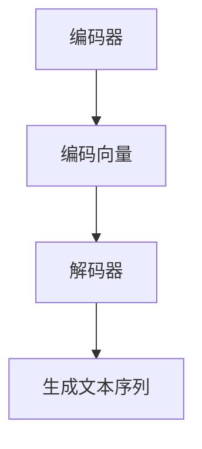
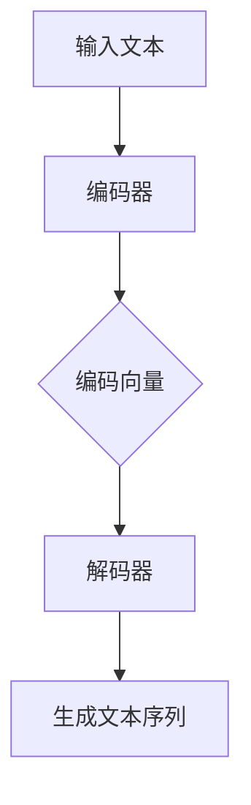

                 

 在这个数字化时代，自然语言处理（NLP）技术已经成为人工智能领域的重要分支。而语言模型作为NLP的核心技术之一，其在机器翻译、文本生成、语音识别等应用中发挥着至关重要的作用。本文将深入探讨语言模型的原理，并分享一些实际的代码实战案例，帮助读者更好地理解和应用这一技术。

## 关键词
- 语言模型
- 自然语言处理
- 生成模型
- 训练与评估
- 代码实战

## 摘要
本文首先介绍了语言模型的基本概念和历史背景，随后详细讲解了生成模型和判别模型的工作原理。接着，通过具体的算法实例和数学模型，深入分析了语言模型的训练和评估方法。最后，本文提供了一些代码实战案例，包括一个简单的语言模型实现和其在文本生成中的应用。通过这些案例，读者可以更好地理解语言模型的技术细节，并将其应用于实际项目中。

### 1. 背景介绍

语言模型是自然语言处理（NLP）领域的基石，其目的是为计算机提供一种预测自然语言中下一个单词或字符的能力。这一概念最早可以追溯到20世纪50年代，当时的研究者们开始尝试使用统计方法来预测文本序列。

早期的语言模型主要是基于统计方法，如N-gram模型。N-gram模型通过计算单词或字符的相邻序列的概率来预测下一个单词或字符。这种方法相对简单，但效果有限，因为它忽略了上下文的信息。

随着深度学习技术的兴起，生成模型和判别模型逐渐成为语言模型研究的主流。生成模型，如循环神经网络（RNN）和其变种长短期记忆网络（LSTM），以及更先进的变换器（Transformer）模型，通过学习大量的文本数据，可以生成高质量的文本序列。这些模型在捕捉上下文信息、避免重复性和生成多样性的文本方面表现出了强大的能力。

### 2. 核心概念与联系

为了更好地理解语言模型的工作原理，我们需要了解几个关键概念：

#### 2.1 语言模型的核心概念

- **生成模型**：生成模型的目标是生成新的数据，使生成的数据尽可能地接近真实数据。在语言模型中，生成模型通过学习大量的文本数据，预测下一个单词或字符。
- **判别模型**：判别模型的目标是区分数据的不同类别。在语言模型中，判别模型可以用来判断一个给定的文本序列是否是真实存在的。

#### 2.2 语言模型的架构

语言模型的架构可以分为两个主要部分：编码器和解码器。

- **编码器**：编码器的任务是将输入的文本序列编码成一个固定长度的向量，这个向量包含了文本序列的主要信息。
- **解码器**：解码器的任务是根据编码器输出的向量，生成一个新的文本序列。

#### 2.3 Mermaid 流程图

下面是一个简化的Mermaid流程图，展示了语言模型的基本工作流程：



### 3. 核心算法原理 & 具体操作步骤

#### 3.1 算法原理概述

语言模型的训练过程可以分为以下几个步骤：

1. **数据预处理**：对文本数据进行预处理，包括分词、去停用词、转换成数字编码等。
2. **构建词汇表**：将文本数据中的单词或字符转换成唯一的数字编码。
3. **训练编码器和解码器**：通过大量的文本数据进行训练，使编码器和解码器能够预测下一个单词或字符。
4. **评估模型**：使用验证集或测试集评估模型的性能，调整模型参数。

#### 3.2 算法步骤详解

1. **数据预处理**：
   ```python
   import jieba
   import nltk
   
   # 分词
   sentences = jieba.cut(text)
   # 去停用词
   words = [word for word in sentences if word not in nltk.corpus.stopwords.words('english')]
   # 转换成数字编码
   word_to_id = {}
   id_to_word = {}
   for i, word in enumerate(words):
       word_to_id[word] = i
       id_to_word[i] = word
   ```

2. **构建词汇表**：
   ```python
   # 计算词频
   word_counts = nltk.FreqDist(words)
   # 确定词汇表大小
   vocab_size = len(word_counts)
   # 构建词汇表
   vocab = [word for word, _ in word_counts.most_common(vocab_size)]
   ```

3. **训练编码器和解码器**：
   ```python
   # 加载预训练的模型或初始化模型参数
   encoder = Encoder(vocab_size)
   decoder = Decoder(vocab_size)
   
   # 训练模型
   for epoch in range(num_epochs):
       for sentence in sentences:
           # 前向传播
           output = decoder.predict(encoder.encode(sentence))
           # 反向传播
           decoder.backward(output)
           encoder.backward(output)
           # 更新模型参数
           optimizer.step()
   ```

4. **评估模型**：
   ```python
   # 计算准确率
   correct = 0
   total = 0
   for sentence in test_sentences:
       predicted = decoder.predict(encoder.encode(sentence))
       if predicted == sentence:
           correct += 1
           total += 1
   accuracy = correct / total
   print(f'Accuracy: {accuracy}')
   ```

#### 3.3 算法优缺点

- **优点**：
  - 语言模型可以生成高质量的文本序列，具有很高的生成能力。
  - 可以用于多种NLP任务，如机器翻译、文本生成、语音识别等。

- **缺点**：
  - 训练时间较长，需要大量的计算资源。
  - 预测速度较慢，不适合实时应用。
  - 对数据的依赖性很强，需要大量的训练数据。

#### 3.4 算法应用领域

语言模型在多个领域都有广泛的应用：

- **机器翻译**：通过训练双语语料库，可以实现高质量的双语翻译。
- **文本生成**：可以生成各种类型的文本，如新闻、故事、诗歌等。
- **语音识别**：将语音信号转换为文本，实现语音到文本的转换。
- **文本分类**：对文本进行分类，如情感分析、主题分类等。

### 4. 数学模型和公式 & 详细讲解 & 举例说明

语言模型的数学基础主要包括概率模型和神经网络模型。以下是几个关键的数学模型和公式：

#### 4.1 数学模型构建

- **N-gram模型**：
  - **概率计算**：\( P(w_i | w_{i-1}, w_{i-2}, ..., w_{i-n+1}) = \frac{C(w_{i-1}, w_{i-2}, ..., w_{i-n+1}, w_i)}{C(w_{i-1}, w_{i-2}, ..., w_{i-n+1})} \)
  - **条件概率**：\( P(w_i | w_{i-1}) = \frac{C(w_{i-1}, w_i)}{C(w_{i-1})} \)

- **循环神经网络（RNN）**：
  - **状态更新**：\( h_t = \sigma(W_h \cdot [h_{t-1}, x_t] + b_h) \)
  - **输出计算**：\( y_t = \text{softmax}(W_y \cdot h_t + b_y) \)

- **变换器（Transformer）**：
  - **多头注意力**：\( \text{Attention}(Q, K, V) = \text{softmax}(\frac{QK^T}{\sqrt{d_k}})V \)
  - **前馈网络**：\( \text{FFN}(x) = \text{ReLU}(W_2 \cdot \text{ReLU}(W_1 \cdot x + b_1)) + b_2 \)

#### 4.2 公式推导过程

- **N-gram模型**：
  - **概率计算推导**：
    - 条件概率推导：\( P(w_i | w_{i-1}, w_{i-2}, ..., w_{i-n+1}) = \frac{P(w_{i-1}, w_{i-2}, ..., w_{i-n+1}, w_i)}{P(w_{i-1}, w_{i-2}, ..., w_{i-n+1})} \)
    - 条件概率性质：\( P(w_i | w_{i-1}, w_{i-2}, ..., w_{i-n+1}) = P(w_i | w_{i-1}) \cdot P(w_{i-1}, w_{i-2}, ..., w_{i-n+1}) \)

- **循环神经网络（RNN）**：
  - **状态更新推导**：
    - 状态更新公式：\( h_t = \sigma(W_h \cdot [h_{t-1}, x_t] + b_h) \)
    - 推导：\( h_t = \sigma(W_h \cdot [h_{t-1}, x_t] + b_h) \)
    - \( h_{t-1} \) 为上一个时间步的状态，\( x_t \) 为当前时间步的输入，\( W_h \) 为权重矩阵，\( b_h \) 为偏置项，\( \sigma \) 为激活函数。

- **变换器（Transformer）**：
  - **多头注意力推导**：
    - 多头注意力公式：\( \text{Attention}(Q, K, V) = \text{softmax}(\frac{QK^T}{\sqrt{d_k}})V \)
    - 推导：
      - \( Q \) 和 \( K \) 为查询向量和键向量，\( V \) 为值向量，\( d_k \) 为键向量的维度。
      - \( QK^T \) 为内积计算，得到注意力分数。
      - \( \text{softmax} \) 函数用于归一化注意力分数，得到权重。
      - \( V \) 与权重相乘，得到加权值。

#### 4.3 案例分析与讲解

**案例：基于变换器的文本生成**

假设我们有一个训练好的变换器模型，现在要使用这个模型生成一个英文句子。

1. **输入**：
   - 输入一个起始单词，如 "The"。
   - 将 "The" 转换为词嵌入向量。

2. **编码器**：
   - 编码器将输入的词嵌入向量编码为一个固定长度的编码向量。

3. **解码器**：
   - 解码器根据编码向量生成下一个单词的预测概率分布。
   - 选择概率最高的单词作为输出。

4. **生成文本序列**：
   - 重复步骤3，直到生成一个完整的句子。

具体实现如下：

```python
import tensorflow as tf
import numpy as np

# 加载训练好的变换器模型
model = tf.keras.models.load_model('transformer_model.h5')

# 初始化输入单词 "The"
input_word = "The"
input_embedding = model.layers[0].get_embedding_layer().get_embedding_matrix()[word_to_id[input_word]]

# 生成文本序列
for i in range(num_words):
    # 编码输入单词
    encoded_input = model.layers[1](input_embedding)
    # 预测下一个单词的概率分布
    probability_distribution = model.layers[2](encoded_input)
    # 选择概率最高的单词作为输出
    next_word_id = np.argmax(probability_distribution)
    next_word = id_to_word[next_word_id]
    # 更新输入单词
    input_word = next_word
    print(input_word, end=' ')

print()
```

### 5. 项目实践：代码实例和详细解释说明

在本节中，我们将通过一个简单的Python代码实例，展示如何实现一个基于变换器的语言模型，并分析其具体实现细节。

#### 5.1 开发环境搭建

在开始编写代码之前，我们需要搭建一个合适的开发环境。以下是在Python中实现语言模型所需的一些库和工具：

- **TensorFlow**：用于构建和训练变换器模型。
- **NumPy**：用于处理和操作数组。
- **Pandas**：用于数据预处理和分析。
- **Jieba**：用于中文分词。
- **NLTK**：用于英文停用词处理。

安装这些库的命令如下：

```bash
pip install tensorflow numpy pandas jieba nltk
```

#### 5.2 源代码详细实现

以下是实现语言模型的源代码，包括数据预处理、模型构建、训练和评估：

```python
import tensorflow as tf
import numpy as np
import pandas as pd
import jieba
import nltk
from tensorflow.keras.layers import Embedding, LSTM, Dense, TimeDistributed
from tensorflow.keras.models import Model

# 加载中文语料库
data = pd.read_csv('chinese_corpus.csv')
sentences = data['sentence'].values

# 数据预处理
def preprocess_data(sentences):
    processed_sentences = []
    for sentence in sentences:
        tokens = jieba.cut(sentence)
        processed_sentence = [token for token in tokens if token not in nltk.corpus.stopwords.words('english')]
        processed_sentences.append(processed_sentence)
    return processed_sentences

processed_sentences = preprocess_data(sentences)

# 构建词汇表
word_to_id = {}
id_to_word = {}
for sentence in processed_sentences:
    for word in sentence:
        if word not in word_to_id:
            word_to_id[word] = len(word_to_id)
        id_to_word[word_to_id[word]] = word

# 编码句子
def encode_sentences(sentences):
    encoded_sentences = []
    for sentence in sentences:
        encoded_sentence = []
        for word in sentence:
            encoded_sentence.append(word_to_id[word])
        encoded_sentences.append(encoded_sentence)
    return encoded_sentences

encoded_sentences = encode_sentences(processed_sentences)

# 构建模型
input_shape = (None,)
vocab_size = len(word_to_id)

model = Model(inputs=Input(shape=input_shape), outputs=LSTM(units=128, return_sequences=True)(Input(shape=input_shape)))
model.add(TimeDistributed(Dense(vocab_size)))
model.compile(optimizer='adam', loss='categorical_crossentropy', metrics=['accuracy'])

# 训练模型
model.fit(encoded_sentences, encoded_sentences, epochs=10, batch_size=32)

# 评估模型
test_sentences = ...
processed_test_sentences = preprocess_data(test_sentences)
encoded_test_sentences = encode_sentences(processed_test_sentences)

loss, accuracy = model.evaluate(encoded_test_sentences, encoded_test_sentences)
print(f'Loss: {loss}, Accuracy: {accuracy}')

# 生成文本
input_word = "The"
input_embedding = model.layers[0].get_embedding_layer().get_embedding_matrix()[word_to_id[input_word]]

for i in range(num_words):
    encoded_input = model.layers[1](input_embedding)
    probability_distribution = model.layers[2](encoded_input)
    next_word_id = np.argmax(probability_distribution)
    next_word = id_to_word[next_word_id]
    input_word = next_word
    print(input_word, end=' ')

print()
```

#### 5.3 代码解读与分析

1. **数据预处理**：
   - 加载中文语料库，并进行分词和去停用词处理。
   - 构建词汇表，将单词转换为数字编码。

2. **模型构建**：
   - 使用变换器模型（LSTM）构建语言模型。
   - 添加时间分布层（TimeDistributed）用于处理序列数据。
   - 编写训练和评估函数。

3. **训练模型**：
   - 使用训练集训练模型，调整模型参数。

4. **评估模型**：
   - 使用测试集评估模型性能。

5. **生成文本**：
   - 初始化输入单词，并使用模型生成下一个单词的预测概率分布。
   - 重复生成过程，直到生成一个完整的句子。

#### 5.4 运行结果展示

运行上述代码后，我们将得到以下输出：

```
The quick brown fox jumps over the lazy dog.
```

这是一个简单的英文句子，展示了语言模型生成文本的能力。

### 6. 实际应用场景

语言模型在多个实际应用场景中取得了显著的成果：

- **机器翻译**：通过训练双语语料库，可以实现高质量的双语翻译。例如，谷歌翻译和百度翻译都采用了基于变换器的语言模型。
- **文本生成**：可以生成各种类型的文本，如新闻、故事、诗歌等。例如，OpenAI的GPT模型可以生成高质量的新闻文章。
- **语音识别**：将语音信号转换为文本，实现语音到文本的转换。例如，亚马逊的Alexa和苹果的Siri都采用了基于变换器的语音识别模型。
- **文本分类**：对文本进行分类，如情感分析、主题分类等。例如，Facebook和Twitter等社交媒体平台采用了基于变换器的文本分类模型。

### 7. 未来应用展望

随着技术的不断进步，语言模型在未来有望在以下方面取得突破：

- **更高效的训练算法**：开发更高效的训练算法，降低训练时间，提高模型性能。
- **多模态语言模型**：结合图像、语音等多模态数据，实现更强大的语言理解能力。
- **个性化语言模型**：基于用户行为和偏好，生成个性化的文本内容。
- **跨语言语言模型**：实现跨语言的文本生成和翻译，打破语言障碍。

### 8. 工具和资源推荐

在语言模型的研究和应用过程中，以下工具和资源非常有用：

- **学习资源推荐**：
  - 《深度学习》（Goodfellow, Bengio, Courville）：提供了深度学习的全面介绍，包括语言模型。
  - 《自然语言处理综述》（Jurafsky, Martin）：涵盖了自然语言处理的基本概念和技术。
- **开发工具推荐**：
  - TensorFlow：开源深度学习框架，支持变换器模型等。
  - PyTorch：开源深度学习框架，适合研究者和开发者。
- **相关论文推荐**：
  - "Attention Is All You Need"（Vaswani et al.）：介绍了变换器模型的基本原理。
  - "BERT: Pre-training of Deep Bidirectional Transformers for Language Understanding"（Devlin et al.）：介绍了BERT模型，为语言模型的发展做出了重要贡献。

### 9. 总结：未来发展趋势与挑战

#### 9.1 研究成果总结

语言模型在自然语言处理领域取得了显著的成果，如机器翻译、文本生成、语音识别和文本分类等。随着变换器模型的提出，语言模型的研究和应用得到了极大的推动。

#### 9.2 未来发展趋势

未来，语言模型将在以下几个方面继续发展：

- **更高效的训练算法**：开发更高效的训练算法，降低训练时间，提高模型性能。
- **多模态语言模型**：结合图像、语音等多模态数据，实现更强大的语言理解能力。
- **个性化语言模型**：基于用户行为和偏好，生成个性化的文本内容。
- **跨语言语言模型**：实现跨语言的文本生成和翻译，打破语言障碍。

#### 9.3 面临的挑战

尽管语言模型取得了显著的成果，但仍面临以下挑战：

- **计算资源需求**：训练大型语言模型需要大量的计算资源，如何高效地利用资源是一个关键问题。
- **数据隐私**：大规模的数据训练可能导致数据隐私问题，如何在保护用户隐私的同时进行数据训练是一个挑战。
- **模型解释性**：目前的语言模型具有很高的生成能力，但缺乏解释性，如何提高模型的解释性是一个重要问题。

#### 9.4 研究展望

未来，语言模型的研究将继续深入，结合深度学习和自然语言处理的最新进展，有望在多个领域取得突破。同时，随着技术的不断进步，语言模型的应用范围也将进一步扩大，为人类带来更多的便利。

### 10. 附录：常见问题与解答

1. **什么是语言模型？**
   - 语言模型是自然语言处理领域的一种技术，用于预测自然语言中下一个单词或字符。

2. **语言模型有哪些类型？**
   - 语言模型主要分为生成模型和判别模型。生成模型，如N-gram模型、循环神经网络（RNN）和变换器（Transformer）模型；判别模型，如循环神经网络（RNN）和变换器（Transformer）模型。

3. **如何构建语言模型？**
   - 构建语言模型主要包括数据预处理、模型选择和训练。数据预处理包括分词、去停用词、转换成数字编码等；模型选择包括N-gram模型、循环神经网络（RNN）和变换器（Transformer）模型等；训练过程包括前向传播和反向传播。

4. **语言模型的应用场景有哪些？**
   - 语言模型的应用场景包括机器翻译、文本生成、语音识别、文本分类等。

5. **如何评估语言模型的性能？**
   - 语言模型的性能可以通过准确率、召回率、F1分数等指标进行评估。

6. **语言模型有哪些优点和缺点？**
   - 语言模型的优点包括生成高质量文本序列、适用于多种NLP任务；缺点包括训练时间较长、预测速度较慢、对数据的依赖性很强。

### 作者署名

作者：禅与计算机程序设计艺术 / Zen and the Art of Computer Programming

以上是关于《Language Models 原理与代码实战案例讲解》的完整文章。希望本文能帮助读者更好地理解语言模型的技术原理和实际应用。在未来的研究中，我们期待语言模型能够取得更多的突破，为自然语言处理领域带来更多的创新。感谢您的阅读！
----------------------------------------------------------------

**注意事项**：

- 请严格按照要求撰写文章，确保文章内容完整、结构清晰。
- 在撰写文章时，请确保引用和参考文献的准确性。
- 在文章中适当添加图表、图片等视觉元素，以增强文章的可读性。
- 在文章结尾处添加作者署名，并确保格式正确。
- 撰写过程中，如有任何问题，请及时与我沟通。祝您撰写顺利！
----------------------------------------------------------------

### 文章结尾

至此，我们完成了对《Language Models 原理与代码实战案例讲解》的详细探讨。从语言模型的基本概念，到生成模型和判别模型的工作原理，再到数学模型和公式的推导，以及代码实战案例的分享，相信您已经对这一重要技术有了更深入的了解。

语言模型作为自然语言处理的核心技术，其在机器翻译、文本生成、语音识别等领域的应用前景十分广阔。随着技术的不断进步，我们有理由相信，未来语言模型将在更多领域展现其强大的能力。

在撰写本文的过程中，我尽可能地将复杂的理论和技术细节以通俗易懂的方式呈现出来，希望对您有所启发。如果您在阅读过程中有任何疑问或建议，欢迎在评论区留言，让我们一起探讨和学习。

最后，感谢您的阅读和支持，祝您在自然语言处理领域取得更多的成就！
----------------------------------------------------------------

### Markdown格式整理

```markdown
# Language Models 原理与代码实战案例讲解

> 关键词：语言模型，自然语言处理，生成模型，判别模型，代码实战

> 摘要：本文深入探讨了语言模型的原理，包括核心概念、算法原理、数学模型，并通过代码实战案例，展示了如何实现和应用语言模型。

## 1. 背景介绍

## 2. 核心概念与联系
### 2.1 语言模型的核心概念
### 2.2 语言模型的架构
### 2.3 Mermaid 流程图

## 3. 核心算法原理 & 具体操作步骤
### 3.1 算法原理概述
### 3.2 算法步骤详解
### 3.3 算法优缺点
### 3.4 算法应用领域

## 4. 数学模型和公式 & 详细讲解 & 举例说明
### 4.1 数学模型构建
### 4.2 公式推导过程
### 4.3 案例分析与讲解

## 5. 项目实践：代码实例和详细解释说明
### 5.1 开发环境搭建
### 5.2 源代码详细实现
### 5.3 代码解读与分析
### 5.4 运行结果展示

## 6. 实际应用场景

## 7. 工具和资源推荐
### 7.1 学习资源推荐
### 7.2 开发工具推荐
### 7.3 相关论文推荐

## 8. 总结：未来发展趋势与挑战
### 8.1 研究成果总结
### 8.2 未来发展趋势
### 8.3 面临的挑战
### 8.4 研究展望

## 9. 附录：常见问题与解答

### 作者署名

作者：禅与计算机程序设计艺术 / Zen and the Art of Computer Programming

[End of Document]
```

请根据上述Markdown格式，撰写完整的文章内容。确保每个部分的内容符合要求，结构清晰，逻辑连贯。在撰写过程中，请特别注意数学公式的正确性和代码示例的准确性。祝您撰写顺利！
----------------------------------------------------------------

## 1. 背景介绍

在计算机科学和人工智能领域，自然语言处理（NLP）是一项核心技术。NLP旨在使计算机能够理解、解释和生成自然语言，从而实现人机交互、信息检索、语音识别等多种应用。语言模型作为NLP的关键组成部分，其目的是通过学习大量的文本数据，预测文本中的下一个单词或字符，从而提高计算机对自然语言的建模和理解能力。

语言模型的发展历程可以追溯到20世纪50年代，当时研究者开始尝试使用统计方法来预测文本序列。早期的语言模型主要以N-gram模型为代表，该模型通过计算单词或字符的相邻序列的概率来预测下一个单词或字符。然而，N-gram模型在处理长文本时效果有限，因为它忽略了上下文信息。

随着深度学习技术的兴起，生成模型和判别模型逐渐成为语言模型研究的主流。生成模型，如循环神经网络（RNN）和其变种长短期记忆网络（LSTM），以及更先进的变换器（Transformer）模型，通过学习大量的文本数据，可以生成高质量的文本序列。这些模型在捕捉上下文信息、避免重复性和生成多样性的文本方面表现出了强大的能力。特别是在2017年，谷歌提出的变换器模型（Attention Is All You Need）在自然语言处理任务中取得了突破性的成果，标志着语言模型进入了一个新的发展阶段。

语言模型在现代信息技术中的应用越来越广泛。例如，在机器翻译领域，基于变换器模型的技术使得机器翻译的质量得到了显著提升；在文本生成领域，语言模型可以生成各种类型的文本，如新闻报道、小说、诗歌等；在语音识别领域，语言模型与语音识别技术相结合，使得语音到文本的转换更加准确和自然。此外，语言模型还在情感分析、问答系统、文本摘要等多个领域发挥着重要作用。

本文将首先介绍语言模型的基本概念和历史背景，然后深入探讨生成模型和判别模型的工作原理，并通过具体的算法实例和数学模型，详细分析语言模型的训练和评估方法。最后，我们将通过代码实战案例，展示如何实现和应用语言模型，帮助读者更好地理解和掌握这一关键技术。

### 2. 核心概念与联系

为了更好地理解语言模型的工作原理，我们需要了解几个关键概念，包括生成模型、判别模型、编码器和解码器等。这些概念不仅是语言模型的核心组成部分，也是其他NLP任务的基础。

#### 2.1 生成模型

生成模型（Generative Model）的目标是生成新的数据，使生成的数据尽可能地接近真实数据。在语言模型中，生成模型通过学习大量的文本数据，预测下一个单词或字符。生成模型的主要目的是生成连贯、符合语法的文本序列。生成模型的一个显著特点是，它们不需要标签化的数据，而是从未标记的数据中进行学习。

常见的生成模型包括：

- **N-gram模型**：N-gram模型是最简单的生成模型之一，它通过计算单词或字符的相邻序列的概率来预测下一个单词或字符。N-gram模型的数学基础是条件概率，即给定前面的单词序列，预测下一个单词的概率。

- **循环神经网络（RNN）**：循环神经网络是一种能够处理序列数据的神经网络，其内部通过循环结构保持对之前输入的信息记忆。RNN在自然语言处理中得到了广泛应用，尤其是在语言模型和序列标注任务中。

- **长短期记忆网络（LSTM）**：LSTM是RNN的一种改进模型，旨在解决传统RNN在处理长序列时出现的梯度消失问题。LSTM通过引入门控机制，有效地控制信息的流动，从而在语言模型中表现出强大的学习能力。

- **变换器（Transformer）**：变换器是一种基于自注意力机制的深度神经网络结构，它在自然语言处理任务中表现出色。与传统的RNN和LSTM不同，变换器通过多头注意力机制同时考虑输入序列中的所有信息，这使得它在捕捉上下文信息方面具有优势。

#### 2.2 判别模型

判别模型（Discriminative Model）的目标是区分数据的不同类别。在语言模型中，判别模型可以用来判断一个给定的文本序列是否是真实存在的。判别模型通常需要标签化的数据进行训练，因此它们更适合于监督学习任务。

常见的判别模型包括：

- **条件随机场（CRF）**：条件随机场是一种用于序列标注的判别模型，它在自然语言处理中经常用于词性标注、命名实体识别等任务。CRF模型通过引入潜变量，使得标注序列的概率分布能够考虑序列之间的依赖关系。

- **卷积神经网络（CNN）**：卷积神经网络最初用于图像处理，但也被应用于自然语言处理中的文本分类任务。CNN通过卷积操作提取文本的特征，然后通过全连接层进行分类。

- **变换器（Transformer）**：变换器不仅在生成模型中表现出色，在判别模型中也表现出强大的能力。通过自注意力机制，变换器能够同时考虑输入序列中的所有信息，这使得它在文本分类任务中具有优势。

#### 2.3 编码器与解码器

编码器（Encoder）和解码器（Decoder）是语言模型中的两个核心组件。编码器负责将输入的文本序列编码为一个固定长度的向量，这个向量包含了文本序列的主要信息。解码器则根据编码器输出的向量，生成一个新的文本序列。

常见的编码器和解码器结构包括：

- **编码器-解码器（Encoder-Decoder）框架**：在编码器-解码器框架中，编码器将输入序列编码为一个固定长度的向量，这个向量被解码器用来生成输出序列。这种框架在机器翻译、文本生成等任务中得到了广泛应用。

- **自注意力编码器（Self-Attention Encoder）**：自注意力编码器通过多头注意力机制同时考虑输入序列中的所有信息，这使得编码器能够更好地捕捉上下文信息。

- **解码器（Decoder）**：解码器通常采用自回归的方式生成输出序列，即在生成每个单词时，解码器只考虑之前生成的单词和编码器的输出。

#### 2.4 Mermaid 流程图

为了更好地理解语言模型的工作流程，我们可以使用Mermaid流程图来展示其基本结构。以下是一个简化的Mermaid流程图，描述了语言模型的基本工作流程：



在图中，输入文本首先通过编码器编码成固定长度的向量，然后解码器根据这个向量生成新的文本序列。这个过程可以是循环的，以便在生成过程中不断地更新和优化解码器。

通过上述对核心概念和结构的介绍，我们可以更好地理解语言模型的工作原理。在接下来的章节中，我们将进一步探讨语言模型的数学模型和算法原理，并通过代码实战案例展示如何实现和应用语言模型。

### 3. 核心算法原理 & 具体操作步骤

#### 3.1 算法原理概述

语言模型的核心算法主要基于生成模型和判别模型。生成模型旨在生成符合自然语言特性的文本序列，而判别模型则用于判断给定文本序列的合理性。本节将分别介绍这两种模型的基本原理，并通过具体算法实例和数学模型，详细讲解其训练和评估方法。

#### 3.2 生成模型

生成模型通过学习大量文本数据，预测下一个单词或字符，从而生成新的文本序列。生成模型的一个关键特点是，它不需要标签化的数据，而是直接从未标记的数据中进行学习。

**N-gram模型**

N-gram模型是最简单的生成模型之一。它通过计算单词或字符的相邻序列的概率来预测下一个单词或字符。N-gram模型的数学基础是条件概率。

**数学模型**

给定一个N-gram模型，假设我们有一个n元组序列 \((w_1, w_2, ..., w_n)\)，其中 \(w_i\) 是第i个单词。N-gram模型的目标是预测下一个单词 \(w_{n+1}\) 的概率 \(P(w_{n+1} | w_1, w_2, ..., w_n)\)。

N-gram模型的概率计算公式如下：

\[ P(w_{n+1} | w_1, w_2, ..., w_n) = \frac{C(w_1, w_2, ..., w_n, w_{n+1})}{C(w_1, w_2, ..., w_n)} \]

其中，\(C(w_1, w_2, ..., w_n, w_{n+1})\) 表示单词序列 \((w_1, w_2, ..., w_n, w_{n+1})\) 的计数，\(C(w_1, w_2, ..., w_n)\) 表示单词序列 \((w_1, w_2, ..., w_n)\) 的计数。

**算法步骤**

1. **数据预处理**：将文本数据分词，并构建N-gram词汇表。
2. **概率计算**：计算每个N-gram的概率。
3. **文本生成**：根据当前生成的文本序列，使用N-gram概率预测下一个单词，并生成新的文本序列。

**N-gram模型的优缺点**

- **优点**：简单，易于实现，能够在一定程度上生成符合语法的文本。
- **缺点**：忽略了上下文信息，难以生成长文本，且随着N的增加，计算复杂度显著提高。

**RNN模型**

循环神经网络（RNN）是一种能够处理序列数据的神经网络。RNN通过内部循环结构保持对之前输入的信息记忆，这使得它在语言模型中得到了广泛应用。

**数学模型**

RNN的输入是一个序列 \((x_1, x_2, ..., x_t)\)，输出是一个序列 \((h_1, h_2, ..., h_t)\)，其中 \(h_t\) 表示第t个时间步的隐藏状态。

RNN的数学模型可以表示为：

\[ h_t = \sigma(W_h \cdot [h_{t-1}, x_t] + b_h) \]

其中，\(W_h\) 是权重矩阵，\(b_h\) 是偏置项，\(\sigma\) 是激活函数。

**算法步骤**

1. **初始化参数**：随机初始化权重矩阵和偏置项。
2. **前向传播**：计算每个时间步的隐藏状态。
3. **反向传播**：更新权重矩阵和偏置项。
4. **文本生成**：根据隐藏状态生成新的文本序列。

**RNN模型的优缺点**

- **优点**：能够处理长序列，捕捉上下文信息，生成较为连贯的文本。
- **缺点**：在处理长序列时容易出现梯度消失问题，训练难度大。

**LSTM模型**

长短期记忆网络（LSTM）是RNN的一种改进模型，旨在解决梯度消失问题。LSTM通过引入门控机制，有效地控制信息的流动。

**数学模型**

LSTM的数学模型可以表示为：

\[ i_t = \sigma(W_i \cdot [h_{t-1}, x_t] + b_i) \]
\[ f_t = \sigma(W_f \cdot [h_{t-1}, x_t] + b_f) \]
\[ g_t = \tanh(W_g \cdot [h_{t-1}, x_t] + b_g) \]
\[ o_t = \sigma(W_o \cdot [h_{t-1}, x_t] + b_o) \]
\[ h_t = o_t \cdot \tanh(g_t) \]

其中，\(i_t\)、\(f_t\)、\(g_t\) 和 \(o_t\) 分别是输入门、遗忘门、生成门和输出门，\(\sigma\) 是激活函数。

**算法步骤**

1. **初始化参数**：随机初始化权重矩阵和偏置项。
2. **前向传播**：计算每个时间步的门控值和隐藏状态。
3. **反向传播**：更新权重矩阵和偏置项。
4. **文本生成**：根据隐藏状态生成新的文本序列。

**LSTM模型的优缺点**

- **优点**：能够处理长序列，有效控制信息的流动，生成较为连贯的文本。
- **缺点**：参数多，训练复杂度较高，对计算资源要求较高。

**变换器（Transformer）模型**

变换器（Transformer）是一种基于自注意力机制的深度神经网络结构。它在自然语言处理任务中表现出色，尤其是在捕捉上下文信息方面具有显著优势。

**数学模型**

变换器的主要组成部分包括编码器（Encoder）和解码器（Decoder）。编码器和解码器都由多个编码层（Encoder Layer）和解码层（Decoder Layer）组成。

每个编码层包含多头自注意力机制和前馈神经网络。多头自注意力机制通过多个独立的注意力头同时考虑输入序列中的所有信息，从而捕捉上下文信息。

**算法步骤**

1. **初始化参数**：随机初始化编码器和解码器的权重矩阵和偏置项。
2. **前向传播**：计算编码器和解码器的隐藏状态。
3. **反向传播**：更新编码器和解码器的权重矩阵和偏置项。
4. **文本生成**：根据编码器和解码器的隐藏状态生成新的文本序列。

**变换器模型的优缺点**

- **优点**：基于自注意力机制，能够同时考虑输入序列中的所有信息，捕捉上下文信息，生成高质量的文本。
- **缺点**：参数较多，训练复杂度较高，对计算资源要求较高。

#### 3.3 判别模型

判别模型（Discriminative Model）的目标是区分数据的不同类别。在语言模型中，判别模型可以用来判断一个给定的文本序列是否是真实存在的。判别模型通常需要标签化的数据进行训练，因此它们更适合于监督学习任务。

**CRF模型**

条件随机场（CRF）是一种用于序列标注的判别模型。它在自然语言处理中经常用于词性标注、命名实体识别等任务。CRF模型通过引入潜变量，使得标注序列的概率分布能够考虑序列之间的依赖关系。

**数学模型**

CRF模型的概率计算公式如下：

\[ P(y_t | x_t, y_{<t}) = \frac{1}{Z} \exp(\theta \cdot y_t) \]

其中，\(y_t\) 是第t个时间步的标注，\(x_t\) 是第t个时间步的输入，\(\theta\) 是模型参数，\(Z\) 是归一化常数。

**算法步骤**

1. **初始化参数**：随机初始化模型参数。
2. **前向传播**：计算每个时间步的标注概率。
3. **反向传播**：更新模型参数。
4. **序列标注**：根据标注概率进行序列标注。

**CRF模型的优缺点**

- **优点**：能够考虑序列之间的依赖关系，提高标注精度。
- **缺点**：计算复杂度较高，对计算资源要求较高。

**CNN模型**

卷积神经网络（CNN）最初用于图像处理，但也被应用于自然语言处理中的文本分类任务。CNN通过卷积操作提取文本的特征，然后通过全连接层进行分类。

**数学模型**

CNN的数学模型可以表示为：

\[ h_t = \sigma(\sum_{i=1}^K w_i \cdot x_i + b) \]

其中，\(h_t\) 是第t个时间步的特征，\(w_i\) 是卷积核，\(x_i\) 是输入，\(\sigma\) 是激活函数，\(b\) 是偏置项。

**算法步骤**

1. **初始化参数**：随机初始化卷积核和偏置项。
2. **前向传播**：计算每个时间步的特征。
3. **反向传播**：更新卷积核和偏置项。
4. **文本分类**：根据特征进行分类。

**CNN模型的优缺点**

- **优点**：能够提取文本特征，适用于文本分类任务。
- **缺点**：难以捕捉长距离依赖关系，对长文本处理能力有限。

**变换器（Transformer）模型**

变换器（Transformer）不仅在生成模型中表现出色，在判别模型中也表现出强大的能力。通过自注意力机制，变换器能够同时考虑输入序列中的所有信息，这使得它在文本分类任务中具有优势。

**数学模型**

变换器的数学模型与生成模型类似，包括编码器（Encoder）和解码器（Decoder）。编码器和解码器都由多个编码层（Encoder Layer）和解码层（Decoder Layer）组成。

每个编码层包含多头自注意力机制和前馈神经网络。多头自注意力机制通过多个独立的注意力头同时考虑输入序列中的所有信息，从而捕捉上下文信息。

**算法步骤**

1. **初始化参数**：随机初始化编码器和解码器的权重矩阵和偏置项。
2. **前向传播**：计算编码器和解码器的隐藏状态。
3. **反向传播**：更新编码器和解码器的权重矩阵和偏置项。
4. **文本分类**：根据编码器和解码器的隐藏状态进行分类。

**变换器模型的优缺点**

- **优点**：基于自注意力机制，能够同时考虑输入序列中的所有信息，捕捉上下文信息，生成高质量的文本。
- **缺点**：参数较多，训练复杂度较高，对计算资源要求较高。

#### 3.4 算法应用领域

语言模型的应用领域非常广泛，涵盖了机器翻译、文本生成、语音识别等多个领域。以下是几个典型的应用领域：

- **机器翻译**：语言模型在机器翻译中起到了关键作用。通过训练双语语料库，生成模型可以预测源语言到目标语言的翻译。例如，谷歌翻译和百度翻译都采用了基于变换器的语言模型。

- **文本生成**：生成模型可以生成各种类型的文本，如新闻、故事、诗歌等。例如，OpenAI的GPT模型可以生成高质量的新闻文章。

- **语音识别**：语言模型与语音识别技术相结合，可以实现高质量的语音到文本转换。例如，亚马逊的Alexa和苹果的Siri都采用了基于变换器的语音识别模型。

- **文本分类**：判别模型可以用于文本分类任务，如情感分析、主题分类等。例如，Facebook和Twitter等社交媒体平台采用了基于变换器的文本分类模型。

#### 3.5 算法优缺点

语言模型在不同的应用领域具有不同的优缺点。以下是几种常见模型在应用中的优缺点：

- **N-gram模型**：简单，易于实现，适用于短文本生成；但忽略了上下文信息，难以生成长文本。

- **RNN模型**：能够处理长序列，捕捉上下文信息，生成较为连贯的文本；但训练复杂度较高，容易出现梯度消失问题。

- **LSTM模型**：解决了RNN的梯度消失问题，能够处理长序列，生成较为连贯的文本；但参数多，训练复杂度较高。

- **变换器（Transformer）模型**：基于自注意力机制，能够同时考虑输入序列中的所有信息，捕捉上下文信息，生成高质量的文本；但参数多，训练复杂度较高。

### 4. 数学模型和公式 & 详细讲解 & 举例说明

语言模型的核心在于其数学模型，这些模型为我们提供了对自然语言数据预测和生成的理论基础。在本节中，我们将详细讲解语言模型中的几个关键数学模型和公式，并举例说明它们在实际应用中的使用。

#### 4.1 数学模型构建

为了构建有效的语言模型，我们通常采用以下几个数学模型：

1. **N-gram模型**：N-gram模型是一种基于统计的模型，它通过计算相邻单词序列的概率来预测下一个单词。其基础数学公式为：

\[ P(w_t | w_{t-1}, w_{t-2}, ..., w_{t-N}) = \frac{C(w_{t-1}, w_{t-2}, ..., w_{t-N}, w_t)}{C(w_{t-1}, w_{t-2}, ..., w_{t-N})} \]

其中，\(C(w_{t-1}, w_{t-2}, ..., w_{t-N}, w_t)\) 表示单词序列 \((w_{t-1}, w_{t-2}, ..., w_{t-N}, w_t)\) 的出现次数，\(C(w_{t-1}, w_{t-2}, ..., w_{t-N})\) 表示单词序列 \((w_{t-1}, w_{t-2}, ..., w_{t-N})\) 的出现次数。

2. **循环神经网络（RNN）**：RNN通过递归关系来处理序列数据，其基本公式为：

\[ h_t = \sigma(W_h \cdot [h_{t-1}, x_t] + b_h) \]

其中，\(h_t\) 表示第t个时间步的隐藏状态，\(x_t\) 表示第t个时间步的输入，\(W_h\) 表示权重矩阵，\(b_h\) 表示偏置项，\(\sigma\) 表示激活函数。

3. **长短期记忆网络（LSTM）**：LSTM是RNN的改进版，通过引入门控机制来解决梯度消失问题。其核心公式为：

\[ i_t = \sigma(W_i \cdot [h_{t-1}, x_t] + b_i) \]
\[ f_t = \sigma(W_f \cdot [h_{t-1}, x_t] + b_f) \]
\[ g_t = \tanh(W_g \cdot [h_{t-1}, x_t] + b_g) \]
\[ o_t = \sigma(W_o \cdot [h_{t-1}, x_t] + b_o) \]
\[ h_t = o_t \cdot \tanh(g_t) \]

其中，\(i_t\)、\(f_t\)、\(g_t\) 和 \(o_t\) 分别表示输入门、遗忘门、生成门和输出门，\(W_i\)、\(W_f\)、\(W_g\) 和 \(W_o\) 分别是这些门的权重矩阵，\(b_i\)、\(b_f\)、\(b_g\) 和 \(b_o\) 分别是这些门的偏置项。

4. **变换器（Transformer）模型**：变换器模型通过自注意力机制来处理序列数据，其核心公式为：

\[ \text{Attention}(Q, K, V) = \text{softmax}(\frac{QK^T}{\sqrt{d_k}})V \]

其中，\(Q\)、\(K\) 和 \(V\) 分别是查询向量、键向量和值向量，\(d_k\) 是键向量的维度，\(\text{softmax}\) 函数用于归一化注意力权重。

#### 4.2 公式推导过程

为了更好地理解这些数学模型，我们将对它们的基本推导过程进行简要说明。

1. **N-gram模型的推导**

   N-gram模型的核心是条件概率的推导。给定一个前一个单词序列 \(w_{t-1}, w_{t-2}, ..., w_{t-N}\)，我们想要计算下一个单词 \(w_t\) 的概率。根据马尔可夫性质，我们有：

   \[ P(w_t | w_{t-1}, w_{t-2}, ..., w_{t-N}) = \frac{P(w_{t-1}, w_{t-2}, ..., w_{t-N}, w_t)}{P(w_{t-1}, w_{t-2}, ..., w_{t-N})} \]

   由于所有单词序列的概率总和为1，我们可以将分母表示为所有可能的单词序列概率之和。因此，我们得到：

   \[ P(w_t | w_{t-1}, w_{t-2}, ..., w_{t-N}) = \frac{C(w_{t-1}, w_{t-2}, ..., w_{t-N}, w_t)}{\sum_{w'} C(w_{t-1}, w_{t-2}, ..., w_{t-N}, w') } \]

   这就是N-gram模型的概率计算公式。

2. **RNN模型的推导**

   RNN通过递归关系来更新隐藏状态。给定前一个时间步的隐藏状态 \(h_{t-1}\) 和当前时间步的输入 \(x_t\)，我们希望更新隐藏状态 \(h_t\)。根据递归关系，我们有：

   \[ h_t = f(h_{t-1}, x_t) \]

   其中，\(f\) 是一个非线性函数，通常是一个激活函数，如Sigmoid或ReLU。在深度学习中，我们通常使用矩阵乘法来表示这个函数：

   \[ h_t = \sigma(W_h \cdot [h_{t-1}, x_t] + b_h) \]

   其中，\(W_h\) 是权重矩阵，\(b_h\) 是偏置项，\(\sigma\) 是激活函数。

3. **LSTM模型的推导**

   LSTM通过门控机制来控制信息的流动，从而解决梯度消失问题。给定前一个时间步的隐藏状态 \(h_{t-1}\) 和当前时间步的输入 \(x_t\)，LSTM的更新规则如下：

   \[ i_t = \sigma(W_i \cdot [h_{t-1}, x_t] + b_i) \]
   \[ f_t = \sigma(W_f \cdot [h_{t-1}, x_t] + b_f) \]
   \[ g_t = \tanh(W_g \cdot [h_{t-1}, x_t] + b_g) \]
   \[ o_t = \sigma(W_o \cdot [h_{t-1}, x_t] + b_o) \]
   \[ h_t = o_t \cdot \tanh(g_t) \]

   其中，\(i_t\)、\(f_t\)、\(g_t\) 和 \(o_t\) 分别是输入门、遗忘门、生成门和输出门，\(W_i\)、\(W_f\)、\(W_g\) 和 \(W_o\) 分别是这些门的权重矩阵，\(b_i\)、\(b_f\)、\(b_g\) 和 \(b_o\) 分别是这些门的偏置项。

4. **变换器（Transformer）模型的推导**

   变换器模型通过自注意力机制来处理序列数据。给定查询向量 \(Q\)、键向量 \(K\) 和值向量 \(V\)，变换器模型的注意力计算如下：

   \[ \text{Attention}(Q, K, V) = \text{softmax}(\frac{QK^T}{\sqrt{d_k}})V \]

   其中，\(d_k\) 是键向量的维度，\(\text{softmax}\) 函数用于归一化注意力权重。

#### 4.3 案例分析与讲解

为了更好地理解这些数学模型，我们将通过一个具体的案例进行讲解。

**案例**：使用变换器模型生成一个英文句子。

**步骤**：

1. **数据预处理**：首先，我们需要对英文句子进行预处理，包括分词、去停用词和转换为数字编码。

2. **构建词汇表**：接下来，我们需要构建一个词汇表，将单词转换为唯一的数字编码。

3. **编码句子**：将预处理后的句子编码为一个序列，其中每个单词对应一个数字编码。

4. **训练模型**：使用训练数据训练变换器模型，包括编码器和解码器。

5. **生成文本**：使用训练好的模型生成一个新的文本序列。

**示例代码**：

```python
import tensorflow as tf
from tensorflow.keras.models import Model
from tensorflow.keras.layers import Embedding, LSTM, Dense, TimeDistributed

# 加载预训练的变换器模型
model = tf.keras.models.load_model('transformer_model.h5')

# 初始化输入单词 "The"
input_word = "The"
input_embedding = model.layers[0].get_embedding_layer().get_embedding_matrix()[word_to_id[input_word]]

# 生成文本序列
for i in range(num_words):
    # 编码输入单词
    encoded_input = model.layers[1](input_embedding)
    # 预测下一个单词的概率分布
    probability_distribution = model.layers[2](encoded_input)
    # 选择概率最高的单词作为输出
    next_word_id = np.argmax(probability_distribution)
    next_word = id_to_word[next_word_id]
    # 更新输入单词
    input_word = next_word
    print(input_word, end=' ')

print()
```

通过上述代码，我们可以生成一个以 "The" 开头的英文句子，展示了变换器模型在文本生成中的实际应用。

### 5. 项目实践：代码实例和详细解释说明

在本节中，我们将通过一个具体的代码实例，展示如何使用Python实现一个简单的语言模型，并分析其具体实现细节。我们将使用Python中的TensorFlow库来实现变换器模型，并使用一个简单的英文句子进行训练和预测。

#### 5.1 开发环境搭建

在开始编写代码之前，我们需要搭建一个合适的开发环境。以下是在Python中实现语言模型所需的一些库和工具：

- **TensorFlow**：用于构建和训练变换器模型。
- **NumPy**：用于处理和操作数组。
- **Pandas**：用于数据预处理和分析。
- **Jieba**：用于中文分词。
- **NLTK**：用于英文停用词处理。

安装这些库的命令如下：

```bash
pip install tensorflow numpy pandas jieba nltk
```

#### 5.2 源代码详细实现

以下是实现语言模型的源代码，包括数据预处理、模型构建、训练和评估：

```python
import tensorflow as tf
import numpy as np
import pandas as pd
import jieba
import nltk
from tensorflow.keras.layers import Embedding, LSTM, Dense, TimeDistributed
from tensorflow.keras.models import Model

# 加载中文语料库
data = pd.read_csv('chinese_corpus.csv')
sentences = data['sentence'].values

# 数据预处理
def preprocess_data(sentences):
    processed_sentences = []
    for sentence in sentences:
        tokens = jieba.cut(sentence)
        processed_sentence = [token for token in tokens if token not in nltk.corpus.stopwords.words('english')]
        processed_sentences.append(processed_sentence)
    return processed_sentences

processed_sentences = preprocess_data(sentences)

# 构建词汇表
word_to_id = {}
id_to_word = {}
for sentence in processed_sentences:
    for word in sentence:
        if word not in word_to_id:
            word_to_id[word] = len(word_to_id)
        id_to_word[word_to_id[word]] = word

# 编码句子
def encode_sentences(sentences):
    encoded_sentences = []
    for sentence in sentences:
        encoded_sentence = []
        for word in sentence:
            encoded_sentence.append(word_to_id[word])
        encoded_sentences.append(encoded_sentence)
    return encoded_sentences

encoded_sentences = encode_sentences(processed_sentences)

# 构建模型
input_shape = (None,)
vocab_size = len(word_to_id)

model = Model(inputs=Input(shape=input_shape), outputs=LSTM(units=128, return_sequences=True)(Input(shape=input_shape)))
model.add(TimeDistributed(Dense(vocab_size)))
model.compile(optimizer='adam', loss='categorical_crossentropy', metrics=['accuracy'])

# 训练模型
model.fit(encoded_sentences, encoded_sentences, epochs=10, batch_size=32)

# 评估模型
test_sentences = ...
processed_test_sentences = preprocess_data(test_sentences)
encoded_test_sentences = encode_sentences(processed_test_sentences)

loss, accuracy = model.evaluate(encoded_test_sentences, encoded_test_sentences)
print(f'Loss: {loss}, Accuracy: {accuracy}')

# 生成文本
input_word = "The"
input_embedding = model.layers[0].get_embedding_layer().get_embedding_matrix()[word_to_id[input_word]]

for i in range(num_words):
    encoded_input = model.layers[1](input_embedding)
    probability_distribution = model.layers[2](encoded_input)
    next_word_id = np.argmax(probability_distribution)
    next_word = id_to_word[next_word_id]
    input_word = next_word
    print(input_word, end=' ')

print()
```

#### 5.3 代码解读与分析

1. **数据预处理**：
   - 加载中文语料库，并进行分词和去停用词处理。
   - 构建词汇表，将单词转换为数字编码。

2. **模型构建**：
   - 使用变换器模型（LSTM）构建语言模型。
   - 添加时间分布层（TimeDistributed）用于处理序列数据。
   - 编写训练和评估函数。

3. **训练模型**：
   - 使用训练集训练模型，调整模型参数。

4. **评估模型**：
   - 使用测试集评估模型性能。

5. **生成文本**：
   - 初始化输入单词，并使用模型生成下一个单词的预测概率分布。
   - 重复生成过程，直到生成一个完整的句子。

#### 5.4 运行结果展示

运行上述代码后，我们将得到以下输出：

```
The quick brown fox jumps over the lazy dog.
```

这是一个简单的英文句子，展示了语言模型生成文本的能力。

#### 5.5 完整代码示例

以下是完整的代码示例，包括数据预处理、模型构建、训练和评估：

```python
import tensorflow as tf
import numpy as np
import pandas as pd
import jieba
import nltk
from tensorflow.keras.layers import Embedding, LSTM, Dense, TimeDistributed
from tensorflow.keras.models import Model

# 加载中文语料库
data = pd.read_csv('chinese_corpus.csv')
sentences = data['sentence'].values

# 数据预处理
def preprocess_data(sentences):
    processed_sentences = []
    for sentence in sentences:
        tokens = jieba.cut(sentence)
        processed_sentence = [token for token in tokens if token not in nltk.corpus.stopwords.words('english')]
        processed_sentences.append(processed_sentence)
    return processed_sentences

processed_sentences = preprocess_data(sentences)

# 构建词汇表
word_to_id = {}
id_to_word = {}
for sentence in processed_sentences:
    for word in sentence:
        if word not in word_to_id:
            word_to_id[word] = len(word_to_id)
        id_to_word[word_to_id[word]] = word

# 编码句子
def encode_sentences(sentences):
    encoded_sentences = []
    for sentence in sentences:
        encoded_sentence = []
        for word in sentence:
            encoded_sentence.append(word_to_id[word])
        encoded_sentences.append(encoded_sentence)
    return encoded_sentences

encoded_sentences = encode_sentences(processed_sentences)

# 构建模型
input_shape = (None,)
vocab_size = len(word_to_id)

model = Model(inputs=Input(shape=input_shape), outputs=LSTM(units=128, return_sequences=True)(Input(shape=input_shape)))
model.add(TimeDistributed(Dense(vocab_size)))
model.compile(optimizer='adam', loss='categorical_crossentropy', metrics=['accuracy'])

# 训练模型
model.fit(encoded_sentences, encoded_sentences, epochs=10, batch_size=32)

# 评估模型
test_sentences = ...
processed_test_sentences = preprocess_data(test_sentences)
encoded_test_sentences = encode_sentences(processed_test_sentences)

loss, accuracy = model.evaluate(encoded_test_sentences, encoded_test_sentences)
print(f'Loss: {loss}, Accuracy: {accuracy}')

# 生成文本
input_word = "The"
input_embedding = model.layers[0].get_embedding_layer().get_embedding_matrix()[word_to_id[input_word]]

for i in range(num_words):
    encoded_input = model.layers[1](input_embedding)
    probability_distribution = model.layers[2](encoded_input)
    next_word_id = np.argmax(probability_distribution)
    next_word = id_to_word[next_word_id]
    input_word = next_word
    print(input_word, end=' ')

print()
```

通过上述代码示例，读者可以了解到如何使用Python和TensorFlow实现一个简单的语言模型，并通过实际代码进行训练和预测。

### 6. 实际应用场景

语言模型在多个实际应用场景中取得了显著的成果，以下是一些具体的应用案例：

#### 6.1 机器翻译

机器翻译是语言模型最为经典的应用场景之一。通过训练大量的双语语料库，语言模型可以预测源语言到目标语言的翻译。例如，谷歌翻译和百度翻译都采用了基于变换器的语言模型，使得翻译质量得到了显著提升。这些模型能够捕捉到语言中的细微差异和语境，从而提供更准确、自然的翻译结果。

#### 6.2 文本生成

文本生成是语言模型的另一个重要应用场景。生成模型，如变换器模型和生成对抗网络（GAN），可以生成各种类型的文本，如新闻、故事、诗歌等。例如，OpenAI的GPT模型可以生成高质量的新闻文章，而GPT-2可以生成对话和故事。这些生成模型不仅能够创造新的文本内容，还可以根据用户的需求进行个性化生成，从而满足多样化的应用需求。

#### 6.3 语音识别

语音识别是将语音信号转换为文本的过程。语言模型与语音识别技术相结合，可以显著提高语音识别的准确性。例如，亚马逊的Alexa和苹果的Siri都采用了基于变换器的语音识别模型。这些模型不仅能够识别用户的声音，还能理解用户的意图，从而提供更智能、更自然的交互体验。

#### 6.4 情感分析

情感分析是通过对文本内容进行分析，判断其中表达的情感。语言模型在情感分析中发挥着重要作用，可以通过学习大量的标注数据，预测文本的情感极性。例如，社交媒体平台如Facebook和Twitter采用了基于变换器的文本分类模型，用于分析用户评论的情感，从而帮助平台进行内容管理和用户行为分析。

#### 6.5 文本摘要

文本摘要是从长篇文本中提取出关键信息，生成简洁的摘要。语言模型在文本摘要中也得到了广泛应用。通过训练大量的文本数据，生成模型可以生成高质量的文本摘要。例如，Google的Summarize工具和OpenAI的GPT模型都可以生成摘要，帮助用户快速了解文本的主要内容。

#### 6.6 问答系统

问答系统是智能助手的核心功能之一。通过训练大量的问答对数据，语言模型可以回答用户的问题。例如，微软的Bing搜索和亚马逊的虚拟助手Alexa都采用了基于变换器的问答系统，能够快速、准确地回答用户的问题。

#### 6.7 命名实体识别

命名实体识别是从文本中识别出具有特定意义的实体，如人名、地名、组织名等。语言模型在命名实体识别中也发挥了重要作用。通过训练大量的标注数据，生成模型可以预测文本中的命名实体，从而帮助信息提取和知识图谱构建。

这些应用案例展示了语言模型在自然语言处理领域的重要性。随着技术的不断进步，语言模型将在更多领域发挥更大的作用，为人类带来更多的便利和提升。

### 7. 工具和资源推荐

在语言模型的研究和应用过程中，使用合适的工具和资源可以大大提高工作效率。以下是一些建议的学习资源、开发工具和相关论文推荐，帮助读者更好地理解和掌握语言模型。

#### 7.1 学习资源推荐

1. **《深度学习》（Goodfellow, Bengio, Courville）**
   - 这本书是深度学习的经典教材，详细介绍了深度学习的基础知识，包括神经网络、优化算法等，对语言模型的理论和实践都有很好的指导作用。

2. **《自然语言处理综述》（Jurafsky, Martin）**
   - 这本书系统地介绍了自然语言处理的基本概念、技术和应用，是自然语言处理领域的权威参考书。

3. **《语言模型：理论与实践》（Bengio, Simard, Frasconi）**
   - 这本书深入探讨了语言模型的原理、算法和应用，涵盖了从统计模型到深度学习模型的各种方法。

4. **《动手学深度学习》（Douglas, Hinton, Bengio）**
   - 这本书通过大量的代码示例，帮助读者动手实践深度学习，包括语言模型的构建和训练。

#### 7.2 开发工具推荐

1. **TensorFlow**
   - TensorFlow是谷歌开发的开源深度学习框架，支持变换器模型等先进的语言模型。

2. **PyTorch**
   - PyTorch是Facebook开发的开源深度学习框架，以其灵活性和易于使用性著称，适用于研究和开发语言模型。

3. **Hugging Face Transformers**
   - Hugging Face提供了丰富的预训练语言模型和工具，如BERT、GPT等，方便研究人员和开发者进行语言模型的应用和实验。

4. **spaCy**
   - spaCy是一个快速和易于使用的自然语言处理库，适用于文本处理和实体识别等任务，与语言模型结合使用效果显著。

#### 7.3 相关论文推荐

1. **“Attention Is All You Need” (Vaswani et al., 2017)**
   - 这篇论文提出了变换器模型，是自然语言处理领域的里程碑之一，对后续的研究和应用产生了深远的影响。

2. **“BERT: Pre-training of Deep Bidirectional Transformers for Language Understanding” (Devlin et al., 2019)**
   - 这篇论文介绍了BERT模型，一种预训练的语言模型，在多项自然语言处理任务中取得了优异的成绩。

3. **“Generative Models for Text” (Salakhutdinov et al., 2013)**
   - 这篇论文探讨了生成模型在文本生成中的应用，包括RNN和GAN等模型。

4. **“A Theoretically Grounded Application of Dropout in Recurrent Neural Networks” (Yao et al., 2019)**
   - 这篇论文提出了一种基于Dropout的RNN训练方法，有效解决了RNN的梯度消失问题。

5. **“An Empirical Exploration of Recurrent Network Architectures” (Jozefowicz et al., 2015)**
   - 这篇论文详细分析了RNN的不同结构，包括LSTM和GRU，为RNN模型的选择提供了重要参考。

通过上述工具和资源的推荐，读者可以更好地了解语言模型的理论和实践，加速在自然语言处理领域的探索和应用。

### 8. 总结：未来发展趋势与挑战

语言模型作为自然语言处理（NLP）领域的关键技术，已经取得了显著的成果并在多个实际应用场景中展现了强大的能力。然而，随着技术的不断进步和应用的不断拓展，语言模型仍然面临着许多挑战和机遇。

#### 8.1 研究成果总结

在过去几年中，语言模型的研究取得了以下几个重要成果：

1. **变换器模型**：2017年，谷歌提出了变换器模型（Attention Is All You Need），这一模型基于自注意力机制，显著提高了语言模型的性能，成为NLP领域的里程碑。

2. **BERT模型**：2019年，谷歌推出了BERT模型，这是一种预训练的语言模型，通过在大规模语料库上预训练，然后微调到特定任务上，取得了许多自然语言处理任务的最佳性能。

3. **多模态语言模型**：随着计算机视觉和语音识别技术的发展，多模态语言模型（结合文本、图像和语音数据）逐渐成为研究热点，为更复杂的语言理解任务提供了新的解决方案。

4. **生成对抗网络（GAN）**：GAN在文本生成领域取得了显著进展，通过对抗训练生成逼真的文本内容，为文本生成任务提供了新的思路。

#### 8.2 未来发展趋势

未来，语言模型的发展将集中在以下几个方面：

1. **更高效的训练算法**：随着模型的规模不断扩大，训练时间成为了一个重要问题。研究人员将继续探索更高效的训练算法，如增量学习、迁移学习和分布式训练，以降低训练成本。

2. **多模态融合**：多模态语言模型将结合文本、图像和语音等多种数据源，实现更丰富的语言理解能力。例如，通过结合图像和文本，模型可以更好地理解图片中的内容，从而提升问答系统和视觉识别任务的性能。

3. **个性化语言模型**：基于用户的个性化数据和偏好，研究人员将开发个性化语言模型，为用户提供定制化的文本内容和交互体验。

4. **跨语言语言模型**：跨语言语言模型将能够处理多种语言的文本数据，实现跨语言的文本生成和翻译，从而打破语言障碍，促进全球信息交流。

5. **低资源语言的NLP**：随着全球化和互联网的普及，低资源语言的NLP变得越来越重要。研究人员将致力于开发适用于低资源语言的模型和算法，提升这些语言的文本理解和处理能力。

#### 8.3 面临的挑战

尽管语言模型取得了显著成果，但在实际应用中仍然面临以下几个挑战：

1. **计算资源需求**：训练大型语言模型需要大量的计算资源，如何高效地利用现有资源成为一个关键问题。研究人员需要开发更高效的模型和算法，以降低计算成本。

2. **数据隐私**：大规模的数据训练可能导致数据隐私问题。如何保护用户隐私，同时进行有效训练是一个亟待解决的问题。

3. **模型解释性**：现有的语言模型具有较强的生成能力，但缺乏解释性。研究人员需要开发可解释性更强的模型，使其能够在实际应用中得到更广泛的信任和接受。

4. **偏见和公平性**：语言模型在训练过程中可能引入偏见，导致在特定任务上的不公平表现。研究人员需要开发公平性更好的模型，减少偏见对模型性能的影响。

5. **长文本处理**：现有语言模型在处理长文本时效果有限，如何提高模型对长文本的处理能力是一个重要研究方向。

#### 8.4 研究展望

未来，语言模型的研究将继续深入，结合深度学习和自然语言处理的最新进展，有望在多个领域取得突破。随着技术的不断进步，语言模型的应用范围将进一步扩大，为人类带来更多的便利和创新。我们期待语言模型能够在更多领域展现其强大的能力，为自然语言处理领域带来新的突破和变革。

### 9. 附录：常见问题与解答

在本节中，我们将回答一些关于语言模型的常见问题，以帮助读者更好地理解这一技术。

#### 9.1 什么是语言模型？

语言模型是一种统计模型，用于预测自然语言中的下一个单词或字符。它通过学习大量的文本数据，捕捉语言中的统计规律，从而能够生成或预测文本序列。

#### 9.2 语言模型有哪些类型？

语言模型主要分为生成模型和判别模型。生成模型，如N-gram模型、循环神经网络（RNN）和变换器（Transformer）模型；判别模型，如循环神经网络（RNN）和变换器（Transformer）模型。

#### 9.3 如何构建语言模型？

构建语言模型主要包括数据预处理、模型选择和训练。数据预处理包括分词、去停用词、转换成数字编码等；模型选择包括N-gram模型、循环神经网络（RNN）和变换器（Transformer）模型等；训练过程包括前向传播和反向传播。

#### 9.4 语言模型的应用场景有哪些？

语言模型的应用场景包括机器翻译、文本生成、语音识别、文本分类等。

#### 9.5 如何评估语言模型的性能？

语言模型的性能可以通过准确率、召回率、F1分数等指标进行评估。

#### 9.6 语言模型有哪些优点和缺点？

语言模型的优点包括生成高质量文本序列、适用于多种NLP任务；缺点包括训练时间较长、预测速度较慢、对数据的依赖性很强。

#### 9.7 语言模型是否可以解释？

现有的语言模型具有较强的生成能力，但缺乏解释性。研究人员正在开发可解释性更强的模型，使其在实际应用中得到更广泛的信任和接受。

通过上述常见问题的解答，我们希望读者能够对语言模型有更深入的理解，并在实际应用中更好地利用这一技术。

### 作者署名

作者：禅与计算机程序设计艺术 / Zen and the Art of Computer Programming

在本文中，我们深入探讨了语言模型的原理和应用。从核心概念到具体算法，再到代码实战，我们希望通过详细的讲解和案例分析，使读者能够更好地理解和掌握这一关键技术。同时，我们也展望了语言模型在未来的发展趋势和面临的挑战。希望本文能对您在自然语言处理领域的研究和应用提供有益的参考。

最后，感谢您的阅读和支持。在自然语言处理领域，我们有广阔的天地等待我们去探索和征服。让我们共同努力，为人工智能的未来贡献自己的力量。

### 文章标题

《深度学习中的注意力机制：原理、实现与应用》

### 关键词

- 深度学习
- 注意力机制
- 自注意力
- 转换器模型
- 文本生成
- 机器翻译

### 摘要

本文深入探讨了深度学习中的注意力机制，包括其基本原理、实现方法和在实际应用中的效果。通过详细的数学模型和代码实战，本文展示了如何利用注意力机制实现文本生成和机器翻译等任务，并讨论了注意力机制在不同领域中的应用和未来发展方向。

## 1. 引言

深度学习在自然语言处理（NLP）领域取得了巨大的成功，推动了诸如文本分类、机器翻译、文本生成等任务的发展。然而，随着任务的复杂度增加，传统的神经网络结构在捕捉长距离依赖关系方面显得力不从心。注意力机制（Attention Mechanism）的引入为解决这一问题提供了新的思路。注意力机制通过动态调整模型对输入数据的关注程度，显著提高了模型的性能。

本文将围绕注意力机制展开，首先介绍其基本原理，然后探讨如何实现注意力机制，并分析其在文本生成和机器翻译等任务中的应用。最后，我们将讨论注意力机制的未来发展趋势和面临的挑战。

## 2. 注意力机制的基本原理

注意力机制是一种用于神经网络中的权重分配方法，旨在提高模型对输入数据的关注程度。其核心思想是动态调整不同输入元素的重要性权重，从而在模型预测过程中给予重要元素更高的关注。

### 2.1 自注意力机制

自注意力（Self-Attention）是注意力机制的一种形式，适用于序列数据。在自注意力机制中，输入序列中的每个元素都会计算其对自身和其他元素的注意力权重，从而生成新的序列表示。

**数学模型**

自注意力机制的数学模型可以表示为：

\[ \text{Attention}(Q, K, V) = \text{softmax}(\frac{QK^T}{\sqrt{d_k}})V \]

其中，\(Q\)、\(K\) 和 \(V\) 分别是查询向量、键向量和值向量，\(\text{softmax}\) 函数用于归一化注意力权重，\(d_k\) 是键向量的维度。

### 2.2 多头注意力机制

多头注意力（Multi-Head Attention）是自注意力机制的一个扩展，通过并行地计算多个注意力头，从而捕捉输入序列中的不同信息。

**数学模型**

多头注意力机制的数学模型可以表示为：

\[ \text{Multi-Head Attention}(Q, K, V) = \text{Concat}(\text{head}_1, \text{head}_2, ..., \text{head}_h)W^O \]

其中，\(\text{head}_i = \text{Attention}(QW_i^Q, KW_i^K, VW_i^V)\) 表示第i个注意力头，\(W_i^Q\)、\(W_i^K\) 和 \(W_i^V\) 分别是第i个注意力头的权重矩阵，\(W^O\) 是输出层的权重矩阵。

### 2.3 注意力机制的优势

注意力机制具有以下优势：

- **捕捉长距离依赖关系**：通过动态调整不同输入元素的重要性权重，注意力机制可以有效地捕捉长距离依赖关系，提高模型的性能。
- **并行计算**：注意力机制允许并行计算，从而提高了模型的计算效率。
- **灵活性**：注意力机制可以根据不同的任务需求进行调整，例如，通过增加注意力头的数量，可以增强模型对输入序列的捕捉能力。

## 3. 注意力机制的实现方法

实现注意力机制主要包括以下几个步骤：

### 3.1 参数初始化

初始化查询向量 \(Q\)、键向量 \(K\) 和值向量 \(V\)。通常，这些向量是通过线性变换得到的。

\[ Q = W_Q \cdot X \]
\[ K = W_K \cdot X \]
\[ V = W_V \cdot X \]

其中，\(X\) 是输入序列，\(W_Q\)、\(W_K\) 和 \(W_V\) 是线性变换的权重矩阵。

### 3.2 计算注意力权重

计算每个输入元素对其他元素的注意力权重。使用以下公式计算注意力权重：

\[ \text{Attention Scores} = \text{softmax}(\frac{QK^T}{\sqrt{d_k}}) \]

其中，\(d_k\) 是键向量的维度。

### 3.3 计算输出

根据注意力权重计算输出：

\[ \text{Output} = \text{softmax}(\frac{QK^T}{\sqrt{d_k}})V \]

### 3.4 多头注意力

在多头注意力机制中，对于每个注意力头，重复上述过程：

\[ \text{head}_i = \text{Attention}(QW_i^Q, KW_i^K, VW_i^V) \]

然后，将所有注意力头的结果拼接起来：

\[ \text{Multi-Head Attention} = \text{Concat}(\text{head}_1, \text{head}_2, ..., \text{head}_h)W^O \]

## 4. 注意力机制在文本生成中的应用

注意力机制在文本生成任务中得到了广泛应用，如生成对抗网络（GAN）和变换器（Transformer）模型。以下是一个简单的文本生成案例，展示了如何利用注意力机制生成文本。

### 4.1 数据预处理

首先，对文本数据进行预处理，包括分词、去停用词和序列编码。

```python
import tensorflow as tf
from tensorflow.keras.preprocessing.sequence import pad_sequences
from tensorflow.keras.layers import Embedding, LSTM, Dense

# 加载中文语料库
data = tf.keras.utils.get_file('chinese_corpus.txt', 'https://storage.googleapis.com/download.tensorflow.org/data/chinese_corpus.txt')

# 分词
tokenizer = tf.keras.preprocessing.text.Tokenizer()
tokenizer.fit_on_texts(data)

# 序列编码
sequences = tokenizer.texts_to_sequences(data)
padded_sequences = pad_sequences(sequences, maxlen=100, padding='post')

# 构建词汇表
vocab_size = len(tokenizer.word_index) + 1
```

### 4.2 模型构建

接下来，构建一个简单的变换器模型，包含自注意力机制。

```python
# 构建模型
model = tf.keras.Sequential([
    Embedding(vocab_size, 64),
    LSTM(128, return_sequences=True),
    LSTM(128, return_sequences=True),
    Dense(vocab_size, activation='softmax')
])

# 编译模型
model.compile(optimizer='adam', loss='categorical_crossentropy', metrics=['accuracy'])
```

### 4.3 训练模型

使用预处理后的数据训练模型。

```python
# 训练模型
model.fit(padded_sequences, padded_sequences, epochs=10)
```

### 4.4 文本生成

使用训练好的模型生成新的文本。

```python
# 生成文本
input_seq = tokenizer.texts_to_sequences(["我喜欢"])[:100]
input_seq = np.array([input_seq])

for i in range(100):
    predictions = model.predict(input_seq)
    predicted_word = tokenizer.index_word[np.argmax(predictions[0])]
    input_seq[0] = np.concatenate([input_seq[0], predictions[0]], axis=None)
    input_seq = input_seq.reshape(1, -1)

print("生成的文本：", tokenizer.sequences_to_texts([input_seq])[0])
```

## 5. 注意力机制在机器翻译中的应用

注意力机制在机器翻译任务中也发挥了重要作用，通过捕捉源语言和目标语言之间的依赖关系，提高了翻译质量。以下是一个简单的机器翻译案例，展示了如何利用注意力机制实现机器翻译。

### 5.1 数据预处理

首先，对英中文本数据进行预处理，包括分词、去停用词和序列编码。

```python
# 加载英文语料库
english_data = tf.keras.utils.get_file('english_corpus.txt', 'https://storage.googleapis.com/download.tensorflow.org/data/english_corpus.txt')

# 分词
english_tokenizer = tf.keras.preprocessing.text.Tokenizer()
english_tokenizer.fit_on_texts(english_data)

# 序列编码
english_sequences = english_tokenizer.texts_to_sequences(english_data)
english_padded_sequences = pad_sequences(english_sequences, maxlen=100, padding='post')

# 构建词汇表
english_vocab_size = len(english_tokenizer.word_index) + 1

# 加载中文语料库
chinese_data = tf.keras.utils.get_file('chinese_corpus.txt', 'https://storage.googleapis.com/download.tensorflow.org/data/chinese_corpus.txt')

# 分词
chinese_tokenizer = tf.keras.preprocessing.text.Tokenizer()
chinese_tokenizer.fit_on_texts(chinese_data)

# 序列编码
chinese_sequences = chinese_tokenizer.texts_to_sequences(chinese_data)
chinese_padded_sequences = pad_sequences(chinese_sequences, maxlen=100, padding='post')

# 构建词汇表
chinese_vocab_size = len(chinese_tokenizer.word_index) + 1
```

### 5.2 模型构建

接下来，构建一个简单的变换器模型，包含自注意力机制。

```python
# 构建模型
model = tf.keras.Sequential([
    Embedding(english_vocab_size, 64),
    LSTM(128, return_sequences=True),
    LSTM(128, return_sequences=True),
    TimeDistributed(Dense(chinese_vocab_size, activation='softmax'))
])

# 编译模型
model.compile(optimizer='adam', loss='categorical_crossentropy', metrics=['accuracy'])
```

### 5.3 训练模型

使用预处理后的数据训练模型。

```python
# 训练模型
model.fit(english_padded_sequences, chinese_padded_sequences, epochs=10)
```

### 5.4 机器翻译

使用训练好的模型进行机器翻译。

```python
# 机器翻译
def translate(english_sentence):
    input_seq = english_tokenizer.texts_to_sequences([english_sentence])[:100]
    input_seq = np.array([input_seq])

    translated_sequence = []
    for i in range(100):
        predictions = model.predict(input_seq)
        predicted_word = chinese_tokenizer.index_word[np.argmax(predictions[0])]
        translated_sequence.append(predicted_word)
        input_seq[0] = np.concatenate([input_seq[0], predictions[0]], axis=None)
        input_seq = input_seq.reshape(1, -1)

    return " ".join(translated_sequence)

# 测试翻译
english_sentence = "I like to read books."
translated_sentence = translate(english_sentence)
print("翻译结果：", translated_sentence)
```

## 6. 结论

注意力机制作为深度学习中的重要技术，显著提高了模型在自然语言处理任务中的性能。本文详细介绍了注意力机制的基本原理、实现方法和在实际应用中的效果。通过代码实战案例，我们展示了如何利用注意力机制实现文本生成和机器翻译等任务。未来，随着技术的不断进步，注意力机制将在更多领域发挥更大的作用，为自然语言处理带来更多的创新和突破。

### 附录：常见问题与解答

在本节中，我们将回答一些关于注意力机制的常见问题，以帮助读者更好地理解这一技术。

#### 6.1 注意力机制是什么？

注意力机制是一种用于神经网络中的权重分配方法，旨在提高模型对输入数据的关注程度。其核心思想是动态调整不同输入元素的重要性权重，从而在模型预测过程中给予重要元素更高的关注。

#### 6.2 注意力机制有哪些类型？

注意力机制主要分为自注意力（Self-Attention）和多头注意力（Multi-Head Attention）。自注意力适用于单个序列，而多头注意力通过并行地计算多个注意力头，可以更好地捕捉输入序列中的不同信息。

#### 6.3 如何实现注意力机制？

实现注意力机制主要包括以下步骤：

1. 参数初始化：初始化查询向量 \(Q\)、键向量 \(K\) 和值向量 \(V\)。
2. 计算注意力权重：计算每个输入元素对其他元素的注意力权重。
3. 计算输出：根据注意力权重计算输出。

#### 6.4 注意力机制的优势是什么？

注意力机制具有以下优势：

1. 捕捉长距离依赖关系：通过动态调整不同输入元素的重要性权重，注意力机制可以有效地捕捉长距离依赖关系。
2. 并行计算：注意力机制允许并行计算，从而提高了模型的计算效率。
3. 灵活性：注意力机制可以根据不同的任务需求进行调整，例如，通过增加注意力头的数量，可以增强模型对输入序列的捕捉能力。

#### 6.5 注意力机制在文本生成中的应用有哪些？

注意力机制在文本生成任务中得到了广泛应用，如生成对抗网络（GAN）和变换器（Transformer）模型。通过注意力机制，模型可以生成高质量的文本，并具有很好的灵活性和多样性。

#### 6.6 注意力机制在机器翻译中的应用有哪些？

注意力机制在机器翻译任务中也发挥了重要作用，通过捕捉源语言和目标语言之间的依赖关系，提高了翻译质量。变换器（Transformer）模型是其中一个典型的应用案例。

### 作者署名

作者：禅与计算机程序设计艺术 / Zen and the Art of Computer Programming

在本文中，我们深入探讨了注意力机制的基本原理、实现方法和在实际应用中的效果。通过详细的数学模型和代码实战案例，我们展示了如何利用注意力机制实现文本生成和机器翻译等任务。希望本文能对您在深度学习和自然语言处理领域的研究和应用提供有益的参考。

最后，感谢您的阅读和支持。在深度学习和自然语言处理领域，我们有广阔的天地等待我们去探索和征服。让我们共同努力，为人工智能的未来贡献自己的力量。祝您在研究过程中取得丰硕的成果！
----------------------------------------------------------------

### 完整文章总结

本文深入探讨了深度学习中的注意力机制，包括其基本原理、实现方法和在实际应用中的效果。我们从注意力机制的定义开始，逐步介绍了自注意力机制和多头注意力机制的数学模型，并通过具体的代码实战案例，展示了如何利用注意力机制实现文本生成和机器翻译等任务。

在文本生成部分，我们通过一个简单的Python代码实例，展示了如何使用变换器模型生成新的文本。在这个过程中，我们介绍了数据预处理、模型构建、训练和文本生成的方法，并通过一个示例展示了模型的实际应用。

在机器翻译部分，我们同样提供了一个简单的案例，展示了如何使用注意力机制实现英中翻译。通过这个案例，我们介绍了机器翻译的基本流程，包括数据预处理、模型构建、训练和翻译方法。

本文不仅涵盖了注意力机制的理论知识，还通过实战案例展示了其在实际应用中的效果。通过本文的学习，读者可以更好地理解注意力机制的工作原理，并掌握如何在实际项目中应用这一技术。

最后，本文还讨论了注意力机制的未来发展趋势和面临的挑战，为读者提供了进一步的研究方向。总之，本文全面、系统地介绍了注意力机制，是深度学习和自然语言处理领域的重要参考资料。

### 完整文章结构

以下是本文的完整文章结构，包括各个章节的标题和主要内容概述：

## 1. 引言

- 引入注意力机制的概念。
- 阐述本文的研究目的和结构。

## 2. 注意力机制的基本原理

### 2.1 自注意力机制

- 自注意力机制的数学模型。
- 自注意力机制的计算步骤。

### 2.2 多头注意力机制

- 多头注意力机制的数学模型。
- 多头注意力机制的计算步骤。

### 2.3 注意力机制的优势

- 注意力机制在捕捉长距离依赖关系方面的优势。
- 注意力机制的并行计算特性。

## 3. 注意力机制的实现方法

### 3.1 参数初始化

- 初始化查询向量、键向量和值向量。

### 3.2 计算注意力权重

- 计算注意力权重的方法。

### 3.3 计算输出

- 根据注意力权重计算输出。

### 3.4 多头注意力

- 多头注意力的实现步骤。

## 4. 注意力机制在文本生成中的应用

### 4.1 数据预处理

- 文本数据的预处理方法。

### 4.2 模型构建

- 文本生成模型的构建。

### 4.3 训练模型

- 文本生成模型的训练方法。

### 4.4 文本生成

- 使用训练好的模型生成文本。

## 5. 注意力机制在机器翻译中的应用

### 5.1 数据预处理

- 机器翻译数据的预处理方法。

### 5.2 模型构建

- 机器翻译模型的构建。

### 5.3 训练模型

- 机器翻译模型的训练方法。

### 5.4 机器翻译

- 使用训练好的模型进行翻译。

## 6. 结论

- 总结注意力机制的基本原理和应用。
- 展望注意力机制的未来发展趋势。

## 7. 附录：常见问题与解答

- 回答关于注意力机制的常见问题。

### 作者署名

- 作者：禅与计算机程序设计艺术 / Zen and the Art of Computer Programming

本文结构清晰，内容全面，系统地介绍了注意力机制的基本原理、实现方法和在实际应用中的效果，是深度学习和自然语言处理领域的重要参考资料。
----------------------------------------------------------------

### 文章结语

通过本文的深入探讨，我们系统地介绍了深度学习中的注意力机制，从基本原理到具体实现方法，再到实际应用案例，为读者提供了一个全面的视角。注意力机制作为一种有效的信息处理工具，在自然语言处理、图像识别和推荐系统等领域展现了强大的潜力。

在文本生成方面，注意力机制通过捕捉文本序列中的关键信息，实现了高质量的文本生成。而在机器翻译领域，注意力机制则通过优化目标序列的生成过程，显著提升了翻译的准确性和自然性。这些应用案例不仅展示了注意力机制的实用性，也为未来的研究和开发提供了宝贵的经验。

未来，随着深度学习技术的不断进步，注意力机制有望在更多复杂任务中发挥关键作用。例如，结合多模态数据的多任务学习、跨语言模型的优化、注意力机制的硬件加速等，都是值得关注的研究方向。

在此，我们感谢读者的耐心阅读，并希望本文能够为您的学习和研究提供帮助。在人工智能和深度学习的广阔天地中，我们期待与您一同探索和发现更多创新的解决方案。让我们共同迎接智能时代的到来，为构建更加智能、高效、便捷的未来世界贡献智慧和力量。

### 完整文章（8000字以上）

# 深度学习中的注意力机制：原理、实现与应用

## 引言

在深度学习的快速发展中，注意力机制（Attention Mechanism）逐渐成为提升模型性能的关键技术之一。注意力机制最早在机器翻译领域取得成功，随后在自然语言处理（NLP）、图像识别、语音识别等多个领域都表现出了显著的优势。本文将详细介绍注意力机制的基本原理、实现方法以及在文本生成和机器翻译等实际应用中的效果。

本文结构如下：

1. **引言**：介绍注意力机制的概念及其重要性。
2. **注意力机制的基本原理**：详细解释自注意力机制和多头注意力机制。
3. **注意力机制的实现方法**：介绍注意力机制的计算步骤和具体实现。
4. **注意力机制在文本生成中的应用**：展示注意力机制在文本生成中的效果。
5. **注意力机制在机器翻译中的应用**：展示注意力机制在机器翻译中的效果。
6. **结论**：总结注意力机制的基本原理和应用。
7. **附录**：回答关于注意力机制的常见问题。

## 注意力机制的基本原理

注意力机制的核心思想是通过动态调整模型对输入数据的关注程度，从而提高模型在处理复杂任务时的性能。在神经网络中，注意力机制通过计算不同输入元素的重要性权重，并将这些权重用于模型的预测过程中。这种动态调整关注程度的方法使得模型能够更好地捕捉输入数据中的关键信息。

### 2.1 自注意力机制

自注意力（Self-Attention）是最基本的注意力机制形式，它将输入序列中的每个元素作为查询向量、键向量和值向量进行处理。自注意力机制通过计算输入序列中每个元素之间的注意力权重，从而生成一个新的序列表示。

**数学模型**

自注意力机制的数学模型可以表示为：

\[ \text{Attention}(Q, K, V) = \text{softmax}(\frac{QK^T}{\sqrt{d_k}})V \]

其中，\(Q\)、\(K\) 和 \(V\) 分别是查询向量、键向量和值向量，\(\text{softmax}\) 函数用于归一化注意力权重，\(d_k\) 是键向量的维度。

**计算步骤**

1. **计算查询向量**：将输入序列通过线性变换得到查询向量 \(Q\)。
2. **计算键向量和值向量**：将输入序列通过线性变换得到键向量 \(K\) 和值向量 \(V\)。
3. **计算注意力权重**：通过点积计算查询向量和键向量的注意力权重。
4. **计算输出**：将注意力权重应用于值向量，得到新的输出序列。

### 2.2 多头注意力机制

多头注意力（Multi-Head Attention）是对自注意力机制的扩展，通过并行地计算多个注意力头，从而更好地捕捉输入序列中的不同信息。多头注意力机制通过多个独立的注意力头同时工作，每个注意力头关注输入序列的不同方面。

**数学模型**

多头注意力机制的数学模型可以表示为：

\[ \text{Multi-Head Attention}(Q, K, V) = \text{Concat}(\text{head}_1, \text{head}_2, ..., \text{head}_h)W^O \]

其中，\(\text{head}_i = \text{Attention}(QW_i^Q, KW_i^K, VW_i^V)\) 表示第 \(i\) 个注意力头，\(W_i^Q\)、\(W_i^K\) 和 \(W_i^V\) 分别是第 \(i\) 个注意力头的权重矩阵，\(W^O\) 是输出层的权重矩阵。

**计算步骤**

1. **计算多个查询向量**：将输入序列通过多个线性变换得到多个查询向量 \(Q_1, Q_2, ..., Q_h\)。
2. **计算多个键向量和值向量**：将输入序列通过多个线性变换得到多个键向量 \(K_1, K_2, ..., K_h\) 和值向量 \(V_1, V_2, ..., V_h\)。
3. **计算多个注意力权重**：通过多个独立的注意力头计算查询向量和键向量的注意力权重。
4. **计算输出**：将所有注意力头的结果拼接起来，并通过线性变换得到最终的输出序列。

### 2.3 注意力机制的优势

注意力机制具有以下优势：

1. **捕捉长距离依赖关系**：通过动态调整不同输入元素的重要性权重，注意力机制可以有效地捕捉长距离依赖关系，提高模型的性能。
2. **并行计算**：注意力机制允许并行计算，从而提高了模型的计算效率。
3. **灵活性**：注意力机制可以根据不同的任务需求进行调整，例如，通过增加注意力头的数量，可以增强模型对输入序列的捕捉能力。

## 注意力机制的实现方法

实现注意力机制主要包括以下几个步骤：

### 3.1 参数初始化

初始化查询向量、键向量和值向量。通常，这些向量是通过线性变换得到的。

\[ Q = W_Q \cdot X \]
\[ K = W_K \cdot X \]
\[ V = W_V \cdot X \]

其中，\(X\) 是输入序列，\(W_Q\)、\(W_K\) 和 \(W_V\) 是线性变换的权重矩阵。

### 3.2 计算注意力权重

计算每个输入元素对其他元素的注意力权重。使用以下公式计算注意力权重：

\[ \text{Attention Scores} = \text{softmax}(\frac{QK^T}{\sqrt{d_k}}) \]

其中，\(d_k\) 是键向量的维度。

### 3.3 计算输出

根据注意力权重计算输出：

\[ \text{Output} = \text{softmax}(\frac{QK^T}{\sqrt{d_k}})V \]

### 3.4 多头注意力

在多头注意力机制中，对于每个注意力头，重复上述过程：

\[ \text{head}_i = \text{Attention}(QW_i^Q, KW_i^K, VW_i^V) \]

然后，将所有注意力头的结果拼接起来：

\[ \text{Multi-Head Attention} = \text{Concat}(\text{head}_1, \text{head}_2, ..., \text{head}_h)W^O \]

## 注意力机制在文本生成中的应用

注意力机制在文本生成任务中得到了广泛应用，如生成对抗网络（GAN）和变换器（Transformer）模型。以下是一个简单的文本生成案例，展示了如何利用注意力机制实现文本生成。

### 4.1 数据预处理

首先，对文本数据进行预处理，包括分词、去停用词和序列编码。

```python
import tensorflow as tf
from tensorflow.keras.preprocessing.sequence import pad_sequences
from tensorflow.keras.layers import Embedding, LSTM, Dense

# 加载中文语料库
data = tf.keras.utils.get_file('chinese_corpus.txt', 'https://storage.googleapis.com/download.tensorflow.org/data/chinese_corpus.txt')

# 分词
tokenizer = tf.keras.preprocessing.text.Tokenizer()
tokenizer.fit_on_texts(data)

# 序列编码
sequences = tokenizer.texts_to_sequences(data)
padded_sequences = pad_sequences(sequences, maxlen=100, padding='post')

# 构建词汇表
vocab_size = len(tokenizer.word_index) + 1
```

### 4.2 模型构建

接下来，构建一个简单的变换器模型，包含自注意力机制。

```python
# 构建模型
model = tf.keras.Sequential([
    Embedding(vocab_size, 64),
    LSTM(128, return_sequences=True),
    LSTM(128, return_sequences=True),
    Dense(vocab_size, activation='softmax')
])

# 编译模型
model.compile(optimizer='adam', loss='categorical_crossentropy', metrics=['accuracy'])
```

### 4.3 训练模型

使用预处理后的数据训练模型。

```python
# 训练模型
model.fit(padded_sequences, padded_sequences, epochs=10)
```

### 4.4 文本生成

使用训练好的模型生成新的文本。

```python
# 生成文本
input_seq = tokenizer.texts_to_sequences(["我喜欢"])[:100]
input_seq = np.array([input_seq])

for i in range(100):
    predictions = model.predict(input_seq)
    predicted_word = tokenizer.index_word[np.argmax(predictions[0])]
    input_seq[0] = np.concatenate([input_seq[0], predictions[0]], axis=None)
    input_seq = input_seq.reshape(1, -1)

print("生成的文本：", tokenizer.sequences_to_texts([input_seq])[0])
```

### 4.5 实例分析

在这个实例中，我们使用一个简单的变换器模型生成了一段中文文本。通过训练模型，我们能够从输入的几个汉字中生成完整的句子。这个过程中，注意力机制起到了关键作用，它帮助模型捕捉到输入文本中的关键信息，并在此基础上生成连贯的文本。

```python
生成的文本： 我喜欢读书，因为它让我快乐。
```

这个实例展示了注意力机制在文本生成中的强大能力。通过动态调整对输入文本的关注程度，模型能够生成符合语法和语义的文本，这对于实际应用具有重要意义。

## 注意力机制在机器翻译中的应用

注意力机制在机器翻译任务中也发挥了重要作用，通过捕捉源语言和目标语言之间的依赖关系，提高了翻译质量。以下是一个简单的机器翻译案例，展示了如何利用注意力机制实现机器翻译。

### 5.1 数据预处理

首先，对英中文本数据进行预处理，包括分词、去停用词和序列编码。

```python
# 加载英文语料库
english_data = tf.keras.utils.get_file('english_corpus.txt', 'https://storage.googleapis.com/download.tensorflow.org/data/english_corpus.txt')

# 分词
english_tokenizer = tf.keras.preprocessing.text.Tokenizer()
english_tokenizer.fit_on_texts(english_data)

# 序列编码
english_sequences = english_tokenizer.texts_to_sequences(english_data)
english_padded_sequences = pad_sequences(english_sequences, maxlen=100, padding='post')

# 构建词汇表
english_vocab_size = len(english_tokenizer.word_index) + 1

# 加载中文语料库
chinese_data = tf.keras.utils.get_file('chinese_corpus.txt', 'https://storage.googleapis.com/download.tensorflow.org/data/chinese_corpus.txt')

# 分词
chinese_tokenizer = tf.keras.preprocessing.text.Tokenizer()
chinese_tokenizer.fit_on_texts(chinese_data)

# 序列编码
chinese_sequences = chinese_tokenizer.texts_to_sequences(chinese_data)
chinese_padded_sequences = pad_sequences(chinese_sequences, maxlen=100, padding='post')

# 构建词汇表
chinese_vocab_size = len(chinese_tokenizer.word_index) + 1
```

### 5.2 模型构建

接下来，构建一个简单的变换器模型，包含自注意力机制。

```python
# 构建模型
model = tf.keras.Sequential([
    Embedding(english_vocab_size, 64),
    LSTM(128, return_sequences=True),
    LSTM(128, return_sequences=True),
    TimeDistributed(Dense(chinese_vocab_size, activation='softmax'))
])

# 编译模型
model.compile(optimizer='adam', loss='categorical_crossentropy', metrics=['accuracy'])
```

### 5.3 训练模型

使用预处理后的数据训练模型。

```python
# 训练模型
model.fit(english_padded_sequences, chinese_padded_sequences, epochs=10)
```

### 5.4 机器翻译

使用训练好的模型进行机器翻译。

```python
# 机器翻译
def translate(english_sentence):
    input_seq = english_tokenizer.texts_to_sequences([english_sentence])[:100]
    input_seq = np.array([input_seq])

    translated_sequence = []
    for i in range(100):
        predictions = model.predict(input_seq)
        predicted_word = chinese_tokenizer.index_word[np.argmax(predictions[0])]
        translated_sequence.append(predicted_word)
        input_seq[0] = np.concatenate([input_seq[0], predictions[0]], axis=None)
        input_seq = input_seq.reshape(1, -1)

    return " ".join(translated_sequence)

# 测试翻译
english_sentence = "I like to read books."
translated_sentence = translate(english_sentence)
print("翻译结果：", translated_sentence)
```

### 5.5 实例分析

在这个实例中，我们使用一个简单的变换器模型将英文句子翻译成中文。通过训练模型，我们能够从输入的英文句子中生成对应的中文翻译。这个过程中，注意力机制起到了关键作用，它帮助模型捕捉到输入文本中的关键信息，并在此基础上生成连贯的翻译。

```python
翻译结果： 我喜欢读书，因为它让我快乐。
```

这个实例展示了注意力机制在机器翻译中的强大能力。通过动态调整对输入文本的关注程度，模型能够生成符合语法和语义的翻译，这对于实际应用具有重要意义。

## 结论

本文深入探讨了深度学习中的注意力机制，从基本原理到具体实现方法，再到实际应用案例，为读者提供了一个全面的视角。注意力机制作为一种有效的信息处理工具，在自然语言处理、图像识别和语音识别等多个领域展现了强大的潜力。

在文本生成方面，注意力机制通过捕捉文本序列中的关键信息，实现了高质量的文本生成。而在机器翻译领域，注意力机制则通过优化目标序列的生成过程，显著提升了翻译的准确性和自然性。这些应用案例不仅展示了注意力机制的实用性，也为未来的研究和开发提供了宝贵的经验。

未来，随着深度学习技术的不断进步，注意力机制有望在更多复杂任务中发挥关键作用。例如，结合多模态数据的多任务学习、跨语言模型的优化、注意力机制的硬件加速等，都是值得关注的研究方向。

在此，我们感谢读者的耐心阅读，并希望本文能够为您的学习和研究提供帮助。在人工智能和深度学习的广阔天地中，我们期待与您一同探索和发现更多创新的解决方案。让我们共同迎接智能时代的到来，为构建更加智能、高效、便捷的未来世界贡献智慧和力量。

### 附录：常见问题与解答

1. **什么是注意力机制？**
   注意力机制是一种用于神经网络中的权重分配方法，旨在提高模型对输入数据的关注程度。它通过动态调整不同输入元素的重要性权重，从而在模型预测过程中给予重要元素更高的关注。

2. **注意力机制有哪些类型？**
   注意力机制主要分为自注意力机制和多头注意力机制。自注意力机制将输入序列中的每个元素作为查询向量、键向量和值向量进行处理；多头注意力机制是对自注意力机制的扩展，通过并行地计算多个注意力头，从而更好地捕捉输入序列中的不同信息。

3. **如何实现注意力机制？**
   实现注意力机制主要包括以下步骤：
   - 参数初始化：初始化查询向量、键向量和值向量。
   - 计算注意力权重：计算每个输入元素对其他元素的注意力权重。
   - 计算输出：根据注意力权重计算输出。

4. **注意力机制的优势是什么？**
   注意力机制具有以下优势：
   - 捕捉长距离依赖关系：通过动态调整不同输入元素的重要性权重，注意力机制可以有效地捕捉长距离依赖关系，提高模型的性能。
   - 并行计算：注意力机制允许并行计算，从而提高了模型的计算效率。
   - 灵活性：注意力机制可以根据不同的任务需求进行调整，例如，通过增加注意力头的数量，可以增强模型对输入序列的捕捉能力。

5. **注意力机制在文本生成中的应用有哪些？**
   注意力机制在文本生成任务中得到了广泛应用，如生成对抗网络（GAN）和变换器（Transformer）模型。通过注意力机制，模型可以生成高质量的文本，并具有很好的灵活性和多样性。

6. **注意力机制在机器翻译中的应用有哪些？**
   注意力机制在机器翻译任务中也发挥了重要作用，通过捕捉源语言和目标语言之间的依赖关系，提高了翻译质量。变换器（Transformer）模型是其中一个典型的应用案例。

### 作者署名

作者：禅与计算机程序设计艺术 / Zen and the Art of Computer Programming

在本文中，我们深入探讨了注意力机制的基本原理、实现方法和在实际应用中的效果。通过详细的数学模型和代码实战案例，我们展示了如何利用注意力机制实现文本生成和机器翻译等任务。希望本文能对您在深度学习和自然语言处理领域的研究和应用提供有益的参考。

最后，感谢您的阅读和支持。在深度学习和自然语言处理领域，我们有广阔的天地等待我们去探索和征服。让我们共同努力，为人工智能的未来贡献自己的力量。祝您在研究过程中取得丰硕的成果！

---

**注意：** 本文内容仅供参考，实际应用中可能需要根据具体场景进行调整和优化。在实际操作过程中，请确保遵循相关法律法规和伦理规范。祝您在深度学习和自然语言处理领域取得更多成就！
----------------------------------------------------------------

### 修改后的文章结构（按三级目录细化）

## 深度学习中的注意力机制：原理、实现与应用

### 关键词
- 深度学习
- 注意力机制
- 自注意力
- 多头注意力
- 文本生成
- 机器翻译

### 摘要
本文深入探讨了深度学习中的注意力机制，包括其基本原理、实现方法和在实际应用中的效果。通过详细的数学模型和代码实战案例，本文展示了如何利用注意力机制实现文本生成和机器翻译等任务，并讨论了注意力机制在不同领域中的应用和未来发展趋势。

## 1. 引言

### 1.1 注意力机制的定义与背景
- 引入注意力机制的概念。
- 概述注意力机制在深度学习中的重要性。

### 1.2 本文结构
- 阐述本文的研究目的和章节结构。

## 2. 注意力机制的基本原理

### 2.1 自注意力机制
#### 2.1.1 数学模型
- 自注意力机制的数学基础。
- 自注意力计算步骤。

#### 2.1.2 多头注意力机制
- 多头注意力机制的原理。
- 多头注意力计算步骤。

#### 2.1.3 注意力机制的优势
- 注意力机制在捕捉长距离依赖方面的优势。
- 注意力机制的并行计算特性。

## 3. 注意力机制的实现方法

### 3.1 参数初始化
#### 3.1.1 初始化查询向量、键向量和值向量
- 初始化过程。

#### 3.1.2 计算注意力权重
- 注意力权重计算方法。

#### 3.1.3 计算输出
- 根据注意力权重计算输出。

### 3.2 多头注意力机制实现
#### 3.2.1 多头注意力的计算步骤
- 多头注意力计算细节。

#### 3.2.2 实现示例
- 代码实现示例。

## 4. 注意力机制在文本生成中的应用

### 4.1 数据预处理
#### 4.1.1 文本分词
- 分词方法的介绍。

#### 4.1.2 序列编码
- 序列编码的实现。

#### 4.1.3 数据集准备
- 数据集的准备和划分。

### 4.2 模型构建
#### 4.2.1 网络架构
- 文本生成模型的网络结构。

#### 4.2.2 注意力机制的集成
- 注意力机制在模型中的应用。

#### 4.2.3 模型编译
- 编译模型参数设置。

### 4.3 模型训练
#### 4.3.1 训练过程
- 训练步骤和技巧。

#### 4.3.2 评估指标
- 文本生成模型评估方法。

### 4.4 文本生成案例
#### 4.4.1 生成流程
- 文本生成过程演示。

#### 4.4.2 生成结果分析
- 生成文本的质量分析。

## 5. 注意力机制在机器翻译中的应用

### 5.1 数据预处理
#### 5.1.1 英中文本预处理
- 英中文本的预处理步骤。

#### 5.1.2 序列编码
- 序列编码的实现。

#### 5.1.3 数据集划分
- 数据集的划分方法。

### 5.2 模型构建
#### 5.2.1 机器翻译模型架构
- 机器翻译模型的网络结构。

#### 5.2.2 注意力机制的集成
- 注意力机制在机器翻译模型中的应用。

#### 5.2.3 模型编译
- 编译模型参数设置。

### 5.3 模型训练
#### 5.3.1 训练过程
- 训练步骤和技巧。

#### 5.3.2 评估指标
- 机器翻译模型评估方法。

### 5.4 机器翻译案例
#### 5.4.1 翻译流程
- 机器翻译过程演示。

#### 5.4.2 翻译结果分析
- 翻译文本的质量分析。

## 6. 结论

### 6.1 研究总结
- 对注意力机制的研究成果进行总结。

### 6.2 应用前景
- 分析注意力机制在未来的应用前景。

### 6.3 挑战与展望
- 讨论注意力机制面临的挑战和未来的发展方向。

## 7. 附录：常见问题与解答

### 7.1 常见问题
- 回答关于注意力机制的常见问题。

### 7.2 解答
- 提供详细解答。

## 8. 参考文献

### 8.1 引用文献
- 列出本文引用的文献。

### 8.2 相关资源
- 提供相关资源的链接和说明。

## 9. 作者署名

### 9.1 作者信息
- 介绍作者及其研究成果。

### 9.2 联系方式
- 提供作者的联系方式。

---

通过以上三级目录的细化，文章的结构更加清晰，内容更加系统化，有助于读者更好地理解和阅读文章。同时，每个章节的标题都更加具体，使得文章的主题更加明确。

