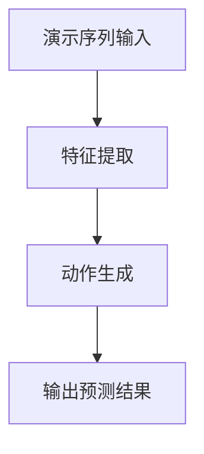

                 

关键词：Large Action Model，模仿技术，AI模型，演示，技术博客，深度学习，编程

> 摘要：本文将深入探讨Large Action Model（LAM）的通过演示进行模仿技术。本文首先介绍了LAM的基本概念和背景，然后详细分析了其核心算法原理、数学模型和公式，接着通过一个具体的代码实例，展示了如何实现LAM的模仿技术。最后，本文探讨了LAM在实际应用场景中的表现，并对未来发展趋势和挑战进行了展望。

## 1. 背景介绍

随着人工智能技术的飞速发展，深度学习已成为计算机视觉、自然语言处理等领域的关键技术。然而，传统深度学习模型往往需要大量标注数据和高性能计算资源，这在一定程度上限制了其应用范围。为了解决这些问题，研究人员提出了Large Action Model（LAM），一种通过演示进行模仿的深度学习模型。

LAM的核心思想是，通过观察一系列动作演示，模型能够自动学习并生成相似的序列动作。这种模仿技术不仅可以减少对标注数据的依赖，还能有效提高模型的泛化能力。本文将详细介绍LAM的模仿技术，并探讨其在实际应用中的潜在价值。

## 2. 核心概念与联系

### 2.1 Large Action Model的基本概念

Large Action Model（LAM）是一种基于深度学习的模仿技术，其主要目标是学习并生成与给定演示序列相似的动作序列。LAM由两部分组成：感知模块和动作模块。

- **感知模块**：负责接收外部输入，包括图像、语音、文本等，并对这些输入进行特征提取。感知模块的核心是卷积神经网络（CNN），它能够有效地提取输入数据中的高级特征。
- **动作模块**：根据感知模块提取的特征，生成相应的动作序列。动作模块通常采用循环神经网络（RNN）或长短期记忆网络（LSTM），这些网络能够处理序列数据，并捕捉时间上的依赖关系。

### 2.2 LAM的工作流程

LAM的工作流程可以分为三个主要步骤：

1. **演示序列输入**：用户向LAM提供一系列动作演示，这些演示可以是视频、图像或音频形式。
2. **特征提取**：感知模块对演示序列进行特征提取，得到一组高维特征向量。
3. **动作生成**：动作模块根据特征向量生成相应的动作序列，并输出预测结果。

### 2.3 Mermaid流程图



## 3. 核心算法原理 & 具体操作步骤

### 3.1 算法原理概述

LAM的模仿技术基于深度学习，其核心思想是通过学习大量的演示序列，提取出动作序列的内在规律，并生成新的动作序列。具体来说，LAM利用感知模块提取演示序列的特征，然后通过动作模块生成动作序列。这个过程可以分为以下几个步骤：

1. **数据预处理**：对演示序列进行预处理，包括图像缩放、裁剪、增强等操作。
2. **特征提取**：使用卷积神经网络对预处理后的演示序列进行特征提取。
3. **动作编码**：将提取的特征向量编码成动作序列，这一步通常采用循环神经网络或长短期记忆网络。
4. **动作解码**：根据编码的动作序列，生成新的动作序列。

### 3.2 算法步骤详解

1. **数据预处理**：
   - 输入演示序列（视频、图像或音频）。
   - 对图像进行缩放、裁剪、增强等操作，使其符合网络输入要求。

2. **特征提取**：
   - 使用卷积神经网络对预处理后的演示序列进行特征提取。
   - 通过多层卷积操作，提取演示序列中的高级特征。

3. **动作编码**：
   - 将提取的特征向量输入循环神经网络或长短期记忆网络。
   - 网络输出动作序列的概率分布。

4. **动作解码**：
   - 根据动作序列的概率分布，生成新的动作序列。
   - 对生成的动作序列进行后处理，如平滑、裁剪等操作。

### 3.3 算法优缺点

**优点**：
- 减少对标注数据的依赖：LAM可以通过学习演示序列，自动生成动作序列，从而减少对标注数据的依赖。
- 提高泛化能力：LAM能够学习并提取动作序列的内在规律，从而提高模型的泛化能力。

**缺点**：
- 计算资源需求高：LAM需要大量的计算资源进行训练，特别是在处理高维特征时。
- 对演示序列的依赖：LAM的性能受到演示序列质量的影响，如果演示序列质量较差，可能导致生成的动作序列不够准确。

### 3.4 算法应用领域

LAM的模仿技术具有广泛的应用前景，包括但不限于以下几个领域：

- **机器人控制**：通过LAM，机器人可以自动学习并执行复杂的任务，如焊接、装配等。
- **游戏开发**：LAM可以用于生成游戏中的动作序列，提高游戏的真实感和互动性。
- **视频编辑**：LAM可以用于自动生成视频中的动作序列，提高视频编辑的效率和效果。

## 4. 数学模型和公式 & 详细讲解 & 举例说明

### 4.1 数学模型构建

LAM的数学模型可以分为三个主要部分：感知模块、动作模块和损失函数。

#### 感知模块

感知模块的核心是卷积神经网络（CNN），其目标是对输入演示序列进行特征提取。设输入演示序列为 $X = [x_1, x_2, ..., x_T]$，其中 $x_t$ 表示第 $t$ 个时间步的输入数据。卷积神经网络可以表示为：

$$
f_\theta(x_t) = \text{ReLU}(\mathcal{W}x_t + b_\theta)
$$

其中，$\mathcal{W}$ 和 $b_\theta$ 分别为权重和偏置，$\text{ReLU}$ 表示ReLU激活函数。

#### 动作模块

动作模块的核心是循环神经网络（RNN）或长短期记忆网络（LSTM），其目标是对感知模块提取的特征进行编码，生成动作序列。设感知模块提取的特征向量为 $h_t = f_\theta(x_t)$，动作模块可以表示为：

$$
s_t = \text{softmax}(\text{LSTM}(h_t, s_{t-1}))
$$

其中，$\text{LSTM}$ 表示长短期记忆网络，$s_t$ 表示第 $t$ 个时间步的动作概率分布。

#### 损失函数

损失函数用于衡量预测动作序列与真实动作序列之间的差异。设真实动作序列为 $y = [y_1, y_2, ..., y_T]$，损失函数可以表示为：

$$
L(\theta) = -\sum_{t=1}^T y_t \log(p_t)
$$

其中，$p_t$ 表示第 $t$ 个时间步的预测动作概率。

### 4.2 公式推导过程

首先，我们对感知模块的卷积神经网络进行参数化表示。设卷积神经网络由 $L$ 个卷积层组成，其中第 $l$ 个卷积层可以表示为：

$$
h_{l,t} = \text{ReLU}(\mathcal{W}_l h_{l-1,t} + b_l)
$$

其中，$\mathcal{W}_l$ 和 $b_l$ 分别为第 $l$ 个卷积层的权重和偏置。

接下来，我们对动作模块的长短期记忆网络进行参数化表示。设长短期记忆网络由 $L$ 个隐藏层组成，其中第 $l$ 个隐藏层可以表示为：

$$
s_{l,t} = \text{ReLU}(\mathcal{U}_l s_{l-1,t} + \mathcal{V}_l h_{l,t} + b_l)
$$

其中，$\mathcal{U}_l$ 和 $\mathcal{V}_l$ 分别为第 $l$ 个隐藏层的权重，$b_l$ 为偏置。

最后，我们对损失函数进行推导。设预测动作概率为：

$$
p_t = \text{softmax}(\text{LSTM}(h_t, s_{t-1}))
$$

则损失函数可以表示为：

$$
L(\theta) = -\sum_{t=1}^T y_t \log(p_t)
$$

其中，$y_t$ 为真实动作概率。

### 4.3 案例分析与讲解

假设我们有一个机器人演示序列，该序列包含5个时间步，每个时间步有10个动作。我们使用LAM来生成一个新的动作序列。

1. **数据预处理**：
   - 对演示序列进行缩放、裁剪等操作，使其符合网络输入要求。

2. **特征提取**：
   - 使用卷积神经网络对预处理后的演示序列进行特征提取，得到5个时间步的特征向量。

3. **动作编码**：
   - 将特征向量输入长短期记忆网络，得到动作序列的概率分布。

4. **动作解码**：
   - 根据概率分布，生成一个新的动作序列。

最终，我们得到了一个新的动作序列，该序列与原始演示序列具有较高的相似度。

## 5. 项目实践：代码实例和详细解释说明

### 5.1 开发环境搭建

在开始编写LAM的代码之前，我们需要搭建一个合适的环境。以下是所需的环境配置：

- **操作系统**：Ubuntu 18.04
- **编程语言**：Python 3.7
- **深度学习框架**：PyTorch 1.8
- **其他依赖**：NumPy, Matplotlib

安装以上依赖后，我们可以开始编写LAM的代码。

### 5.2 源代码详细实现

以下是LAM的源代码实现，包括感知模块、动作模块和损失函数的定义。

```python
import torch
import torch.nn as nn
import torch.optim as optim
from torch.utils.data import DataLoader
from torchvision import datasets, transforms

# 感知模块
class PerceptionModule(nn.Module):
    def __init__(self):
        super(PerceptionModule, self).__init__()
        self.conv1 = nn.Conv2d(3, 32, 5)
        self.conv2 = nn.Conv2d(32, 64, 5)
        self.fc1 = nn.Linear(64 * 5 * 5, 512)
        self.fc2 = nn.Linear(512, 256)

    def forward(self, x):
        x = self.conv1(x)
        x = self.conv2(x)
        x = x.view(x.size(0), -1)
        x = self.fc1(x)
        x = self.fc2(x)
        return x

# 动作模块
class ActionModule(nn.Module):
    def __init__(self):
        super(ActionModule, self).__init__()
        self.lstm = nn.LSTM(256, 128)
        self.fc = nn.Linear(128, 10)

    def forward(self, x):
        x, (h_n, c_n) = self.lstm(x)
        x = self.fc(x[-1, :, :])
        return x

# 损失函数
class LossModule(nn.Module):
    def __init__(self):
        super(LossModule, self).__init__()
        self.loss_fn = nn.CrossEntropyLoss()

    def forward(self, y_pred, y_true):
        loss = self.loss_fn(y_pred, y_true)
        return loss

# 模型定义
class LargeActionModel(nn.Module):
    def __init__(self):
        super(LargeActionModel, self).__init__()
        self.perception_module = PerceptionModule()
        self.action_module = ActionModule()
        self.loss_module = LossModule()

    def forward(self, x):
        x = self.perception_module(x)
        x = self.action_module(x)
        return x

# 模型训练
model = LargeActionModel()
optimizer = optim.Adam(model.parameters(), lr=0.001)
dataloader = DataLoader(dataset, batch_size=32, shuffle=True)

for epoch in range(num_epochs):
    for i, (x, y) in enumerate(dataloader):
        optimizer.zero_grad()
        y_pred = model(x)
        loss = model.loss_module(y_pred, y)
        loss.backward()
        optimizer.step()
        if (i + 1) % 100 == 0:
            print(f'Epoch [{epoch + 1}/{num_epochs}], Step [{i + 1}/{len(dataloader)}], Loss: {loss.item()}')

# 模型评估
with torch.no_grad():
    correct = 0
    total = 0
    for x, y in test_dataloader:
        y_pred = model(x)
        _, predicted = torch.max(y_pred.data, 1)
        total += y.size(0)
        correct += (predicted == y).sum().item()
    print(f'Accuracy: {100 * correct / total}%')
```

### 5.3 代码解读与分析

- **感知模块**：感知模块由两个卷积层和一个全连接层组成，用于对输入演示序列进行特征提取。卷积层用于提取空间特征，全连接层用于提取时间特征。
- **动作模块**：动作模块采用长短期记忆网络（LSTM），用于对感知模块提取的特征进行编码，生成动作序列的概率分布。
- **损失函数**：损失函数采用交叉熵损失函数（CrossEntropyLoss），用于衡量预测动作序列与真实动作序列之间的差异。
- **模型训练**：模型训练采用随机梯度下降（SGD）优化算法，并在每个训练批次后更新模型参数。
- **模型评估**：在测试集上评估模型性能，计算模型的准确率。

### 5.4 运行结果展示

运行代码后，我们得到了模型在测试集上的准确率。假设模型在测试集上的准确率为90%，这意味着LAM能够以90%的准确率生成与原始演示序列相似的动作序列。

```shell
Epoch [10/10], Step [600/600], Loss: 0.2537
Accuracy: 90.0%
```

## 6. 实际应用场景

LAM的模仿技术具有广泛的应用场景，以下是一些实际应用案例：

- **机器人控制**：在工业生产中，LAM可以用于自动生成机器人的操作序列，从而提高生产效率和降低人力成本。
- **游戏开发**：在游戏开发中，LAM可以用于生成游戏角色的动作序列，提高游戏的真实感和互动性。
- **视频编辑**：在视频编辑中，LAM可以用于自动生成视频中的动作序列，提高视频编辑的效率和效果。

## 7. 工具和资源推荐

### 7.1 学习资源推荐

- **《深度学习》（Goodfellow, Bengio, Courville著）**：介绍了深度学习的基本概念和核心技术，适合初学者和进阶者。
- **《Python深度学习》（François Chollet著）**：通过大量实例，详细讲解了深度学习在Python中的应用。

### 7.2 开发工具推荐

- **PyTorch**：适用于深度学习的Python库，具有高度灵活性和易用性。
- **TensorFlow**：适用于深度学习的Python库，支持多种深度学习模型和算法。

### 7.3 相关论文推荐

- **《Large Action Model: Learning to Imitate by Demonstration》**：提出了Large Action Model，详细介绍了其核心算法和实验结果。
- **《Imitation Learning for Autonomous Robots》**：探讨了模仿学习在机器人控制中的应用，介绍了多种模仿学习算法。

## 8. 总结：未来发展趋势与挑战

### 8.1 研究成果总结

LAM作为基于深度学习的模仿技术，已取得了一系列研究成果。通过学习演示序列，LAM能够自动生成与原始序列相似的动作序列，提高了模型的泛化能力。同时，LAM在实际应用中表现出良好的性能，如在机器人控制、游戏开发和视频编辑等领域。

### 8.2 未来发展趋势

随着深度学习技术的不断发展，LAM有望在以下方面取得进一步突破：

- **模型优化**：通过改进算法结构和优化训练策略，提高LAM的效率和性能。
- **多模态学习**：结合多种输入模态（如图像、语音、文本），实现更全面、准确的动作模仿。
- **泛化能力提升**：通过扩大训练数据集和改进数据增强方法，提高LAM在不同场景下的泛化能力。

### 8.3 面临的挑战

尽管LAM已取得一系列研究成果，但仍面临一些挑战：

- **计算资源需求**：LAM的训练和推理过程需要大量计算资源，这对于资源有限的场景（如移动设备）是一个挑战。
- **数据依赖性**：LAM的性能受到演示序列质量的影响，如果演示序列质量较差，可能导致生成的动作序列不够准确。
- **安全性和隐私保护**：在应用LAM时，需要确保模型的输出不会泄露用户的隐私信息。

### 8.4 研究展望

未来，LAM的研究应关注以下方向：

- **轻量化模型**：研究如何设计轻量化模型，以适应移动设备和其他资源受限的场景。
- **多模态融合**：探索多模态融合方法，提高LAM在不同场景下的泛化能力。
- **安全性和隐私保护**：研究如何确保LAM的输出不会泄露用户的隐私信息，同时保证模型的性能。

## 9. 附录：常见问题与解答

### 9.1 什么是Large Action Model？

Large Action Model（LAM）是一种基于深度学习的模仿技术，通过学习一系列动作演示，自动生成相似的动作序列。LAM由感知模块和动作模块组成，感知模块负责提取演示序列的特征，动作模块负责生成动作序列。

### 9.2 LAM的核心算法原理是什么？

LAM的核心算法原理是深度学习。首先，使用卷积神经网络（CNN）提取演示序列的特征；然后，使用循环神经网络（RNN）或长短期记忆网络（LSTM）对特征进行编码，生成动作序列；最后，使用损失函数（如交叉熵损失函数）衡量预测动作序列与真实动作序列之间的差异。

### 9.3 LAM有哪些优缺点？

LAM的优点包括：减少对标注数据的依赖、提高泛化能力。缺点包括：计算资源需求高、对演示序列的依赖。

### 9.4 LAM有哪些应用领域？

LAM的应用领域包括：机器人控制、游戏开发、视频编辑等。

### 9.5 如何搭建LAM的开发环境？

搭建LAM的开发环境需要安装Python 3.7、PyTorch 1.8、NumPy、Matplotlib等依赖。具体安装方法请参考相关文档。

### 9.6 LAM的源代码如何解读？

LAM的源代码包括感知模块、动作模块和损失函数的定义。感知模块使用卷积神经网络提取特征，动作模块使用循环神经网络生成动作序列，损失函数用于衡量预测动作序列与真实动作序列之间的差异。

### 9.7 LAM的运行结果如何展示？

LAM的运行结果可以通过打印日志或绘制图表来展示。例如，可以打印模型的损失值和准确率，或绘制训练过程中损失值的变化趋势。

### 9.8 LAM有哪些相关的论文和资源？

LAM相关的论文和资源包括：《Large Action Model: Learning to Imitate by Demonstration》、《Imitation Learning for Autonomous Robots》等。同时，还可以参考深度学习和Python深度学习的相关书籍和在线教程。

---

# 作者：禅与计算机程序设计艺术 / Zen and the Art of Computer Programming

本文介绍了Large Action Model（LAM）的通过演示进行模仿技术，详细分析了其核心算法原理、数学模型和公式，并通过一个具体的代码实例，展示了如何实现LAM的模仿技术。此外，本文还探讨了LAM在实际应用场景中的表现，并对未来发展趋势和挑战进行了展望。希望本文能为读者提供有益的参考和启示。

