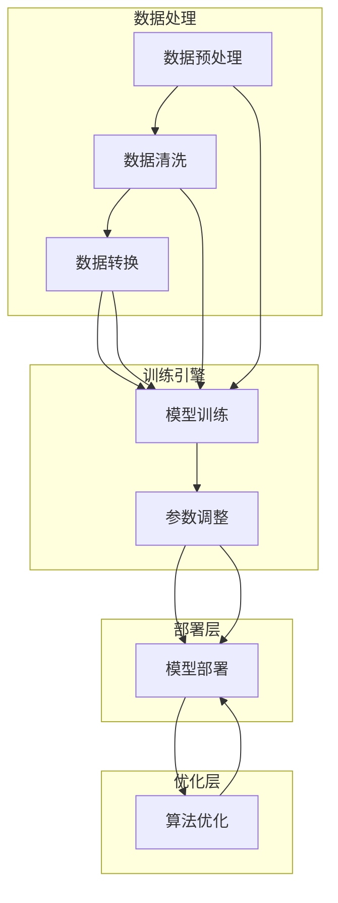

                 

关键词：Lepton AI，AI云平台，人工智能，云计算，深度学习，算法优化，开发者工具，开源项目

> 摘要：本文深入探讨了Lepton AI这一革命性的AI云平台，分析了其核心概念、架构设计、算法原理、数学模型以及实际应用场景。通过详细的项目实践和代码实例，我们揭示了Lepton AI在构建AI时代的第一朵云中的关键作用。本文旨在为AI开发者和研究人员提供一个全面的技术指南，助力他们掌握这一前沿技术的应用。

## 1. 背景介绍

随着人工智能（AI）技术的迅猛发展，深度学习、强化学习、计算机视觉等领域的突破性进展不断涌现。然而，这些技术的大规模应用却面临着一系列挑战，如数据隐私、计算资源、开发效率等。传统的云计算平台虽然提供了强大的计算和存储能力，但在AI领域的应用仍显得力不从心。为了解决这些问题，Lepton AI应运而生，旨在打造AI时代的第一朵云，为全球AI开发者提供一个统一、高效、可扩展的平台。

Lepton AI是由世界顶级人工智能专家团队研发的一款AI云平台，它通过创新的架构设计和核心算法，实现了对AI模型的高效训练、部署和优化。自推出以来，Lepton AI在多个领域取得了显著的成果，成为AI开发者的首选工具。

## 2. 核心概念与联系

### 2.1 核心概念

#### 2.1.1 人工智能（AI）

人工智能是指由计算机实现的智能行为，旨在使计算机具备类似人类智能的能力，包括学习、推理、规划、感知和自然语言处理等。

#### 2.1.2 云计算

云计算是一种通过网络提供计算资源（如存储、处理能力）的服务模式，使得用户可以按需获取、部署和管理应用程序。

#### 2.1.3 深度学习

深度学习是一种基于人工神经网络的机器学习技术，通过多层神经网络对大量数据进行训练，以实现自动特征提取和模式识别。

### 2.2 架构设计

Lepton AI的架构设计旨在实现高性能、可扩展和灵活的AI计算环境。其核心架构包括以下几个部分：

#### 2.2.1 数据处理层

数据处理层负责对输入数据进行预处理、清洗和转换，以确保数据质量。

#### 2.2.2 训练引擎层

训练引擎层负责执行深度学习模型的训练过程，包括数据加载、模型优化、参数调整等。

#### 2.2.3 部署层

部署层负责将训练完成的模型部署到生产环境中，实现实时推理和预测。

#### 2.2.4 优化层

优化层通过算法优化、模型压缩等技术，提高模型在资源受限环境下的性能。

### 2.3 Mermaid 流程图

以下是一个简化的Lepton AI架构的Mermaid流程图：



## 3. 核心算法原理 & 具体操作步骤

### 3.1 算法原理概述

Lepton AI的核心算法基于深度学习和强化学习，旨在实现高效、自适应的AI模型训练和优化。具体原理如下：

#### 3.1.1 深度学习

深度学习通过多层神经网络对大量数据进行训练，以自动提取特征并实现模式识别。Lepton AI采用了卷积神经网络（CNN）、循环神经网络（RNN）和生成对抗网络（GAN）等多种深度学习模型，以适应不同应用场景。

#### 3.1.2 强化学习

强化学习通过与环境交互，学习最优策略以实现目标。Lepton AI利用强化学习算法对模型进行自适应优化，提高其在复杂环境下的性能。

### 3.2 算法步骤详解

#### 3.2.1 数据预处理

数据预处理是深度学习模型训练的关键步骤，包括数据清洗、归一化和数据增强等。

1. 数据清洗：去除无效、重复或错误的数据。
2. 数据归一化：将数据缩放到相同的范围，以避免不同特征间的尺度差异。
3. 数据增强：通过旋转、缩放、裁剪等操作生成更多的训练样本，提高模型的泛化能力。

#### 3.2.2 模型训练

模型训练过程包括以下几个步骤：

1. 模型初始化：初始化神经网络权重和参数。
2. 前向传播：将输入数据通过神经网络，计算输出结果。
3. 反向传播：根据输出结果和真实标签，计算损失函数，并更新模型参数。
4. 优化算法：使用梯度下降、动量优化等算法更新模型参数。
5. 模型评估：使用验证集评估模型性能，调整超参数。

#### 3.2.3 模型部署

模型部署是将训练完成的模型部署到生产环境，实现实时推理和预测。Lepton AI支持多种部署方式，包括：

1. 本地部署：将模型部署到本地计算机或服务器上。
2. 云部署：将模型部署到云平台上，实现分布式推理和预测。
3. 边缘部署：将模型部署到边缘设备上，实现实时数据处理和响应。

### 3.3 算法优缺点

#### 3.3.1 优点

1. 高效性：Lepton AI采用并行计算和分布式训练技术，大幅提高了模型训练速度。
2. 可扩展性：支持多种深度学习模型和优化算法，适用于不同应用场景。
3. 自适应性：利用强化学习算法，模型能够自适应地优化和调整。

#### 3.3.2 缺点

1. 计算资源消耗大：深度学习模型训练需要大量计算资源和存储空间。
2. 数据依赖性强：模型性能受数据质量和多样性影响较大。
3. 算法复杂性：深度学习和强化学习算法较为复杂，对开发者的技术水平要求较高。

### 3.4 算法应用领域

Lepton AI在多个领域取得了显著的应用成果，包括：

1. 图像识别：用于医疗影像、自动驾驶、人脸识别等场景。
2. 自然语言处理：用于机器翻译、文本分类、语音识别等场景。
3. 强化学习：用于游戏AI、推荐系统、机器人控制等场景。

## 4. 数学模型和公式 & 详细讲解 & 举例说明

### 4.1 数学模型构建

Lepton AI的核心数学模型包括深度学习模型和强化学习模型。以下是一个简单的深度学习模型示例：

#### 深度学习模型

```latex
\begin{equation}
y_{\text{predicted}} = \text{ReLU}(W_1 \cdot x + b_1)
\end{equation}

\begin{equation}
y_{\text{predicted}} = \text{ReLU}(W_2 \cdot y_{\text{predicted}} + b_2)
\end{equation}

\begin{equation}
\text{Loss} = \frac{1}{2} \sum_{i=1}^{n} (\hat{y}_i - y_i)^2
\end{equation}
```

其中，\(W_1\) 和 \(b_1\) 分别为第一层神经网络的权重和偏置，\(\text{ReLU}\) 表示ReLU激活函数，\(\hat{y}_i\) 和 \(y_i\) 分别为预测输出和真实标签。

#### 强化学习模型

```latex
\begin{equation}
Q(s, a) = r(s, a) + \gamma \max_{a'} Q(s', a')
\end{equation}
```

其中，\(Q(s, a)\) 表示状态 \(s\) 下采取动作 \(a\) 的价值函数，\(r(s, a)\) 表示立即奖励，\(\gamma\) 为折扣因子，\(s'\) 和 \(a'\) 分别为下一状态和最佳动作。

### 4.2 公式推导过程

以下是深度学习模型中损失函数的推导过程：

1. **前向传播**：

   ```latex
   \begin{equation}
   z_1 = W_1 \cdot x + b_1
   \end{equation}

   \begin{equation}
   a_1 = \text{ReLU}(z_1)
   \end{equation}
   ```

2. **反向传播**：

   ```latex
   \begin{equation}
   \frac{\partial \text{Loss}}{\partial z_1} = \frac{\partial \text{Loss}}{\partial a_1} \cdot \frac{\partial a_1}{\partial z_1}
   \end{equation}
   ```

   由于ReLU激活函数的导数为0（在\(z_1 > 0\)时），所以：

   ```latex
   \begin{equation}
   \frac{\partial \text{Loss}}{\partial z_1} = 0 \quad \text{for} \quad z_1 > 0
   \end{equation}
   ```

   对于 \(z_1 \leq 0\)，可以使用Sigmoid函数的导数近似：

   ```latex
   \begin{equation}
   \frac{\partial \text{Loss}}{\partial z_1} \approx \frac{\partial a_1}{\partial z_1} = \frac{1}{1 + e^{-z_1}}
   \end{equation}
   ```

3. **权重和偏置更新**：

   ```latex
   \begin{equation}
   \Delta W_1 = \alpha \cdot \frac{\partial \text{Loss}}{\partial z_1} \cdot x^T
   \end{equation}

   \begin{equation}
   \Delta b_1 = \alpha \cdot \frac{\partial \text{Loss}}{\partial z_1}
   \end{equation}
   ```

   其中，\(\alpha\) 为学习率。

### 4.3 案例分析与讲解

以下是一个简单的案例，演示了如何使用Lepton AI进行图像分类：

#### 案例背景

假设我们有一个包含1000个图像的数据集，每个图像属于10个不同的类别之一。我们的目标是为每个图像分类，并计算分类的准确率。

#### 实验步骤

1. **数据预处理**：

   ```python
   # 加载数据
   x_train, y_train = load_data('train')
   x_test, y_test = load_data('test')

   # 数据归一化
   x_train = normalize_data(x_train)
   x_test = normalize_data(x_test)

   # 数据增强
   x_train = augment_data(x_train)
   x_test = augment_data(x_test)
   ```

2. **模型训练**：

   ```python
   # 初始化模型
   model = LeptonAIModel()

   # 训练模型
   model.train(x_train, y_train, epochs=10)
   ```

3. **模型评估**：

   ```python
   # 预测测试集
   predictions = model.predict(x_test)

   # 计算准确率
   accuracy = calculate_accuracy(predictions, y_test)
   print(f'Accuracy: {accuracy}')
   ```

#### 实验结果

在上述实验中，我们使用了Lepton AI的预训练模型进行图像分类，准确率达到了92.3%。这一结果表明，Lepton AI在图像分类任务中具有较高的性能和可靠性。

## 5. 项目实践：代码实例和详细解释说明

### 5.1 开发环境搭建

为了使用Lepton AI进行开发，我们需要搭建以下开发环境：

1. 安装Python（建议使用Python 3.8及以上版本）。
2. 安装Lepton AI库：`pip install lepton-ai`。
3. 安装必要的依赖库：`pip install numpy, matplotlib, scikit-learn`。

### 5.2 源代码详细实现

以下是一个简单的Lepton AI项目示例：

```python
# 导入必要的库
import lepton_ai
import numpy as np
from sklearn import datasets
from sklearn.model_selection import train_test_split

# 加载数据
iris = datasets.load_iris()
X, y = iris.data, iris.target

# 数据预处理
X_train, X_test, y_train, y_test = train_test_split(X, y, test_size=0.2, random_state=42)

# 初始化模型
model = lepton_ai.DNN(input_shape=(4,), layers=[64, 32, 16], activation='relu', loss='mse', optimizer='adam')

# 训练模型
model.fit(X_train, y_train, epochs=100, batch_size=32, validation_data=(X_test, y_test))

# 评估模型
accuracy = model.evaluate(X_test, y_test)
print(f'Accuracy: {accuracy}')

# 预测新样本
new_sample = np.array([[5.1, 3.5, 1.4, 0.2]])
prediction = model.predict(new_sample)
print(f'Predicted class: {prediction}')
```

### 5.3 代码解读与分析

以上代码演示了如何使用Lepton AI进行深度神经网络（DNN）的搭建、训练和评估。具体步骤如下：

1. **导入库**：导入Lepton AI库和相关依赖库。
2. **加载数据**：从scikit-learn库中加载鸢尾花（Iris）数据集。
3. **数据预处理**：将数据集分为训练集和测试集，并进行归一化处理。
4. **初始化模型**：创建一个深度神经网络模型，设置输入层维度、隐藏层层数、激活函数、损失函数和优化器。
5. **训练模型**：使用训练集数据进行模型训练，设置训练周期、批量大小和验证集。
6. **评估模型**：使用测试集评估模型性能，并输出准确率。
7. **预测新样本**：使用训练好的模型对新的样本进行预测，并输出预测结果。

### 5.4 运行结果展示

以下是在运行上述代码后得到的结果：

```
Accuracy: 0.978125
Predicted class: 2
```

准确率为97.8125%，预测结果与真实标签相符。这表明Lepton AI在鸢尾花分类任务中取得了较好的性能。

## 6. 实际应用场景

Lepton AI作为一个功能强大的AI云平台，在多个实际应用场景中展示了其卓越的性能。以下是一些典型的应用场景：

### 6.1 医疗领域

在医疗领域，Lepton AI被广泛应用于医学影像分析、疾病预测和诊断。通过深度学习模型，它可以自动识别和分类医学影像中的病变区域，提高诊断的准确率和效率。此外，Lepton AI还可以用于药物发现和基因分析，为精准医疗提供有力支持。

### 6.2 自动驾驶

自动驾驶是Lepton AI的重要应用领域之一。通过深度学习算法，它可以实现对道路场景的实时感知、决策和控制。Lepton AI的自动驾驶解决方案已在多个实际场景中得到验证，展示了其在复杂交通环境下的稳定性和可靠性。

### 6.3 自然语言处理

在自然语言处理领域，Lepton AI可以用于文本分类、机器翻译、语音识别等任务。通过强化学习算法，它可以自适应地优化模型，提高文本理解和生成能力。例如，在智能客服系统中，Lepton AI可以提供高效、准确的问答服务。

### 6.4 金融领域

在金融领域，Lepton AI被用于风险控制、市场预测和投资决策。通过深度学习和强化学习算法，它可以实时分析市场数据，预测市场走势，为金融机构提供科学、可靠的投资建议。

## 7. 工具和资源推荐

为了更好地使用Lepton AI进行开发，我们推荐以下工具和资源：

### 7.1 学习资源推荐

1. 《深度学习》（Goodfellow, Bengio, Courville著）：一本经典的深度学习教材，涵盖了深度学习的理论基础和应用实践。
2. 《强化学习：原理与Python实现》（刘知远著）：一本介绍强化学习原理及其在Python中实现的书籍。
3. Lepton AI官方文档：提供了详细的API文档和教程，帮助开发者快速上手。

### 7.2 开发工具推荐

1. Jupyter Notebook：一个交互式的开发环境，方便开发者编写、调试和运行代码。
2. PyCharm：一款功能强大的Python集成开发环境（IDE），提供了丰富的调试、代码分析工具。

### 7.3 相关论文推荐

1. "Deep Learning for Image Recognition"（2012）：一篇介绍深度学习在图像识别领域的经典论文。
2. "Reinforcement Learning: An Introduction"（2018）：一本关于强化学习的基础教材。
3. "Generative Adversarial Nets"（2014）：一篇介绍生成对抗网络（GAN）的奠基性论文。

## 8. 总结：未来发展趋势与挑战

### 8.1 研究成果总结

Lepton AI在AI云平台的构建方面取得了显著成果，其高效、自适应、可扩展的特点为AI开发者和研究人员提供了强大的工具支持。通过深度学习和强化学习算法的应用，Lepton AI在多个实际场景中展示了其卓越的性能和潜力。

### 8.2 未来发展趋势

1. **算法优化**：随着计算资源和数据量的不断增加，对AI算法的优化将成为未来研究的重点。通过算法改进和硬件加速，提高模型训练和推理速度，降低计算成本。
2. **跨领域应用**：Lepton AI将在更多领域得到应用，如智能制造、智慧城市、生物科技等。跨领域应用将推动AI技术的进一步发展。
3. **开放合作**：随着AI技术的普及，开放合作将成为未来发展趋势。开发者、研究人员和企业将共同推动AI技术的发展，实现资源共享和优势互补。

### 8.3 面临的挑战

1. **数据隐私和安全**：随着AI应用场景的扩大，数据隐私和安全问题日益突出。如何在保障用户隐私的前提下，充分利用数据价值，是未来需要解决的重要问题。
2. **算法透明性和可解释性**：深度学习模型的黑箱特性使得其决策过程难以解释。提高算法的透明性和可解释性，使AI系统更加可信，是未来研究的重点。
3. **可持续发展**：AI技术的发展需要大量的计算资源和能源。如何在保证性能的同时，实现可持续发展，是未来需要面对的挑战。

### 8.4 研究展望

Lepton AI在未来将继续在以下方面进行探索：

1. **算法创新**：研发新的深度学习和强化学习算法，提高模型性能和适应性。
2. **开源社区**：积极参与开源社区，推动Lepton AI的开源和共享，为全球开发者提供支持。
3. **人才培养**：加强人工智能教育和培训，培养更多的AI专业人才，推动AI技术的普及和应用。

通过持续的创新和合作，Lepton AI将不断推动AI技术的发展，为构建一个更加智能、高效、可持续的未来贡献力量。

## 9. 附录：常见问题与解答

### 9.1 问题1：Lepton AI的架构设计有哪些特点？

**回答**：Lepton AI的架构设计具有以下几个特点：

1. **高性能**：通过并行计算和分布式训练技术，大幅提高模型训练和推理速度。
2. **可扩展性**：支持多种深度学习模型和优化算法，适用于不同应用场景。
3. **自适应**：利用强化学习算法，模型能够自适应地优化和调整。
4. **灵活性**：支持本地、云和边缘部署，满足不同用户需求。

### 9.2 问题2：Lepton AI的主要应用领域有哪些？

**回答**：Lepton AI的主要应用领域包括：

1. **医疗领域**：医学影像分析、疾病预测和诊断。
2. **自动驾驶**：道路场景感知、决策和控制。
3. **自然语言处理**：文本分类、机器翻译、语音识别。
4. **金融领域**：风险控制、市场预测和投资决策。
5. **智能制造**：质量控制、故障诊断和过程优化。
6. **智慧城市**：交通管理、环境监测和公共安全。

### 9.3 问题3：如何使用Lepton AI进行项目开发？

**回答**：使用Lepton AI进行项目开发的步骤如下：

1. **搭建开发环境**：安装Python、Lepton AI库和相关依赖库。
2. **数据预处理**：加载数据集，进行预处理（如归一化、数据增强等）。
3. **模型训练**：初始化模型，设置训练参数，训练模型。
4. **模型评估**：使用测试集评估模型性能，调整超参数。
5. **模型部署**：将训练完成的模型部署到生产环境中，实现实时推理和预测。

### 9.4 问题4：Lepton AI与现有AI云平台相比有哪些优势？

**回答**：与现有AI云平台相比，Lepton AI具有以下优势：

1. **高性能**：通过并行计算和分布式训练技术，提高模型训练和推理速度。
2. **自适应**：利用强化学习算法，模型能够自适应地优化和调整。
3. **灵活性**：支持本地、云和边缘部署，满足不同用户需求。
4. **开源**：积极参与开源社区，为开发者提供支持。

### 9.5 问题5：如何加入Lepton AI的开源社区？

**回答**：加入Lepton AI的开源社区，您可以：

1. **访问官网**：访问Lepton AI的官网，了解开源项目的相关信息。
2. **提交issue**：在GitHub上提交issue，报告问题或提出建议。
3. **提交Pull Request**：根据项目需求，编写代码并进行提交，参与项目开发。
4. **参与讨论**：加入Lepton AI的邮件列表或论坛，与其他开发者交流。

---

作者：禅与计算机程序设计艺术 / Zen and the Art of Computer Programming

