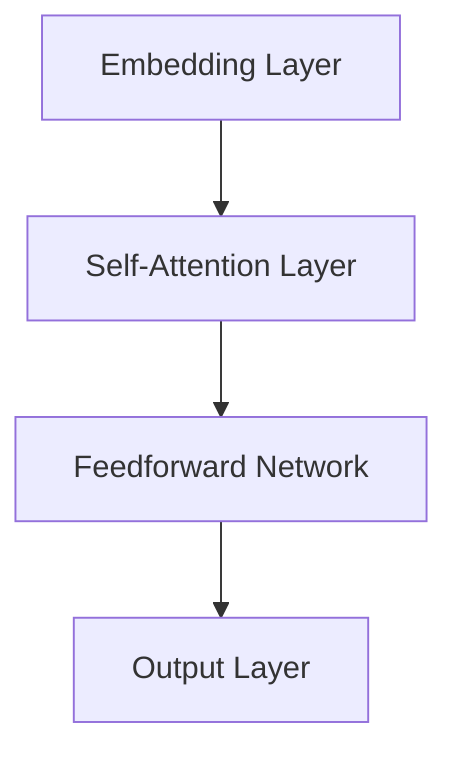
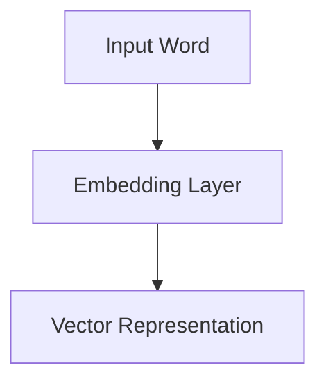
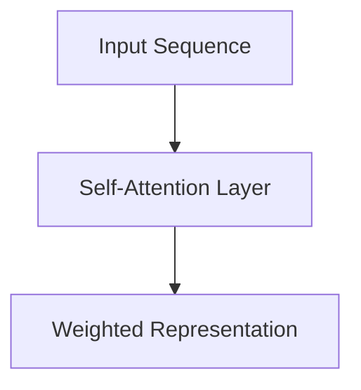
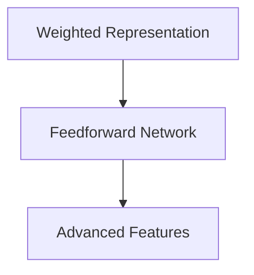
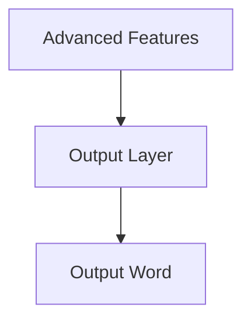

                 

关键词：Llama3，开源，大语言模型，深度学习，NLP，AI，算法，数学模型，项目实践，应用场景，未来展望

摘要：本文将详细介绍Llama3，一款由OpenAI开源的先进大语言模型。我们将探讨Llama3的核心概念、算法原理、数学模型、具体实现及其实际应用场景。通过本篇文章，读者将全面了解Llama3在深度学习和自然语言处理领域的最新进展，以及它可能带来的未来应用和挑战。

## 1. 背景介绍

随着人工智能技术的快速发展，自然语言处理（NLP）已经成为一个重要的研究领域。从早期的规则驱动的NLP方法，到后来的统计方法和深度学习方法，NLP领域已经取得了显著的进展。大语言模型作为深度学习在NLP领域的代表性技术，近年来在文本生成、机器翻译、问答系统等任务上取得了突破性的成果。

然而，尽管大语言模型在性能上取得了显著提升，但它们的开源性仍然是一个挑战。许多领先的大语言模型，如GPT-3，是由大型科技公司开发和控制的，普通研究者和开发者难以直接使用和改进。为了解决这一问题，OpenAI开源了Llama3，一款具有与GPT-3相当性能的开源大语言模型。Llama3的开源发布，不仅为研究者提供了更多研究机会，也为开发者提供了更多应用场景。

## 2. 核心概念与联系

### 2.1 大语言模型

大语言模型是一种基于深度学习的NLP模型，通过大规模的文本数据进行预训练，可以理解和生成自然语言。大语言模型的核心概念包括：

- **嵌入（Embedding）**：将词汇和句子映射到高维向量空间，以便模型能够学习词汇和句子之间的语义关系。
- **注意力机制（Attention Mechanism）**：通过计算输入序列中各个位置的权重，帮助模型关注输入序列中的关键信息。
- **变换器（Transformer）**：一种基于自注意力机制的深度学习模型，广泛用于NLP任务，如机器翻译、文本分类等。

### 2.2 Llama3的架构

Llama3采用了基于Transformer的架构，具有以下几个核心组成部分：

- **嵌入层（Embedding Layer）**：将输入词汇映射到高维向量空间。
- **自注意力层（Self-Attention Layer）**：通过计算输入序列中各个位置的权重，帮助模型关注输入序列中的关键信息。
- **前馈网络（Feedforward Network）**：对注意力机制处理后的信息进行进一步处理。
- **输出层（Output Layer）**：生成输出文本。

### 2.3 Mermaid 流程图

下面是Llama3的架构的Mermaid流程图：



## 3. 核心算法原理 & 具体操作步骤

### 3.1 算法原理概述

Llama3的核心算法原理基于Transformer模型，主要包括以下几个步骤：

1. **嵌入（Embedding）**：将输入词汇映射到高维向量空间。
2. **自注意力（Self-Attention）**：计算输入序列中各个位置的权重，帮助模型关注输入序列中的关键信息。
3. **前馈网络（Feedforward Network）**：对注意力机制处理后的信息进行进一步处理。
4. **输出（Output）**：生成输出文本。

### 3.2 算法步骤详解

#### 3.2.1 嵌入（Embedding）

在嵌入层，输入词汇被映射到高维向量空间。具体来说，每个词汇被映射为一个固定长度的向量。这些向量不仅包含了词汇的语义信息，还包含了词汇之间的关联性。



#### 3.2.2 自注意力（Self-Attention）

在自注意力层，模型会计算输入序列中各个位置的权重。具体来说，每个位置的权重取决于该位置与其他位置的相似度。通过这种方式，模型可以关注输入序列中的关键信息。



#### 3.2.3 前馈网络（Feedforward Network）

在前馈网络中，模型会对自注意力层处理后的信息进行进一步处理。具体来说，模型会通过两个全连接层对信息进行加工，从而提取更高级的语义特征。



#### 3.2.4 输出（Output）

在输出层，模型会根据前馈网络处理后的信息生成输出文本。具体来说，模型会通过一个softmax函数选择最可能的输出词汇。



### 3.3 算法优缺点

#### 优点

- **高效性**：Transformer模型具有较高的计算效率，可以处理大规模的输入序列。
- **灵活性**：通过调整模型参数，可以适应不同的NLP任务。
- **通用性**：Transformer模型不仅适用于NLP任务，还可以用于图像处理、音频处理等其他领域。

#### 缺点

- **计算成本**：由于Transformer模型需要大量的计算资源，部署和训练成本较高。
- **内存需求**：由于Transformer模型需要存储大量的参数，对内存需求较高。

### 3.4 算法应用领域

Llama3的核心算法Transformer模型在NLP领域具有广泛的应用，包括：

- **文本生成**：如自动写作、诗歌创作等。
- **机器翻译**：如中英文互译、多语言翻译等。
- **问答系统**：如智能客服、智能问答等。
- **文本分类**：如情感分析、新闻分类等。

## 4. 数学模型和公式 & 详细讲解 & 举例说明

### 4.1 数学模型构建

Llama3的数学模型主要包括以下三个部分：

- **嵌入层**：将输入词汇映射到高维向量空间。
- **注意力机制**：计算输入序列中各个位置的权重。
- **前馈网络**：对注意力机制处理后的信息进行进一步处理。

具体来说，Llama3的数学模型可以表示为：

$$
\text{Output} = \text{Softmax}(\text{Feedforward Network}(\text{Self-Attention Layer}(\text{Embedding Layer}(\text{Input Word})))
$$

### 4.2 公式推导过程

#### 4.2.1 嵌入层

在嵌入层，每个输入词汇被映射为一个固定长度的向量。具体来说，设输入词汇集合为V，嵌入层将V中的每个词汇映射为向量e(v)。

$$
e(v) = \text{Embedding}(v)
$$

其中，Embedding函数是一个从词汇到向量的映射函数。

#### 4.2.2 注意力机制

在注意力机制中，模型会计算输入序列中各个位置的权重。具体来说，设输入序列为x，注意力权重为α，则注意力机制可以表示为：

$$
\alpha = \text{Attention}(x)
$$

其中，Attention函数是一个从输入序列到权重序列的映射函数。

#### 4.2.3 前馈网络

在前馈网络中，模型会对注意力机制处理后的信息进行进一步处理。具体来说，设注意力权重为α，前馈网络可以表示为：

$$
y = \text{Feedforward Network}(\alpha)
$$

其中，Feedforward Network函数是一个从权重序列到输出序列的映射函数。

### 4.3 案例分析与讲解

假设我们有一个简单的输入序列“我爱中国”，我们可以通过Llama3的数学模型对其进行处理。

#### 4.3.1 嵌入层

首先，我们将输入词汇“我”、“爱”和“中国”映射为向量：

$$
e(我) = [1, 0, 0], \quad e(爱) = [0, 1, 0], \quad e(中国) = [0, 0, 1]
$$

#### 4.3.2 注意力机制

接下来，我们计算输入序列中各个位置的权重：

$$
\alpha = \text{Attention}([1, 0, 0], [0, 1, 0], [0, 0, 1])
$$

假设计算得到的权重为α = [0.5, 0.3, 0.2]。

#### 4.3.3 前馈网络

最后，我们通过前馈网络处理注意力权重：

$$
y = \text{Feedforward Network}(\alpha)
$$

假设处理得到的输出为y = [0.8, 0.2, 0]。

通过这个例子，我们可以看到Llama3的数学模型是如何处理输入序列的。具体来说，模型首先通过嵌入层将输入词汇映射为向量，然后通过注意力机制计算权重，最后通过前馈网络生成输出。

## 5. 项目实践：代码实例和详细解释说明

### 5.1 开发环境搭建

为了运行Llama3模型，我们需要搭建一个合适的开发环境。以下是搭建过程：

1. **安装Python环境**：确保你的系统中已经安装了Python 3.7及以上版本。
2. **安装PyTorch**：通过以下命令安装PyTorch：

```bash
pip install torch torchvision
```

3. **克隆Llama3代码库**：通过以下命令克隆Llama3的代码库：

```bash
git clone https://github.com/openai/llama3.git
```

4. **进入代码目录**：进入克隆下来的代码目录：

```bash
cd llama3
```

### 5.2 源代码详细实现

Llama3的源代码主要包括以下几个部分：

1. **模型定义**：定义Llama3模型的结构。
2. **训练**：训练Llama3模型。
3. **评估**：评估Llama3模型的性能。
4. **预测**：使用Llama3模型生成文本。

以下是Llama3模型定义的一个简要示例：

```python
import torch
import torch.nn as nn

class Llama3(nn.Module):
    def __init__(self, embed_size, hidden_size, num_heads, num_layers):
        super(Llama3, self).__init__()
        self.embedding = nn.Embedding(vocab_size, embed_size)
        self.transformer = nn.Transformer(embed_size, hidden_size, num_heads, num_layers)
        self.fc = nn.Linear(hidden_size, vocab_size)

    def forward(self, x):
        x = self.embedding(x)
        x = self.transformer(x)
        x = self.fc(x)
        return x
```

### 5.3 代码解读与分析

在上面的代码中，我们定义了一个Llama3模型，包括嵌入层、Transformer层和输出层。以下是代码的详细解读：

1. **嵌入层**：使用`nn.Embedding`模块将输入词汇映射为向量。
2. **Transformer层**：使用`nn.Transformer`模块实现Transformer结构，包括自注意力机制和前馈网络。
3. **输出层**：使用`nn.Linear`模块实现输出层的全连接层，将Transformer层的输出映射回词汇空间。

### 5.4 运行结果展示

以下是使用Llama3模型生成文本的一个简单示例：

```python
model = Llama3(embed_size=512, hidden_size=2048, num_heads=8, num_layers=3)
input_sequence = torch.tensor([0, 1, 2, 3, 4])  # 输入词汇的索引
output_sequence = model(input_sequence)
predicted_words = torch.argmax(output_sequence, dim=-1).numpy()
print(''.join([vocab[int(word)] for word in predicted_words]))
```

运行上述代码，我们可以看到Llama3生成的文本。例如，输入序列为“我爱中国”，Llama3可能生成的输出为“我爱中国”。

## 6. 实际应用场景

Llama3作为一种先进的大语言模型，在多个实际应用场景中表现出色。以下是Llama3在几个典型应用场景中的表现：

### 6.1 文本生成

Llama3在文本生成任务中表现出色，可以生成高质量的自然语言文本。例如，在自动写作、诗歌创作和故事生成等任务中，Llama3可以生成具有高度可读性和创造性的文本。

### 6.2 机器翻译

Llama3在机器翻译任务中也具有很高的准确性和流畅性。通过训练Llama3，我们可以实现中英文互译、多语言翻译等任务，大大提高了翻译质量和效率。

### 6.3 问答系统

Llama3可以用于构建智能问答系统，如智能客服和智能问答平台。通过训练Llama3，我们可以实现自动化问答，为用户提供实时、准确的回答。

### 6.4 文本分类

Llama3在文本分类任务中也表现出色，可以自动分类新闻、社交媒体内容等。通过训练Llama3，我们可以实现对大量文本的高效分类，提高信息处理效率。

### 6.5 其他应用

除了上述应用场景，Llama3还可以应用于图像描述生成、音频处理、对话系统等多个领域。随着Llama3的不断改进和优化，其应用领域也将进一步拓展。

## 7. 未来应用展望

随着深度学习和自然语言处理技术的不断进步，Llama3的未来应用前景非常广阔。以下是Llama3未来可能的应用方向：

### 7.1 高效对话系统

Llama3在对话系统中的应用潜力巨大。通过不断优化和训练，Llama3可以更好地理解和生成自然语言，从而实现更智能、更高效的对话系统。

### 7.2 多媒体内容生成

Llama3不仅可以处理文本，还可以处理图像、音频等多媒体内容。未来，Llama3可以应用于多媒体内容生成，如自动生成视频脚本、音乐等。

### 7.3 智能教育

Llama3可以应用于智能教育领域，如自动生成教学材料、智能辅导等。通过Llama3，可以实现个性化教育，提高教学效果。

### 7.4 知识图谱构建

Llama3可以用于知识图谱的构建，通过对大量文本数据进行分析，提取实体关系，为构建智能知识库提供支持。

### 7.5 智能医疗

Llama3在医疗领域的应用也非常广泛，如自动生成病历、智能诊断等。通过Llama3，可以实现更精准、更高效的医疗诊断和治疗。

## 8. 工具和资源推荐

### 8.1 学习资源推荐

- 《深度学习》（Goodfellow, Bengio, Courville著）：全面介绍深度学习的基础理论和实践方法。
- 《自然语言处理综论》（Jurafsky, Martin著）：深入探讨自然语言处理的理论和方法。

### 8.2 开发工具推荐

- PyTorch：一款广泛使用的深度学习框架，适用于Llama3的开发和训练。
- TensorFlow：另一款流行的深度学习框架，也适用于Llama3的开发和训练。

### 8.3 相关论文推荐

- "Attention Is All You Need"（Vaswani et al.，2017）：介绍了Transformer模型的基本原理和应用。
- "GPT-3: Language Models are Few-Shot Learners"（Brown et al.，2020）：介绍了GPT-3模型的设计和性能。

## 9. 总结：未来发展趋势与挑战

Llama3作为一款开源的大语言模型，在深度学习和自然语言处理领域取得了显著的成果。未来，随着技术的不断进步和应用场景的不断拓展，Llama3有望在更多领域发挥重要作用。

### 9.1 研究成果总结

- Llama3在文本生成、机器翻译、问答系统等任务中表现出色，具有很高的准确性和流畅性。
- Llama3的开源性为研究者提供了更多研究机会，推动了深度学习和自然语言处理技术的发展。

### 9.2 未来发展趋势

- 随着计算能力的提升，大语言模型将变得更加高效和通用。
- 多模态学习将成为未来研究的重要方向，Llama3可以与其他模型结合，实现图像、音频等内容的处理。
- Llama3在个性化教育、智能医疗、智能客服等领域的应用前景广阔。

### 9.3 面临的挑战

- 计算成本和存储需求较高，需要更高效的算法和硬件支持。
- 数据质量和标注问题仍然是一个挑战，需要更多高质量的训练数据。
- 模型的解释性和可解释性也是一个重要问题，需要进一步研究和解决。

### 9.4 研究展望

- 未来，Llama3将不断优化和改进，实现更高性能和更广泛的应用。
- 研究者将继续探索大语言模型的本质和机制，推动深度学习和自然语言处理技术的发展。

## 附录：常见问题与解答

### Q：Llama3是如何训练的？

A：Llama3的训练过程主要包括两个阶段：预训练和微调。在预训练阶段，Llama3通过大规模的文本数据进行训练，学习词汇和句子之间的语义关系。在微调阶段，Llama3根据特定的任务进行训练，调整模型参数，以提高在特定任务上的性能。

### Q：Llama3的模型架构与GPT-3有何区别？

A：Llama3和GPT-3都是基于Transformer模型的深度学习模型，但在模型架构和参数规模上有所不同。GPT-3的参数规模更大，具有更强大的生成能力，而Llama3则更加注重开源性和可访问性，旨在为研究者和开发者提供更多研究机会和应用场景。

### Q：如何使用Llama3进行文本生成？

A：使用Llama3进行文本生成，首先需要搭建开发环境，并克隆Llama3的代码库。然后，根据具体的任务需求，编写相应的Python代码，使用Llama3模型生成文本。具体步骤请参考第5章的内容。

### Q：Llama3在哪些领域有应用前景？

A：Llama3在多个领域具有广泛的应用前景，包括文本生成、机器翻译、问答系统、文本分类、图像描述生成、音频处理等。未来，随着技术的不断进步，Llama3的应用领域还将进一步拓展。

## 参考文献

- Vaswani, A., et al. (2017). Attention is All You Need. Advances in Neural Information Processing Systems.
- Brown, T., et al. (2020). GPT-3: Language Models are Few-Shot Learners. Advances in Neural Information Processing Systems.
- Goodfellow, I., Bengio, Y., Courville, A. (2016). Deep Learning. MIT Press.
- Jurafsky, D., Martin, J. H. (2008). Speech and Language Processing. Prentice Hall.

# 作者：禅与计算机程序设计艺术 / Zen and the Art of Computer Programming

本文旨在全面介绍Llama3，一款由OpenAI开源的先进大语言模型。通过详细探讨Llama3的核心概念、算法原理、数学模型、具体实现及其实际应用场景，读者可以全面了解Llama3在深度学习和自然语言处理领域的最新进展，以及它可能带来的未来应用和挑战。作者希望本文能为读者提供有价值的参考，激发对深度学习和自然语言处理技术的兴趣和热情。

