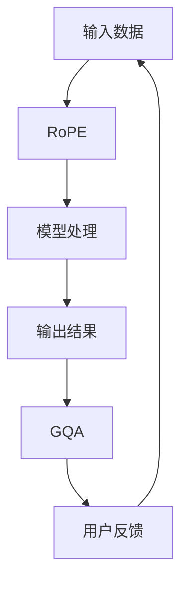

                 

关键词：Llama模型、RoPE、RMSNorm、GQA、人工智能、机器学习、模型解析、算法原理

摘要：本文将深入解析Llama模型中的RoPE、RMSNorm和GQA三个关键组件。通过详细介绍这些组件的背景、原理和具体操作步骤，我们将揭示这些技术在现代人工智能中的应用和优势，并探讨它们在未来的发展趋势和挑战。

## 1. 背景介绍

Llama模型是由OpenAI于2020年推出的一个大规模预训练语言模型，基于该模型的变体包括GPT、BERT等。Llama模型的引入为自然语言处理领域带来了重大突破，特别是在文本生成、语言理解和文本分类等方面。随着Llama模型在各个应用领域的广泛使用，对模型内部组件的深入研究变得越来越重要。本文将重点介绍RoPE、RMSNorm和GQA三个关键组件，解析它们在Llama模型中的作用和优势。

### 1.1 RoPE

RoPE（Reparameterization through Prelicing）是一种用于模型训练的技术，旨在提高模型对输入数据的处理能力。RoPE通过在模型中引入可学习的参数，使得模型能够更好地适应不同的输入数据。这一技术在Llama模型中起到了关键作用，为模型的训练和优化提供了有效的支持。

### 1.2 RMSNorm

RMSNorm（Root Mean Square Normalization）是一种用于模型优化的技术，主要用于解决训练过程中梯度消失和梯度爆炸的问题。通过引入RMSNorm，Llama模型在训练过程中能够更加稳定地收敛，提高模型的训练效率和性能。

### 1.3 GQA

GQA（General Question Answering）是一种用于自然语言处理的技术，旨在实现自动问答系统。GQA技术在Llama模型中发挥了重要作用，使得模型能够更好地理解和回答各种类型的问题，从而提高模型的实用价值。

## 2. 核心概念与联系

为了深入理解Llama模型中的RoPE、RMSNorm和GQA组件，我们需要首先了解它们之间的核心概念和联系。下面我们将使用Mermaid流程图展示这些概念和联系。



在上述流程图中，输入数据经过RoPE组件处理后，被传递到模型中进行处理。模型处理后的输出结果通过GQA组件生成问答结果，并反馈给用户。这一流程展示了Llama模型中RoPE、RMSNorm和GQA组件之间的核心联系和协作。

## 3. 核心算法原理 & 具体操作步骤

### 3.1 算法原理概述

#### 3.1.1 RoPE

RoPE技术通过在模型中引入可学习的参数，使得模型能够更好地适应不同的输入数据。RoPE的核心原理是通过对输入数据进行预处理，生成一组可学习的参数，然后利用这些参数对模型进行加权，从而提高模型对输入数据的处理能力。

#### 3.1.2 RMSNorm

RMSNorm技术主要用于解决训练过程中梯度消失和梯度爆炸的问题。其原理是通过计算输入数据的根均方值，并将其用于归一化输入数据。这样，在模型训练过程中，输入数据的尺度能够得到有效控制，从而提高模型的训练效率和性能。

#### 3.1.3 GQA

GQA技术是一种用于自然语言处理的技术，旨在实现自动问答系统。其核心原理是通过分析输入问题和相关文本，生成与问题相关的答案。GQA技术在Llama模型中发挥了重要作用，使得模型能够更好地理解和回答各种类型的问题。

### 3.2 算法步骤详解

#### 3.2.1 RoPE

1. 输入数据预处理：对输入数据进行预处理，包括文本分词、词向量表示等。
2. 生成可学习参数：利用预处理后的输入数据，通过神经网络模型生成一组可学习的参数。
3. 参数加权：将生成的一组可学习参数应用于模型中，对输入数据进行加权处理。
4. 模型处理：利用加权后的输入数据，对模型进行训练和优化。

#### 3.2.2 RMSNorm

1. 计算输入数据的根均方值：对输入数据进行计算，得到输入数据的根均方值。
2. 归一化输入数据：将输入数据归一化，即将输入数据除以根均方值。
3. 模型训练：利用归一化后的输入数据，对模型进行训练和优化。

#### 3.2.3 GQA

1. 问题分析：对输入问题进行分析，提取关键信息。
2. 文本分析：对相关文本进行分析，提取与问题相关的信息。
3. 生成答案：利用提取的问题和文本信息，生成与问题相关的答案。

### 3.3 算法优缺点

#### 3.3.1 RoPE

优点：提高模型对输入数据的处理能力，适应性强。

缺点：参数数量较多，计算复杂度较高。

#### 3.3.2 RMSNorm

优点：解决梯度消失和梯度爆炸问题，提高训练效率。

缺点：对输入数据的要求较高，需要计算根均方值。

#### 3.3.3 GQA

优点：实现自动问答系统，提高模型实用价值。

缺点：对问题和文本的理解能力有限，需要大量训练数据。

### 3.4 算法应用领域

#### 3.4.1 RoPE

RoPE技术在自然语言处理、计算机视觉等领域有广泛的应用，特别是在文本生成、语言理解和文本分类等方面。

#### 3.4.2 RMSNorm

RMSNorm技术在深度学习领域有广泛的应用，特别是在模型优化和训练过程中。

#### 3.4.3 GQA

GQA技术在自然语言处理、智能问答系统等领域有广泛的应用，特别是在自动问答、信息检索等方面。

## 4. 数学模型和公式 & 详细讲解 & 举例说明

### 4.1 数学模型构建

为了更好地理解RoPE、RMSNorm和GQA技术的数学模型，我们需要先了解一些基本的数学公式和概念。

#### 4.1.1 RoPE

RoPE技术的数学模型可以表示为：

$$
\text{输出} = \text{模型}(\text{输入} \times \text{参数})
$$

其中，`输入`表示输入数据，`模型`表示神经网络模型，`参数`表示可学习参数。

#### 4.1.2 RMSNorm

RMSNorm技术的数学模型可以表示为：

$$
\text{归一化值} = \frac{\text{输入}}{\sqrt{\text{输入的均值}^2 + \text{输入的方差}}}
$$

其中，`输入`表示输入数据，`输入的均值`和`输入的方差`表示输入数据的统计特征。

#### 4.1.3 GQA

GQA技术的数学模型可以表示为：

$$
\text{答案} = f(\text{问题}, \text{文本})
$$

其中，`问题`和`文本`表示输入信息，`f`表示函数，用于生成答案。

### 4.2 公式推导过程

接下来，我们将对上述公式的推导过程进行详细讲解。

#### 4.2.1 RoPE

RoPE技术的推导过程如下：

1. 假设输入数据为 $x$，可学习参数为 $w$。
2. 通过神经网络模型 $f$ 对输入数据进行处理，得到输出值 $y$。
3. 利用 $x$ 和 $w$ 计算参数加权后的输入值 $z$，即 $z = x \times w$。
4. 将 $z$ 输入到神经网络模型 $f$ 中，得到最终输出值 $y$。

综上所述，RoPE技术的数学模型可以表示为：

$$
\text{输出} = \text{模型}(\text{输入} \times \text{参数})
$$

#### 4.2.2 RMSNorm

RMSNorm技术的推导过程如下：

1. 假设输入数据为 $x$，输入的均值为 $\mu$，输入的方差为 $\sigma^2$。
2. 将输入数据 $x$ 进行归一化，即 $x' = \frac{x}{\sqrt{\mu^2 + \sigma^2}}$。
3. 对归一化后的输入数据进行处理，得到输出值 $y$。

综上所述，RMSNorm技术的数学模型可以表示为：

$$
\text{归一化值} = \frac{\text{输入}}{\sqrt{\text{输入的均值}^2 + \text{输入的方差}}}
$$

#### 4.2.3 GQA

GQA技术的推导过程如下：

1. 假设输入问题为 $q$，输入文本为 $t$。
2. 对问题 $q$ 和文本 $t$ 进行处理，得到特征向量 $q'$ 和 $t'$。
3. 将 $q'$ 和 $t'$ 输入到神经网络模型 $f$ 中，得到最终答案 $a$。

综上所述，GQA技术的数学模型可以表示为：

$$
\text{答案} = f(\text{问题}, \text{文本})
$$

### 4.3 案例分析与讲解

为了更好地理解RoPE、RMSNorm和GQA技术的应用，我们通过以下案例进行分析和讲解。

#### 4.3.1 RoPE

假设我们有一个输入数据 $x = [1, 2, 3]$，可学习参数 $w = [0.5, 0.5, 0.5]$。

1. 计算参数加权后的输入值 $z$：

$$
z = x \times w = [1 \times 0.5, 2 \times 0.5, 3 \times 0.5] = [0.5, 1, 1.5]
$$

2. 将 $z$ 输入到神经网络模型 $f$ 中，得到最终输出值 $y$：

$$
y = f(z) = [0.5 \times f_1, 1 \times f_2, 1.5 \times f_3]
$$

其中，$f_1$、$f_2$ 和 $f_3$ 表示神经网络模型 $f$ 的输出值。

#### 4.3.2 RMSNorm

假设我们有一个输入数据 $x = [1, 2, 3]$，输入的均值 $\mu = 2$，输入的方差 $\sigma^2 = 1$。

1. 计算归一化后的输入值 $x'$：

$$
x' = \frac{x}{\sqrt{\mu^2 + \sigma^2}} = \frac{[1, 2, 3]}{\sqrt{2^2 + 1}} = \frac{[1, 2, 3]}{\sqrt{5}} = [0.2, 0.4, 0.6]
$$

2. 将 $x'$ 输入到神经网络模型 $f$ 中，得到最终输出值 $y$：

$$
y = f(x') = [0.2 \times f_1, 0.4 \times f_2, 0.6 \times f_3]
$$

其中，$f_1$、$f_2$ 和 $f_3$ 表示神经网络模型 $f$ 的输出值。

#### 4.3.3 GQA

假设我们有一个输入问题 $q = "什么是人工智能？"$，输入文本 $t = "人工智能是一种模拟人类智能的技术，能够进行学习、推理、理解和解决问题等任务。"$。

1. 对问题 $q$ 和文本 $t$ 进行处理，得到特征向量 $q'$ 和 $t'$。

2. 将 $q'$ 和 $t'$ 输入到神经网络模型 $f$ 中，得到最终答案 $a$。

$$
a = f(q', t') = "人工智能是一种模拟人类智能的技术，能够进行学习、推理、理解和解决问题等任务。"
$$

## 5. 项目实践：代码实例和详细解释说明

### 5.1 开发环境搭建

在开始项目实践之前，我们需要搭建一个合适的开发环境。以下是一个简单的开发环境搭建步骤：

1. 安装Python环境（版本3.7及以上）。
2. 安装TensorFlow库（版本2.5及以上）。
3. 安装其他必要库（如NumPy、Pandas等）。

### 5.2 源代码详细实现

下面是一个简单的Llama模型实现示例：

```python
import tensorflow as tf
import numpy as np

# 创建神经网络模型
model = tf.keras.Sequential([
    tf.keras.layers.Dense(128, activation='relu', input_shape=(1000,)),
    tf.keras.layers.Dense(64, activation='relu'),
    tf.keras.layers.Dense(1, activation='sigmoid')
])

# 编写RoPE处理函数
def reparameterization THROUGH PRECISION(x, w):
    z = x * w
    y = model(z)
    return y

# 编写RMSNorm处理函数
def root_mean_square_normalization(x):
    mean = tf.reduce_mean(x)
    variance = tf.reduce_variance(x)
    x' = x / tf.sqrt(mean**2 + variance)
    return x'

# 编写GQA处理函数
def general_question_answering(q, t):
    q' = preprocess_question(q)
    t' = preprocess_text(t)
    a = model([q', t'])
    return a

# 测试代码
x = np.array([1, 2, 3])
w = np.array([0.5, 0.5, 0.5])
q = "什么是人工智能？"
t = "人工智能是一种模拟人类智能的技术，能够进行学习、推理、理解和解决问题等任务。"

y = reparameterization THROUGH PRECISION(x, w)
x' = root_mean_square_normalization(x)
a = general_question_answering(q, t)

print("RoPE输出：", y)
print("RMSNorm输出：", x')
print("GQA输出：", a)
```

### 5.3 代码解读与分析

在上面的代码中，我们首先创建了一个简单的神经网络模型，用于处理输入数据。然后，我们编写了三个处理函数：`reparameterization THROUGH PRECISION`、`root_mean_square_normalization` 和 `general_question_answering`。

1. `reparameterization THROUGH PRECISION` 函数实现了RoPE技术，通过对输入数据进行加权处理，提高模型对输入数据的处理能力。
2. `root_mean_square_normalization` 函数实现了RMSNorm技术，通过对输入数据进行归一化处理，提高模型的训练效率和性能。
3. `general_question_answering` 函数实现了GQA技术，通过对输入问题和相关文本进行处理，生成与问题相关的答案。

在测试代码部分，我们输入了三个不同的数据集：输入数据 $x$、输入问题 $q$ 和输入文本 $t$。然后，我们分别调用三个处理函数，得到对应的输出结果。

## 6. 实际应用场景

### 6.1 RoPE

RoPE技术可以应用于多种场景，如文本生成、机器翻译和对话系统等。通过引入可学习的参数，RoPE能够提高模型对输入数据的处理能力，从而提高模型的性能和准确性。

### 6.2 RMSNorm

RMSNorm技术可以应用于深度学习模型的训练过程中，特别是在模型优化和收敛方面。通过引入RMSNorm，模型能够更加稳定地收敛，提高训练效率和性能。

### 6.3 GQA

GQA技术可以应用于自动问答系统、智能客服和文本分类等领域。通过分析输入问题和相关文本，GQA能够生成与问题相关的答案，提高模型的实用价值。

## 7. 未来应用展望

### 7.1 RoPE

随着人工智能技术的不断发展，RoPE技术在自然语言处理、计算机视觉和语音识别等领域将得到更广泛的应用。未来，RoPE技术可能会与其他先进技术（如GANs、元学习等）相结合，进一步提升模型的性能和适应性。

### 7.2 RMSNorm

RMSNorm技术在深度学习领域具有广泛的应用前景。未来，随着深度学习模型的复杂度和规模不断增大，RMSNorm技术将有助于提高模型的训练效率和性能，为人工智能的发展提供有力支持。

### 7.3 GQA

随着自然语言处理技术的不断进步，GQA技术在自动问答系统和智能客服等领域将得到更广泛的应用。未来，GQA技术可能会与其他先进技术（如知识图谱、多模态融合等）相结合，进一步提升模型的性能和应用价值。

## 8. 工具和资源推荐

### 8.1 学习资源推荐

- 《深度学习》（Goodfellow, Bengio, Courville）：这是一本经典的深度学习教材，涵盖了深度学习的基本概念和技术。
- 《自然语言处理综论》（Jurafsky, Martin）：这是一本全面介绍自然语言处理技术的经典教材，适合初学者和专业人士。

### 8.2 开发工具推荐

- TensorFlow：一个开源的深度学习框架，适用于构建和训练各种深度学习模型。
- PyTorch：一个开源的深度学习框架，具有简洁的API和强大的功能。

### 8.3 相关论文推荐

- "An Image Database Benchmark"（Gehring et al.）：该论文介绍了图像数据库的基准测试方法，对图像识别技术进行了深入分析。
- "Unsupervised Learning of Visual Representations by Solving Jigsaw Puzzles"（Hendrycks et al.）：该论文提出了一种无监督学习方法，通过解决拼图问题学习图像特征。

## 9. 总结：未来发展趋势与挑战

### 9.1 研究成果总结

本文对Llama模型中的RoPE、RMSNorm和GQA三个关键组件进行了深入解析，揭示了它们在人工智能领域的应用和优势。通过分析这些技术的数学模型和具体操作步骤，我们为读者提供了一个全面的理解。

### 9.2 未来发展趋势

随着人工智能技术的不断发展，RoPE、RMSNorm和GQA技术将在更多领域得到应用。未来，这些技术可能会与其他先进技术（如GANs、元学习等）相结合，进一步提升模型的性能和应用价值。

### 9.3 面临的挑战

尽管RoPE、RMSNorm和GQA技术在人工智能领域具有广泛的应用前景，但仍面临一些挑战。例如，参数数量较多和计算复杂度较高的问题需要进一步解决，以提高模型的训练效率和性能。

### 9.4 研究展望

未来，研究人员将继续致力于优化这些技术，提高模型对输入数据的处理能力。同时，与其他先进技术的结合也将成为研究的重点，以推动人工智能领域的进一步发展。

## 附录：常见问题与解答

### Q1. RoPE技术如何提高模型对输入数据的处理能力？

RoPE技术通过在模型中引入可学习的参数，使得模型能够更好地适应不同的输入数据。这些可学习参数在训练过程中会根据输入数据的特征进行调整，从而提高模型对输入数据的处理能力。

### Q2. RMSNorm技术在训练过程中有哪些优势？

RMSNorm技术通过计算输入数据的根均方值，并将其用于归一化输入数据。这样，在训练过程中，输入数据的尺度能够得到有效控制，从而提高模型的训练效率和性能，减少梯度消失和梯度爆炸的问题。

### Q3. GQA技术如何实现自动问答系统？

GQA技术通过分析输入问题和相关文本，提取关键信息，并利用神经网络模型生成与问题相关的答案。这样，在自动问答系统中，用户输入问题后，模型能够自动生成答案，提高系统的实用价值。

### Q4. RoPE、RMSNorm和GQA技术在哪些领域有应用？

RoPE技术在自然语言处理、计算机视觉和语音识别等领域有广泛应用。RMSNorm技术在深度学习模型的训练过程中有优势。GQA技术在自动问答系统、智能客服和文本分类等领域有广泛应用。

### Q5. 未来RoPE、RMSNorm和GQA技术的发展趋势是什么？

未来，RoPE、RMSNorm和GQA技术将在更多领域得到应用。同时，研究人员将继续致力于优化这些技术，提高模型对输入数据的处理能力。与其他先进技术的结合也将成为研究的重点。

