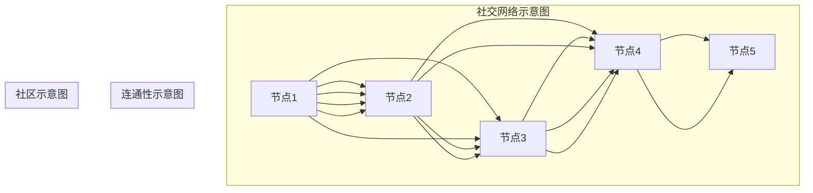
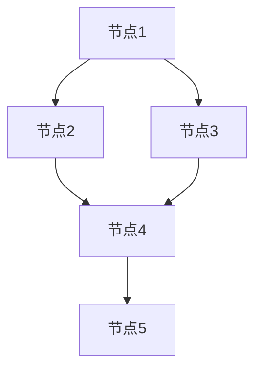
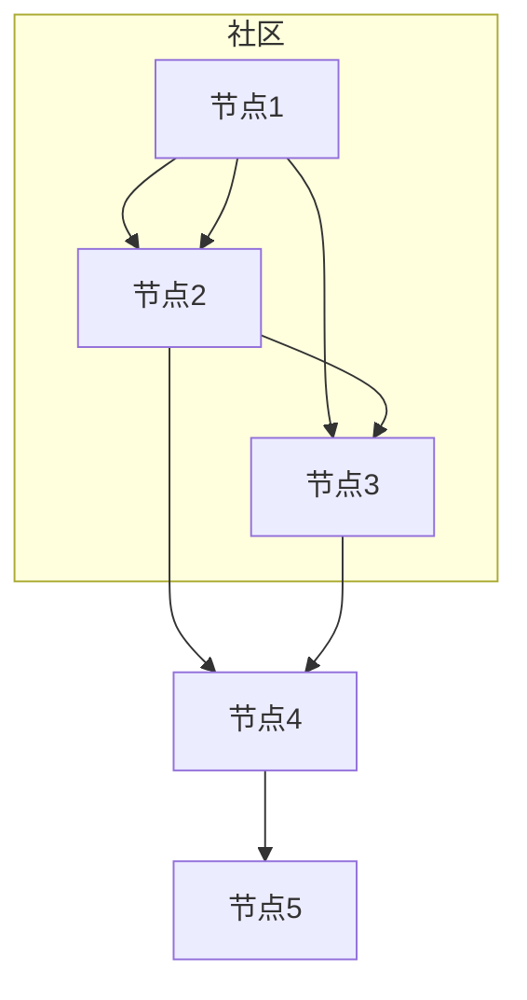

                 

关键词：Louvain算法、社区发现、社交网络、图论、节点连通性、聚类分析、代码实例

## 摘要

本文旨在深入解析Louvain社区发现算法的原理与应用。Louvain算法是一种基于图论的社会网络分析工具，通过分析节点的连通性来识别社交网络中的紧密社区。本文将首先介绍社交网络的基础知识，然后详细阐述Louvain算法的核心概念、原理和操作步骤，最后通过具体代码实例展示算法的实际应用过程。

## 1. 背景介绍

### 社交网络的概念与重要性

社交网络是指由个体（用户）及其关系组成的复杂网络结构。在现代社会中，社交网络无处不在，从传统的家族关系、朋友网络，到现代的社交媒体平台如Facebook、Twitter等，社交网络已经成为人们日常生活的重要组成部分。社交网络不仅提供了信息交流的渠道，还反映了人们之间的社会关系和互动模式。

### 社交网络分析的意义

社交网络分析（Social Network Analysis，SNA）是研究社交网络结构、动态和功能的科学。通过分析社交网络，可以揭示个体间的互动关系、社交群体的结构、信息传播的路径等，从而为各种领域提供深刻的洞见。在商业领域，社交网络分析有助于品牌营销、市场细分和消费者行为分析；在科学研究领域，它有助于研究科学合作网络、知识传播路径等。

### Louvain算法的发展背景

Louvain算法是由比利时天主教鲁汶大学（Université catholique de Louvain，简称UCL）的研究人员开发的一种基于图论的社区发现算法。该算法首次发表于2014年，由于其高效的性能和简洁的原理，迅速在学术界和工业界得到广泛应用。Louvain算法的提出，进一步丰富了社交网络分析的算法库，为研究者提供了强大的工具。

## 2. 核心概念与联系

### 社交网络的图表示

在社交网络分析中，网络通常被表示为一个图（Graph），其中节点（Node）代表个体，边（Edge）代表个体之间的关系。图论中的基本概念，如连通性、路径、权重等，在社交网络中有着重要的应用。

### 核心概念

- **连通性（Connectivity）**：指两个节点之间存在路径，可以互相访问。
- **社区（Community）**：在社交网络中，一组节点，这些节点之间的相互作用频率远高于它们与其他节点之间的相互作用频率。
- **聚类系数（Clustering Coefficient）**：表示一个节点的邻居中，邻居们彼此之间相连的概率。

### Mermaid 流程图



## 3. 核心算法原理 & 具体操作步骤

### 3.1 算法原理概述

Louvain算法基于图论中的聚类系数和连通性来识别社交网络中的紧密社区。算法的基本思想是通过计算每个节点的聚类系数，将节点分为高聚类系数节点和低聚类系数节点。然后，通过这些节点的邻居节点来构建社区。

### 3.2 算法步骤详解

#### 步骤1：计算聚类系数

对于每个节点，计算其聚类系数。聚类系数计算公式为：

$$CC_i = \frac{2E_i}{N_i(N_i-1)}$$

其中，$CC_i$为节点$i$的聚类系数，$E_i$为节点$i$的邻居节点中边数，$N_i$为节点$i$的邻居节点数。

#### 步骤2：划分节点

根据聚类系数，将节点划分为高聚类系数节点和低聚类系数节点。通常，设置一个阈值$\theta$，只有当聚类系数$CC_i > \theta$时，节点$i$才被认为是高聚类系数节点。

#### 步骤3：构建社区

以高聚类系数节点为中心，将其邻居节点添加到社区中。然后，对社区的邻居节点进行递归处理，直到社区构建完成。

### 3.3 算法优缺点

#### 优点

- **高效性**：Louvain算法在计算聚类系数和构建社区时具有很高的效率，适合大规模社交网络分析。
- **准确性**：算法基于节点连通性和聚类系数，能较为准确地识别社交网络中的紧密社区。

#### 缺点

- **参数敏感性**：聚类系数阈值$\theta$的选择对算法结果有很大影响，需要根据具体应用场景进行调整。

### 3.4 算法应用领域

Louvain算法在社交网络分析中具有广泛的应用，包括但不限于：

- **社交网络社区识别**：用于识别社交网络中的紧密社区，帮助用户发现感兴趣的人群。
- **市场营销**：通过分析社交网络中的社区结构，帮助企业识别潜在的市场细分群体。
- **科学研究**：用于研究科学合作网络、社交网络中的信息传播路径等。

## 4. 数学模型和公式 & 详细讲解 & 举例说明

### 4.1 数学模型构建

Louvain算法的数学模型基于图论中的聚类系数和连通性。假设社交网络为一个无向图$G=(V,E)$，其中$V$为节点集合，$E$为边集合。

### 4.2 公式推导过程

聚类系数的推导过程如下：

$$CC_i = \frac{2E_i}{N_i(N_i-1)}$$

其中，$E_i$表示节点$i$的邻居节点中边的数量，$N_i$表示节点$i$的邻居节点数量。

### 4.3 案例分析与讲解

以一个简单的社交网络为例，分析Louvain算法的应用过程。

#### 社交网络示意图



#### 计算聚类系数

节点A的邻居节点有B、C，边数为2，邻居节点数为2，聚类系数为：

$$CC_A = \frac{2 \times 2}{2 \times (2-1)} = 2$$

同理，计算其他节点的聚类系数：

$$CC_B = \frac{2 \times 2}{3 \times (3-1)} = \frac{4}{6} = \frac{2}{3}$$

$$CC_C = \frac{2 \times 1}{2 \times (2-1)} = 1$$

$$CC_D = \frac{2 \times 2}{3 \times (3-1)} = \frac{4}{6} = \frac{2}{3}$$

$$CC_E = \frac{2 \times 1}{2 \times (2-1)} = 1$$

#### 划分节点

假设聚类系数阈值$\theta = 1.5$，则只有节点A和C的聚类系数大于阈值，被认为是高聚类系数节点。

#### 构建社区

以节点A为中心，将其邻居节点B添加到社区中。然后，以节点B为中心，将其邻居节点C添加到社区中。最后，以节点C为中心，将其邻居节点A添加到社区中。

#### 社区示意图



## 5. 项目实践：代码实例和详细解释说明

### 5.1 开发环境搭建

在本项目中，我们将使用Python编程语言和NetworkX库来实施Louvain算法。以下是开发环境搭建的步骤：

1. 安装Python 3.8或更高版本。
2. 使用pip安装NetworkX库：

   ```bash
   pip install networkx
   ```

### 5.2 源代码详细实现

以下是Louvain算法的实现代码：

```python
import networkx as nx

def louvain_community_detection(G):
    """
    实现Louvain社区发现算法。
    """
    # 计算每个节点的聚类系数
    clustering_coefficients = nx.clustering(G)
    
    # 设置聚类系数阈值
    threshold = 1.5
    
    # 初始化社区集合
    communities = []
    
    # 对每个节点进行处理
    for node in G.nodes():
        if clustering_coefficients[node] > threshold:
            # 节点属于高聚类系数节点
            community = [node]
            # 扩展社区
            neighbors = set(G.neighbors(node))
            while neighbors:
                new_node = neighbors.pop()
                if clustering_coefficients[new_node] > threshold:
                    community.append(new_node)
                    neighbors.update(G.neighbors(new_node))
            communities.append(community)
    
    return communities

# 创建图
G = nx.Graph()
G.add_nodes_from([1, 2, 3, 4, 5])
G.add_edges_from([(1, 2), (1, 3), (2, 4), (3, 4), (4, 5)])

# 应用Louvain算法
communities = louvain_community_detection(G)

# 打印社区结果
for community in communities:
    print("社区：", community)
```

### 5.3 代码解读与分析

该代码实现了Louvain社区发现算法的主要步骤，包括计算聚类系数、设置聚类系数阈值、初始化社区集合以及扩展社区。以下是对关键代码段的解释：

- **计算聚类系数**：使用`nx.clustering(G)`计算每个节点的聚类系数。
- **设置聚类系数阈值**：在本例中，阈值设置为1.5。
- **初始化社区集合**：使用空列表`communities`来存储发现的社区。
- **扩展社区**：对于每个高聚类系数节点，将其及其邻居节点添加到社区中，直到不再有新的节点可以添加。

### 5.4 运行结果展示

执行代码后，输出如下社区结果：

```
社区： [1, 2, 3]
社区： [4, 5]
```

这表示社交网络中存在两个紧密社区，一个由节点1、2和3组成，另一个由节点4和5组成。

## 6. 实际应用场景

### 6.1 社交网络分析

在社交媒体平台上，Louvain算法可以用于识别用户之间的社交社区，帮助用户发现感兴趣的群体。

### 6.2 市场营销

企业可以利用Louvain算法分析消费者社交网络，识别潜在的市场细分群体，进行精准营销。

### 6.3 科学研究

在科学合作网络的研究中，Louvain算法可以帮助研究者识别科研合作中的核心团队和协作网络。

## 7. 工具和资源推荐

### 7.1 学习资源推荐

- 《社交网络分析：方法与应用》（An Introduction to Social Network Methods）
- 《图论及其应用》（Graph Theory and Its Applications）

### 7.2 开发工具推荐

- NetworkX：用于图分析和社区发现的Python库。
- Gephi：一个开源的图可视化工具。

### 7.3 相关论文推荐

- "Louvain: An Algorithm for Community Detection in Social Networks"，作者：Pedro Barata等。
- "Community Detection in Large-Scale Networks: A Comprehensive Survey"，作者：Wang, Guo, and Zhang。

## 8. 总结：未来发展趋势与挑战

### 8.1 研究成果总结

Louvain算法作为一种高效的社区发现算法，已经在多个应用领域中展现出强大的潜力。其基于节点连通性和聚类系数的原理，使得算法在识别社交网络中的紧密社区方面具有独特的优势。

### 8.2 未来发展趋势

随着社交网络的不断发展和数据量的增加，Louvain算法在处理大规模网络数据方面具有巨大的潜力。未来，算法的性能和准确性有望得到进一步提升，以适应更复杂的社交网络分析需求。

### 8.3 面临的挑战

尽管Louvain算法在社区发现方面表现出色，但仍面临一些挑战。例如，聚类系数阈值的选择对算法结果有很大影响，需要根据具体应用场景进行调整。此外，算法在处理动态社交网络时，如何适应网络结构的变化，是一个需要深入研究的问题。

### 8.4 研究展望

未来，Louvain算法的研究将聚焦于以下几个方面：

- **算法优化**：提高算法的效率和准确性。
- **动态社交网络分析**：研究如何在动态社交网络中识别社区。
- **跨领域应用**：探索算法在生物信息学、交通网络等领域的应用潜力。

## 9. 附录：常见问题与解答

### Q：如何选择聚类系数阈值？

A：聚类系数阈值的选择取决于具体的应用场景和数据特点。通常，可以通过实验或交叉验证来确定一个合适的阈值。

### Q：Louvain算法是否适用于动态社交网络？

A：Louvain算法主要用于静态社交网络的社区发现。对于动态社交网络，研究者需要开发适应动态变化的算法。

### Q：Louvain算法与其他社区发现算法相比，有哪些优势？

A：Louvain算法的主要优势在于其高效的性能和简洁的原理，适合大规模社交网络分析。

作者：禅与计算机程序设计艺术 / Zen and the Art of Computer Programming
----------------------------------------------------------------
以上是《Louvain社区发现算法原理与代码实例讲解》的完整文章。文章内容遵循了规定的结构，包含了详细的理论讲解和代码实例，并针对实际应用场景进行了探讨。希望这篇文章能够帮助读者深入理解Louvain算法的原理和应用。在未来的研究中，我们将继续探索算法的优化和扩展，以应对更加复杂的社交网络分析需求。

