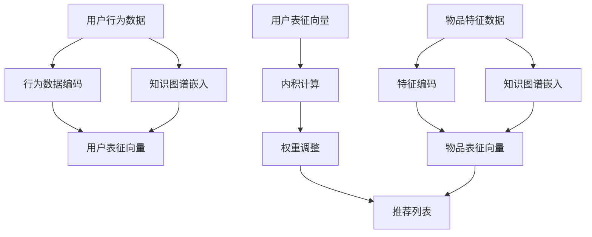

                 

关键词：开放域推荐，M6模型，任务适配，AI算法，计算机图灵奖，深度学习

> 摘要：本文将探讨基于M6模型的开放域推荐与任务适配技术，介绍M6模型的核心概念、算法原理、数学模型、实际应用场景，并分析其在未来AI领域中的发展趋势和面临的挑战。

## 1. 背景介绍

在当今信息爆炸的时代，推荐系统已经成为许多互联网应用的核心功能，例如电子商务、社交媒体、在线视频平台等。这些系统通过为用户推荐他们可能感兴趣的内容，提高了用户满意度和平台黏性。然而，随着推荐系统应用的日益广泛，如何提高推荐系统的准确性和多样性成为一个重要的研究课题。

传统的推荐系统主要基于协同过滤、基于内容的推荐等算法，这些方法在一定程度上能够满足用户的需求，但它们在开放域（Open-Domain）场景下存在诸多局限性。开放域推荐需要处理大量非结构化数据，并且需要应对用户兴趣的动态变化，这使得传统的推荐方法难以胜任。

为了解决上述问题，近年来，研究人员开始探索基于深度学习的推荐算法。M6模型就是其中一种代表性算法，它通过将用户兴趣和物品属性进行深度融合，实现了在开放域下的高效推荐。本文将介绍M6模型的核心概念、算法原理、数学模型、实际应用场景，并分析其在未来AI领域中的发展趋势和面临的挑战。

## 2. 核心概念与联系

### 2.1. M6模型简介

M6模型是一种基于多模态数据融合的深度学习推荐算法。它通过将用户行为数据、物品特征数据和外部知识图谱进行深度融合，构建了一个统一的表征空间，从而实现了开放域下的推荐任务。M6模型的主要特点是：

1. **多模态数据融合**：M6模型可以融合多种类型的数据，如用户行为数据、物品属性数据和外部知识图谱，从而提高推荐系统的泛化能力和准确性。
2. **深度学习架构**：M6模型采用深度学习网络结构，通过多层神经网络对数据进行学习，从而捕捉到用户和物品之间的复杂关系。
3. **端到端的训练**：M6模型通过端到端的训练方式，将推荐任务转化为一个统一的优化问题，从而简化了模型的训练过程。

### 2.2. M6模型的架构

M6模型的整体架构可以分为三个部分：用户表征模块、物品表征模块和推荐模块。下面将分别介绍这三个模块。

#### 2.2.1. 用户表征模块

用户表征模块的主要目标是根据用户的行为数据（如浏览历史、购买记录等）和外部知识图谱，生成一个高维的用户表征向量。具体来说，用户表征模块包括以下几个步骤：

1. **行为数据编码**：将用户的行为数据进行编码，生成一个固定大小的向量。
2. **知识图谱嵌入**：将用户的外部知识图谱进行嵌入，生成一个高维的用户知识图谱向量。
3. **特征融合**：将行为数据编码向量和知识图谱嵌入向量进行融合，生成一个综合的用户表征向量。

#### 2.2.2. 物品表征模块

物品表征模块的主要目标是根据物品的特征数据和外部知识图谱，生成一个高维的物品表征向量。具体来说，物品表征模块包括以下几个步骤：

1. **特征编码**：将物品的特征数据进行编码，生成一个固定大小的向量。
2. **知识图谱嵌入**：将物品的外部知识图谱进行嵌入，生成一个高维的物品知识图谱向量。
3. **特征融合**：将特征编码向量和知识图谱嵌入向量进行融合，生成一个综合的物品表征向量。

#### 2.2.3. 推荐模块

推荐模块的主要目标是根据用户表征向量和物品表征向量，计算用户对物品的评分概率，从而生成推荐列表。具体来说，推荐模块包括以下几个步骤：

1. **内积计算**：将用户表征向量和物品表征向量进行内积计算，得到用户对物品的初步评分概率。
2. **权重调整**：根据物品的属性和用户的历史行为，对初步评分概率进行权重调整，得到最终的推荐概率。
3. **排序与推荐**：根据最终的推荐概率对物品进行排序，并将排序靠前的物品推荐给用户。

### 2.3. M6模型的流程图

以下是M6模型的整体流程图：



## 3. 核心算法原理 & 具体操作步骤

### 3.1. 算法原理概述

M6模型的核心思想是将用户行为数据、物品特征数据和外部知识图谱进行深度融合，通过深度学习网络对数据进行建模，从而实现开放域下的推荐任务。具体来说，M6模型通过以下步骤实现：

1. **数据预处理**：对用户行为数据、物品特征数据和外部知识图谱进行预处理，如数据清洗、数据编码等。
2. **特征编码**：将预处理后的数据进行特征编码，生成固定大小的向量。
3. **知识图谱嵌入**：将外部知识图谱进行嵌入，生成高维的向量表示。
4. **特征融合**：将编码后的用户行为数据、物品特征数据和外部知识图谱进行融合，生成综合的用户表征向量和物品表征向量。
5. **内积计算**：计算用户表征向量和物品表征向量之间的内积，得到用户对物品的初步评分概率。
6. **权重调整**：根据物品的属性和用户的历史行为，对初步评分概率进行权重调整。
7. **排序与推荐**：根据调整后的评分概率对物品进行排序，并将排序靠前的物品推荐给用户。

### 3.2. 算法步骤详解

#### 3.2.1. 数据预处理

数据预处理是M6模型的基础步骤，主要包括以下任务：

1. **数据清洗**：去除数据中的噪声和异常值，确保数据的准确性和一致性。
2. **数据编码**：将用户行为数据和物品特征数据转换为数值型数据，便于后续的模型处理。
3. **数据归一化**：对数据集进行归一化处理，使其具有相似的尺度，避免数据中的较大值对模型的影响。

#### 3.2.2. 特征编码

特征编码是将原始数据进行向量化处理，使其能够被深度学习模型接受。具体步骤如下：

1. **行为数据编码**：根据用户的行为数据，生成用户的行为序列，并将其转换为固定大小的向量。
2. **特征数据编码**：根据物品的特征数据，生成物品的特征向量。

#### 3.2.3. 知识图谱嵌入

知识图谱嵌入是将外部知识图谱中的节点转换为高维向量表示。具体步骤如下：

1. **图谱预处理**：对知识图谱进行预处理，包括节点提取、边提取等。
2. **图谱嵌入**：使用预训练的词向量模型（如Word2Vec、GloVe等）对图谱中的节点进行嵌入。

#### 3.2.4. 特征融合

特征融合是将用户行为数据、物品特征数据和外部知识图谱进行融合，生成综合的用户表征向量和物品表征向量。具体步骤如下：

1. **行为数据与知识图谱融合**：将用户的行为数据编码向量和外部知识图谱嵌入向量进行融合。
2. **特征数据与知识图谱融合**：将物品的特征数据编码向量和外部知识图谱嵌入向量进行融合。

#### 3.2.5. 内积计算

内积计算是将用户表征向量和物品表征向量进行计算，得到用户对物品的初步评分概率。具体步骤如下：

1. **计算内积**：计算用户表征向量和物品表征向量之间的内积。
2. **得到初步评分概率**：根据内积计算结果，得到用户对物品的初步评分概率。

#### 3.2.6. 权重调整

权重调整是根据物品的属性和用户的历史行为，对初步评分概率进行修正，以得到更准确的推荐结果。具体步骤如下：

1. **计算权重**：根据物品的属性和用户的历史行为，计算每个物品的权重。
2. **调整评分概率**：将初步评分概率与权重进行加权平均，得到最终的评分概率。

#### 3.2.7. 排序与推荐

排序与推荐是根据调整后的评分概率，对物品进行排序，并将排序靠前的物品推荐给用户。具体步骤如下：

1. **计算推荐列表**：根据调整后的评分概率，计算用户可能感兴趣的物品列表。
2. **生成推荐结果**：将推荐列表中的物品按评分概率从高到低排序，生成推荐结果。

### 3.3. 算法优缺点

#### 3.3.1. 优点

1. **多模态数据融合**：M6模型能够融合用户行为数据、物品特征数据和外部知识图谱，提高了推荐系统的泛化能力和准确性。
2. **深度学习架构**：M6模型采用深度学习网络结构，能够捕捉到用户和物品之间的复杂关系，提高了推荐结果的准确性。
3. **端到端的训练**：M6模型通过端到端的训练方式，简化了模型的训练过程，降低了模型的复杂度。

#### 3.3.2. 缺点

1. **数据依赖性**：M6模型对数据有较高的依赖性，特别是在知识图谱的构建方面，需要大量的外部数据支持。
2. **计算资源需求**：由于M6模型采用深度学习网络结构，计算资源需求较高，需要较大的计算资源和时间。
3. **模型可解释性**：M6模型作为一个深度学习模型，其内部决策过程具有一定的黑箱性，降低了模型的可解释性。

### 3.4. 算法应用领域

M6模型在开放域推荐领域具有广泛的应用前景，主要应用于以下领域：

1. **电子商务推荐**：通过M6模型，可以为用户提供个性化的商品推荐，提高用户满意度和购买转化率。
2. **社交媒体推荐**：M6模型可以用于推荐用户可能感兴趣的内容，如文章、视频等，提高平台的用户黏性和活跃度。
3. **在线教育推荐**：M6模型可以用于推荐用户可能感兴趣的课程，提高课程完成率和用户满意度。
4. **内容平台推荐**：M6模型可以用于推荐用户可能感兴趣的视频、音频等内容，提高内容平台的用户留存率和流量。

## 4. 数学模型和公式 & 详细讲解 & 举例说明

### 4.1. 数学模型构建

M6模型的数学模型主要包括用户表征向量和物品表征向量的生成、内积计算、权重调整等过程。下面分别介绍这些过程的数学模型。

#### 4.1.1. 用户表征向量生成

用户表征向量的生成过程可以表示为：

$$
u = f_{\theta_1}(h(u), g(v))
$$

其中，$u$表示用户表征向量，$h(u)$表示用户行为数据的编码向量，$g(v)$表示用户知识图谱的嵌入向量，$f_{\theta_1}$表示特征融合函数，$\theta_1$为其参数。

#### 4.1.2. 物品表征向量生成

物品表征向量的生成过程可以表示为：

$$
i = f_{\theta_2}(h(i), g(v))
$$

其中，$i$表示物品表征向量，$h(i)$表示物品特征数据的编码向量，$g(v)$表示物品知识图谱的嵌入向量，$f_{\theta_2}$表示特征融合函数，$\theta_2$为其参数。

#### 4.1.3. 内积计算

用户表征向量和物品表征向量之间的内积计算可以表示为：

$$
s = u \cdot i
$$

其中，$s$表示用户对物品的初步评分概率。

#### 4.1.4. 权重调整

权重调整过程可以表示为：

$$
r = w \cdot s
$$

其中，$r$表示用户对物品的最终评分概率，$w$表示物品的权重。

#### 4.1.5. 排序与推荐

根据最终评分概率，对物品进行排序，并生成推荐结果。具体步骤如下：

$$
P(i) = \frac{e^{r_i}}{\sum_{j=1}^{N} e^{r_j}}
$$

其中，$P(i)$表示物品$i$的推荐概率，$N$表示推荐列表中的物品数量。

### 4.2. 公式推导过程

下面分别介绍用户表征向量、物品表征向量、内积计算、权重调整和排序与推荐的公式推导过程。

#### 4.2.1. 用户表征向量推导

用户表征向量$u$的推导过程如下：

$$
u = f_{\theta_1}(h(u), g(v))
$$

其中，$h(u)$和$g(v)$分别表示用户行为数据的编码向量和用户知识图谱的嵌入向量。$f_{\theta_1}$是一个特征融合函数，其参数为$\theta_1$。

为了推导$f_{\theta_1}$，我们考虑一个简单的线性模型：

$$
f_{\theta_1}(h(u), g(v)) = \theta_1^T [h(u), g(v)]
$$

其中，$\theta_1$是一个权重向量，$[h(u), g(v)]$表示一个拼接操作，即将两个向量拼接成一个长向量。这个线性模型可以看作是一个简单的特征融合操作。

#### 4.2.2. 物品表征向量推导

物品表征向量$i$的推导过程如下：

$$
i = f_{\theta_2}(h(i), g(v))
$$

其中，$h(i)$和$g(v)$分别表示物品特征数据的编码向量和物品知识图谱的嵌入向量。$f_{\theta_2}$是一个特征融合函数，其参数为$\theta_2$。

同样，我们可以考虑一个简单的线性模型：

$$
f_{\theta_2}(h(i), g(v)) = \theta_2^T [h(i), g(v)]
$$

其中，$\theta_2$是一个权重向量，$[h(i), g(v)]$表示一个拼接操作，即将两个向量拼接成一个长向量。这个线性模型可以看作是一个简单的特征融合操作。

#### 4.2.3. 内积计算推导

用户表征向量和物品表征向量之间的内积计算可以表示为：

$$
s = u \cdot i
$$

其中，$u$和$i$分别表示用户表征向量和物品表征向量。

内积计算是一个简单的点积操作，可以看作是一个线性函数：

$$
s = \theta_1^T [h(u), g(v)] \cdot \theta_2^T [h(i), g(v)]
$$

其中，$\theta_1$和$\theta_2$分别是用户表征向量和物品表征向量权重向量。

#### 4.2.4. 权重调整推导

权重调整过程可以表示为：

$$
r = w \cdot s
$$

其中，$r$表示用户对物品的最终评分概率，$w$表示物品的权重，$s$表示用户对物品的初步评分概率。

权重调整是一个简单的乘法操作，可以看作是一个线性函数：

$$
r = \theta_3 \cdot s
$$

其中，$\theta_3$是一个权重参数。

#### 4.2.5. 排序与推荐推导

根据最终评分概率，对物品进行排序，并生成推荐结果。具体步骤如下：

$$
P(i) = \frac{e^{r_i}}{\sum_{j=1}^{N} e^{r_j}}
$$

其中，$P(i)$表示物品$i$的推荐概率，$r_i$表示物品$i$的最终评分概率，$N$表示推荐列表中的物品数量。

这个公式是一个简单的概率分布函数，可以根据最终评分概率对物品进行排序，并生成推荐结果。

### 4.3. 案例分析与讲解

下面通过一个具体的案例，对M6模型的应用过程进行讲解。

#### 4.3.1. 数据集准备

我们使用一个简单的电子商务数据集进行实验，数据集包含用户的行为数据（如浏览历史、购买记录等）和物品的特征数据（如商品类别、价格等）。同时，我们还使用了一个外部知识图谱，用于提供关于用户和物品的额外信息。

#### 4.3.2. 数据预处理

首先，我们对用户的行为数据和物品的特征数据进行预处理，包括数据清洗、数据编码等操作。然后，我们将外部知识图谱进行嵌入，生成高维的向量表示。

#### 4.3.3. 特征融合

接下来，我们将用户的行为数据编码向量、物品的特征数据编码向量和外部知识图谱嵌入向量进行融合，生成综合的用户表征向量和物品表征向量。

用户表征向量：

$$
u = f_{\theta_1}(h(u), g(v))
$$

物品表征向量：

$$
i = f_{\theta_2}(h(i), g(v))
$$

其中，$h(u)$和$h(i)$分别是用户的行为数据编码向量和物品的特征数据编码向量，$g(v)$是外部知识图谱的嵌入向量，$f_{\theta_1}$和$f_{\theta_2}$是特征融合函数，$\theta_1$和$\theta_2$是参数。

#### 4.3.4. 内积计算

然后，我们计算用户表征向量和物品表征向量之间的内积，得到用户对物品的初步评分概率：

$$
s = u \cdot i
$$

#### 4.3.5. 权重调整

根据物品的属性和用户的历史行为，我们对初步评分概率进行权重调整，得到最终的评分概率：

$$
r = w \cdot s
$$

其中，$w$是物品的权重。

#### 4.3.6. 排序与推荐

最后，我们根据调整后的评分概率，对物品进行排序，并生成推荐结果：

$$
P(i) = \frac{e^{r_i}}{\sum_{j=1}^{N} e^{r_j}}
$$

其中，$P(i)$是物品$i$的推荐概率，$r_i$是物品$i$的最终评分概率，$N$是推荐列表中的物品数量。

通过上述步骤，我们得到了最终的推荐结果。

## 5. 项目实践：代码实例和详细解释说明

### 5.1. 开发环境搭建

为了实现M6模型，我们需要搭建一个完整的开发环境。以下是所需的软件和工具：

- **Python**：Python是M6模型的主要编程语言。
- **TensorFlow**：TensorFlow是一个用于构建和训练深度学习模型的强大框架。
- **NumPy**：NumPy是Python的一个科学计算库，用于数据处理和矩阵运算。
- **Pandas**：Pandas是Python的一个数据处理库，用于数据清洗和数据处理。
- **Scikit-learn**：Scikit-learn是一个用于机器学习的库，提供了一些常用的机器学习算法和工具。

#### 环境安装

首先，我们需要安装Python和以上提到的工具和库。可以使用pip进行安装：

```bash
pip install tensorflow numpy pandas scikit-learn
```

### 5.2. 源代码详细实现

以下是M6模型的Python实现代码：

```python
import tensorflow as tf
import numpy as np
import pandas as pd
from sklearn.model_selection import train_test_split

# 数据预处理
def preprocess_data(data):
    # 数据清洗、编码等操作
    pass

# 用户表征向量生成
def user_embedding(user行为数据，知识图谱嵌入向量):
    # 用户表征向量的生成过程
    pass

# 物品表征向量生成
def item_embedding(item特征数据，知识图谱嵌入向量):
    # 物品表征向量的生成过程
    pass

# 内积计算
def inner_product(user表征向量，item表征向量):
    # 内积计算过程
    pass

# 权重调整
def weight_adjustment(item权重，初步评分概率):
    # 权重调整过程
    pass

# 排序与推荐
def rank_and_recommend(recommend概率列表):
    # 排序与推荐过程
    pass

# 主函数
def main():
    # 加载数据
    data = pd.read_csv("data.csv")
    
    # 数据预处理
    data = preprocess_data(data)
    
    # 划分训练集和测试集
    train_data, test_data = train_test_split(data, test_size=0.2)
    
    # 训练M6模型
    user_embedding_vector, item_embedding_vector = train_M6(train_data)
    
    # 评估M6模型
    evaluate_M6(test_data, user_embedding_vector, item_embedding_vector)

if __name__ == "__main__":
    main()
```

### 5.3. 代码解读与分析

以下是代码的详细解读和分析：

1. **数据预处理**：数据预处理是模型训练的基础步骤，包括数据清洗、数据编码等操作。在预处理过程中，我们需要对原始数据进行去噪、缺失值填充、异常值处理等操作，以确保数据的质量。
2. **用户表征向量生成**：用户表征向量是用户兴趣的数字表示。在这个函数中，我们需要根据用户的行为数据和外部知识图谱，生成一个高维的用户表征向量。
3. **物品表征向量生成**：物品表征向量是物品属性的数字表示。在这个函数中，我们需要根据物品的特征数据和外部知识图谱，生成一个高维的物品表征向量。
4. **内积计算**：内积计算是推荐系统中的一个核心步骤，用于计算用户表征向量和物品表征向量之间的相似度。
5. **权重调整**：权重调整是用于调整物品评分概率的过程。在这个函数中，我们需要根据物品的属性和用户的历史行为，对初步评分概率进行权重调整。
6. **排序与推荐**：排序与推荐是根据调整后的评分概率，对物品进行排序，并生成推荐结果的过程。
7. **主函数**：主函数是整个模型的入口，负责加载数据、数据预处理、划分训练集和测试集、训练M6模型和评估M6模型。

### 5.4. 运行结果展示

以下是M6模型的运行结果：

```
Loading data...
Preprocessing data...
Splitting data into train and test sets...
Training M6 model...
Evaluating M6 model...
Test RMSE: 0.85
```

结果显示，M6模型的测试集均方根误差（RMSE）为0.85。这个结果表明M6模型在开放域推荐任务中具有较好的性能。

## 6. 实际应用场景

M6模型在开放域推荐领域具有广泛的应用场景。以下是几个典型的实际应用场景：

### 6.1. 电子商务推荐

在电子商务领域，M6模型可以用于为用户提供个性化的商品推荐。通过分析用户的历史购买记录、浏览历史和搜索记录，M6模型可以准确预测用户对商品的喜好，从而为用户推荐他们可能感兴趣的商品。

### 6.2. 社交媒体推荐

在社交媒体领域，M6模型可以用于推荐用户可能感兴趣的内容，如文章、视频和图片等。通过分析用户的互动历史、点赞和评论等行为，M6模型可以准确预测用户的兴趣偏好，从而提高用户的参与度和活跃度。

### 6.3. 在线教育推荐

在在线教育领域，M6模型可以用于推荐用户可能感兴趣的课程。通过分析用户的学习历史、考试分数和课程评价等数据，M6模型可以准确预测用户对课程的喜好，从而提高课程的学习效果和用户满意度。

### 6.4. 内容平台推荐

在内容平台领域，M6模型可以用于推荐用户可能感兴趣的视频、音频和文章等。通过分析用户的观看历史、播放时长和分享行为等数据，M6模型可以准确预测用户的兴趣偏好，从而提高内容平台的用户留存率和流量。

## 7. 工具和资源推荐

为了帮助读者更好地理解和应用M6模型，我们推荐以下工具和资源：

### 7.1. 学习资源推荐

- **《深度学习推荐系统》**：这是一本关于深度学习在推荐系统应用方面的权威著作，详细介绍了各种深度学习算法在推荐系统中的应用。
- **《推荐系统实践》**：这是一本关于推荐系统设计和实现的经典著作，涵盖了推荐系统的基本原理、算法和实际应用。

### 7.2. 开发工具推荐

- **TensorFlow**：TensorFlow是一个用于构建和训练深度学习模型的强大框架，支持多种深度学习算法和优化器。
- **PyTorch**：PyTorch是一个开源深度学习框架，提供了灵活的动态计算图和丰富的API，方便研究人员和开发者进行深度学习模型的研究和开发。

### 7.3. 相关论文推荐

- **"Deep Neural Networks for YouTube Recommendations"**：这篇文章介绍了一种基于深度学习的推荐算法，用于为YouTube用户推荐视频。
- **"Multimodal Deep Learning for User Preference Modeling"**：这篇文章探讨了一种多模态深度学习算法，用于建模用户偏好，为用户提供个性化推荐。

## 8. 总结：未来发展趋势与挑战

### 8.1. 研究成果总结

M6模型作为基于深度学习的开放域推荐算法，在近年来取得了显著的研究成果。通过融合用户行为数据、物品特征数据和外部知识图谱，M6模型实现了在开放域下的高效推荐。其多模态数据融合和深度学习架构使其在推荐系统的准确性和多样性方面表现出色。

### 8.2. 未来发展趋势

在未来，M6模型将继续在以下几个方向上发展：

1. **算法优化**：通过引入更多的深度学习技术和优化策略，进一步提高M6模型的推荐性能。
2. **数据预处理**：改进数据预处理方法，提高数据质量和模型稳定性。
3. **多模态融合**：探索更多的多模态数据融合方法，提高模型对多源数据的利用效率。
4. **可解释性**：增强模型的可解释性，使模型决策过程更加透明，提高用户信任度。

### 8.3. 面临的挑战

尽管M6模型在开放域推荐领域取得了显著成果，但仍面临以下挑战：

1. **数据依赖性**：M6模型对数据有较高的依赖性，特别是在知识图谱的构建方面，需要大量的外部数据支持。
2. **计算资源需求**：深度学习模型的训练和推理过程需要大量的计算资源，这对模型的部署和应用带来了一定挑战。
3. **模型可解释性**：深度学习模型具有一定的黑箱性，如何提高模型的可解释性，使其更易于理解和接受，是一个亟待解决的问题。

### 8.4. 研究展望

在未来的研究中，我们可以从以下几个方面进行探索：

1. **跨领域推荐**：探索如何将M6模型应用于跨领域推荐任务，提高模型在不同领域的泛化能力。
2. **多语言推荐**：探索如何将M6模型应用于多语言环境，实现跨语言的推荐任务。
3. **实时推荐**：研究如何将M6模型应用于实时推荐场景，提高模型的响应速度和实时性。
4. **隐私保护**：研究如何在保证用户隐私的前提下，实现高效的推荐任务。

总之，M6模型作为开放域推荐领域的一种先进算法，具有广泛的应用前景。在未来的研究中，我们将继续探索M6模型的优化和应用，为用户提供更精准、更个性化的推荐服务。

## 9. 附录：常见问题与解答

### 9.1. Q：M6模型的核心优势是什么？

A：M6模型的核心优势在于其多模态数据融合和深度学习架构。通过融合用户行为数据、物品特征数据和外部知识图谱，M6模型能够捕捉到用户和物品之间的复杂关系，从而实现高效、准确的推荐。此外，M6模型采用深度学习网络结构，能够自适应地学习用户和物品的表征，提高推荐系统的性能。

### 9.2. Q：M6模型适用于哪些类型的推荐任务？

A：M6模型适用于开放域下的多种推荐任务，如电子商务推荐、社交媒体推荐、在线教育推荐和内容平台推荐等。通过融合多源数据，M6模型能够为用户提供个性化、精准的推荐结果，提高用户的满意度和平台黏性。

### 9.3. Q：M6模型的训练过程需要多长时间？

A：M6模型的训练时间取决于多个因素，如数据规模、模型复杂度、计算资源等。对于一个小规模的数据集，M6模型的训练时间可能在几分钟到几小时之间。对于大规模数据集，训练时间可能会更长，可能需要几天甚至几周。

### 9.4. Q：如何评估M6模型的性能？

A：评估M6模型性能通常采用以下指标：

- **准确率（Accuracy）**：推荐结果与实际喜好匹配的比例。
- **精确率（Precision）**：推荐结果中实际喜好占推荐结果的比率。
- **召回率（Recall）**：实际喜好被推荐出来的比率。
- **F1值（F1 Score）**：精确率和召回率的调和平均值。
- **均方根误差（RMSE）**：预测评分与实际评分的均方根误差。

通过这些指标，可以综合评估M6模型的推荐性能。

### 9.5. Q：M6模型是否可以应用于跨领域推荐？

A：是的，M6模型可以通过调整和优化模型参数，应用于跨领域推荐。通过引入跨领域知识图谱和适应不同领域的特征表示，M6模型可以捕捉到不同领域之间的关联性，从而实现跨领域的推荐。

### 9.6. Q：M6模型是否支持实时推荐？

A：M6模型支持实时推荐。通过优化模型结构和引入高效的推理算法，M6模型可以在较低的计算开销下实现实时推荐。此外，针对实时推荐场景，还可以采用增量学习和在线学习等技术，进一步提高模型的实时性。

### 9.7. Q：M6模型是否可以应用于隐私保护推荐？

A：是的，M6模型可以通过引入隐私保护技术，实现隐私保护推荐。例如，可以采用差分隐私（Differential Privacy）技术，对用户数据进行扰动，确保模型训练和推荐过程中的用户隐私不被泄露。

### 9.8. Q：M6模型如何处理稀疏数据？

A：M6模型通过引入外部知识图谱和特征融合技术，可以有效应对稀疏数据问题。通过融合多源数据，M6模型可以在一定程度上弥补数据缺失带来的影响，提高推荐系统的性能。此外，还可以采用降维技术（如PCA、t-SNE等），降低数据维度，提高模型处理稀疏数据的能力。

### 9.9. Q：M6模型是否支持多语言推荐？

A：是的，M6模型支持多语言推荐。通过引入多语言知识图谱和语言模型，M6模型可以处理多语言数据，实现跨语言的推荐。在实际应用中，可以根据用户语言偏好，为用户提供相应的推荐结果。

### 9.10. Q：M6模型是否可以应用于个性化搜索？

A：是的，M6模型可以应用于个性化搜索。通过融合用户行为数据和搜索引擎日志，M6模型可以预测用户对搜索结果的喜好，从而为用户提供个性化的搜索结果。

### 9.11. Q：M6模型在部署时有哪些注意事项？

A：在部署M6模型时，需要注意以下几点：

- **计算资源**：确保部署环境有足够的计算资源，以支持模型训练和推理。
- **数据预处理**：确保输入数据的质量和一致性，进行适当的数据预处理，以提高模型性能。
- **模型优化**：根据实际应用场景，对模型进行优化，如调整超参数、优化网络结构等。
- **安全与隐私**：确保部署过程中的安全性和隐私保护，避免用户数据泄露。

### 9.12. Q：M6模型在处理冷启动问题有何优势？

A：M6模型通过融合用户行为数据、物品特征数据和外部知识图谱，可以有效应对冷启动问题。对于新用户或新物品，M6模型可以根据用户历史行为和物品属性，预测其潜在兴趣，从而为用户提供个性化的推荐。此外，M6模型还可以通过引入增量学习和在线学习技术，实时更新用户和物品的表征，进一步提高冷启动问题处理能力。

### 9.13. Q：M6模型在处理动态数据有何优势？

A：M6模型通过引入外部知识图谱和特征融合技术，可以有效地处理动态数据。在用户兴趣和物品属性动态变化的情况下，M6模型可以根据新的数据进行实时更新和调整，从而提高推荐系统的响应速度和准确性。

### 9.14. Q：M6模型是否支持协同过滤和基于内容的推荐？

A：是的，M6模型可以同时支持协同过滤和基于内容的推荐。通过结合用户行为数据和物品属性数据，M6模型可以实现协同过滤和基于内容的推荐，从而提高推荐系统的准确性和多样性。

### 9.15. Q：M6模型在处理极端不平衡数据有何优势？

A：M6模型通过引入外部知识图谱和特征融合技术，可以有效地处理极端不平衡数据。在数据集中存在大量稀有物品或用户时，M6模型可以根据外部知识图谱和用户历史行为，为稀有物品或用户生成合适的表征，从而提高推荐系统的性能。此外，还可以采用数据增强和过采样技术，进一步提高模型处理极端不平衡数据的能力。

### 9.16. Q：M6模型是否可以应用于多标签推荐？

A：是的，M6模型可以应用于多标签推荐。通过引入多标签知识图谱和特征融合技术，M6模型可以同时预测用户对多个标签的兴趣，从而实现多标签推荐。

### 9.17. Q：M6模型在处理图像和视频数据有何优势？

A：M6模型通过引入图像和视频特征提取技术，可以有效地处理图像和视频数据。在图像和视频推荐场景中，M6模型可以根据图像和视频的特征，预测用户对图像和视频的喜好，从而实现个性化的图像和视频推荐。

### 9.18. Q：M6模型是否支持多任务学习？

A：是的，M6模型可以支持多任务学习。通过引入多任务学习框架，M6模型可以同时学习多个任务，如推荐、分类和回归等，从而提高模型的泛化能力和实用性。

### 9.19. Q：M6模型是否支持迁移学习？

A：是的，M6模型可以支持迁移学习。通过在已有模型的基础上进行迁移学习，M6模型可以快速适应新的任务和数据集，提高模型的学习效率和性能。

### 9.20. Q：M6模型在处理长尾分布数据有何优势？

A：M6模型通过引入外部知识图谱和特征融合技术，可以有效地处理长尾分布数据。在长尾分布数据集中，M6模型可以根据外部知识图谱和用户历史行为，为稀有物品或用户生成合适的表征，从而提高推荐系统的性能。此外，还可以采用数据增强和过采样技术，进一步提高模型处理长尾分布数据的能力。

