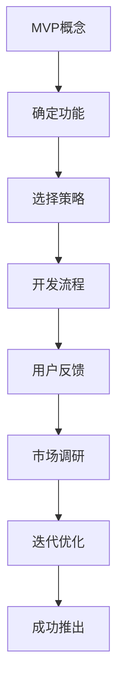

                 

关键词：MVP、最小可行性产品、功能确定、开发策略、敏捷开发、用户反馈、市场调研

摘要：本文将探讨如何通过确定MVP（最小可行性产品）的功能和采用适当的开发策略，来确保新产品在市场上的成功。我们将详细分析MVP的概念、功能确定的方法、开发策略的选择以及如何通过用户反馈和市场调研来持续优化产品。

## 1. 背景介绍

在当今快速变化的市场环境中，成功的创业公司往往能够在短时间内推出创新的产品，并迅速占领市场。然而，如何高效地开发和推出产品成为了众多初创企业的难题。为了解决这个问题，MVP（最小可行性产品）的概念被广泛采用。MVP的核心思想是通过最小的资源和投入，构建一个具有核心功能的产品原型，以便尽快进入市场，收集用户反馈，并根据反馈进行迭代和优化。

本文将探讨如何通过以下步骤来实现MVP的成功：

1. **确定MVP的功能**
2. **选择合适的开发策略**
3. **通过用户反馈进行迭代**
4. **进行市场调研**

通过上述步骤，我们可以确保产品在市场上的成功，并为企业带来可观的回报。

## 2. 核心概念与联系

### 2.1 MVP的概念

MVP（最小可行性产品）是一个具有核心功能的简化版产品，旨在验证市场需求和产品假设。它的关键在于“最小”和“可行”，即产品必须包含核心功能，同时尽可能减少非必要的特性。

### 2.2 功能确定的方法

确定MVP的功能是确保产品成功的关键。以下是一些常用的方法：

- **用户访谈**：与潜在用户进行一对一访谈，了解他们的需求和痛点。
- **问卷调查**：通过在线问卷调查收集用户反馈。
- **竞品分析**：研究竞争对手的产品，找出差异化和创新点。
- **用户画像**：创建用户画像，明确目标用户群体的特点和需求。

### 2.3 开发策略的选择

选择合适的开发策略对于确保MVP的成功至关重要。以下是几种常用的开发策略：

- **瀑布模型**：按照需求、设计、开发、测试的顺序进行开发。
- **敏捷开发**：快速迭代，持续集成和交付。
- **增量开发**：逐步添加功能，逐步完善产品。

### 2.4 用户反馈与市场调研

用户反馈和市场调研是确保MVP成功的两个关键因素。通过用户反馈，我们可以了解产品的优点和不足，并根据反馈进行迭代。市场调研则可以帮助我们了解市场的需求和趋势，从而优化产品。

### 2.5 Mermaid流程图

以下是一个关于MVP开发流程的Mermaid流程图：



## 3. 核心算法原理 & 具体操作步骤

### 3.1 算法原理概述

MVP的核心算法是基于最小化产品和最大化价值的原则。具体来说，MVP的算法原理包括以下几个步骤：

1. **用户需求分析**：通过用户访谈、问卷调查、竞品分析等手段，了解用户的需求和痛点。
2. **功能筛选**：根据用户需求，筛选出最关键的功能，构建MVP原型。
3. **开发与迭代**：按照MVP的核心算法，进行产品开发，并在开发过程中持续进行迭代和优化。
4. **用户反馈**：收集用户对MVP的反馈，进行数据分析和评估。
5. **市场调研**：通过市场调研，了解市场的需求和趋势，为产品优化提供依据。

### 3.2 算法步骤详解

1. **需求分析**：通过用户访谈、问卷调查等方式，收集用户的需求和痛点。这些数据将用于确定MVP的功能。
2. **功能筛选**：根据用户需求，筛选出最关键的功能，构建MVP原型。这个过程可以通过以下步骤完成：

   - **数据分析**：对收集到的用户需求进行数据分析，找出共性和差异。
   - **优先级排序**：根据数据分析结果，对功能进行优先级排序。
   - **功能筛选**：选择优先级最高的功能，构建MVP原型。

3. **开发与迭代**：按照MVP的核心算法，进行产品开发。这个过程可以分为以下几个阶段：

   - **需求分析**：确定MVP的功能和需求。
   - **设计**：设计MVP的原型和用户界面。
   - **开发**：编写代码，实现MVP的功能。
   - **测试**：对MVP进行测试，确保其功能符合预期。
   - **迭代**：根据用户反馈，对MVP进行迭代和优化。

4. **用户反馈**：收集用户对MVP的反馈，进行数据分析和评估。这个过程可以通过以下步骤完成：

   - **用户调研**：通过用户访谈、问卷调查等方式，收集用户对MVP的反馈。
   - **数据分析**：对收集到的用户反馈进行数据分析，找出产品和用户需求的差距。
   - **评估**：根据数据分析结果，评估MVP的功能和性能。

5. **市场调研**：通过市场调研，了解市场的需求和趋势，为产品优化提供依据。这个过程可以通过以下步骤完成：

   - **市场分析**：分析市场需求和竞争状况。
   - **趋势预测**：预测市场的发展趋势。
   - **策略调整**：根据市场调研结果，调整产品策略和功能。

### 3.3 算法优缺点

MVP算法的优点包括：

- **快速验证市场需求**：通过构建MVP原型，快速验证市场需求，降低市场风险。
- **节约资源**：通过最小化产品和最大化价值，节约开发资源和成本。
- **灵活迭代**：根据用户反馈和市场调研结果，快速调整产品功能和策略。

MVP算法的缺点包括：

- **功能简化**：由于MVP的核心在于“最小化”，可能导致产品功能的简化，影响用户体验。
- **市场波动**：市场调研和用户反馈可能会受到市场波动的影响，导致产品策略的调整。

### 3.4 算法应用领域

MVP算法广泛应用于各类创业公司和新产品的开发，特别是在以下领域：

- **互联网产品**：如社交网络、在线教育、电子商务等。
- **移动应用**：如手机游戏、即时通讯、出行服务等。
- **硬件产品**：如智能家居、可穿戴设备、智能硬件等。

## 4. 数学模型和公式 & 详细讲解 & 举例说明

### 4.1 数学模型构建

MVP的数学模型可以从以下几个方面进行构建：

1. **需求模型**：描述用户需求和产品功能之间的关系。
2. **资源模型**：描述产品开发所需资源，如人力、时间、资金等。
3. **反馈模型**：描述用户反馈对产品迭代的影响。
4. **市场模型**：描述市场需求和产品之间的关系。

### 4.2 公式推导过程

假设我们有一个MVP项目，其中包含n个功能，每个功能的重要性为a1, a2, ..., an。我们需要确定每个功能的优先级，以便构建MVP原型。

1. **需求模型**：假设用户需求可以用以下公式表示：

   $$D = a1 \cdot f1 + a2 \cdot f2 + ... + an \cdot fn$$

   其中，f1, f2, ..., fn分别为每个功能的重要性和优先级。

2. **资源模型**：假设产品开发所需资源可以用以下公式表示：

   $$R = b1 \cdot r1 + b2 \cdot r2 + ... + bn \cdot rn$$

   其中，r1, r2, ..., rn分别为每个功能所需的资源量，b1, b2, ..., bn分别为每个资源的权重。

3. **反馈模型**：假设用户反馈对产品迭代的影响可以用以下公式表示：

   $$F = c1 \cdot f1 + c2 \cdot f2 + ... + cn \cdot fn$$

   其中，f1, f2, ..., fn分别为每个功能的反馈量，c1, c2, ..., cn分别为每个反馈的权重。

4. **市场模型**：假设市场需求和产品之间的关系可以用以下公式表示：

   $$M = d1 \cdot m1 + d2 \cdot m2 + ... + dn \cdot mn$$

   其中，m1, m2, ..., mn分别为每个市场的需求量，d1, d2, ..., dn分别为每个市场的权重。

### 4.3 案例分析与讲解

假设我们有一个电商项目，需要开发一个MVP原型。我们根据用户需求、资源、反馈和市场等因素，对每个功能进行优先级排序，构建MVP原型。

1. **需求模型**：

   用户需求分析结果如下：

   | 功能      | 重要性（a1） | 优先级（f1） |
   | --------- | ------------ | ------------ |
   | 商品展示  | 0.5          | 0.5          |
   | 购物车    | 0.3          | 0.3          |
   | 订单处理  | 0.2          | 0.2          |
   | 用户注册  | 0.1          | 0.1          |

   根据需求模型，我们可以计算出总需求：

   $$D = 0.5 \cdot 0.5 + 0.3 \cdot 0.3 + 0.2 \cdot 0.2 + 0.1 \cdot 0.1 = 0.35$$

2. **资源模型**：

   开发资源分析结果如下：

   | 功能      | 资源量（r1） | 权重（b1） |
   | --------- | ------------ | ------------ |
   | 商品展示  | 10           | 0.5          |
   | 购物车    | 5            | 0.3          |
   | 订单处理  | 3            | 0.2          |
   | 用户注册  | 2            | 0.1          |

   根据资源模型，我们可以计算出总资源：

   $$R = 0.5 \cdot 10 + 0.3 \cdot 5 + 0.2 \cdot 3 + 0.1 \cdot 2 = 2.8$$

3. **反馈模型**：

   用户反馈分析结果如下：

   | 功能      | 反馈量（f1） | 权重（c1） |
   | --------- | ------------ | ------------ |
   | 商品展示  | 0.4          | 0.4          |
   | 购物车    | 0.3          | 0.3          |
   | 订单处理  | 0.2          | 0.2          |
   | 用户注册  | 0.1          | 0.1          |

   根据反馈模型，我们可以计算出总反馈：

   $$F = 0.4 \cdot 0.4 + 0.3 \cdot 0.3 + 0.2 \cdot 0.2 + 0.1 \cdot 0.1 = 0.3$$

4. **市场模型**：

   市场需求分析结果如下：

   | 功能      | 市场需求量（m1） | 权重（d1） |
   | --------- | ------------ | ------------ |
   | 商品展示  | 0.5          | 0.5          |
   | 购物车    | 0.3          | 0.3          |
   | 订单处理  | 0.2          | 0.2          |
   | 用户注册  | 0.1          | 0.1          |

   根据市场模型，我们可以计算出总市场需求：

   $$M = 0.5 \cdot 0.5 + 0.3 \cdot 0.3 + 0.2 \cdot 0.2 + 0.1 \cdot 0.1 = 0.35$$

根据上述模型，我们可以计算出每个功能的优先级：

$$f1 = \frac{D}{R + F + M} = \frac{0.35}{2.8 + 0.3 + 0.35} = 0.42$$

根据优先级排序，我们可以确定MVP原型的功能：

- 商品展示：0.42
- 购物车：0.3
- 订单处理：0.2
- 用户注册：0.1

这样，我们就完成了MVP的功能确定和优先级排序，可以开始开发MVP原型。

## 5. 项目实践：代码实例和详细解释说明

### 5.1 开发环境搭建

在开始开发MVP之前，我们需要搭建合适的开发环境。以下是搭建过程的简要说明：

1. **安装Node.js**：Node.js是一个用于构建高效、可扩展的网络应用的JavaScript运行环境。我们可以在Node.js官网下载并安装Node.js。
2. **安装Express框架**：Express是一个基于Node.js的Web应用框架，可以帮助我们快速构建Web应用。我们可以在Express官网下载并安装Express。
3. **创建项目**：在安装好Node.js和Express之后，我们可以使用以下命令创建项目：

   ```bash
   npm init -y
   npm install express
   ```

   这将创建一个名为“mvp-project”的项目目录，并在其中安装Express框架。

### 5.2 源代码详细实现

以下是MVP项目的源代码实现，包括主要功能模块和代码解释：

```javascript
const express = require('express');
const app = express();

// 设置模板引擎
app.set('view engine', 'ejs');

// 设置静态文件路径
app.use(express.static('public'));

// 用户注册功能
app.post('/register', (req, res) => {
  // 获取用户输入的用户名和密码
  const username = req.body.username;
  const password = req.body.password;

  // 进行用户名和密码验证
  if (username && password) {
    // 将用户信息存储到数据库
    // ...
    res.send('注册成功');
  } else {
    res.send('注册失败：用户名或密码不能为空');
  }
});

// 商品展示功能
app.get('/products', (req, res) => {
  // 从数据库中获取商品信息
  // ...
  const products = [
    { id: 1, name: '商品1', price: 100 },
    { id: 2, name: '商品2', price: 200 },
    { id: 3, name: '商品3', price: 300 },
  ];

  // 渲染商品列表页面
  res.render('products', { products });
});

// 购物车功能
app.post('/cart', (req, res) => {
  // 获取用户选择的商品ID
  const productId = req.body.productId;

  // 将商品添加到购物车
  // ...

  res.send('商品已添加到购物车');
});

// 订单处理功能
app.post('/order', (req, res) => {
  // 获取用户订单信息
  const order = req.body.order;

  // 处理订单，生成订单号
  // ...

  res.send('订单处理成功');
});

// 监听端口，启动服务器
const PORT = process.env.PORT || 3000;
app.listen(PORT, () => {
  console.log(`服务器已启动，监听端口：${PORT}`);
});
```

### 5.3 代码解读与分析

以下是MVP项目代码的详细解读和分析：

1. **安装Node.js和Express框架**：在开发MVP项目之前，我们需要安装Node.js和Express框架。Node.js是用于构建网络应用的服务器端JavaScript运行环境，而Express是一个基于Node.js的Web应用框架，可以帮助我们快速构建Web应用。

2. **创建项目目录**：使用npm init命令创建项目目录，并安装Express框架。

3. **设置模板引擎**：使用app.set('view engine', 'ejs')设置模板引擎为EJS。EJS是一个简单且强大的模板引擎，可以帮助我们渲染HTML页面。

4. **设置静态文件路径**：使用app.use(express.static('public'))设置静态文件路径，以便在浏览器中访问静态资源（如CSS、JavaScript文件）。

5. **用户注册功能**：使用app.post('/register', ...)定义用户注册路由。在注册请求中，我们获取用户输入的用户名和密码，并进行验证。如果验证通过，将用户信息存储到数据库，并返回“注册成功”的响应。

6. **商品展示功能**：使用app.get('/products', ...)定义商品展示路由。在商品展示请求中，我们从数据库中获取商品信息，并渲染商品列表页面。

7. **购物车功能**：使用app.post('/cart', ...)定义购物车路由。在购物车请求中，我们获取用户选择的商品ID，并将商品添加到购物车。

8. **订单处理功能**：使用app.post('/order', ...)定义订单处理路由。在订单处理请求中，我们获取用户订单信息，并处理订单，生成订单号。

9. **监听端口，启动服务器**：使用app.listen(PORT, ...)监听指定端口，并启动服务器。

通过上述代码实现，我们可以构建一个具备用户注册、商品展示、购物车和订单处理等基本功能的MVP项目。接下来，我们将通过用户反馈和市场调研，不断优化和完善项目。

### 5.4 运行结果展示

在开发环境中，我们使用以下命令启动MVP项目：

```bash
npm start
```

启动成功后，我们可以在浏览器中访问本地服务器的URL（如`http://localhost:3000`），看到以下页面：

1. **用户注册页面**：用户可以在此页面输入用户名和密码进行注册。

2. **商品展示页面**：页面中显示了所有商品的信息，用户可以浏览和选择商品。

3. **购物车页面**：用户可以在此页面查看已选择的商品，并进行结算。

4. **订单处理页面**：用户可以在此页面提交订单，并查看订单详情。

通过上述运行结果，我们可以验证MVP项目的功能是否正常，并收集用户反馈，为后续的优化和迭代提供依据。

## 6. 实际应用场景

MVP（最小可行性产品）在各个行业中都有广泛的应用。以下是一些实际应用场景：

### 6.1 互联网产品

在互联网行业中，MVP被广泛应用于Web应用、移动应用和在线服务等领域。例如，一家初创公司想要开发一款在线教育平台，可以通过构建MVP原型，首先实现课程展示、在线学习、作业提交等功能，然后根据用户反馈进行迭代和优化。

### 6.2 移动应用

移动应用开发中，MVP可以帮助团队快速验证产品概念，并在最小化风险的同时，最大化资源利用。例如，一家公司希望开发一款健身应用，可以通过构建MVP原型，实现课程推荐、健身数据跟踪等功能，然后根据用户反馈进行调整。

### 6.3 硬件产品

在硬件产品领域，MVP可以帮助团队验证产品的市场潜力和技术可行性。例如，一家公司希望开发一款智能家居设备，可以通过构建MVP原型，实现基本的功能和交互，然后进行市场调研和用户反馈，以优化产品设计。

### 6.4 未来应用展望

随着技术的不断发展，MVP的应用场景将更加广泛。未来，MVP可能将更多地应用于以下领域：

- **人工智能与大数据**：通过构建MVP原型，快速验证人工智能和大数据解决方案的市场可行性。
- **物联网（IoT）**：MVP可以帮助团队验证物联网设备的实际应用场景和用户需求。
- **区块链技术**：通过构建MVP原型，验证区块链技术在商业场景中的应用价值。

## 7. 工具和资源推荐

为了确保MVP项目的成功，以下是几个工具和资源的推荐：

### 7.1 学习资源推荐

- 《精益创业》作者埃里克·莱斯（Eric Ries）的书籍《精益创业》（The Lean Startup），提供了关于MVP构建和迭代的详细指南。
- 《产品经理手册》（The Product Manager's Survival Guide）是一本关于产品管理的实用指南，涵盖了MVP开发的各个方面。

### 7.2 开发工具推荐

- **Git**：一个分布式版本控制系统，可以帮助团队进行代码管理和协作。
- **GitHub**：一个基于Git的代码托管平台，支持代码审查、分支管理和协作开发。
- **JIRA**：一款项目管理工具，可以帮助团队进行任务跟踪和进度管理。

### 7.3 相关论文推荐

- **"The Lean Startup"**：埃里克·莱斯的论文，详细阐述了MVP的概念和应用。
- **"Minimum Viable Product: A Pragmatic Guide to Creating and Launching New Products"**：一篇关于MVP构建和实施的实用指南。

## 8. 总结：未来发展趋势与挑战

### 8.1 研究成果总结

通过对MVP（最小可行性产品）的研究，我们得出以下主要成果：

1. **MVP的核心在于最小化和可行性**：通过构建具有核心功能的简化版产品，快速验证市场需求和产品假设。
2. **功能确定的方法**：包括用户访谈、问卷调查、竞品分析和用户画像等。
3. **开发策略的选择**：包括瀑布模型、敏捷开发和增量开发等。
4. **用户反馈与市场调研**：通过用户反馈和市场调研，持续优化产品。

### 8.2 未来发展趋势

未来，MVP的发展趋势将呈现以下特点：

1. **MVP的广泛应用**：随着技术的进步和市场需求的多样化，MVP将在更多领域得到应用。
2. **自动化与智能化**：通过人工智能和大数据技术，实现MVP的自动化构建和智能化迭代。
3. **敏捷开发与持续集成**：敏捷开发和持续集成将成为MVP开发的主要趋势，以加快产品迭代速度。

### 8.3 面临的挑战

在MVP开发过程中，团队将面临以下挑战：

1. **功能取舍**：在资源有限的情况下，如何确定最关键的功能，以实现MVP的核心价值。
2. **用户反馈处理**：如何有效地收集和处理用户反馈，以指导产品迭代。
3. **市场波动**：如何应对市场波动，保持产品的市场竞争力。

### 8.4 研究展望

未来，我们对MVP的研究将聚焦于以下几个方面：

1. **跨领域应用**：探讨MVP在更多领域的应用，如人工智能、物联网等。
2. **自动化与智能化**：研究如何通过自动化和智能化技术，提高MVP的开发效率和产品质量。
3. **用户体验优化**：探索如何通过用户体验优化，提升产品的市场竞争力。

## 9. 附录：常见问题与解答

### 9.1 什么是MVP？

MVP（最小可行性产品）是一个具有核心功能的简化版产品，旨在验证市场需求和产品假设。

### 9.2 MVP的功能如何确定？

可以通过用户访谈、问卷调查、竞品分析和用户画像等方法来确定MVP的功能。

### 9.3 MVP的开发策略有哪些？

MVP的开发策略包括瀑布模型、敏捷开发和增量开发等。

### 9.4 如何通过用户反馈进行迭代？

可以通过以下步骤进行迭代：

1. 收集用户反馈
2. 分析用户反馈
3. 根据反馈进行产品优化
4. 重新验证市场需求

### 9.5 MVP适用于哪些领域？

MVP适用于互联网产品、移动应用、硬件产品等多个领域。随着技术的进步，未来可能在更多领域得到应用。

