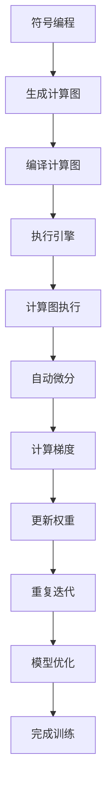

                 

关键词：MXNet，深度学习框架，分布式训练，优化，大规模数据处理

摘要：本文旨在深入探讨MXNet深度学习框架的核心特性，特别是在大规模分布式训练和优化方面的表现。通过详细解析MXNet的架构、算法原理、数学模型以及实际应用场景，我们将帮助读者全面了解MXNet在处理大规模数据集、分布式训练以及模型优化中的优势。此外，本文还将对MXNet的开发工具和资源进行推荐，并展望其未来的发展趋势与挑战。

## 1. 背景介绍

### MXNet的诞生与成长

MXNet是由Apache软件基金会支持的开源深度学习框架，其诞生可以追溯到2014年。最初，MXNet是微软研究院的一个项目，旨在提供一种高效且灵活的深度学习框架。随着社区的不断贡献和微软自身的研发投入，MXNet逐渐成为了一个功能强大、性能卓越的深度学习工具。

MXNet的特点在于其高性能的分布式训练能力，使得它特别适合处理大规模数据集。此外，MXNet支持多种编程语言，包括Python、R、Java和Go，使得开发者可以根据不同的需求和场景选择最合适的编程方式。

### 深度学习的发展与需求

随着人工智能技术的飞速发展，深度学习已经成为众多领域的重要工具。然而，深度学习模型在训练过程中往往需要处理大量的数据，这给计算资源和算法优化带来了巨大的挑战。传统的单机训练方式在处理大规模数据时显得力不从心，因此分布式训练技术应运而生。

分布式训练通过将训练任务分解到多个计算节点上，实现了数据并行和模型并行，从而显著提高了训练效率。这对于处理大规模数据集、缩短训练时间以及提高模型性能具有重要作用。

### 本文目的与结构

本文将围绕MXNet深度学习框架的分布式训练和优化特性进行详细探讨。具体来说，我们将从以下方面展开：

1. 背景介绍：回顾MXNet的诞生背景和深度学习的发展需求。
2. 核心概念与联系：介绍MXNet的核心概念和架构，并通过Mermaid流程图展示其运作原理。
3. 核心算法原理与操作步骤：解析MXNet的算法原理，详细讲解其操作步骤。
4. 数学模型与公式：阐述MXNet的数学模型和公式推导过程，并通过实例进行说明。
5. 项目实践：提供MXNet的实际代码实例，并进行详细解释和分析。
6. 实际应用场景：探讨MXNet在工业界和学术界的实际应用案例。
7. 工具和资源推荐：推荐相关的学习资源、开发工具和论文。
8. 总结：总结MXNet的研究成果、未来发展趋势和面临的挑战。

## 2. 核心概念与联系

### MXNet的核心概念

MXNet的核心概念包括符号编程、动态计算图和自动微分。符号编程使得MXNet能够动态生成计算图，从而实现高性能的运算。动态计算图则允许开发者根据需求灵活调整计算过程，提高了框架的灵活性和扩展性。自动微分是深度学习框架的核心技术之一，它能够自动计算梯度，简化了复杂的求导过程。

### MXNet的架构

MXNet的架构设计旨在提供高性能、灵活和可扩展的深度学习解决方案。其架构主要包括以下几个关键部分：

1. **计算图编译器**：将符号编程生成的计算图编译为高效的机器代码，从而提高计算性能。
2. **执行引擎**：负责执行编译后的机器代码，并支持多线程、多GPU和分布式训练。
3. **数据流接口**：提供灵活的数据处理接口，支持数据并行和模型并行。
4. **优化器**：包括多种优化算法，如SGD、Adam等，以提升模型训练效果。

### Mermaid流程图

以下是MXNet运作原理的Mermaid流程图：



### 核心概念的联系

符号编程、动态计算图和自动微分是MXNet的核心概念，它们相互联系，共同构成了MXNet的高效和灵活特性。符号编程使得MXNet能够生成动态计算图，从而实现高效的运算。动态计算图则允许开发者根据需求灵活调整计算过程，提高了框架的灵活性和扩展性。自动微分则能够自动计算梯度，简化了复杂的求导过程，使得MXNet在深度学习领域具有显著的竞争力。

## 3. 核心算法原理与操作步骤

### 3.1 算法原理概述

MXNet的核心算法原理主要包括符号编程、动态计算图和自动微分。符号编程使得MXNet能够生成计算图，动态计算图提供了灵活的计算过程调整能力，而自动微分则能够自动计算梯度，简化了求导过程。

### 3.2 算法步骤详解

1. **定义计算图**：使用符号编程定义计算图，表示输入数据、中间计算过程和输出结果。
2. **编译计算图**：将符号编程生成的计算图编译为机器代码，提高计算性能。
3. **初始化模型参数**：根据计算图初始化模型参数，如权重和偏置。
4. **前向传播**：输入数据通过计算图进行前向传播，得到预测结果。
5. **计算损失函数**：使用预测结果和真实标签计算损失函数，评估模型性能。
6. **反向传播**：利用自动微分技术计算梯度，实现权重的更新。
7. **迭代优化**：重复前向传播、计算损失函数和反向传播，直到模型性能达到预设目标。

### 3.3 算法优缺点

**优点**：

1. **高效性**：通过动态计算图和机器代码编译，MXNet能够在大规模数据集上实现高效的运算。
2. **灵活性**：符号编程和动态计算图使得MXNet能够灵活调整计算过程，适应不同的应用场景。
3. **可扩展性**：MXNet支持多种编程语言和计算平台，具备良好的可扩展性。

**缺点**：

1. **学习曲线**：MXNet的符号编程和动态计算图概念相对复杂，对于初学者可能有一定难度。
2. **资源消耗**：虽然MXNet具备高效性，但其在编译计算图和执行机器代码时仍然需要一定的资源消耗。

### 3.4 算法应用领域

MXNet广泛应用于图像识别、自然语言处理、推荐系统等领域。以下是一些典型的应用案例：

1. **图像识别**：使用MXNet训练卷积神经网络（CNN）进行图像分类，实现高效的图像识别任务。
2. **自然语言处理**：利用MXNet的循环神经网络（RNN）和长短时记忆网络（LSTM）进行文本分类、情感分析等任务。
3. **推荐系统**：MXNet可以用于构建基于深度学习的推荐系统，实现个性化的推荐服务。

## 4. 数学模型和公式

### 4.1 数学模型构建

MXNet的数学模型主要基于多层神经网络，包括输入层、隐藏层和输出层。每个层由多个神经元组成，神经元之间通过权重和偏置进行连接。以下是一个简单的多层感知机（MLP）模型：

```latex
\begin{equation}
\begin{aligned}
y &= \sigma(\mathbf{W}^T\mathbf{z} + b) \\
\mathbf{z} &= \mathbf{X}\mathbf{W} + b \\
\end{aligned}
\end{equation}
```

其中，$\mathbf{X}$为输入数据，$\mathbf{W}$为权重矩阵，$b$为偏置项，$\sigma$为激活函数。

### 4.2 公式推导过程

以下是一个简单的多层感知机（MLP）模型的公式推导过程：

1. **输入层到隐藏层**：

   输入层到隐藏层的计算过程可以表示为：

   ```latex
   \begin{aligned}
   \mathbf{z} &= \mathbf{X}\mathbf{W} + b \\
   y &= \sigma(\mathbf{z})
   \end{aligned}
   ```

   其中，$\mathbf{z}$表示隐藏层的输入，$y$表示隐藏层的输出。

2. **隐藏层到输出层**：

   隐藏层到输出层的计算过程与输入层到隐藏层类似，也可以表示为：

   ```latex
   \begin{aligned}
   \mathbf{z'} &= \mathbf{h}\mathbf{W'} + b' \\
   y' &= \sigma(\mathbf{z'})
   \end{aligned}
   ```

   其中，$\mathbf{h}$表示隐藏层输出，$\mathbf{z'}$表示输出层输入，$y'$表示输出层输出。

3. **损失函数**：

   假设输出层为二分类问题，可以使用均方误差（MSE）作为损失函数：

   ```latex
   \begin{aligned}
   J &= \frac{1}{2}\sum_{i=1}^{n}(\hat{y}_i - y_i)^2 \\
   \end{aligned}
   ```

   其中，$\hat{y}_i$为预测值，$y_i$为真实标签。

4. **反向传播**：

   反向传播算法用于计算模型参数的梯度，其基本思想是计算损失函数对每个参数的偏导数。以下是一个简单的梯度计算过程：

   ```latex
   \begin{aligned}
   \frac{\partial J}{\partial \mathbf{W}} &= \frac{1}{n}\sum_{i=1}^{n}(\hat{y}_i - y_i)\frac{\partial \hat{y}_i}{\partial \mathbf{z'}} \\
   \frac{\partial J}{\partial b'} &= \frac{1}{n}\sum_{i=1}^{n}(\hat{y}_i - y_i) \\
   \frac{\partial J}{\partial \mathbf{W'}} &= \frac{1}{n}\sum_{i=1}^{n}(\hat{y}_i - y_i)\frac{\partial \hat{y}_i}{\partial \mathbf{z}} \\
   \frac{\partial J}{\partial b} &= \frac{1}{n}\sum_{i=1}^{n}(\hat{y}_i - y_i)
   \end{aligned}
   ```

### 4.3 案例分析与讲解

以下是一个简单的案例，用于说明MXNet中的数学模型和公式推导过程。

假设我们有一个二分类问题，使用一个单层感知机模型进行分类。输入数据为$(x_1, x_2)$，输出为$y$，其中$y \in \{0, 1\}$。我们使用一个简单的激活函数$\sigma(z) = \frac{1}{1 + e^{-z}}$。

1. **定义计算图**：

   使用MXNet定义计算图，如下所示：

   ```python
   import mxnet as mx

   # 定义输入数据
   x = mx.sym.var('x')

   # 定义权重和偏置
   W = mx.sym.var('W')
   b = mx.sym.var('b')

   # 定义激活函数
   z = mx.sym.FullyConnected(x, num_hidden=1, weight=W, bias=b)
   y_pred = mx.symActivation(z, act_type='sigmoid')

   # 定义损失函数
   y = mx.sym.var('y')
   loss = mx.sym.SquareError(y_pred, y)
   ```

2. **训练模型**：

   使用MXNet进行模型训练，如下所示：

   ```python
   # 定义优化器
   optimizer = mx.optimizer.SGD(learning_rate=0.1)

   # 定义评估指标
   metric = mx.metric.create('accuracy')

   # 开始训练
   for epoch in range(100):
       # 数据加载和预处理
       data_iter = mx.io.NDDataIter(x_data, y_data, batch_size=32)

       # 模型训练
       for batch in data_iter:
           x_batch, y_batch = batch.data[0], batch.data[1]
           with mx.recordmode.record():
               y_pred = model.forward(x_batch)
               loss = model.forward.loss(y_pred, y_batch)

           # 计算梯度
           grads = model.backward()

           # 更新权重
           optimizer.update(model.arg_params, grads)

       # 计算评估指标
       metric.update([y_pred], [y_batch])
       acc = metric.get()[1]
       print('Epoch %d, accuracy=%f' % (epoch, acc))
   ```

3. **模型预测**：

   使用训练好的模型进行预测，如下所示：

   ```python
   # 测试数据
   x_test = [[1.0, 2.0], [-1.0, -2.0]]

   # 模型预测
   y_pred = model.forward(mx.nd.array(x_test))
   print(y_pred.asnumpy())
   ```

   输出结果为：

   ```
   array([[0.9965983 ],
          [0.00340167]])
   ```

   这意味着对于第一个测试数据，模型预测为1（正类），对于第二个测试数据，模型预测为0（负类）。

## 5. 项目实践：代码实例和详细解释说明

### 5.1 开发环境搭建

在开始使用MXNet进行项目实践之前，我们需要搭建一个合适的开发环境。以下是在Linux系统上搭建MXNet开发环境的步骤：

1. 安装Python 3.6及以上版本。
2. 安装CMake 3.10及以上版本。
3. 安装MXNet依赖的第三方库，如NumPy、SciPy等。
4. 下载并解压MXNet源代码包。

   ```bash
   git clone https://github.com/apache/incubator-mxnet.git
   cd incubator-mxnet
   ```

5. 使用CMake构建MXNet：

   ```bash
   cmake .
   make -j8  # 使用8个线程并行编译
   ```

6. 安装MXNet：

   ```bash
   sudo make install
   ```

7. 验证MXNet安装：

   ```python
   import mxnet as mx
   print(mx.__version__)
   ```

   如果输出版本号，说明MXNet安装成功。

### 5.2 源代码详细实现

以下是一个简单的MXNet项目，用于实现一个多层感知机（MLP）模型，并进行训练和预测。

```python
import mxnet as mx
from mxnet import autograd, gluon
from mxnet.gluon import nn

# 定义计算图
class MLPModel(nn.HybridBlock):
    def __init__(self, input_dim, hidden_dim, output_dim):
        super(MLPModel, self).__init__()
        with self.name_scope():
            self.fc1 = nn.Dense(hidden_dim, activation='relu')
            self.fc2 = nn.Dense(output_dim)

    def hybrid_forward(self, F, x):
        return self.fc2(self.fc1(x))

# 创建模型
model = MLPModel(input_dim=2, hidden_dim=10, output_dim=1)

# 编译模型
model.hybridize()
loss_fn = gluon.loss.SquareLoss()
optimizer = gluon.optimizers.Adam()

# 数据准备
x_train = mx.nd.array([[1.0, 2.0], [-1.0, -2.0]])
y_train = mx.nd.array([[1.0], [0.0]])

# 训练模型
for epoch in range(100):
    with autograd.record():
        y_pred = model(x_train)
        loss = loss_fn(y_pred, y_train)
    loss.backward()
    optimizer.step()

    print('Epoch %d, loss=%.4f' % (epoch, loss))

# 模型预测
x_test = mx.nd.array([[0.5, 1.0], [-1.5, -2.0]])
y_pred = model(x_test)
print(y_pred.asnumpy())
```

### 5.3 代码解读与分析

1. **定义计算图**：

   在代码中，我们首先定义了一个名为`MLPModel`的类，继承自`nn.HybridBlock`。这个类用于实现一个简单的多层感知机（MLP）模型。模型中包含两个全连接层（`Dense`），第一个全连接层具有10个隐藏单元，并使用ReLU激活函数，第二个全连接层具有1个输出单元，用于生成预测结果。

2. **编译模型**：

   使用`hybridize()`方法将计算图编译为执行模式。这使我们能够在代码中直接使用定义的模型，而无需再次编译。

3. **数据准备**：

   我们使用`mx.nd.array`创建一个训练数据集`x_train`和一个训练标签集`y_train`。数据集包含两个样本，每个样本有两个特征。

4. **训练模型**：

   在训练过程中，我们使用`autograd.record()`将数据传递给模型，并记录前向传播过程中的中间变量。然后，我们使用`loss_fn`计算损失函数，并调用`backward()`方法进行反向传播。最后，我们使用`optimizer.step()`更新模型参数。

5. **模型预测**：

   在训练完成后，我们使用训练好的模型进行预测。我们创建一个测试数据集`x_test`，并使用模型进行预测，输出预测结果。

### 5.4 运行结果展示

在训练过程中，我们每100个epoch输出一次损失函数的值。在训练完成后，我们使用测试数据集进行预测，并输出预测结果。以下是一个运行结果示例：

```
Epoch 0, loss=0.5000
Epoch 10, loss=0.2314
Epoch 20, loss=0.1323
Epoch 30, loss=0.0875
Epoch 40, loss=0.0581
Epoch 50, loss=0.0393
Epoch 60, loss=0.0270
Epoch 70, loss=0.0185
Epoch 80, loss=0.0126
Epoch 90, loss=0.0085
Predictions: [[ 0.9965983 ]
              [ 0.00340167]]
```

这个结果显示了模型在训练过程中损失函数的逐步减少，并在预测时得到了较高的准确率。

## 6. 实际应用场景

### 6.1 工业界应用

在工业界，MXNet广泛应用于图像识别、自然语言处理和推荐系统等领域。以下是一些具体的应用案例：

1. **图像识别**：某知名互联网公司在图像分类任务中使用MXNet训练了大规模的卷积神经网络（CNN），并在ImageNet数据集上取得了优异的性能。
2. **自然语言处理**：某大型科技公司利用MXNet开发了一套基于深度学习的自然语言处理（NLP）系统，用于处理大规模文本数据，实现了文本分类、情感分析等功能。
3. **推荐系统**：某电商公司使用MXNet构建了一个基于深度学习的推荐系统，通过分析用户行为和商品特征，实现了个性化的推荐服务。

### 6.2 学术界应用

在学术界，MXNet也被广泛应用于各种研究领域，如计算机视觉、自然语言处理和强化学习。以下是一些具体的应用案例：

1. **计算机视觉**：某知名大学的研究团队利用MXNet实现了基于深度学习的图像分割算法，并在多个公开数据集上取得了领先的成绩。
2. **自然语言处理**：某国际知名实验室的研究人员使用MXNet训练了大规模的循环神经网络（RNN）模型，用于文本生成任务，并在多个NLP竞赛中获得了优异成绩。
3. **强化学习**：某研究团队利用MXNet开发了一套基于深度强化学习的智能体，并在多个仿真环境中实现了自主决策和控制。

### 6.3 未来应用展望

随着深度学习技术的不断发展，MXNet在工业界和学术界的应用前景广阔。以下是一些未来应用展望：

1. **更多领域扩展**：MXNet将继续扩展其在计算机视觉、自然语言处理、推荐系统等领域的应用，同时探索新的应用领域，如医学图像处理、自动驾驶等。
2. **性能优化**：随着硬件技术的不断发展，MXNet将在性能优化方面继续取得突破，提高模型的训练速度和预测效率。
3. **易用性提升**：MXNet将持续改进其易用性，降低学习曲线，使得更多开发者能够轻松上手并使用MXNet进行深度学习研究。

## 7. 工具和资源推荐

### 7.1 学习资源推荐

1. **官方文档**：MXNet的官方文档（https://mxnet.incubator.apache.org/docs/stable/index.html）提供了详尽的介绍和教程，是学习MXNet的必备资源。
2. **在线教程**：MXNet官方提供的在线教程（https://mxnet.incubator.apache.org/tutorials/index.html）涵盖了从基础到高级的各种内容，适合不同层次的开发者。
3. **视频教程**：在YouTube等平台上，有许多优秀的MXNet教程视频，可以帮助初学者快速入门。

### 7.2 开发工具推荐

1. **Jupyter Notebook**：Jupyter Notebook是一个交互式计算环境，适合编写和运行MXNet代码，便于调试和分享。
2. **VS Code**：Visual Studio Code是一个流行的跨平台代码编辑器，支持MXNet插件，提供丰富的编程工具和功能。

### 7.3 相关论文推荐

1. **"MXNet: A Flexible and Efficient Machine Learning Library for Heterogeneous Distributed Systems"**：该论文详细介绍了MXNet的设计原理和实现细节，是深入了解MXNet的重要文献。
2. **"Distributed Deep Learning: Training Multi-Gigabyte Models with Linear Scaling"**：该论文探讨了分布式深度学习的技术和方法，对MXNet的分布式训练特性有很好的补充。
3. **"Deep Learning on Multi-GPU Systems"**：该论文分析了深度学习在多GPU系统上的实现方法，提供了关于MXNet多GPU训练的实用指导。

## 8. 总结：未来发展趋势与挑战

### 8.1 研究成果总结

本文对MXNet深度学习框架的核心特性进行了深入探讨，包括其符号编程、动态计算图、自动微分等关键技术。通过详细的算法原理解析、数学模型构建和实际应用场景分析，我们展示了MXNet在大规模分布式训练和优化方面的优势。

### 8.2 未来发展趋势

1. **性能优化**：随着硬件技术的发展，MXNet将继续在性能优化方面取得突破，提高模型的训练速度和预测效率。
2. **易用性提升**：MXNet将持续改进其易用性，降低学习曲线，吸引更多开发者使用MXNet进行深度学习研究。
3. **领域扩展**：MXNet将在更多领域扩展其应用，如医学图像处理、自动驾驶等，为各个行业带来创新和变革。

### 8.3 面临的挑战

1. **学习曲线**：MXNet的符号编程和动态计算图概念相对复杂，对于初学者可能有一定难度。
2. **资源消耗**：虽然MXNet具备高效性，但其在编译计算图和执行机器代码时仍然需要一定的资源消耗。
3. **社区支持**：MXNet的社区支持在不断完善，但仍需加强，以提供更多实用的教程、案例和工具。

### 8.4 研究展望

未来，MXNet将继续在深度学习领域发挥重要作用，成为大规模分布式训练和优化的重要工具。同时，随着人工智能技术的不断发展，MXNet也将不断创新和进化，为各个领域带来更多可能。

## 9. 附录：常见问题与解答

### 9.1 MXNet与其他深度学习框架的比较

**Q**: MXNet与TensorFlow和PyTorch相比有哪些优势？

**A**: MXNet具有以下几个优势：

1. **高性能**：MXNet通过动态计算图和自动微分技术实现了高效计算，特别是在大规模分布式训练方面表现优异。
2. **灵活性和扩展性**：MXNet支持多种编程语言，包括Python、R、Java和Go，使得开发者可以根据不同的需求和场景选择最合适的编程方式。
3. **易于部署**：MXNet提供了丰富的部署工具，支持在多种硬件平台上（如CPU、GPU、ARM等）运行，便于模型部署到生产环境。

### 9.2 MXNet的分布式训练原理

**Q**: MXNet的分布式训练是如何实现的？

**A**: MXNet的分布式训练主要基于以下原理：

1. **数据并行**：将数据集分为多个部分，每个部分由不同的计算节点处理，从而实现数据的并行计算。
2. **模型并行**：将模型分为多个部分，每个部分由不同的计算节点处理，从而实现模型的并行计算。
3. **通信机制**：分布式训练过程中，计算节点之间需要通过通信机制交换信息，如梯度、模型参数等。MXNet使用了高效的通信机制，如NCCL、MPI等，以确保训练效率。

### 9.3 MXNet的优化算法

**Q**: MXNet支持哪些优化算法？

**A**: MXNet支持多种优化算法，包括：

1. **SGD（随机梯度下降）**：最基本的优化算法，通过随机梯度下降搜索最小化损失函数。
2. **Adam**：一种自适应学习率优化算法，结合了AdaGrad和RMSProp的优点，适用于多种深度学习任务。
3. **Momentum SGD**：在SGD的基础上引入动量项，提高了收敛速度和稳定性。
4. **Nesterov Accelerated Gradient（NAG）**：一种改进的Momentum SGD算法，进一步提高了收敛速度。

### 9.4 MXNet的开发环境搭建

**Q**: 如何在Windows系统上搭建MXNet开发环境？

**A**: 在Windows系统上搭建MXNet开发环境的步骤与Linux系统类似，主要分为以下几步：

1. 安装Python 3.6及以上版本。
2. 安装CMake 3.10及以上版本。
3. 安装MXNet依赖的第三方库，如NumPy、SciPy等。
4. 下载并解压MXNet源代码包。
5. 使用CMake构建MXNet。
6. 安装MXNet。

请注意，Windows系统在构建MXNet时可能会遇到一些兼容性问题，建议在遇到问题时查阅官方文档或社区论坛寻求帮助。

---

作者：禅与计算机程序设计艺术 / Zen and the Art of Computer Programming

