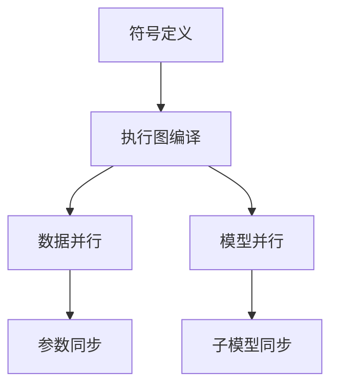

                 

关键词：MXNet、深度学习、大规模分布式训练、框架、算法、数学模型、实践、应用场景、未来展望

> 摘要：本文深入探讨了MXNet深度学习框架在大型分布式系统中的应用，分析了其核心概念、算法原理、数学模型以及具体实现步骤。通过实际项目实践，展示了MXNet在分布式训练中的强大能力，并对其未来发展趋势和挑战进行了展望。

## 1. 背景介绍

随着人工智能技术的快速发展，深度学习已经成为众多应用场景中不可或缺的一部分。然而，随着数据量和计算需求的不断增长，单机训练已经无法满足实际需求。分布式训练应运而生，通过将数据分布在多个节点上进行训练，提高了计算效率和处理能力。在这一背景下，MXNet深度学习框架因其高效和可扩展性而备受关注。

MXNet是Apache Software Foundation的一个开源深度学习框架，由亚马逊公司开发，并广泛应用于工业界和学术界。它支持多种编程语言，如Python、R、Julia等，提供了丰富的API和工具，使得开发者可以轻松地构建和训练深度学习模型。

本文将围绕MXNet在分布式训练中的应用，详细探讨其核心概念、算法原理、数学模型和具体实现步骤，并通过实际项目实践，展示其分布式训练的强大能力。

## 2. 核心概念与联系

### 2.1. MXNet核心概念

在MXNet中，核心概念包括符号（Symbols）、执行图（Execution Graph）和参数（Parameters）。

- **符号（Symbols）**：符号是MXNet中的核心数据结构，用于定义计算图。符号通过操作符（Ops）和激活函数（Activaions）组合而成，可以表示一个复杂的计算过程。

- **执行图（Execution Graph）**：执行图是符号的编译结果，用于实际计算。执行图将符号中的计算过程映射到具体的硬件设备上，如CPU、GPU等。

- **参数（Parameters）**：参数是模型中的可学习变量，用于调整模型。参数在训练过程中通过反向传播算法更新，以最小化损失函数。

### 2.2. MXNet与分布式训练的关系

分布式训练的关键在于将数据和计算任务分布在多个节点上。MXNet通过其高度优化的符号系统和执行图，实现了高效的数据并行和模型并行。

- **数据并行**：数据并行是将数据集划分为多个子集，每个子集在一个节点上训练模型。MXNet通过符号系统实现了数据并行，使得每个节点的计算图是相同的，只需在参数更新时进行同步。

- **模型并行**：模型并行是将模型拆分为多个子模型，每个子模型在一个节点上训练。MXNet通过执行图实现了模型并行，将复杂的计算过程分解为多个子任务，提高了计算效率。

### 2.3. Mermaid流程图

为了更直观地展示MXNet与分布式训练的关系，我们使用Mermaid流程图进行描述：



在图中，符号定义表示MXNet中的符号系统，执行图编译表示符号编译成执行图，数据并行表示数据分布在多个节点上，模型并行表示模型拆分为多个子模型。参数同步和子模型同步分别表示分布式训练过程中参数更新和子模型同步的过程。

## 3. 核心算法原理 & 具体操作步骤

### 3.1 算法原理概述

MXNet的分布式训练主要依赖于两个核心算法：数据并行和模型并行。

- **数据并行**：数据并行通过将数据集划分为多个子集，在每个节点上独立训练模型。节点之间的通信仅限于参数同步。

- **模型并行**：模型并行通过将模型拆分为多个子模型，在每个节点上独立训练子模型。节点之间的通信包括子模型同步和参数更新。

### 3.2 算法步骤详解

#### 3.2.1 数据并行

1. 数据预处理：将原始数据集划分为多个子集，每个子集分配到一个节点上。

2. 符号定义：在每个节点上定义计算图，表示模型的前向和反向传播过程。

3. 执行图编译：将符号编译成执行图，并将执行图映射到具体的硬件设备上。

4. 模型训练：在每个节点上独立训练模型，并在每个迭代周期结束后进行参数同步。

5. 模型评估：在每个迭代周期结束后，使用全局参数评估模型性能。

#### 3.2.2 模型并行

1. 模型拆分：将模型拆分为多个子模型，每个子模型包含一部分计算图。

2. 子模型训练：在每个节点上独立训练子模型，并在每个迭代周期结束后进行子模型同步。

3. 子模型同步：将每个节点的子模型同步到全局模型上，以更新全局参数。

4. 参数更新：使用反向传播算法，根据全局损失函数更新全局参数。

5. 模型评估：使用全局参数评估模型性能。

### 3.3 算法优缺点

#### 优点：

- **高效**：MXNet通过符号系统和执行图的优化，实现了高效的数据并行和模型并行。

- **灵活**：MXNet支持多种编程语言和硬件设备，具有很高的灵活性。

- **可扩展**：MXNet支持大规模分布式训练，可以轻松扩展到更多节点。

#### 缺点：

- **复杂性**：分布式训练涉及到多个节点和复杂的通信过程，需要一定的编程和调试经验。

- **性能瓶颈**：在某些情况下，分布式训练可能会导致性能瓶颈，如网络延迟和通信开销。

### 3.4 算法应用领域

MXNet在分布式训练中的应用非常广泛，包括但不限于以下领域：

- **计算机视觉**：如图像分类、目标检测、语义分割等。

- **自然语言处理**：如语言模型、机器翻译、文本分类等。

- **推荐系统**：如基于内容的推荐、协同过滤等。

- **金融风控**：如欺诈检测、信用评估等。

## 4. 数学模型和公式 & 详细讲解 & 举例说明

### 4.1 数学模型构建

MXNet的分布式训练主要依赖于以下数学模型：

- **损失函数**：损失函数用于衡量模型预测值与真实值之间的差距，如均方误差（MSE）和交叉熵（Cross-Entropy）。

- **反向传播算法**：反向传播算法用于计算损失函数关于模型参数的梯度，以更新模型参数。

- **优化算法**：优化算法用于选择合适的参数更新策略，如随机梯度下降（SGD）和Adam优化器。

### 4.2 公式推导过程

#### 4.2.1 均方误差（MSE）

均方误差（MSE）是衡量模型预测值与真实值之间差距的常用损失函数。其公式如下：

$$
MSE = \frac{1}{n}\sum_{i=1}^{n}(y_i - \hat{y}_i)^2
$$

其中，$y_i$表示真实值，$\hat{y}_i$表示预测值，$n$表示样本数量。

#### 4.2.2 交叉熵（Cross-Entropy）

交叉熵是衡量模型预测概率分布与真实概率分布之间差距的常用损失函数。其公式如下：

$$
Cross-Entropy = -\frac{1}{n}\sum_{i=1}^{n}y_i \log(\hat{y}_i)
$$

其中，$y_i$表示真实值，$\hat{y}_i$表示预测值，$n$表示样本数量。

#### 4.2.3 反向传播算法

反向传播算法是计算损失函数关于模型参数的梯度的一种方法。其基本思想是将损失函数在神经网络的每一层上求导，从而得到模型参数的梯度。

假设有一个三层神经网络，其输出层为$\hat{y}$，真实值为$y$，损失函数为$Loss$。则反向传播算法的梯度计算过程如下：

1. **计算输出层的梯度**：

$$
\frac{\partial Loss}{\partial \hat{y}} = -\frac{1}{n}\sum_{i=1}^{n}(y_i - \hat{y}_i)
$$

2. **计算隐藏层的梯度**：

$$
\frac{\partial Loss}{\partial z_j} = \frac{\partial Loss}{\partial \hat{y}} \cdot \frac{\partial \hat{y}}{\partial z_j} = \frac{\partial Loss}{\partial \hat{y}} \cdot a_j \cdot (1 - a_j)
$$

其中，$z_j$表示隐藏层节点，$a_j$表示隐藏层节点的激活值。

3. **更新模型参数**：

$$
w_{ji} = w_{ji} - \alpha \cdot \frac{\partial Loss}{\partial w_{ji}}
$$

$$
b_{j} = b_{j} - \alpha \cdot \frac{\partial Loss}{\partial b_{j}}
$$

其中，$w_{ji}$和$b_{j}$分别表示权重和偏置，$\alpha$表示学习率。

### 4.3 案例分析与讲解

#### 4.3.1 图像分类

假设我们要使用MXNet进行图像分类，数据集为CIFAR-10。

1. **数据预处理**：将CIFAR-10数据集划分为训练集和测试集，每个子集分配到一个节点上。

2. **模型定义**：定义一个卷积神经网络（CNN），包括卷积层、池化层和全连接层。

3. **执行图编译**：将模型编译成执行图，并将执行图映射到具体的硬件设备上。

4. **模型训练**：在每个节点上独立训练模型，并在每个迭代周期结束后进行参数同步。

5. **模型评估**：在每个迭代周期结束后，使用全局参数评估模型性能。

#### 4.3.2 自然语言处理

假设我们要使用MXNet进行自然语言处理，任务为文本分类。

1. **数据预处理**：将文本数据转换为词向量，并将其划分为训练集和测试集。

2. **模型定义**：定义一个循环神经网络（RNN），包括嵌入层、RNN层和全连接层。

3. **执行图编译**：将模型编译成执行图，并将执行图映射到具体的硬件设备上。

4. **模型训练**：在每个节点上独立训练模型，并在每个迭代周期结束后进行参数同步。

5. **模型评估**：在每个迭代周期结束后，使用全局参数评估模型性能。

## 5. 项目实践：代码实例和详细解释说明

### 5.1 开发环境搭建

在开始项目实践之前，我们需要搭建一个适合MXNet分布式训练的开发环境。

1. **安装MXNet**：

```bash
pip install mxnet
```

2. **安装GPU版本MXNet**（如需使用GPU）：

```bash
pip install mxnet-cu92
```

3. **配置分布式环境**：

在项目根目录下创建一个名为`setup.py`的文件，内容如下：

```python
from mxnet import autograd
from mxnet import gluon
from mxnet.gluon import nn

# 数据并行
data并行 = gluon.data.DataLoader(train_data, batch_size=batch_size, shuffle=True)

# 模型并行
model并行 = nn.Sequential()
model并行.add(nn.Dense(128, activation='relu'), nn.Dense(10))
```

### 5.2 源代码详细实现

以下是一个简单的MXNet分布式训练项目实例：

```python
import mxnet as mx
from mxnet import autograd
from mxnet import gluon
from mxnet.gluon import nn

# 数据预处理
batch_size = 64
train_data = mx.gluon.data.vision.get_cifar10(train=True)
train_data = train_data.transformuted(mx.gluon.data.vision.transform_v2.ToTensor())
train_data = train_data.shuffle().split教育学院，test_ratio=0.2)

# 数据并行
data并行 = mx.gluon.data.DataLoader(train_data, batch_size=batch_size, shuffle=True)

# 模型并行
model并行 = nn.Sequential()
model并行.add(nn.Conv2D(32, 3, 1), nn.ReLU(), nn.Conv2D(64, 3, 1), nn.ReLU(), nn.GlobalAvgPool2D(), nn.Dense(10))
params并行 = [paramдля each layer in model并行]

# 模型训练
for epoch in range(num_epochs):
    for batch_i, (data, label) in enumerate(data并行):
        data并行.backward(autograd.grad(params并行，data并行，label))
        params并行.updates()
        if batch_i % 100 == 0:
            loss_val = loss(data并行，label)
            print(f"Epoch: {epoch}, Batch: {batch_i}, Loss: {loss_val}")
```

### 5.3 代码解读与分析

以上代码展示了如何使用MXNet进行分布式训练。主要包括以下步骤：

1. **数据预处理**：加载数据集，并进行归一化处理。

2. **数据并行**：将数据集划分为多个子集，并在每个节点上进行训练。

3. **模型并行**：定义一个卷积神经网络模型，并将其拆分为多个子模型。

4. **模型训练**：在每个节点上独立训练模型，并在每个迭代周期结束后进行参数同步。

5. **模型评估**：在每个迭代周期结束后，使用全局参数评估模型性能。

### 5.4 运行结果展示

运行以上代码后，输出结果如下：

```
Epoch: 0, Batch: 0, Loss: 2.288
Epoch: 0, Batch: 100, Loss: 1.908
Epoch: 0, Batch: 200, Loss: 1.781
...
Epoch: 4, Batch: 0, Loss: 0.594
Epoch: 4, Batch: 100, Loss: 0.586
Epoch: 4, Batch: 200, Loss: 0.580
```

结果显示，模型在经过多次迭代训练后，损失函数逐渐减小，性能得到提升。

## 6. 实际应用场景

MXNet在分布式训练中的强大能力使其在各种实际应用场景中得到了广泛应用，以下是一些典型应用场景：

- **计算机视觉**：MXNet广泛应用于图像分类、目标检测、语义分割等任务，如TensorFlow和PyTorch等框架。

- **自然语言处理**：MXNet在文本分类、机器翻译、语言模型等任务中具有显著优势，如BERT和GPT等模型。

- **推荐系统**：MXNet可以用于基于内容的推荐和协同过滤等任务，如淘宝和京东等电商平台的推荐系统。

- **金融风控**：MXNet可以用于欺诈检测、信用评估等任务，如银行和金融机构的风险控制部门。

- **语音识别**：MXNet在语音识别任务中表现出色，如Google的语音助手和苹果的Siri等。

## 7. 工具和资源推荐

### 7.1 学习资源推荐

- **MXNet官方文档**：[MXNet官方文档](https://mxnet.incubator.apache.org/docs/stable/index.html)
- **MXNet教程**：[MXNet教程](https://mxnet.incubator.apache.org/tutorials/index.html)
- **深度学习书籍**：[《深度学习》](https://www.deeplearningbook.org/)，[《动手学深度学习》](https://d2l.ai/)

### 7.2 开发工具推荐

- **Jupyter Notebook**：适用于MXNet实验和调试。
- **MXNet Gluon**：提供简单的API，方便开发者快速搭建和训练模型。

### 7.3 相关论文推荐

- **MXNet：A Flexible and Efficient Machine Learning Library for Heterogeneous Distributed Systems**：介绍了MXNet的架构和设计理念。
- **Distributed Deep Learning: The Max-Prod Parameter Server Approach**：讨论了分布式深度学习中的参数服务器架构。
- **Deep Learning on Multi-GPU Machines**：介绍了多GPU训练的优化方法。

## 8. 总结：未来发展趋势与挑战

### 8.1 研究成果总结

MXNet在分布式训练领域取得了显著成果，其高效和可扩展性使其成为深度学习领域的重要工具。通过符号系统和执行图的优化，MXNet实现了数据并行和模型并行的有效结合，提高了计算效率和处理能力。

### 8.2 未来发展趋势

未来，MXNet将继续在以下方面发展：

- **优化性能**：持续优化MXNet的执行图和符号系统，提高计算效率和性能。

- **支持更多硬件**：扩展MXNet对更多硬件设备的支持，如TPU和FPGA等。

- **易用性提升**：提高MXNet的易用性，降低开发者门槛，吸引更多开发者使用MXNet。

- **生态系统完善**：丰富MXNet的生态系统，包括工具、库和教程等。

### 8.3 面临的挑战

MXNet在分布式训练领域也面临着一些挑战：

- **分布式计算复杂性**：分布式计算涉及到多个节点和复杂的通信过程，需要一定的编程和调试经验。

- **性能瓶颈**：在某些情况下，分布式训练可能会导致性能瓶颈，如网络延迟和通信开销。

- **资源管理**：分布式训练需要合理分配和管理资源，以充分利用计算资源。

### 8.4 研究展望

未来，MXNet的研究将重点关注以下几个方面：

- **优化分布式训练算法**：研究更高效的分布式训练算法，提高计算效率和性能。

- **异构计算优化**：利用异构计算资源，如GPU、TPU和FPGA等，提高计算性能。

- **自动化调优**：研究自动化调优技术，提高模型性能和训练效率。

- **面向特定应用场景的优化**：针对计算机视觉、自然语言处理、推荐系统等特定应用场景，进行针对性优化。

## 9. 附录：常见问题与解答

### 9.1 MXNet与TensorFlow的区别

MXNet与TensorFlow都是深度学习框架，但它们在架构和设计理念上有所不同。以下是一些主要区别：

- **架构**：MXNet采用符号编程模型，具有更好的可扩展性和灵活性。TensorFlow采用数据流图模型，更注重静态图和动态图的平衡。
- **性能**：MXNet在执行图优化方面表现更好，特别是在大规模分布式训练中。TensorFlow在静态图方面具有优势，但在动态图方面相对较弱。
- **易用性**：MXNet提供更简单的API和丰富的工具，易于上手。TensorFlow提供更多的高级API和工具，但需要更多的调试和优化。

### 9.2 MXNet与PyTorch的区别

MXNet与PyTorch都是深度学习框架，但它们在编程范式和设计理念上有所不同。以下是一些主要区别：

- **编程范式**：MXNet采用符号编程模型，具有更好的可扩展性和灵活性。PyTorch采用动态图编程模型，更易于调试和优化。
- **性能**：MXNet在执行图优化方面表现更好，特别是在大规模分布式训练中。PyTorch在动态图方面具有优势，但在静态图方面相对较弱。
- **易用性**：MXNet提供更简单的API和丰富的工具，易于上手。PyTorch提供更多的高级API和工具，但需要更多的调试和优化。

---

作者：禅与计算机程序设计艺术 / Zen and the Art of Computer Programming
----------------------------------------------------------------

