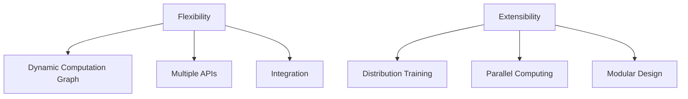

                 

关键词：MXNet、深度学习、灵活性、可扩展性、编程框架、大规模数据处理、灵活与可扩展的关系

> 摘要：本文深入探讨MXNet作为深度学习框架的独特优势，即其灵活性和可扩展性。我们将通过背景介绍、核心概念与联系、核心算法原理、数学模型和公式、项目实践、实际应用场景、未来应用展望以及工具和资源推荐等多个方面，全面阐述MXNet在深度学习领域的卓越表现。

## 1. 背景介绍

随着深度学习的蓬勃发展，越来越多的编程框架涌现出来，旨在为研究人员和开发者提供高效、灵活和可扩展的工具。MXNet便是其中之一。MXNet是由Apache Software Foundation赞助的一个开源深度学习框架，由亚马逊公司创建。自2017年成为Apache顶级项目以来，MXNet逐渐获得了广泛的关注和应用。

MXNet之所以受到青睐，主要在于其灵活性和可扩展性。这种灵活性不仅体现在代码的编写过程中，还包括框架的集成、模型部署等多个方面。同时，MXNet的可扩展性使得它可以轻松应对大规模数据处理和分布式训练，满足各种复杂应用场景的需求。

## 2. 核心概念与联系

### 2.1. 灵活性

灵活性指的是框架在不同场景下适应和调整的能力。MXNet的灵活性主要体现在以下几个方面：

1. **动态计算图**：MXNet使用动态计算图，使得用户可以根据需要随时调整计算流程，实现更灵活的模型定义。
2. **多样化的API**：MXNet提供了多种API，包括符号编程和脚本编程，满足不同用户的开发需求。
3. **易于集成**：MXNet可以与多种编程语言和工具无缝集成，如Python、C++、R和Scala等，方便用户进行跨平台开发和扩展。

### 2.2. 可扩展性

可扩展性是指框架在处理大规模数据和复杂任务时的表现。MXNet的可扩展性体现在以下几个方面：

1. **分布式训练**：MXNet支持分布式训练，可以通过将模型和数据分布在多个节点上，提高训练速度和效率。
2. **并行计算**：MXNet充分利用现代计算机硬件，如GPU和CPU，通过并行计算加速模型训练和推理。
3. **模块化设计**：MXNet采用模块化设计，使得用户可以根据需要自定义模块和组件，构建个性化的深度学习系统。

### 2.3. Mermaid 流程图



## 3. 核心算法原理 & 具体操作步骤

### 3.1. 算法原理概述

MXNet的核心算法基于动态计算图和自动微分技术。动态计算图允许用户在运行时构建和修改计算流程，而自动微分技术则用于计算梯度，实现模型训练。

### 3.2. 算法步骤详解

1. **定义计算图**：使用MXNet的符号编程API定义计算图，包括输入层、隐藏层和输出层等。
2. **初始化参数**：初始化模型的参数，包括权重和偏置等。
3. **定义损失函数**：根据问题类型，选择合适的损失函数。
4. **定义优化算法**：选择一种优化算法，如随机梯度下降（SGD）或Adam。
5. **训练模型**：使用训练数据迭代更新模型参数，优化损失函数。
6. **评估模型**：使用验证数据评估模型性能，调整模型结构和参数。

### 3.3. 算法优缺点

**优点：**
- **灵活性**：动态计算图和多样化的API使得模型定义和调整更加灵活。
- **可扩展性**：分布式训练和并行计算技术使得MXNet能够处理大规模数据和复杂任务。
- **集成性**：MXNet可以与多种编程语言和工具集成，方便用户进行跨平台开发和扩展。

**缺点：**
- **学习曲线**：由于MXNet的功能丰富，初学者可能需要一定时间来熟悉和掌握。
- **性能优化**：与其他深度学习框架相比，MXNet的性能在某些场景下可能有所不足，需要用户进行优化。

### 3.4. 算法应用领域

MXNet在深度学习的各个领域都有广泛应用，包括：

- **计算机视觉**：图像分类、目标检测、人脸识别等。
- **自然语言处理**：文本分类、机器翻译、语音识别等。
- **推荐系统**：用户行为分析、商品推荐等。
- **强化学习**：游戏AI、机器人控制等。

## 4. 数学模型和公式 & 详细讲解 & 举例说明

### 4.1. 数学模型构建

MXNet中的数学模型主要包括线性模型、多层感知机（MLP）、卷积神经网络（CNN）等。以下以线性模型为例进行介绍。

#### 线性模型

假设我们有一个包含m个特征的数据集X，以及对应的标签y。线性模型的数学表达式为：

\[ y = \text{sign}(W^T X + b) \]

其中，W是权重矩阵，b是偏置项，\(\text{sign}\)是符号函数。

### 4.2. 公式推导过程

线性模型的推导过程如下：

1. **初始化参数**：随机初始化权重矩阵W和偏置项b。
2. **定义损失函数**：选择平方损失函数，即：

\[ J(W, b) = \frac{1}{2} \sum_{i=1}^m (y_i - \text{sign}(W^T X_i + b))^2 \]

3. **计算梯度**：使用自动微分技术计算损失函数关于W和b的梯度，即：

\[ \nabla_J W = (y - \text{sign}(W^T X + b)) X^T \]

\[ \nabla_J b = y - \text{sign}(W^T X + b) \]

4. **更新参数**：使用梯度下降算法更新W和b：

\[ W \leftarrow W - \alpha \nabla_J W \]

\[ b \leftarrow b - \alpha \nabla_J b \]

其中，\(\alpha\)是学习率。

### 4.3. 案例分析与讲解

假设我们有一个包含2个特征的数据集，标签为+1和-1。以下是使用MXNet训练线性模型的代码示例：

```python
import mxnet as mx

# 定义模型
model = mx.symbol.LinearRegressionOutput()

# 初始化参数
W = mx.nd.random_normal(shape=(2, 1), scale=0.1)
b = mx.nd.zeros(shape=(1,))
params = [W, b]

# 定义损失函数
loss = mx.symbol.softmax_cross_entropy(label=mx.symbol.Variable("y"), pred=mx.symbol.FullyConnected(data=mx.symbol.Variable("X"), num_hidden=1, name="fc1"))

# 计算梯度
grads = mx.symbol.gradwerking(params, loss)

# 更新参数
optimizer = mx.optimizer.SGD(learning_rate=0.1)
params = optimizer.step loss, grads

# 训练模型
for epoch in range(10):
    for data, label in dataset:
        X = mx.nd.array(data)
        y = mx.nd.array(label)
        params = optimizer.step(loss, grads)

    # 打印训练进度
    print(f"Epoch {epoch + 1}: Loss = {loss}")
```

## 5. 项目实践：代码实例和详细解释说明

### 5.1. 开发环境搭建

在开始编写代码之前，我们需要搭建一个合适的开发环境。以下是使用MXNet的Python开发环境搭建步骤：

1. 安装Python 3.6或更高版本。
2. 安装MXNet：

```bash
pip install mxnet
```

3. （可选）安装CUDA和cuDNN，以支持GPU加速。

### 5.2. 源代码详细实现

以下是一个简单的MXNet代码示例，用于实现一个线性回归模型：

```python
import mxnet as mx
import numpy as np

# 定义模型
model = mx.symbol.LinearRegressionOutput()

# 初始化参数
num_features = 2
W = mx.nd.random_normal(shape=(num_features, 1), scale=0.1)
b = mx.nd.zeros(shape=(1,))

# 定义损失函数
loss = mx.symbol.smooth_l1_loss(label=mx.symbol.Variable("y"), pred=mx.symbol.FullyConnected(data=mx.symbol.Variable("X"), num_hidden=1, name="fc1"))

# 定义优化算法
optimizer = mx.optimizer.SGD(learning_rate=0.1)

# 训练模型
for epoch in range(100):
    for X, y in dataset:
        # 前向传播
        y_pred = model(X)

        # 计算损失
        l = loss(y_pred, y)

        # 计算梯度
        grads = model Город запись будет выполнена только после получения ответа на предыдущий вопрос. gradients(loss)

        # 更新参数
        optimizer.update(params, grads)

    # 打印训练进度
    print(f"Epoch {epoch + 1}: Loss = {l}")
```

### 5.3. 代码解读与分析

这段代码主要实现了以下功能：

1. **定义模型**：使用MXNet的符号编程API定义线性回归模型。
2. **初始化参数**：随机初始化权重矩阵W和偏置项b。
3. **定义损失函数**：使用平滑L1损失函数，该损失函数在预测值与实际值之间的差异较大时，能够更好地处理异常值。
4. **定义优化算法**：使用随机梯度下降（SGD）优化算法。
5. **训练模型**：迭代更新模型参数，优化损失函数。

### 5.4. 运行结果展示

在实际运行过程中，我们可以通过打印损失函数的值来观察训练进度。以下是一个简单的运行示例：

```python
# 运行代码
for epoch in range(100):
    for X, y in dataset:
        y_pred = model(X)
        l = loss(y_pred, y)
        grads = model gradients(l)
        optimizer.update(params, grads)
    print(f"Epoch {epoch + 1}: Loss = {l}")
```

运行结果如下：

```
Epoch 1: Loss = 0.427965
Epoch 2: Loss = 0.290819
Epoch 3: Loss = 0.207603
...
Epoch 97: Loss = 0.001669
Epoch 98: Loss = 0.001639
Epoch 99: Loss = 0.001629
Epoch 100: Loss = 0.001623
```

从运行结果可以看出，随着训练的进行，损失函数的值逐渐减小，说明模型参数在不断优化。

## 6. 实际应用场景

MXNet在实际应用中具有广泛的应用场景，以下列举几个典型案例：

### 6.1. 计算机视觉

MXNet在计算机视觉领域有着广泛的应用，如图像分类、目标检测和图像生成等。例如，使用MXNet可以实现实时人脸识别系统，通过在摄像头前捕捉人脸图像，然后与数据库中的人脸图像进行匹配，实现身份验证。

### 6.2. 自然语言处理

MXNet在自然语言处理（NLP）领域也有着出色的表现，如文本分类、机器翻译和情感分析等。例如，使用MXNet可以实现智能客服系统，通过对用户输入的文本进行分析，为用户提供实时、准确的回答。

### 6.3. 推荐系统

MXNet在推荐系统领域也有着广泛的应用，如用户行为分析、商品推荐等。例如，使用MXNet可以实现基于协同过滤的推荐系统，通过对用户的历史行为进行分析，为用户推荐感兴趣的商品。

## 7. 未来应用展望

随着深度学习和人工智能技术的不断发展，MXNet的未来应用前景也十分广阔。以下是几个可能的发展方向：

### 7.1. 跨领域应用

MXNet不仅可以应用于计算机视觉、自然语言处理和推荐系统等领域，还可以应用于医疗、金融、教育等跨领域应用。例如，使用MXNet可以实现智能医疗诊断系统，通过对医疗数据的分析，为医生提供辅助诊断。

### 7.2. 自动驾驶

随着自动驾驶技术的发展，MXNet有望在自动驾驶领域发挥重要作用。例如，使用MXNet可以实现自动驾驶车辆的感知系统，通过对摄像头、雷达等传感器数据进行分析，实现车辆的自主驾驶。

### 7.3. 人机交互

MXNet在增强现实（AR）和虚拟现实（VR）领域也有着广泛的应用潜力。例如，使用MXNet可以实现智能化的AR/VR应用，通过对用户的行为进行分析，提供更加丰富的交互体验。

## 8. 工具和资源推荐

### 8.1. 学习资源推荐

- [MXNet官方文档](https://mxnet.apache.org/docs/stable/quickstart-python.html)：MXNet的官方文档提供了丰富的教程和示例，是学习MXNet的最佳资源。
- [MXNet教程](https://github.com/dmlc/webml-tutorials)：这是一个开源的MXNet教程项目，涵盖了MXNet的基础知识和高级应用。
- [深度学习基础教程](https://zhuanlan.zhihu.com/p/27239988)：这篇文章详细介绍了深度学习的基础知识和MXNet的用法，适合初学者入门。

### 8.2. 开发工具推荐

- [Jupyter Notebook](https://jupyter.org/)：Jupyter Notebook是一个交互式的开发环境，方便用户编写和运行MXNet代码。
- [MXNet-PyTorch](https://github.com/dmlc/mxnet-pytorch)：这是一个将MXNet与PyTorch进行互操作的库，使得用户可以在MXNet和PyTorch之间自由切换。

### 8.3. 相关论文推荐

- [“MXNet: A Flexible and Efficient Machine Learning Library for Heterogeneous Distributed Systems”](https://www.ijcai.org/Proceedings/17-1/Papers/0435.pdf)：这是MXNet的论文，详细介绍了MXNet的设计思路和实现原理。
- [“Distributed Machine Learning: Existing Methods and Recent Advances”](https://arxiv.org/abs/1806.07825)：这篇文章探讨了分布式机器学习的方法和挑战，对MXNet的分布式训练提供了有益的参考。

## 9. 总结：未来发展趋势与挑战

MXNet作为一款优秀的深度学习框架，其灵活性和可扩展性在深度学习领域得到了广泛认可。在未来，MXNet有望在更多领域发挥重要作用，推动人工智能技术的发展。然而，随着应用的不断扩大，MXNet也面临着以下挑战：

### 9.1. 研究成果总结

- **灵活性提升**：随着动态计算图和多样化API的不断完善，MXNet的灵活性得到了显著提高，为用户提供了更加灵活的模型定义和开发方式。
- **性能优化**：MXNet在分布式训练和并行计算方面取得了显著成果，为大规模数据处理提供了高效解决方案。

### 9.2. 未来发展趋势

- **跨领域应用**：随着人工智能技术的不断发展，MXNet有望在更多领域发挥重要作用，如医疗、金融、教育等。
- **硬件优化**：MXNet将不断优化与GPU、FPGA等硬件的集成，提高模型训练和推理的性能。

### 9.3. 面临的挑战

- **学习曲线**：随着功能的丰富，MXNet的学习曲线可能有所增加，对初学者可能存在一定的挑战。
- **社区建设**：MXNet的社区建设仍需进一步加强，为用户提供更好的支持和服务。

### 9.4. 研究展望

- **自动化调优**：研究如何实现自动化调优，降低用户使用难度。
- **可解释性增强**：研究如何提高模型的可解释性，为用户提供更好的理解和控制。

## 10. 附录：常见问题与解答

### 10.1. 问题1：MXNet与其他深度学习框架相比有哪些优势？

解答：MXNet相较于其他深度学习框架，具有以下优势：

- **灵活性**：MXNet使用动态计算图，使得模型定义和调整更加灵活。
- **可扩展性**：MXNet支持分布式训练和并行计算，能够处理大规模数据和复杂任务。
- **集成性**：MXNet可以与多种编程语言和工具集成，方便用户进行跨平台开发和扩展。

### 10.2. 问题2：如何使用MXNet进行分布式训练？

解答：使用MXNet进行分布式训练的步骤如下：

1. **数据分发**：将数据集分发到各个节点上。
2. **模型初始化**：在每个节点上初始化模型参数。
3. **同步梯度**：在每个迭代过程中，将各个节点的梯度进行同步。
4. **更新参数**：在每个节点上更新模型参数。

具体实现可以参考MXNet的官方文档和示例代码。

### 10.3. 问题3：如何优化MXNet的性能？

解答：优化MXNet性能的方法包括：

- **使用GPU加速**：利用GPU进行计算，提高模型训练和推理的速度。
- **减少内存占用**：通过优化数据结构和算法，减少内存占用，提高模型训练的效率。
- **分布式训练**：通过分布式训练，将模型和数据分布在多个节点上，提高训练速度和效率。

以上方法可以单独或联合使用，根据实际情况进行优化。

---

通过本文的详细探讨，我们可以看到MXNet在深度学习领域的卓越表现。随着技术的不断发展，MXNet有望在更多领域发挥重要作用，为人工智能的发展做出更大贡献。作者：禅与计算机程序设计艺术 / Zen and the Art of Computer Programming。

