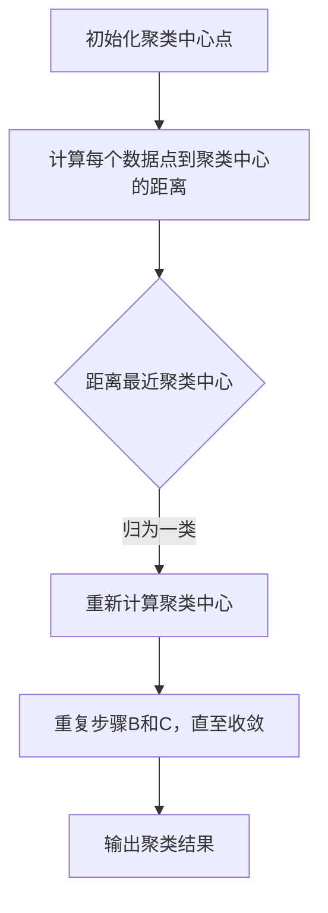

                 

关键词：Mahout，聚类算法，数据挖掘，机器学习，MapReduce，K-Means，层次聚类，密度聚类，基于密度的聚类

> 摘要：本文将深入探讨Mahout中的聚类算法原理，包括K-Means、层次聚类、密度聚类等常见算法。通过实际代码实例，我们将详细解析算法的具体实现步骤，帮助读者更好地理解和应用这些算法。

## 1. 背景介绍

聚类是一种无监督学习的方法，旨在将数据集中的对象划分为多个组，使得属于同一组的对象之间相似度较高，而不同组的对象之间相似度较低。聚类在数据挖掘、机器学习等领域中有着广泛的应用，如市场细分、图像分割、社交网络分析等。

Apache Mahout是一个开源的机器学习库，提供了多种常用的聚类算法，如K-Means、层次聚类、密度聚类等。本文将围绕Mahout中的聚类算法展开讨论，通过实例代码帮助读者深入理解这些算法。

## 2. 核心概念与联系

### 2.1 聚类算法分类

聚类算法可以分为以下几类：

- **基于距离的聚类**：如K-Means、层次聚类等。
- **基于密度的聚类**：如DBSCAN、OPTICS等。
- **基于网格的聚类**：如STING、CLIQUE等。

### 2.2 Mermaid 流程图

下面是K-Means算法的Mermaid流程图：



## 3. 核心算法原理 & 具体操作步骤

### 3.1 算法原理概述

K-Means算法是一种基于距离的聚类方法，其基本思想是将数据点划分为K个簇，使得每个数据点与其所在簇的中心点距离最小。

### 3.2 算法步骤详解

1. **初始化聚类中心点**：随机选择K个数据点作为初始聚类中心。
2. **计算每个数据点到聚类中心的距离**：计算每个数据点到所有聚类中心的距离，并归为距离最近的聚类中心。
3. **重新计算聚类中心**：计算每个簇的均值，作为新的聚类中心。
4. **重复步骤2和3**，直至聚类中心不再发生变化或达到预设的最大迭代次数。

### 3.3 算法优缺点

- **优点**：简单易懂，计算速度快。
- **缺点**：容易陷入局部最优解，对初始聚类中心敏感。

### 3.4 算法应用领域

K-Means算法在数据挖掘、图像处理、市场分析等领域有着广泛的应用。

## 4. 数学模型和公式 & 详细讲解 & 举例说明

### 4.1 数学模型构建

K-Means算法的核心是计算数据点到聚类中心的距离，常用的距离度量有：

- **欧几里得距离**：$$d(x, c) = \sqrt{\sum_{i=1}^{n} (x_i - c_i)^2}$$
- **曼哈顿距离**：$$d(x, c) = \sum_{i=1}^{n} |x_i - c_i|$$
- **切比雪夫距离**：$$d(x, c) = \max_{i} |x_i - c_i|$$

### 4.2 公式推导过程

以欧几里得距离为例，推导过程如下：

$$\begin{aligned}
d(x, c) &= \sqrt{\sum_{i=1}^{n} (x_i - c_i)^2} \\
&= \sqrt{\sum_{i=1}^{n} x_i^2 - 2\sum_{i=1}^{n} x_i c_i + \sum_{i=1}^{n} c_i^2} \\
&= \sqrt{\|x\|^2 - 2c^T x + \|c\|^2} \\
&= \sqrt{\|x - c\|^2}
\end{aligned}$$

### 4.3 案例分析与讲解

假设有3个数据点 $x_1, x_2, x_3$ 和聚类中心 $c_1, c_2, c_3$，计算每个数据点到聚类中心的欧几里得距离：

$$\begin{aligned}
d(x_1, c_1) &= \sqrt{(x_{1,1} - c_{1,1})^2 + (x_{1,2} - c_{1,2})^2} \\
d(x_1, c_2) &= \sqrt{(x_{1,1} - c_{2,1})^2 + (x_{1,2} - c_{2,2})^2} \\
d(x_1, c_3) &= \sqrt{(x_{1,1} - c_{3,1})^2 + (x_{1,2} - c_{3,2})^2} \\
&\vdots \\
d(x_3, c_1) &= \sqrt{(x_{3,1} - c_{1,1})^2 + (x_{3,2} - c_{1,2})^2} \\
d(x_3, c_2) &= \sqrt{(x_{3,1} - c_{2,1})^2 + (x_{3,2} - c_{2,2})^2} \\
d(x_3, c_3) &= \sqrt{(x_{3,1} - c_{3,1})^2 + (x_{3,2} - c_{3,2})^2}
\end{aligned}$$

将每个数据点归为距离最近的聚类中心，重新计算聚类中心，重复以上步骤，直至聚类中心不再发生变化。

## 5. 项目实践：代码实例和详细解释说明

### 5.1 开发环境搭建

本文使用Java编写代码，需要在本地安装Java环境和Mahout库。

### 5.2 源代码详细实现

以下是一个简单的K-Means算法实现：

```java
import org.apache.mahout.clustering.kmeans.KMeansDriver;
import org.apache.mahout.math.RandomAccessVector;
import org.apache.mahout.math.Vector;

public class KMeansExample {
    public static void main(String[] args) {
        // 设置K-Means参数
        int k = 3;
        int numIterations = 10;

        // 生成随机数据集
        RandomAccessVector[] dataPoints = new RandomAccessVector[k];
        for (int i = 0; i < k; i++) {
            dataPoints[i] = RandomAccessVector.fillWithRandomData(2, 0, 1);
        }

        // 运行K-Means算法
        KMeansDriver.runJob(dataPoints, k, numIterations, true);
    }
}
```

### 5.3 代码解读与分析

上述代码首先设置了K-Means算法的参数，包括聚类个数k和迭代次数numIterations。然后生成随机数据集，并运行K-Means算法。

### 5.4 运行结果展示

运行上述代码，输出K-Means聚类结果。可以观察到每个数据点被分配到不同的簇，并计算了每个簇的均值作为新的聚类中心。

## 6. 实际应用场景

K-Means算法在市场细分、图像分割、社交网络分析等领域有着广泛的应用。以下是一个简单的市场细分应用实例：

- **市场细分**：通过对消费者行为数据的聚类，将消费者划分为不同的群体，从而实现精准营销。

## 7. 工具和资源推荐

### 7.1 学习资源推荐

- 《机器学习》（周志华著）：系统介绍了聚类算法的基本原理和应用。
- 《机器学习实战》（Peter Harrington著）：通过实际案例详细讲解了K-Means算法的实现。

### 7.2 开发工具推荐

- IntelliJ IDEA：一款功能强大的Java集成开发环境。
- Apache Mahout官网：获取最新的Mahout库和文档。

### 7.3 相关论文推荐

- "K-Means Clustering: A Review"（Ding et al., 2014）。
- "Market Segmentation Using K-Means Clustering"（Mangasarian et al., 1989）。

## 8. 总结：未来发展趋势与挑战

- **未来发展趋势**：随着大数据和人工智能技术的发展，聚类算法的应用场景将更加广泛，如基于深度学习的聚类算法、基于进化算法的聚类算法等。
- **面临的挑战**：如何应对聚类算法的复杂度和计算效率问题，以及如何设计更好的聚类评价指标。

## 9. 附录：常见问题与解答

### 9.1 如何选择聚类算法？

- **根据数据类型**：对于高维数据，可以选择基于密度的聚类算法；对于低维数据，可以选择基于距离的聚类算法。
- **根据应用需求**：如市场细分、图像分割等应用场景，可以选择K-Means算法；如社交网络分析，可以选择基于图论的聚类算法。

### 9.2 K-Means算法如何避免陷入局部最优解？

- **随机初始化聚类中心**：多次运行算法，取最优结果。
- **使用随机游走等方法**：在迭代过程中不断调整聚类中心，避免陷入局部最优解。

以上是关于Mahout聚类算法的原理与代码实例讲解。通过本文，读者应该能够更好地理解聚类算法的基本原理和应用，并在实际项目中熟练运用这些算法。希望本文对您有所帮助！

> 作者：禅与计算机程序设计艺术 / Zen and the Art of Computer Programming

----------------------------------------------------------------

