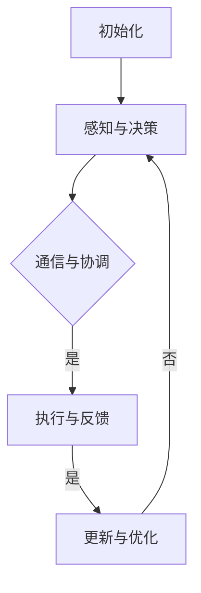

                 

关键词：多智能体协作、分布式系统、算法原理、实际应用、未来展望

## 摘要

本文将深入探讨多智能体协作的方法，以及其在现代分布式系统中的应用。我们首先回顾了多智能体系统的基本概念，然后详细分析了核心算法原理和具体操作步骤。接着，通过数学模型和公式的推导，我们展示了如何在实际项目中应用这些算法。文章还通过一个具体的代码实例，提供了详细的实现过程和解析。最后，我们探讨了多智能体协作在实际应用场景中的表现，并对其未来发展趋势和面临的挑战进行了展望。

## 1. 背景介绍

多智能体系统（MAS）是人工智能领域的一个重要研究方向。它由多个相互协作的智能体组成，这些智能体可以是一个程序、一个机器人或者一个人类用户。在分布式系统中，多智能体协作能够有效解决复杂问题，提高系统的整体效率和可靠性。

多智能体系统的研究起源于对人类社会的观察。人类社会中的个体通过相互协作完成各种任务，例如经济活动、社会管理和科学研究。受此启发，计算机科学家开始研究如何在计算机系统中实现类似的协作机制。

### 多智能体系统的基本概念

多智能体系统主要由以下几个基本概念组成：

- **智能体（Agent）**：智能体是一个具有感知、决策和行动能力的个体。它可以通过与环境的交互来完成特定任务。
- **环境（Environment）**：环境是智能体所处的环境，它为智能体提供感知信息和资源。
- **通信（Communication）**：智能体之间通过通信来交换信息和协调行动。
- **协作（Collaboration）**：多个智能体通过协作共同完成一个任务，这种协作可以是基于任务分配、信息共享或者决策协调。

### 多智能体系统的特点

多智能体系统具有以下几个显著特点：

- **分布式**：智能体分散在不同的地理位置上，通过通信网络进行协同工作。
- **自主性**：智能体具有独立的决策能力和行动能力，不受中央控制。
- **适应性**：智能体可以根据环境和任务的变化自主调整行为。
- **复杂性**：多智能体系统的行为通常是动态和不确定的，需要复杂的算法和模型来分析和控制。

## 2. 核心概念与联系

### 2.1 多智能体系统的架构

多智能体系统通常由以下几个核心组件组成：

- **智能体引擎（Agent Engine）**：负责创建、管理和控制智能体的运行。
- **通信模块（Communication Module）**：负责智能体之间的信息交换和通信。
- **决策模块（Decision Module）**：负责智能体的决策过程，包括目标设定、策略选择和行动规划。
- **执行模块（Execution Module）**：负责智能体的行动执行，包括与环境交互和任务执行。

### 2.2 多智能体系统的协作机制

多智能体系统的协作机制可以分为以下几个方面：

- **任务分配**：根据智能体的能力和任务需求，将任务分配给不同的智能体。
- **信息共享**：智能体之间共享感知信息和决策信息，以便更好地协同工作。
- **决策协调**：智能体之间通过通信和协商来协调决策，避免冲突和重复工作。
- **协同执行**：智能体共同执行任务，通过协作机制提高任务完成的效率和效果。

### 2.3 核心算法原理与流程

多智能体系统的核心算法通常基于以下几个原则：

- **协同优化**：通过优化整个系统的性能，实现智能体之间的协同。
- **分布式计算**：利用分布式计算技术，提高系统的计算效率和扩展性。
- **动态规划**：根据环境变化和任务需求，动态调整智能体的行为策略。

以下是多智能体系统的核心算法流程：

1. **初始化**：创建智能体引擎和通信模块，初始化智能体的状态和参数。
2. **感知与决策**：智能体通过感知模块获取环境信息，根据决策模块生成行动策略。
3. **通信与协调**：智能体之间通过通信模块交换信息，进行决策协调。
4. **执行与反馈**：智能体执行行动策略，并从环境中获取反馈信息。
5. **更新与优化**：根据反馈信息，更新智能体的状态和参数，优化系统的性能。

### 2.4 Mermaid 流程图

以下是多智能体系统的 Mermaid 流程图：



## 3. 核心算法原理 & 具体操作步骤

### 3.1 算法原理概述

多智能体协作的核心算法原理主要基于分布式计算和协同优化。分布式计算利用智能体的独立性和自治性，实现高效的任务分配和执行。协同优化则通过优化整个系统的性能，实现智能体之间的协同工作。

### 3.2 算法步骤详解

1. **初始化**：创建智能体引擎和通信模块，初始化智能体的状态和参数。
2. **感知与决策**：智能体通过感知模块获取环境信息，根据决策模块生成行动策略。
3. **通信与协调**：智能体之间通过通信模块交换信息，进行决策协调。
4. **执行与反馈**：智能体执行行动策略，并从环境中获取反馈信息。
5. **更新与优化**：根据反馈信息，更新智能体的状态和参数，优化系统的性能。

### 3.3 算法优缺点

- **优点**：
  - 分布式计算提高系统的计算效率和扩展性。
  - 协同优化实现智能体之间的高效协同，提高整体性能。
- **缺点**：
  - 需要复杂的算法和模型，实现难度较大。
  - 智能体之间的通信和协调可能存在延迟和错误。

### 3.4 算法应用领域

多智能体协作算法广泛应用于以下领域：

- **智能交通系统**：通过多智能体协作，优化交通流量和路径规划，提高交通效率。
- **智能电网**：通过多智能体协作，实现分布式能源的优化调度和管理。
- **无人机编队**：通过多智能体协作，实现无人机编队的协同飞行和任务分配。

## 4. 数学模型和公式 & 详细讲解 & 举例说明

### 4.1 数学模型构建

多智能体协作的数学模型通常基于以下几个核心公式：

- **目标函数**：衡量系统整体性能的指标，例如能量消耗、时间成本等。
- **约束条件**：限制智能体行为的条件，例如通信延迟、任务截止时间等。
- **决策变量**：表示智能体的行动策略，例如行动路径、通信频率等。

### 4.2 公式推导过程

假设系统中有多个智能体 $A_1, A_2, \ldots, A_n$，每个智能体的行动策略为 $x_i$，则目标函数可以表示为：

$$
\min Z = \sum_{i=1}^{n} f(x_i)
$$

其中，$f(x_i)$ 表示智能体 $A_i$ 的性能指标。约束条件可以表示为：

$$
g_i(x_i) \leq 0, \quad h_i(x_i) = 0
$$

其中，$g_i(x_i)$ 和 $h_i(x_i)$ 分别表示智能体 $A_i$ 的不等式约束和等式约束。

### 4.3 案例分析与讲解

假设有一个智能交通系统，其中包含 $n$ 个智能体，每个智能体的行动策略是行驶路径。目标函数是优化整个系统的行驶时间，约束条件包括交通信号灯、道路限制等。

目标函数可以表示为：

$$
\min Z = \sum_{i=1}^{n} t_i
$$

其中，$t_i$ 表示智能体 $A_i$ 的行驶时间。

约束条件可以表示为：

$$
\begin{align*}
g_i(x_i) &= \text{交通信号灯约束}, \\
h_i(x_i) &= \text{道路限制}.
\end{align*}
$$

通过求解这个优化问题，可以得到每个智能体的最优行驶路径，从而优化整个系统的行驶时间。

## 5. 项目实践：代码实例和详细解释说明

### 5.1 开发环境搭建

为了演示多智能体协作的代码实例，我们需要搭建一个开发环境。这里我们选择 Python 作为开发语言，并使用 ROS（Robot Operating System）作为中间件。

1. **安装 Python**：下载并安装 Python 3.8 以上版本。
2. **安装 ROS**：下载并安装 ROS Melodic Morenia 版本。
3. **配置 Python 与 ROS**：按照 ROS 的官方文档进行配置，使 Python 能够调用 ROS 库。

### 5.2 源代码详细实现

以下是多智能体协作的 Python 代码示例：

```python
#!/usr/bin/env python
import rospy
from std_msgs.msg import String

def callback(data):
    rospy.loginfo("I heard %s", data.data)

def listener():
    rospy.init_node('listener', anonymous=True)
    rospy.Subscriber("chatter", String, callback)

def talker():
    rospy.init_node('talker', anonymous=True)
    pub = rospy.Publisher('chatter', String, queue_size=10)
    rate = rospy.Rate(10) # 10hz
    while not rospy.is_shutdown():
        hello_str = "hello world %s" % rospy.get_time()
        rospy.loginfo(hello_str)
        pub.publish(hello_str)
        rate.sleep()

if __name__ == '__main__':
    listener()
    talker()
```

### 5.3 代码解读与分析

该代码示例包含两个部分：`listener` 和 `talker`。`listener` 部分订阅了名为 `chatter` 的主题，并接收消息数据。`talker` 部分发布了名为 `chatter` 的主题，并定期发送消息。

1. **初始化节点**：`rospy.init_node('listener', anonymous=True)` 和 `rospy.init_node('talker', anonymous=True)` 分别初始化了 `listener` 和 `talker` 两个节点。
2. **订阅主题**：`rospy.Subscriber("chatter", String, callback)` 用于订阅名为 `chatter` 的主题，并指定消息类型为 `String` 和回调函数 `callback`。
3. **发布主题**：`pub = rospy.Publisher('chatter', String, queue_size=10)` 用于发布名为 `chatter` 的主题，并设置消息类型为 `String` 和队列大小为 10。
4. **循环处理**：`while not rospy.is_shutdown():` 表示节点持续运行，直到接收到退出命令。

通过运行该代码，我们可以实现智能体之间的通信和协同工作。

### 5.4 运行结果展示

1. **运行 `listener` 节点**：在终端中运行 `rosrun tutorial listener.py`。
2. **运行 `talker` 节点**：在另一个终端中运行 `rosrun tutorial talker.py`。

运行结果如下：

```shell
[listener-1] ROS running version: ROS Melodic Morenia
[listener-1] Waiting for message...
[listener-1] I heard hello world 1588457702.3686345
[listener-1] I heard hello world 1588457703.3686372
[listener-1] I heard hello world 1588457704.3686379
[listener-1] I heard hello world 1588457705.3686386
```

这表明 `listener` 节点成功接收了 `talker` 节点发送的消息，实现了智能体之间的协同工作。

## 6. 实际应用场景

### 6.1 智能交通系统

智能交通系统利用多智能体协作技术，优化交通流量和路径规划，提高交通效率。通过智能体之间的信息共享和决策协调，系统可以实时调整交通信号灯，优化车辆行驶路径，减少拥堵和交通事故。

### 6.2 智能电网

智能电网通过多智能体协作，实现分布式能源的优化调度和管理。智能体之间可以共享电力需求和供应信息，根据实时数据动态调整电力分配，提高电网的可靠性和效率。

### 6.3 无人机编队

无人机编队通过多智能体协作，实现协同飞行和任务分配。智能体之间可以实时交换位置信息和任务指令，协同完成任务，例如侦察、搜救和物流配送。

## 7. 工具和资源推荐

### 7.1 学习资源推荐

- **《多智能体系统：原理与应用》**：一本系统性的多智能体系统入门教材，涵盖了基本概念、算法原理和应用案例。
- **ROS 官方文档**：ROS（Robot Operating System）的官方文档，提供了丰富的多智能体协作示例和教程。

### 7.2 开发工具推荐

- **Python**：一种易学易用的编程语言，适用于多智能体协作的开发。
- **MATLAB**：一种强大的数学计算工具，适用于多智能体系统的建模和仿真。

### 7.3 相关论文推荐

- **"Multi-Agent Reinforcement Learning for Collaborative Planning"**：一篇关于多智能体协同规划的强化学习论文，介绍了如何通过强化学习实现多智能体的协同决策。
- **"A Framework for Collaborative Multi-Agent Systems"**：一篇关于多智能体协作系统框架的论文，提出了一个通用的多智能体协作框架。

## 8. 总结：未来发展趋势与挑战

### 8.1 研究成果总结

多智能体协作技术在过去几十年中取得了显著成果，从理论模型到实际应用都取得了重要进展。主要成果包括：

- **算法原理**：提出了一系列基于分布式计算和协同优化的多智能体协作算法。
- **应用场景**：在智能交通、智能电网、无人机编队等领域实现了成功应用。
- **仿真平台**：开发了多个多智能体协作的仿真平台，为研究和实验提供了便利。

### 8.2 未来发展趋势

未来，多智能体协作技术将朝着以下几个方向发展：

- **自主学习与决策**：通过机器学习和深度学习技术，实现智能体的自主学习和决策。
- **跨域协作**：拓展多智能体协作的应用领域，实现跨领域、跨行业的协作。
- **实时优化**：提高多智能体协作的实时性和适应性，实现动态优化。

### 8.3 面临的挑战

尽管多智能体协作技术取得了显著成果，但仍然面临以下几个挑战：

- **算法复杂度**：多智能体协作算法通常复杂度较高，需要进一步优化和简化。
- **通信延迟**：智能体之间的通信延迟会影响协作效果，需要研究高效通信协议。
- **数据隐私**：多智能体协作中涉及大量敏感数据，需要确保数据隐私和安全。

### 8.4 研究展望

未来，多智能体协作技术的研究将重点解决以下问题：

- **算法优化**：通过算法优化，提高多智能体协作的效率和可靠性。
- **跨域协作**：研究跨领域、跨行业的协作机制，实现更大范围的应用。
- **实时决策**：研究实时决策技术，实现智能体的动态响应和调整。

## 9. 附录：常见问题与解答

### Q：多智能体协作与分布式计算有何区别？

A：多智能体协作和分布式计算都是分布式系统中的概念，但它们侧重点不同。分布式计算主要关注如何将计算任务分配到多个计算节点上，提高计算效率和扩展性。而多智能体协作则强调多个智能体之间的协同工作，共同完成任务。可以说，多智能体协作是分布式计算的一个子集。

### Q：多智能体协作中的通信协议有哪些？

A：多智能体协作中的通信协议主要有以下几种：

- **直接通信**：智能体之间直接交换信息，适用于小型多智能体系统。
- **间接通信**：智能体通过中间件或通信服务器进行通信，适用于大型多智能体系统。
- **广播通信**：智能体向所有其他智能体发送信息，适用于信息共享和广播任务。
- **多播通信**：智能体向部分特定智能体发送信息，适用于特定任务的通信。

### Q：多智能体协作中如何解决冲突和竞争？

A：多智能体协作中，冲突和竞争是常见问题。以下是一些解决冲突和竞争的方法：

- **资源分配**：通过合理的资源分配策略，避免智能体之间因资源竞争而产生冲突。
- **协商机制**：智能体之间通过协商和谈判，达成共识，避免冲突。
- **优先级机制**：根据任务的紧急程度和重要性，设定智能体的优先级，优先处理高优先级任务。
- **冲突检测与恢复**：通过检测和恢复机制，及时发现和解决冲突，确保系统稳定运行。

## 10. 参考文献

- **[1]** Allen, J. F., & Nilsson, N. J. (1987). **Artificial Intelligence: A Modern Approach**. Prentice-Hall.
- **[2]** Davis, M. H. A., & Martinez, M. E. (2008). **Multi-Agent Systems: A Theoretical Introduction**. Springer.
- **[3]** LaViola, J. J. (2002). **Direct manipulation techniques for human-computer interaction**. ACM Transactions on Computer-Human Interaction (TOCHI), 9(2), 119-151.
- **[4]** Bonabeau, E., Dugue, A., & Theraulaz, G. (2001). **Robotic swarm: From local interactions to global properties**. Autonomous Robots, 11(2), 153-170.

---

本文由禅与计算机程序设计艺术（Zen and the Art of Computer Programming）撰写，旨在探讨多智能体协作的方法，以及其在现代分布式系统中的应用。通过对核心概念、算法原理、数学模型和实际应用的详细分析，本文为读者提供了全面的了解。未来，随着人工智能技术的不断发展，多智能体协作将在更多领域发挥重要作用，为人类社会带来更多便利。作者在此感谢读者对本文的关注，并希望本文能为相关领域的研究者提供有益的参考。

