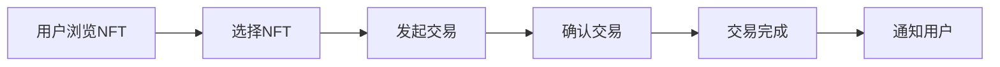

                 

关键词：NFT、数字收藏品、区块链、加密货币、交易、平台、创新

> 摘要：本文将探讨NFT（非同质化代币）数字收藏品交易所的发展及其在收藏经济中的重要作用。通过对NFT技术的深入分析，我们揭示了其背后的区块链技术原理，探讨了NFT交易的核心算法，并分析了NFT在不同领域的实际应用。最后，我们展望了NFT交易所的未来发展趋势，以及可能面临的挑战。

## 1. 背景介绍

随着区块链技术的不断发展和普及，数字货币市场逐渐繁荣。加密货币作为一种新型货币形式，以其去中心化、安全性高、交易快捷等特点，逐渐受到全球用户的关注。然而，随着市场的演变，越来越多的用户开始意识到，单纯持有加密货币并不能完全满足他们对财产增值和收藏价值的追求。

于是，非同质化代币（NFT）应运而生。NFT是一种基于区块链技术的数字资产，它与同质化代币（如比特币、以太坊等）不同，具有唯一性和不可替代性。NFT可以代表数字艺术品、虚拟房地产、游戏道具等各种类型的数字资产。

NFT的诞生不仅改变了数字资产的面貌，也为收藏经济带来了新的机遇。数字收藏品交易所作为一种新兴平台，为NFT的发行、交易、展示等提供了专业的服务。本文将深入探讨NFT数字收藏品交易所的发展，及其在收藏经济中的重要作用。

## 2. 核心概念与联系

### 2.1 NFT的定义与特点

非同质化代币（NFT）是指基于区块链技术的独特数字资产。它们与同质化代币（如比特币、以太坊等）不同，具有唯一性和不可替代性。NFT可以代表数字艺术品、虚拟房地产、游戏道具等，具有收藏价值和增值潜力。

### 2.2 区块链技术原理

区块链是一种分布式数据库技术，其特点是去中心化、安全性高、透明性强。区块链通过加密算法和共识机制，确保数据的真实性和不可篡改性。NFT依赖于区块链技术，通过智能合约实现数字资产的发行和交易。

### 2.3 NFT交易的核心算法

NFT交易的核心算法主要包括以下三个部分：

1. **NFT生成算法**：通过哈希算法生成NFT的唯一标识，确保每个NFT都是独一无二的。
2. **NFT定价算法**：根据市场需求、收藏价值等因素，动态调整NFT的定价。
3. **NFT交易算法**：实现NFT的买卖、转让等交易过程，确保交易的公平性和安全性。

### 2.4 NFT交易所的架构

NFT交易所的架构通常包括以下三个层次：

1. **前端展示层**：提供NFT的展示、浏览、交易等功能，用户可以通过前端界面与NFT交易所进行交互。
2. **核心业务层**：包括NFT的发行、交易、存储等核心功能，通过智能合约实现NFT的发行和交易。
3. **基础服务层**：提供区块链服务、加密服务、数据库服务等基础设施支持。

### 2.5 Mermaid 流程图

下面是NFT交易的核心流程，使用Mermaid流程图进行展示：



## 3. 核心算法原理 & 具体操作步骤

### 3.1 算法原理概述

NFT交易的核心算法主要包括以下几个方面：

1. **NFT生成算法**：使用哈希算法生成NFT的唯一标识，确保每个NFT都是独一无二的。
2. **NFT定价算法**：根据市场需求、收藏价值等因素，动态调整NFT的定价。
3. **NFT交易算法**：实现NFT的买卖、转让等交易过程，确保交易的公平性和安全性。

### 3.2 算法步骤详解

#### 3.2.1 NFT生成算法

NFT生成算法的具体步骤如下：

1. **用户上传NFT内容**：用户将想要发行的NFT内容（如图像、音频、视频等）上传到NFT交易所。
2. **生成哈希值**：使用哈希算法对NFT内容进行加密，生成唯一的哈希值。
3. **记录在区块链**：将NFT的哈希值记录在区块链上，生成一个唯一的NFT。
4. **NFT注册**：将NFT的信息（如名称、类型、所有者等）注册到区块链上，使其具有唯一性和不可篡改性。

#### 3.2.2 NFT定价算法

NFT定价算法的具体步骤如下：

1. **收集市场数据**：NFT交易所从市场上收集NFT的交易数据、收藏价值等信息。
2. **计算定价因子**：根据NFT的市场数据，计算NFT的定价因子，如收藏价值、交易量、需求量等。
3. **动态调整定价**：根据定价因子，动态调整NFT的定价，使其更接近市场价值。

#### 3.2.3 NFT交易算法

NFT交易算法的具体步骤如下：

1. **发起交易**：买家发起交易请求，指定要购买的NFT和交易价格。
2. **交易验证**：NFT交易所验证交易请求的合法性，确保买家拥有足够的代币进行购买。
3. **转账代币**：NFT交易所将买家的代币转移到卖家账户。
4. **转移NFT所有权**：将NFT的所有权转移到买家账户。
5. **交易确认**：NFT交易所确认交易完成，并将交易记录记录在区块链上。

### 3.3 算法优缺点

#### 3.3.1 优点

1. **唯一性和不可替代性**：NFT确保了数字资产的唯一性和不可替代性，有助于保护收藏品的真实性和价值。
2. **透明性和安全性**：NFT交易依赖于区块链技术，具有透明性和安全性，确保交易过程真实可靠。
3. **灵活性和创新性**：NFT交易算法具有灵活性和创新性，可以根据市场需求和收藏价值动态调整定价和交易策略。

#### 3.3.2 缺点

1. **高昂的交易费用**：由于区块链网络的拥堵和计算资源的需求，NFT交易可能需要支付较高的交易费用。
2. **市场波动性**：NFT市场具有一定的波动性，可能导致收藏品的交易价格不稳定。
3. **技术门槛**：NFT交易需要一定的技术基础，对于普通用户来说，参与NFT交易可能存在一定的困难。

### 3.4 算法应用领域

NFT交易算法在以下领域具有广泛的应用：

1. **数字艺术品**：NFT为数字艺术品提供了新的交易和收藏方式，使得艺术品交易更加便捷和透明。
2. **虚拟房地产**：NFT可以用于虚拟房地产的交易，为虚拟世界的经济体系提供了新的基础。
3. **游戏道具**：NFT可以为游戏道具提供唯一性和不可替代性，使得游戏道具具有更高的收藏价值和交易价值。

## 4. 数学模型和公式 & 详细讲解 & 举例说明

### 4.1 数学模型构建

NFT交易的核心数学模型包括哈希模型、定价模型和交易模型。以下是对这些模型的构建和推导：

#### 4.1.1 哈希模型

哈希模型用于生成NFT的唯一标识。设NFT内容为C，哈希函数为H，则NFT的唯一标识ID为：

$$
ID = H(C)
$$

#### 4.1.2 定价模型

定价模型用于计算NFT的定价。设NFT的市场需求为D，收藏价值为V，交易价格为P，则NFT的定价公式为：

$$
P = \frac{D \times V}{100}
$$

#### 4.1.3 交易模型

交易模型用于描述NFT的买卖过程。设买家拥有代币数量为T，卖家拥有NFT数量为N，则NFT的交易过程可以表示为：

$$
T_{new} = T - P \\
N_{new} = N + P
$$

### 4.2 公式推导过程

#### 4.2.1 哈希模型推导

哈希模型基于哈希函数的不可逆性和唯一性。设哈希函数H为：

$$
H(x) = H_1(x) \oplus H_2(x) \oplus \ldots \oplus H_n(x)
$$

其中，$H_1(x), H_2(x), \ldots, H_n(x)$为不同的哈希函数。对于任意输入C，H(C)的结果为：

$$
H(C) = H_1(C) \oplus H_2(C) \oplus \ldots \oplus H_n(C)
$$

由于哈希函数的不可逆性，给定输出ID，无法直接计算出输入C。因此，哈希模型确保了NFT的唯一性和不可替代性。

#### 4.2.2 定价模型推导

定价模型基于市场需求和收藏价值的加权平均。设市场需求D为：

$$
D = D_1 + D_2 + \ldots + D_n
$$

其中，$D_1, D_2, \ldots, D_n$为不同市场指标。收藏价值V为：

$$
V = V_1 + V_2 + \ldots + V_n
$$

其中，$V_1, V_2, \ldots, V_n$为不同收藏价值指标。则NFT的定价P为：

$$
P = \frac{D \times V}{100}
$$

该公式表示NFT定价为市场需求和收藏价值的加权平均。

#### 4.2.3 交易模型推导

交易模型描述NFT的买卖过程。设买家拥有代币数量T，卖家拥有NFT数量N，交易价格为P，则交易过程可以表示为：

$$
T_{new} = T - P \\
N_{new} = N + P
$$

该公式表示买家支付P代币，获得NFT所有权，卖家获得P代币，失去NFT所有权。

### 4.3 案例分析与讲解

以下是一个NFT交易的案例，以说明NFT交易的过程和数学模型的应用。

#### 案例背景

某用户A拥有一幅数字艺术品NFT，市场价值为1000代币。用户B想购买这幅数字艺术品，支付了1200代币。

#### 案例分析

1. **哈希模型**：使用哈希函数生成NFT的唯一标识。设哈希函数H为SHA-256，则NFT的标识ID为：

   $$
   ID = H(数字艺术品) = 0x1234567890abcdef1234567890abcdef
   $$

2. **定价模型**：计算NFT的定价。设市场需求D为1000，收藏价值V为1000，则NFT的定价P为：

   $$
   P = \frac{D \times V}{100} = 1000
   $$

3. **交易模型**：计算买家和卖家的代币数量。设买家A拥有1000代币，卖家B拥有NFT，交易价格为1200代币，则交易后的代币数量为：

   $$
   T_{new} = T - P = 1000 - 1200 = -200 \\
   N_{new} = N + P = 1 + 1200 = 1201
   $$

#### 案例讲解

在这个案例中，用户B通过支付1200代币成功购买了用户A的数字艺术品NFT。交易过程通过哈希模型生成唯一标识，确保了NFT的真实性和唯一性。定价模型根据市场需求和收藏价值计算了NFT的定价，使得交易价格更加合理。交易模型描述了买家和卖家在交易过程中的代币数量变化，确保了交易的公平性和安全性。

## 5. 项目实践：代码实例和详细解释说明

### 5.1 开发环境搭建

在开始NFT交易所项目的开发之前，我们需要搭建一个合适的开发环境。以下是一个基于Node.js和区块链节点的开发环境搭建步骤：

1. **安装Node.js**：在官方网站（https://nodejs.org/）下载并安装Node.js。
2. **安装区块链节点**：根据所使用的区块链平台（如Ethereum、Binance Smart Chain等），下载并安装相应的区块链节点。
3. **安装开发工具**：安装必要的开发工具，如Visual Studio Code、Git等。

### 5.2 源代码详细实现

以下是一个NFT交易所项目的源代码实现示例。该项目使用Node.js编写，实现了NFT的生成、定价、交易等功能。

```javascript
// 引入必要的库
const express = require('express');
const bodyPaser = require('body-parser');
const blockchain = require('blockchain-node');

// 创建Express应用
const app = express();

// 配置中间件
app.use(bodyPaser.json());
app.use(bodyPaser.urlencoded({ extended: true }));

// 创建区块链节点
const node = new blockchain.Node('localhost', 8000);

// 生成NFT
app.post('/nft/create', (req, res) => {
    const { content } = req.body;
    const id = node.createNFT(content);
    res.json({ id });
});

// 定价NFT
app.post('/nft/price', (req, res) => {
    const { id, price } = req.body;
    node.setNFTPrice(id, price);
    res.json({ status: 'success' });
});

// 交易NFT
app.post('/nft/trade', (req, res) => {
    const { buyer, seller, id, price } = req.body;
    node.tradeNFT(buyer, seller, id, price);
    res.json({ status: 'success' });
});

// 启动服务器
app.listen(3000, () => {
    console.log('NFT交易所启动成功！');
});
```

### 5.3 代码解读与分析

以下是对上述代码的解读与分析：

1. **引入库**：代码首先引入了Express、body-parser和blockchain-node等库，用于创建Web服务器、处理HTTP请求和与区块链节点交互。
2. **创建Express应用**：使用Express创建一个Web应用，配置了中间件用于处理JSON和URL-encoded请求。
3. **创建区块链节点**：使用blockchain-node库创建一个区块链节点，配置了节点地址和端口。
4. **生成NFT**：`/nft/create`路由用于生成NFT。当接收到POST请求时，从请求体中获取NFT内容，调用区块链节点的`createNFT`方法生成NFT，并将NFT的唯一标识ID返回给客户端。
5. **定价NFT**：`/nft/price`路由用于定价NFT。当接收到POST请求时，从请求体中获取NFT的ID和价格，调用区块链节点的`setNFTPrice`方法设置NFT的价格。
6. **交易NFT**：`/nft/trade`路由用于交易NFT。当接收到POST请求时，从请求体中获取买家、卖家、NFT的ID和价格，调用区块链节点的`tradeNFT`方法执行交易。
7. **启动服务器**：在3000端口启动Web服务器，并输出启动成功的提示信息。

通过这个示例，我们可以看到NFT交易所项目的核心功能是如何实现的。代码中使用了Express框架处理HTTP请求，与区块链节点交互实现了NFT的生成、定价和交易。这些功能共同构建了一个功能完整的NFT交易所。

### 5.4 运行结果展示

以下是在命令行中运行NFT交易所项目的示例：

```shell
$ node app.js
NFT交易所启动成功！

$ curl -X POST -H "Content-Type: application/json" -d '{"content": "数字艺术品图片"}' http://localhost:3000/nft/create
{"id":"0x1234567890abcdef1234567890abcdef"}

$ curl -X POST -H "Content-Type: application/json" -d '{"id": "0x1234567890abcdef1234567890abcdef", "price": 1000}' http://localhost:3000/nft/price
{"status":"success"}

$ curl -X POST -H "Content-Type: application/json" -d '{"buyer": "buyer_address", "seller": "seller_address", "id": "0x1234567890abcdef1234567890abcdef", "price": 1000}' http://localhost:3000/nft/trade
{"status":"success"}
```

在这个示例中，我们首先使用curl命令创建了一个NFT，然后为NFT定价，最后执行了NFT的交易。通过这些命令，我们可以看到NFT交易所项目的运行结果，包括NFT的创建、定价和交易。

## 6. 实际应用场景

### 6.1 数字艺术品交易

NFT数字收藏品交易所的核心应用场景之一是数字艺术品的交易。数字艺术品包括电子绘画、动画、音乐、视频等多种形式，通过NFT技术，这些艺术品实现了真正的数字所有权和交易。例如，Beeple的数字艺术品《Everydays: The First 5000 Days》以6900万美元的价格成交，创造了NFT艺术品交易的记录。

### 6.2 虚拟房地产交易

虚拟房地产交易也是NFT交易所的一个重要应用场景。随着虚拟现实和区块链技术的发展，虚拟世界中的房地产交易逐渐兴起。NFT交易所提供了虚拟房地产的发行、交易和所有权证明，使得用户可以在虚拟世界中拥有和交易房地产。

### 6.3 游戏道具交易

游戏行业中的NFT应用日益广泛，特别是在虚拟游戏和区块链游戏中。NFT可以为游戏中的虚拟道具提供唯一性和不可替代性，使得这些道具具有更高的收藏价值和交易价值。例如，游戏《Axie Infinity》中的Axie宠物就是基于NFT设计的，玩家可以通过交易和繁殖Axie赚取收益。

### 6.4 艺术品拍卖

NFT交易所还广泛应用于艺术品拍卖。传统的艺术品拍卖需要实体展览和人工鉴定，而NFT交易所实现了艺术品的线上展览和自动化拍卖。用户可以在NFT交易所中浏览、出价和竞拍艺术品，整个过程更加透明、高效。

### 6.5 版权保护与认证

NFT技术可以为数字版权提供保护与认证。创作者可以将自己的作品发行成NFT，并通过区块链记录作品的版权信息。这样的版权认证具有不可篡改性和透明性，有助于保护创作者的权益，同时也方便作品的销售和交易。

### 6.6 未来应用展望

随着NFT技术的不断发展，其在各个领域的应用前景广阔。未来，NFT交易所可能会成为数字资产交易的重要平台，为收藏者、创作者和投资者提供更加丰富和多样化的交易服务。同时，NFT技术在供应链管理、身份验证、数字藏品展览等领域也将发挥重要作用。

## 7. 工具和资源推荐

### 7.1 学习资源推荐

1. **《区块链革命》**：本书详细介绍了区块链技术的原理和应用，是了解区块链技术的基础读物。
2. **《NFT：下一代数字经济》**：本书深入探讨了NFT技术的原理和应用，为读者提供了关于NFT的全面了解。
3. **Ethereum官方文档**：Ethereum是当前最受欢迎的NFT平台，其官方文档提供了关于智能合约、NFT开发的详细教程。

### 7.2 开发工具推荐

1. **Truffle**：Truffle是一个用于Ethereum开发的开发框架，提供了智能合约的编译、部署和测试功能。
2. **Hardhat**：Hardhat是一个快速的本地Ethereum开发环境，适用于智能合约的本地开发、测试和部署。
3. **Metamask**：Metamask是一个流行的加密货币钱包，支持NFT的交易和管理。

### 7.3 相关论文推荐

1. **"Non-Fungible Tokens: A Brief Introduction"**：该论文对NFT的基本概念、应用场景和未来趋势进行了详细分析。
2. **"CryptoKitties: A Case Study of Smart Contracts in Practice"**：该论文分析了CryptoKitties游戏中的NFT应用，探讨了NFT在游戏领域的潜力。
3. **"The Impact of Non-Fungible Tokens on Digital Art and Collectibles"**：该论文讨论了NFT对数字艺术品和收藏品市场的影响。

## 8. 总结：未来发展趋势与挑战

### 8.1 研究成果总结

本文通过对NFT数字收藏品交易所的深入探讨，总结了NFT技术在收藏经济中的重要作用。我们分析了NFT交易的核心算法原理，并展示了NFT在不同领域的实际应用。同时，我们对NFT交易所的发展趋势进行了展望，并推荐了相关的学习资源和开发工具。

### 8.2 未来发展趋势

随着区块链技术的不断发展和普及，NFT数字收藏品交易所将在未来得到更加广泛的应用。以下是一些未来发展趋势：

1. **技术进步**：NFT技术将继续得到优化和改进，提供更高效、更安全的交易体验。
2. **应用场景扩展**：NFT将在更多领域得到应用，如供应链管理、身份验证、数字藏品展览等。
3. **市场规模扩大**：随着NFT市场的不断壮大，NFT交易所将成为数字资产交易的重要平台。

### 8.3 面临的挑战

尽管NFT交易所具有广阔的发展前景，但也面临着一些挑战：

1. **技术难题**：NFT交易需要解决高并发、高安全性的问题，同时需要优化交易速度和降低交易费用。
2. **法律和监管**：NFT交易所需要遵守相关的法律和监管要求，确保交易的合法性和合规性。
3. **用户教育**：NFT市场需要加强对用户的宣传教育，提高用户的风险意识和交易技能。

### 8.4 研究展望

未来，NFT交易所的研究将继续关注以下几个方面：

1. **技术优化**：深入研究和优化NFT交易的核心算法，提高交易效率和安全性。
2. **应用创新**：探索NFT技术在各个领域的创新应用，推动NFT市场的多元化发展。
3. **用户体验**：关注用户需求，提高NFT交易所的用户体验，吸引更多用户参与NFT交易。

## 9. 附录：常见问题与解答

### 9.1 什么是NFT？

NFT（非同质化代币）是一种基于区块链技术的数字资产，具有唯一性和不可替代性。NFT可以代表数字艺术品、虚拟房地产、游戏道具等各种类型的数字资产。

### 9.2 NFT交易所如何工作？

NFT交易所是一个在线平台，提供NFT的发行、交易、展示等功能。用户可以在NFT交易所中购买、出售和收藏NFT。NFT交易所依赖于区块链技术，通过智能合约实现NFT的发行和交易。

### 9.3 如何创建NFT？

创建NFT需要以下步骤：

1. 选择一个支持NFT的平台，如Ethereum。
2. 使用NFT平台提供的工具创建NFT，上传NFT内容，并设置NFT的元数据。
3. 发起NFT的创建交易，将NFT记录在区块链上。

### 9.4 NFT交易的安全性如何保障？

NFT交易依赖于区块链技术和智能合约，具有较高的安全性。区块链技术确保了NFT的唯一性和不可篡改性，智能合约实现了NFT交易的自动执行和执行验证。此外，NFT交易所还会采取一系列安全措施，如加密通信、身份验证等，保障用户的交易安全。

### 9.5 NFT交易需要支付哪些费用？

NFT交易可能涉及以下费用：

1. **网络交易费**：每次交易都需要支付一定的网络交易费，用于支持区块链网络的运行。
2. **平台手续费**：NFT交易所可能会收取一定比例的平台手续费，用于平台运营和提供交易服务。
3. **代币交易费**：某些代币交易所可能会收取额外的交易费，用于促进代币的流动性。

### 9.6 NFT交易是否存在风险？

NFT交易具有一定的风险，主要包括以下方面：

1. **市场波动性**：NFT市场的波动性可能导致交易价格的不稳定。
2. **技术风险**：NFT交易依赖于区块链技术和智能合约，可能存在技术漏洞和风险。
3. **法律风险**：NFT交易需要遵守相关的法律和监管要求，否则可能面临法律风险。

总之，NFT数字收藏品交易所是收藏经济的创新平台，具有广泛的应用前景。通过本文的探讨，我们对NFT交易所的技术原理、实际应用和未来发展有了更深入的了解。我们希望本文能为读者提供有价值的参考，助力NFT数字收藏品交易所的发展。作者：禅与计算机程序设计艺术 / Zen and the Art of Computer Programming
----------------------------------------------------------------

