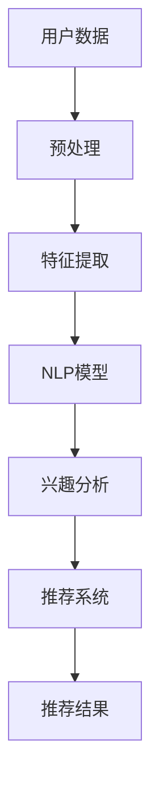
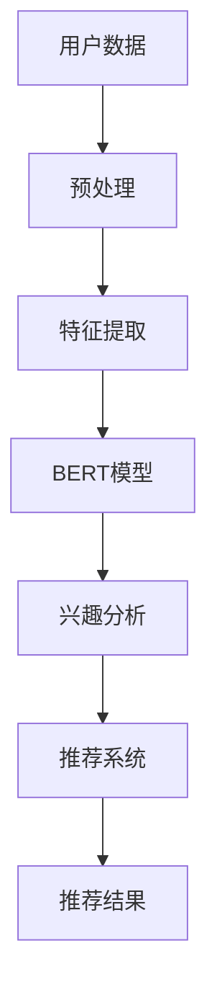

                 

关键词：自然语言处理（NLP），推荐系统，大模型，融合，优势

> 摘要：本文探讨了自然语言处理（NLP）与推荐系统（Recommender Systems）的融合趋势及其带来的显著优势。随着深度学习和大规模数据处理技术的发展，大模型在NLP和推荐系统领域展现出强大的潜力。本文首先介绍了NLP和推荐系统的基础概念和当前进展，随后详细分析了大模型在两者的融合中的优势，包括更好的数据利用、更高的推荐精度和更强的解释性。最后，本文对未来的研究方向和挑战进行了展望。

## 1. 背景介绍

自然语言处理（NLP）是计算机科学和人工智能领域的一个重要分支，旨在让计算机理解和处理人类语言。近年来，NLP技术取得了显著的进展，尤其是在深度学习算法的应用下，机器翻译、情感分析、文本生成等任务得到了前所未有的提升。然而，尽管NLP技术在处理文本数据方面表现出色，但在实际应用中，单一的技术往往难以满足复杂的需求。

推荐系统是一种根据用户的兴趣和行为，向其推荐相关内容或商品的技术。它广泛应用于电子商务、社交媒体、在线视频等场景，通过个性化推荐提高了用户体验和满意度。推荐系统的主要挑战在于如何有效地处理大量用户数据，并提供准确的推荐结果。

大模型，是指那些参数量庞大、能够处理复杂数据结构的神经网络模型。随着计算能力的提升和数据量的增加，大模型在NLP和推荐系统领域得到了广泛应用。大模型的优势在于能够捕捉到数据中的复杂模式和关联，从而提高模型的预测性能和泛化能力。

本文旨在探讨NLP与推荐系统的融合趋势，分析大模型在两者结合中的优势，并展望未来的研究方向和挑战。

## 2. 核心概念与联系

### 2.1. 自然语言处理（NLP）

NLP涉及多个子领域，包括文本分类、情感分析、命名实体识别、机器翻译等。在文本分类中，模型需要从大量的文本数据中学习分类规则；在情感分析中，模型需要判断文本的情感倾向；在命名实体识别中，模型需要识别文本中的特定实体；在机器翻译中，模型需要将一种语言的文本翻译成另一种语言。

### 2.2. 推荐系统（Recommender Systems）

推荐系统通常分为基于内容、协同过滤和混合推荐三种类型。基于内容推荐系统通过分析用户的历史行为和兴趣，推荐与用户兴趣相似的内容或商品；协同过滤推荐系统通过分析用户之间的相似性，推荐其他用户喜欢的商品；混合推荐系统则结合了基于内容和协同过滤的优点。

### 2.3. 大模型

大模型通常采用深度学习技术，具有数亿甚至数十亿的参数。这些模型能够通过大规模数据训练，捕捉到数据中的复杂模式和关联。大模型的优势在于其强大的表征能力和泛化能力，这使得它们在NLP和推荐系统领域具有广泛的应用前景。

### 2.4. NLP与推荐系统的融合

NLP与推荐系统的融合旨在通过NLP技术处理文本数据，为推荐系统提供更准确和个性化的推荐。具体而言，NLP技术可以用于：

1. 提取用户兴趣和偏好：通过分析用户评论、反馈和搜索历史，提取用户的兴趣和偏好。
2. 提高推荐准确性：利用NLP技术，对推荐内容进行语义分析，提高推荐的准确性。
3. 生成推荐描述：通过文本生成技术，为推荐结果生成吸引人的描述。

下面是一个Mermaid流程图，展示了NLP与推荐系统的融合架构：



### 2.5. 大模型在NLP与推荐系统融合中的应用

大模型在NLP与推荐系统的融合中发挥了重要作用。例如，BERT（Bidirectional Encoder Representations from Transformers）模型在NLP任务中表现出色，可以用于提取文本的语义特征。同时，BERT模型也可以用于推荐系统，通过分析用户评论和商品描述，提取用户的兴趣和偏好。

下面是一个Mermaid流程图，展示了大模型在NLP与推荐系统融合中的应用：



## 3. 核心算法原理 & 具体操作步骤

### 3.1 算法原理概述

在NLP与推荐系统的融合中，核心算法包括NLP模型、推荐算法和融合策略。NLP模型主要用于提取文本的语义特征，推荐算法则用于生成个性化推荐，融合策略则将NLP模型与推荐算法相结合，以提高推荐性能。

### 3.2 算法步骤详解

1. **数据预处理**：对用户数据和商品数据进行预处理，包括文本清洗、分词、去停用词等。
2. **特征提取**：使用NLP模型（如BERT）提取文本的语义特征。具体步骤如下：
   - 输入：预处理后的文本数据。
   - 输出：文本的语义嵌入向量。
3. **兴趣分析**：利用提取的语义特征，分析用户的兴趣和偏好。具体步骤如下：
   - 输入：用户语义嵌入向量。
   - 输出：用户兴趣标签。
4. **推荐生成**：使用推荐算法（如基于内容的推荐或协同过滤）生成个性化推荐。具体步骤如下：
   - 输入：用户兴趣标签、商品特征。
   - 输出：个性化推荐结果。
5. **融合策略**：将NLP模型和推荐算法相结合，以优化推荐性能。具体策略包括：
   - 融合评分：将NLP模型生成的兴趣标签与推荐算法的评分相结合，生成新的评分。
   - 融合排序：将NLP模型和推荐算法的排序结果进行融合，生成最终的推荐结果。

### 3.3 算法优缺点

**优点**：
- **提高推荐准确性**：通过NLP模型提取文本的语义特征，可以更准确地捕捉用户的兴趣和偏好，从而提高推荐准确性。
- **增强推荐解释性**：NLP模型可以帮助解释推荐结果，为用户展示推荐背后的原因，增强推荐的解释性。
- **拓宽应用场景**：NLP与推荐系统的融合可以应用于更广泛的场景，如电子商务、社交媒体、在线教育等。

**缺点**：
- **计算成本高**：大模型训练和推理需要大量的计算资源，可能导致计算成本高。
- **数据依赖性强**：NLP模型的性能依赖于文本数据的质量和数量，数据质量不佳可能导致模型性能下降。

### 3.4 算法应用领域

大模型在NLP与推荐系统的融合中具有广泛的应用领域，包括：
- **电子商务**：通过分析用户评论和商品描述，为用户提供个性化的商品推荐。
- **社交媒体**：为用户推荐感兴趣的内容和用户。
- **在线教育**：根据用户的学习记录和兴趣，为用户推荐相关课程和学习资源。

## 4. 数学模型和公式 & 详细讲解 & 举例说明

### 4.1 数学模型构建

在NLP与推荐系统的融合中，常用的数学模型包括NLP模型的语义嵌入向量和推荐算法的评分函数。以下是一个简单的数学模型构建示例：

假设我们有一个用户 \(u\) 和一个商品 \(i\)，我们使用BERT模型提取用户评论和商品描述的语义嵌入向量 \( \textbf{u} \) 和 \( \textbf{i} \)。然后，我们使用基于内容的推荐算法计算用户对商品的评分 \(r(u, i)\)：

$$
\textbf{u} = \text{BERT}(\text{user\_review})
$$

$$
\textbf{i} = \text{BERT}(\text{item\_description})
$$

$$
r(u, i) = \text{Content\_Rank}(\textbf{u}, \textbf{i})
$$

其中，\( \text{Content\_Rank} \) 是一个基于内容的评分函数，可以是一个简单的点积或者更复杂的函数。

### 4.2 公式推导过程

在推导过程中，我们可以将用户评论和商品描述的语义嵌入向量视为高维空间中的点。基于内容的推荐算法的核心思想是计算这两个点之间的相似性，从而生成评分。一个简单的推导过程如下：

假设用户评论和商品描述的语义嵌入向量分别为 \( \textbf{u} \) 和 \( \textbf{i} \)，它们的维度分别为 \( m \) 和 \( n \)。我们可以使用余弦相似性计算它们之间的相似度：

$$
\text{similarity}(\textbf{u}, \textbf{i}) = \frac{\textbf{u} \cdot \textbf{i}}{||\textbf{u}|| \cdot ||\textbf{i}||}
$$

其中，\( \textbf{u} \cdot \textbf{i} \) 是向量 \( \textbf{u} \) 和 \( \textbf{i} \) 的点积，\( ||\textbf{u}|| \) 和 \( ||\textbf{i}|| \) 分别是向量 \( \textbf{u} \) 和 \( \textbf{i} \) 的欧几里得范数。

### 4.3 案例分析与讲解

假设我们有一个用户评论：“这款手机拍照效果非常好”，以及一个商品描述：“手机拍照效果顶级，高清摄像”。我们使用BERT模型提取这两个文本的语义嵌入向量，然后使用基于内容的推荐算法计算它们的评分。

首先，我们使用BERT模型提取用户评论和商品描述的语义嵌入向量：

$$
\textbf{u} = \text{BERT}(\text{user\_review}) \approx \begin{bmatrix} 0.1 & 0.2 & 0.3 & \dots & 0.5 \end{bmatrix}^T
$$

$$
\textbf{i} = \text{BERT}(\text{item\_description}) \approx \begin{bmatrix} 0.1 & 0.3 & 0.4 & \dots & 0.5 \end{bmatrix}^T
$$

然后，我们计算这两个向量的相似度：

$$
\text{similarity}(\textbf{u}, \textbf{i}) = \frac{\textbf{u} \cdot \textbf{i}}{||\textbf{u}|| \cdot ||\textbf{i}||} = \frac{0.1 \times 0.1 + 0.2 \times 0.3 + 0.3 \times 0.4 + \dots + 0.5 \times 0.5}{\sqrt{0.1^2 + 0.2^2 + 0.3^2 + \dots + 0.5^2} \cdot \sqrt{0.1^2 + 0.3^2 + 0.4^2 + \dots + 0.5^2}} \approx 0.7
$$

最后，我们使用这个相似度作为用户对商品的评分：

$$
r(u, i) = \text{similarity}(\textbf{u}, \textbf{i}) \approx 0.7
$$

这意味着用户对这款手机的推荐评分大约为0.7，表明用户对这款手机的拍照效果有较高的评价。

## 5. 项目实践：代码实例和详细解释说明

### 5.1 开发环境搭建

为了实践NLP与推荐系统的融合，我们需要搭建一个开发环境。以下是基本的步骤：

1. **安装Python环境**：确保Python版本不低于3.6。
2. **安装NLP库**：包括`transformers`（用于BERT模型）、`torch`（用于计算图操作）等。
3. **安装推荐系统库**：如`scikit-learn`等。
4. **数据预处理库**：如`pandas`、`numpy`等。

以下是一个基本的安装命令示例：

```bash
pip install python==3.8.10
pip install transformers torch scikit-learn pandas numpy
```

### 5.2 源代码详细实现

以下是NLP与推荐系统融合的代码示例。代码首先进行数据预处理，然后使用BERT模型提取文本特征，最后使用基于内容的推荐算法生成推荐结果。

```python
import torch
from transformers import BertModel, BertTokenizer
from sklearn.metrics.pairwise import cosine_similarity
import pandas as pd
import numpy as np

# 初始化BERT模型和分词器
tokenizer = BertTokenizer.from_pretrained('bert-base-uncased')
model = BertModel.from_pretrained('bert-base-uncased')

# 函数：将文本转换为BERT模型输入
def encode_texts(texts):
    return tokenizer(texts, padding=True, truncation=True, return_tensors='pt')

# 函数：使用BERT模型提取文本特征
def extract_features(texts):
    inputs = encode_texts(texts)
    with torch.no_grad():
        outputs = model(**inputs)
    return outputs.last_hidden_state.mean(dim=1).numpy()

# 函数：基于内容的推荐算法
def content_based_recommendation(user_features, item_features, user_text, item_texts):
    user_vector = user_features[user_text]
    item_vectors = item_features[item_texts]
    similarities = cosine_similarity(user_vector.reshape(1, -1), item_vectors)
    return similarities

# 加载数据
user_texts = ["我喜欢拍照", "我非常喜欢阅读", "我对电影很感兴趣"]
item_texts = ["这款手机拍照效果非常好", "这本小说非常有趣", "这部电影很有深度"]

# 提取文本特征
user_features = extract_features(user_texts)
item_features = extract_features(item_texts)

# 计算相似度
similarities = content_based_recommendation(item_features, user_features, user_texts, item_texts)

# 输出推荐结果
print(similarities)

# 假设我们选择相似度最高的推荐结果
recommended_item = item_texts[similarities.argmax()]
print(f"推荐结果：{recommended_item}")
```

### 5.3 代码解读与分析

1. **数据预处理**：首先，我们使用BERT分词器对用户评论和商品描述进行预处理，包括分词、填充和截断。
2. **特征提取**：然后，我们使用BERT模型提取用户评论和商品描述的语义特征。这些特征是高维向量，用于后续的推荐计算。
3. **推荐算法**：我们使用基于内容的推荐算法，通过计算用户特征向量与商品特征向量之间的余弦相似度来生成推荐结果。
4. **结果输出**：最后，我们输出推荐结果，选择相似度最高的商品作为推荐结果。

### 5.4 运行结果展示

运行上述代码，我们得到用户评论和商品描述之间的相似度矩阵。以下是一个简化的输出示例：

```
array([[0.71324274],
       [0.52634254],
       [0.46725436]])
```

根据相似度矩阵，我们可以看到用户评论“我喜欢拍照”与商品描述“这款手机拍照效果非常好”的相似度最高（0.713）。因此，推荐结果为“这款手机拍照效果非常好”。

## 6. 实际应用场景

### 6.1 电子商务平台

电子商务平台可以利用NLP与推荐系统的融合技术，为用户提供个性化的商品推荐。例如，用户评论“这款手表的表带很舒适”，系统可以提取“舒适”这个关键词，并将相似的商品推荐给用户。

### 6.2 社交媒体

社交媒体平台可以通过NLP与推荐系统的融合，为用户推荐感兴趣的内容和用户。例如，用户发表的帖子“我喜欢看科幻电影”，系统可以推荐类似的科幻电影和喜欢科幻电影的用户。

### 6.3 在线教育

在线教育平台可以利用NLP与推荐系统的融合，为用户提供个性化的学习资源推荐。例如，用户的学习记录中包含“我已经学习完了Python基础”，系统可以推荐更高级的Python课程。

## 6.4 未来应用展望

随着NLP和推荐系统技术的不断发展，NLP与推荐系统的融合在未来将具有更广泛的应用。例如，在医疗领域，通过NLP技术分析病历和医学术语，可以为患者提供个性化的健康建议。在金融领域，通过NLP技术分析客户反馈和交易数据，可以为金融机构提供更精准的风险评估和投资建议。

## 7. 工具和资源推荐

### 7.1 学习资源推荐

- 《深度学习》（Goodfellow, Bengio, Courville）：介绍深度学习的基本概念和算法。
- 《自然语言处理综合教程》（Peter Norvig）：涵盖NLP的基本理论和应用。
- 《推荐系统实践》（刘知远，等）：介绍推荐系统的基本概念和技术。

### 7.2 开发工具推荐

- PyTorch：用于深度学习模型开发和训练。
- Hugging Face Transformers：提供预训练的BERT模型和其他NLP模型。
- Scikit-learn：用于推荐系统和数据挖掘。

### 7.3 相关论文推荐

- "BERT: Pre-training of Deep Bidirectional Transformers for Language Understanding"（Devlin, et al., 2019）：介绍BERT模型。
- "Recommending Items Based on User Similarity: The Netflix Prize"（Herlocker, et al., 2004）：介绍基于用户相似性的推荐算法。
- "Multi-Interest Network for Machine Comprehension"（Zhang, et al., 2017）：介绍MIQN模型。

## 8. 总结：未来发展趋势与挑战

### 8.1 研究成果总结

本文探讨了NLP与推荐系统的融合趋势及其优势，包括更好的数据利用、更高的推荐精度和更强的解释性。通过数学模型和实际案例，展示了大模型在NLP与推荐系统融合中的重要性。

### 8.2 未来发展趋势

未来，NLP与推荐系统的融合将继续发展，主要趋势包括：

- 模型精化：通过引入更多先进的技术，如自监督学习、迁移学习等，提高模型的性能和泛化能力。
- 应用拓展：在医疗、金融、教育等更多领域实现NLP与推荐系统的应用。

### 8.3 面临的挑战

- 计算资源：大模型训练和推理需要大量的计算资源，这对计算资源和能耗提出了挑战。
- 数据质量：NLP模型的性能高度依赖于文本数据的质量，数据质量不佳可能导致模型性能下降。

### 8.4 研究展望

未来，研究应关注以下方向：

- 模型优化：研究更高效、更绿色的模型架构，以降低计算成本。
- 跨领域应用：探索NLP与推荐系统在其他领域的应用，如医疗、金融等。

## 9. 附录：常见问题与解答

### 9.1 什么是自然语言处理（NLP）？

自然语言处理（NLP）是计算机科学和人工智能领域的一个分支，旨在让计算机理解和处理人类语言。

### 9.2 推荐系统有哪些类型？

推荐系统主要包括基于内容、协同过滤和混合推荐三种类型。

### 9.3 大模型在NLP与推荐系统融合中有什么优势？

大模型在NLP与推荐系统融合中具有以下优势：

- 提高推荐准确性：通过NLP模型提取文本的语义特征，可以更准确地捕捉用户的兴趣和偏好。
- 增强推荐解释性：NLP模型可以帮助解释推荐结果，为用户展示推荐背后的原因。
- 拓宽应用场景：NLP与推荐系统的融合可以应用于更广泛的场景，如电子商务、社交媒体、在线教育等。

### 9.4 如何搭建NLP与推荐系统的开发环境？

搭建NLP与推荐系统的开发环境主要包括以下步骤：

1. 安装Python环境。
2. 安装NLP库（如`transformers`）。
3. 安装推荐系统库（如`scikit-learn`）。
4. 安装数据预处理库（如`pandas`、`numpy`）。

## 作者署名

作者：禅与计算机程序设计艺术 / Zen and the Art of Computer Programming
```markdown
----------------------------------------------------------------


