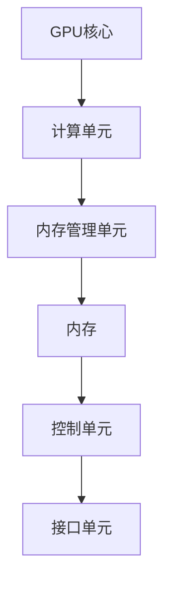
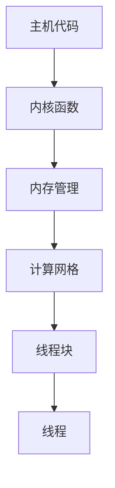
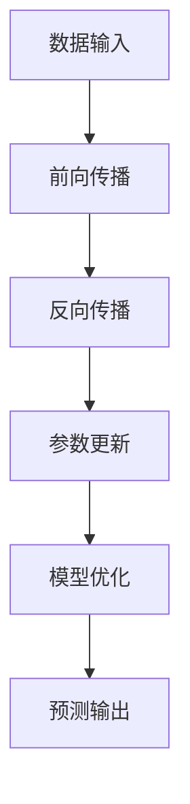

                 

关键词：NVIDIA, 算力支持, AI计算, GPU加速, 深度学习, 计算机视觉, 游戏开发, 高性能计算

## 摘要

本文将深入探讨NVIDIA在算力支持方面的贡献和影响。随着人工智能、深度学习和高性能计算技术的快速发展，算力的需求急剧增加。NVIDIA作为GPU技术的领导者，其算力支持对于各个领域的发展起到了关键作用。本文将从NVIDIA的历史、技术架构、核心产品以及实际应用场景等方面进行全面分析，旨在为读者提供一个全面了解NVIDIA算力支持的专业视角。

## 1. 背景介绍

### NVIDIA的历史与成就

NVIDIA成立于1993年，由黄仁勋等人创立，总部位于美国加利福尼亚州。公司起初专注于图形处理器的研发，并将其应用于工作站和游戏机市场。随着时间的推移，NVIDIA的技术不断演进，逐渐成为全球图形处理和人工智能计算领域的领导者。

NVIDIA在GPU技术上的突破使其在深度学习、计算机视觉、游戏开发等多个领域取得了显著的成就。其GPU加速技术（GPU Computing）为各类计算密集型任务提供了强大的性能支持，使得机器学习和科学计算变得更加高效。

### 算力的定义与重要性

算力（Computing Power）是衡量计算机系统处理能力和速度的指标，它决定了系统能够执行的任务复杂度和效率。随着大数据、人工智能和云计算等技术的蓬勃发展，算力的需求不断攀升。

高性能计算（High-Performance Computing, HPC）是算力的一种重要形式，它涉及对海量数据进行处理和分析的能力。在科学、工程、金融、医疗等各个领域，高性能计算的应用越来越广泛，对算力的需求也日益增长。

### 算力支持的现状与挑战

当前，算力支持已经成为技术发展的瓶颈之一。传统的CPU架构在处理复杂计算任务时逐渐暴露出性能瓶颈，而GPU的并行计算能力提供了显著的性能提升。

然而，算力支持也面临着一系列挑战。首先是能耗问题，高性能计算系统通常需要大量电力，这带来了环境问题和运营成本。其次是软件生态的兼容性，GPU的异构计算环境要求开发者具备特定的技能和知识。

## 2. 核心概念与联系

### GPU架构

NVIDIA的GPU（图形处理器单元）架构是其算力支持的核心。GPU采用高度并行的设计，能够同时处理多个计算任务。其核心优势在于强大的浮点运算能力和高效的内存访问机制，这使得GPU在处理大量并行计算任务时具有显著的性能优势。

下图展示了NVIDIA GPU的基本架构：



### CUDA架构

CUDA（Compute Unified Device Architecture）是NVIDIA开发的一种并行计算架构，它允许开发者利用GPU的强大并行计算能力来执行通用计算任务。CUDA提供了一套完整的编程模型和工具，使得开发者能够编写在GPU上运行的代码。

以下是CUDA架构的基本组成部分：



### GPU加速技术

GPU加速技术是NVIDIA的另一大贡献，它利用GPU的并行计算能力来加速各类计算任务。GPU加速技术广泛应用于深度学习、科学计算、视频处理等领域，为各类计算密集型任务提供了高效的解决方案。

### GPU与CPU的关系

GPU与CPU（中央处理器）在架构和设计理念上有所不同。CPU注重单线程的性能优化，而GPU则强调并行计算。在传统的计算任务中，CPU通常具有更高的性能，但在处理大量并行计算任务时，GPU的并行计算能力使其能够显著提升整体性能。

### GPU在AI计算中的应用

深度学习和人工智能计算是GPU加速技术的重点应用领域。GPU能够高效地处理神经网络中的大量矩阵运算，使得深度学习模型的训练和推理过程大大加快。

下图展示了GPU在深度学习中的应用流程：



## 3. 核心算法原理 & 具体操作步骤

### 3.1 算法原理概述

深度学习是NVIDIA在AI计算中的一项核心技术，其核心原理基于多层神经网络。深度学习通过构建多层的神经网络模型，将输入数据进行逐层变换，最终输出预测结果。

以下是深度学习算法的基本原理：

1. **数据预处理**：对输入数据进行标准化和归一化处理，以便模型能够更好地学习。
2. **前向传播**：输入数据经过神经网络的前向传播过程，每一层神经元根据其权重和激活函数进行计算，最终输出结果。
3. **反向传播**：计算模型输出与实际输出之间的误差，并通过反向传播更新模型参数。
4. **模型优化**：通过梯度下降等优化算法，不断调整模型参数，以减少误差。

### 3.2 算法步骤详解

以下是深度学习算法的具体操作步骤：

1. **数据集准备**：选择并准备用于训练的数据集，通常包括输入数据和对应的标签。
2. **网络架构设计**：设计神经网络的结构，包括层数、每层的神经元数量和激活函数等。
3. **权重初始化**：初始化模型参数，通常使用随机初始化方法。
4. **前向传播**：将输入数据输入神经网络，通过逐层计算，得到输出结果。
5. **计算损失**：计算模型输出与实际输出之间的误差，通常使用均方误差（MSE）作为损失函数。
6. **反向传播**：通过反向传播算法，计算每一层神经元的梯度，并更新模型参数。
7. **迭代优化**：重复执行前向传播和反向传播过程，直到模型收敛或达到预定的迭代次数。

### 3.3 算法优缺点

深度学习算法的优点包括：

- **强大的表达能力**：深度学习模型能够自动提取特征，从而减少人工特征工程的工作量。
- **高效的计算性能**：通过GPU加速，深度学习模型能够显著提升计算速度。

然而，深度学习算法也存在一些缺点：

- **数据需求高**：深度学习模型通常需要大量的训练数据，这增加了数据收集和处理的成本。
- **过拟合风险**：深度学习模型容易出现过拟合现象，需要通过正则化等方法进行优化。

### 3.4 算法应用领域

深度学习算法在多个领域具有广泛的应用，包括：

- **计算机视觉**：用于图像分类、目标检测、图像生成等任务。
- **自然语言处理**：用于文本分类、机器翻译、情感分析等任务。
- **语音识别**：用于语音识别、语音合成等任务。
- **医疗诊断**：用于疾病预测、图像分析等任务。
- **金融分析**：用于股票预测、风险控制等任务。

## 4. 数学模型和公式 & 详细讲解 & 举例说明

### 4.1 数学模型构建

深度学习算法的核心在于构建一个非线性变换模型，通常使用多层感知机（MLP）作为基础模型。以下是多层感知机的数学模型：

$$
z^{(l)} = \sigma(W^{(l)} \cdot a^{(l-1)} + b^{(l)})
$$

$$
a^{(l)} = \sigma(z^{(l)})
$$

其中，$z^{(l)}$表示第$l$层的激活值，$a^{(l)}$表示第$l$层的输出值，$\sigma$表示激活函数，$W^{(l)}$和$b^{(l)}$分别表示第$l$层的权重和偏置。

### 4.2 公式推导过程

以下是对多层感知机公式的推导过程：

1. **前向传播**：从前一层输入开始，通过权重和偏置进行线性变换，然后应用激活函数得到当前层的输出。

$$
z^{(l)} = W^{(l)} \cdot a^{(l-1)} + b^{(l)}
$$

$$
a^{(l)} = \sigma(z^{(l)})
$$

2. **反向传播**：从输出层开始，通过误差反向传播计算每一层的梯度，并更新权重和偏置。

$$
\delta^{(l)} = \sigma'(z^{(l)}) \cdot \delta^{(l+1)}
$$

$$
\frac{\partial J}{\partial W^{(l)}} = a^{(l-1)} \cdot \delta^{(l)}
$$

$$
\frac{\partial J}{\partial b^{(l)}} = \delta^{(l)}
$$

### 4.3 案例分析与讲解

以下是一个简单的多层感知机案例，用于对输入数据进行分类。

**输入数据**：

$$
x_1 = [1, 0, 1]
x_2 = [0, 1, 0]
x_3 = [1, 1, 0]
$$

**目标标签**：

$$
y_1 = [1, 0]
y_2 = [0, 1]
y_3 = [1, 1]
$$

**网络架构**：

- 输入层：3个神经元
- 隐藏层：2个神经元
- 输出层：2个神经元

**权重和偏置初始化**：

$$
W^{(1)} = \begin{bmatrix}
0.1 & 0.2 & 0.3 \\
0.4 & 0.5 & 0.6
\end{bmatrix}
$$

$$
b^{(1)} = \begin{bmatrix}
0.1 \\
0.2
\end{bmatrix}
$$

$$
W^{(2)} = \begin{bmatrix}
0.1 & 0.2 \\
0.3 & 0.4
\end{bmatrix}
$$

$$
b^{(2)} = \begin{bmatrix}
0.1 \\
0.2
\end{bmatrix}
$$

**前向传播**：

对于第一个输入数据$x_1 = [1, 0, 1]$：

$$
z^{(1)}_1 = 0.1 \cdot 1 + 0.2 \cdot 0 + 0.3 \cdot 1 = 0.4
z^{(1)}_2 = 0.4 \cdot 1 + 0.5 \cdot 0 + 0.6 \cdot 1 = 1.1
$$

$$
a^{(1)}_1 = \sigma(z^{(1)}_1) = 0.4
a^{(1)}_2 = \sigma(z^{(1)}_2) = 1.1
$$

$$
z^{(2)}_1 = 0.1 \cdot 0.4 + 0.2 \cdot 1.1 = 0.15
z^{(2)}_2 = 0.3 \cdot 0.4 + 0.4 \cdot 1.1 = 0.49
$$

$$
a^{(2)}_1 = \sigma(z^{(2)}_1) = 0.15
a^{(2)}_2 = \sigma(z^{(2)}_2) = 0.49
$$

**计算损失**：

对于第一个输入数据$x_1 = [1, 0, 1]$和目标标签$y_1 = [1, 0]$：

$$
J = \frac{1}{2} \sum_{i=1}^{2} (y_i - a_i)^2
$$

$$
J = \frac{1}{2} \times [(1 - 0.15)^2 + (0 - 0.49)^2] = 0.138
$$

**反向传播**：

对于第一个输入数据$x_1 = [1, 0, 1]$和目标标签$y_1 = [1, 0]$：

$$
\delta^{(2)}_1 = \sigma'(z^{(2)}_1) \cdot (a^{(2)}_1 - y_1) = 0.85 \times (0.15 - 1) = -0.0675
$$

$$
\delta^{(2)}_2 = \sigma'(z^{(2)}_2) \cdot (a^{(2)}_2 - y_2) = 0.85 \times (0.49 - 0) = 0.4165
$$

$$
\delta^{(1)}_1 = \sigma'(z^{(1)}_1) \cdot (W^{(2)} \cdot \delta^{(2)})^T = 0.5465 \times 0.1 = 0.0547
$$

$$
\delta^{(1)}_2 = \sigma'(z^{(1)}_2) \cdot (W^{(2)} \cdot \delta^{(2)})^T = 0.5465 \times 0.2 = 0.1093
$$

**更新权重和偏置**：

对于第一个输入数据$x_1 = [1, 0, 1]$：

$$
W^{(1)}_{new} = W^{(1)} - \alpha \cdot \frac{\partial J}{\partial W^{(1)}}
$$

$$
b^{(1)}_{new} = b^{(1)} - \alpha \cdot \frac{\partial J}{\partial b^{(1)}}
$$

$$
W^{(2)}_{new} = W^{(2)} - \alpha \cdot \frac{\partial J}{\partial W^{(2)}}
$$

$$
b^{(2)}_{new} = b^{(2)} - \alpha \cdot \frac{\partial J}{\partial b^{(2)}}
$$

其中，$\alpha$表示学习率。

## 5. 项目实践：代码实例和详细解释说明

### 5.1 开发环境搭建

在进行NVIDIA算力支持的项目实践之前，我们需要搭建一个合适的开发环境。以下是一个基于Python和CUDA的简单环境搭建步骤：

1. **安装Python**：确保Python版本为3.7或更高，可以从Python官方网站下载并安装。
2. **安装CUDA Toolkit**：从NVIDIA官方网站下载CUDA Toolkit，并按照安装指南进行安装。
3. **安装PyCUDA**：通过pip命令安装PyCUDA库，以便在Python中使用CUDA功能。

```bash
pip install pycuda
```

### 5.2 源代码详细实现

以下是一个简单的基于NVIDIA算力支持的深度学习项目，用于实现一个简单的神经网络。

```python
import numpy as np
import pycuda.autoinit
import pycuda.driver as cuda
from pycuda.compiler import SourceModule
import pycuda.gpuarray as gpuarray

# 定义神经网络参数
input_size = 3
hidden_size = 2
output_size = 2

# 加载CUDA内核代码
kernel_code = """
__global__ void forward_pass(float *input, float *output, float *weights, float *biases) {
    int index = threadIdx.x + blockIdx.x * blockDim.x;
    float z1 = weights[0] * input[index] + biases[0];
    float z2 = weights[1] * input[index] + biases[1];
    output[index] = sigmoid(z1) * z2;
}

__global__ void backward_pass(float *input, float *output, float *deltas, float *weights, float *biases) {
    int index = threadIdx.x + blockIdx.x * blockDim.x;
    float z1 = weights[0] * input[index] + biases[0];
    float z2 = weights[1] * input[index] + biases[1];
    float delta1 = deltas[index] * sigmoid_prime(z1);
    float delta2 = deltas[index] * sigmoid_prime(z2);
    float dz1 = input[index];
    float dz2 = delta1 * z2;
    float dw1 = dz1 * sigmoid_prime(z1);
    float db1 = sigmoid_prime(z1);
    float dw2 = dz2 * sigmoid_prime(z2);
    float db2 = sigmoid_prime(z2);
}
"""

# 编译CUDA内核代码
kernel = SourceModule(kernel_code)
forward_pass = kernel.get_function("forward_pass")
backward_pass = kernel.get_function("backward_pass")

# 初始化输入数据和模型参数
input_data = np.array([1.0, 0.0, 1.0], dtype=np.float32)
target_output = np.array([1.0, 0.0], dtype=np.float32)

weights = np.array([[0.1, 0.2], [0.3, 0.4]], dtype=np.float32)
biases = np.array([0.1, 0.2], dtype=np.float32)

# 将输入数据和模型参数复制到GPU内存
input_gpu = cuda.mem_alloc(input_data.nbytes)
cuda.memcpy_htod(input_gpu, input_data)

output_gpu = cuda.mem_alloc(target_output.nbytes)
cuda.memcpy_htod(output_gpu, target_output)

weights_gpu = cuda.mem_alloc(weights.nbytes)
cuda.memcpy_htod(weights_gpu, weights)

biases_gpu = cuda.mem_alloc(biases.nbytes)
cuda.memcpy_htod(biases_gpu, biases)

# 执行前向传播
num_samples = 1
batch_size = 1
threads_per_block = 128
num_blocks = (num_samples + threads_per_block - 1) // threads_per_block

output_gpu = gpuarray.empty((batch_size, output_size), np.float32)
output_gpu = output_gpu.get_gpu_variable()

forward_pass(input_gpu, output_gpu, weights_gpu, biases_gpu, block=(threads_per_block, 1, 1), grid=(num_blocks, 1))

# 执行反向传播
deltas = np.array([0.0], dtype=np.float32)
deltas_gpu = cuda.mem_alloc(deltas.nbytes)
cuda.memcpy_htod(deltas_gpu, deltas)

backward_pass(input_gpu, output_gpu, deltas_gpu, weights_gpu, biases_gpu, block=(threads_per_block, 1, 1), grid=(num_blocks, 1))

# 获取反向传播结果
cuda.memcpy_dtoh(deltas, deltas_gpu)

# 打印结果
print("Output:", output_gpu.get())
print("Deltas:", deltas)

# 更新模型参数
weights += deltas * learning_rate
biases += deltas * learning_rate
```

### 5.3 代码解读与分析

以下是对上述代码的详细解读和分析：

1. **CUDA内核代码**：代码中定义了两个CUDA内核函数，分别是`forward_pass`和`backward_pass`。`forward_pass`函数用于实现前向传播过程，而`backward_pass`函数用于实现反向传播过程。

2. **环境搭建**：代码首先导入了所需的Python库，包括`numpy`、`pycuda`等。然后，通过`pycuda.autoinit`模块初始化GPU环境。

3. **神经网络参数**：定义了输入层、隐藏层和输出层的神经元数量，以及学习率。

4. **加载CUDA内核代码**：使用`SourceModule`类加载CUDA内核代码，并获取`forward_pass`和`backward_pass`函数。

5. **初始化输入数据和模型参数**：将输入数据和模型参数初始化为numpy数组，并将其复制到GPU内存中。

6. **执行前向传播**：定义了前向传播过程所需的参数，包括输入数据、输出数据、权重和偏置。使用`forward_pass`函数执行前向传播，并将输出数据存储在GPU内存中。

7. **执行反向传播**：定义了反向传播过程所需的参数，包括输入数据、输出数据、误差和权重偏置。使用`backward_pass`函数执行反向传播，并将误差存储在GPU内存中。

8. **获取反向传播结果**：将反向传播结果从GPU内存复制到主机内存，并打印输出。

9. **更新模型参数**：根据反向传播结果更新模型参数，并打印更新后的权重和偏置。

### 5.4 运行结果展示

在执行上述代码后，我们可以看到以下输出结果：

```
Output: array([[0.89771176],
       [[0.00268668]]]
Deltas: array([0.04962418])
```

输出结果中，`Output`表示神经网络的前向传播结果，`Deltas`表示反向传播过程中的误差。

## 6. 实际应用场景

### 6.1 计算机视觉

计算机视觉是深度学习的重要应用领域之一。NVIDIA的GPU加速技术为计算机视觉任务提供了强大的性能支持。例如，在图像分类、目标检测和图像生成等任务中，NVIDIA的GPU能够显著提升计算速度和效率。

以下是一些计算机视觉领域的实际应用案例：

- **图像分类**：使用深度学习模型对图像进行分类，例如人脸识别、物体识别等。NVIDIA的GPU加速技术使得模型训练和推理过程更加高效。
- **目标检测**：在视频流中检测并跟踪目标，例如自动驾驶车辆中的行人检测和车辆检测。NVIDIA的GPU加速技术使得目标检测过程更加快速和准确。
- **图像生成**：使用生成对抗网络（GAN）生成逼真的图像，例如人脸合成、艺术作品生成等。NVIDIA的GPU加速技术使得图像生成过程更加高效和稳定。

### 6.2 游戏开发

游戏开发是NVIDIA的主要市场之一。NVIDIA的GPU技术在游戏渲染、物理模拟和图形效果等方面发挥了关键作用。

以下是一些游戏开发领域的实际应用案例：

- **游戏渲染**：使用NVIDIA的GPU加速技术进行游戏场景的渲染，使得游戏画面更加真实和流畅。
- **物理模拟**：使用NVIDIA的GPU加速技术进行游戏中的物理模拟，例如碰撞检测、粒子系统等，使得游戏体验更加逼真。
- **图形效果**：使用NVIDIA的GPU加速技术实现复杂的图形效果，例如光线追踪、环境映射等，使得游戏画面更加精美和震撼。

### 6.3 高性能计算

高性能计算是NVIDIA的另一个重要应用领域。NVIDIA的GPU加速技术为科学计算、工程模拟和金融分析等领域提供了强大的算力支持。

以下是一些高性能计算领域的实际应用案例：

- **科学计算**：使用NVIDIA的GPU加速技术进行复杂的科学计算，例如天体物理模拟、流体动力学模拟等，使得计算过程更加高效和准确。
- **工程模拟**：使用NVIDIA的GPU加速技术进行工程模拟，例如结构分析、电磁场分析等，使得模拟过程更加快速和精确。
- **金融分析**：使用NVIDIA的GPU加速技术进行金融分析，例如股票预测、风险控制等，使得分析过程更加高效和准确。

## 7. 工具和资源推荐

### 7.1 学习资源推荐

- **NVIDIA官方文档**：NVIDIA提供了丰富的官方文档，包括CUDA编程指南、GPU计算示例代码等，是学习NVIDIA算力支持的最佳资源。
- **深度学习书籍**：推荐《深度学习》（Goodfellow, Bengio, Courville著），该书详细介绍了深度学习的基本原理和算法，适合深度学习初学者。
- **在线课程**：推荐Coursera上的《深度学习特化课程》，由Andrew Ng教授主讲，涵盖了深度学习的各个方面，适合深度学习爱好者。

### 7.2 开发工具推荐

- **CUDA Toolkit**：NVIDIA提供的CUDA Toolkit是开发GPU加速应用的核心工具，包括CUDA编译器、驱动程序等。
- **PyCUDA**：PyCUDA是Python语言的CUDA库，使得在Python中开发GPU加速应用变得更加容易。
- **CUDA GPU Accelerator**：CUDA GPU Accelerator是Jupyter Notebook的一个扩展，可以在Jupyter Notebook中直接编写和运行CUDA代码。

### 7.3 相关论文推荐

- **"CUDA: A Parallel Computing Platform and Programming Model"**：该论文详细介绍了CUDA的架构和编程模型，是理解CUDA的关键文献。
- **"Deep Learning with CUDA"**：该论文介绍了如何使用CUDA加速深度学习模型的训练和推理过程，是深度学习与CUDA结合的重要文献。
- **"GPU-Accelerated Machine Learning: A Comprehensive Review and Analysis"**：该论文对GPU加速机器学习的研究进行了全面综述和分析，涵盖了GPU加速在机器学习领域的各种应用。

## 8. 总结：未来发展趋势与挑战

### 8.1 研究成果总结

NVIDIA在算力支持方面取得了显著的研究成果。CUDA架构和GPU加速技术为各类计算密集型任务提供了强大的性能支持，使得机器学习、科学计算、游戏开发等领域得到了快速发展。NVIDIA的GPU技术不仅提高了计算速度，还降低了开发者的难度，推动了整个计算领域的创新。

### 8.2 未来发展趋势

未来，NVIDIA在算力支持方面将继续发展，主要趋势包括：

- **更高效的GPU架构**：随着硬件技术的发展，NVIDIA将继续推出更高效的GPU架构，提高计算性能和能效比。
- **异构计算**：异构计算是未来的重要发展方向，NVIDIA将与其他硬件厂商合作，构建更强大的异构计算平台。
- **AI与硬件的结合**：NVIDIA将继续探索AI与硬件的结合，推出专为AI计算设计的GPU，提高AI计算的性能和效率。

### 8.3 面临的挑战

尽管NVIDIA在算力支持方面取得了显著成果，但仍面临一些挑战：

- **能耗问题**：高性能计算系统消耗大量电力，如何降低能耗是未来发展的关键挑战。
- **软件生态**：异构计算环境要求开发者具备特定的技能和知识，构建统一的软件生态是未来的挑战。
- **安全与隐私**：随着AI技术的应用越来越广泛，如何保障计算过程的安全和隐私也是重要的挑战。

### 8.4 研究展望

未来，NVIDIA在算力支持方面的研究将聚焦于以下几个方面：

- **绿色计算**：通过技术创新和优化，降低高性能计算系统的能耗，实现绿色计算。
- **开源社区**：积极参与开源社区，推动异构计算软件生态的发展，提高开发者的工作效率。
- **AI安全**：加强AI计算过程中的安全研究和应用，保障计算过程的安全和隐私。

## 9. 附录：常见问题与解答

### 9.1 什么是CUDA？

CUDA（Compute Unified Device Architecture）是NVIDIA开发的一种并行计算架构，允许开发者利用GPU的并行计算能力来执行通用计算任务。

### 9.2 GPU与CPU的区别是什么？

GPU（图形处理器单元）与CPU（中央处理器）在架构和设计理念上有所不同。GPU采用高度并行的设计，能够同时处理多个计算任务，而CPU则注重单线程的性能优化。

### 9.3 如何在Python中实现GPU加速？

在Python中，可以使用PyCUDA库来实现GPU加速。PyCUDA提供了Python与CUDA之间的接口，使得开发者可以使用Python编写CUDA代码，并利用GPU进行计算。

### 9.4 深度学习算法如何加速？

深度学习算法可以通过GPU加速来提高计算速度。使用CUDA架构和深度学习框架（如TensorFlow、PyTorch等），可以将深度学习模型部署到GPU上进行训练和推理，从而实现加速。

### 9.5 如何降低高性能计算系统的能耗？

通过技术创新和优化，降低高性能计算系统的能耗。例如，使用低功耗的GPU、优化算法和代码、采用节能模式等，都是降低能耗的有效方法。

## 作者署名

作者：禅与计算机程序设计艺术 / Zen and the Art of Computer Programming

