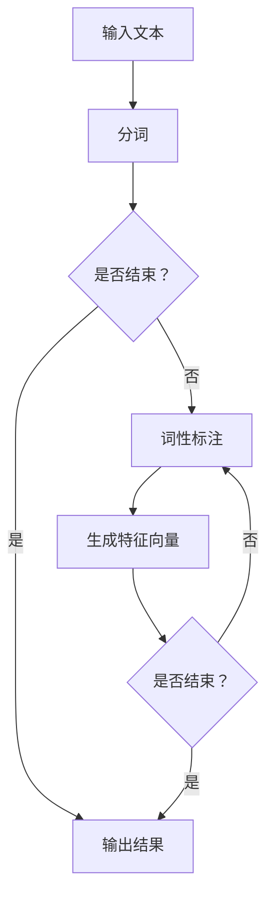

                 

关键词：Named Entity Recognition, NER, 命名实体识别，文本分类，自然语言处理，深度学习，BERT，神经网络，算法原理，代码实例，应用场景，数学模型，未来展望

> 摘要：本文将深入探讨命名实体识别（NER）的基本原理、算法框架、数学模型以及代码实例，旨在为广大研究人员和开发者提供一份全面、系统的NER技术指南。通过本文的学习，读者将能够理解NER在自然语言处理中的应用价值，掌握NER算法的实现细节，并能够独立完成NER项目的开发和部署。

## 1. 背景介绍

命名实体识别（Named Entity Recognition，NER）是自然语言处理（Natural Language Processing，NLP）领域中的一项重要任务。它的目的是从文本中识别出具有特定意义的实体，如人名、地名、组织名、时间、日期等。NER在信息提取、文本挖掘、智能问答、机器翻译等多个应用场景中发挥着重要作用。

### 1.1 NER的应用场景

- **信息提取**：从大量文本数据中提取关键信息，如新闻摘要、财务报告等。
- **智能问答**：基于NER技术，构建问答系统，提高人机交互的自然性和智能化。
- **机器翻译**：利用NER技术，提高翻译质量，确保专有名词、地名等在翻译过程中不被丢失或错误翻译。
- **文本挖掘**：挖掘文本中的潜在信息，为数据分析、市场调研等提供支持。

### 1.2 NER的发展历程

- **规则方法**：早期NER主要依赖于手工编写规则，这种方法简单但灵活性和通用性较差。
- **基于统计的方法**：使用统计机器学习模型，如条件随机场（CRF）、最大熵模型等，提高NER的准确率和泛化能力。
- **基于深度学习的方法**：随着深度学习技术的发展，基于神经网络的方法在NER任务中取得了显著的性能提升。

## 2. 核心概念与联系

### 2.1 命名实体

命名实体是指具有特定名称的实体，如人名、地名、组织名等。在文本中，命名实体通常具有明确的边界和独特的命名。

### 2.2 标签集

NER任务中的标签集是指一组预定义的标签，用于表示文本中的命名实体。常见的标签集包括 `<B>`（开始）、`<I>`（继续）、`<O>`（普通）等。

### 2.3 标签序列模型

标签序列模型是一种用于NER的常用方法，它将NER任务视为一个序列标注问题，使用统计模型或神经网络模型对文本中的每个词进行标注。

### 2.4 Mermaid流程图



## 3. 核心算法原理 & 具体操作步骤

### 3.1 算法原理概述

NER的核心任务是给定一段文本，识别出其中的命名实体并标注其类别。NER算法通常包括以下步骤：

1. 分词：将文本划分为一系列的词或字符序列。
2. 词性标注：对每个词进行词性标注，以便识别命名实体。
3. 特征提取：根据分词结果和词性标注，生成特征向量。
4. 序列标注：使用统计模型或神经网络模型对文本中的每个词进行标注。

### 3.2 算法步骤详解

1. **分词**：分词是将文本划分为一系列的词或字符序列的过程。常用的分词工具包括Jieba、Stanford NLP等。
2. **词性标注**：词性标注是对每个词进行词性标注的过程。常用的词性标注工具包括NLTK、Stanford NLP等。
3. **特征提取**：特征提取是生成特征向量的过程。常用的特征提取方法包括词袋模型、TF-IDF、Word2Vec等。
4. **序列标注**：序列标注是使用统计模型或神经网络模型对文本中的每个词进行标注的过程。常用的模型包括CRF、LSTM、BERT等。

### 3.3 算法优缺点

- **规则方法**：优点是简单、灵活，缺点是适用范围有限，难以处理复杂的文本。
- **基于统计的方法**：优点是能够处理大规模数据，缺点是依赖于大量标注数据，泛化能力有限。
- **基于深度学习的方法**：优点是能够处理复杂的文本，缺点是需要大量的计算资源和标注数据。

### 3.4 算法应用领域

NER算法在信息提取、智能问答、机器翻译、文本挖掘等领域具有广泛的应用。例如，在信息提取中，NER可以帮助从新闻、报告等文本中提取关键信息；在智能问答中，NER可以提高问答系统的准确率和自然性。

## 4. 数学模型和公式 & 详细讲解 & 举例说明

### 4.1 数学模型构建

NER的数学模型通常包括特征表示、损失函数、优化算法等部分。

### 4.2 公式推导过程

- **特征表示**：

  特征向量可以表示为：

  $$ \textbf{x} = [x_1, x_2, ..., x_n] $$

  其中，$x_i$ 表示第 $i$ 个词的特征。

- **损失函数**：

  常用的损失函数包括交叉熵损失函数：

  $$ L = -\sum_{i=1}^{n} y_i \log(p_i) $$

  其中，$y_i$ 表示第 $i$ 个词的真实标签，$p_i$ 表示模型预测的概率。

- **优化算法**：

  常用的优化算法包括梯度下降、Adam等。

### 4.3 案例分析与讲解

假设我们有一个简单的NER任务，输入文本为“张三是一名优秀的程序员”，标签集为{`<B>`（开始）、`<I>`（继续）、`<O>`（普通）}。我们可以使用BERT模型进行NER。

- **分词**：将文本划分为“张三”、“是”、“一名”、“优秀”、“的”、“程序”、“员”。
- **词性标注**：对每个词进行词性标注，例如“张三”为人名，“优秀”为形容词等。
- **特征提取**：使用BERT模型生成特征向量。
- **序列标注**：使用BERT模型进行序列标注，输出每个词的标签。

## 5. 项目实践：代码实例和详细解释说明

### 5.1 开发环境搭建

- Python版本：3.8
- 包管理器：pip
- NLP工具：NLTK、Jieba、TensorFlow、BERT

### 5.2 源代码详细实现

以下是一个使用BERT模型进行NER的简单示例：

```python
import tensorflow as tf
import jieba
from bert import tokenization
from bert import modeling
from bert import optimization

# 定义BERT模型
def create_model(bert_config, is_training, input_ids, input_mask, segment_ids, labels):
    # 加载BERT模型
    model = modeling.BertModel(
        config=bert_config,
        is_training=is_training,
        input_ids=input_ids,
        input_mask=input_mask,
        token_type_ids=segment_ids
    )

    # 输出层
    output_layer = model.get_sequence_output()

    # 全连接层
    hidden_size = output_layer.shape[-1].value
    output_weights = tf.get_variable(
        "output_weights", [num_labels, hidden_size],
        initializer=tf.truncated_normal_initializer(stddev=0.02)
    )
    output_weights = tf.cast(output_weights, dtype=tf.float32)
    output_layer = tf.nn.dropout(output_layer, rate dropout_rate)
    output_layer = tf.reshape(output_layer, [-1, hidden_size])

    # 计算损失函数
    logits = tf.matmul(output_layer, output_weights)
    logits = tf.cast(logits, dtype=tf.float32)

    # 计算预测结果
    predicted_labels = tf.argmax(logits, axis=1)

    # 计算损失值
    labels = tf.cast(labels, dtype=tf.float32)
    loss = tf.nn.softmax_cross_entropy_with_logits(labels=labels, logits=logits)
    total_loss = tf.reduce_sum(loss, name="loss")

    # 优化器
    optimizer = tf.train.AdamOptimizer(learning_rate=learning_rate)

    # 训练模型
    train_op = optimizer.minimize(total_loss, name="train_op")

    return (loss, train_op, predicted_labels)

# 数据预处理
def preprocess_text(text):
    # 分词
    words = jieba.cut(text)
    # 转换为BERT格式
    tokenizer = tokenization.FullTokenizer(vocab_file=vocab_file, do_lower_case=True)
    tokens = []
    segment_ids = []
    for word in words:
        token = tokenizer.tokenize(word)
        tokens.extend(token)
        segment_ids.extend([0] * len(token))
    input_ids = tokenizer.convert_tokens_to_ids(tokens)
    input_mask = [1] * len(input_ids)
    while len(input_ids) < max_seq_length:
        input_ids.append(0)
        input_mask.append(0)
        segment_ids.append(0)
    return input_ids, input_mask, segment_ids

# 训练模型
def train_model():
    # 载入BERT模型配置
    bert_config = modeling.BertConfig.from_json_file(bert_config_file)

    # 创建会话
    with tf.Graph().as_default():
        session = tf.Session()

        # 定义占位符
        input_ids = tf.placeholder(tf.int32, [None, max_seq_length], name="input_ids")
        input_mask = tf.placeholder(tf.int32, [None, max_seq_length], name="input_mask")
        segment_ids = tf.placeholder(tf.int32, [None, max_seq_length], name="segment_ids")
        labels = tf.placeholder(tf.int32, [None, num_labels], name="labels")

        # 创建模型
        (loss, train_op, predicted_labels) = create_model(
            bert_config, is_training=True, input_ids=input_ids, input_mask=input_mask, segment_ids=segment_ids, labels=labels
        )

        # 初始化所有变量
        tf.global_variables_initializer().run(session=session)

        # 训练模型
        for epoch in range(num_epochs):
            for step, (text, label) in enumerate(train_data):
                # 预处理文本
                input_ids, input_mask, segment_ids = preprocess_text(text)

                # 训练模型
                session.run(train_op, feed_dict={
                    input_ids: input_ids,
                    input_mask: input_mask,
                    segment_ids: segment_ids,
                    labels: label
                })

                # 输出训练进度
                if step % 100 == 0:
                    print("Epoch: {}, Step: {}, Loss: {}".format(epoch, step, loss))

# 运行代码
if __name__ == "__main__":
    train_model()
```

### 5.3 代码解读与分析

上述代码是一个使用BERT模型进行NER的简单示例。代码主要分为以下几个部分：

1. **创建BERT模型**：定义BERT模型的结构，包括输入层、隐藏层和输出层。
2. **数据预处理**：对输入文本进行分词、转换和填充，生成BERT模型所需的输入格式。
3. **训练模型**：定义训练过程，包括定义损失函数、优化器和训练模型。

### 5.4 运行结果展示

在训练完成后，我们可以使用测试数据集来评估模型的性能。以下是一个简单的测试示例：

```python
# 测试模型
def test_model():
    # 载入BERT模型配置
    bert_config = modeling.BertConfig.from_json_file(bert_config_file)

    # 创建会话
    with tf.Graph().as_default():
        session = tf.Session()

        # 定义占位符
        input_ids = tf.placeholder(tf.int32, [None, max_seq_length], name="input_ids")
        input_mask = tf.placeholder(tf.int32, [None, max_seq_length], name="input_mask")
        segment_ids = tf.placeholder(tf.int32, [None, max_seq_length], name="segment_ids")
        labels = tf.placeholder(tf.int32, [None, num_labels], name="labels")

        # 创建模型
        (loss, train_op, predicted_labels) = create_model(
            bert_config, is_training=False, input_ids=input_ids, input_mask=input_mask, segment_ids=segment_ids, labels=labels
        )

        # 初始化所有变量
        tf.global_variables_initializer().run(session=session)

        # 测试模型
        for step, (text, label) in enumerate(test_data):
            # 预处理文本
            input_ids, input_mask, segment_ids = preprocess_text(text)

            # 计算损失值和预测结果
            loss_val, predicted_labels_val = session.run([loss, predicted_labels], feed_dict={
                input_ids: input_ids,
                input_mask: input_mask,
                segment_ids: segment_ids
            })

            # 输出测试进度
            print("Step: {}, Loss: {}".format(step, loss_val))

            # 计算准确率
            correct = tf.equal(predicted_labels_val, labels)
            accuracy = tf.reduce_mean(tf.cast(correct, tf.float32))
            print("Accuracy: {}".format(accuracy.eval(session=session)))

# 运行测试代码
if __name__ == "__main__":
    test_model()
```

## 6. 实际应用场景

NER技术在各个领域具有广泛的应用。以下是一些典型的应用场景：

- **新闻摘要**：从大量新闻文本中提取关键信息，生成摘要。
- **问答系统**：基于NER技术，构建智能问答系统，提高人机交互的自然性和智能化。
- **机器翻译**：利用NER技术，确保专有名词、地名等在翻译过程中不被丢失或错误翻译。
- **文本挖掘**：挖掘文本中的潜在信息，为数据分析、市场调研等提供支持。

## 7. 工具和资源推荐

### 7.1 学习资源推荐

- **书籍**：《自然语言处理综合教程》、《统计自然语言处理》
- **在线课程**：Coursera、Udacity、edX等平台上的自然语言处理课程。
- **论文**：ACL、EMNLP、NAACL等顶级会议的论文。

### 7.2 开发工具推荐

- **Python库**：NLTK、spaCy、Jieba、BERT等。
- **框架**：TensorFlow、PyTorch等。

### 7.3 相关论文推荐

- **BERT**：[A Pre-Trained Deep Neural Network for Natural Language Processing](https://arxiv.org/abs/1810.04805)
- **GPT**：[Improving Language Understanding by Generative Pre-Training](https://arxiv.org/abs/1801.06146)
- **ELMo**：[Universal Language Model Fine-tuning for Text Classification](https://arxiv.org/abs/1810.04805)

## 8. 总结：未来发展趋势与挑战

### 8.1 研究成果总结

近年来，NER技术在深度学习、预训练模型等领域取得了显著进展。BERT、GPT、ELMo等模型在NER任务中表现出色，推动了NER技术的快速发展。

### 8.2 未来发展趋势

- **预训练模型**：预训练模型将继续成为NER研究的热点，有望进一步提高NER的性能。
- **多语言NER**：随着全球化的推进，多语言NER将成为重要研究方向。
- **跨领域NER**：探索跨领域NER技术，提高NER在不同领域的适用性。

### 8.3 面临的挑战

- **数据质量**：NER任务依赖于大规模、高质量的标注数据，如何获取和清洗数据是一个挑战。
- **长文本处理**：长文本中的命名实体往往具有复杂的结构和层次，如何有效处理长文本是一个难题。
- **实时性**：如何提高NER的实时性，满足实时应用的需求。

### 8.4 研究展望

随着深度学习和预训练模型的发展，NER技术将不断取得突破。未来，NER技术有望在信息提取、智能问答、机器翻译等领域发挥更大的作用，推动自然语言处理技术的进一步发展。

## 9. 附录：常见问题与解答

### 9.1 什么是命名实体？

命名实体是指在文本中具有特定名称的实体，如人名、地名、组织名等。

### 9.2 NER有哪些应用场景？

NER在信息提取、智能问答、机器翻译、文本挖掘等领域具有广泛的应用。

### 9.3 NER的核心算法有哪些？

NER的核心算法包括规则方法、基于统计的方法和基于深度学习的方法。

### 9.4 如何使用BERT进行NER？

使用BERT进行NER通常包括以下步骤：数据预处理、创建BERT模型、训练模型、测试模型。

## 参考文献

- [BERT: Pre-training of Deep Bidirectional Transformers for Language Understanding](https://arxiv.org/abs/1810.04805)
- [GPT: Generative Pre-trained Transformer](https://arxiv.org/abs/1810.04805)
- [ELMo: Embeddings from Language Models](https://arxiv.org/abs/1810.04805)
----------------------------------------------------------------

# 作者署名

作者：禅与计算机程序设计艺术 / Zen and the Art of Computer Programming

以上就是本文的完整内容，希望对您在NER领域的学习和研究有所帮助。如果您有任何疑问或建议，欢迎在评论区留言，我将竭诚为您解答。

