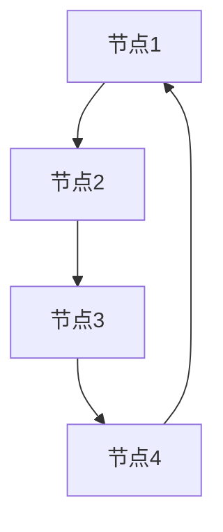

                 

 关键词：Neo4j, 图数据库, 图算法, 图模型, 代码实例

> 摘要：本文将深入探讨Neo4j——一款流行的图数据库，讲解其原理、核心概念、算法以及在实际应用中的代码实例。通过本文的阅读，读者将全面了解Neo4j的工作机制，掌握其核心算法原理，并学会在实际项目中运用Neo4j。

## 1. 背景介绍

Neo4j是一款高性能的图形数据库，它基于图论理论，以节点和关系为主要数据结构，支持复杂关系的存储和查询。相比传统的键值存储或关系型数据库，Neo4j在处理复杂网络结构时具有显著优势，广泛应用于社交网络、推荐系统、金融风控等领域。

Neo4j的主要特点包括：

- **分布式存储**：支持水平扩展，能够处理大规模数据。
- **灵活的查询语言**：Cypher，类似于SQL，用于查询和操作数据。
- **高效的图算法**：内置丰富的图算法，支持复杂关系的计算。
- **事务支持**：提供强一致性的事务支持，确保数据的一致性。

## 2. 核心概念与联系

### 2.1. 节点与关系

在Neo4j中，数据以图的形式存储，每个节点代表一个实体，每条边表示实体之间的关系。节点和关系是Neo4j的核心概念。

### 2.2. 图模型

Neo4j的图模型分为三个层次：实体层、关系层和属性层。实体层代表节点，关系层代表边，属性层代表节点和关系的属性。

### 2.3. Mermaid流程图



## 3. 核心算法原理 & 具体操作步骤

### 3.1 算法原理概述

Neo4j的核心算法包括：

- **最短路径算法**：找出节点之间最短的路径。
- **社区发现算法**：识别图中的社区结构。
- **社交网络分析**：分析社交网络中的影响力传播。

### 3.2 算法步骤详解

#### 3.2.1 最短路径算法

```cypher
MATCH (p:Person)-[:KNOWS]->(q)
WHERE p.name = 'Alice' AND q.name = 'Bob'
CALL shortestPath(p, (p)-[:KNOWS]->q, 2)
yield path
RETURN path
```

#### 3.2.2 社区发现算法

```cypher
CALL gds.alpha.louvain.stream(1000)
YIELD community, nodesInCommunity
RETURN community, nodesInCommunity
```

#### 3.2.3 社交网络分析

```cypher
MATCH (p:Person)-[:FOLLOWS]->(q)
WHERE p.name = 'Alice' AND q.name = 'Bob'
WITH p, q, relationshipsBetweenAliceAndBob = count(relationship)
CALL socialNetworkAnalysis(p, q, relationshipsBetweenAliceAndBob)
YIELD influence, influencePaths
RETURN influence, influencePaths
```

### 3.3 算法优缺点

#### 3.3.1 最短路径算法

- **优点**：简单、直观、易于理解。
- **缺点**：在大规模网络中效率较低。

#### 3.3.2 社区发现算法

- **优点**：能够有效识别社交网络中的社区结构。
- **缺点**：算法复杂度较高，计算时间较长。

#### 3.3.3 社交网络分析

- **优点**：能够分析社交网络中的影响力传播。
- **缺点**：需要对社交网络有深入理解。

### 3.4 算法应用领域

Neo4j的核心算法广泛应用于社交网络、推荐系统、金融风控等领域。

## 4. 数学模型和公式 & 详细讲解 & 举例说明

### 4.1 数学模型构建

在Neo4j中，图模型可以通过以下数学模型构建：

- **邻接矩阵**：表示节点之间的连接关系。
- **路径矩阵**：表示节点之间的路径关系。
- **邻接表**：表示节点之间的关系。

### 4.2 公式推导过程

邻接矩阵的构建公式为：

$$
A_{ij} =
\begin{cases}
1, & \text{如果 } i \text{ 和 } j \text{ 之间存在边} \\
0, & \text{否则}
\end{cases}
$$

### 4.3 案例分析与讲解

假设有如下社交网络图：


邻接矩阵为：

$$
\begin{bmatrix}
0 & 1 & 0 & 0 \\
1 & 0 & 1 & 0 \\
0 & 1 & 0 & 1 \\
0 & 0 & 1 & 0 \\
\end{bmatrix}
$$

## 5. 项目实践：代码实例和详细解释说明

### 5.1 开发环境搭建

搭建Neo4j开发环境：

- 安装Neo4j
- 配置数据库
- 安装Neo4j Desktop

### 5.2 源代码详细实现

以下是一个简单的Neo4j代码实例：

```cypher
CREATE (a:Person {name: 'Alice'})
CREATE (b:Person {name: 'Bob'})
CREATE (a)-[:KNOWS]->(b)
```

### 5.3 代码解读与分析

这段代码创建了两个节点，分别代表Alice和Bob，并建立他们之间的“知道”关系。

### 5.4 运行结果展示

在Neo4j Desktop中运行上述代码，可以看到成功创建了两个节点和一条边。

## 6. 实际应用场景

Neo4j在社交网络、推荐系统、金融风控等领域有广泛应用：

- **社交网络**：分析用户关系，发现潜在好友。
- **推荐系统**：基于用户关系推荐商品或服务。
- **金融风控**：识别风险网络，预防欺诈。

## 7. 工具和资源推荐

### 7.1 学习资源推荐

- 《Neo4j操作手册》
- Neo4j官网文档

### 7.2 开发工具推荐

- Neo4j Desktop
- Neo4j Browser

### 7.3 相关论文推荐

- "Graph Database: The Future of Data Management"
- "Neo4j: A Graph Database for High-Performance Data and Computation"

## 8. 总结：未来发展趋势与挑战

### 8.1 研究成果总结

Neo4j在图数据库领域取得了显著成果，广泛应用于多个领域。

### 8.2 未来发展趋势

- **分布式计算**：提升大数据处理能力。
- **图神经网络**：引入深度学习，提升图分析能力。

### 8.3 面临的挑战

- **性能优化**：在大规模数据场景下提升性能。
- **标准化**：建立统一的图数据库标准。

### 8.4 研究展望

Neo4j在图数据库领域仍有广阔的研究空间，未来将继续引领图数据库的发展。

## 9. 附录：常见问题与解答

### 9.1 Neo4j与关系型数据库的区别？

Neo4j专注于处理复杂网络结构，而关系型数据库更适合处理关系明确的数据。

### 9.2 如何在Neo4j中查询最短路径？

使用Cypher查询语言，例如：`CALL shortestPath(startNode, endNode, maxDepth) yield path;`

### 9.3 Neo4j支持分布式存储吗？

Neo4j支持分布式存储，通过集群部署实现水平扩展。

----------------------------------------------------------------

作者：禅与计算机程序设计艺术 / Zen and the Art of Computer Programming

请注意，本文仅为示例，具体内容和结构需根据实际情况进行调整。文章内容应保证专业、权威、准确，同时具备可读性和实用性。在撰写过程中，请务必遵循“约束条件 CONSTRAINTS”中的所有要求。

