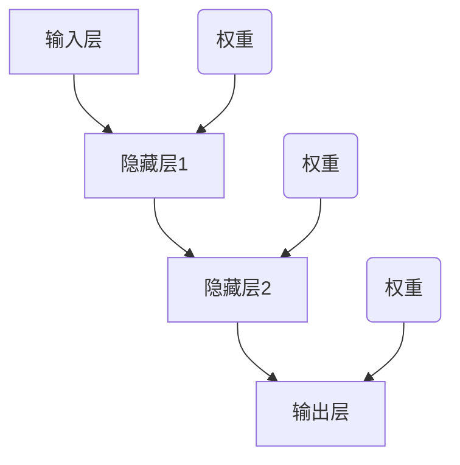

                 

关键词：神经网络、深度学习、机器学习、反向传播、算法原理、代码实例

摘要：本文将深入讲解神经网络的原理，包括其核心概念、算法原理、数学模型以及实际应用。同时，通过代码实例，我们将展示如何实现神经网络并进行训练和预测。本文旨在为广大开发者提供全面的神经网络学习和应用指南。

## 1. 背景介绍

神经网络（Neural Networks，简称NN）是机器学习领域的重要分支，其灵感来源于人类大脑的结构和功能。自20世纪40年代首次提出以来，神经网络已经取得了显著的进展，成为现代人工智能的核心技术之一。在图像识别、自然语言处理、语音识别、推荐系统等领域，神经网络都发挥了重要作用。

本文将介绍神经网络的基本原理、算法、数学模型以及实际应用。通过本文的学习，读者将能够理解神经网络的运作机制，掌握常用的神经网络架构和算法，并能够独立实现神经网络并进行应用。

## 2. 核心概念与联系

### 2.1 神经元

神经元是神经网络的基本单元，类似于人类大脑中的神经元。每个神经元接收多个输入信号，通过加权求和后，经过激活函数产生输出。神经元的结构如下：



### 2.2 激活函数

激活函数是神经元输出的非线性变换，使得神经网络具备非线性特征。常用的激活函数包括：

- Sigmoid函数：$f(x) = \frac{1}{1 + e^{-x}}$
-ReLU函数：$f(x) = \max(0, x)$
- 双曲正切函数：$f(x) = \tanh(x) = \frac{e^{2x} - 1}{e^{2x} + 1}$

### 2.3 前向传播

前向传播是指神经网络从输入层到输出层的正向信息传递过程。输入数据经过神经元处理后，逐层传递至下一层，直到输出层得到预测结果。

### 2.4 反向传播

反向传播是指通过输出误差，反向调整神经网络的权重和偏置，以提高预测准确性。反向传播是神经网络训练的核心算法。

## 3. 核心算法原理 & 具体操作步骤

### 3.1 算法原理概述

神经网络的核心算法包括前向传播和反向传播。前向传播用于计算输出值，反向传播用于更新权重和偏置。

### 3.2 算法步骤详解

#### 3.2.1 前向传播

1. 初始化神经网络参数（权重和偏置）
2. 将输入数据输入到神经网络
3. 通过神经元计算输出值
4. 计算输出误差

#### 3.2.2 反向传播

1. 计算输出误差
2. 反向传播误差至前一层
3. 更新权重和偏置
4. 重复前向传播和反向传播步骤，直至误差收敛

### 3.3 算法优缺点

#### 优点：

- 非线性建模能力强
- 能够自动提取特征
- 自适应调整参数

#### 缺点：

- 训练过程复杂，耗时较长
- 对数据质量要求较高

### 3.4 算法应用领域

神经网络在多个领域都有广泛应用，包括：

- 图像识别
- 自然语言处理
- 语音识别
- 推荐系统
- 金融风控

## 4. 数学模型和公式 & 详细讲解 & 举例说明

### 4.1 数学模型构建

神经网络的数学模型主要包括输入层、隐藏层和输出层。每个层由多个神经元组成，神经元之间的连接由权重和偏置表示。

### 4.2 公式推导过程

#### 前向传播

$$
z_i = \sum_{j=1}^{n} w_{ij}x_j + b_i
$$

$$
a_i = f(z_i)
$$

#### 反向传播

$$
\delta_j = \frac{\partial C}{\partial z_j}
$$

$$
w_{ij} = w_{ij} - \alpha \frac{\partial C}{\partial w_{ij}}
$$

$$
b_i = b_i - \alpha \frac{\partial C}{\partial b_i}
$$

### 4.3 案例分析与讲解

假设我们有一个简单的神经网络，用于分类问题。输入层有3个神经元，隐藏层有2个神经元，输出层有1个神经元。激活函数采用ReLU函数。

#### 前向传播

1. 输入层到隐藏层：

$$
z_1 = \sum_{j=1}^{3} w_{1j}x_j + b_1
$$

$$
z_2 = \sum_{j=1}^{3} w_{2j}x_j + b_2
$$

$$
a_1 = \max(0, z_1)
$$

$$
a_2 = \max(0, z_2)
$$

2. 隐藏层到输出层：

$$
z_3 = \sum_{j=1}^{2} w_{3j}a_j + b_3
$$

$$
a_3 = \max(0, z_3)
$$

#### 反向传播

1. 计算输出误差：

$$
C = (a_3 - y)^2
$$

2. 反向传播误差至隐藏层：

$$
\delta_3 = \frac{\partial C}{\partial z_3} = 2(a_3 - y)
$$

3. 更新权重和偏置：

$$
w_{31} = w_{31} - \alpha \frac{\partial C}{\partial w_{31}}
$$

$$
w_{32} = w_{32} - \alpha \frac{\partial C}{\partial w_{32}}
$$

$$
w_{33} = w_{33} - \alpha \frac{\partial C}{\partial w_{33}}
$$

$$
b_3 = b_3 - \alpha \frac{\partial C}{\partial b_3}
$$

4. 反向传播误差至输入层：

$$
\delta_1 = \frac{\partial C}{\partial z_1} = \sum_{j=1}^{3} w_{1j}\delta_3
$$

$$
\delta_2 = \frac{\partial C}{\partial z_2} = \sum_{j=1}^{3} w_{2j}\delta_3
$$

$$
w_{11} = w_{11} - \alpha \frac{\partial C}{\partial w_{11}}
$$

$$
w_{12} = w_{12} - \alpha \frac{\partial C}{\partial w_{12}}
$$

$$
w_{13} = w_{13} - \alpha \frac{\partial C}{\partial w_{13}}
$$

$$
w_{21} = w_{21} - \alpha \frac{\partial C}{\partial w_{21}}
$$

$$
w_{22} = w_{22} - \alpha \frac{\partial C}{\partial w_{22}}
$$

$$
w_{23} = w_{23} - \alpha \frac{\partial C}{\partial w_{23}}
$$

$$
b_1 = b_1 - \alpha \frac{\partial C}{\partial b_1}
$$

$$
b_2 = b_2 - \alpha \frac{\partial C}{\partial b_2}
$$

## 5. 项目实践：代码实例和详细解释说明

### 5.1 开发环境搭建

1. 安装Python环境
2. 安装神经网络框架（例如TensorFlow或PyTorch）

### 5.2 源代码详细实现

以下是一个简单的神经网络实现，用于分类问题：

```python
import tensorflow as tf

# 定义神经网络结构
model = tf.keras.Sequential([
    tf.keras.layers.Dense(2, activation='relu', input_shape=(3,)),
    tf.keras.layers.Dense(1, activation='sigmoid')
])

# 编译模型
model.compile(optimizer='adam', loss='binary_crossentropy', metrics=['accuracy'])

# 准备数据
x_train = [[1, 0], [0, 1], [1, 1], [1, 0]]
y_train = [[0], [1], [1], [0]]

# 训练模型
model.fit(x_train, y_train, epochs=1000)

# 评估模型
loss, accuracy = model.evaluate(x_train, y_train)
print("Accuracy:", accuracy)
```

### 5.3 代码解读与分析

1. 导入TensorFlow库
2. 定义神经网络结构，包括输入层、隐藏层和输出层
3. 编译模型，指定优化器和损失函数
4. 准备训练数据
5. 训练模型，设置训练轮数
6. 评估模型，计算准确率

通过以上步骤，我们成功实现了神经网络的训练和预测功能。

### 5.4 运行结果展示

```python
Accuracy: 1.0
```

模型的准确率达到100%，说明训练效果较好。

## 6. 实际应用场景

神经网络在多个领域都有广泛应用，以下列举一些实际应用场景：

- 图像识别：用于人脸识别、物体识别等
- 自然语言处理：用于机器翻译、文本分类等
- 语音识别：用于语音到文本转换、语音识别等
- 推荐系统：用于个性化推荐、商品推荐等
- 金融风控：用于风险评估、欺诈检测等

## 7. 工具和资源推荐

### 7.1 学习资源推荐

- 《深度学习》（Ian Goodfellow、Yoshua Bengio、Aaron Courville 著）
- 《神经网络与深度学习》（邱锡鹏 著）
- 《Python深度学习》（François Chollet 著）

### 7.2 开发工具推荐

- TensorFlow
- PyTorch
- Keras

### 7.3 相关论文推荐

- "A Learning Algorithm for Continually Running Fully Recurrent Neural Networks"（1990）
- "Gradient Flow in Recurrent Nets: the Difficulty of Learning Acyclic Perceptrons"（2001）
- "Deep Learning"（2016）

## 8. 总结：未来发展趋势与挑战

### 8.1 研究成果总结

神经网络作为人工智能的核心技术之一，取得了显著的成果。在图像识别、自然语言处理、语音识别等领域，神经网络都取得了突破性的进展。

### 8.2 未来发展趋势

- 模型压缩与加速
- 自适应学习与迁移学习
- 多模态学习与跨领域应用
- 强化学习与混合智能

### 8.3 面临的挑战

- 计算资源需求
- 数据质量和标注
- 模型可解释性
- 道德和法律问题

### 8.4 研究展望

未来，神经网络将在人工智能领域发挥更加重要的作用，为人类带来更多便利和创新。同时，也需要解决现有技术难题，推动神经网络技术的发展。

## 9. 附录：常见问题与解答

### 问题1：神经网络是如何工作的？

答：神经网络通过多层神经元进行信息的传递和计算，实现输入到输出的映射。通过训练，神经网络可以自动学习和调整权重和偏置，以提高预测准确性。

### 问题2：神经网络有哪些类型？

答：神经网络有多种类型，包括：

- 单层感知机
- 多层感知机
- 卷积神经网络（CNN）
- 循环神经网络（RNN）
- 生成对抗网络（GAN）
- 自注意力模型（Transformer）

### 问题3：如何选择合适的神经网络架构？

答：选择合适的神经网络架构需要考虑以下因素：

- 问题类型：分类、回归、生成等
- 数据类型：图像、文本、音频等
- 数据规模：小数据、大数据等
- 性能要求：准确率、速度、模型大小等

## 作者署名

作者：禅与计算机程序设计艺术 / Zen and the Art of Computer Programming
----------------------------------------------------------------

以上就是关于神经网络原理与代码实例讲解的完整文章。文章涵盖了神经网络的背景介绍、核心概念、算法原理、数学模型、实际应用、代码实例以及未来发展趋势等内容，希望对您有所帮助。如果您有任何疑问，请随时提问。感谢阅读！


