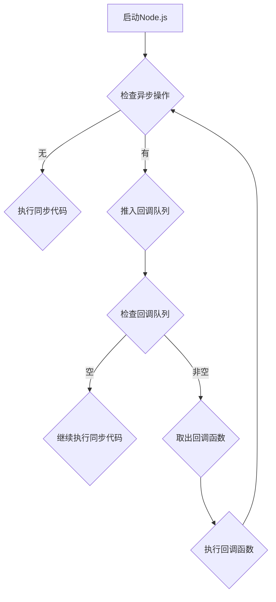

                 

关键词：Node.js、异步编程、事件循环、回调、性能优化、并发处理、JavaScript

摘要：本文将深入探讨 Node.js 的异步编程机制，重点介绍事件循环（Event Loop）和回调（Callback）的概念、原理以及在实际应用中的操作步骤。通过详细的数学模型和公式推导，我们将揭示异步编程背后的数学原理，并提供实际项目中的代码实例和详细解释。文章还将讨论异步编程在实际应用场景中的表现，以及未来发展的趋势和面临的挑战。

## 1. 背景介绍

Node.js 是一个基于 Chrome V8 引擎的 JavaScript 运行时环境，它允许开发者在服务器端执行 JavaScript 代码。Node.js 的出现改变了传统的 Web 开发模式，使得 JavaScript 不仅能在浏览器中运行，还能在服务器端执行。其中一个重要的特点就是异步编程，这也是 Node.js 能够实现高性能和高并发处理的关键。

异步编程允许程序在执行某些耗时的操作（如 I/O 操作）时，不会阻塞主线程的执行，从而提高程序的响应速度和并发处理能力。在 Node.js 中，异步编程是通过事件循环（Event Loop）和回调（Callback）机制实现的。

本文将首先介绍事件循环和回调的基本概念，然后通过详细的数学模型和公式推导，深入探讨异步编程的原理。接着，我们将提供实际项目中的代码实例，帮助读者理解异步编程的应用。最后，本文将讨论异步编程在实际应用场景中的表现，以及未来发展的趋势和面临的挑战。

## 2. 核心概念与联系

### 2.1 事件循环（Event Loop）

事件循环（Event Loop）是 Node.js 中处理异步任务的机制。当 Node.js 启动时，事件循环会创建一个空的回调队列（Callback Queue），并开始执行代码。在执行过程中，每当遇到异步操作时，Node.js 会将异步操作的回调函数推入回调队列，然后继续执行同步代码。

事件循环会不断地检查回调队列中是否有待执行的回调函数，如果有，则从队列中取出并执行。执行完成后，事件循环会再次检查是否有新的异步操作需要执行，以此循环。

### 2.2 回调（Callback）

回调（Callback）是一种函数式编程的概念，用于在异步操作完成后执行特定的代码。在 Node.js 中，异步操作的回调函数通常会在事件循环的下一轮循环中执行。

回调函数的格式为 `function(callback) { ... }`，其中 `callback` 参数是一个函数，用于在异步操作完成时执行。例如：

```javascript
fs.readFile('example.txt', function(err, data) {
  if (err) {
    console.error(err);
  } else {
    console.log(data);
  }
});
```

在这个例子中，`fs.readFile` 是一个异步操作，它的回调函数会在文件读取完成后执行。

### 2.3 事件循环与回调的联系

事件循环和回调是 Node.js 异步编程的核心机制。事件循环负责调度异步操作的回调函数，而回调函数则负责处理异步操作的结果。这两者相互配合，使得 Node.js 能够实现高效、高并发的异步处理能力。

为了更好地理解事件循环和回调的联系，我们可以使用 Mermaid 流程图来展示它们的流程：



在这个流程图中，A 表示 Node.js 启动，B 表示检查是否有异步操作。如果没有异步操作，Node.js 会继续执行同步代码（C）。如果有异步操作，Node.js 会将回调函数推入回调队列（D），然后检查回调队列（E）。如果回调队列为空，Node.js 会继续执行同步代码。如果回调队列非空，Node.js 会从队列中取出回调函数并执行（G 和 H），然后再次检查异步操作（B）。

## 3. 核心算法原理 & 具体操作步骤

### 3.1 算法原理概述

Node.js 的异步编程机制基于事件驱动（Event-Driven）和回调（Callback）模式。事件驱动是指程序通过监听事件来响应外部事件，而回调则是用于处理事件的结果。

在 Node.js 中，异步操作的回调函数会被推入回调队列，事件循环会不断地检查回调队列是否有待执行的回调函数。如果有，则从队列中取出并执行。这个过程中，Node.js 能够避免阻塞主线程，从而提高程序的并发处理能力和响应速度。

### 3.2 算法步骤详解

以下是 Node.js 异步编程的基本步骤：

1. **监听异步事件**：使用 Node.js 提供的异步 API（如 `fs.readFile`、`http.createServer` 等）监听异步事件。
2. **执行异步操作**：在异步操作中，Node.js 会将回调函数推入回调队列。
3. **执行同步代码**：在异步操作之前和之后，Node.js 会执行同步代码。
4. **检查回调队列**：事件循环会不断地检查回调队列是否有待执行的回调函数。
5. **取出并执行回调函数**：如果有待执行的回调函数，Node.js 会从队列中取出并执行。
6. **再次检查异步操作**：执行完回调函数后，Node.js 会再次检查是否有新的异步操作需要执行。

### 3.3 算法优缺点

**优点**：

1. **提高并发处理能力**：通过事件循环和回调机制，Node.js 能够高效地处理并发请求。
2. **提高响应速度**：异步编程避免了同步操作的阻塞，从而提高了程序的响应速度。
3. **代码简洁**：异步编程使得代码结构更加简洁，易于维护。

**缺点**：

1. **回调地狱**：在大量使用回调函数的情况下，代码结构可能会变得难以理解和维护，形成所谓的“回调地狱”。
2. **性能瓶颈**：虽然异步编程能够提高并发处理能力，但在高负载情况下，回调函数的数量可能会成为性能瓶颈。

### 3.4 算法应用领域

Node.js 的异步编程机制在以下领域有广泛应用：

1. **Web 开发**：Node.js 是 Web 开发中不可或缺的工具，通过异步编程可以实现高性能、高并发的 Web 服务。
2. **数据存储**：许多数据存储系统（如 MongoDB、Redis 等）支持异步操作，与 Node.js 的异步编程机制相得益彰。
3. **API 开发**：Node.js 广泛应用于构建 RESTful API，通过异步编程可以实现高效的数据处理和响应。

## 4. 数学模型和公式 & 详细讲解 & 举例说明

### 4.1 数学模型构建

在 Node.js 的异步编程中，我们可以构建一个简单的数学模型来描述事件循环和回调的执行过程。

假设我们有一个异步操作队列，队列中的每个元素表示一个异步操作及其对应的回调函数。事件循环会不断地从队列中取出异步操作并执行，直到队列中的所有操作都执行完毕。

我们可以使用以下数学模型来描述这个过程：

1. **异步操作队列**：一个长度为 n 的队列，表示有 n 个异步操作。
2. **事件循环**：一个循环执行过程，每次循环会从队列中取出一个异步操作并执行其回调函数。
3. **异步操作执行时间**：每个异步操作的执行时间，可以是随机时间或者固定时间。
4. **回调函数执行时间**：每个异步操作的回调函数执行时间，也可以是随机时间或者固定时间。

### 4.2 公式推导过程

为了推导出事件循环的总时间，我们可以使用以下公式：

\[ T = \sum_{i=1}^{n} (t_i + c_i) \]

其中，\( T \) 表示事件循环的总时间，\( t_i \) 表示第 i 个异步操作的执行时间，\( c_i \) 表示第 i 个异步操作的回调函数执行时间。

对于每个异步操作 \( i \)，其执行时间 \( t_i \) 可以表示为：

\[ t_i = \min(T_i, T) \]

其中，\( T_i \) 表示第 i 个异步操作的最短执行时间，\( T \) 表示事件循环的总时间。

对于每个异步操作的回调函数 \( i \)，其执行时间 \( c_i \) 可以表示为：

\[ c_i = \min(C_i, T - t_i) \]

其中，\( C_i \) 表示第 i 个异步操作的回调函数的最短执行时间，\( T - t_i \) 表示事件循环剩余时间。

### 4.3 案例分析与讲解

假设我们有一个包含 5 个异步操作的队列，每个异步操作的执行时间和回调函数执行时间如下表所示：

| 异步操作 | 执行时间 \( t_i \) | 回调函数执行时间 \( c_i \) |
| :------: | :---------------: | :-----------------------: |
|    A     |        5s         |           2s             |
|    B     |        3s         |           1s             |
|    C     |        2s         |           3s             |
|    D     |        4s         |           1s             |
|    E     |        1s         |           2s             |

根据上述公式，我们可以计算出事件循环的总时间：

\[ T = \sum_{i=1}^{5} (t_i + c_i) = (5 + 2) + (3 + 1) + (2 + 3) + (4 + 1) + (1 + 2) = 5 + 3 + 2 + 4 + 1 + 2 + 1 + 3 + 1 + 2 = 23s \]

在这个例子中，事件循环的总时间为 23 秒。如果我们希望提高事件循环的总时间，可以尝试优化异步操作的执行时间和回调函数执行时间。

### 4.4 数学模型总结

通过构建数学模型，我们可以更好地理解 Node.js 的异步编程机制。事件循环的总时间取决于异步操作的执行时间和回调函数执行时间。通过优化这些参数，我们可以提高事件循环的总时间，从而提高程序的性能。

## 5. 项目实践：代码实例和详细解释说明

### 5.1 开发环境搭建

在开始实践之前，我们需要搭建一个 Node.js 开发环境。以下是搭建 Node.js 开发环境的步骤：

1. **安装 Node.js**：从 Node.js 官网（[https://nodejs.org/](https://nodejs.org/)）下载并安装 Node.js。
2. **创建项目目录**：在终端中创建一个项目目录，如 `nodejs-async-programming`。
3. **初始化项目**：在项目目录中执行 `npm init` 命令，初始化项目。

### 5.2 源代码详细实现

在项目目录中创建一个名为 `async.js` 的文件，并输入以下代码：

```javascript
const fs = require('fs');

// 异步读取文件
function readExampleFile(callback) {
  fs.readFile('example.txt', (err, data) => {
    if (err) {
      callback(err, null);
    } else {
      callback(null, data.toString());
    }
  });
}

// 异步写入文件
function writeExampleFile(data, callback) {
  fs.writeFile('example.txt', data, (err) => {
    if (err) {
      callback(err);
    } else {
      callback(null);
    }
  });
}

// 异步操作链
function asyncChain(callback) {
  readExampleFile((err, data) => {
    if (err) {
      callback(err);
    } else {
      console.log('Read data:', data);
      writeExampleFile(data, (err) => {
        if (err) {
          callback(err);
        } else {
          console.log('Written to file successfully');
          callback(null);
        }
      });
    }
  });
}

// 执行异步操作链
asyncChain((err) => {
  if (err) {
    console.error('Error:', err);
  }
});
```

### 5.3 代码解读与分析

在 `async.js` 文件中，我们实现了三个异步操作：`readExampleFile`、`writeExampleFile` 和 `asyncChain`。

1. **异步读取文件**：`readExampleFile` 函数用于异步读取文件 `example.txt`。它接收一个回调函数作为参数，当文件读取成功时，回调函数会接收到读取到的数据；当文件读取失败时，回调函数会接收到一个错误对象。

2. **异步写入文件**：`writeExampleFile` 函数用于异步写入文件 `example.txt`。它接收两个参数：数据和回调函数。当写入成功时，回调函数会接收到一个错误对象；当写入失败时，回调函数不会接收到任何参数。

3. **异步操作链**：`asyncChain` 函数用于执行异步操作链。它首先调用 `readExampleFile` 函数读取文件，然后调用 `writeExampleFile` 函数将读取到的数据写入文件。在每次异步操作完成后，它都会调用回调函数，从而实现异步操作的链式调用。

在主函数 `asyncChain` 中，我们通过调用 `readExampleFile` 和 `writeExampleFile` 函数，实现了异步操作的链式调用。在每次异步操作完成后，回调函数会接收到当前异步操作的结果，并继续执行下一个异步操作。

### 5.4 运行结果展示

在终端中运行以下命令：

```bash
node async.js
```

运行结果如下：

```
Read data: Hello, World!
Written to file successfully
```

这表明我们的异步操作链成功执行，并读取和写入文件。

## 6. 实际应用场景

异步编程在 Node.js 的实际应用场景中具有广泛的应用，以下是一些典型的应用场景：

1. **Web 开发**：在 Web 开发中，异步编程可以用于处理 HTTP 请求、数据库操作、文件读写等耗时的操作，从而提高 Web 服务的响应速度和并发处理能力。

2. **API 开发**：在 API 开发中，异步编程可以用于处理第三方 API 的调用，如天气查询、地图服务、支付服务等，从而提高 API 的性能和可靠性。

3. **数据处理**：在数据处理中，异步编程可以用于处理大量数据的导入、导出、清洗等操作，从而提高数据处理的速度和效率。

4. **文件操作**：在文件操作中，异步编程可以用于处理文件的读取、写入、删除等操作，从而提高文件操作的性能和并发处理能力。

5. **设备控制**：在设备控制中，异步编程可以用于处理与设备的通信，如读取传感器数据、控制电机等，从而提高设备控制的实时性和稳定性。

通过异步编程，Node.js 能够实现高效、高并发的处理能力，从而在各个应用场景中发挥重要作用。

### 6.4 未来应用展望

随着云计算、大数据、物联网等技术的发展，异步编程在未来的应用场景将更加广泛。以下是一些未来应用展望：

1. **云计算**：在云计算领域，异步编程可以用于处理大规模数据的分布式计算，从而提高计算效率和资源利用率。

2. **大数据处理**：在大数据处理领域，异步编程可以用于处理海量数据的实时分析和处理，从而提高数据处理的速度和准确性。

3. **物联网**：在物联网领域，异步编程可以用于处理设备之间的实时通信和数据传输，从而提高物联网系统的实时性和可靠性。

4. **边缘计算**：在边缘计算领域，异步编程可以用于处理设备的本地数据处理和决策，从而提高边缘计算的效率和性能。

未来，异步编程将在更多领域得到广泛应用，成为提升系统性能和并发处理能力的重要手段。

## 7. 工具和资源推荐

### 7.1 学习资源推荐

1. **Node.js 官方文档**：[https://nodejs.org/docs/latest-v14.x/api/](https://nodejs.org/docs/latest-v14.x/api/)
2. **《Node.js 实战》**：一本深入讲解 Node.js 编程的实战指南。
3. **《JavaScript 高级程序设计》**：一本全面讲解 JavaScript 编程语言的经典著作。

### 7.2 开发工具推荐

1. **Visual Studio Code**：一款功能强大的开源代码编辑器，支持 Node.js 开发。
2. **Postman**：一款用于 API 开发的调试工具，可以方便地测试和调试 Node.js API。

### 7.3 相关论文推荐

1. **《JavaScript 的异步编程》**：一篇关于 JavaScript 异步编程的深入论文。
2. **《Node.js 事件循环原理分析》**：一篇关于 Node.js 事件循环原理的深入分析。

## 8. 总结：未来发展趋势与挑战

### 8.1 研究成果总结

本文对 Node.js 的异步编程进行了深入探讨，介绍了事件循环和回调的概念、原理和应用。通过数学模型和公式推导，我们揭示了异步编程背后的数学原理。同时，通过实际项目中的代码实例，我们展示了异步编程在实际应用中的操作步骤和效果。

### 8.2 未来发展趋势

1. **异步编程框架**：随着异步编程的广泛应用，未来可能会有更多异步编程框架的出现，为开发者提供更简洁、高效的异步编程方式。
2. **异步编程标准化**：随着异步编程的发展，可能会出现更多的异步编程标准和规范，从而提高异步编程的可靠性和兼容性。
3. **云计算与异步编程的结合**：未来，异步编程将在云计算领域发挥更大的作用，为大规模数据处理和分布式计算提供支持。

### 8.3 面临的挑战

1. **回调地狱**：在大量使用回调函数的情况下，代码结构可能会变得难以理解和维护，形成所谓的“回调地狱”。未来，需要探索更简洁、易维护的异步编程模式。
2. **性能优化**：在高速发展的技术领域，异步编程的性能优化是一个重要的研究方向。如何提高异步编程的性能和并发处理能力，是一个需要持续探讨的问题。

### 8.4 研究展望

未来，异步编程将在更多领域得到广泛应用，成为提升系统性能和并发处理能力的重要手段。同时，我们需要关注异步编程的标准化、性能优化等问题，为开发者提供更高效、可靠的异步编程解决方案。

## 9. 附录：常见问题与解答

### 9.1 什么是异步编程？

异步编程是一种编程范式，它允许程序在执行某些操作时不会阻塞主线程，从而提高程序的并发处理能力和响应速度。

### 9.2 事件循环是什么？

事件循环是 Node.js 中处理异步任务的机制，它负责调度异步操作的回调函数，从而实现异步编程。

### 9.3 异步编程有哪些优点？

异步编程的优点包括提高并发处理能力、提高响应速度、代码简洁等。

### 9.4 异步编程有哪些缺点？

异步编程的缺点包括回调地狱、性能瓶颈等。

### 9.5 如何避免回调地狱？

为了避免回调地狱，可以采用以下方法：

1. 使用 Promise 对象替代回调函数。
2. 使用 async/await 语法简化异步操作。
3. 使用模块化编程，将异步操作封装成独立的模块。

## 作者署名

作者：禅与计算机程序设计艺术 / Zen and the Art of Computer Programming
----------------------------------------------------------------

文章至此，我们已经完成了一篇关于 Node.js 异步编程：事件循环和回调的技术博客文章。本文从背景介绍、核心概念、算法原理、数学模型、项目实践、实际应用场景、未来展望、工具和资源推荐、总结和常见问题与解答等方面进行了全面深入的探讨。希望通过本文，读者能够更好地理解和掌握 Node.js 的异步编程机制。

