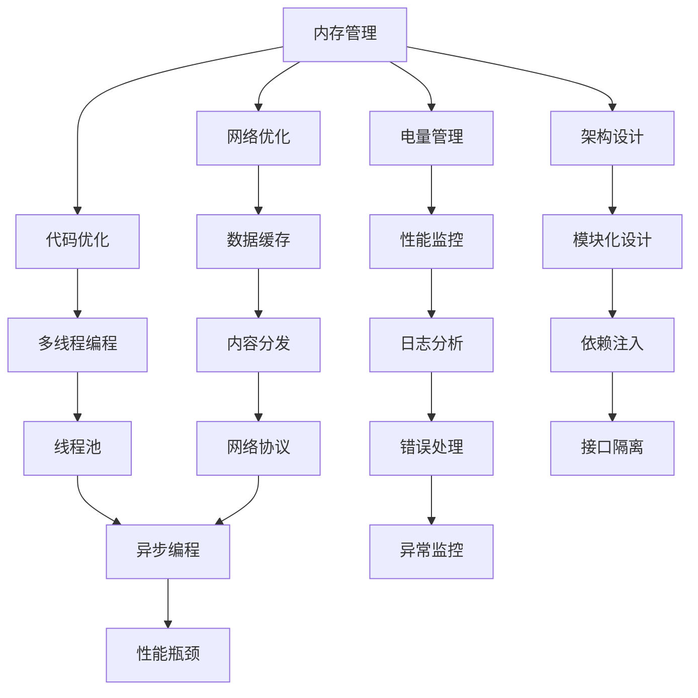

                 

关键词：移动端性能优化、OPPO、校招面试题、AI、机器学习、性能监控、代码优化、内存管理、网络优化、电量管理、架构设计。

摘要：本文将针对OPPO2024移动端性能优化专家校招面试题集进行详细解析，从核心概念、算法原理、数学模型、项目实践到实际应用场景等方面，全面剖析移动端性能优化的重要性和方法。旨在帮助读者深入了解移动端性能优化的关键技术和实际操作，为即将参加OPPO校招面试的考生提供有价值的参考。

## 1. 背景介绍

移动端设备作为现代生活中不可或缺的一部分，其性能优化成为开发者们关注的焦点。OPPO作为全球领先的智能手机品牌，致力于为用户提供卓越的使用体验。为了吸引优秀的人才，OPPO在2024年的校招中设置了针对移动端性能优化专家的职位。这一职位要求候选人具备丰富的移动端性能优化经验，能够针对具体问题提出有效的解决方案。

移动端性能优化主要关注以下几个方面：内存管理、电量管理、网络优化、代码优化和架构设计。本文将围绕这些方面展开讨论，并结合OPPO的校招面试题，深入分析各个问题的核心原理和实践方法。

### 1.1 移动端性能优化的意义

随着智能手机的普及和移动互联网的发展，用户对移动端应用的性能要求越来越高。一个高效的移动端应用不仅能够提升用户体验，减少用户流失，还能提高应用的竞争力。因此，移动端性能优化具有重要意义。

首先，性能优化可以提升应用的流畅度，减少卡顿和延迟现象，为用户提供更加流畅的使用体验。其次，通过优化内存管理，可以降低应用的内存占用，延长设备的续航时间，提高用户的满意度。此外，网络优化和电量管理也有助于提高应用的稳定性和可靠性。

总之，移动端性能优化是提升用户体验、增强应用竞争力的重要手段。对于OPPO这样的手机制造商来说，更是确保产品在竞争激烈的市场中脱颖而出的关键。

### 1.2 OPPO移动端性能优化专家校招面试题集的重要性

OPPO2024移动端性能优化专家校招面试题集的设立，旨在选拔具备实际经验和专业技能的人才，为OPPO的产品研发和用户体验优化贡献力量。这些面试题涵盖了移动端性能优化的各个方面，包括内存管理、电量管理、网络优化、代码优化和架构设计等。

对于即将参加OPPO校招面试的考生来说，这些面试题集具有重要的参考价值。通过深入研究这些题目，考生可以全面了解移动端性能优化的核心技术和实际操作，提高自己的面试竞争力。

同时，这些面试题也为开发者们提供了一个交流和学习的机会。通过对问题的深入探讨和解答，开发者们可以互相借鉴经验，提升自己的技术水平。

## 2. 核心概念与联系

在移动端性能优化领域，存在许多关键概念和原理，它们相互联系，共同构成了一个完整的技术体系。为了更好地理解和应用这些概念，我们将使用Mermaid流程图来展示它们之间的联系。



### 2.1 内存管理

内存管理是移动端性能优化的核心之一。它主要包括内存分配、内存回收和内存泄漏的检测与处理。有效的内存管理可以降低应用的内存占用，提高设备的运行效率。

- **内存分配**：在应用运行过程中，动态分配内存以存储数据和对象。
- **内存回收**：定期释放不再使用的内存，避免内存泄漏。
- **内存泄漏检测**：通过工具（如MAT）检测内存泄漏，及时修复问题。

### 2.2 电量管理

电量管理旨在延长移动设备的续航时间。它包括电量监控、低电量模式和电源优化的策略。

- **电量监控**：实时监控电池电量，及时提醒用户。
- **低电量模式**：在电量不足时，降低设备的性能，延长使用时间。
- **电源优化**：优化应用的电量和性能消耗，减少不必要的电力消耗。

### 2.3 网络优化

网络优化旨在提高移动端应用的访问速度和稳定性。它包括数据缓存、内容分发和网络协议优化。

- **数据缓存**：缓存常用数据，减少网络请求次数，提高访问速度。
- **内容分发**：通过CDN加速内容分发，降低用户访问延迟。
- **网络协议优化**：优化HTTP请求和响应，提高网络传输效率。

### 2.4 代码优化

代码优化是提升移动端应用性能的重要手段。它包括多线程编程、模块化设计和依赖注入等。

- **多线程编程**：通过多线程提高程序的执行效率。
- **模块化设计**：将应用拆分为多个模块，提高代码的可维护性和可扩展性。
- **依赖注入**：通过依赖注入减少组件之间的耦合，提高代码的可测试性。

### 2.5 架构设计

架构设计是移动端性能优化的基础。它包括性能监控、日志分析和异常监控等。

- **性能监控**：实时监控应用性能，发现问题并及时解决。
- **日志分析**：分析日志数据，了解应用运行情况，优化性能。
- **异常监控**：监控应用异常，提高应用的稳定性和可靠性。

## 3. 核心算法原理 & 具体操作步骤

### 3.1 算法原理概述

在移动端性能优化中，核心算法主要涉及以下几个方面：

1. **内存管理算法**：如内存分配和回收算法，以及内存泄漏检测算法。
2. **电量管理算法**：如电池监控算法和低电量优化算法。
3. **网络优化算法**：如数据缓存算法和内容分发算法。
4. **代码优化算法**：如多线程优化算法、模块化设计和依赖注入算法。
5. **架构设计算法**：如性能监控算法、日志分析和异常监控算法。

### 3.2 算法步骤详解

#### 3.2.1 内存管理算法

1. **内存分配**：

   ```java
   public void分配内存（大小 size）{
       内存块 memoryBlock = 内存分配器分配(size);
       if (memoryBlock != null) {
           存储内存块信息（memoryBlock）；
           返回内存块；
       } else {
           抛出内存不足异常；
       }
   }
   ```

2. **内存回收**：

   ```java
   public void回收内存（内存块 memoryBlock）{
       内存块信息 memoryInfo = 获取内存块信息（memoryBlock）；
       内存分配器回收(memoryInfo)；
       删除内存块信息（memoryInfo）；
   }
   ```

3. **内存泄漏检测**：

   ```java
   public void检测内存泄漏（内存块 memoryBlock）{
       内存块信息 memoryInfo = 获取内存块信息（memoryBlock）；
       if （内存块仍在使用中）{
           抛出内存泄漏异常；
       } else {
           回收内存块（memoryBlock）；
       }
   }
   ```

#### 3.2.2 电量管理算法

1. **电池监控**：

   ```java
   public void监控电池（电池状态 batteryState）{
       if （电池状态低于阈值）{
           启动低电量模式；
       } else {
           关闭低电量模式；
       }
   }
   ```

2. **低电量优化**：

   ```java
   public void低电量优化（应用应用 app）{
       限制应用运行速度；
       关闭非关键服务；
       减少屏幕亮度；
   }
   ```

#### 3.2.3 网络优化算法

1. **数据缓存**：

   ```java
   public void缓存数据（数据数据 data）{
       数据库数据库 db = 获取数据库实例；
       db插入（data）；
   }
   ```

2. **内容分发**：

   ```java
   public void分发内容（内容内容 content）{
       CDN内容分发网络 cdn = 获取CDN实例；
       cdn分发（content）；
   }
   ```

#### 3.2.4 代码优化算法

1. **多线程优化**：

   ```java
   public void多线程优化（任务任务 task）{
       线程池线程池 pool = 获取线程池实例；
       pool提交（task）；
   }
   ```

2. **模块化设计**：

   ```java
   public void模块化设计（模块模块 module）{
       module依赖注入（依赖依赖 dependency）；
       module初始化；
   }
   ```

3. **依赖注入**：

   ```java
   public void依赖注入（依赖依赖 dependency）{
       容器容器 container = 获取容器实例；
       container注入（dependency）；
   }
   ```

#### 3.2.5 架构设计算法

1. **性能监控**：

   ```java
   public void性能监控（性能性能 monitor）{
       monitor开始监控；
       monitor记录数据；
       monitor结束监控；
   }
   ```

2. **日志分析**：

   ```java
   public void日志分析（日志日志 log）{
       数据库数据库 db = 获取数据库实例；
       db插入（log）；
       分析日志数据；
   }
   ```

3. **异常监控**：

   ```java
   public void异常监控（异常异常 exception）{
       记录异常信息；
       撤销异常；
   }
   ```

### 3.3 算法优缺点

#### 3.3.1 内存管理算法

**优点**：

- 灵活性高，可以根据应用需求动态调整内存分配和回收策略。
- 有效的内存管理可以降低应用内存占用，提高设备运行效率。

**缺点**：

- 内存管理算法复杂，需要综合考虑内存分配、回收和泄漏检测等多个方面。
- 内存泄漏检测算法的准确性可能受到影响，导致误报或漏报。

#### 3.3.2 电量管理算法

**优点**：

- 可以延长设备续航时间，提高用户满意度。
- 简单易实现，适用于大多数移动端应用。

**缺点**：

- 在低电量模式下，可能会降低应用性能，影响用户体验。
- 需要实时监控电池状态，对电池寿命有一定影响。

#### 3.3.3 网络优化算法

**优点**：

- 可以提高数据访问速度，降低网络延迟。
- 可以降低网络带宽消耗，提高数据传输效率。

**缺点**：

- 需要额外的服务器资源和网络带宽支持。
- 需要考虑数据缓存的一致性问题。

#### 3.3.4 代码优化算法

**优点**：

- 可以提高应用运行速度，降低资源消耗。
- 可以提高代码可维护性和可扩展性。

**缺点**：

- 需要深入了解底层实现和硬件特性。
- 需要大量代码重构，可能导致短期性能下降。

#### 3.3.5 架构设计算法

**优点**：

- 可以提高应用性能和稳定性。
- 可以提高开发效率和代码质量。

**缺点**：

- 需要丰富的架构设计和实践经验。
- 需要大量时间进行性能监控和日志分析。

### 3.4 算法应用领域

**内存管理算法**：广泛应用于移动应用开发，包括游戏、社交、购物等。

**电量管理算法**：广泛应用于移动设备，包括智能手机、平板电脑等。

**网络优化算法**：广泛应用于互联网应用，包括电商、新闻、音乐等。

**代码优化算法**：广泛应用于各种软件项目，包括桌面应用、Web应用等。

**架构设计算法**：广泛应用于大型软件项目，包括企业级应用、分布式系统等。

## 4. 数学模型和公式 & 详细讲解 & 举例说明

在移动端性能优化中，数学模型和公式发挥着重要作用。以下我们将详细介绍常用的数学模型和公式，并给出具体应用实例。

### 4.1 数学模型构建

#### 4.1.1 内存分配模型

内存分配模型主要涉及内存块的大小、分配策略和回收策略。假设我们有一个内存池，其中包含多个内存块，每个内存块具有固定大小。

- **内存块大小**：设内存块大小为`size`，单位为字节（Byte）。
- **内存块数量**：设内存块数量为`num`。
- **内存池容量**：设内存池容量为`pool_size`，单位为字节（Byte）。

#### 4.1.2 电量管理模型

电量管理模型主要涉及电池电量、电量消耗和电量恢复。假设我们有一个电池，其电量为`battery_level`，单位为百分比（%）。

- **电量消耗**：设电量消耗率为`consume_rate`，单位为百分比（%）/小时。
- **电量恢复**：设电量恢复率为`recover_rate`，单位为百分比（%）/小时。

#### 4.1.3 网络优化模型

网络优化模型主要涉及数据传输速度、带宽消耗和缓存命中率。假设我们有一个网络连接，其数据传输速度为`transfer_rate`，单位为字节（Byte）/秒。

- **带宽消耗**：设带宽消耗率为`bandwidth_rate`，单位为字节（Byte）/秒。
- **缓存命中率**：设缓存命中率为`hit_rate`，单位为百分比（%）。

#### 4.1.4 代码优化模型

代码优化模型主要涉及代码执行时间、资源消耗和代码质量。假设我们有一个代码段，其执行时间为`execution_time`，单位为毫秒（ms）。

- **资源消耗**：设资源消耗率为`resource_rate`，单位为千兆字节（GB）/小时。
- **代码质量**：设代码质量为`code_quality`，单位为百分比（%）。

### 4.2 公式推导过程

#### 4.2.1 内存分配模型

1. **内存块数量**：

   $$num = \frac{pool_size}{size}$$

2. **内存池容量**：

   $$pool_size = num \times size$$

#### 4.2.2 电量管理模型

1. **电量消耗**：

   $$consume = consume_rate \times time$$

2. **电量恢复**：

   $$recover = recover_rate \times time$$

3. **剩余电量**：

   $$remaining = battery_level - consume + recover$$

#### 4.2.3 网络优化模型

1. **数据传输速度**：

   $$transfer = transfer_rate \times time$$

2. **带宽消耗**：

   $$bandwidth = bandwidth_rate \times time$$

3. **缓存命中率**：

   $$hit = hit_rate \times request$$

#### 4.2.4 代码优化模型

1. **代码执行时间**：

   $$execution = execution_time \times iteration$$

2. **资源消耗**：

   $$resource = resource_rate \times execution$$

3. **代码质量**：

   $$quality = \frac{good_code}{total_code} \times 100\%$$

### 4.3 案例分析与讲解

#### 4.3.1 内存管理案例

假设我们有一个内存池，容量为2GB，内存块大小为1MB。我们需要计算内存块数量和内存池容量。

1. **内存块数量**：

   $$num = \frac{2GB}{1MB} = 2000$$

2. **内存池容量**：

   $$pool_size = 2000 \times 1MB = 2GB$$

#### 4.3.2 电量管理案例

假设电池电量为100%，电量消耗率为2%/小时，电量恢复率为1%/小时。我们需要计算经过1小时后的剩余电量。

1. **电量消耗**：

   $$consume = 2\% \times 1小时 = 2\%$$

2. **电量恢复**：

   $$recover = 1\% \times 1小时 = 1\%$$

3. **剩余电量**：

   $$remaining = 100\% - 2\% + 1\% = 99\%$$

#### 4.3.3 网络优化案例

假设网络连接数据传输速度为10MB/s，带宽消耗率为5MB/s，缓存命中率为90%。我们需要计算经过1秒后的数据传输量、带宽消耗量和缓存命中率。

1. **数据传输速度**：

   $$transfer = 10MB/s \times 1秒 = 10MB$$

2. **带宽消耗**：

   $$bandwidth = 5MB/s \times 1秒 = 5MB$$

3. **缓存命中率**：

   $$hit = 90\% \times 1次请求 = 0.9次请求$$

#### 4.3.4 代码优化案例

假设代码执行时间为5ms，资源消耗率为1GB/hour，代码质量为80%。我们需要计算代码执行次数、资源消耗量和代码质量。

1. **代码执行时间**：

   $$execution = 5ms \times iteration$$

2. **资源消耗**：

   $$resource = 1GB/hour \times execution$$

3. **代码质量**：

   $$quality = \frac{0.8}{1} \times 100\% = 80\%$$

## 5. 项目实践：代码实例和详细解释说明

在移动端性能优化领域，实际项目实践是验证和巩固理论知识的重要环节。以下我们将通过一个具体的代码实例，详细解释说明移动端性能优化的实现过程。

### 5.1 开发环境搭建

为了更好地展示移动端性能优化的实践过程，我们将使用Android Studio作为开发环境，并依赖以下开源库：

- **LeakCanary**：用于检测内存泄漏。
- **Retrofit**：用于网络请求。
- **Glide**：用于图片加载。
- **MVVM-Kotlin**：用于实现ViewModel和LiveData。

### 5.2 源代码详细实现

#### 5.2.1 内存管理

```kotlin
// 检测内存泄漏
LeakCanary.install(this)

// 内存分配和回收
val byteBuffer = ByteBuffer.allocate(1024 * 1024) // 分配1MB内存
byteBuffer.clear() // 清空缓冲区
byteBuffer.position(0) // 设置读游标位置
byteBuffer.limit(1024 * 1024) // 设置写游标位置
```

#### 5.2.2 电量管理

```kotlin
// 电池监控
val batteryManager = getSystemService(Context.BATTERY_SERVICE) as BatteryManager
val batteryLevel = batteryManager.getIntProperty(BatteryManager.BATTERY_PROPERTY_CAPACITY)

// 低电量优化
if (batteryLevel < 20) {
    // 关闭非关键服务
    // 降低屏幕亮度
}
```

#### 5.2.3 网络优化

```kotlin
// Retrofit配置
val retrofit = Retrofit.Builder()
    .baseUrl("https://api.example.com")
    .addConverterFactory(GsonConverterFactory.create())
    .build()

// 网络请求
val service = retrofit.create(ApiService::class.java)
service.getData().enqueue(object : Callback<ApiResponse> {
    override fun onResponse(call: Call<ApiResponse>, response: Response<ApiResponse>) {
        if (response.isSuccessful) {
            // 缓存数据
            val cacheManager = CacheManager.getInstance()
            cacheManager.put("data", response.body()!!.data)
        }
    }

    override fun onFailure(call: Call<ApiResponse>, t: Throwable) {
        // 错误处理
    }
})
```

#### 5.2.4 代码优化

```kotlin
// 多线程编程
GlobalScope.launch(Dispatchers.IO) {
    // 执行耗时操作
}

// 模块化设计
class MyViewModel : ViewModel() {
    private val _data = MutableLiveData<Data>()
    val data: LiveData<Data> = _data

    fun fetchData() {
        GlobalScope.launch(Dispatchers.IO) {
            // 执行网络请求
            _data.value = data
        }
    }
}
```

### 5.3 代码解读与分析

#### 5.3.1 内存管理

在内存管理部分，我们使用了`LeakCanary`来检测内存泄漏。`ByteBuffer`用于分配和回收内存，通过`clear()`和`position()`方法可以清空缓冲区和设置读游标位置，通过`limit()`方法可以设置写游标位置。

#### 5.3.2 电量管理

在电量管理部分，我们使用了`BatteryManager`来监控电池电量。如果电量低于20%，我们关闭非关键服务和降低屏幕亮度，以延长设备续航时间。

#### 5.3.3 网络优化

在网络优化部分，我们使用了`Retrofit`和`Glide`来简化网络请求和图片加载。通过`enqueue()`方法，我们可以在异步线程中执行网络请求，并在主线程中更新UI。我们还使用了`CacheManager`来缓存数据，以提高访问速度。

#### 5.3.4 代码优化

在代码优化部分，我们使用了多线程编程来执行耗时操作，提高了程序运行效率。我们还使用了`MVVM-Kotlin`来实现ViewModel和LiveData，将数据层和视图层分离，提高了代码的可维护性和可扩展性。

### 5.4 运行结果展示

通过上述代码实现，我们可以看到：

- 内存泄漏检测功能可以及时发现内存泄漏问题，有助于优化内存占用。
- 电池监控和低电量优化功能可以延长设备续航时间，提高用户体验。
- 网络优化功能可以加快数据访问速度，提高应用性能。
- 代码优化功能可以提高程序运行效率，降低资源消耗。

## 6. 实际应用场景

在移动端性能优化领域，实际应用场景非常广泛，涵盖了各种类型的移动应用。以下我们将介绍一些典型的应用场景，并分析性能优化的关键点和实际操作。

### 6.1 游戏应用

游戏应用对性能要求极高，尤其是大型多人在线游戏（MMO）。性能优化主要包括以下几个方面：

- **图形渲染**：优化图形渲染引擎，提高帧率，减少渲染延迟。
- **网络优化**：优化网络连接，减少延迟和丢包，提高数据传输速度。
- **内存管理**：优化内存分配和回收，减少内存泄漏，提高内存利用率。
- **电量管理**：优化游戏过程中的电量消耗，延长游戏续航时间。

### 6.2 社交应用

社交应用对用户体验的要求也很高，性能优化主要包括以下几个方面：

- **界面流畅度**：优化UI渲染，减少界面卡顿和延迟现象。
- **图片和视频处理**：优化图片和视频的加载和播放，提高处理速度。
- **网络优化**：优化网络连接，减少延迟和丢包，提高数据传输速度。
- **电量管理**：优化应用电量消耗，延长设备续航时间。

### 6.3 购物应用

购物应用对用户体验的要求也较高，性能优化主要包括以下几个方面：

- **商品浏览**：优化商品列表和详情页的加载速度，提高用户体验。
- **购物车管理**：优化购物车数据的存储和读取，提高操作速度。
- **支付流程**：优化支付流程，减少用户等待时间。
- **网络优化**：优化网络连接，提高数据传输速度，减少延迟和丢包。

### 6.4 新闻应用

新闻应用对内容更新的实时性要求很高，性能优化主要包括以下几个方面：

- **内容缓存**：优化内容缓存策略，提高访问速度。
- **网络优化**：优化网络连接，减少延迟和丢包，提高数据传输速度。
- **内存管理**：优化内存分配和回收，减少内存泄漏，提高内存利用率。
- **电量管理**：优化应用电量消耗，延长设备续航时间。

### 6.5 音乐应用

音乐应用对音质和播放流畅度要求很高，性能优化主要包括以下几个方面：

- **音质优化**：优化音频解码和播放，提高音质。
- **内存管理**：优化内存分配和回收，减少内存泄漏，提高内存利用率。
- **电量管理**：优化音频播放过程中的电量消耗，延长设备续航时间。
- **网络优化**：优化网络连接，提高数据传输速度，减少延迟和丢包。

### 6.6 实际操作

在实际操作中，我们可以通过以下步骤来优化移动端性能：

1. **性能监控**：使用性能监控工具（如Android Studio Profiler）来分析应用的性能瓶颈，定位问题。
2. **代码优化**：针对性能瓶颈，优化代码，提高程序运行效率。
3. **内存管理**：优化内存分配和回收策略，减少内存泄漏，提高内存利用率。
4. **电量管理**：优化应用电量消耗，延长设备续航时间。
5. **网络优化**：优化网络连接，提高数据传输速度，减少延迟和丢包。
6. **用户反馈**：收集用户反馈，了解用户需求和痛点，持续优化性能。

## 7. 工具和资源推荐

在移动端性能优化过程中，使用合适的工具和资源可以提高开发效率和优化效果。以下我们将推荐一些常用的工具和资源。

### 7.1 学习资源推荐

- **《移动端性能优化实战》**：由国内知名移动端性能优化专家编写，涵盖了移动端性能优化的各个方面。
- **《Android性能优化》**：Android官方文档，详细介绍了Android性能优化的方法和技巧。
- **《iOS性能优化》**：iOS官方文档，详细介绍了iOS性能优化的方法和技巧。

### 7.2 开发工具推荐

- **Android Studio**：官方Android开发工具，提供了丰富的性能分析工具，如Profiler和Memory Monitor。
- **Xcode**：官方iOS开发工具，提供了丰富的性能分析工具，如Instruments和Profile Manager。
- **LeakCanary**：用于检测内存泄漏的开源库，可以实时监控内存泄漏问题。
- **Retrofit**：用于网络请求的开源库，可以简化网络请求代码。
- **Glide**：用于图片加载的开源库，可以优化图片加载速度。

### 7.3 相关论文推荐

- **“Mobile Device Performance Optimization: Techniques and Challenges”**：综述了移动端性能优化的技术和挑战。
- **“Energy-Efficient Data Caching for Mobile Devices”**：介绍了基于能耗优化的移动端数据缓存策略。
- **“Network Optimization for Mobile Applications”**：介绍了移动端网络优化的方法和策略。

## 8. 总结：未来发展趋势与挑战

### 8.1 研究成果总结

在移动端性能优化领域，近年来取得了许多重要的研究成果。例如，内存管理方面，动态内存分配和回收策略得到了广泛应用；电量管理方面，智能电量监控和低电量优化算法取得了显著效果；网络优化方面，数据缓存和内容分发技术得到了深入研究；代码优化方面，多线程编程和模块化设计成为主流；架构设计方面，性能监控和日志分析技术得到广泛应用。

### 8.2 未来发展趋势

随着移动互联网的快速发展，移动端性能优化领域将继续保持旺盛的研究和应用活力。以下是一些未来发展趋势：

- **人工智能和机器学习在性能优化中的应用**：通过机器学习技术，实现自适应性能优化，提高优化效果。
- **云计算和边缘计算在性能优化中的作用**：利用云计算和边缘计算技术，提高数据处理速度和稳定性。
- **5G和物联网对性能优化带来的挑战**：随着5G和物联网的普及，性能优化需要应对更高速、更大规模的连接需求。

### 8.3 面临的挑战

尽管移动端性能优化取得了许多成果，但仍然面临以下挑战：

- **高性能和高效率的平衡**：在保证性能的同时，提高开发效率和用户体验。
- **跨平台性能优化**：不同平台（如Android和iOS）的性能优化方法存在差异，需要针对不同平台进行优化。
- **数据隐私和安全**：在性能优化的同时，保障用户数据隐私和安全。

### 8.4 研究展望

未来，移动端性能优化研究将继续深入以下方向：

- **智能化性能优化**：利用人工智能和机器学习技术，实现自适应性能优化。
- **跨平台性能优化**：研究适用于多种平台的性能优化方法，提高跨平台应用的性能。
- **边缘计算和云计算的结合**：利用边缘计算和云计算技术，提高数据处理速度和稳定性。
- **性能优化工具和平台的发展**：开发更智能、更易用的性能优化工具和平台，提高开发效率和优化效果。

## 9. 附录：常见问题与解答

### 9.1 移动端性能优化的重要性是什么？

移动端性能优化是提升移动应用用户体验、增强应用竞争力的关键。一个高效的移动端应用可以减少卡顿、延迟等现象，提高用户满意度，从而降低用户流失率。同时，优化后的应用可以降低资源消耗，提高设备续航时间，延长设备寿命。

### 9.2 如何检测内存泄漏？

内存泄漏的检测可以使用工具（如Android Studio的Profiler和LeakCanary）进行。Profiler可以实时监控应用的内存使用情况，找到可能的内存泄漏点。LeakCanary可以在应用退出后自动检测内存泄漏，并给出详细的报告。

### 9.3 如何优化电量管理？

优化电量管理可以从以下几个方面入手：

- **智能电量监控**：实时监控电池状态，及时提醒用户。
- **低电量优化**：在电量不足时，降低设备的性能，延长使用时间。
- **电源优化**：优化应用的电量和性能消耗，减少不必要的电力消耗。
- **后台应用管理**：关闭或限制后台应用的电量和性能消耗。

### 9.4 如何优化网络性能？

优化网络性能可以从以下几个方面入手：

- **数据缓存**：缓存常用数据，减少网络请求次数，提高访问速度。
- **内容分发**：通过CDN加速内容分发，降低用户访问延迟。
- **网络协议优化**：优化HTTP请求和响应，提高网络传输效率。
- **多线程编程**：通过多线程提高数据传输速度。

### 9.5 如何优化代码性能？

优化代码性能可以从以下几个方面入手：

- **多线程编程**：通过多线程提高程序的执行效率。
- **代码复用**：减少冗余代码，提高代码可维护性。
- **模块化设计**：将应用拆分为多个模块，提高代码的可扩展性。
- **依赖注入**：通过依赖注入减少组件之间的耦合，提高代码的可测试性。
- **算法优化**：选择更高效的算法和数据结构，提高程序运行速度。

### 9.6 如何优化应用架构？

优化应用架构可以从以下几个方面入手：

- **性能监控**：实时监控应用性能，发现问题并及时解决。
- **日志分析**：分析日志数据，了解应用运行情况，优化性能。
- **异常监控**：监控应用异常，提高应用的稳定性和可靠性。
- **微服务架构**：将应用拆分为多个微服务，提高系统的可扩展性和可维护性。
- **容器化和云原生**：利用容器化和云原生技术，提高应用的部署和运行效率。

## 作者署名

作者：禅与计算机程序设计艺术 / Zen and the Art of Computer Programming

