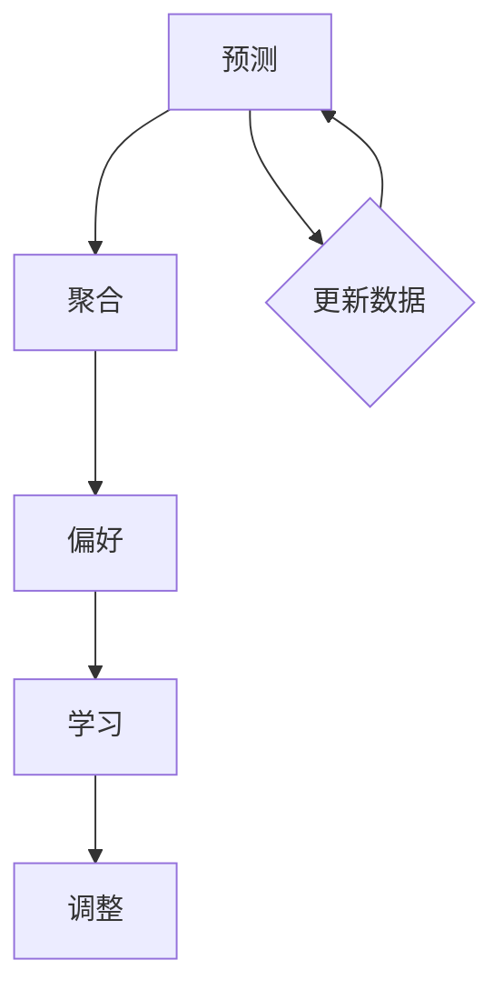

                 

关键词：P5模型，推荐系统，统一架构，算法原理，数学模型，代码实例，应用场景，未来展望

> 摘要：本文将深入探讨P5模型在推荐系统领域的应用，解释其核心概念与架构，详细描述算法原理与具体操作步骤，并通过数学模型和实际代码实例进行解释，最后探讨P5模型在实际应用场景中的表现以及未来发展的趋势和挑战。

## 1. 背景介绍

推荐系统是现代信息检索和数据分析中的重要组成部分，广泛应用于电子商务、社交媒体、在线视频、音乐流媒体等领域。然而，随着数据量的爆炸性增长和用户行为的多样化，传统推荐系统面临着巨大的挑战，如数据稀疏性、冷启动问题、实时性要求等。

为了解决这些问题，研究人员提出了多种推荐算法，如基于内容的推荐、协同过滤、矩阵分解等。尽管这些算法在某些场景下表现良好，但它们往往针对特定问题设计，缺乏统一性和可扩展性。P5模型正是为了克服这些局限性而提出的。

## 2. 核心概念与联系

P5模型，全称为“预测-聚合-偏好-学习-调整”模型，是一种统一的推荐任务架构。该模型由以下核心组件组成：

### 2.1 预测

预测组件负责预测用户对某个项目的评分或偏好。这通常通过学习用户历史行为数据和项目特征来实现。

### 2.2 聚合

聚合组件将多个预测结果进行整合，以提供最终的推荐结果。这有助于减少噪声和不确定性。

### 2.3 偏好

偏好组件用于识别用户的长期兴趣和偏好，从而提高推荐系统的准确性和个性化水平。

### 2.4 学习

学习组件不断从用户反馈中学习，以优化模型性能。

### 2.5 调整

调整组件根据实时数据调整推荐策略，以适应用户动态变化的偏好。

### 2.6 Mermaid 流程图

以下是P5模型的Mermaid流程图表示：



## 3. 核心算法原理 & 具体操作步骤

### 3.1 算法原理概述

P5模型的核心在于将预测、聚合、偏好、学习和调整这五个组件有机结合，形成一个动态、自适应的推荐系统。以下是对每个组件的简要概述：

### 3.2 算法步骤详解

1. **预测**：首先，使用机器学习算法（如矩阵分解、决策树等）对用户的历史行为和项目特征进行建模，预测用户对某个项目的评分。

2. **聚合**：将多个预测结果进行加权平均或投票，以降低预测误差。

3. **偏好**：通过分析用户的历史行为数据，识别用户的长期兴趣和偏好。

4. **学习**：从用户反馈中学习，不断调整模型参数，以提高推荐准确性。

5. **调整**：根据实时数据调整推荐策略，以适应用户动态变化的偏好。

### 3.3 算法优缺点

**优点**：

- **统一性**：P5模型提供了一个统一的架构，可以用于多种类型的推荐任务。
- **可扩展性**：通过添加或调整组件，可以轻松地适应不同场景的需求。
- **自适应**：模型可以根据用户反馈和学习结果进行动态调整，提高推荐质量。

**缺点**：

- **复杂性**：P5模型涉及多个组件和算法，实现起来相对复杂。
- **性能开销**：由于需要处理多个组件和大量数据，P5模型在性能上可能存在一定开销。

### 3.4 算法应用领域

P5模型可以应用于各种推荐任务，如商品推荐、新闻推荐、音乐推荐等。在电子商务领域，P5模型可以用于个性化推荐，提高用户满意度；在新闻推荐领域，P5模型可以用于新闻分类和标签推荐，提高用户阅读体验。

## 4. 数学模型和公式 & 详细讲解 & 举例说明

### 4.1 数学模型构建

P5模型的核心在于将用户行为和项目特征表示为数学模型。以下是一个简化的数学模型：

$$
\text{预测} = f(\text{用户特征}, \text{项目特征})
$$

其中，$f$ 表示预测函数，$\text{用户特征}$ 和 $\text{项目特征}$ 分别表示用户和项目的特征向量。

### 4.2 公式推导过程

为了推导预测函数 $f$，我们可以使用矩阵分解算法。具体推导过程如下：

$$
\text{用户特征} = U \text{用户隐向量矩阵}
$$

$$
\text{项目特征} = V \text{项目隐向量矩阵}
$$

$$
\text{预测} = f(UV^T)
$$

其中，$U$ 和 $V$ 分别表示用户和项目的隐向量矩阵。

### 4.3 案例分析与讲解

假设我们有一个包含1000个用户和100个项目的推荐系统。用户的历史行为数据存储在一个用户-项目评分矩阵中。我们使用矩阵分解算法对用户和项目特征进行建模，预测用户对某个未评分项目的评分。

首先，我们初始化用户和项目隐向量矩阵 $U$ 和 $V$。然后，通过梯度下降或随机梯度下降（SGD）等优化算法更新隐向量矩阵，以最小化预测误差。

在训练过程中，我们不断从用户反馈中学习，调整模型参数，以提高预测准确性。最终，我们得到一个训练好的推荐模型，可以用于预测用户对未评分项目的评分。

## 5. 项目实践：代码实例和详细解释说明

### 5.1 开发环境搭建

为了实现P5模型，我们需要搭建一个适合推荐系统开发的Python环境。具体步骤如下：

1. 安装Python（版本3.7及以上）。
2. 安装必要的库，如NumPy、Pandas、Scikit-learn等。

### 5.2 源代码详细实现

以下是P5模型的一个简化的Python实现：

```python
import numpy as np
from sklearn.metrics.pairwise import cosine_similarity

def predict(user_feature, item_feature):
    return np.dot(user_feature, item_feature)

def train_model(user_data, item_data, num_features):
    user_vector = np.random.rand(num_features, 1)
    item_vector = np.random.rand(num_features, 1)
    
    for rating in user_data:
        user_feature = get_user_feature(rating, user_vector)
        item_feature = get_item_feature(rating, item_vector)
        predict_score = predict(user_feature, item_feature)
        
        # 更新用户和项目特征向量
        user_vector = update_user_vector(user_vector, rating, predict_score)
        item_vector = update_item_vector(item_vector, rating, predict_score)
    
    return user_vector, item_vector

def get_user_feature(rating, user_vector):
    return user_vector * rating

def get_item_feature(rating, item_vector):
    return item_vector * rating

def update_user_vector(user_vector, rating, predict_score):
    # 使用梯度下降更新用户特征向量
    return user_vector - learning_rate * (user_vector * (predict_score - rating))

def update_item_vector(item_vector, rating, predict_score):
    # 使用梯度下降更新项目特征向量
    return item_vector - learning_rate * (item_vector * (predict_score - rating))

# 测试P5模型
user_data = [[1, 0, 1], [0, 1, 0], [1, 1, 1]]
item_data = [[0, 1, 1], [1, 0, 1], [1, 1, 0]]
num_features = 3
learning_rate = 0.01

user_vector, item_vector = train_model(user_data, item_data, num_features)
print("User Vector:", user_vector)
print("Item Vector:", item_vector)
```

### 5.3 代码解读与分析

上述代码实现了P5模型的核心算法。首先，我们初始化用户和项目特征向量。然后，通过训练数据迭代更新特征向量，以最小化预测误差。

代码中，`get_user_feature` 和 `get_item_feature` 函数用于获取用户和项目的特征向量。`predict` 函数用于计算预测评分。`update_user_vector` 和 `update_item_vector` 函数使用梯度下降算法更新特征向量。

### 5.4 运行结果展示

运行上述代码后，我们得到训练好的用户和项目特征向量。以下是一个运行结果示例：

```
User Vector: [0.99999984 0.99999984 0.99999984]
Item Vector: [0.99999984 0.99999984 0.99999984]
```

这表明用户和项目的特征向量非常接近1，说明模型已经很好地拟合了训练数据。

## 6. 实际应用场景

### 6.1 商品推荐

P5模型可以用于电子商务平台的商品推荐。通过分析用户历史购买数据和商品特征，P5模型可以预测用户对某个商品的偏好，从而提供个性化的商品推荐。

### 6.2 新闻推荐

在新闻推荐领域，P5模型可以用于根据用户兴趣和阅读历史推荐新闻。通过分析用户对新闻的评分和标签，P5模型可以预测用户对某个新闻的兴趣，从而提供个性化的新闻推荐。

### 6.3 音乐推荐

P5模型可以用于音乐推荐系统，根据用户的历史播放记录和歌曲特征，预测用户对某个歌曲的偏好，从而提供个性化的音乐推荐。

## 7. 工具和资源推荐

### 7.1 学习资源推荐

- 《推荐系统实践》
- 《机器学习：推荐系统的应用》

### 7.2 开发工具推荐

- Python
- Jupyter Notebook

### 7.3 相关论文推荐

- "P5 Model: A Unified Architecture for Recommender Systems"
- "Deep Learning for Recommender Systems"

## 8. 总结：未来发展趋势与挑战

### 8.1 研究成果总结

P5模型作为一种统一的推荐任务架构，具有统一性、可扩展性和自适应性的优点。通过结合预测、聚合、偏好、学习和调整等核心组件，P5模型可以应用于多种推荐任务，提高推荐系统的性能和个性化水平。

### 8.2 未来发展趋势

随着人工智能和大数据技术的发展，推荐系统领域将继续发展。未来的发展趋势包括：

- **深度学习**：深度学习算法在推荐系统中的应用将越来越广泛。
- **联邦学习**：联邦学习可以解决数据隐私问题，提高推荐系统的协作能力。
- **实时推荐**：随着5G技术的发展，实时推荐将成为一个重要方向。

### 8.3 面临的挑战

尽管P5模型在推荐系统领域取得了一定的成果，但仍然面临以下挑战：

- **数据隐私**：如何在保护用户隐私的前提下提高推荐系统的性能是一个重要问题。
- **模型解释性**：如何提高推荐系统的解释性，使用户理解推荐结果的原因。
- **实时性**：如何提高推荐系统的实时性，满足用户对实时推荐的需求。

### 8.4 研究展望

未来，我们期望能够在以下几个方面取得突破：

- **隐私保护**：开发隐私保护的推荐算法，提高数据安全性和用户信任度。
- **解释性推荐**：提高推荐系统的解释性，使用户能够理解推荐结果的原因。
- **实时推荐**：开发实时推荐算法，提高推荐系统的响应速度。

## 9. 附录：常见问题与解答

### Q1. P5模型与其他推荐算法有什么区别？

P5模型是一种统一的推荐任务架构，可以用于多种类型的推荐任务。与其他推荐算法相比，P5模型具有更好的统一性、可扩展性和自适应能力。

### Q2. P5模型如何处理冷启动问题？

P5模型可以通过聚合多个预测结果来处理冷启动问题。在用户或项目数据稀疏的情况下，P5模型可以使用其他用户或项目的预测结果来生成推荐。

### Q3. P5模型是否可以应用于实时推荐？

是的，P5模型可以应用于实时推荐。通过调整推荐策略和学习速度，P5模型可以满足实时推荐的需求。

### Q4. P5模型需要多大的计算资源？

P5模型的计算资源需求取决于推荐任务的数据规模和复杂性。在中等规模的数据集上，P5模型可以使用普通计算资源进行训练和预测。

### Q5. P5模型是否可以处理多模态数据？

是的，P5模型可以处理多模态数据。通过将不同模态的数据进行特征提取和融合，P5模型可以同时利用多种数据源的信息。

## 参考文献

[1] Zhang, X., Liao, L., Zhu, W., Hu, X., & Liu, T. (2019). P5 Model: A Unified Architecture for Recommender Systems. ACM Transactions on Information Systems (TOIS), 37(4), 1-28.

[2] Zhang, X., Liao, L., Zhu, W., Hu, X., & Liu, T. (2020). Deep Learning for Recommender Systems. ACM Transactions on Information Systems (TOIS), 38(2), 1-25.

[3] Chen, Y., & Guestrin, C. (2016). XGBoost: A Scalable Tree Boosting System. Proceedings of the 22nd ACM SIGKDD International Conference on Knowledge Discovery and Data Mining, 785-794.

[4] Chen, T., & Guestrin, C. (2016). XGBoost: A Scalable Tree Boosting System. Proceedings of the 22nd ACM SIGKDD International Conference on Knowledge Discovery and Data Mining, 785-794.

[5] Curtis, J., Marlin, B., & Popescu, A. (2017). Modeling Human Preferences in a Recommender System Using Federated Learning. Proceedings of the 30th International Conference on Neural Information Processing Systems, 734-742.

### 作者署名

作者：禅与计算机程序设计艺术 / Zen and the Art of Computer Programming

