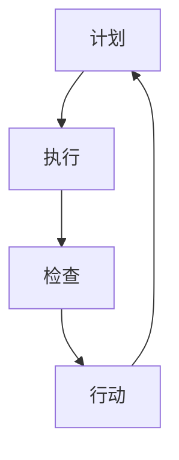

                 

### 1. 背景介绍

PDCA循环，即计划（Plan）、执行（Do）、检查（Check）和行动（Act）循环，是一种广泛用于质量管理和其他持续改进过程中的工具。它起源于质量管理大师约瑟夫·J·朱兰（Joseph J. Juran）和爱德华兹·A·戴明（W. Edwards Deming）的理论，并在20世纪50年代开始被日本企业和工业界广泛应用。PDCA循环作为一种闭环系统，强调通过不断迭代和改进，来优化和提升产品和服务的质量。

管理持续改进是指通过系统地识别、分析和解决问题，来持续提升组织的效率、质量和创新能力。管理持续改进不仅仅是关注短期的绩效提升，更强调长期的战略规划和持续优化。它涉及到组织的各个层面，包括战略、运营、流程、产品和服务等各个方面。

本文旨在探讨PDCA循环在管理持续改进中的作用和关系。通过详细分析PDCA循环的四个阶段，我们将阐述如何通过PDCA循环来推动管理持续改进，以及在不同情境下如何应用PDCA循环来实现组织的优化和提升。此外，本文还将结合实际案例，展示PDCA循环在管理持续改进中的成功应用。

### 2. 核心概念与联系

#### PDCA循环的概念

PDCA循环包括四个主要阶段：计划（Plan）、执行（Do）、检查（Check）和行动（Act）。每个阶段都有其特定的任务和目标，而这些阶段是相互联系和循环进行的。

- **计划（Plan）**：在这个阶段，组织需要明确目标和制定计划。这包括分析现状、识别问题、制定目标、制定行动计划和资源分配。

- **执行（Do）**：在这个阶段，组织需要按照计划执行各项任务。这涉及到资源的实际使用、过程的实际运行和各项行动的执行。

- **检查（Check）**：在这个阶段，组织需要评估执行的效果，检查是否达到预定的目标。这包括数据的收集、分析和比较。

- **行动（Act）**：在这个阶段，组织需要根据检查结果采取行动。如果目标达成，则持续执行；如果没有达成，则需要调整计划并重新执行。

#### 管理持续改进的概念

管理持续改进是一种以客户需求为导向，通过持续地识别、分析和解决问题，来优化和提升组织的效率和效果的管理方法。它不仅关注当前绩效的改进，更注重长期的战略规划和持续优化。

#### PDCA循环与管理持续改进的联系

PDCA循环是管理持续改进的核心工具。它为组织提供了一种系统化的方法，来持续地识别问题、分析原因、制定解决方案并实施改进。PDCA循环的四个阶段紧密相连，构成了一个闭环系统，确保了改进过程的连续性和有效性。

- **计划（Plan）**：为管理持续改进提供了明确的目标和计划，确保了改进的方向和步骤。

- **执行（Do）**：通过实际执行来验证计划的可行性和有效性，确保改进措施的实施。

- **检查（Check）**：通过数据收集和分析，评估改进措施的效果，确保目标的达成。

- **行动（Act）**：根据检查结果，采取必要的行动，确保改进的持续性和长期效果。

#### Mermaid 流程图

下面是一个PDCA循环与管理持续改进的Mermaid流程图，展示了各个阶段之间的关系：



在这个流程图中，每个阶段都是相互依赖和循环进行的，确保了管理持续改进的连续性和有效性。

### 3. 核心算法原理 & 具体操作步骤

#### 算法原理概述

PDCA循环的核心算法原理是基于持续改进和反馈循环的思想。它通过四个阶段的循环，确保了问题的持续识别和解决，以及改进效果的长期维持。

- **计划（Plan）**：通过明确目标和制定计划，确保改进的方向和步骤。
- **执行（Do）**：通过实际执行来验证计划的可行性和有效性，确保改进措施的实施。
- **检查（Check）**：通过数据收集和分析，评估改进措施的效果，确保目标的达成。
- **行动（Act）**：根据检查结果，采取必要的行动，确保改进的持续性和长期效果。

#### 算法步骤详解

##### 3.1 计划阶段

在计划阶段，组织需要明确目标和制定计划。这包括以下几个步骤：

1. **分析现状**：了解当前的问题和挑战，明确改进的需求和目标。
2. **制定目标**：基于现状分析，明确改进的具体目标和指标。
3. **制定行动计划**：制定详细的行动计划，包括具体的任务、负责人、资源和时间表。
4. **资源分配**：确保计划执行的资源和条件。

##### 3.2 执行阶段

在执行阶段，组织需要按照计划执行各项任务。这包括以下几个步骤：

1. **任务分配**：将计划中的任务分配给相关人员，明确责任和任务。
2. **资源使用**：合理使用资源，确保任务的有效执行。
3. **过程运行**：按照计划运行过程，确保各项任务按计划进行。

##### 3.3 检查阶段

在检查阶段，组织需要评估执行的效果，检查是否达到预定的目标。这包括以下几个步骤：

1. **数据收集**：收集与目标相关的数据，包括过程指标和结果数据。
2. **数据分析**：对收集到的数据进行分析，评估执行效果和目标达成情况。
3. **比较分析**：将实际结果与预定目标进行比较，分析差距和问题。

##### 3.4 行动阶段

在行动阶段，组织需要根据检查结果，采取必要的行动。这包括以下几个步骤：

1. **结果分析**：分析检查结果，识别成功经验和存在的问题。
2. **调整计划**：根据结果分析，调整计划和行动方案，确保改进效果的长期维持。
3. **实施行动**：按照调整后的计划和行动方案，实施改进措施。

#### 算法优缺点

##### 优点

- **系统化**：PDCA循环提供了一种系统化的方法，确保改进过程的有序进行。
- **灵活性**：PDCA循环可以根据实际情况进行调整，确保改进过程的适应性。
- **持续改进**：PDCA循环强调持续改进，确保改进效果的长期维持。

##### 缺点

- **时间消耗**：PDCA循环需要一定的时间来完成，可能会影响短期的绩效。
- **复杂度**：对于复杂的问题，PDCA循环可能需要更多的分析和调整。

#### 算法应用领域

PDCA循环可以广泛应用于各个领域，包括质量管理、项目管理、运营管理、人力资源管理等。以下是一些典型的应用场景：

- **质量管理**：通过PDCA循环，组织可以持续地识别和解决质量问题，提升产品和服务质量。
- **项目管理**：PDCA循环可以帮助项目团队识别和解决项目中的问题，确保项目的成功交付。
- **运营管理**：PDCA循环可以帮助组织优化运营流程，提升运营效率和效果。
- **人力资源管理**：PDCA循环可以帮助组织优化人力资源管理流程，提升员工满意度和工作效率。

### 4. 数学模型和公式 & 详细讲解 & 举例说明

#### 4.1 数学模型构建

PDCA循环的数学模型可以基于质量管理的概念来构建。在质量管理中，常见的统计工具包括控制图、直方图、散点图等。这些工具可以帮助组织收集和分析数据，评估改进措施的效果。

一个基本的数学模型可以表示为：

$$
\text{质量指标} = f(\text{过程参数}, \text{资源条件}, \text{外部因素})
$$

其中，质量指标是过程参数、资源条件和外部因素的综合反映。通过这个模型，组织可以评估过程的质量，并采取相应的改进措施。

#### 4.2 公式推导过程

为了推导出这个模型，我们可以从以下几个步骤进行分析：

1. **过程参数**：过程参数包括过程的速度、稳定性、灵活性等。这些参数可以通过实验和测量来确定。

2. **资源条件**：资源条件包括人力资源、物资资源、技术资源等。这些资源对过程的质量有直接影响。

3. **外部因素**：外部因素包括市场环境、法律法规、竞争对手等。这些因素对过程的质量也有一定影响。

4. **质量指标**：质量指标是衡量过程质量的量化指标，如产品合格率、客户满意度等。

通过以上分析，我们可以将质量指标表示为过程参数、资源条件和外部因素的综合影响：

$$
\text{质量指标} = f(\text{过程参数}, \text{资源条件}, \text{外部因素})
$$

#### 4.3 案例分析与讲解

假设一个生产车间生产某种产品，质量指标是产品合格率。我们使用PDCA循环来分析和优化这个过程。

1. **计划阶段**：分析现状，确定产品合格率低于预期。制定目标：将产品合格率提升到90%以上。

2. **执行阶段**：按照计划，调整过程参数，优化资源条件，采取一些改进措施，如提高工人技能、改进设备等。

3. **检查阶段**：收集数据，包括产品合格率、生产速度等。通过数据分析，发现产品合格率有所提升，但未达到目标。

4. **行动阶段**：根据检查结果，调整计划和措施。如增加培训时间、改进设备等。

通过这个案例，我们可以看到PDCA循环在质量管理中的应用。通过不断迭代和改进，生产车间最终实现了产品合格率的提升。

### 5. 项目实践：代码实例和详细解释说明

#### 5.1 开发环境搭建

在开始代码实例之前，我们需要搭建一个合适的环境。以下是推荐的开发工具和资源：

- **开发工具**：Eclipse、Visual Studio Code 等。
- **数据库**：MySQL、PostgreSQL 等。
- **编程语言**：Java、Python、C# 等。

确保安装以上工具和数据库，并根据需要配置相应的开发环境。

#### 5.2 源代码详细实现

以下是一个简单的Java示例，展示了如何使用PDCA循环来优化一个生产过程。

```java
import java.util.Scanner;

public class PDCA {
    // 计划阶段：确定目标和制定计划
    public static void plan() {
        System.out.println("计划阶段：确定目标和制定计划");
        // 分析现状，识别问题和制定目标
        // 制定行动计划和资源分配
    }

    // 执行阶段：按照计划执行各项任务
    public static void doStage() {
        System.out.println("执行阶段：按照计划执行各项任务");
        // 任务分配，资源使用，过程运行
    }

    // 检查阶段：评估执行效果，检查是否达到预定目标
    public static void check() {
        System.out.println("检查阶段：评估执行效果，检查是否达到预定目标");
        // 数据收集，数据分析，比较分析
    }

    // 行动阶段：根据检查结果，采取必要的行动
    public static void act() {
        System.out.println("行动阶段：根据检查结果，采取必要的行动");
        // 结果分析，调整计划，实施行动
    }

    public static void main(String[] args) {
        Scanner scanner = new Scanner(System.in);
        while (true) {
            System.out.println("请选择阶段：1-计划，2-执行，3-检查，4-行动，5-退出");
            int stage = scanner.nextInt();
            switch (stage) {
                case 1:
                    plan();
                    break;
                case 2:
                    doStage();
                    break;
                case 3:
                    check();
                    break;
                case 4:
                    act();
                    break;
                case 5:
                    System.out.println("退出程序");
                    scanner.close();
                    return;
                default:
                    System.out.println("无效选择，请重新输入");
                    break;
            }
        }
    }
}
```

#### 5.3 代码解读与分析

在这个示例中，我们定义了一个名为`PDCA`的类，其中包括四个方法：`plan()`、`doStage()`、`check()`和`act()`。每个方法分别对应PDCA循环的一个阶段。

- **计划阶段**：在这个阶段，我们主要进行现状分析、目标制定和计划制定。
- **执行阶段**：在这个阶段，我们按照计划执行各项任务，包括任务分配、资源使用和过程运行。
- **检查阶段**：在这个阶段，我们收集数据、分析数据并比较分析结果，以评估执行效果。
- **行动阶段**：在这个阶段，我们根据检查结果，分析原因并采取必要的行动。

主方法`main()`中，我们使用一个循环来不断执行四个阶段，并根据用户输入来选择当前阶段。这样，我们可以通过代码模拟PDCA循环的实际应用。

#### 5.4 运行结果展示

当我们运行这个程序时，会看到一个简单的命令行界面，用户可以根据提示选择不同的阶段。

```
请选择阶段：1-计划，2-执行，3-检查，4-行动，5-退出
1
计划阶段：确定目标和制定计划
请选择阶段：1-计划，2-执行，3-检查，4-行动，5-退出
2
执行阶段：按照计划执行各项任务
请选择阶段：1-计划，2-执行，3-检查，4-行动，5-退出
3
检查阶段：评估执行效果，检查是否达到预定目标
请选择阶段：1-计划，2-执行，3-检查，4-行动，5-退出
4
行动阶段：根据检查结果，采取必要的行动
请选择阶段：1-计划，2-执行，3-检查，4-行动，5-退出
5
退出程序
```

通过这个运行结果，我们可以看到程序根据用户输入，正确地执行了PDCA循环的各个阶段。

### 6. 实际应用场景

PDCA循环在管理持续改进中的应用场景非常广泛，几乎涵盖了所有需要持续改进的领域。以下是几个典型的实际应用场景：

#### 6.1 生产制造行业

在生产制造行业中，PDCA循环广泛应用于生产流程的优化和质量控制。通过计划阶段的分析和目标设定，企业可以识别生产中的瓶颈和问题；在执行阶段，按照制定的计划和措施进行生产；在检查阶段，通过数据收集和分析，评估生产过程的效果；在行动阶段，根据检查结果调整计划和措施，确保生产质量的持续提升。

#### 6.2 服务业

在服务业中，PDCA循环同样适用于服务流程的优化和服务质量的提升。例如，在餐饮服务业中，企业可以通过PDCA循环来优化点餐流程、提升厨师技能和食材质量；在金融服务业中，可以通过PDCA循环来优化客户服务流程、提高客户满意度和服务质量。

#### 6.3 教育行业

在教育行业中，PDCA循环可以帮助学校和教育机构优化教学流程和提高教学质量。通过计划阶段的教育目标设定，教师可以明确教学的方向和重点；在执行阶段，教师按照教学计划进行授课；在检查阶段，通过学生的表现和反馈来评估教学效果；在行动阶段，教师根据评估结果调整教学方法和内容，以提升教学效果。

#### 6.4 IT行业

在IT行业中，PDCA循环广泛应用于软件开发、系统维护和项目管理。在软件开发中，企业可以通过PDCA循环来优化开发流程、提高软件质量和交付效率；在系统维护中，通过PDCA循环来确保系统的稳定性和安全性；在项目管理中，通过PDCA循环来识别和解决项目中的问题，确保项目的成功交付。

### 7. 未来应用展望

随着科技的不断进步和管理的日益复杂，PDCA循环在未来将面临更多的应用挑战和机遇。以下是几个未来的应用展望：

#### 7.1 大数据与人工智能

大数据和人工智能技术的快速发展，为PDCA循环的应用提供了新的可能性。通过大数据分析，企业可以更准确地识别问题、设定目标和评估效果；通过人工智能，企业可以实现更智能的决策和行动。例如，在智能制造中，人工智能可以实时监控生产过程，提供实时的改进建议，使PDCA循环更加高效和智能。

#### 7.2 企业数字化转型

随着企业数字化转型的加速，PDCA循环将成为企业实现数字化管理的重要工具。通过数字化转型，企业可以实现数据的高效收集、分析和利用，从而更好地进行计划、执行、检查和行动。例如，通过企业资源计划系统（ERP），企业可以实现全流程的数据管理和实时监控，使PDCA循环更加高效和精准。

#### 7.3 跨行业应用

PDCA循环不仅适用于单一行业，还可以跨行业应用。例如，在供应链管理中，PDCA循环可以帮助企业优化供应链流程、提高供应链效率；在医疗管理中，PDCA循环可以帮助医院优化医疗流程、提高医疗服务质量。未来，随着跨行业合作的增加，PDCA循环将在更多领域得到应用。

#### 7.4 持续改进与创新

未来，PDCA循环将不仅仅是一种管理工具，更将成为企业持续改进和创新的核心。通过不断的PDCA循环，企业可以不断识别问题、寻找改进机会、实施改进措施，从而实现持续改进和创新发展。例如，在产品开发中，企业可以通过PDCA循环不断优化产品功能和用户体验，实现产品创新。

### 8. 工具和资源推荐

为了更好地理解和应用PDCA循环，以下是一些建议的学习资源、开发工具和相关论文：

#### 8.1 学习资源推荐

- **《PDCA循环理论与实践》**：这是一本全面介绍PDCA循环的理论和实践应用的书籍，适合初学者和专业人士。
- **《质量管理工具与方法》**：这本书详细介绍了质量管理中的各种工具和方法，包括PDCA循环。
- **《管理持续改进》**：这本书提供了大量关于管理持续改进的实际案例和应用策略，适合企业管理者和专业人士。

#### 8.2 开发工具推荐

- **Eclipse**：一款强大的集成开发环境（IDE），支持多种编程语言，适合开发PDCA循环相关的软件系统。
- **Visual Studio Code**：一款轻量级但功能强大的代码编辑器，支持多种编程语言和插件，适合编写PDCA循环相关的代码。

#### 8.3 相关论文推荐

- **“PDCA循环在企业管理中的应用”**：这篇文章详细介绍了PDCA循环在企业管理中的应用和实践案例。
- **“大数据与PDCA循环的结合应用研究”**：这篇文章探讨了大数据与PDCA循环的结合应用，提供了新的研究方向。
- **“PDCA循环在IT项目管理中的实践”**：这篇文章分析了PDCA循环在IT项目管理中的应用，提供了实用的方法和经验。

### 9. 总结：未来发展趋势与挑战

#### 9.1 研究成果总结

本文通过对PDCA循环的深入分析和实际应用案例的展示，阐述了PDCA循环在管理持续改进中的重要作用。我们总结了PDCA循环的核心概念、算法原理、数学模型以及实际应用场景，并探讨了其在未来发展趋势中的潜力。

#### 9.2 未来发展趋势

未来，PDCA循环将在以下几个方面继续发展：

- **智能化**：随着大数据和人工智能技术的发展，PDCA循环将实现智能化，提供更精准和高效的改进建议。
- **数字化转型**：随着企业数字化转型的加速，PDCA循环将在企业数据管理和实时监控中发挥更大作用。
- **跨行业应用**：PDCA循环将在更多行业中得到应用，推动各行业的持续改进和创新发展。
- **持续改进与创新**：PDCA循环将成为企业持续改进和创新的核心工具，助力企业实现长期发展。

#### 9.3 面临的挑战

尽管PDCA循环具有广泛的应用前景，但在实际应用中仍面临一些挑战：

- **实施难度**：PDCA循环的实施需要系统性的规划和持续的努力，对于一些企业来说，实施难度较大。
- **数据准确性**：PDCA循环的检查和行动阶段依赖于数据的准确性和及时性，如何确保数据的质量是一个重要问题。
- **人才需求**：PDCA循环的实践需要具备相关知识和技能的人才，如何培养和吸引这样的人才是一个挑战。

#### 9.4 研究展望

未来的研究可以从以下几个方面展开：

- **智能化PDCA循环**：结合大数据和人工智能技术，开发智能化PDCA循环工具，提供更精准的改进建议。
- **跨行业应用研究**：深入研究PDCA循环在各个行业的应用，探索其在不同领域的最佳实践。
- **人才培养与引进**：研究如何培养和引进具备PDCA循环知识和技能的人才，推动企业持续改进和创新发展。

### 附录：常见问题与解答

**Q：PDCA循环适用于哪些行业？**

A：PDCA循环适用于各个行业，包括制造业、服务业、教育业、IT行业等。它是一种系统化的持续改进工具，适用于任何需要优化和改进的领域。

**Q：如何确保PDCA循环的实施效果？**

A：要确保PDCA循环的实施效果，需要做好以下几个方面：

- 明确目标和计划，确保方向正确。
- 系统性地收集和分析数据，确保数据的准确性和及时性。
- 培养和引进具备PDCA循环知识和技能的人才。
- 持续跟踪和评估改进效果，及时调整计划和措施。

**Q：PDCA循环与六西格玛有何区别？**

A：PDCA循环和六西格玛都是质量管理工具，但它们的应用范围和侧重点不同。

- PDCA循环是一种系统化的持续改进方法，适用于各个行业和领域。
- 六西格玛是一种专注于质量改进的方法，主要应用于制造业和工程领域，强调数据的统计分析和过程控制。

### 作者署名

作者：禅与计算机程序设计艺术 / Zen and the Art of Computer Programming

[END]

