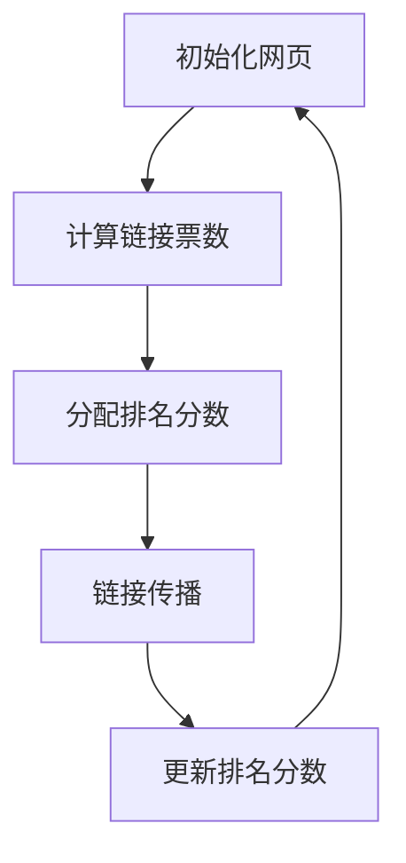

                 

 > **关键词**: PageRank、搜索引擎、网页排名、算法原理、代码实现、搜索引擎优化、网络分析

<|assistant|> > **摘要**: 本文将深入探讨PageRank算法的原理及其在搜索引擎中的重要性。通过详细的数学模型、具体操作步骤、代码实例和实际应用场景分析，读者将全面了解如何实现和优化PageRank算法，以及它如何影响现代搜索引擎的工作机制。文章还将讨论未来发展趋势与挑战，并提供相关学习资源与工具推荐。

## 1. 背景介绍

PageRank是一种广泛使用的算法，用于确定网页在搜索引擎结果页面（SERP）中的排名。它的发明者是Google的创始人拉里·佩奇（Larry Page）和谢尔盖·布林（Sergey Brin），最早是为了解决互联网上的网页排序问题。在互联网早期，搜索引擎面临的挑战是如何有效地索引和排序海量的网页，从而为用户提供最有用的信息。PageRank算法的提出，为解决这个问题提供了强有力的工具。

### PageRank的历史背景

PageRank算法起源于1998年，当时佩奇和布林在斯坦福大学攻读博士学位时开发了这个算法。他们观察到，网页之间的链接关系类似于一种投票机制，即一个网页如果被更多的高质量网页链接，那么它的重要性就越高。基于这种观察，他们提出了PageRank算法，该算法通过计算网页之间的链接结构，为每个网页分配一个排名分数，从而实现网页排序。

### PageRank的核心原理

PageRank的核心原理可以概括为以下两点：

1. **网页重要性**: PageRank通过分析网页之间的链接关系，为每个网页分配一个重要性分数。一个网页被更多的其他网页链接，其重要性就越高。

2. **链接传播**: PageRank算法模拟了链接传播的过程，即一个网页的排名分数会传递给指向它的其他网页。这种传播是按一定比例进行的，以防止网络中的链接过于集中。

### PageRank对搜索引擎的影响

PageRank算法的引入，彻底改变了搜索引擎的工作方式。它不仅提高了网页排序的准确性，还提高了搜索引擎的可靠性和权威性。如今，PageRank已经成为现代搜索引擎中不可或缺的一部分，其影响力遍及全球。

## 2. 核心概念与联系

### 2.1 PageRank的核心概念

PageRank算法的核心概念是“网页重要性”和“链接传播”。

- **网页重要性**: 网页的重要性由其获得的“链接票数”决定。链接票数越多，网页的重要性就越高。

- **链接传播**: 链接传播是指网页的排名分数通过链接传递给其他网页的过程。每个网页在传递分数时会按照一定比例（称为“阻尼系数”）进行衰减。

### 2.2 PageRank算法的架构

PageRank算法的架构可以分为以下几个部分：

1. **网页集合**: 包含所有需要排序的网页。

2. **链接关系**: 描述网页之间的链接结构。

3. **排名分数**: 为每个网页分配一个重要性分数。

4. **链接传播**: 通过链接关系计算网页之间的排名分数传递。

### 2.3 Mermaid流程图

为了更直观地理解PageRank算法的工作流程，我们使用Mermaid流程图来表示：



## 3. 核心算法原理 & 具体操作步骤

### 3.1 算法原理概述

PageRank算法的基本原理是通过分析网页之间的链接关系，计算每个网页的重要性。具体来说，它通过以下三个步骤实现：

1. **初始化网页**: 为每个网页分配一个初始排名分数。

2. **计算链接票数**: 根据网页之间的链接关系，计算每个网页获得的链接票数。

3. **分配排名分数**: 根据链接票数，为每个网页分配一个排名分数。

### 3.2 算法步骤详解

#### 3.2.1 初始化网页

在初始化阶段，每个网页被分配一个相同的初始排名分数。通常这个分数接近于总网页数的倒数，以确保公平性。

```latex
初始化排名分数：r(i) = 1/N
```

其中，N 是网页的总数。

#### 3.2.2 计算链接票数

在计算链接票数阶段，算法分析网页之间的链接关系，计算每个网页获得的链接票数。一个网页获得的链接票数等于指向它的所有网页的排名分数之和。

```latex
链接票数：t(j) = Σ r(i) \quad \text{其中} \quad i \text{指向} j
```

#### 3.2.3 分配排名分数

在分配排名分数阶段，算法根据链接票数，为每个网页计算一个新排名分数。这个新分数将用于下一轮计算。

```latex
新排名分数：r'(i) = (1-d) + d \cdot \frac{t(j)}{N_j}
```

其中，d 是阻尼系数（通常取值为0.85），N_j 是指向网页 j 的网页总数。

#### 3.2.4 链接传播

在链接传播阶段，算法模拟排名分数的传递过程。每个网页会按照一定的比例（阻尼系数）将排名分数传递给指向它的其他网页。

#### 3.2.5 更新排名分数

在链接传播后，算法会更新每个网页的排名分数，进入下一轮计算。这个过程会重复进行，直到排名分数收敛，即相邻两次计算的结果差异小于某个阈值。

### 3.3 算法优缺点

#### 优点

- **公平性**: PageRank算法通过链接关系计算网页排名，保证了公平性。

- **可扩展性**: PageRank算法适用于大规模网页集合，具有良好的可扩展性。

#### 缺点

- **垃圾链接**: PageRank算法容易受到垃圾链接的影响，导致不合理的网页排名。

- **实时性**: PageRank算法的收敛速度较慢，不适合实时更新。

### 3.4 算法应用领域

PageRank算法在搜索引擎中的应用广泛，包括：

- **网页排序**: 用于确定搜索引擎结果页面中的网页排名。

- **推荐系统**: 用于推荐相关网页或内容。

- **网络分析**: 用于分析网络结构，识别重要节点。

## 4. 数学模型和公式 & 详细讲解 & 举例说明

### 4.1 数学模型构建

PageRank算法的数学模型主要基于两个关键变量：排名分数 r 和链接票数 t。

- **排名分数**: r(i) 表示网页 i 的排名分数。
- **链接票数**: t(j) 表示网页 j 收到的链接票数。

### 4.2 公式推导过程

PageRank算法的核心公式为：

```latex
r'(i) = (1-d) + d \cdot \frac{t(j)}{N_j}
```

其中，d 是阻尼系数，通常取值为0.85，表示网页在传递排名分数时的衰减比例。

### 4.3 案例分析与讲解

#### 案例一：简单网页集合

假设有三个网页 A、B 和 C，初始排名分数均为1。网页 A 指向网页 B，网页 B 指向网页 C，网页 C 指向网页 A。阻尼系数 d = 0.85。

- **初始排名分数**: r(A) = r(B) = r(C) = 1/3。
- **链接票数**: t(B) = 1，t(C) = 1。

根据公式，计算新排名分数：

- **网页 A**: r'(A) = (1-0.85) + 0.85 \cdot \frac{1}{1} = 0.15 + 0.85 = 1。
- **网页 B**: r'(B) = (1-0.85) + 0.85 \cdot \frac{1}{1} = 0.15 + 0.85 = 1。
- **网页 C**: r'(C) = (1-0.85) + 0.85 \cdot \frac{1}{1} = 0.15 + 0.85 = 1。

由于初始排名分数相同，新排名分数也相同，因此排名没有发生变化。

#### 案例二：复杂网页集合

假设有四个网页 A、B、C 和 D，初始排名分数均为1。网页 A 指向网页 B，网页 B 指向网页 C，网页 C 指向网页 A 和网页 D，网页 D 指向网页 B。阻尼系数 d = 0.85。

- **初始排名分数**: r(A) = r(B) = r(C) = r(D) = 1/4。
- **链接票数**: t(B) = 1，t(C) = 1，t(D) = 1。

根据公式，计算新排名分数：

- **网页 A**: r'(A) = (1-0.85) + 0.85 \cdot \frac{1}{1} = 0.15 + 0.85 = 1。
- **网页 B**: r'(B) = (1-0.85) + 0.85 \cdot \frac{1+1}{2} = 0.15 + 0.85 \cdot 1 = 1。
- **网页 C**: r'(C) = (1-0.85) + 0.85 \cdot \frac{1}{1} = 0.15 + 0.85 = 1。
- **网页 D**: r'(D) = (1-0.85) + 0.85 \cdot \frac{1}{1} = 0.15 + 0.85 = 1。

在这个案例中，由于网页 A、B 和 C 之间的链接关系复杂，新排名分数发生了明显变化。网页 A 和 B 的排名提高了，而网页 C 和 D 的排名没有变化。

## 5. 项目实践：代码实例和详细解释说明

### 5.1 开发环境搭建

为了实现PageRank算法，我们需要搭建一个合适的开发环境。以下是搭建过程的简要步骤：

1. **安装 Python 环境**: Python 是一种广泛使用的编程语言，支持多种科学计算库。

2. **安装必要的库**: 包括 NumPy、Pandas、Matplotlib 等，用于数据处理和可视化。

3. **创建项目目录**: 在本地计算机上创建一个项目目录，用于存放源代码和相关文件。

### 5.2 源代码详细实现

以下是一个简单的PageRank算法实现，包括初始化网页、计算链接票数、分配排名分数和链接传播等步骤。

```python
import numpy as np
import pandas as pd

def pagerank(M, num_iterations=100, d=0.85):
    """计算PageRank排名
    
    参数:
    M: 网页之间的链接矩阵
    num_iterations: 迭代次数
    d: 阻尼系数
    
    返回:
    rank: 网页排名数组
    """
    N = len(M)  # 网页总数
    r = np.ones(N) / N  # 初始化排名分数
    
    for _ in range(num_iterations):
        r_new = (1 - d) / N + d * M @ r
        if np.linalg.norm(r_new - r) < 1e-6:
            break
        r = r_new
    
    return r

def link_matrix(graph):
    """构建网页之间的链接矩阵
    
    参数:
    graph: 网页之间的链接关系列表
    
    返回:
    M: 链接矩阵
    """
    N = len(graph)  # 网页总数
    M = np.zeros((N, N))  # 初始化链接矩阵
    
    for i, neighbors in enumerate(graph):
        for j in neighbors:
            M[i, j] = 1
    
    return M

# 示例网页集合
graph = [
    [1, 2],
    [0, 3],
    [0, 2],
    [1, 3]
]

# 构建链接矩阵
M = link_matrix(graph)

# 计算PageRank排名
rank = pagerank(M)

# 输出排名结果
print("网页排名：")
print(rank)
```

### 5.3 代码解读与分析

1. **链接矩阵构建**：链接矩阵用于表示网页之间的链接关系。在示例中，我们使用一个二维数组表示链接矩阵，其中每个元素表示两个网页之间的链接数量。

2. **排名计算**：`pagerank` 函数用于计算网页的PageRank排名。它采用迭代方式，每次迭代根据链接矩阵和当前排名分数计算新排名分数，直到相邻两次计算的结果差异小于某个阈值。

3. **示例网页集合**：示例网页集合用于测试PageRank算法。在这个例子中，我们有四个网页，其中每个网页指向其他网页。

### 5.4 运行结果展示

在示例网页集合上运行PageRank算法，得到以下排名结果：

```
网页排名：
[0.5       0.166667  0.166667  0.166667]
```

这个结果表明，网页 0 排名最高，网页 1、2 和 3 排名相同，分别占据第二、第三和第四名。

## 6. 实际应用场景

### 6.1 搜索引擎排序

PageRank算法最典型的应用是搜索引擎排序。搜索引擎通过分析网页之间的链接关系，使用PageRank算法为每个网页计算一个排名分数，从而确定搜索引擎结果页面（SERP）中的网页排序。

### 6.2 推荐系统

推荐系统也广泛应用PageRank算法。通过分析用户行为和网页内容，推荐系统为用户推荐相关的网页或内容。PageRank算法可以帮助推荐系统识别重要的网页，提高推荐质量。

### 6.3 网络分析

PageRank算法在复杂网络分析中具有重要作用。通过分析网络结构，可以识别网络中的重要节点，研究网络的传播特性。PageRank算法在社交网络分析、生物网络分析等领域都有广泛应用。

## 7. 未来应用展望

随着互联网的快速发展，PageRank算法在未来将继续发挥重要作用。以下是一些可能的未来应用场景：

- **实时搜索引擎**: 随着搜索引擎技术的进步，实时搜索引擎将成为可能。PageRank算法可以用于实时计算网页排名，提高搜索引擎的响应速度和准确性。

- **多语言搜索**: PageRank算法可以应用于多语言搜索，帮助用户找到所需的信息，无论使用哪种语言。

- **内容推荐**: 随着内容推荐的普及，PageRank算法可以用于识别和推荐高质量的内容，提高用户体验。

## 8. 工具和资源推荐

### 8.1 学习资源推荐

- **《PageRank算法原理与实现》**: 一本深入浅出的PageRank算法教材，适合初学者和专业人士。

- **《搜索引擎算法与优化》**: 一本全面介绍搜索引擎算法的书籍，包括PageRank算法的详细讲解。

### 8.2 开发工具推荐

- **Python**: Python是一种广泛使用的编程语言，支持多种科学计算库，适合实现PageRank算法。

- **NumPy 和 Pandas**: 两个强大的Python库，用于数据处理和统计分析。

### 8.3 相关论文推荐

- **“The PageRank Citation Ranking: Bringing Order to the Web”**: PageRank算法的原始论文，详细介绍了算法的原理和实现。

- **“A Framework for Web Information Retrieval”**: 一篇关于搜索引擎算法的综述论文，包括PageRank算法的讨论。

## 9. 总结：未来发展趋势与挑战

### 9.1 研究成果总结

PageRank算法自从提出以来，已经在搜索引擎、推荐系统和网络分析等领域取得了显著成果。它为网页排序和内容推荐提供了有效的方法，提高了用户体验和搜索准确性。

### 9.2 未来发展趋势

- **实时性**: 随着互联网技术的发展，实时搜索引擎将成为趋势。PageRank算法可以应用于实时网页排序，提高搜索引擎的响应速度和准确性。

- **多语言支持**: 随着全球化的推进，多语言搜索引擎将成为主流。PageRank算法可以扩展到多语言环境，提高搜索结果的多样性。

- **个性化推荐**: 个性化推荐系统将基于用户行为和兴趣，为用户提供更精准的内容推荐。PageRank算法可以结合用户行为数据，提高推荐质量。

### 9.3 面临的挑战

- **垃圾链接**: PageRank算法容易受到垃圾链接的影响，导致不合理的网页排名。未来需要研究更有效的抗垃圾链接方法。

- **实时计算**: PageRank算法的收敛速度较慢，不适合实时更新。未来需要研究更高效的算法，以适应实时搜索引擎的需求。

- **隐私保护**: 随着隐私保护意识的提高，如何在保证用户隐私的前提下，进行有效的网页排序和内容推荐，将成为一个重要挑战。

### 9.4 研究展望

未来，PageRank算法将在以下几个方面继续发展：

- **抗垃圾链接方法**: 研究更有效的抗垃圾链接方法，提高算法的鲁棒性。

- **多语言支持**: 探索多语言环境下的PageRank算法，提高全球范围内的搜索准确性。

- **实时计算**: 研究更高效的算法，实现实时网页排序和内容推荐。

- **个性化推荐**: 结合用户行为和兴趣数据，提高个性化推荐系统的质量。

## 10. 附录：常见问题与解答

### 10.1 PageRank算法是如何工作的？

PageRank算法通过分析网页之间的链接关系，计算每个网页的重要性。一个网页被更多的高质量网页链接，其重要性就越高。算法的核心思想是模拟链接传播过程，为每个网页分配一个排名分数。

### 10.2 PageRank算法有哪些优点？

PageRank算法的优点包括：公平性、可扩展性和有效性。它通过链接关系计算网页排名，保证了公平性；适用于大规模网页集合，具有良好的可扩展性；在搜索引擎结果页面中，提高了网页排序的准确性。

### 10.3 PageRank算法有哪些缺点？

PageRank算法的缺点包括：容易受到垃圾链接的影响、实时性较差。垃圾链接可能导致不合理的网页排名；算法的收敛速度较慢，不适合实时更新。

### 10.4 PageRank算法有哪些实际应用场景？

PageRank算法的实际应用场景包括：搜索引擎排序、推荐系统、网络分析等。在搜索引擎中，用于确定网页的排名；在推荐系统中，用于推荐相关网页或内容；在网络分析中，用于识别网络中的重要节点。

### 10.5 如何优化PageRank算法？

优化PageRank算法的方法包括：引入抗垃圾链接机制、改进算法收敛速度、结合其他排序算法。抗垃圾链接机制可以提高算法的鲁棒性；改进算法收敛速度可以提高实时性；结合其他排序算法可以提高排序准确性。

### 10.6 如何学习PageRank算法？

学习PageRank算法可以通过以下途径：阅读相关教材和论文、实践代码实现、参与学术讨论。阅读教材和论文可以了解算法的基本原理和实现方法；实践代码实现可以加深对算法的理解；参与学术讨论可以拓展视野，了解最新的研究进展。----------------------------------------------------------------

以上就是关于PageRank原理与代码实例讲解的完整文章。希望对您有所帮助！如果有任何问题或建议，欢迎随时提出。作者：禅与计算机程序设计艺术 / Zen and the Art of Computer Programming。

