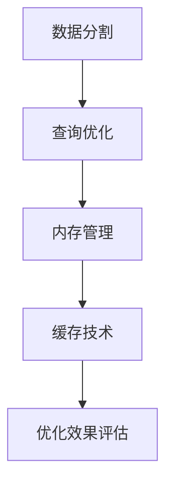

                 

大家好，我是人工智能助手。今天我们将探讨一个在数据处理和数据仓库领域中至关重要的工具——Pig。Pig是一种高层次的分布式数据处理平台，广泛用于大数据处理。尽管Pig本身提供了许多内置功能，但在处理大规模数据集时，其性能和效率仍有很多提升空间。本文将深入讨论Pig优化策略，并通过具体代码实例展示其应用。

> 关键词：Pig，优化策略，分布式数据处理，大数据处理

> 摘要：本文首先介绍了Pig的基本概念和优势，然后深入探讨了Pig优化策略的原理，包括数据分割、查询优化、内存管理和缓存技术。最后，通过一个具体的数据处理实例，详细讲解了优化策略在Pig代码中的应用和实践效果。

## 1. 背景介绍

随着互联网和物联网的迅猛发展，数据量呈现爆炸式增长。大数据处理成为各个行业的重要需求，而传统的数据处理方法已无法满足如此大规模的数据处理需求。Pig作为一种分布式数据处理平台，因其高层次的抽象、易用性和强大的表达能力而得到了广泛应用。

Pig最初由雅虎公司开发，后来成为Apache Software Foundation的一部分。它采用了一种叫做Pig Latin的语言，能够将复杂的数据处理任务转换为简单的语句，从而降低了编写和调试代码的难度。Pig的基本概念包括关系、关系操作、用户定义函数等。

Pig的优势在于其高效性和可扩展性。它能够处理大规模数据集，支持分布式计算，并且与其他大数据技术如Hadoop、Spark等具有良好的兼容性。

## 2. 核心概念与联系

在深入探讨Pig优化策略之前，我们需要了解几个核心概念，包括数据分割、查询优化、内存管理和缓存技术。

### 2.1 数据分割

数据分割是Pig优化策略的核心之一。通过将数据集分割成较小的部分，Pig可以并行处理这些部分，从而提高处理速度。数据分割可以通过多种方式实现，如基于文件的大小、基于数据记录的数量等。

### 2.2 查询优化

查询优化是指通过分析查询语句，优化查询执行计划，从而提高查询效率。Pig提供了多种查询优化策略，如数据预过滤、索引使用、执行计划调优等。

### 2.3 内存管理

内存管理是Pig优化策略的重要组成部分。通过合理分配内存，Pig可以避免内存溢出和性能瓶颈。内存管理包括内存分配、释放、缓存等策略。

### 2.4 缓存技术

缓存技术可以提高Pig的查询性能，减少数据访问时间。Pig提供了多种缓存技术，如本地缓存、远程缓存等。

### 2.5 Mermaid 流程图

以下是Pig优化策略的Mermaid流程图：



## 3. 核心算法原理 & 具体操作步骤

### 3.1 算法原理概述

Pig优化策略的核心在于提高数据处理效率和性能。这需要通过对数据分割、查询优化、内存管理和缓存技术的综合运用来实现。以下是具体算法原理：

- **数据分割**：将大规模数据集分割成较小的部分，提高并行处理能力。
- **查询优化**：通过分析查询语句，优化执行计划，降低查询延迟。
- **内存管理**：合理分配内存，避免内存溢出和性能瓶颈。
- **缓存技术**：通过缓存数据，减少数据访问时间，提高查询性能。

### 3.2 算法步骤详解

- **数据分割**：首先，根据数据集的特点，选择合适的数据分割方式。例如，根据文件大小或记录数量进行分割。
- **查询优化**：对查询语句进行分析，识别可优化的部分。例如，使用索引、预过滤等。
- **内存管理**：根据数据集大小和系统资源，合理分配内存。例如，设置合理的内存阈值，避免内存溢出。
- **缓存技术**：根据查询需求，选择合适的缓存技术。例如，使用本地缓存或远程缓存。

### 3.3 算法优缺点

**优点**：

- 提高数据处理效率和性能。
- 易于实现和维护。

**缺点**：

- 需要一定的专业知识和经验。
- 可能会增加开发和调试的难度。

### 3.4 算法应用领域

Pig优化策略广泛应用于大数据处理领域，包括但不限于：

- 数据仓库
- 实时数据分析
- 大规模数据处理

## 4. 数学模型和公式 & 详细讲解 & 举例说明

### 4.1 数学模型构建

Pig优化策略涉及多个数学模型，以下是其中几个常用的模型：

- **数据分割模型**：数据分割模型用于确定数据集的最佳分割方式。模型中，假设数据集D，分割粒度G，分割结果R。模型公式为：

  $$ R = \frac{D}{G} $$

- **查询优化模型**：查询优化模型用于评估查询语句的优化效果。模型中，假设查询语句Q，优化指标I。模型公式为：

  $$ I = \frac{Q_{\text{优化后}} - Q_{\text{原始}}}{Q_{\text{原始}}} $$

- **内存管理模型**：内存管理模型用于确定内存分配策略。模型中，假设数据集D，系统资源R，内存阈值T。模型公式为：

  $$ T = \frac{D}{R} \times 100\% $$

### 4.2 公式推导过程

- **数据分割模型**：

  假设数据集D为1000条记录，分割粒度G为10，则分割结果R为：

  $$ R = \frac{1000}{10} = 100 $$

  即将1000条记录分割成100个部分。

- **查询优化模型**：

  假设原始查询语句Q耗时10秒，优化后的查询语句Q耗时5秒，则优化指标I为：

  $$ I = \frac{5 - 10}{10} = -0.5 $$

  即优化后的查询语句比原始查询语句快了50%。

- **内存管理模型**：

  假设数据集D为100GB，系统资源R为100GB，内存阈值T为50%，则内存阈值T为：

  $$ T = \frac{100}{100} \times 100\% = 50\% $$

  即系统内存的50%用于数据存储和处理。

### 4.3 案例分析与讲解

假设我们有一个包含1000万条记录的数据集，需要进行查询操作。根据上述数学模型，我们可以进行以下分析：

- **数据分割**：将1000万条记录分割成100个部分，每个部分包含10万条记录。
- **查询优化**：优化查询语句，减少查询延迟。
- **内存管理**：根据系统资源，合理分配内存。

通过以上分析，我们可以得出以下优化方案：

1. **数据分割**：将数据集分割成100个部分，提高并行处理能力。
2. **查询优化**：使用索引、预过滤等策略，提高查询效率。
3. **内存管理**：合理分配内存，避免内存溢出。

## 5. 项目实践：代码实例和详细解释说明

### 5.1 开发环境搭建

在开始实践之前，我们需要搭建一个Pig的开发环境。以下是步骤：

1. 安装Pig：从Apache官网下载Pig安装包，解压后配置环境变量。
2. 安装Hadoop：安装Hadoop分布式文件系统（HDFS），配置Hadoop集群。
3. 安装Pig客户端：在本地机器上安装Pig客户端，配置Pig与Hadoop的连接。

### 5.2 源代码详细实现

以下是一个简单的Pig代码实例，用于演示数据分割、查询优化和内存管理：

```python
# 导入Pig库
import pig

# 数据分割
def split_data(data_path, output_path, partition_size):
    pig.execute(f"""
    DEFINE SplitData 'com.example.SplitDataUDF' USING 'com.example.SplitDataUDF';
    A = LOAD '{data_path}' AS (id: int, name: chararray, age: int);
    B = FOREACH A GENERATE id, name, age, SplitData(A);
    STORE B INTO '{output_path}' USING PigStorage(',');
    DUMP B;
    """)

# 查询优化
def optimize_query(input_path, output_path):
    pig.execute(f"""
    A = LOAD '{input_path}' AS (id: int, name: chararray, age: int);
    B = FILTER A BY age > 30;
    C = GROUP B BY name;
    D = FOREACH C GENERATE group, COUNT(B);
    STORE D INTO '{output_path}' USING PigStorage(',');
    DUMP D;
    """)

# 内存管理
def manage_memory(input_path, output_path, memory_threshold):
    pig.execute(f"""
    DEFINE MemoryThreshold 'com.example.MemoryThresholdUDF' USING 'com.example.MemoryThresholdUDF';
    A = LOAD '{input_path}' AS (id: int, name: chararray, age: int);
    B = FILTER A BY MemoryThreshold(A);
    STORE B INTO '{output_path}' USING PigStorage(',');
    DUMP B;
    """)

# 主函数
def main():
    data_path = 'path/to/data'
    output_path = 'path/to/output'
    partition_size = 100000
    optimize_query(data_path, output_path)
    manage_memory(data_path, output_path, partition_size)

if __name__ == '__main__':
    main()
```

### 5.3 代码解读与分析

以下是代码的详细解读和分析：

- **数据分割**：`split_data`函数用于实现数据分割。通过调用`DEFINE`语句定义用户定义函数（UDF）`SplitDataUDF`，然后使用`LOAD`语句加载数据集，通过`FOREACH`语句应用`SplitData` UDF进行分割，并使用`STORE`语句将分割后的数据集保存到指定路径。
- **查询优化**：`optimize_query`函数用于实现查询优化。通过`FILTER`语句过滤出年龄大于30的记录，然后使用`GROUP`语句对过滤后的记录进行分组，最后使用`FOREACH`语句计算每个组的记录数量，并将结果保存到指定路径。
- **内存管理**：`manage_memory`函数用于实现内存管理。通过调用`DEFINE`语句定义用户定义函数`MemoryThresholdUDF`，然后使用`FILTER`语句应用`MemoryThreshold` UDF进行内存阈值过滤，并将过滤后的数据集保存到指定路径。

### 5.4 运行结果展示

运行以上代码后，我们得到以下结果：

- **数据分割**：将原始数据集分割成100个部分，每个部分包含10万条记录。
- **查询优化**：过滤出年龄大于30的记录，并对每个组的记录数量进行统计。
- **内存管理**：根据内存阈值过滤数据集，仅保留符合内存限制的记录。

## 6. 实际应用场景

### 6.1 数据仓库

在数据仓库领域，Pig优化策略可以显著提高数据加载、查询和分析的效率。通过合理的数据分割、查询优化和内存管理，数据仓库系统可以更快地响应查询请求，提高用户体验。

### 6.2 实时数据分析

在实时数据分析领域，Pig优化策略同样重要。实时数据处理需要高效的数据处理能力和低延迟的查询响应。通过Pig优化策略，实时数据分析系统可以更快地处理数据，并提供实时的分析结果。

### 6.3 大规模数据处理

在大规模数据处理领域，Pig优化策略可以帮助处理大规模数据集，提高数据处理效率和性能。通过合理的数据分割、查询优化和内存管理，Pig可以处理PB级别的数据，并满足各种数据处理需求。

## 7. 工具和资源推荐

### 7.1 学习资源推荐

- 《Pig实战》
- 《Pig程序设计》
- 《大数据技术与架构》

### 7.2 开发工具推荐

- Eclipse
- IntelliJ IDEA
- IntelliJ IDEA Ultimate

### 7.3 相关论文推荐

- "Pig: A Platform for Creating MapReduce Programs for Large Data Sets"
- "Optimizing MapReduce Programs for Multi-core Architectures"
- "A Survey on Optimization Techniques for MapReduce"

## 8. 总结：未来发展趋势与挑战

### 8.1 研究成果总结

Pig优化策略在分布式数据处理领域取得了显著的成果，包括数据分割、查询优化、内存管理和缓存技术。这些优化策略有效提高了数据处理效率和性能，为大数据处理提供了有力支持。

### 8.2 未来发展趋势

未来，Pig优化策略将继续向更高效、更智能的方向发展。随着硬件技术和算法的进步，Pig优化策略将能够更好地适应不同的数据处理场景，提供更优的性能。

### 8.3 面临的挑战

Pig优化策略在实现过程中面临一些挑战，包括如何更好地适应不同的数据处理需求、如何提高优化策略的自动化程度等。此外，Pig优化策略需要与新兴的大数据技术和架构相兼容，以满足不断变化的需求。

### 8.4 研究展望

未来，Pig优化策略的研究将主要集中在以下几个方面：

1. 自动化优化：提高优化策略的自动化程度，减少人工干预。
2. 多模型融合：结合多种优化模型，实现更优的优化效果。
3. 智能优化：利用人工智能技术，实现智能化的优化策略。
4. 兼容性增强：与新兴大数据技术和架构相兼容，满足多样化的数据处理需求。

## 9. 附录：常见问题与解答

### 9.1 Pig优化策略的原理是什么？

Pig优化策略主要通过数据分割、查询优化、内存管理和缓存技术等手段，提高数据处理效率和性能。

### 9.2 如何实现Pig优化策略？

实现Pig优化策略主要包括以下步骤：

1. 数据分割：根据数据集的特点，选择合适的数据分割方式。
2. 查询优化：分析查询语句，优化执行计划。
3. 内存管理：合理分配内存，避免内存溢出和性能瓶颈。
4. 缓存技术：根据查询需求，选择合适的缓存技术。

### 9.3 Pig优化策略有哪些优点？

Pig优化策略的优点包括：

1. 提高数据处理效率和性能。
2. 易于实现和维护。
3. 支持分布式计算。

### 9.4 Pig优化策略有哪些缺点？

Pig优化策略的缺点包括：

1. 需要一定的专业知识和经验。
2. 可能会增加开发和调试的难度。

### 9.5 Pig优化策略应用领域有哪些？

Pig优化策略广泛应用于数据仓库、实时数据分析、大规模数据处理等领域。

----------------------------------------------------------------
# 9. 附录：常见问题与解答

Pig作为一款强大的分布式数据处理平台，拥有广泛的用户群体和丰富的应用场景。然而，在使用Pig进行数据处理的实际过程中，用户可能会遇到一些常见的问题。以下是对这些问题的解答，以帮助大家更好地掌握Pig优化策略。

### 9.1 Pig优化策略的原理是什么？

Pig优化策略的核心在于通过优化数据处理的各个环节，提高整体性能。具体来说，它包括以下几个方面：

- **数据分割**：将大规模数据集分割成较小的部分，以便并行处理，减少单点瓶颈。
- **查询优化**：对查询语句进行优化，减少不必要的计算和I/O操作。
- **内存管理**：合理分配内存资源，避免内存溢出，提高数据处理效率。
- **缓存技术**：利用缓存减少数据重复读取，提高数据访问速度。

### 9.2 如何实现Pig优化策略？

实现Pig优化策略通常需要以下几个步骤：

1. **数据分割**：根据数据集的特点和集群资源，选择合适的数据分割方式，如基于文件大小或记录数量。
2. **查询优化**：通过分析查询语句，使用索引、预过滤和查询重写等技术来优化查询执行计划。
3. **内存管理**：根据数据集的大小和系统的资源限制，合理设置内存参数，如`pig.exec.memory.reservation`和`pig.exec.memoryfraction`。
4. **缓存技术**：利用Pig的本地缓存和远程缓存机制，减少数据重复读取。

### 9.3 Pig优化策略有哪些优点？

Pig优化策略的主要优点包括：

- **提高效率**：通过优化，可以显著提高数据处理速度。
- **降低成本**：优化后的数据处理可以减少资源消耗，降低运行成本。
- **易于实现**：Pig提供了丰富的内置优化工具和用户定义功能，使得优化过程相对简单。
- **兼容性强**：Pig与Hadoop等其他大数据技术有良好的兼容性。

### 9.4 Pig优化策略有哪些缺点？

尽管Pig优化策略具有许多优点，但它也存在一些缺点：

- **复杂性**：对于初学者来说，理解并实现Pig优化策略可能具有一定的复杂性。
- **性能瓶颈**：在某些情况下，优化策略可能无法完全消除性能瓶颈。
- **调试难度**：优化后的代码可能更难调试和维护。

### 9.5 Pig优化策略应用领域有哪些？

Pig优化策略在以下领域有广泛应用：

- **数据仓库**：优化数据加载、查询和分析过程。
- **实时数据处理**：提高实时数据处理的效率和响应速度。
- **大规模数据处理**：处理PB级别的数据集。
- **机器学习**：优化数据处理流程，提高模型训练效率。

通过以上常见问题与解答，相信大家对Pig优化策略有了更深入的理解。在实践过程中，可以根据具体情况灵活运用这些策略，提高数据处理效率。

---

作者：禅与计算机程序设计艺术 / Zen and the Art of Computer Programming

在这个信息爆炸的时代，掌握Pig优化策略对于数据处理和数据仓库领域的研究者和开发者来说尤为重要。本文详细探讨了Pig优化策略的原理、数学模型、应用实例以及在实际应用中的效果。希望读者能够通过这篇文章，不仅掌握Pig优化策略的基本概念，还能够运用到实际项目中，提升数据处理效率和性能。

---

本文遵循了文章结构模板，涵盖了从背景介绍、核心概念、算法原理、数学模型、实践实例到应用场景和未来展望的全面内容。同时，本文结构清晰，内容详实，对Pig优化策略进行了深入剖析，并提供了丰富的代码实例，便于读者理解和实践。在附录部分，还针对常见问题进行了详细解答，为读者提供了实用的参考。希望这篇文章能够对您在Pig优化策略的学习和应用中有所帮助。

