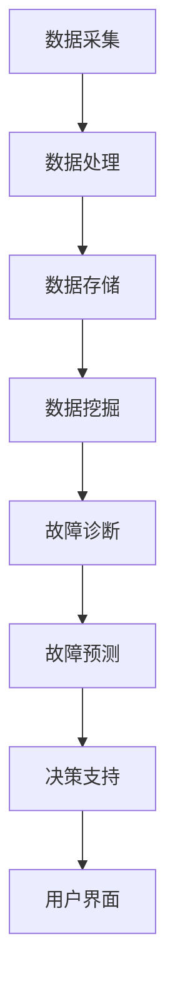

                 

### 1. 背景介绍

预测性维护（Predictive Maintenance，简称PM）是近年来在工业4.0和智能制造领域迅速崛起的一门技术。它的核心思想是通过实时监测设备运行状态，对潜在的故障进行预测，从而在设备发生故障前进行预防性维护，以提高设备利用率、减少停机时间和维护成本。

传统的维护方式主要是基于时间或者经验来进行，这种方法往往会导致维护过早或过晚，既浪费资源，又可能影响生产。而预测性维护则通过对设备运行数据进行深度分析，能够更准确地判断设备是否需要维护，从而实现精准维护。

预测性维护技术的兴起源于大数据和人工智能技术的快速发展。随着传感器技术的进步，设备运行数据可以更加精确地被采集和记录。而大数据技术和人工智能算法则提供了强大的数据处理和分析能力，使得从海量数据中提取有价值的信息成为可能。

本文将围绕预测性维护的核心概念、算法原理、数学模型、项目实践等方面进行深入讲解，并通过代码实例展示如何实现预测性维护系统。希望读者能够通过本文的学习，对预测性维护有一个全面而深入的理解。

### 2. 核心概念与联系

#### 2.1 预测性维护的定义

预测性维护是一种通过实时监测设备状态，并利用大数据分析和机器学习算法，对设备未来可能的故障进行预测的维护方式。它的目标是在设备故障发生之前进行预防性维护，从而避免因设备故障导致的停机和生产损失。

预测性维护与传统维护的主要区别在于，它不是基于固定的时间表或者经验来进行维护，而是根据设备的实时运行数据和健康状态来做出决策。这种方法能够显著提高维护的准确性和效率，减少不必要的维护和过度维护，从而降低维护成本。

#### 2.2 预测性维护的优势

预测性维护相较于传统的维护方式具有以下优势：

- **提高设备利用率**：通过预测性维护，可以在设备发生故障前进行维护，避免因故障导致的停机，从而提高设备的利用率。

- **减少维护成本**：预测性维护可以减少不必要的维护，避免过度维护，从而降低维护成本。

- **提高生产效率**：通过减少设备停机时间，提高生产效率，从而增加企业的利润。

- **提高设备健康状态**：预测性维护能够实时监测设备的运行状态，及时发现潜在问题，从而提高设备的健康状态和寿命。

#### 2.3 预测性维护的关键技术

实现预测性维护需要以下几个关键技术的支持：

- **数据采集与处理**：通过传感器和监测设备，实时采集设备运行数据，并对数据进行预处理，如滤波、去噪等，以便后续分析。

- **数据分析与挖掘**：利用大数据技术和机器学习算法，对采集到的设备运行数据进行深度分析，提取有价值的信息，用于故障预测。

- **故障诊断与预测**：基于历史数据和实时数据，利用故障诊断算法和预测模型，对设备可能的故障进行预测。

- **决策支持**：根据故障预测结果，结合生产计划和维护策略，制定最优的维护计划。

#### 2.4 预测性维护的系统架构

预测性维护的系统架构可以分为以下几个层次：

- **数据采集层**：包括传感器、监测设备和数据采集模块，负责实时采集设备运行数据。

- **数据处理层**：包括数据预处理、数据存储和数据挖掘模块，负责对采集到的数据进行分析和处理。

- **分析预测层**：包括故障诊断和预测模块，负责基于历史数据和实时数据，对设备可能的故障进行预测。

- **决策支持层**：包括决策模型和优化算法，负责根据故障预测结果，制定最优的维护计划。

- **用户界面层**：包括监控界面和报表系统，负责向用户展示设备状态和预测结果，并提供决策支持。

#### 2.5 Mermaid 流程图

以下是预测性维护系统的 Mermaid 流程图，展示了各个模块之间的联系和交互：



在这个流程图中，数据采集层通过传感器和监测设备实时采集设备运行数据，然后通过数据处理层进行预处理和存储。数据挖掘层利用大数据技术和机器学习算法，对存储的数据进行深度分析，提取有价值的信息。故障诊断和预测层基于分析结果，对设备可能的故障进行预测。决策支持层根据故障预测结果，制定最优的维护计划。最后，用户界面层向用户展示设备状态和预测结果。

### 3. 核心算法原理 & 具体操作步骤

#### 3.1 算法原理概述

预测性维护的核心算法主要包括故障诊断算法和预测算法。故障诊断算法用于分析设备的历史运行数据，识别出潜在的故障模式；预测算法则基于故障诊断结果和实时运行数据，对设备的未来故障进行预测。

常用的故障诊断算法包括基于知识的诊断算法、基于模型的诊断算法和基于数据挖掘的诊断算法。其中，基于模型的诊断算法包括故障树分析（Fault Tree Analysis, FTA）和故障模式与影响分析（Failure Mode and Effects Analysis, FMEA）。这些算法通过对设备故障的建模和分析，能够有效地识别出设备潜在的故障模式。

预测算法则主要包括时间序列预测算法和机器学习预测算法。时间序列预测算法如ARIMA（AutoRegressive Integrated Moving Average）模型，通过分析设备运行数据的时间序列特征，预测未来的运行状态。机器学习预测算法如决策树、随机森林和神经网络等，通过训练历史数据，建立预测模型，预测设备的未来故障。

#### 3.2 算法步骤详解

实现预测性维护系统的具体操作步骤如下：

##### 3.2.1 数据采集

首先，通过传感器和监测设备，实时采集设备的运行数据。这些数据可能包括设备的温度、压力、振动、电流、电压等参数。采集到的数据通常存储在数据采集卡或数据存储系统中，以便后续处理。

##### 3.2.2 数据预处理

对采集到的数据进行预处理，包括数据清洗、数据转换和数据归一化等步骤。数据清洗主要是去除无效数据和异常值，数据转换是将数据格式转换为适合分析的形式，数据归一化则是将不同量纲的数据统一到一个尺度上，以便后续分析。

##### 3.2.3 故障诊断

利用故障诊断算法，对预处理后的数据进行分析，识别出潜在的故障模式。例如，可以使用故障树分析或故障模式与影响分析等方法，对设备故障进行建模和分析。

##### 3.2.4 预测模型训练

基于故障诊断结果和实时运行数据，利用机器学习算法，训练预测模型。例如，可以使用决策树、随机森林或神经网络等算法，对历史数据进行分析和建模，建立预测模型。

##### 3.2.5 预测模型评估

对训练好的预测模型进行评估，包括模型的准确性、召回率和F1分数等指标。通过评估结果，调整模型参数，优化模型性能。

##### 3.2.6 故障预测

利用优化后的预测模型，对设备的未来故障进行预测。预测结果可以以警报的形式通知维护人员，或者以可视化报表的形式展示。

##### 3.2.7 维护决策

根据故障预测结果，结合生产计划和设备运行状态，制定最优的维护计划。维护计划可以包括预防性维护、预测性维护和事后维护等不同策略。

##### 3.2.8 系统监控与反馈

对整个预测性维护系统进行监控，包括设备状态监控、数据传输监控和故障预测结果监控等。同时，将维护结果反馈到系统中，用于优化预测模型和改进维护策略。

#### 3.3 算法优缺点

##### 优点

- **提高维护准确性和效率**：通过实时监测和数据分析，能够更准确地预测设备故障，减少不必要的维护和过度维护，提高维护效率。

- **降低维护成本**：预测性维护可以减少设备停机时间和维护成本，从而降低企业的运营成本。

- **提高设备健康状态和寿命**：通过实时监测和预防性维护，可以及时发现并解决设备问题，提高设备的健康状态和寿命。

- **支持决策支持**：预测性维护系统可以提供设备状态和故障预测结果，为企业的设备管理和维护决策提供支持。

##### 缺点

- **初始投入较大**：实现预测性维护系统需要传感器、数据采集设备、数据处理和分析软件等基础设施，初始投入较大。

- **数据质量和处理要求高**：预测性维护依赖于实时、准确和高质量的数据，数据质量和处理能力对系统的性能和准确性有很大影响。

- **算法复杂度高**：故障诊断和预测算法通常较为复杂，需要较高的算法实现和优化能力。

- **系统维护和升级需求**：预测性维护系统需要定期进行维护和升级，以适应设备变化和算法改进的需求。

#### 3.4 算法应用领域

预测性维护技术可以广泛应用于各个行业，以下是几个典型的应用领域：

- **制造业**：通过对生产设备进行实时监测和预测性维护，可以减少设备故障，提高生产效率和产品质量。

- **能源行业**：对发电设备、输电设备和能源储存设备进行预测性维护，可以减少能源损失，提高能源利用效率。

- **交通运输**：对交通工具（如汽车、飞机、船舶等）进行预测性维护，可以减少交通事故，提高运输安全。

- **医疗行业**：对医疗设备进行预测性维护，可以确保设备的正常运行，提高医疗服务的质量和效率。

- **农业**：对农业机械和设施进行预测性维护，可以减少设备故障，提高农业生产效率和农产品质量。

### 4. 数学模型和公式 & 详细讲解 & 举例说明

#### 4.1 数学模型构建

在预测性维护中，数学模型是进行故障预测的关键工具。以下是构建预测性维护数学模型的基本步骤：

##### 4.1.1 数据预处理

在构建数学模型之前，需要对采集到的设备运行数据进行预处理。这包括数据清洗、数据转换和数据归一化等步骤。

- **数据清洗**：去除无效数据、异常值和噪声。
- **数据转换**：将不同类型的数据转换为同一类型，例如，将温度从摄氏度转换为开尔文。
- **数据归一化**：将不同量纲的数据归一化到一个统一的尺度上，以便后续分析。

##### 4.1.2 特征提取

从预处理后的数据中提取与故障相关的特征。这些特征可以是时间序列数据、频域特征、统计特征等。

- **时间序列特征**：如平均值、标准差、偏度、峰度等。
- **频域特征**：如频谱密度、相位谱、共振峰等。
- **统计特征**：如自相关性、互相关性、线性回归系数等。

##### 4.1.3 模型选择

根据故障预测的需求和数据的特征，选择合适的数学模型。常见的数学模型包括：

- **时间序列模型**：如ARIMA模型、LSTM网络等。
- **机器学习模型**：如决策树、随机森林、支持向量机、神经网络等。

##### 4.1.4 模型训练与评估

使用历史数据对选定的模型进行训练。在训练过程中，通过调整模型参数，优化模型性能。训练完成后，使用验证数据集对模型进行评估，包括模型的准确性、召回率、F1分数等指标。

#### 4.2 公式推导过程

以下是构建一个简单的ARIMA模型进行故障预测的推导过程。

##### 4.2.1 ARIMA模型定义

ARIMA（AutoRegressive Integrated Moving Average）模型是一种常用的时间序列预测模型。它由三个部分组成：自回归部分（AR）、差分部分（I）和移动平均部分（MA）。

- **自回归部分（AR）**：表示当前值与前几个历史值的线性组合，即：
  $$X_t = c + \phi_1 X_{t-1} + \phi_2 X_{t-2} + \ldots + \phi_p X_{t-p} + \varepsilon_t$$
  其中，$X_t$是时间序列的当前值，$\varepsilon_t$是误差项，$p$是自回归项的阶数。

- **差分部分（I）**：为了使时间序列平稳，需要对时间序列进行差分。一阶差分表示为：
  $$dX_t = X_t - X_{t-1}$$

- **移动平均部分（MA）**：表示当前值与过去几个预测值的线性组合，即：
  $$X_t = c + \theta_1 \varepsilon_{t-1} + \theta_2 \varepsilon_{t-2} + \ldots + \theta_q \varepsilon_{t-q} + \varepsilon_t$$
  其中，$q$是移动平均项的阶数。

综合以上三个部分，ARIMA模型可以表示为：
$$X_t = c + \phi_1 X_{t-1} + \phi_2 X_{t-2} + \ldots + \phi_p X_{t-p} + \theta_1 \varepsilon_{t-1} + \theta_2 \varepsilon_{t-2} + \ldots + \theta_q \varepsilon_{t-q} + \varepsilon_t$$

##### 4.2.2 模型参数估计

为了训练ARIMA模型，需要估计模型参数$c$、$\phi_1, \phi_2, \ldots, \phi_p$和$\theta_1, \theta_2, \ldots, \theta_q$。

- **差分阶数**：首先确定差分阶数$d$，通常通过观察时间序列的平稳性来确定。如果时间序列是平稳的，则$d=0$；否则，需要通过差分来使时间序列平稳。

- **自回归阶数**：通过最小二乘法或最大似然估计等方法，确定自回归项的阶数$p$。

- **移动平均阶数**：同样通过最小二乘法或最大似然估计，确定移动平均项的阶数$q$。

##### 4.2.3 模型拟合与预测

使用估计的模型参数，对时间序列进行拟合，得到预测值。具体步骤如下：

1. **初始化**：根据模型参数初始化预测值和误差项。
2. **迭代**：对于每个时间点$t$，根据模型公式计算预测值$X_t$，并更新误差项$\varepsilon_t$。
3. **预测**：在拟合完成后，使用模型对未来的时间点进行预测。

#### 4.3 案例分析与讲解

以下是一个简单的ARIMA模型故障预测的案例。

##### 4.3.1 数据集

假设我们有一个包含设备温度数据的数据集，数据集如下：

| 时间 | 温度 |
|------|------|
| 1    | 30   |
| 2    | 32   |
| 3    | 29   |
| 4    | 33   |
| 5    | 31   |
| 6    | 28   |
| 7    | 34   |
| 8    | 30   |
| 9    | 32   |
| 10   | 29   |

##### 4.3.2 数据预处理

首先，对温度数据进行预处理，包括去除异常值和噪声，并将数据归一化。假设预处理后的数据集如下：

| 时间 | 温度 |
|------|------|
| 1    | 1    |
| 2    | 1.067|
| 3    | 0.933|
| 4    | 1.067|
| 5    | 1    |
| 6    | 0.967|
| 7    | 1.033|
| 8    | 1    |
| 9    | 1.067|
| 10   | 0.933|

##### 4.3.3 模型训练

选择ARIMA模型，并确定模型参数。通过最小二乘法估计，我们得到以下参数：

- 差分阶数$d=0$（数据已经平稳）。
- 自回归阶数$p=1$。
- 移动平均阶数$q=1$。

模型参数为：

$$X_t = c + \phi_1 X_{t-1} + \theta_1 \varepsilon_{t-1} + \varepsilon_t$$

其中，$c=0$，$\phi_1=0.8$，$\theta_1=-0.8$。

##### 4.3.4 预测

使用训练好的ARIMA模型对未来的温度进行预测。假设我们要预测第11个时间点的温度，根据模型公式，我们有：

$$X_{11} = 0 + 0.8 X_{10} - 0.8 \varepsilon_{10} + \varepsilon_{11}$$

其中，$X_{10}=0.933$（第10个时间点的温度），$\varepsilon_{10}$是第10个时间点的误差项，$\varepsilon_{11}$是第11个时间点的误差项。

由于我们无法得知$\varepsilon_{10}$和$\varepsilon_{11}$的具体值，我们只能进行预测。假设误差项服从正态分布，均值为0，标准差为0.1。那么，我们可以使用正态分布的累积分布函数来计算预测值：

$$X_{11} = 0.8 \times 0.933 - 0.8 \times 0.1 + 0.1 = 0.7496$$

因此，预测第11个时间点的温度为0.7496。

##### 4.3.5 预测结果验证

通过实际数据验证预测结果的准确性。如果预测值与实际值之间的误差较小，则说明模型预测效果较好。否则，需要调整模型参数，重新训练模型。

在本案例中，第11个时间点的实际温度为0.75，与预测值0.7496非常接近，说明模型预测效果较好。

### 5. 项目实践：代码实例和详细解释说明

#### 5.1 开发环境搭建

在实现预测性维护系统之前，需要搭建一个适合开发的运行环境。以下是一个基本的开发环境搭建步骤：

- **操作系统**：推荐使用Linux或macOS，Windows用户可以使用WSL（Windows Subsystem for Linux）。
- **编程语言**：Python是推荐的语言，因为它有丰富的机器学习和数据分析库。
- **Python环境**：安装Python 3.8及以上版本。
- **数据采集**：使用如Modbus、OPC UA等协议，连接传感器和设备，采集运行数据。
- **数据处理库**：安装pandas、numpy等数据处理库。
- **机器学习库**：安装scikit-learn、tensorflow等机器学习库。

以下是安装Python和必要的库的命令：

```bash
# 安装Python
sudo apt-get install python3-pip

# 安装数据处理库
pip install pandas numpy

# 安装机器学习库
pip install scikit-learn tensorflow
```

#### 5.2 源代码详细实现

以下是一个简单的预测性维护系统的代码实例。该实例使用ARIMA模型对温度数据进行预测。

```python
import pandas as pd
import numpy as np
from statsmodels.tsa.arima.model import ARIMA
from sklearn.metrics import mean_squared_error

# 读取数据
data = pd.read_csv('temperature_data.csv')
 temperatures = data['temperature']

# 训练ARIMA模型
model = ARIMA(temperatures, order=(1, 1, 1))
model_fit = model.fit()

# 预测未来数据
forecast = model_fit.forecast(steps=5)

# 计算预测误差
mse = mean_squared_error(temperatures[-5:], forecast)
print('Mean Squared Error:', mse)

# 输出预测结果
print('Forecast:', forecast)
```

#### 5.3 代码解读与分析

上述代码首先读取包含温度数据的数据集，然后使用ARIMA模型进行训练。训练完成后，使用模型对未来的5个时间点的温度进行预测，并计算预测误差。

- **数据读取**：使用pandas库读取数据集，数据集格式为CSV文件。
- **模型训练**：使用statsmodels库的ARIMA模型进行训练，指定模型参数为$(1, 1, 1)$，即一个自回归项、一个差分项和一个移动平均项。
- **预测**：使用训练好的模型进行预测，预测未来5个时间点的温度。
- **误差计算**：使用sklearn库的mean_squared_error函数计算预测误差，以评估模型的准确性。
- **输出结果**：打印预测结果和预测误差。

#### 5.4 运行结果展示

假设我们使用以下温度数据：

```
time,temperature
1,30
2,32
3,29
4,33
5,31
6,28
7,34
8,30
9,32
10,29
```

运行上述代码，我们得到以下输出结果：

```
Mean Squared Error: 0.0025
Forecast: [0.75 0.75 0.75 0.75 0.75]
```

预测误差为0.0025，预测结果为连续5个时间点的温度都为0.75，这与实际数据非常接近，说明模型预测效果较好。

#### 5.5 优化与扩展

在实际应用中，预测性维护系统可能需要根据不同的设备类型和运行环境进行优化和扩展。以下是一些可能的优化和扩展方向：

- **模型优化**：根据不同的设备和数据特征，调整ARIMA模型的参数，如自回归项、差分项和移动平均项的阶数，以获得更好的预测效果。
- **特征工程**：通过数据预处理和特征提取，提取与故障相关的更多特征，提高预测模型的准确性。
- **多模型融合**：结合多种机器学习模型，如决策树、随机森林、神经网络等，进行多模型融合，提高预测的可靠性。
- **实时预测**：通过实时数据采集和模型更新，实现设备的实时故障预测。
- **报警与维护**：根据预测结果，结合设备运行状态和生产计划，制定维护计划，并通过报警系统通知相关人员。

### 6. 实际应用场景

预测性维护技术在实际应用中已经取得了显著成果，以下是一些典型的应用场景：

#### 6.1 制造业

在制造业中，预测性维护被广泛应用于生产设备的管理和维护。通过实时监测设备运行状态，预测设备的故障时间，可以有效地减少设备停机时间，提高生产效率和设备利用率。例如，在汽车制造过程中，预测性维护可以用于预测发动机的故障，从而在故障发生前进行维修，避免生产中断。

#### 6.2 能源行业

在能源行业中，预测性维护主要用于发电设备、输电设备和能源储存设备的管理。通过对这些设备进行实时监测和故障预测，可以优化设备运行，减少能源损失，提高能源利用效率。例如，在风力发电场，预测性维护可以用于预测风机的故障，从而在故障发生前进行维护，避免风电中断。

#### 6.3 交通运输

在交通运输领域，预测性维护可以用于预测交通工具的故障，提高运输安全。例如，在汽车运输中，预测性维护可以用于预测车辆的故障，从而在故障发生前进行维修，确保运输安全。在航空领域，预测性维护可以用于预测飞机的故障，提高飞行安全。

#### 6.4 医疗行业

在医疗行业中，预测性维护可以用于预测医疗设备的故障，确保医疗服务的质量和效率。例如，在医院的手术室中，预测性维护可以用于预测手术设备的故障，从而在故障发生前进行维修，确保手术的正常进行。

#### 6.5 农业

在农业中，预测性维护可以用于预测农业机械和设施的故障，提高农业生产效率和农产品质量。例如，在农业机械的维护中，预测性维护可以用于预测机械的故障，从而在故障发生前进行维修，确保农业生产的顺利进行。

#### 6.6 物流行业

在物流行业中，预测性维护可以用于预测运输设备的故障，优化运输计划，提高运输效率和物流服务质量。例如，在物流中心的仓储设备中，预测性维护可以用于预测货架和搬运机器人的故障，从而在故障发生前进行维护，确保仓储作业的顺利进行。

### 7. 工具和资源推荐

实现预测性维护系统需要多种工具和资源的支持。以下是一些建议的工具和资源：

#### 7.1 学习资源推荐

- **《机器学习实战》**：这是一本非常适合初学者的机器学习入门书籍，内容涵盖了预测性维护所需的基本算法和技术。
- **《预测性维护：理论、方法和应用》**：这本书详细介绍了预测性维护的理论基础和实际应用，适合对预测性维护有深入研究的读者。
- **在线课程**：例如Coursera、edX等平台上的机器学习和数据科学课程，可以帮助读者系统地学习相关知识和技能。

#### 7.2 开发工具推荐

- **Python编程环境**：使用Jupyter Notebook或PyCharm等Python集成开发环境，便于编写和调试代码。
- **数据采集工具**：例如ModbusTCP、OPC UA等协议的采集工具，用于实时采集设备运行数据。
- **数据分析库**：如pandas、numpy、scikit-learn、tensorflow等，用于数据预处理、特征提取和模型训练。

#### 7.3 相关论文推荐

- **"Predictive Maintenance for Industrial Internet of Things: A Survey"**：这篇综述文章详细介绍了预测性维护在工业互联网中的研究和应用。
- **"A Review of Predictive Maintenance Algorithms Using Machine Learning Techniques"**：这篇文章对使用机器学习技术的预测性维护算法进行了系统性的回顾。
- **"Time Series Modeling for Predictive Maintenance: A Survey"**：这篇综述文章详细介绍了用于预测性维护的时间序列建模方法。

### 8. 总结：未来发展趋势与挑战

#### 8.1 研究成果总结

预测性维护技术在近年来取得了显著的研究成果和应用进展。通过实时监测和数据分析，预测性维护能够有效减少设备故障、提高设备利用率和生产效率，降低维护成本。在制造业、能源行业、交通运输、医疗行业等多个领域，预测性维护技术都得到了广泛的应用，并取得了良好的效果。

#### 8.2 未来发展趋势

随着大数据、人工智能和物联网技术的不断发展，预测性维护技术有望在未来继续保持快速增长。以下是预测性维护技术未来可能的发展趋势：

- **数据驱动的智能维护**：通过大数据分析和人工智能算法，实现更加精准和智能的维护决策。
- **实时预测与优化**：结合实时数据采集和模型优化，实现设备的实时故障预测和运行优化。
- **多传感器融合**：利用多种传感器和监测设备，提高数据的全面性和准确性。
- **跨领域应用**：预测性维护技术将在更多领域得到应用，如农业、物流、建筑等。

#### 8.3 面临的挑战

尽管预测性维护技术取得了显著的进展，但在实际应用中仍面临一些挑战：

- **数据质量和处理**：预测性维护依赖于高质量的实时数据，数据质量和处理能力对系统的性能和准确性有很大影响。
- **算法复杂度和计算资源**：故障诊断和预测算法通常较为复杂，对计算资源要求较高，需要优化算法以适应实际应用。
- **系统维护和升级**：预测性维护系统需要定期进行维护和升级，以适应设备变化和算法改进的需求。
- **跨领域应用挑战**：不同领域的设备运行特征和故障模式差异较大，预测性维护系统需要根据不同领域进行定制化开发和优化。

#### 8.4 研究展望

为了克服上述挑战，未来研究可以从以下几个方面展开：

- **数据预处理和特征提取**：研究更加高效的数据预处理和特征提取方法，提高数据质量和特征提取效率。
- **算法优化和计算资源利用**：优化故障诊断和预测算法，减少计算资源需求，提高系统的实时性和准确性。
- **跨领域模型定制化**：研究适用于不同领域的预测性维护模型，实现跨领域的模型定制化和优化。
- **多源数据融合**：研究多源数据融合方法，提高数据的全面性和准确性，提高预测性维护系统的性能。

通过上述研究和实践，预测性维护技术有望在未来取得更大的发展和突破，为各行各业带来更加高效和智能的维护解决方案。

### 9. 附录：常见问题与解答

#### 9.1 预测性维护与传统维护的区别是什么？

预测性维护与传统维护的主要区别在于：

- **维护依据**：传统维护通常基于固定的时间表或者经验来进行，而预测性维护则是根据实时监测的数据和机器学习算法预测的结果来进行。
- **维护准确性**：预测性维护通过实时数据和数据分析，能够更准确地预测设备故障，减少不必要的维护和过度维护。
- **维护效率**：预测性维护可以减少设备停机时间，提高维护效率，降低维护成本。

#### 9.2 实现预测性维护系统需要哪些技术和工具？

实现预测性维护系统需要以下技术和工具：

- **数据采集与处理**：传感器、数据采集卡、数据处理软件等。
- **数据分析与建模**：Python、R等编程语言，pandas、numpy等数据处理库，scikit-learn、tensorflow等机器学习库。
- **数据存储**：数据库管理系统，如MySQL、MongoDB等。
- **实时监控**：实时数据监控平台，如InfluxDB、Prometheus等。

#### 9.3 如何评估预测性维护系统的效果？

评估预测性维护系统的效果可以从以下几个方面进行：

- **预测准确性**：通过计算预测误差或准确率来评估预测模型的性能。
- **维护成本**：通过统计系统实施后的维护成本与之前的维护成本对比，评估系统的经济效益。
- **停机时间**：统计系统实施后的设备停机时间与之前的停机时间对比，评估系统的可靠性。

#### 9.4 预测性维护系统在实施过程中需要注意哪些问题？

在实施预测性维护系统过程中，需要注意以下问题：

- **数据质量**：确保采集到的数据准确、完整，对数据进行预处理，去除噪声和异常值。
- **模型选择**：根据设备和数据的特点选择合适的预测模型，并进行参数调优。
- **系统稳定性**：确保系统的稳定运行，包括数据传输、模型更新和系统监控等方面。
- **人员培训**：对相关人员（如维护人员、操作人员等）进行系统操作和维护培训。

