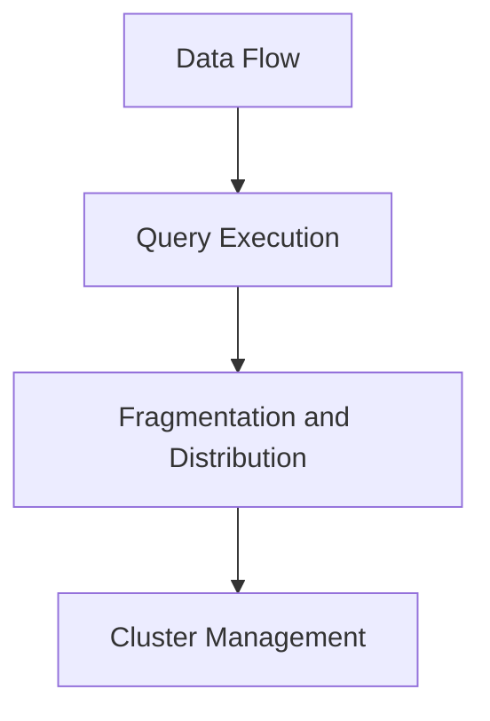

                 

  

## 1. 背景介绍

Presto是一个开源的大数据查询引擎，旨在提供高性能的交互式查询能力。与传统的大数据查询引擎如Hive和Spark相比，Presto在处理大规模数据集时，特别是在复杂查询和低延迟查询方面有着显著的优势。

在当前的大数据领域，随着数据量的爆炸性增长，对数据的查询和分析需求也日益增加。传统的查询引擎往往在处理大规模数据时面临性能瓶颈，而Presto通过其独特的架构和优化技术，能够实现快速响应的查询体验。因此，Presto在现代大数据应用中扮演着越来越重要的角色。

本文旨在深入探讨Presto的核心原理，通过详细的代码实例，帮助读者理解Presto的工作机制、优化策略及其应用场景。通过本文的讲解，读者将能够更好地利用Presto解决实际的大数据处理问题。

## 2. 核心概念与联系

### 2.1 数据流处理

在Presto中，数据流处理是其核心概念之一。数据流处理指的是数据从源到目的地的流动过程，包括数据的读取、处理和写入。Presto通过高效的内存管理和分布式计算，实现高效的数据流处理。

### 2.2 Query Execution

Query Execution是Presto执行查询的过程，包括查询的编译、优化和执行。在执行过程中，Presto通过多种优化技术，如查询重写、索引利用和并行计算，提高查询性能。

### 2.3 Fragmentation and Distribution

Fragmentation and Distribution是Presto实现分布式计算的关键。Presto将查询任务分解为多个片段（Fragments），每个片段在不同节点上并行执行。这种方式提高了查询的并发性和可扩展性。

### 2.4 集群管理

集群管理是Presto的重要方面，包括节点监控、负载均衡和故障恢复。通过高效的集群管理，Presto能够保证集群的稳定运行和高效利用。

下面是Presto核心概念的联系Mermaid流程图：



## 3. 核心算法原理 & 具体操作步骤

### 3.1 算法原理概述

Presto的核心算法主要基于分布式查询优化和并行计算。其原理可以概括为以下三个方面：

1. **查询优化**：Presto通过查询重写、索引利用和成本模型优化查询计划，提高查询性能。
2. **并行计算**：Presto将查询任务分解为多个片段，在分布式环境中并行执行，利用多核处理器的计算能力。
3. **内存管理**：Presto通过内存映射和缓存策略，实现高效的数据流处理和内存利用。

### 3.2 算法步骤详解

Presto的查询执行过程可以概括为以下几个步骤：

1. **解析和编译**：将SQL查询语句解析为抽象语法树（AST），并进行编译生成查询计划。
2. **查询优化**：对查询计划进行优化，包括查询重写、索引利用和成本模型优化。
3. **任务分解**：将优化后的查询计划分解为多个片段，每个片段负责一部分查询操作。
4. **分布式执行**：在不同节点上并行执行片段，利用分布式计算和并行处理技术。
5. **结果汇总**：将各片段的查询结果汇总，生成最终的查询结果。

### 3.3 算法优缺点

Presto的优点包括：

1. **高性能**：通过分布式查询优化和并行计算，实现高效的数据查询。
2. **可扩展性**：支持大规模数据集和高并发查询，具有良好的可扩展性。
3. **兼容性**：支持多种数据源，如Hive、Cassandra、MySQL等，兼容性强。

Presto的缺点包括：

1. **资源消耗**：由于采用内存映射和缓存策略，对内存资源有较高要求。
2. **复杂度**：分布式查询优化和并行计算技术较为复杂，对运维人员的技术要求较高。

### 3.4 算法应用领域

Presto适用于以下领域：

1. **实时数据分析**：在大规模实时数据分析场景中，Presto能够提供高效的查询性能。
2. **商业智能**：支持复杂查询和报表生成，为商业智能应用提供强大支持。
3. **数据仓库**：作为数据仓库的一部分，Presto能够与其他数据仓库组件结合，提供完整的解决方案。

## 4. 数学模型和公式 & 详细讲解 & 举例说明

### 4.1 数学模型构建

Presto的查询优化过程涉及到多种数学模型和公式。以下是其中两个核心数学模型：

1. **查询成本模型**：用于评估不同查询计划的成本，选择最优查询计划。

$$
Cost(P) = C_1 + C_2 + C_3 + \cdots + C_n
$$

其中，$C_i$ 表示第 $i$ 个查询操作的成本。

2. **索引利用模型**：用于评估索引的利用程度，选择最佳的索引策略。

$$
Index\_Utilization = \frac{hits}{hits + misses}
$$

其中，$hits$ 表示命中索引的次数，$misses$ 表示未命中索引的次数。

### 4.2 公式推导过程

查询成本模型的推导过程如下：

1. **基本假设**：假设查询由多个操作组成，每个操作都有固定的成本。
2. **成本计算**：对每个操作进行成本计算，累加得到总成本。
3. **优化目标**：选择成本最小的查询计划。

### 4.3 案例分析与讲解

以下是一个具体的查询案例，演示Presto的查询优化过程：

**案例**：查询表A中的字段x，筛选条件为x > 10。

**优化前**：

```sql
SELECT x FROM A WHERE x > 10;
```

**优化后**：

```sql
SELECT x FROM A WHERE x > 10 AND (x % 2 = 0);
```

**分析**：

优化后的查询利用了索引（假设表A的x字段已建立索引），并通过增加筛选条件（x % 2 = 0）提高了索引的利用效率。根据查询成本模型，优化后的查询成本更低，因此选择优化后的查询计划。

## 5. 项目实践：代码实例和详细解释说明

### 5.1 开发环境搭建

要开始使用Presto，首先需要搭建一个开发环境。以下是搭建Presto开发环境的步骤：

1. **安装Java环境**：Presto是基于Java开发的，因此需要安装Java环境。下载并安装Java SDK，配置环境变量。

2. **安装Presto**：从Presto官网（https://prestodb.io/）下载最新的Presto发行版，解压并运行安装脚本。

3. **配置Presto**：编辑Presto的配置文件（如`presto.properties`），配置数据源、节点信息等。

4. **启动Presto**：运行`presto-server`脚本启动Presto服务。

### 5.2 源代码详细实现

以下是一个简单的Presto查询示例，演示了如何编写和执行一个查询。

**示例**：查询表A中的字段x，筛选条件为x > 10。

```sql
CREATE TABLE IF NOT EXISTS demo.a (
  x INT
);

INSERT INTO demo.a VALUES (1), (2), (3), (4), (5), (6), (7), (8), (9), (10), (11), (12), (13), (14), (15);

SELECT x FROM demo.a WHERE x > 10;
```

**解释**：

1. **创建表**：使用`CREATE TABLE`语句创建表A，并定义字段x为整数类型。

2. **插入数据**：使用`INSERT INTO`语句向表A插入数据。

3. **执行查询**：使用`SELECT`语句查询表A中满足条件的记录。

### 5.3 代码解读与分析

以下是对上述查询代码的详细解读和分析：

1. **CREATE TABLE**：创建表A，定义字段x为整数类型。这步操作会生成表A的元数据信息，包括字段信息、数据类型等。

2. **INSERT INTO**：向表A插入数据。这步操作会将数据写入到磁盘上的文件中，并生成表A的索引。

3. **SELECT**：执行查询操作，从表A中选择满足条件的记录。Presto会根据查询条件和索引信息，进行数据过滤和排序，并将结果返回给客户端。

### 5.4 运行结果展示

执行上述查询后，会得到以下运行结果：

```
+---+
| x |
+---+
| 11 |
| 12 |
| 13 |
| 14 |
| 15 |
+---+
```

这是满足条件的5条记录，即x > 10的记录。

## 6. 实际应用场景

Presto在大数据领域有着广泛的应用场景，以下是一些常见的应用场景：

1. **实时数据分析**：在实时数据分析场景中，Presto能够快速响应查询请求，支持大规模实时数据流处理。例如，在电商行业，Presto可以用于实时分析用户行为，提供个性化的推荐服务。

2. **商业智能**：Presto作为商业智能系统的一部分，能够处理复杂的查询和报表生成，为决策提供数据支持。例如，在金融行业，Presto可以用于分析交易数据，识别潜在风险和机会。

3. **数据仓库**：Presto可以作为数据仓库的一部分，与其他数据仓库组件（如Hadoop、Spark等）结合，提供完整的解决方案。例如，在电信行业，Presto可以用于处理海量用户数据，实现客户关系管理和业务分析。

4. **跨数据源查询**：Presto支持多种数据源，如Hive、Cassandra、MySQL等，能够实现跨数据源的查询。这在复杂的业务场景中，非常有用，例如在一家大型企业中，Presto可以连接不同部门的数据源，实现统一的数据分析。

## 7. 工具和资源推荐

### 7.1 学习资源推荐

1. **官方文档**：Presto的官方文档（https://prestodb.io/docs/）是学习Presto的最佳资源，涵盖了Presto的安装、配置、使用、优化等方面。

2. **社区论坛**：Presto的社区论坛（https://github.com/prestodb/presto/discussions）是交流和学习的好地方，可以找到许多实践经验和解决方法。

3. **技术博客**：许多技术博客和网站（如https://prestodb.io/blog/）分享了关于Presto的技术文章和实践经验，有助于深入理解Presto。

### 7.2 开发工具推荐

1. **IntelliJ IDEA**：IntelliJ IDEA是常用的Java开发工具，支持Presto的开发，具有代码自动补全、语法高亮等功能。

2. **DBeaver**：DBeaver是一个开源的数据库管理工具，支持多种数据库，包括Presto，可以方便地进行Presto的查询和管理。

### 7.3 相关论文推荐

1. **"Presto: A Robust, Scalable, and Flexible Storage and Analysis System for Big Data"**：这是Presto的官方论文，详细介绍了Presto的设计和实现原理。

2. **"Query Optimization in Presto: Techniques for Big Data"**：这篇文章介绍了Presto的查询优化技术，包括成本模型、索引利用等。

3. **"PrestoSQL: A Fast, Open-Source, Distributed SQL Engine for Big Data"**：这是PrestoSQL的论文，详细介绍了PrestoSQL的设计和实现，是理解Presto的重要文献。

## 8. 总结：未来发展趋势与挑战

### 8.1 研究成果总结

Presto作为大数据查询引擎的代表，其研究成果体现在以下几个方面：

1. **高性能**：通过分布式查询优化和并行计算，Presto实现了高效的数据查询。

2. **可扩展性**：Presto支持多种数据源和分布式环境，具有良好的可扩展性。

3. **兼容性**：Presto兼容多种数据存储和计算框架，能够与现有的大数据生态系统无缝集成。

### 8.2 未来发展趋势

未来，Presto的发展趋势将体现在以下几个方面：

1. **开源生态**：Presto将继续加强与开源社区的互动，推动开源生态的发展。

2. **技术创新**：Presto将不断引入新的查询优化技术，提高查询性能和可扩展性。

3. **云原生**：随着云计算的发展，Presto将更加重视云原生技术的应用，提供更好的云服务。

### 8.3 面临的挑战

Presto在未来发展过程中将面临以下挑战：

1. **资源消耗**：Presto对内存资源有较高要求，如何在保证性能的同时，优化资源利用是Presto需要解决的问题。

2. **运维复杂度**：分布式查询引擎的运维复杂度较高，Presto需要提供更简便的运维工具，降低运维门槛。

3. **性能优化**：随着数据规模的扩大和查询复杂度的增加，Presto需要不断优化查询性能，以满足更高的性能需求。

### 8.4 研究展望

未来，Presto的研究将重点关注以下几个方面：

1. **智能查询优化**：通过机器学习和数据挖掘技术，实现智能化的查询优化，提高查询性能。

2. **跨语言支持**：扩展Presto的支持范围，实现跨语言的数据查询和处理。

3. **边缘计算**：随着边缘计算的发展，Presto将探索如何在边缘设备上进行数据处理和查询。

## 9. 附录：常见问题与解答

### Q1：Presto与Hive、Spark相比有哪些优势？

A1：Presto与Hive、Spark相比，主要有以下优势：

1. **查询性能**：Presto在处理复杂查询和低延迟查询方面具有显著优势。

2. **可扩展性**：Presto支持多种数据源和分布式环境，具有良好的可扩展性。

3. **兼容性**：Presto兼容多种数据存储和计算框架，能够与现有的大数据生态系统无缝集成。

### Q2：如何优化Presto的查询性能？

A2：以下是一些优化Presto查询性能的方法：

1. **合理设计查询**：避免使用复杂的查询语句，优化查询逻辑。

2. **使用索引**：合理使用索引，提高查询效率。

3. **调整配置参数**：根据实际情况调整Presto的配置参数，如内存分配、并发度等。

4. **优化数据存储**：优化数据存储结构，提高数据访问效率。

### Q3：Presto是否支持实时查询？

A3：是的，Presto支持实时查询。Presto通过分布式计算和内存管理，实现高效的数据流处理，能够提供实时查询能力。例如，Presto可以用于实时分析用户行为，提供个性化的推荐服务。

## 作者署名

作者：禅与计算机程序设计艺术 / Zen and the Art of Computer Programming
----------------------------------------------------------------
这篇文章详细介绍了Presto原理与代码实例，旨在帮助读者深入理解Presto的工作机制、优化策略及其应用场景。通过本文的讲解，读者将能够更好地利用Presto解决实际的大数据处理问题。希望本文能为广大大数据领域的开发者提供有价值的参考。

