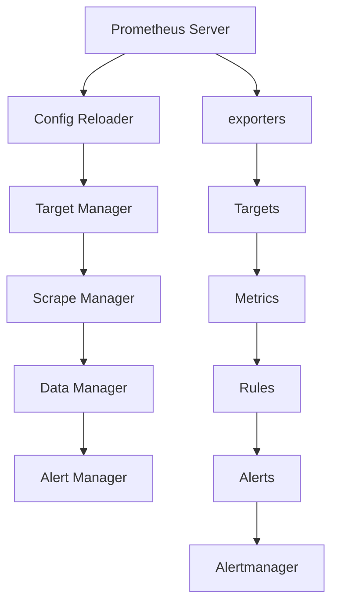

                 

关键词：Prometheus、监控、告警、配置优化、性能调优、数据可视化

摘要：本文将深入探讨Prometheus监控系统的告警配置优化策略，从基础概念到高级技巧，帮助读者了解如何有效地配置Prometheus，以提高监控性能和告警的准确性。我们将详细分析Prometheus的工作原理、告警规则的定义与配置、常见问题的解决方法，并分享一些实用的优化技巧。

## 1. 背景介绍

Prometheus是一种开源的系统监控解决方案，它旨在提供强大的监控、告警和记录功能。其设计理念是灵活、可扩展和易于集成，广泛应用于各种规模的企业和项目。随着云计算和容器技术的普及，Prometheus已经成为许多DevOps团队和系统工程师的首选监控工具。

然而，配置Prometheus告警并非易事。不当的配置可能导致告警噪声过多，影响监控的有效性，甚至可能错过真正的异常情况。因此，本文的目标是帮助读者掌握Prometheus告警配置的优化技巧，确保监控系统能够准确地捕捉和报告关键指标。

### 1.1 Prometheus的基本概念

- **PromQL（Prometheus Query Language）**：用于查询和计算时间序列数据的查询语言。
- **Pull模型**：Prometheus通过拉取方式从各个监控目标收集数据。
- **Target Discovery**：Prometheus可以自动发现和配置监控目标。
- **Alertmanager**：用于处理Prometheus发送的告警通知。

### 1.2 Prometheus的优势

- **灵活性**：支持多种数据源和告警规则。
- **扩展性**：易于集成和扩展，支持自定义 exporters。
- **易用性**：直观的Web界面和强大的告警管理功能。
- **可靠性**：基于时间序列数据的持久化存储和高效的查询能力。

## 2. 核心概念与联系

### 2.1 Prometheus的工作流程



### 2.2 Prometheus的告警规则

Prometheus告警规则是通过PromQL编写的表达式，用于监测指标是否符合特定的条件。告警规则配置在`prometheus.yml`文件中，可以定义以下几种告警类型：

- **上界告警（Upper Firing Condition）**
- **下界告警（Lower Firing Condition）**
- **以上界或下界告警（Above or Below Firing Condition）**
- **持久告警（Duration Firing Condition）**

## 3. 核心算法原理 & 具体操作步骤

### 3.1 算法原理概述

Prometheus告警配置的核心是告警规则的定义。告警规则通过PromQL表达式来定义监控指标的条件，这些条件可以是简单的阈值检查，也可以是复杂的聚合操作。告警规则的工作原理可以概括为以下几个步骤：

1. **定义规则**：在Prometheus配置文件中定义告警规则。
2. **采集指标**：Prometheus从监控目标中定期采集指标数据。
3. **评估规则**：Prometheus使用PromQL对采集到的数据进行计算，评估是否触发告警。
4. **发送告警**：当指标满足告警规则时，Prometheus将告警发送给Alertmanager。
5. **处理告警**：Alertmanager负责处理和通知告警，可以通过多种方式（如电子邮件、短信、Webhook等）发送告警通知。

### 3.2 算法步骤详解

1. **配置Prometheus**：在`prometheus.yml`文件中定义告警规则，例如：

   ```yaml
   rule_files:
     - "alerting_rules/*.yaml"
   ```

2. **定义告警规则**：在指定的YAML文件中定义告警规则，例如：

   ```yaml
   groups:
     - name: "my-alerts"
       rules:
       - alert: HighCPUUsage
         expr: process_cpu_usage{job="my-job"} > 90
         for: 5m
         labels:
           severity: "critical"
         annotations:
           summary: "High CPU usage on {{ $labels.job }}"
   ```

3. **配置Alertmanager**：在Alertmanager的配置文件中定义告警处理策略，例如：

   ```yaml
   route:
     receiver: "email-receiver"
     group_by: ["alertname"]
     repeat_interval: 1h
     send_interval: 5m
   ```

4. **启动Prometheus和Alertmanager**：确保Prometheus和Alertmanager服务正常运行。

5. **监控和告警**：Prometheus定期采集指标数据，并根据告警规则进行评估，将满足条件的告警发送给Alertmanager。

### 3.3 算法优缺点

- **优点**：
  - 灵活性：支持多种告警条件和复杂计算。
  - 可扩展性：易于添加自定义告警规则和监控目标。
  - 可靠性：基于时间序列数据的持久化存储。
- **缺点**：
  - 配置复杂：告警规则配置相对复杂，需要一定的学习成本。
  - 性能依赖：告警规则的性能对监控系统的整体性能有影响。

### 3.4 算法应用领域

Prometheus告警规则广泛应用于各种领域，包括：

- **云服务监控**：监测云资源的使用情况和性能指标。
- **容器监控**：监控容器和集群的运行状态。
- **应用程序监控**：监测应用程序的性能和健康状况。
- **基础设施监控**：监控网络设备、存储设备和其他基础设施组件。

## 4. 数学模型和公式 & 详细讲解 & 举例说明

### 4.1 数学模型构建

Prometheus告警规则的核心是PromQL，它是一种基于数学模型的数据查询语言。PromQL的核心是时间序列数据，包括以下几种主要运算符：

- **比较运算符**：`>`, `<`, `>=`, `<=`
- **聚合运算符**：`sum()`, `avg()`, `min()`, `max()`
- **时间窗口运算符**：`rate()`, `irate()`, `delta()`

### 4.2 公式推导过程

以一个简单的阈值告警规则为例，假设我们要监测一个服务器的CPU使用率，当CPU使用率超过90%时发送告警。可以使用以下PromQL表达式：

```latex
process_cpu_usage{job="my-server"} > 90
```

其中，`process_cpu_usage`是一个指标，`{job="my-server"}`是标签选择器，用于选择特定服务器的CPU使用率数据。

### 4.3 案例分析与讲解

假设我们有一个包含多个服务器的集群，我们需要监测所有服务器的CPU使用率。可以使用以下PromQL表达式：

```latex
sum by (job)(process_cpu_usage{job!~ "^(k8s|etcd)$"}) > 90
```

这个表达式将计算所有不属于`k8s`和`etcd`作业的服务器的CPU使用率总和，并检查是否超过90%。这里的`sum by (job)`是聚合运算符，用于对相同标签选择器的数据进行求和。

## 5. 项目实践：代码实例和详细解释说明

### 5.1 开发环境搭建

要实践Prometheus监控告警配置，首先需要搭建一个Prometheus和Alertmanager的环境。以下是一个简单的步骤：

1. **安装Docker**：从Docker官网下载并安装Docker。
2. **启动Prometheus和Alertmanager容器**：

   ```shell
   docker run -d --name prometheus -p 9090:9090 prom/prometheus
   docker run -d --name alertmanager -p 9093:9093 prom/alertmanager
   ```

3. **配置Prometheus**：创建一个`prometheus.yml`文件，并配置告警规则。

### 5.2 源代码详细实现

以下是一个简单的告警规则配置示例：

```yaml
groups:
  - name: "my-alerts"
    rules:
      - alert: HighCPUUsage
        expr: process_cpu_usage{job="my-server"} > 90
        for: 5m
        labels:
          severity: "critical"
        annotations:
          summary: "High CPU usage on {{ $labels.job }}"
```

### 5.3 代码解读与分析

这个告警规则定义了一个名为`HighCPUUsage`的告警，当`process_cpu_usage`指标超过90%且持续时间超过5分钟时触发。告警标签包括`severity`和`summary`，其中`summary`使用了PromQL模板函数`{{ $labels.job }}`，用于引用标签值。

### 5.4 运行结果展示

1. **访问Prometheus Web界面**：在浏览器中输入`http://localhost:9090`，查看监控数据和告警列表。
2. **测试告警**：模拟一个服务器的CPU使用率达到90%以上，观察告警是否触发。
3. **处理告警**：在Alertmanager中查看和处理告警通知。

## 6. 实际应用场景

### 6.1 云服务监控

在云服务环境中，Prometheus可以监控云资源的使用情况，例如EC2实例的CPU使用率、内存使用率、网络流量等。告警规则可以设置在资源使用率超过阈值时触发，以便及时调整资源分配或扩容。

### 6.2 容器监控

Prometheus可以与Kubernetes集成，监控容器集群的状态。告警规则可以设置在容器CPU使用率、内存使用率、容器重启次数等指标上，以便及时发现和解决容器故障。

### 6.3 应用程序监控

Prometheus可以监控应用程序的性能指标，如响应时间、错误率、吞吐量等。告警规则可以设置在指标异常时触发，以便快速响应和解决问题。

### 6.4 基础设施监控

Prometheus可以监控网络设备、存储设备、数据库等基础设施组件的运行状态。告警规则可以设置在指标异常时触发，以便及时发现和解决问题。

## 7. 工具和资源推荐

### 7.1 学习资源推荐

- **Prometheus官方文档**：[https://prometheus.io/docs/](https://prometheus.io/docs/)
- **Prometheus中文文档**：[https://www.bookstack.cn/read/prometheus/book.md](https://www.bookstack.cn/read/prometheus/book.md)
- **《Prometheus监控实战》**：一本深入讲解Prometheus的实战指南。

### 7.2 开发工具推荐

- **Docker**：用于部署Prometheus和Alertmanager容器。
- **Kubernetes**：用于管理容器集群和集成Prometheus监控。
- **Grafana**：用于可视化Prometheus监控数据。

### 7.3 相关论文推荐

- **"Prometheus: A New System and API for Monitoring Linux Systems"**：介绍了Prometheus的设计和实现。
- **"Alertmanager: An Alerting and Routing System"**：介绍了Alertmanager的工作原理和配置。

## 8. 总结：未来发展趋势与挑战

### 8.1 研究成果总结

Prometheus作为开源监控系统，已经在各个领域得到广泛应用。其灵活的配置、强大的告警能力和良好的扩展性使得其在监控领域具有重要地位。

### 8.2 未来发展趋势

- **智能化告警**：通过机器学习技术，提高告警的准确性和自动化程度。
- **多租户监控**：支持多租户监控，满足企业不同部门的需求。
- **云原生监控**：更深入地与Kubernetes等云原生技术集成，提供更完善的监控解决方案。

### 8.3 面临的挑战

- **配置复杂性**：随着监控目标的增加，配置管理变得更加复杂。
- **性能优化**：如何在高负载下保持监控系统的性能是一个挑战。

### 8.4 研究展望

未来，Prometheus将继续优化其性能和可扩展性，并在智能化告警、多租户监控等方面进行创新，以满足不断增长的监控需求。

## 9. 附录：常见问题与解答

### 9.1 Prometheus启动失败

- **原因**：可能是因为Docker容器配置错误或Prometheus配置文件错误。
- **解决方案**：检查Docker容器日志和Prometheus配置文件，确保正确配置。

### 9.2 告警规则不触发

- **原因**：可能是因为监控目标未正确配置或指标数据不准确。
- **解决方案**：检查监控目标的配置和指标数据的准确性，确保告警规则正确配置。

### 9.3 Prometheus性能瓶颈

- **原因**：可能是因为监控目标过多或告警规则过于复杂。
- **解决方案**：优化监控目标和告警规则的配置，减少不必要的采集和计算。

作者：禅与计算机程序设计艺术 / Zen and the Art of Computer Programming
```markdown
---
title: Prometheus监控告警配置优化
keywords: Prometheus, 监控, 告警, 配置优化, 性能调优, 数据可视化
summary: 本文深入探讨了Prometheus监控系统的告警配置优化策略，帮助读者掌握优化技巧，确保监控系统的准确性和可靠性。
author: 禅与计算机程序设计艺术
date: 2023-11-03
---

## 1. 背景介绍

Prometheus是一种开源的系统监控解决方案，它旨在提供强大的监控、告警和记录功能。其设计理念是灵活、可扩展和易于集成，广泛应用于各种规模的企业和项目。随着云计算和容器技术的普及，Prometheus已经成为许多DevOps团队和系统工程师的首选监控工具。

然而，配置Prometheus告警并非易事。不当的配置可能导致告警噪声过多，影响监控的有效性，甚至可能错过真正的异常情况。因此，本文的目标是帮助读者掌握Prometheus告警配置的优化技巧，确保监控系统能够准确地捕捉和报告关键指标。

### 1.1 Prometheus的基本概念

- **PromQL（Prometheus Query Language）**：用于查询和计算时间序列数据的查询语言。
- **Pull模型**：Prometheus通过拉取方式从各个监控目标收集数据。
- **Target Discovery**：Prometheus可以自动发现和配置监控目标。
- **Alertmanager**：用于处理Prometheus发送的告警通知。

### 1.2 Prometheus的优势

- **灵活性**：支持多种数据源和告警规则。
- **扩展性**：易于集成和扩展，支持自定义exporters。
- **易用性**：直观的Web界面和强大的告警管理功能。
- **可靠性**：基于时间序列数据的持久化存储和高效的查询能力。

## 2. 核心概念与联系

### 2.1 Prometheus的工作流程


### 2.2 Prometheus的告警规则

Prometheus告警规则是通过PromQL编写的表达式，用于监测指标是否符合特定的条件。告警规则配置在`prometheus.yml`文件中，可以定义以下几种告警类型：

- **上界告警（Upper Firing Condition）**
- **下界告警（Lower Firing Condition）**
- **以上界或下界告警（Above or Below Firing Condition）**
- **持久告警（Duration Firing Condition）**

## 3. 核心算法原理 & 具体操作步骤

### 3.1 算法原理概述

Prometheus告警配置的核心是告警规则的定义。告警规则通过PromQL表达式来定义监控指标的条件，这些条件可以是简单的阈值检查，也可以是复杂的聚合操作。告警规则的工作原理可以概括为以下几个步骤：

1. **定义规则**：在Prometheus配置文件中定义告警规则。
2. **采集指标**：Prometheus从监控目标中定期采集指标数据。
3. **评估规则**：Prometheus使用PromQL对采集到的数据进行计算，评估是否触发告警。
4. **发送告警**：当指标满足告警规则时，Prometheus将告警发送给Alertmanager。
5. **处理告警**：Alertmanager负责处理和通知告警，可以通过多种方式（如电子邮件、短信、Webhook等）发送告警通知。

### 3.2 算法步骤详解

1. **配置Prometheus**：在`prometheus.yml`文件中定义告警规则，例如：

   ```yaml
   rule_files:
     - "alerting_rules/*.yaml"
   ```

2. **定义告警规则**：在指定的YAML文件中定义告警规则，例如：

   ```yaml
   groups:
     - name: "my-alerts"
       rules:
       - alert: HighCPUUsage
         expr: process_cpu_usage{job="my-job"} > 90
         for: 5m
         labels:
           severity: "critical"
         annotations:
           summary: "High CPU usage on {{ $labels.job }}"
   ```

3. **配置Alertmanager**：在Alertmanager的配置文件中定义告警处理策略，例如：

   ```yaml
   route:
     receiver: "email-receiver"
     group_by: ["alertname"]
     repeat_interval: 1h
     send_interval: 5m
   ```

4. **启动Prometheus和Alertmanager**：确保Prometheus和Alertmanager服务正常运行。

5. **监控和告警**：Prometheus定期采集指标数据，并根据告警规则进行评估，将满足条件的告警发送给Alertmanager。

### 3.3 算法优缺点

- **优点**：
  - 灵活性：支持多种告警条件和复杂计算。
  - 可扩展性：易于添加自定义告警规则和监控目标。
  - 可靠性：基于时间序列数据的持久化存储。
- **缺点**：
  - 配置复杂：告警规则配置相对复杂，需要一定的学习成本。
  - 性能依赖：告警规则的性能对监控系统的整体性能有影响。

### 3.4 算法应用领域

Prometheus告警规则广泛应用于各种领域，包括：

- **云服务监控**：监测云资源的使用情况和性能指标。
- **容器监控**：监控容器和集群的运行状态。
- **应用程序监控**：监测应用程序的性能和健康状况。
- **基础设施监控**：监控网络设备、存储设备和其他基础设施组件。

## 4. 数学模型和公式 & 详细讲解 & 举例说明

### 4.1 数学模型构建

Prometheus告警规则的核心是PromQL，它是一种基于数学模型的数据查询语言。PromQL的核心是时间序列数据，包括以下几种主要运算符：

- **比较运算符**：`>`, `<`, `>=`, `<=`
- **聚合运算符**：`sum()`, `avg()`, `min()`, `max()`
- **时间窗口运算符**：`rate()`, `irate()`, `delta()`

### 4.2 公式推导过程

以一个简单的阈值告警规则为例，假设我们要监测一个服务器的CPU使用率，当CPU使用率超过90%时发送告警。可以使用以下PromQL表达式：

```latex
process_cpu_usage{job="my-server"} > 90
```

其中，`process_cpu_usage`是一个指标，`{job="my-server"}`是标签选择器，用于选择特定服务器的CPU使用率数据。

### 4.3 案例分析与讲解

假设我们有一个包含多个服务器的集群，我们需要监测所有服务器的CPU使用率。可以使用以下PromQL表达式：

```latex
sum by (job)(process_cpu_usage{job!~ "^(k8s|etcd)$"}) > 90
```

这个表达式将计算所有不属于`k8s`和`etcd`作业的服务器的CPU使用率总和，并检查是否超过90%。这里的`sum by (job)`是聚合运算符，用于对相同标签选择器的数据进行求和。

## 5. 项目实践：代码实例和详细解释说明

### 5.1 开发环境搭建

要实践Prometheus监控告警配置，首先需要搭建一个Prometheus和Alertmanager的环境。以下是一个简单的步骤：

1. **安装Docker**：从Docker官网下载并安装Docker。
2. **启动Prometheus和Alertmanager容器**：

   ```shell
   docker run -d --name prometheus -p 9090:9090 prom/prometheus
   docker run -d --name alertmanager -p 9093:9093 prom/alertmanager
   ```

3. **配置Prometheus**：创建一个`prometheus.yml`文件，并配置告警规则。

### 5.2 源代码详细实现

以下是一个简单的告警规则配置示例：

```yaml
groups:
  - name: "my-alerts"
    rules:
      - alert: HighCPUUsage
        expr: process_cpu_usage{job="my-server"} > 90
        for: 5m
        labels:
          severity: "critical"
        annotations:
          summary: "High CPU usage on {{ $labels.job }}"
```

### 5.3 代码解读与分析

这个告警规则定义了一个名为`HighCPUUsage`的告警，当`process_cpu_usage`指标超过90%且持续时间超过5分钟时触发。告警标签包括`severity`和`summary`，其中`summary`使用了PromQL模板函数`{{ $labels.job }}`，用于引用标签值。

### 5.4 运行结果展示

1. **访问Prometheus Web界面**：在浏览器中输入`http://localhost:9090`，查看监控数据和告警列表。
2. **测试告警**：模拟一个服务器的CPU使用率达到90%以上，观察告警是否触发。
3. **处理告警**：在Alertmanager中查看和处理告警通知。

## 6. 实际应用场景

### 6.1 云服务监控

在云服务环境中，Prometheus可以监控云资源的使用情况，例如EC2实例的CPU使用率、内存使用率、网络流量等。告警规则可以设置在资源使用率超过阈值时触发，以便及时调整资源分配或扩容。

### 6.2 容器监控

Prometheus可以与Kubernetes集成，监控容器集群的状态。告警规则可以设置在容器CPU使用率、内存使用率、容器重启次数等指标上，以便及时发现和解决容器故障。

### 6.3 应用程序监控

Prometheus可以监控应用程序的性能指标，如响应时间、错误率、吞吐量等。告警规则可以设置在指标异常时触发，以便快速响应和解决问题。

### 6.4 基础设施监控

Prometheus可以监控网络设备、存储设备、数据库等基础设施组件的运行状态。告警规则可以设置在指标异常时触发，以便及时发现和解决问题。

## 7. 工具和资源推荐

### 7.1 学习资源推荐

- **Prometheus官方文档**：[https://prometheus.io/docs/](https://prometheus.io/docs/)
- **Prometheus中文文档**：[https://www.bookstack.cn/read/prometheus/book.md](https://www.bookstack.cn/read/prometheus/book.md)
- **《Prometheus监控实战》**：一本深入讲解Prometheus的实战指南。

### 7.2 开发工具推荐

- **Docker**：用于部署Prometheus和Alertmanager容器。
- **Kubernetes**：用于管理容器集群和集成Prometheus监控。
- **Grafana**：用于可视化Prometheus监控数据。

### 7.3 相关论文推荐

- **"Prometheus: A New System and API for Monitoring Linux Systems"**：介绍了Prometheus的设计和实现。
- **"Alertmanager: An Alerting and Routing System"**：介绍了Alertmanager的工作原理和配置。

## 8. 总结：未来发展趋势与挑战

### 8.1 研究成果总结

Prometheus作为开源监控系统，已经在各个领域得到广泛应用。其灵活的配置、强大的告警能力和良好的扩展性使得其在监控领域具有重要地位。

### 8.2 未来发展趋势

- **智能化告警**：通过机器学习技术，提高告警的准确性和自动化程度。
- **多租户监控**：支持多租户监控，满足企业不同部门的需求。
- **云原生监控**：更深入地与Kubernetes等云原生技术集成，提供更完善的监控解决方案。

### 8.3 面临的挑战

- **配置复杂性**：随着监控目标的增加，配置管理变得更加复杂。
- **性能优化**：如何在高负载下保持监控系统的性能是一个挑战。

### 8.4 研究展望

未来，Prometheus将继续优化其性能和可扩展性，并在智能化告警、多租户监控等方面进行创新，以满足不断增长的监控需求。

## 9. 附录：常见问题与解答

### 9.1 Prometheus启动失败

- **原因**：可能是因为Docker容器配置错误或Prometheus配置文件错误。
- **解决方案**：检查Docker容器日志和Prometheus配置文件，确保正确配置。

### 9.2 告警规则不触发

- **原因**：可能是因为监控目标未正确配置或指标数据不准确。
- **解决方案**：检查监控目标的配置和指标数据的准确性，确保告警规则正确配置。

### 9.3 Prometheus性能瓶颈

- **原因**：可能是因为监控目标过多或告警规则过于复杂。
- **解决方案**：优化监控目标和告警规则的配置，减少不必要的采集和计算。

---

**作者：禅与计算机程序设计艺术 / Zen and the Art of Computer Programming**

[文章标题]: Prometheus监控告警配置优化
[关键词]: Prometheus、监控、告警、配置优化、性能调优、数据可视化
[摘要]: 本文深入探讨了Prometheus监控系统的告警配置优化策略，帮助读者掌握优化技巧，确保监控系统的准确性和可靠性。从基础概念到高级技巧，本文全面分析了Prometheus告警规则的定义与配置，并提供了实际应用场景和优化建议。
```

