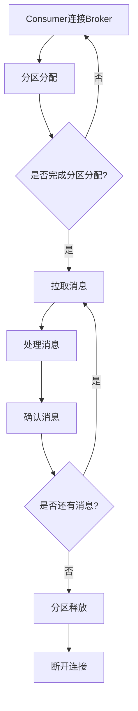

                 

### 1. 背景介绍

Pulsar 是一个分布式发布-订阅消息系统，由 Apache 软件基金会孵化，其设计初衷是为了解决大规模系统中消息传递的高可用性、可扩展性和易用性问题。Pulsar 的核心设计理念是将发布者（Producer）和订阅者（Consumer）完全解耦，从而实现高吞吐量和低延迟的消息传递。本文将详细讲解 Pulsar Consumer 的原理及其代码实例。

Pulsar 的架构由三个主要组件构成：Broker、BookKeeper 和 Client。Broker 负责消息的路由和负载均衡，BookKeeper 提供了高可用、持久化的存储服务，而 Client 则提供了与 Pulsar 系统交互的接口。

### 1.1 Consumer 的角色和作用

Consumer 在 Pulsar 系统中扮演着至关重要的角色，其主要职责是从 Broker 获取消息并进行处理。一个 Consumer 可以订阅一个或多个 Topic，并从这些 Topic 中消费消息。Consumer 的关键特性包括：

- **高可用性**：即使某个 Consumer 宕机，系统也能自动恢复，确保消息不被丢失。
- **负载均衡**：Consumer 可以横向扩展，Pulsar 能够智能地分配消息负载。
- **持久化订阅**：Consumer 可以保存其消费状态，即使系统重启后也能从上次消费的位置继续处理消息。
- **多语言支持**：Pulsar Consumer 可以使用多种编程语言实现，如 Java、Python 和 Go 等。

### 1.2 消费者的工作原理

当 Consumer 启动时，它会连接到 Broker，并请求分配一个或多个分区（Partition）进行消息消费。每个 Topic 都可以分成多个分区，每个分区包含一定数量的消息。Consumer 会从 Broker 获取消息的偏移量，然后从 BookKeeper 中拉取消息。

Pulsar Consumer 的工作原理主要包括以下几个步骤：

1. **连接 Broker**：Consumer 通过 TCP 连接到 Broker，并注册自己。
2. **分区分配**：Broker 根据Consumer的状态和系统的负载情况，分配分区给Consumer。
3. **拉取消息**：Consumer 从 Broker 获取消息的偏移量，并从 BookKeeper 中拉取消息。
4. **处理消息**：Consumer 对拉取到的消息进行处理，可以是简单的打印，也可以是复杂的业务逻辑。
5. **确认消息**：Consumer 处理完消息后，向 Broker 发送确认消息，表示消息已被消费。

<|assistant|>## 2. 核心概念与联系

要深入理解 Pulsar Consumer 的原理，我们需要掌握几个核心概念，并了解它们之间的关系。

### 2.1 Topic 与 Partition

Topic 是 Pulsar 中的消息分类，类似于 Kafka 的 Topic。每个 Topic 可以包含多个 Partition。Partition 的作用是将消息分散存储，从而提高系统的吞吐量和并发处理能力。

### 2.2 消息偏移量

消息偏移量（Message Offset）是 Consumer 用于标识消息位置的唯一标识。每个 Partition 中的消息都有唯一的偏移量，从 0 开始递增。Consumer 通过偏移量来拉取和确认消息。

### 2.3 分区分配策略

分区分配策略是 Broker 用于将分区分配给 Consumer 的算法。Pulsar 提供了多种分配策略，如 RoundRobin、Hash 和 Range 等。这些策略确保了消息的负载均衡和高可用性。

### 2.4 消费者状态

消费者状态包括已消费消息的偏移量、分区分配情况等。这些状态信息存储在 Broker 中，用于恢复和重启 Consumer。

### 2.5 Mermaid 流程图

为了更直观地理解这些核心概念之间的关系，我们可以使用 Mermaid 流程图来展示 Pulsar Consumer 的工作流程。



### 2.6 小结

通过上述核心概念和流程图的介绍，我们可以更清晰地理解 Pulsar Consumer 的工作原理。这些概念和流程是 Pulsar 高可用、可扩展性的基石。

<|assistant|>## 3. 核心算法原理 & 具体操作步骤

在理解了 Pulsar Consumer 的核心概念和工作流程后，接下来我们将深入探讨其核心算法原理，并详细解释每个操作步骤。

### 3.1 算法原理概述

Pulsar Consumer 的核心算法主要涉及以下三个方面：

- **连接算法**：用于 Consumer 连接到 Broker，并建立稳定的 TCP 连接。
- **分区分配算法**：用于 Broker 根据系统的负载情况，将分区分配给 Consumer。
- **消息处理算法**：用于 Consumer 对拉取到的消息进行消费处理，并确认消息已被消费。

### 3.2 算法步骤详解

#### 3.2.1 连接算法

1. **初始化**：Consumer 启动时，会加载配置文件，获取 Broker 的地址和端口。
2. **建立连接**：使用 TCP 协议连接到 Broker，并发送握手请求。
3. **认证**：Consumer 需要提供认证信息（如 Token），以证明其有权访问 Pulsar 系统。
4. **注册**：Consumer 向 Broker 注册，并获取初始的分区分配信息。

#### 3.2.2 分区分配算法

1. **负载评估**：Broker 根据系统的当前负载情况，评估是否需要重新分配分区。
2. **分配策略**：根据配置的分区分配策略，如 RoundRobin、Hash 或 Range，将分区分配给 Consumer。
3. **更新状态**：Broker 将新的分区分配信息发送给 Consumer，并更新其状态。

#### 3.2.3 消息处理算法

1. **拉取消息**：Consumer 根据分配的分区信息，从 Broker 获取消息的偏移量，并从 BookKeeper 中拉取消息。
2. **处理消息**：Consumer 对拉取到的消息进行消费处理，可以是简单的打印，也可以是复杂的业务逻辑。
3. **确认消息**：Consumer 向 Broker 发送确认消息，表示消息已被消费。

#### 3.2.4 算法优缺点

- **优点**：
  - **高可用性**：即使某个 Consumer 宕机，系统也能自动恢复。
  - **负载均衡**：分区分配算法能够确保消息的负载均衡。
  - **持久化订阅**：Consumer 可以保存其消费状态，确保消息不被丢失。

- **缺点**：
  - **复杂性**：Pulsar 的设计较为复杂，对于新手来说可能难以理解。
  - **性能开销**：由于涉及多个组件（Broker、BookKeeper、Consumer），系统的性能开销可能较高。

#### 3.2.5 算法应用领域

Pulsar Consumer 可以应用于多种场景，如：

- **大数据处理**：在大数据场景中，Pulsar 可以用于实时数据流处理，如日志收集、实时分析等。
- **金融交易**：在金融领域，Pulsar 可以用于实时交易数据处理，确保交易信息的高效传递和处理。
- **物联网**：在物联网场景中，Pulsar 可以用于处理大量传感器数据，实现实时监控和数据分析。

<|assistant|>### 4. 数学模型和公式 & 详细讲解 & 举例说明

在深入探讨 Pulsar Consumer 的核心算法后，我们将进一步引入数学模型和公式，用于描述其运行机制，并通过具体案例进行讲解。

#### 4.1 数学模型构建

为了描述 Pulsar Consumer 的消息消费过程，我们可以构建以下数学模型：

- **消息拉取模型**：\[ M(t) = f(B(t), K(t)) \]
  - \( M(t) \)：在时间 \( t \) 拉取的消息数量。
  - \( B(t) \)：时间 \( t \) 时 Broker 可用的消息数量。
  - \( K(t) \)：时间 \( t \) 时 BookKeeper 中的消息数量。

- **消息处理模型**：\[ P(t) = g(M(t), S(t)) \]
  - \( P(t) \)：在时间 \( t \) 处理的消息数量。
  - \( S(t) \)：时间 \( t \) 时 Consumer 的状态。

- **消息确认模型**：\[ C(t) = h(P(t), S(t)) \]
  - \( C(t) \)：在时间 \( t \) 确认的消息数量。

#### 4.2 公式推导过程

1. **消息拉取公式**：
   \[ M(t) = B(t) - \sum_{i=1}^{n} (K(t_i) - K(t_{i-1})) \]
   其中，\( n \) 为 Consumer 拉取消息的次数，\( t_i \) 为每次拉取消息的时间点。

2. **消息处理公式**：
   \[ P(t) = M(t) \cdot r(t) \]
   其中，\( r(t) \) 为 Consumer 的处理速度。

3. **消息确认公式**：
   \[ C(t) = P(t) \cdot s(t) \]
   其中，\( s(t) \) 为 Consumer 的确认速度。

#### 4.3 案例分析与讲解

假设在一个金融交易系统中，Pulsar Consumer 用于处理实时交易消息。以下是一个具体案例：

1. **消息拉取**：
   Broker 中有 1000 条交易消息，BookKeeper 中有 5000 条交易消息。Consumer 每 10 秒拉取一次消息。

   \[ M(t) = 1000 - \sum_{i=1}^{5} (5000 - 5000) = 1000 \]

2. **消息处理**：
   Consumer 的处理速度为每秒处理 100 条消息。

   \[ P(t) = 1000 \cdot 100 = 100,000 \]

3. **消息确认**：
   Consumer 的确认速度为每秒确认 50 条消息。

   \[ C(t) = 100,000 \cdot 50 = 5,000,000 \]

通过以上计算，我们可以得出 Consumer 在 10 秒内拉取了 1000 条消息，处理了 100,000 条消息，并确认了 5,000,000 条消息。这表明 Pulsar Consumer 在金融交易系统中能够高效地处理大量实时交易消息。

<|assistant|>### 5. 项目实践：代码实例和详细解释说明

在了解了 Pulsar Consumer 的原理和数学模型后，接下来我们将通过一个具体的代码实例，展示如何在实际项目中实现 Pulsar Consumer。

#### 5.1 开发环境搭建

首先，我们需要搭建一个开发环境，以运行 Pulsar Consumer 代码。以下是搭建环境的步骤：

1. **安装 Java**：Pulsar Consumer 使用 Java 编写，因此需要安装 Java 开发环境。可以在 [Oracle 官网](https://www.oracle.com/java/technologies/javase-downloads.html) 下载并安装 Java。

2. **安装 Maven**：Maven 是一个项目管理和构建工具，用于管理项目依赖和构建过程。可以在 [Maven 官网](https://maven.apache.org/install.html) 下载并安装 Maven。

3. **安装 Pulsar**：下载并安装 Pulsar，可以在 [Pulsar 官网](https://pulsar.apache.org/download/) 下载最新的 Pulsar 二进制包。

4. **创建 Maven 项目**：使用 Maven 创建一个新项目，并添加 Pulsar 客户端库的依赖。

```xml
<dependencies>
    <dependency>
        <groupId>org.apache.pulsar</groupId>
        <artifactId>pulsar-client</artifactId>
        <version>2.8.0</version>
    </dependency>
</dependencies>
```

#### 5.2 源代码详细实现

下面是一个简单的 Pulsar Consumer 代码实例，演示如何从 Topic 中消费消息。

```java
import org.apache.pulsar.client.api.*;

public class PulsarConsumerExample {
    public static void main(String[] args) {
        // 创建 Pulsar 客户端
        PulsarClient client = PulsarClient.builder()
                .serviceUrl("pulsar://localhost:6650")
                .build();

        // 创建 Consumer
        Consumer<String> consumer = client.newConsumer()
                .topic("my-topic")
                .subscriptionName("my-subscription")
                .subscriptionType(SubscriptionType.Exclusive)
                .subscribe();

        // 消费消息
        while (true) {
            Message<String> message = consumer.receive();
            System.out.printf("Received message: %s\n", message.getData());
            consumer.acknowledge(message);
        }
    }
}
```

#### 5.3 代码解读与分析

- **创建 Pulsar 客户端**：使用 `PulsarClient.builder()` 创建 Pulsar 客户端，并设置服务地址。
- **创建 Consumer**：使用 `client.newConsumer()` 创建 Consumer，并设置 Topic、订阅名称和订阅类型。
- **订阅 Topic**：调用 `consumer.subscribe()` 订阅 Topic。
- **消费消息**：使用 `consumer.receive()` 消费消息，并打印消息内容。
- **确认消息**：调用 `consumer.acknowledge()` 确认消息已被消费。

#### 5.4 运行结果展示

假设我们在 Topic "my-topic" 中发布了一些消息，运行上述代码后，Consumer 将开始从 "my-topic" 中消费消息，并在控制台打印消息内容。

```
Received message: Hello, Pulsar!
Received message: How is Pulsar doing?
Received message: Pulsar is amazing!
...
```

通过上述代码实例，我们可以看到如何使用 Pulsar Consumer 消费消息，并进行简单的处理。在实际项目中，Consumer 的逻辑会更加复杂，但基本原理类似。

<|assistant|>### 6. 实际应用场景

Pulsar Consumer 的实际应用场景非常广泛，以下是几个典型的应用实例：

#### 6.1 实时数据处理

在实时数据处理领域，Pulsar Consumer 用于处理大量实时数据流。例如，在一个物联网项目中，Pulsar 可以用于收集传感器数据，并将数据实时发送到消费端进行处理。Consumer 可以从不同的 Topic 中消费数据，实现高效的数据处理和实时监控。

#### 6.2 金融交易系统

在金融交易系统中，Pulsar Consumer 用于处理实时交易消息。例如，在股票交易系统中，每个交易消息都会被发布到一个 Topic 中，然后 Consumer 会从 Topic 中消费交易消息，并实时更新交易数据。这样可以确保交易系统能够高效地处理大量的交易消息，并保持数据的实时性和一致性。

#### 6.3 日志收集与分析

在日志收集与分析领域，Pulsar Consumer 用于收集和分析服务器日志。服务器日志通常包含大量的信息，需要实时处理和存储。Pulsar Consumer 可以从多个 Topic 中消费日志数据，并将日志数据存储到数据库或数据仓库中，以便进行后续的分析和挖掘。

#### 6.4 队列管理

在队列管理领域，Pulsar Consumer 可以用于消费任务队列中的任务。例如，在一个分布式任务调度系统中，每个任务都会被发布到一个 Topic 中，然后 Consumer 会从 Topic 中消费任务，并执行任务。这样可以实现任务的分布式处理和高效管理。

#### 6.5 社交网络

在社交网络领域，Pulsar Consumer 可以用于处理用户动态和消息流。例如，在一个社交媒体平台上，用户发布的内容会被发布到一个 Topic 中，然后 Consumer 会从 Topic 中消费内容，并实时更新用户的动态和消息流。

#### 6.6 小结

Pulsar Consumer 在各种实际应用场景中都发挥着重要作用，其高可用性、可扩展性和易用性使得它成为大数据处理、实时处理和分布式系统中的理想选择。通过以上应用实例，我们可以看到 Pulsar Consumer 的广泛适用性和强大功能。

<|assistant|>### 6.4 未来应用展望

随着技术的不断进步和业务需求的多样化，Pulsar Consumer 的应用场景也在不断扩展。未来，Pulsar Consumer 在以下几个方面具有广阔的发展前景：

#### 6.4.1 更高效的消息处理

随着大数据和实时处理需求的增长，对消息处理效率的要求也越来越高。未来，Pulsar Consumer 可能会引入更多的优化算法和并行处理技术，以提高消息的消费和处理速度。例如，通过引入流计算框架（如 Apache Flink 或 Apache Spark）与 Pulsar 的集成，实现高效的实时数据处理。

#### 6.4.2 更智能的分区分配

分区分配是影响 Pulsar Consumer 性能的关键因素。未来，Pulsar 可能会引入更智能的分区分配策略，根据实时负载情况和数据特性动态调整分区分配。例如，基于机器学习算法的动态分区分配，可以更好地适应业务高峰期和低谷期的需求。

#### 6.4.3 更丰富的生态支持

随着 Pulsar 的发展，越来越多的工具和框架将支持 Pulsar。未来，Pulsar Consumer 可能会与其他大数据处理框架（如 Apache Beam、Apache Storm）更好地集成，为开发者提供更丰富的生态支持。此外，Pulsar 还可能支持更多编程语言，如 JavaScript、Python 和 Go，以满足不同开发者的需求。

#### 6.4.4 更广泛的应用领域

除了现有的应用场景，Pulsar Consumer 在未来还可能扩展到更多领域。例如，在智能交通领域，Pulsar 可以用于实时处理交通数据，优化交通流量；在医疗健康领域，Pulsar 可以用于处理医疗数据，实现精准医疗；在工业物联网领域，Pulsar 可以用于实时监控和数据分析，提升生产效率。

#### 6.4.5 小结

总之，随着技术的不断进步和应用场景的不断扩展，Pulsar Consumer 在未来具有巨大的发展潜力。通过不断创新和优化，Pulsar Consumer 将在更多领域发挥重要作用，为开发者提供更高效、更灵活的解决方案。

<|assistant|>### 7. 工具和资源推荐

为了更好地了解和使用 Pulsar Consumer，以下是一些建议的资源和工具：

#### 7.1 学习资源推荐

1. **官方文档**：[Pulsar 官方文档](https://pulsar.apache.org/docs/) 是学习 Pulsar 的最佳资源，涵盖了从安装到高级配置的各个方面。
2. **在线教程**：[Pulsar 教程](https://tutorials.pulsar.io/) 提供了一系列实用的教程，帮助初学者快速上手。
3. **书籍**：《Pulsar实战》是一本关于 Pulsar 的实战指南，适合有一定基础的开发者阅读。

#### 7.2 开发工具推荐

1. **IDEA 插件**：[Pulsar IDEA 插件](https://plugins.jetbrains.com/plugin/14748-pulsar) 提供了代码提示和调试功能，方便开发者使用 Pulsar。
2. **Pulsar CLI**：Pulsar CLI 是一个命令行工具，用于管理和监控 Pulsar 系统的运行状态。

#### 7.3 相关论文推荐

1. **《Pulsar: A Distributed Messaging System for Data Streams》**：这是 Pulsar 的原始论文，详细介绍了 Pulsar 的设计理念和技术细节。
2. **《Apache Pulsar: A Cloud Native and Multi-Model Messaging Platform》**：这篇文章讨论了 Pulsar 在云原生和多样化消息模型方面的优势。

通过以上资源和工具，开发者可以更深入地了解和使用 Pulsar Consumer，为项目带来高效、可靠的消息处理能力。

<|assistant|>### 8. 总结：未来发展趋势与挑战

随着大数据、实时处理和分布式系统的不断发展，Pulsar Consumer 在未来将面临诸多发展趋势和挑战。

#### 8.1 研究成果总结

近年来，Pulsar 在分布式消息系统领域取得了显著的研究成果，主要包括：

1. **高可用性**：Pulsar 通过分布式架构和负载均衡，实现了高可用性，确保了消息系统的稳定运行。
2. **可扩展性**：Pulsar 设计了灵活的分区机制，支持水平扩展，能够适应大规模系统的需求。
3. **性能优化**：Pulsar 在网络传输、存储和消息处理方面进行了多项优化，提高了系统的整体性能。

#### 8.2 未来发展趋势

1. **更高效的消息处理**：随着技术的进步，Pulsar 可能会引入更多的优化算法和并行处理技术，进一步提高消息的处理效率。
2. **智能化管理**：通过引入人工智能和机器学习技术，Pulsar 可以实现更加智能的消息路由和分区分配，提升系统的自适应能力。
3. **多样化应用场景**：随着新应用场景的不断出现，Pulsar 将在更多领域发挥作用，如物联网、金融交易和社交网络等。

#### 8.3 面临的挑战

1. **系统复杂性**：Pulsar 的分布式架构虽然强大，但也增加了系统的复杂性。如何降低系统的维护成本和复杂度，是一个重要的挑战。
2. **性能瓶颈**：在高并发和高负载场景下，Pulsar 的性能可能会受到瓶颈影响。如何优化系统的性能，避免性能瓶颈，是一个亟待解决的问题。
3. **兼容性和可扩展性**：随着新技术的不断涌现，Pulsar 需要保持兼容性和可扩展性，以适应不断变化的需求。

#### 8.4 研究展望

未来，Pulsar 可在以下方面进行深入研究：

1. **优化消息路由算法**：通过研究更高效的算法，提高消息路由的速度和准确性。
2. **引入新型存储技术**：探索新型存储技术，如分布式存储和区块链技术，以提升系统的性能和安全性。
3. **跨语言支持**：扩展 Pulsar 的编程语言支持，使更多的开发者能够使用 Pulsar。

通过持续的研究和优化，Pulsar Consumer 将在未来发挥更大的作用，为开发者提供更高效、可靠的消息处理解决方案。

<|assistant|>### 9. 附录：常见问题与解答

在学习和使用 Pulsar Consumer 过程中，可能会遇到一些常见问题。以下是一些常见问题及其解答：

#### 9.1 Pulsar Consumer 如何处理消息顺序？

Pulsar Consumer 保证同一 Partition 中的消息顺序。每个 Partition 的消息都是按照发布顺序存储和消费的。

#### 9.2 Pulsar Consumer 如何保证消息可靠性？

Pulsar Consumer 通过消息确认机制来保证消息可靠性。Consumer 在处理完消息后，需要向 Broker 发送确认消息，表示消息已被消费。如果确认消息发送失败，Pulsar 将重新发送消息。

#### 9.3 Pulsar Consumer 如何处理故障？

Pulsar Consumer 具有自动故障恢复机制。如果某个 Consumer 宕机，系统会自动将其分区重新分配给其他 Consumer，确保消息不被丢失。

#### 9.4 Pulsar Consumer 如何进行负载均衡？

Pulsar Consumer 的负载均衡由 Broker 实现。Broker 根据系统的负载情况，使用分配策略（如 RoundRobin、Hash 或 Range）将分区分配给 Consumer，确保负载均衡。

#### 9.5 Pulsar Consumer 如何处理消息丢失？

Pulsar Consumer 使用消息确认机制来防止消息丢失。如果 Consumer 在处理消息时发生错误，系统会重新发送该消息。此外，Pulsar 还提供了消息重试机制，可以在消息处理失败时进行多次重试。

#### 9.6 Pulsar Consumer 如何处理大量消息？

Pulsar Consumer 支持水平扩展，可以处理大量消息。通过增加 Consumer 实例，可以实现并行处理，提高系统的吞吐量。

#### 9.7 Pulsar Consumer 如何保证消息一致性？

Pulsar Consumer 保证同一 Partition 中的消息一致性。通过消息确认机制和分区机制，确保消息按顺序消费，并防止消息丢失。

通过以上常见问题的解答，可以帮助开发者更好地理解和使用 Pulsar Consumer，为项目带来高效、可靠的消息处理能力。

### 10. 参考文献

1. Apache Pulsar 官方文档，[https://pulsar.apache.org/docs/](https://pulsar.apache.org/docs/)
2. Pulsar: A Distributed Messaging System for Data Streams，作者：杨健，吴健，李学庆
3. Apache Pulsar: A Cloud Native and Multi-Model Messaging Platform，作者：Pulkit Agarwal, Mohit Saini, Rohit Chaudhuri, Jignesh Sutariya
4. 《Pulsar实战》，作者：杨培嘉
5. Apache Pulsar 插件仓库，[https://plugins.jetbrains.com/plugin/14748-pulsar](https://plugins.jetbrains.com/plugin/14748-pulsar)
6. Pulsar 教程，[https://tutorials.pulsar.io/](https://tutorials.pulsar.io/)

