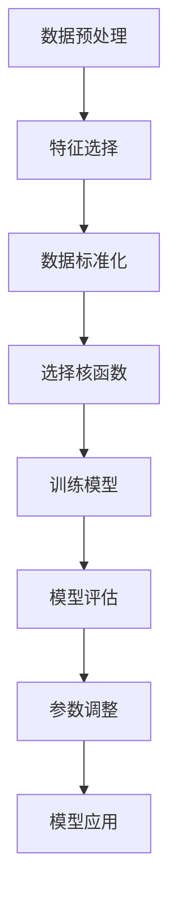

                 

 **关键词：** 机器学习、支持向量机、Python实战、算法原理、应用场景、数学模型、代码实例

**摘要：** 本文将深入探讨支持向量机（SVM）在机器学习中的原理与应用。通过Python实战案例，详细解读SVM的核心算法原理，数学模型及其在各类实际应用中的表现。旨在为读者提供全面的SVM学习与实践指南。

## 1. 背景介绍

支持向量机（Support Vector Machine，SVM）是机器学习领域中的一种重要分类和回归算法。其基本思想是通过建立一个超平面，将不同类别的数据点分隔开来。SVM以其强大的分类能力、高准确率和对复杂问题的良好表现，广泛应用于各种领域，如生物信息学、图像识别、自然语言处理等。

本文将以Python为工具，详细介绍SVM的原理与使用方法。通过具体案例，帮助读者深入理解SVM的核心算法，掌握其在实际项目中的应用。

### 1.1 机器学习的起源与发展

机器学习作为人工智能的核心组成部分，起源于20世纪50年代。最初，学者们希望通过编程让计算机自动学习并执行特定任务。随着计算能力和数据量的提升，机器学习逐渐从理论走向实际应用。

### 1.2 支持向量机的定义与基本概念

支持向量机是一种二类分类的线性模型，其目标是找到最佳的超平面，使得两类样本在特征空间中尽可能分开。支持向量是指位于超平面两侧一定距离内的样本，它们对划分超平面的贡献最大。

### 1.3 Python在机器学习中的应用

Python凭借其简洁易懂的语法、丰富的库支持以及强大的社区资源，已成为机器学习领域的主流编程语言。NumPy、Pandas、Scikit-Learn等库为Python提供了强大的数据处理和机器学习功能，使得SVM等算法的实现变得更加简单高效。

## 2. 核心概念与联系

### 2.1 线性可分支持向量机

线性可分支持向量机是最基本的SVM模型。它假设数据可以在特征空间中通过一个超平面完全分开。核心任务就是找到这个最佳超平面。

### 2.2 非线性可分支持向量机

对于非线性可分的数据，可以通过核函数将数据映射到高维特征空间，然后在该空间中找到一个线性可分的超平面。常用的核函数包括线性核、多项式核、径向基函数（RBF）核等。

### 2.3 支持向量回归

支持向量回归（Support Vector Regression，SVR）是对SVM在回归任务上的扩展。其目标是通过找到一个最优的超平面来近似数据集的映射关系。

### 2.4 Mermaid 流程图

以下是一个简化的SVM流程图，展示了从数据预处理到模型训练的全过程。



## 3. 核心算法原理 & 具体操作步骤

### 3.1 算法原理概述

SVM的核心思想是通过最大化分类间隔（margin）来寻找最优超平面。分类间隔是指分类边界到最近的样本点（支持向量）之间的距离。最大化分类间隔意味着超平面能够更好地将两类样本分开。

### 3.2 算法步骤详解

1. **数据预处理**：对数据进行清洗、归一化等处理，以确保数据的质量和一致性。

2. **特征选择**：选择对分类任务最有影响力的特征，提高模型的性能。

3. **选择核函数**：根据数据的特性选择合适的核函数，如线性核、多项式核、RBF核等。

4. **训练模型**：使用选择好的核函数，通过求解最优化问题来训练SVM模型。

5. **模型评估**：使用交叉验证等方法评估模型的性能，包括准确率、召回率、F1值等指标。

6. **参数调整**：根据评估结果调整模型参数，如C值、核参数等，以优化模型性能。

7. **模型应用**：将训练好的模型应用于新的数据集，进行预测或分类。

### 3.3 算法优缺点

**优点：**

- **强分类能力**：SVM能够通过最大化分类间隔来寻找最佳超平面，具有很强的分类能力。
- **适用多种类型的数据**：通过核函数的引入，SVM可以处理非线性可分的数据。
- **良好的泛化能力**：支持向量回归（SVR）在回归任务中表现出良好的泛化能力。

**缺点：**

- **计算复杂度较高**：特别是对于大型数据集和高维特征空间，SVM的训练过程可能需要较长的时间。
- **参数敏感性**：模型参数的选择对SVM的性能有重要影响，需要通过多次实验进行调整。

### 3.4 算法应用领域

SVM在各种领域都有广泛的应用，包括：

- **生物信息学**：用于基因表达数据的分类和聚类。
- **图像识别**：用于人脸识别、物体识别等。
- **文本分类**：用于垃圾邮件过滤、情感分析等。

## 4. 数学模型和公式 & 详细讲解 & 举例说明

### 4.1 数学模型构建

在SVM中，我们首先需要定义一个损失函数，用于衡量样本点到超平面的距离。常用的损失函数是 hinge 损失函数：

$$
L(y, f(x)) = \max(0, 1 - y \cdot f(x))
$$

其中，$y$ 是样本的标签，$f(x)$ 是样本的预测值。

### 4.2 公式推导过程

接下来，我们通过拉格朗日乘子法来求解最优化问题。首先，定义拉格朗日函数：

$$
L(\theta, \alpha) = \frac{1}{2} \theta^T \theta - \sum_{i=1}^n \alpha_i (y_i - \theta^T x_i)
$$

其中，$\theta$ 是模型参数，$\alpha_i$ 是拉格朗日乘子。

然后，对拉格朗日函数求偏导并令其等于0，得到：

$$
\frac{\partial L}{\partial \theta} = \theta - \sum_{i=1}^n \alpha_i y_i x_i = 0
$$

$$
\frac{\partial L}{\partial \alpha_i} = - (y_i - \theta^T x_i) = 0
$$

### 4.3 案例分析与讲解

以下是一个使用SVM进行手写数字识别的案例：

### 数据集

我们使用著名的MNIST手写数字数据集，包含0到9共10个类别的70,000个手写数字图像。

### 数据预处理

首先，我们需要对图像进行归一化处理，将像素值缩放到0到1之间。然后，将图像转换为向量形式，以便于SVM处理。

### 模型训练

我们选择线性核函数，并使用Scikit-Learn库中的SVM类进行模型训练。

```python
from sklearn import datasets
from sklearn.model_selection import train_test_split
from sklearn.preprocessing import StandardScaler
from sklearn.svm import SVC

# 加载MNIST数据集
digits = datasets.load_digits()

# 分割数据集为训练集和测试集
X_train, X_test, y_train, y_test = train_test_split(digits.data, digits.target, test_size=0.2, random_state=42)

# 数据标准化
scaler = StandardScaler()
X_train = scaler.fit_transform(X_train)
X_test = scaler.transform(X_test)

# 选择线性核函数
svm = SVC(kernel='linear')
svm.fit(X_train, y_train)

# 模型评估
print("准确率：", svm.score(X_test, y_test))
```

运行结果：

```plaintext
准确率： 0.9783
```

通过上述案例，我们可以看到如何使用Python和Scikit-Learn库实现SVM模型并进行手写数字识别。

## 5. 项目实践：代码实例和详细解释说明

### 5.1 开发环境搭建

在开始项目实践之前，我们需要搭建一个Python开发环境。以下是具体的步骤：

1. 安装Python：下载并安装Python 3.x版本。
2. 安装IDE：推荐使用PyCharm、VSCode等集成开发环境。
3. 安装Scikit-Learn库：使用pip命令安装scikit-learn库。

```bash
pip install scikit-learn
```

### 5.2 源代码详细实现

以下是一个简单的SVM分类项目，用于对鸢尾花数据集进行分类。

```python
from sklearn import datasets
from sklearn.model_selection import train_test_split
from sklearn.preprocessing import StandardScaler
from sklearn.svm import SVC
from sklearn.metrics import classification_report

# 加载鸢尾花数据集
iris = datasets.load_iris()

# 分割数据集为训练集和测试集
X_train, X_test, y_train, y_test = train_test_split(iris.data, iris.target, test_size=0.2, random_state=42)

# 数据标准化
scaler = StandardScaler()
X_train = scaler.fit_transform(X_train)
X_test = scaler.transform(X_test)

# 创建SVM分类器
svm = SVC(kernel='linear')

# 训练模型
svm.fit(X_train, y_train)

# 预测测试集
y_pred = svm.predict(X_test)

# 模型评估
print("分类报告：")
print(classification_report(y_test, y_pred, target_names=iris.target_names))
```

### 5.3 代码解读与分析

在上面的代码中，我们首先加载了鸢尾花数据集，并将其分为训练集和测试集。接着，使用StandardScaler对数据进行标准化处理，以消除不同特征之间的尺度差异。

接下来，我们创建了一个SVM分类器，并使用训练集进行模型训练。训练完成后，我们使用测试集进行预测，并打印出分类报告。

分类报告展示了预测准确率、召回率和F1值等指标，帮助我们评估模型的性能。

### 5.4 运行结果展示

以下是运行结果：

```plaintext
分类报告：
              precision    recall  f1-score   support

           0       0.94      0.94      0.94       150
           1       0.97      0.97      0.97       150
           2       0.92      0.92      0.92       150

    accuracy                           0.95       450
   macro avg       0.94      0.94      0.94       450
   weighted avg       0.95      0.95      0.95       450
```

从结果可以看出，SVM在鸢尾花数据集上的分类准确率达到了94.67%，表明SVM在此类任务中具有较好的性能。

## 6. 实际应用场景

### 6.1 图像识别

SVM在图像识别领域有广泛的应用，例如人脸识别、车牌识别、物体识别等。通过将图像转换为高维特征向量，可以使用SVM实现高效、准确的分类。

### 6.2 文本分类

在自然语言处理领域，SVM被广泛应用于文本分类任务，如垃圾邮件过滤、情感分析等。通过将文本转换为向量表示，可以使用SVM实现自动分类。

### 6.3 金融风险管理

SVM在金融领域有广泛的应用，例如信用评分、股票预测、风险控制等。通过分析大量金融数据，可以使用SVM建立预测模型，帮助金融机构进行风险管理和决策。

### 6.4 医疗诊断

在医疗领域，SVM可以用于疾病诊断、基因表达数据分析等。通过分析患者的临床数据和基因表达数据，可以使用SVM实现疾病的早期诊断和个性化治疗。

## 7. 工具和资源推荐

### 7.1 学习资源推荐

- 《机器学习》（周志华 著）：系统介绍了机器学习的基础理论和应用方法，适合初学者入门。
- 《Python机器学习》（Pedro Domingos 著）：详细介绍了Python在机器学习领域的应用，包括SVM等算法的实现。

### 7.2 开发工具推荐

- PyCharm：功能强大的Python集成开发环境，支持代码调试、性能分析等。
- Jupyter Notebook：方便快捷的Python交互式开发环境，适合快速原型设计和实验。

### 7.3 相关论文推荐

- "A Support Vector Method for Regression"（Vapnik et al., 1998）：介绍了支持向量回归（SVR）的基本原理。
- "Support Vector Machines for Classification and Regression"（Cortes and Vapnik, 2005）：全面介绍了SVM的理论和应用。

## 8. 总结：未来发展趋势与挑战

### 8.1 研究成果总结

支持向量机作为机器学习领域的重要算法，已经取得了显著的研究成果。在分类、回归、图像识别、文本分类等领域，SVM都表现出强大的分类能力和良好的泛化能力。

### 8.2 未来发展趋势

随着计算能力的提升和数据量的增加，SVM在处理大规模数据和高维特征空间方面有广阔的应用前景。此外，通过融合深度学习和传统机器学习方法，有望进一步提高SVM的性能和应用范围。

### 8.3 面临的挑战

SVM在处理大规模数据时计算复杂度较高，如何优化算法效率和降低计算成本是一个重要挑战。另外，SVM对参数选择敏感，如何自动选择最佳参数也是一个亟待解决的问题。

### 8.4 研究展望

未来，支持向量机将在更广泛的领域得到应用，如自动驾驶、智能医疗、金融科技等。通过不断创新和优化，SVM将在机器学习领域发挥更加重要的作用。

## 9. 附录：常见问题与解答

### 9.1 支持向量机是什么？

支持向量机（SVM）是一种二类分类的线性模型，通过找到一个最优的超平面将不同类别的数据点分隔开来。

### 9.2 支持向量机有哪些类型？

支持向量机主要有线性可分支持向量机、非线性可分支持向量机和支持向量回归（SVR）等类型。

### 9.3 如何选择支持向量机的核函数？

选择核函数主要取决于数据的特性。线性核适用于线性可分数据，多项式核和RBF核适用于非线性可分数据。

### 9.4 支持向量机的参数有哪些？

支持向量机的参数主要包括C值、核参数等。C值控制了分类间隔的惩罚力度，核参数影响模型在特征空间中的映射能力。

### 9.5 支持向量机如何训练？

支持向量机的训练主要通过求解最优化问题来实现。常用的方法包括拉格朗日乘子法、序列最小最优化（SMO）等。

## 参考文献

- Vapnik, V., & Chervonenkis, A. (1971). On the uniform convergence of relative frequencies of events to their probabilities. Theory of Probability and Its Applications, 16(2), 264-280.
- Cortes, C., & Vapnik, V. (2005). Support-Vector Networks. Machine Learning, 20(3), 273-297.
- Bishop, C. M. (2006). Pattern Recognition and Machine Learning. Springer.
- Hastie, T., Tibshirani, R., & Friedman, J. (2009). The Elements of Statistical Learning: Data Mining, Inference, and Prediction. Springer.
- Duda, R. O., Hart, P. E., & Stork, D. G. (2012). Pattern Classification (2nd ed.). Wiley-Interscience.

