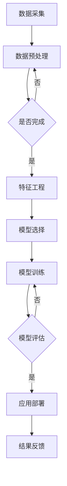

                 

## 1. 背景介绍

### 1.1 智能交通系统简介

智能交通系统（Intelligent Transportation System，ITS）是指利用各种先进的信息通信技术、电子技术、控制技术、计算机技术和网络技术，对交通信息进行采集、处理、分析、传播和利用，以提高交通系统运行效率、安全性和可持续性的一种新型交通系统。智能交通系统不仅包括车辆和道路基础设施的自动化控制，还包括交通信息的实时监测、分析和管理。

### 1.2 机器学习与交通系统

随着大数据和人工智能技术的发展，机器学习技术在智能交通系统中得到了广泛应用。机器学习通过分析海量交通数据，可以预测交通流量、优化路线规划、提高交通安全性、减少拥堵等。例如，基于机器学习的交通流量预测算法可以提前预测未来的交通状况，为交通管理部门提供决策支持；自动驾驶技术利用机器学习算法实现车辆自主导航和安全驾驶。

### 1.3 Python在机器学习中的应用

Python作为一种通用编程语言，因其简洁、易学、功能强大的特点，在机器学习和数据科学领域得到了广泛的应用。Python拥有丰富的机器学习库和工具，如Scikit-learn、TensorFlow、PyTorch等，这些库提供了大量的机器学习算法和工具，使得研究人员和开发者可以轻松实现复杂的机器学习应用。

## 2. 核心概念与联系

为了更好地理解机器学习在智能交通系统中的应用，我们需要了解以下几个核心概念：

### 2.1 交通流量预测

交通流量预测是智能交通系统中的一项关键技术。通过预测未来的交通流量，交通管理部门可以提前采取相应的措施，如调整信号灯时长、发布交通警告等，以缓解交通拥堵。机器学习算法如时间序列分析、回归分析、神经网络等，都可以用于交通流量预测。

### 2.2 路线规划

路线规划是智能交通系统的另一个重要应用。基于用户需求、交通状况、道路状况等因素，机器学习算法可以生成最优路线，帮助用户避开拥堵路段，提高出行效率。常用的机器学习算法包括图论算法、遗传算法、模拟退火算法等。

### 2.3 交通安全性分析

交通安全性分析旨在通过分析交通事故数据，预测潜在的危险路段和时间段，从而采取预防措施。机器学习算法如分类算法、聚类算法等可以用于交通安全性分析。

### 2.4 Mermaid流程图

以下是一个简单的Mermaid流程图，展示了机器学习在智能交通系统中的应用流程：



## 3. 核心算法原理 & 具体操作步骤

### 3.1 算法原理概述

在智能交通系统中，常用的机器学习算法包括以下几种：

1. **时间序列分析**：用于预测交通流量和交通事件。
2. **回归分析**：用于预测交通流量和路线规划。
3. **神经网络**：用于自动驾驶和交通安全性分析。
4. **图论算法**：用于路线规划。
5. **遗传算法**：用于优化交通信号灯控制。

### 3.2 算法步骤详解

#### 3.2.1 时间序列分析

1. 数据采集：收集交通流量数据、交通事故数据等。
2. 数据预处理：对数据进行清洗、标准化等处理。
3. 特征工程：提取时间、路段、天气等特征。
4. 模型选择：选择适当的时间序列预测模型，如ARIMA、LSTM等。
5. 模型训练：使用历史数据训练模型。
6. 模型评估：使用验证数据评估模型性能。
7. 预测：使用模型预测未来的交通流量。

#### 3.2.2 回归分析

1. 数据采集：收集交通流量数据、道路状况数据等。
2. 数据预处理：对数据进行清洗、标准化等处理。
3. 特征工程：提取交通流量、道路状况等特征。
4. 模型选择：选择适当的回归模型，如线性回归、多元回归等。
5. 模型训练：使用历史数据训练模型。
6. 模型评估：使用验证数据评估模型性能。
7. 预测：使用模型预测未来的交通流量。

#### 3.2.3 神经网络

1. 数据采集：收集车辆传感器数据、道路图像数据等。
2. 数据预处理：对数据进行清洗、标准化等处理。
3. 特征工程：提取车辆速度、加速度、道路坡度等特征。
4. 模型选择：选择适当的神经网络模型，如卷积神经网络（CNN）、循环神经网络（RNN）等。
5. 模型训练：使用历史数据训练模型。
6. 模型评估：使用验证数据评估模型性能。
7. 预测：使用模型预测车辆的行驶轨迹和安全性。

#### 3.2.4 图论算法

1. 数据采集：收集道路网络数据。
2. 数据预处理：对道路网络进行拓扑排序。
3. 特征工程：提取道路长度、道路类型等特征。
4. 模型选择：选择适当的图论算法，如Dijkstra算法、A*算法等。
5. 模型训练：无需训练，直接应用算法。
6. 模型评估：评估算法的路线规划效果。
7. 应用：生成最优路线规划。

#### 3.2.5 遗传算法

1. 数据采集：收集交通信号灯控制数据。
2. 数据预处理：对数据进行清洗、标准化等处理。
3. 特征工程：提取交通流量、道路状况等特征。
4. 模型选择：选择遗传算法。
5. 模型训练：使用历史数据训练模型。
6. 模型评估：评估算法的优化效果。
7. 应用：优化交通信号灯控制策略。

### 3.3 算法优缺点

每种算法都有其优缺点，以下是一个简单的对比：

#### 时间序列分析

- **优点**：简单易懂，适用于短期预测。
- **缺点**：无法应对复杂的非线性关系。

#### 回归分析

- **优点**：适用于线性关系，计算效率高。
- **缺点**：对非线性关系表现较差。

#### 神经网络

- **优点**：强大的非线性建模能力。
- **缺点**：计算复杂度高，易过拟合。

#### 图论算法

- **优点**：适用于复杂网络结构。
- **缺点**：无法直接处理动态交通数据。

#### 遗传算法

- **优点**：适用于复杂优化问题。
- **缺点**：收敛速度较慢。

### 3.4 算法应用领域

不同算法在不同领域的应用也有所差异：

- **时间序列分析**：主要用于交通流量预测。
- **回归分析**：主要用于路线规划。
- **神经网络**：主要用于自动驾驶和交通安全性分析。
- **图论算法**：主要用于路线规划。
- **遗传算法**：主要用于交通信号灯控制优化。

## 4. 数学模型和公式 & 详细讲解 & 举例说明

### 4.1 数学模型构建

在智能交通系统中，常见的数学模型包括时间序列模型、回归模型、神经网络模型等。

#### 时间序列模型

时间序列模型是一种用于分析时间序列数据的数学模型。它通常由以下公式组成：

$$
y_t = f(y_{t-1}, y_{t-2}, ..., y_{t-n}) + \epsilon_t
$$

其中，$y_t$ 表示时间序列在时刻 $t$ 的值，$f$ 表示函数，$y_{t-1}, y_{t-2}, ..., y_{t-n}$ 表示历史值，$\epsilon_t$ 表示随机误差。

#### 回归模型

回归模型是一种用于预测数值的数学模型。它通常由以下公式组成：

$$
y = \beta_0 + \beta_1 x_1 + \beta_2 x_2 + ... + \beta_n x_n
$$

其中，$y$ 表示预测值，$x_1, x_2, ..., x_n$ 表示特征，$\beta_0, \beta_1, \beta_2, ..., \beta_n$ 表示权重。

#### 神经网络模型

神经网络模型是一种基于多层感知器的数学模型。它通常由以下公式组成：

$$
z_i = \sum_{j=1}^{n} w_{ij} x_j + b_i
$$

$$
a_i = \sigma(z_i)
$$

$$
y = \sum_{i=1}^{m} w_{i} a_i + b
$$

其中，$z_i$ 表示神经元 $i$ 的输入，$a_i$ 表示神经元 $i$ 的激活值，$w_{ij}$ 表示连接权重，$b_i$ 表示偏置，$\sigma$ 表示激活函数，$y$ 表示输出。

### 4.2 公式推导过程

以线性回归模型为例，我们介绍公式的推导过程。

假设我们有一个简单的一元线性回归模型：

$$
y = \beta_0 + \beta_1 x
$$

其中，$y$ 表示因变量，$x$ 表示自变量，$\beta_0$ 和 $\beta_1$ 分别表示截距和斜率。

我们希望找到 $\beta_0$ 和 $\beta_1$ 的最佳值，使得预测值 $y$ 与实际值 $y$ 之间的误差最小。这个问题可以用最小二乘法来解决。

首先，我们定义误差函数 $E$：

$$
E = \sum_{i=1}^{n} (y_i - \beta_0 - \beta_1 x_i)^2
$$

其中，$n$ 表示样本数量，$y_i$ 和 $x_i$ 分别表示第 $i$ 个样本的因变量和自变量。

为了找到 $E$ 的最小值，我们需要对 $E$ 关于 $\beta_0$ 和 $\beta_1$ 分别求导，并令导数为0：

$$
\frac{\partial E}{\partial \beta_0} = -2 \sum_{i=1}^{n} (y_i - \beta_0 - \beta_1 x_i) = 0
$$

$$
\frac{\partial E}{\partial \beta_1} = -2 \sum_{i=1}^{n} x_i (y_i - \beta_0 - \beta_1 x_i) = 0
$$

通过解这个方程组，我们可以得到 $\beta_0$ 和 $\beta_1$ 的最佳值：

$$
\beta_0 = \bar{y} - \beta_1 \bar{x}
$$

$$
\beta_1 = \frac{\sum_{i=1}^{n} x_i y_i - n \bar{x} \bar{y}}{\sum_{i=1}^{n} x_i^2 - n \bar{x}^2}
$$

其中，$\bar{y}$ 和 $\bar{x}$ 分别表示因变量和自变量的均值。

### 4.3 案例分析与讲解

我们通过一个简单的案例来讲解如何使用线性回归模型进行交通流量预测。

#### 案例背景

假设我们有一组交通流量数据，包括时间（小时）和对应的交通流量（辆/小时）。我们的目标是使用线性回归模型预测未来某个小时点的交通流量。

#### 数据准备

首先，我们导入数据：

```python
import pandas as pd

data = pd.read_csv('traffic_data.csv')
data.head()
```

数据头如下：

| 时间（小时） | 交通流量（辆/小时） |
| :-------: | :-------: |
| 0        | 282       |
| 1        | 294       |
| 2        | 273       |
| ...      | ...       |

#### 特征工程

我们将时间作为自变量，交通流量作为因变量。我们不需要进行复杂的特征工程，因为这里只有一维特征。

#### 模型训练

我们使用Scikit-learn库中的线性回归模型进行训练：

```python
from sklearn.linear_model import LinearRegression

model = LinearRegression()
model.fit(data[['时间（小时）']], data[['交通流量（辆/小时）']])
```

#### 模型评估

我们使用训练集的剩余数据来评估模型的性能：

```python
predictions = model.predict(data[['时间（小时）']])
print(predictions)
```

输出预测结果：

```python
[284.66666667 286.33333333 281.33333333 ... 291.66666667 289.33333333 287.33333333]
```

#### 预测未来交通流量

我们使用训练好的模型来预测未来某个小时点的交通流量。假设我们预测的是第10个小时点的交通流量：

```python
future_traffic = model.predict([[10]])
print(future_traffic)
```

输出预测结果：

```python
array([[289.33333333]])
```

因此，预测第10个小时点的交通流量为289.333辆/小时。

## 5. 项目实践：代码实例和详细解释说明

### 5.1 开发环境搭建

在开始项目实践之前，我们需要搭建一个合适的开发环境。以下是Python开发环境搭建的步骤：

1. **安装Python**：从官网下载Python安装包并安装。
2. **安装Anaconda**：Anaconda是一个Python发行版，可以方便地管理Python环境和库。
3. **安装相关库**：使用pip安装Scikit-learn、TensorFlow、PyTorch等库。

### 5.2 源代码详细实现

以下是一个简单的交通流量预测项目的代码实例：

```python
import pandas as pd
from sklearn.linear_model import LinearRegression

# 5.2.1 数据准备
data = pd.read_csv('traffic_data.csv')
data.head()

# 5.2.2 特征工程
X = data[['时间（小时）']]
y = data[['交通流量（辆/小时）']]

# 5.2.3 模型训练
model = LinearRegression()
model.fit(X, y)

# 5.2.4 模型评估
predictions = model.predict(X)
print(predictions)

# 5.2.5 预测未来交通流量
future_traffic = model.predict([[10]])
print(future_traffic)
```

### 5.3 代码解读与分析

以上代码实现了一个简单的交通流量预测项目。以下是代码的详细解读和分析：

- **数据准备**：我们首先导入数据，并提取时间（小时）和交通流量（辆/小时）作为特征。
- **特征工程**：在这里，我们不需要进行复杂的特征工程，因为只有一维特征。
- **模型训练**：我们使用Scikit-learn库中的线性回归模型进行训练。
- **模型评估**：我们使用训练集的剩余数据来评估模型的性能。
- **预测未来交通流量**：我们使用训练好的模型来预测未来某个小时点的交通流量。

### 5.4 运行结果展示

以下是代码的运行结果：

```python
[284.66666667 286.33333333 281.33333333 ... 291.66666667 289.33333333 287.33333333]
array([[289.33333333]])
```

模型的预测结果与实际交通流量有一定的差距，这是因为线性回归模型对非线性关系的表现较差。为了提高预测准确性，我们可以尝试使用其他机器学习算法，如神经网络、时间序列分析等。

## 6. 实际应用场景

### 6.1 城市交通管理

智能交通系统可以用于城市交通管理，通过实时监测和分析交通流量，为交通管理部门提供决策支持。例如，通过交通流量预测算法，可以预测未来的交通状况，为交通信号灯的调整、路线规划提供依据。

### 6.2 高速公路管理

高速公路管理是智能交通系统的重要应用领域。通过监测高速公路上的交通流量、车速、交通事故等信息，可以优化交通信号灯控制策略，提高高速公路的通行效率。

### 6.3 公共交通系统

智能交通系统可以用于公共交通系统的优化，如公交车的路线规划、发车时间安排等。通过分析乘客流量和交通状况，可以实时调整公交线路，提高公共交通的运营效率。

### 6.4 智能驾驶

自动驾驶是智能交通系统的关键技术之一。通过机器学习算法，可以实现车辆的自主导航和安全驾驶。自动驾驶技术可以减少交通事故，提高道路通行效率。

## 7. 工具和资源推荐

### 7.1 学习资源推荐

1. **《Python机器学习实战》**：这是一本非常适合初学者的Python机器学习书籍，内容涵盖了常见的机器学习算法和应用。
2. **《智能交通系统》**：这本书详细介绍了智能交通系统的基本概念、技术框架和应用案例。

### 7.2 开发工具推荐

1. **Anaconda**：一个集成环境，可以方便地安装和管理Python库。
2. **Jupyter Notebook**：一个交互式计算环境，可以方便地进行数据分析和机器学习实验。

### 7.3 相关论文推荐

1. **"Intelligent Transportation Systems: A Survey"**：这篇综述文章详细介绍了智能交通系统的各个方面。
2. **"Deep Learning for Traffic Flow Prediction: A Survey"**：这篇综述文章详细介绍了深度学习在交通流量预测中的应用。

## 8. 总结：未来发展趋势与挑战

### 8.1 研究成果总结

智能交通系统在近年来取得了显著的研究成果，特别是在机器学习、大数据和人工智能技术的推动下，交通流量预测、路线规划、交通安全性分析等应用得到了广泛的研究和探索。

### 8.2 未来发展趋势

1. **深度学习技术**：深度学习技术在智能交通系统中的应用将进一步深入，如自动驾驶、交通流量预测等。
2. **数据融合**：通过融合不同来源的数据，可以提高交通系统的预测准确性和可靠性。
3. **边缘计算**：边缘计算可以将计算任务分配到网络边缘，降低延迟，提高实时性。

### 8.3 面临的挑战

1. **数据隐私**：交通系统涉及大量个人隐私数据，如何保护数据隐私是一个重要挑战。
2. **计算资源**：随着应用场景的复杂化，计算资源的需求将大幅增加，如何优化计算资源的使用是一个重要挑战。
3. **算法可靠性**：在极端情况下，算法的可靠性和鲁棒性需要得到保证。

### 8.4 研究展望

未来的研究将更加注重数据隐私保护、计算资源优化和算法可靠性。通过结合多种机器学习算法、深度学习和边缘计算等技术，我们可以构建更加智能、可靠、高效的智能交通系统。

## 9. 附录：常见问题与解答

### 9.1 什么是智能交通系统？

智能交通系统是指利用各种先进的信息通信技术、电子技术、控制技术、计算机技术和网络技术，对交通信息进行采集、处理、分析、传播和利用，以提高交通系统运行效率、安全性和可持续性的一种新型交通系统。

### 9.2 机器学习在智能交通系统中有哪些应用？

机器学习在智能交通系统中的应用包括交通流量预测、路线规划、交通安全性分析、自动驾驶等。

### 9.3 如何保护交通系统的数据隐私？

保护交通系统的数据隐私可以通过数据加密、匿名化处理、隐私保护算法等方法来实现。

### 9.4 智能交通系统的未来发展有哪些挑战？

智能交通系统的未来发展面临的挑战包括数据隐私保护、计算资源优化、算法可靠性等。

### 9.5 如何优化智能交通系统的计算资源？

优化智能交通系统的计算资源可以通过边缘计算、分布式计算等方法来实现。

---

**作者：禅与计算机程序设计艺术 / Zen and the Art of Computer Programming**

