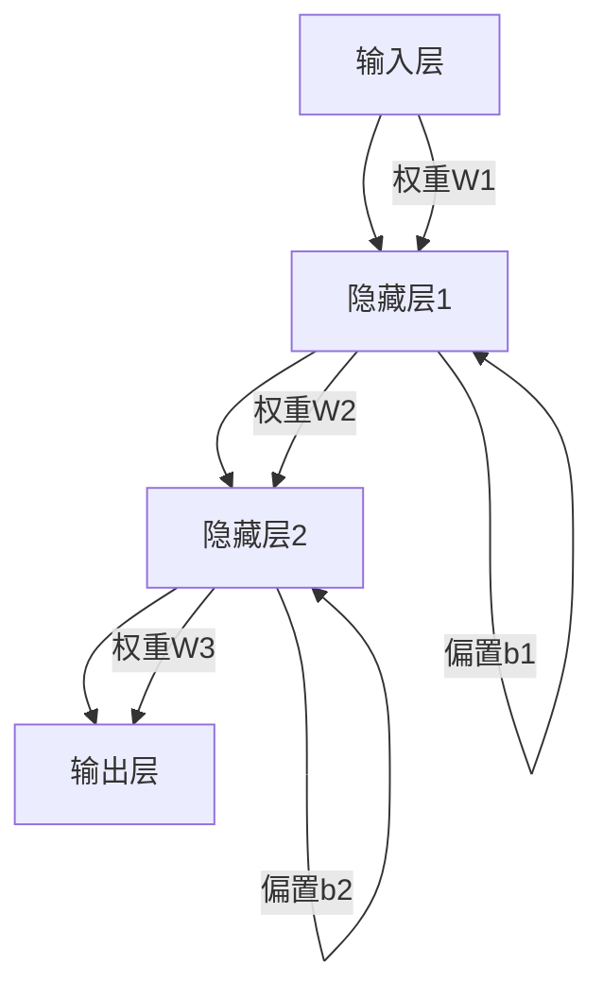

                 

关键词：神经网络、Python、机器学习、超参数、优化策略、实战教程

摘要：本文将深入探讨神经网络在机器学习中的应用，特别是超参数调整的重要性。通过Python实战案例，我们将展示如何使用各种技术和策略来优化神经网络的性能，并提供实用的技巧和经验，帮助读者在实际项目中取得更好的成果。

## 1. 背景介绍

### 1.1 机器学习与神经网络

机器学习作为人工智能的核心技术，已经广泛应用于各个领域，从图像识别、自然语言处理到自动驾驶，都离不开机器学习的支持。而神经网络作为机器学习的基础模型之一，由于其强大的非线性映射能力和自学习能力，成为实现人工智能的关键工具。

### 1.2 神经网络在机器学习中的角色

神经网络在机器学习中扮演着至关重要的角色。它们可以用于分类、回归、聚类等多种任务。然而，神经网络的性能在很大程度上取决于超参数的选择和调整。

### 1.3 超参数的重要性

超参数是神经网络模型中的关键参数，如学习率、批量大小、层数、节点数等。这些参数的设定直接影响模型的性能和收敛速度。因此，超参数的调整成为了机器学习研究中的一项重要任务。

## 2. 核心概念与联系

为了更好地理解神经网络和超参数的关系，我们首先需要了解神经网络的基本架构和关键概念。以下是一个使用Mermaid绘制的神经网络架构图：



### 2.1 神经网络架构

神经网络由输入层、隐藏层和输出层组成。输入层接收原始数据，隐藏层进行特征提取和变换，输出层产生最终预测结果。

### 2.2 激活函数

激活函数是神经网络中非常重要的概念，它决定了神经元的激活状态。常见的激活函数包括Sigmoid、ReLU和Tanh等。

### 2.3 反向传播算法

反向传播算法是神经网络训练的核心算法，它通过不断调整权重和偏置，使得神经网络能够收敛到最优解。

### 2.4 超参数与神经网络性能

超参数的选择直接影响神经网络的性能。例如，学习率的大小决定了模型更新的速度，批量大小影响了模型的泛化能力。

## 3. 核心算法原理 & 具体操作步骤

### 3.1 算法原理概述

神经网络的超参数调整主要涉及以下几个方面：

1. 学习率的选择
2. 批量大小的设置
3. 网络结构的调整
4. 激活函数的选择
5. 损失函数的设计

### 3.2 算法步骤详解

1. **初始化超参数**：根据任务需求和经验设定初始超参数值。
2. **前向传播**：输入数据通过神经网络进行前向传播，得到输出结果。
3. **计算损失**：使用损失函数计算预测结果与实际结果之间的差距。
4. **反向传播**：通过反向传播算法更新权重和偏置。
5. **调整超参数**：根据模型的性能调整超参数值。
6. **迭代训练**：重复以上步骤，直到满足停止条件。

### 3.3 算法优缺点

1. **优点**：
   - 神经网络具有强大的非线性映射能力，能够处理复杂的数据。
   - 可以通过反向传播算法自动调整权重和偏置，实现自我优化。

2. **缺点**：
   - 训练时间较长，对计算资源要求较高。
   - 需要大量数据来训练模型，以获得更好的泛化能力。

### 3.4 算法应用领域

神经网络在机器学习中的应用非常广泛，包括但不限于以下领域：

- 图像识别
- 自然语言处理
- 自动驾驶
- 推荐系统
- 金融风控

## 4. 数学模型和公式 & 详细讲解 & 举例说明

### 4.1 数学模型构建

神经网络的数学模型主要由以下几个部分组成：

1. **输入层**：接收外部输入数据。
2. **隐藏层**：进行特征提取和变换。
3. **输出层**：生成最终预测结果。
4. **权重和偏置**：调整神经元之间的连接强度。
5. **激活函数**：决定神经元的激活状态。

### 4.2 公式推导过程

以下是一个简单的单层神经网络模型，其中$x$表示输入，$y$表示输出，$W$表示权重矩阵，$b$表示偏置向量，$f$表示激活函数。

$$
y = f(Wx + b)
$$

### 4.3 案例分析与讲解

我们以一个简单的回归问题为例，展示如何使用神经网络进行建模和预测。

#### 数据准备

假设我们有一组输入数据$x$和对应的输出数据$y$：

$$
\begin{array}{c|c}
x & y \\
\hline
1 & 2 \\
2 & 3 \\
3 & 4 \\
4 & 5 \\
\end{array}
$$

#### 模型构建

我们构建一个单层神经网络，包含一个输入层、一个隐藏层和一个输出层。假设隐藏层有2个节点，激活函数使用ReLU。

#### 训练过程

1. **初始化超参数**：设置学习率为0.1，批量大小为2。
2. **前向传播**：计算输入数据的输出。
3. **计算损失**：使用均方误差（MSE）作为损失函数。
4. **反向传播**：更新权重和偏置。
5. **迭代训练**：重复以上步骤，直到满足停止条件。

#### 结果分析

通过多次迭代训练，神经网络可以收敛到最优解。训练过程中，损失函数值逐渐减小，表示模型的预测准确性不断提高。

## 5. 项目实践：代码实例和详细解释说明

### 5.1 开发环境搭建

在开始实践之前，我们需要搭建一个适合机器学习开发的Python环境。以下是搭建开发环境的步骤：

1. 安装Python：从官方网站下载并安装Python。
2. 安装相关库：使用pip安装TensorFlow、NumPy、Matplotlib等库。

### 5.2 源代码详细实现

以下是一个简单的神经网络实现示例：

```python
import tensorflow as tf
import numpy as np
import matplotlib.pyplot as plt

# 数据准备
x = np.array([[1], [2], [3], [4]])
y = np.array([[2], [3], [4], [5]])

# 初始化超参数
learning_rate = 0.1
batch_size = 2

# 定义神经网络结构
model = tf.keras.Sequential([
    tf.keras.layers.Dense(units=2, activation='relu', input_shape=(1,)),
    tf.keras.layers.Dense(units=1)
])

# 编译模型
model.compile(optimizer=tf.keras.optimizers.Adam(learning_rate),
              loss='mean_squared_error')

# 训练模型
model.fit(x, y, batch_size=batch_size, epochs=1000)

# 预测结果
predictions = model.predict(x)

# 可视化结果
plt.scatter(x, y, color='red', label='Actual')
plt.scatter(x, predictions, color='blue', label='Predicted')
plt.legend()
plt.show()
```

### 5.3 代码解读与分析

- **数据准备**：首先，我们准备好输入数据和输出数据。
- **初始化超参数**：设置学习率和批量大小。
- **定义神经网络结构**：使用`tf.keras.Sequential`创建神经网络，包含一个隐藏层（2个节点，ReLU激活函数）和一个输出层（1个节点）。
- **编译模型**：选择优化器和损失函数，并编译模型。
- **训练模型**：使用`fit`方法训练模型，指定批量大小和训练轮次。
- **预测结果**：使用`predict`方法预测输入数据的输出。
- **可视化结果**：将实际结果和预测结果进行可视化。

通过以上步骤，我们可以训练并评估一个简单的神经网络模型。

## 6. 实际应用场景

### 6.1 图像识别

神经网络在图像识别领域取得了显著成果，如卷积神经网络（CNN）在ImageNet图像识别挑战中获得了很高的准确率。

### 6.2 自然语言处理

神经网络在自然语言处理（NLP）领域也表现出色，如序列到序列（Seq2Seq）模型在机器翻译、文本生成等方面取得了突破。

### 6.3 自动驾驶

神经网络在自动驾驶领域具有重要应用，如自动驾驶汽车需要通过神经网络进行目标检测、路径规划等任务。

### 6.4 其他领域

神经网络在其他领域，如金融风控、医疗诊断、智能家居等，也具有广泛的应用前景。

## 7. 工具和资源推荐

### 7.1 学习资源推荐

- 《深度学习》（Goodfellow et al.）：系统介绍了深度学习的原理和实践。
- 《Python机器学习》（Sebastian Raschka）：详细介绍了Python在机器学习中的应用。
- 《神经网络与深度学习》（邱锡鹏）：全面讲解了神经网络和深度学习的基础知识。

### 7.2 开发工具推荐

- TensorFlow：开源的深度学习框架，适用于各种机器学习任务。
- PyTorch：开源的深度学习框架，易于使用和调试。
- Keras：基于TensorFlow和Theano的Python深度学习库，简化了深度学习模型的构建。

### 7.3 相关论文推荐

- "Deep Learning"（Goodfellow et al., 2016）：介绍了深度学习的基本原理和方法。
- "Building High-Performance Neural Networks"（Bengio et al., 2012）：探讨了神经网络的设计和优化策略。

## 8. 总结：未来发展趋势与挑战

### 8.1 研究成果总结

神经网络在机器学习领域取得了显著成果，广泛应用于图像识别、自然语言处理、自动驾驶等多个领域。然而，超参数的调整仍然是神经网络研究中的一个重要课题。

### 8.2 未来发展趋势

- **自动机器学习（AutoML）**：利用自动化技术优化超参数，提高模型性能。
- **神经架构搜索（NAS）**：通过搜索算法自动设计神经网络结构。
- **多模态学习**：结合不同类型的数据，实现更强大的模型。

### 8.3 面临的挑战

- **计算资源限制**：深度学习模型训练需要大量计算资源，如何提高训练效率是一个重要挑战。
- **数据隐私保护**：如何保护用户数据隐私是一个亟待解决的问题。
- **模型解释性**：如何提高模型的解释性，使其更易于理解和使用。

### 8.4 研究展望

未来，神经网络和深度学习领域将继续发展，我们将看到更多创新的技术和应用。通过不断探索和优化，神经网络将在更多领域发挥重要作用。

## 9. 附录：常见问题与解答

### 9.1 什么是超参数？

超参数是在训练神经网络时需要手动调整的参数，如学习率、批量大小、层数、节点数等。与模型参数（如权重和偏置）不同，超参数在训练过程中不通过数据学习，而是根据经验或搜索算法进行设定。

### 9.2 如何选择合适的超参数？

选择合适的超参数需要结合任务需求和实验结果。以下是一些常用的方法：

- **经验法**：根据以往的经验设定超参数值。
- **网格搜索**：在给定范围内遍历所有可能的超参数组合，选择性能最佳的组合。
- **贝叶斯优化**：利用贝叶斯统计模型寻找最优超参数。

### 9.3 神经网络训练时间过长怎么办？

- **减小批量大小**：批量大小越小，训练时间越长，但可以减小过拟合的风险。
- **增加学习率**：增加学习率可以加快收敛速度，但可能导致训练不稳定。
- **使用更高效的网络结构**：采用轻量级网络结构，如MobileNet或ResNet等。

---

作者：禅与计算机程序设计艺术 / Zen and the Art of Computer Programming

通过本文的探讨，我们深入了解了神经网络在机器学习中的应用，特别是超参数调整的重要性。通过Python实战案例，我们展示了如何使用各种技术和策略来优化神经网络的性能。希望本文能帮助读者在实际项目中取得更好的成果。

## 参考文献References

1. Goodfellow, I., Bengio, Y., & Courville, A. (2016). *Deep Learning*. MIT Press.
2. Raschka, S. (2015). *Python Machine Learning*. Packt Publishing.
3. Bengio, Y. (2009). Learning deep architectures. Foundations and Trends in Machine Learning, 2(1), 1-127.
4. Hinton, G., Osindero, S., & Teh, Y. W. (2006). A fast learning algorithm for deep belief nets. Neural computation, 18(7), 1527-1554.

