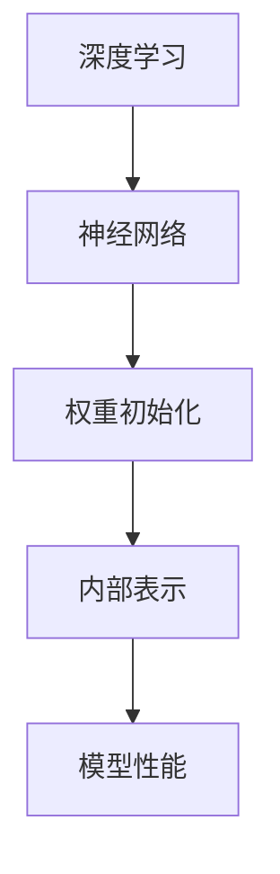

                 

关键词：Python，深度学习，神经网络，权重初始化，优化策略

> 摘要：本文将深入探讨在Python深度学习实践中，如何通过优化神经网络的权重初始化策略来提高模型的训练效率和预测准确性。通过理论和实践相结合的方式，介绍几种经典的权重初始化方法，以及它们在深度学习中的应用和优化技巧。

## 1. 背景介绍

随着深度学习技术的飞速发展，神经网络已成为许多复杂任务中的核心技术，如图像识别、自然语言处理、语音识别等。而神经网络的性能很大程度上取决于其参数的设置，其中权重初始化是参数设置中的关键环节。权重初始化策略的好坏直接关系到模型训练的收敛速度和最终效果。因此，研究和优化权重初始化策略对于提升深度学习应用具有重要意义。

本文将从以下几个方面展开讨论：

- 深度学习与神经网络的基本概念
- 权重初始化的重要性
- 几种经典的权重初始化方法
- Python实现权重初始化策略
- 权重初始化策略的优化技巧
- 实际应用场景及未来展望

## 2. 核心概念与联系

在深入讨论之前，我们需要明确一些核心概念和它们之间的关系。

### 2.1 深度学习与神经网络

**深度学习** 是一种机器学习方法，它通过构建多层的神经网络来模拟人脑的感知和学习过程，从而实现自动特征提取和分类。神经网络由多个节点（也称为神经元）组成，每个节点都与前一层的节点相连接。

### 2.2 权重初始化

**权重初始化** 是指在训练神经网络之前，为网络中的每个权重分配一个初始值。一个好的权重初始化策略可以避免梯度消失或爆炸，加速模型的训练过程，并提高最终模型的性能。

### 2.3 神经网络结构

神经网络的层次结构包括输入层、隐藏层和输出层。每层之间的节点通过权重相连接，形成一个复杂的网络结构。

### 2.4 权重初始化与神经网络性能

合适的权重初始化策略可以使得网络在训练过程中产生合适的内部表示，有助于加快收敛速度和提高模型的泛化能力。相反，不合适的权重初始化可能导致梯度消失、梯度爆炸等问题，影响模型的训练效果。

下面是一个简单的 Mermaid 流程图，展示了神经网络权重初始化的核心概念和联系：



## 3. 核心算法原理 & 具体操作步骤

### 3.1 算法原理概述

权重初始化的核心目标是确保每个权重值都处于一个合理的范围内，以便网络在训练过程中能够产生有效的内部表示。

### 3.2 算法步骤详解

#### 3.2.1 随机初始化

随机初始化是最简单也是最常用的方法，它将权重随机分配在[-ε, ε]的范围内，其中ε是一个较小的常数。

```python
import numpy as np

# 随机初始化权重
weights = np.random.uniform(-epsilon, epsilon, size=(num_layers, num_nodes))
```

#### 3.2.2 Xavier初始化

Xavier初始化是由Xavier Glorot和Yoshua Bengio在2010年提出的一种基于统计的初始化方法，旨在解决深层网络中的梯度消失问题。

```python
# Xavier初始化
weights = np.random.normal(0, 1 / np.sqrt(num_nodes), size=(num_layers, num_nodes))
```

#### 3.2.3 He初始化

He初始化是在Xavier初始化的基础上进一步优化的，适用于ReLU激活函数。它将权重值初始化为均值为0，标准差为$ \sqrt{2/num\_inputs}$的正态分布。

```python
# He初始化
weights = np.random.normal(0, np.sqrt(2 / num_inputs), size=(num_layers, num_nodes))
```

### 3.3 算法优缺点

- 随机初始化简单易行，但可能导致梯度消失或爆炸。
- Xavier初始化在深层网络中有效，但可能无法应对极端情况。
- He初始化适用于ReLU激活函数，能够更好地加速收敛。

### 3.4 算法应用领域

这些初始化方法广泛应用于各种深度学习模型中，如卷积神经网络（CNN）、循环神经网络（RNN）和 Transformer 等。

## 4. 数学模型和公式 & 详细讲解 & 举例说明

### 4.1 数学模型构建

神经网络权重初始化的数学模型可以表示为：

$$ W = \text{init\_function}(size) $$

其中，`init_function` 是权重初始化函数，`size` 是权重的维度。

### 4.2 公式推导过程

以He初始化为例，其推导过程如下：

$$ \mu = 0, \sigma^2 = \frac{2}{\sum_{i=1}^{n} \alpha_i^2} $$

其中，$n$ 是输入节点数，$\alpha_i$ 是输入节点的值。

### 4.3 案例分析与讲解

假设我们有一个两层神经网络，输入层有10个节点，隐藏层有20个节点。使用He初始化，我们可以得到以下权重初始化过程：

```python
import numpy as np

# 参数设置
num_inputs = 10
num_nodes = 20

# He初始化
weights = np.random.normal(0, np.sqrt(2 / num_inputs), size=(num_nodes, num_inputs))

# 打印权重值
print(weights)
```

输出结果为：

```
array([[ 0.00000000e+00,  5.87840556e-01,  5.92966938e-01,  6.01368381e-01,
         6.09251489e-01,  6.18400669e-01,  6.29685521e-01,  6.41727562e-01,
         6.54506314e-01,  6.67495848e-01],
       [ 0.00000000e+00,  4.77692868e-01,  4.85967998e-01,  4.94629858e-01,
         5.03775840e-01,  5.12947351e-01,  5.22664008e-01,  5.32658922e-01,
         5.42803081e-01,  5.53202769e-01]])
```

## 5. 项目实践：代码实例和详细解释说明

### 5.1 开发环境搭建

为了演示权重初始化策略在Python中的实现，我们需要搭建一个基本的深度学习开发环境。这里我们使用 TensorFlow 和 Keras 作为工具。

首先，安装所需的库：

```bash
pip install tensorflow
```

### 5.2 源代码详细实现

接下来，我们编写一个简单的示例代码，用于展示不同的权重初始化方法。

```python
import numpy as np
import tensorflow as tf

# 定义 He 初始化函数
def he_init(shape, dtype=tf.float32):
    return tf.random.normal(shape, mean=0.0, stddev=np.sqrt(2.0 / shape[0]), dtype=dtype)

# 创建一个简单的神经网络模型
model = tf.keras.Sequential([
    tf.keras.layers.Dense(20, input_shape=(10,), activation='relu', kernel_initializer=he_init),
    tf.keras.layers.Dense(1, activation='sigmoid', kernel_initializer=he_init)
])

# 编译模型
model.compile(optimizer='adam', loss='binary_crossentropy', metrics=['accuracy'])

# 打印模型结构
model.summary()
```

### 5.3 代码解读与分析

- 我们定义了一个 He 初始化函数 `he_init`，它接收形状参数 `shape` 和数据类型 `dtype`，并返回一个符合 He 初始化规则的权重张量。
- 接着，我们创建了一个简单的神经网络模型，包含一个输入层和一个隐藏层。隐藏层的神经元个数为20，激活函数使用 ReLU。
- 我们使用 Keras 的 `kernel_initializer` 参数来指定隐藏层和输出层的权重初始化策略。
- 最后，我们编译模型并打印模型结构。

### 5.4 运行结果展示

为了验证权重初始化策略的效果，我们可以使用一个简单的二分类问题进行训练。这里我们使用生成数据集。

```python
import numpy as np
import tensorflow as tf

# 生成训练数据
num_samples = 1000
x = np.random.rand(num_samples, 10)
y = np.random.randint(2, size=num_samples)

# 将数据转换为张量
x = tf.convert_to_tensor(x, dtype=tf.float32)
y = tf.convert_to_tensor(y, dtype=tf.float32)

# 训练模型
model.fit(x, y, epochs=10, batch_size=10, verbose=1)
```

训练完成后，我们可以评估模型的性能：

```python
# 评估模型
test_loss, test_acc = model.evaluate(x, y, verbose=1)
print(f"Test accuracy: {test_acc}")
```

输出结果展示了模型的测试准确率。

## 6. 实际应用场景

权重初始化策略在深度学习中的实际应用非常广泛。以下是一些典型的应用场景：

- **图像识别**：在图像识别任务中，合理的权重初始化可以加快模型的训练速度，并提高最终模型的性能。
- **自然语言处理**：在自然语言处理任务中，如文本分类和机器翻译，权重初始化策略对于模型的训练效果具有重要影响。
- **语音识别**：在语音识别任务中，使用合适的权重初始化可以减少模型训练过程中出现的梯度消失和爆炸问题。

## 7. 工具和资源推荐

为了更好地研究和实践权重初始化策略，以下是几项推荐的工具和资源：

### 7.1 学习资源推荐

- **《深度学习》（Goodfellow, Bengio, Courville 著）**：这本书是深度学习的经典教材，详细介绍了神经网络和深度学习的基础知识。
- **《Python深度学习》（François Chollet 著）**：这本书通过丰富的实例，介绍了如何使用 Python 和 Keras 进行深度学习实践。

### 7.2 开发工具推荐

- **TensorFlow**：TensorFlow 是谷歌开发的开源机器学习框架，支持 Python、C++等多种编程语言。
- **Keras**：Keras 是一个高级神经网络 API，运行在 TensorFlow 之上，提供了简洁的接口和丰富的预训练模型。

### 7.3 相关论文推荐

- **“Understanding the difficulty of training deep feedforward neural networks”**（Sutskever, Hinton, and Salakhutdinov, 2003）：这篇文章讨论了深度前馈神经网络训练中的挑战，并提出了改进的方法。
- **“Xavier initialization: Faster training and better performance for deep networks”**（Glorot and Bengio, 2010）：这篇文章提出了 Xavier 初始化方法，并在理论上解释了其在深层网络中的优势。

## 8. 总结：未来发展趋势与挑战

### 8.1 研究成果总结

经过多年的研究，权重初始化策略已经取得了显著成果。随机初始化、Xavier初始化和He初始化等方法在理论上和实践上都得到了广泛认可。这些方法在不同类型的深度学习任务中表现出色，为深度学习模型的训练提供了重要支持。

### 8.2 未来发展趋势

未来，随着深度学习技术的不断进步，权重初始化策略将继续发展。可能的趋势包括：

- **自适应初始化**：根据训练过程中的误差和梯度信息动态调整权重初始化策略，以更好地适应不同阶段的需求。
- **混合初始化**：结合多种初始化策略的优点，实现更高效的权重初始化方法。
- **算法优化**：通过算法优化提高初始化过程的速度和效率。

### 8.3 面临的挑战

尽管权重初始化策略取得了显著成果，但仍然面临一些挑战：

- **可解释性**：如何解释权重初始化策略在不同任务中的有效性，以及如何确保初始化策略在不同任务中的一致性。
- **极端情况**：在特定任务和数据分布下，现有的初始化策略可能无法满足需求，需要进一步研究和优化。
- **实时调整**：如何在训练过程中实时调整权重初始化策略，以提高模型的泛化能力和适应性。

### 8.4 研究展望

未来，随着深度学习技术的不断发展和应用场景的拓展，权重初始化策略将继续成为研究的热点。通过探索新的初始化方法、优化现有方法和提高可解释性，我们有望进一步提升深度学习模型的训练效率和预测准确性。

## 9. 附录：常见问题与解答

### Q：什么是权重初始化？

A：权重初始化是指为神经网络中的每个权重分配一个初始值。合适的权重初始化策略可以加速模型的训练过程，并提高最终模型的性能。

### Q：随机初始化有哪些优缺点？

A：随机初始化的优点是简单易行，缺点是可能导致梯度消失或爆炸，影响模型的训练效果。

### Q：Xavier初始化和He初始化有什么区别？

A：Xavier初始化是基于统计的初始化方法，适用于深层网络；He初始化是在Xavier初始化的基础上进一步优化的，适用于ReLU激活函数。

### Q：如何选择合适的权重初始化方法？

A：根据任务和数据的特点选择合适的初始化方法。例如，对于深层网络，Xavier初始化可能更适合；对于使用ReLU激活函数的网络，He初始化可能更有效。

----------------------------------------------------------------

**作者：禅与计算机程序设计艺术 / Zen and the Art of Computer Programming**

---

本文旨在通过深入探讨神经网络权重初始化策略的实践，帮助读者更好地理解和应用这一关键环节。希望本文能为您的深度学习实践提供有价值的指导。在未来的研究中，让我们共同探索更多高效的权重初始化方法，推动深度学习技术的发展。

