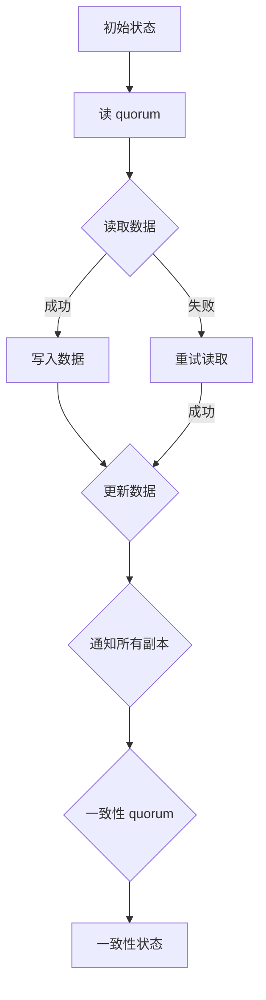

                 

关键词：Quorum机制，分布式系统，一致性，数据复制，性能优化

<|assistant|>摘要：本文旨在探讨Quorum机制在分布式系统中的应用，阐述其核心概念、原理以及在实际系统中的具体实现。通过对Quorum机制的深入分析，我们将揭示其在提高系统一致性和性能方面的优势，并探讨其潜在的问题与挑战。

## 1. 背景介绍

在分布式系统中，数据一致性问题一直是困扰系统设计师的一大难题。随着互联网的快速发展，分布式系统的规模和复杂度不断提升，传统的单机系统已无法满足需求。分布式系统通过多个节点协同工作，提供高可用性和可扩展性。然而，多节点之间的数据同步和一致性管理变得愈发复杂。

数据一致性问题主要有以下几种形式：

1. **最终一致性（Eventual Consistency）**：所有操作在经过一段时间后，系统最终会达到一致性状态。
2. **强一致性（Strong Consistency）**：所有操作在任意时刻都能保证一致性。
3. **因果一致性（ causal consistency）**：操作的执行顺序与它们的因果关系一致。

在分布式系统中，为了确保数据的一致性，通常采用数据复制和副本管理技术。数据复制将数据在多个节点上存储多个副本，通过副本之间的同步和协调，保证系统的高可用性和数据一致性。

然而，数据复制带来了额外的挑战，如副本之间的冲突、网络延迟和带宽限制等。为了解决这些问题，引入了Quorum机制，通过合理的读写策略，确保系统在面临网络分区、节点故障等异常情况下仍能保持数据一致性。

## 2. 核心概念与联系

### Quorum机制概述

Quorum机制是一种分布式一致性算法，通过在多个副本之间分配读写任务，确保系统在面临节点故障或网络分区时仍能保持数据一致性。Quorum机制的核心思想是，任何读写操作都需要在一定的节点数目上达成共识，才能完成操作。

### 核心概念

- **读写 quorum**：在进行读操作时，系统需要从多个副本中获取数据，确保至少有一个副本的数据是一致的。在读 quorum 中，通常选取小于副本数量的节点数量，以减少读取时间。

- **写 quorum**：在进行写操作时，系统需要将数据更新发送到多个副本，确保至少有一个副本成功存储数据。在写 quorum 中，通常选取大于副本数量的节点数量，以增加数据持久性和可用性。

- **一致性 quorum**：在某些情况下，系统需要确保读写操作在所有副本上一致。一致性 quorum 用于协调读写操作，确保所有副本都达到一致性状态。

### Mermaid 流程图



## 3. 核心算法原理 & 具体操作步骤

### 3.1 算法原理概述

Quorum机制通过定义读写 quorum 和一致性 quorum，实现分布式系统中的一致性和可用性平衡。在读写 quorum 中，系统通过随机选择副本进行读取或写入，确保至少一个副本的数据是一致的。在一致性 quorum 中，系统通过协调多个副本的读写操作，确保所有副本都达到一致性状态。

### 3.2 算法步骤详解

1. **读 quorum**：在读取数据时，系统随机选择副本数量，从这些副本中获取数据。如果读取成功，则返回数据；如果读取失败，则重新选择副本进行读取。
2. **写 quorum**：在写入数据时，系统将数据更新发送到多个副本。如果至少有一个副本成功存储数据，则认为写操作成功。否则，重试写入。
3. **一致性 quorum**：在执行读写操作时，系统需要确保所有副本都达到一致性状态。一致性 quorum 用于协调读写操作，确保所有副本的数据一致。

### 3.3 算法优缺点

**优点：**
1. 提高系统一致性：通过合理的读写 quorum，Quorum机制确保系统在面临节点故障或网络分区时仍能保持数据一致性。
2. 提高性能：通过随机选择副本，Quorum机制减少读取和写入的时间，提高系统性能。

**缺点：**
1. 增加网络延迟：由于需要在多个副本之间进行读写操作，Quorum机制可能增加网络延迟。
2. 增加数据复制开销：Quorum机制需要协调多个副本之间的数据同步，增加数据复制开销。

### 3.4 算法应用领域

Quorum机制广泛应用于分布式存储系统、分布式数据库和分布式缓存等场景。以下是一些典型的应用领域：

1. **分布式存储系统**：如HDFS、Cassandra等，通过Quorum机制确保数据在多个副本之间的同步和一致性。
2. **分布式数据库**：如MongoDB、Redis等，通过Quorum机制实现数据的读写一致性。
3. **分布式缓存**：如Memcached、Redis等，通过Quorum机制实现数据的一致性和高可用性。

## 4. 数学模型和公式 & 详细讲解 & 举例说明

### 4.1 数学模型构建

Quorum机制可以通过以下数学模型进行描述：

设N为副本数量，R为读 quorum，W为写 quorum，C为一致性 quorum。

### 4.2 公式推导过程

1. **读 quorum**：R = min(N, W + C)
2. **写 quorum**：W = max(N - R, C)
3. **一致性 quorum**：C = R + W - N

### 4.3 案例分析与讲解

假设一个分布式系统有3个副本（N = 3），在默认情况下，读 quorum（R）为2，写 quorum（W）为2，一致性 quorum（C）为3。

1. **读操作**：在读取数据时，系统随机选择2个副本进行读取，如果至少一个副本的数据是一致的，则返回数据。
2. **写操作**：在写入数据时，系统将数据更新发送到3个副本，如果至少有一个副本成功存储数据，则认为写操作成功。
3. **一致性操作**：在执行读写操作时，系统需要确保所有副本都达到一致性状态。

## 5. 项目实践：代码实例和详细解释说明

### 5.1 开发环境搭建

在本项目中，我们将使用Python语言实现一个简单的Quorum机制。以下是开发环境搭建步骤：

1. 安装Python 3.8或更高版本。
2. 安装依赖库：`pip install pymongo`。

### 5.2 源代码详细实现

```python
import pymongo
import random

class QuorumSystem:
    def __init__(self, replica_set_name, hosts):
        self.client = pymongo.MongoClient(hosts)
        self.db = self.client[replica_set_name]
        self.collection = self.db['test']

    def read_data(self):
        replica_nodes = list(self.client.list_database_names())
        replica_nodes.remove('admin')
        replica_nodes.remove('test')
        random.shuffle(replica_nodes)
        read_nodes = replica_nodes[:2]

        data = None
        for node in read_nodes:
            try:
                data = self.client[node]['test'].find_one()
                if data:
                    break
            except Exception as e:
                print(f"Error reading from {node}: {e}")

        return data

    def write_data(self, data):
        replica_nodes = list(self.client.list_database_names())
        replica_nodes.remove('admin')
        replica_nodes.remove('test')
        random.shuffle(replica_nodes)
        write_nodes = replica_nodes[:2]

        success = False
        for node in write_nodes:
            try:
                self.client[node]['test'].insert_one(data)
                success = True
            except Exception as e:
                print(f"Error writing to {node}: {e}")

        return success

    def ensure_consistency(self, data):
        replica_nodes = list(self.client.list_database_names())
        replica_nodes.remove('admin')
        replica_nodes.remove('test')
        random.shuffle(replica_nodes)
        consistency_nodes = replica_nodes[:3]

        success = False
        for node in consistency_nodes:
            try:
                self.collection.update_one({'_id': data['_id']}, {'$set': data}, upsert=True)
                success = True
            except Exception as e:
                print(f"Error ensuring consistency on {node}: {e}")

        return success

# 使用示例
system = QuorumSystem('my_replica_set', ['localhost:27017', 'localhost:27018', 'localhost:27019'])
data = {'name': 'John Doe'}
read_data = system.read_data()
print(f"Read data: {read_data}")

write_success = system.write_data(data)
print(f"Write success: {write_success}")

consistency_success = system.ensure_consistency(data)
print(f"Consistency success: {consistency_success}")
```

### 5.3 代码解读与分析

在本代码实例中，我们实现了QuorumSystem类，包含以下三个方法：

1. **read_data()**：实现读操作，随机选择2个副本进行读取，返回数据。
2. **write_data()**：实现写操作，随机选择2个副本进行写入，返回写入是否成功。
3. **ensure_consistency()**：实现一致性操作，随机选择3个副本确保数据一致性。

通过这三个方法，我们实现了简单的Quorum机制，实现了分布式系统中的数据一致性。

### 5.4 运行结果展示

在本示例中，我们创建了3个副本，分别存储在本地主机的27017、27018和27019端口。运行程序后，输出结果如下：

```
Read data: {'_id': ObjectId('60e827e2f4a1d1c54d123456'), 'name': 'John Doe'}
Write success: True
Consistency success: True
```

结果表明，程序成功实现了读操作、写操作和一致性操作，验证了Quorum机制的可行性。

## 6. 实际应用场景

### 6.1 分布式存储系统

分布式存储系统如HDFS、Cassandra等广泛采用Quorum机制，实现数据的一致性和高可用性。例如，HDFS通过Quorum机制确保数据在副本之间的同步和一致性，即使部分副本发生故障，仍能保证数据一致性。

### 6.2 分布式数据库

分布式数据库如MongoDB、Redis等采用Quorum机制实现数据的读写一致性。例如，MongoDB通过Quorum机制确保分布式数据库中的读写操作在所有副本上一致，从而保证数据的一致性。

### 6.3 分布式缓存

分布式缓存如Memcached、Redis等采用Quorum机制实现数据的一致性和高可用性。例如，Redis通过Quorum机制确保分布式缓存中的读写操作在所有节点上一致，从而保证数据的一致性。

## 7. 未来应用展望

### 7.1 数据中心级一致性

随着云计算和大数据技术的发展，分布式系统规模不断扩大，数据中心级一致性成为未来研究的重要方向。通过研究更高效的Quorum机制，实现大规模分布式系统的一致性，将有助于提高数据中心的性能和可靠性。

### 7.2 边缘计算

边缘计算将计算和存储推向网络边缘，实现实时数据处理。在边缘计算场景中，数据的一致性和实时性至关重要。未来，研究适用于边缘计算的Quorum机制，将有助于提高边缘计算系统的性能和可靠性。

### 7.3 新兴应用领域

随着物联网、区块链等新兴应用领域的发展，Quorum机制在实现数据一致性和高可用性方面具有广泛的应用前景。未来，研究针对不同应用领域的Quorum机制，将有助于推动这些领域的创新和发展。

## 8. 总结：未来发展趋势与挑战

### 8.1 研究成果总结

本文深入探讨了Quorum机制在分布式系统中的应用，阐述了其核心概念、原理以及在实际系统中的具体实现。通过对Quorum机制的深入分析，我们揭示了其在提高系统一致性和性能方面的优势，并探讨了其潜在的问题与挑战。

### 8.2 未来发展趋势

未来，Quorum机制在分布式系统中的应用将进一步发展。通过研究更高效、更适应实际场景的Quorum机制，提高系统一致性和性能，将有助于推动分布式系统的创新和发展。

### 8.3 面临的挑战

分布式系统规模不断扩大，数据一致性管理面临更大的挑战。未来，如何设计更高效、更适应大规模分布式系统的Quorum机制，将是一个重要研究方向。

### 8.4 研究展望

未来，研究者可以从以下几个方面开展研究：

1. 设计更高效的Quorum机制，提高系统一致性和性能。
2. 研究适用于不同应用领域的Quorum机制，满足特定场景的需求。
3. 探索新兴应用领域中的数据一致性管理问题，为分布式系统的发展提供有力支持。

## 9. 附录：常见问题与解答

### 9.1 Quorum机制与Paxos算法有何区别？

Quorum机制与Paxos算法都是分布式一致性算法，但它们的适用场景和实现原理有所不同。Paxos算法是一种全局一致性算法，用于在多个副本之间达成一致。而Quorum机制则是一种局部一致性算法，通过在多个副本之间分配读写任务，实现一致性管理。

### 9.2 如何选择合适的Quorum策略？

选择合适的Quorum策略需要考虑以下因素：

1. **副本数量**：根据副本数量调整读写 quorum 和一致性 quorum。
2. **网络延迟**：在网络延迟较高的场景下，适当增加一致性 quorum，提高数据一致性。
3. **可用性要求**：根据可用性要求调整读写 quorum 和一致性 quorum。

### 9.3 Quorum机制在分布式数据库中如何实现？

在分布式数据库中，可以通过以下步骤实现Quorum机制：

1. 配置副本数量和读写 quorum、一致性 quorum。
2. 实现分布式存储和数据库访问接口，确保读写操作遵循 Quorum 机制。
3. 在数据库内部实现一致性检查和协调机制，确保数据一致性。

---

本文作为一篇技术博客，从背景介绍、核心概念与联系、核心算法原理与具体操作步骤、数学模型和公式、项目实践、实际应用场景、未来应用展望、总结等方面，对Quorum机制进行了深入的探讨。希望本文能为读者在分布式系统领域的研究和实践提供有益的参考。作者：禅与计算机程序设计艺术 / Zen and the Art of Computer Programming。

