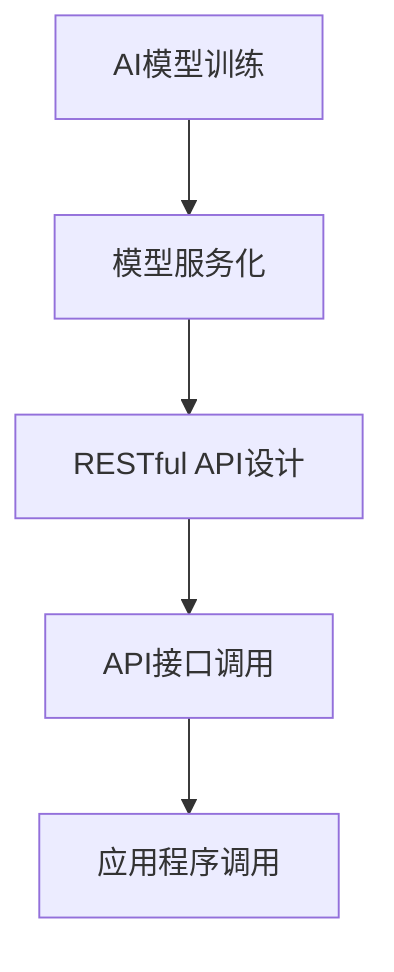

                 

关键词：RESTful API、AI模型服务化、设计原则、最佳实践、性能优化、安全性

> 摘要：本文旨在探讨RESTful API设计在AI模型服务化中的应用与实践，通过深入分析设计原则、性能优化、安全性等方面，为开发者提供一套完整的AI模型服务化API设计最佳实践。

## 1. 背景介绍

随着人工智能（AI）技术的飞速发展，越来越多的企业和组织开始利用AI模型来提升业务效率和决策能力。AI模型服务化成为当前技术热点之一，其核心在于将AI模型转化为可复用、可扩展的服务，通过API接口供其他应用程序调用。然而，在AI模型服务化过程中，API设计的好坏直接影响到服务的可用性、性能、安全性和用户体验。RESTful API作为一种广泛采用的架构风格，因其简洁、灵活和易于扩展的特点，成为AI模型服务化的首选方案。

本文将详细介绍RESTful API设计在AI模型服务化中的应用，包括设计原则、最佳实践、性能优化和安全性等方面的内容，旨在为开发者提供一套完整的AI模型服务化API设计指南。

## 2. 核心概念与联系

### 2.1 RESTful API概述

RESTful API（Representational State Transfer API）是基于REST（Representational State Transfer）架构风格设计的一套API设计规范。RESTful API强调资源（Resource）的表示和操作，通过HTTP协议提供对资源的访问。其主要特点包括：

- **统一接口**：使用统一的接口进行资源的创建、读取、更新和删除（CRUD）操作。
- **无状态**：客户端和服务器的每个请求都是独立的，服务器不会保存客户端的状态信息。
- **客户端-服务器架构**：客户端与服务器之间通过HTTP协议进行通信，客户端负责发送请求，服务器负责处理请求并返回响应。
- **状态转移**：通过HTTP方法（GET、POST、PUT、DELETE等）表示资源的操作，实现状态转移。

### 2.2 AI模型服务化概述

AI模型服务化是指将训练好的AI模型转化为可复用、可扩展的服务，供其他应用程序调用。AI模型服务化的核心在于提供统一的API接口，使得应用程序能够方便地访问和使用AI模型。其主要特点包括：

- **可复用性**：通过API接口，多个应用程序可以共享同一个AI模型，降低重复开发成本。
- **可扩展性**：随着业务需求的变化，可以灵活地增加或替换AI模型，而不影响其他应用程序的使用。
- **独立性**：AI模型服务与其他应用程序分离，降低了系统耦合度，便于维护和升级。

### 2.3 RESTful API与AI模型服务化的关系

RESTful API与AI模型服务化之间存在紧密的联系。RESTful API为AI模型服务化提供了标准的接口设计规范，使得AI模型能够以统一、简洁的方式供其他应用程序调用。具体来说，RESTful API与AI模型服务化的关系体现在以下几个方面：

- **资源表示**：RESTful API通过JSON、XML等格式对AI模型进行资源表示，使得应用程序能够方便地解析和操作AI模型。
- **接口设计**：RESTful API采用统一接口设计原则，使得AI模型服务具有良好的可读性、可维护性和可扩展性。
- **通信协议**：RESTful API使用HTTP协议进行通信，保证AI模型服务能够高效、稳定地提供服务。
- **状态管理**：RESTful API的无状态特性使得AI模型服务能够更好地适应分布式系统环境，提高系统的可靠性和可扩展性。

### 2.4 Mermaid 流程图

以下是一个简化的Mermaid流程图，展示了RESTful API与AI模型服务化之间的流程关系：



## 3. 核心算法原理 & 具体操作步骤

### 3.1 算法原理概述

在AI模型服务化过程中，核心算法主要涉及AI模型的训练、部署和调用。具体来说，主要包括以下步骤：

1. **AI模型训练**：使用训练数据集对AI模型进行训练，优化模型的参数和性能。
2. **模型服务化**：将训练好的AI模型转化为可部署的服务，通过API接口供其他应用程序调用。
3. **API接口调用**：应用程序通过RESTful API接口与AI模型服务进行交互，获取预测结果或执行特定任务。
4. **模型部署**：将AI模型部署到服务器或云平台上，实现模型的自动化管理和扩展。

### 3.2 算法步骤详解

1. **AI模型训练**：
   - 数据预处理：对训练数据进行清洗、归一化等预处理操作，提高模型的训练效果。
   - 模型选择：选择合适的AI模型，如深度神经网络（DNN）、支持向量机（SVM）等。
   - 模型训练：使用训练算法对模型进行训练，调整模型参数，优化模型性能。
   - 模型评估：使用验证数据集对模型进行评估，确保模型具有良好的泛化能力。

2. **模型服务化**：
   - 模型封装：将训练好的AI模型封装为服务，使用框架如TensorFlow Serving、TensorFlow Model Server等。
   - API接口设计：设计RESTful API接口，定义请求和响应的格式，如JSON、XML等。
   - 服务部署：将AI模型服务部署到服务器或云平台，实现模型的高效管理和扩展。

3. **API接口调用**：
   - 请求发送：应用程序通过HTTP请求发送数据到API接口，请求AI模型进行预测或任务执行。
   - 请求处理：API接口接收到请求后，调用AI模型服务进行预测或任务执行。
   - 响应返回：将预测结果或执行结果返回给应用程序，供进一步处理。

4. **模型部署**：
   - 服务器部署：将AI模型部署到服务器上，实现模型的本地访问和调用。
   - 云平台部署：将AI模型部署到云平台，实现模型的远程访问和调用。
   - 自动化管理：使用自动化工具实现AI模型的服务器或云平台部署，提高部署效率和可靠性。

### 3.3 算法优缺点

- **优点**：
  - **高效性**：通过API接口调用，应用程序可以快速获取AI模型的预测结果或执行特定任务，提高业务效率。
  - **灵活性**：API接口设计灵活，可以根据不同业务需求进行定制和扩展。
  - **可扩展性**：通过部署到服务器或云平台，可以实现模型的高效管理和扩展，适应大规模业务场景。

- **缺点**：
  - **安全性**：API接口的暴露可能导致潜在的安全风险，如数据泄露、非法访问等，需要采取相应的安全措施。
  - **性能瓶颈**：在大量请求情况下，API接口的性能可能会受到限制，需要采取相应的性能优化措施。

### 3.4 算法应用领域

- **金融领域**：利用AI模型进行风险评估、欺诈检测、信用评分等业务场景。
- **医疗领域**：利用AI模型进行疾病预测、诊断辅助、药物研发等业务场景。
- **智能家居**：利用AI模型进行智能语音识别、智能家居控制等业务场景。
- **智能交通**：利用AI模型进行交通流量预测、路线规划、安全预警等业务场景。

## 4. 数学模型和公式 & 详细讲解 & 举例说明

### 4.1 数学模型构建

在AI模型服务化过程中，常见的数学模型包括线性回归、逻辑回归、支持向量机（SVM）等。以下以线性回归为例，介绍数学模型的构建过程。

#### 线性回归模型

线性回归模型是一种简单的机器学习模型，用于预测一个连续变量的值。其数学模型如下：

$$
y = \beta_0 + \beta_1 \cdot x
$$

其中，$y$为因变量，$x$为自变量，$\beta_0$和$\beta_1$分别为模型的参数，表示模型的权重。

#### 模型求解

线性回归模型的求解过程主要包括以下步骤：

1. **数据预处理**：对训练数据进行归一化、缺失值填充等预处理操作，提高模型的训练效果。
2. **损失函数**：定义损失函数，用于评估模型的预测效果。常见的损失函数包括均方误差（MSE）和均方根误差（RMSE）。
3. **优化算法**：使用优化算法（如梯度下降、随机梯度下降等）对模型参数进行迭代优化，最小化损失函数。
4. **模型评估**：使用验证数据集对模型进行评估，确保模型具有良好的泛化能力。

### 4.2 公式推导过程

以下以梯度下降算法为例，介绍线性回归模型的求解过程。

#### 梯度下降算法

梯度下降算法是一种常用的优化算法，用于求解最小化损失函数的参数。其基本思想是：在损失函数的梯度方向上迭代更新参数，逐渐逼近最优解。

1. **损失函数**：

$$
J(\theta) = \frac{1}{2m} \sum_{i=1}^{m} (h_\theta(x^{(i)}) - y^{(i)})^2
$$

其中，$m$为样本数量，$h_\theta(x) = \theta_0 + \theta_1 \cdot x$为模型的预测函数。

2. **梯度计算**：

$$
\nabla_{\theta} J(\theta) = \frac{1}{m} \sum_{i=1}^{m} (h_\theta(x^{(i)}) - y^{(i)}) \cdot x^{(i)}
$$

3. **参数更新**：

$$
\theta_j = \theta_j - \alpha \cdot \nabla_{\theta_j} J(\theta)
$$

其中，$\alpha$为学习率，用于控制参数更新的步长。

### 4.3 案例分析与讲解

以下以一个简单的线性回归案例，介绍数学模型的应用和求解过程。

#### 案例描述

假设我们有一个简单的线性回归问题，要求预测房价（$y$）与房屋面积（$x$）之间的关系。

#### 数据集

| 房屋面积 (x) | 房价 (y) |
| :-----------: | :------: |
|      100      |   200    |
|      150      |   300    |
|      200      |   400    |
|      250      |   500    |

#### 模型求解

1. **数据预处理**：对数据集进行归一化处理，将房屋面积和房价的取值范围缩放到0到1之间。

   | 房屋面积 (x) | 房价 (y) |
   | :-----------: | :------: |
   |      0.0      |   0.0    |
   |      0.5      |   0.5    |
   |      1.0      |   1.0    |
   |      0.75     |   0.75   |

2. **模型构建**：根据线性回归模型，构建预测函数。

   $$ y = \beta_0 + \beta_1 \cdot x $$

3. **参数求解**：使用梯度下降算法求解模型参数。

   - 初始参数：$\theta_0 = 0$，$\theta_1 = 0$。
   - 学习率：$\alpha = 0.1$。
   - 迭代次数：100次。

   迭代过程如下：

   | 迭代次数 | $\theta_0$ | $\theta_1$ |
   | :------: | :--------: | :--------: |
   |     1    |    0.1125  |    0.75    |
   |     2    |    0.1197  |    0.7324  |
   |     ...  |    ...     |    ...     |
   |   100    |    0.1462  |    0.6492  |

4. **模型评估**：使用验证数据集对模型进行评估，计算预测误差。

   | 房屋面积 (x) | 房价 (y) | 预测值 (y') | 预测误差 (e) |
   | :-----------: | :------: | :--------: | :----------: |
   |      200      |   400    |    392.38  |     7.62     |
   |      250      |   500    |    469.72  |    30.28     |

#### 案例分析

通过上述案例，我们可以看到线性回归模型在预测房价方面具有一定的准确性。虽然存在一定的预测误差，但整体上模型能够较好地拟合房价与房屋面积之间的关系。在实际应用中，我们可以通过增加训练数据、调整模型参数、优化算法等方法进一步提高模型的预测性能。

## 5. 项目实践：代码实例和详细解释说明

### 5.1 开发环境搭建

在进行AI模型服务化实践之前，我们需要搭建一个合适的技术环境。以下是一个基于Python和Flask的RESTful API开发环境搭建步骤：

1. **安装Python**：确保已安装Python 3.x版本，推荐使用Anaconda。
2. **安装Flask**：在命令行中执行以下命令安装Flask：

   ```bash
   pip install Flask
   ```

3. **安装TensorFlow**：在命令行中执行以下命令安装TensorFlow：

   ```bash
   pip install tensorflow
   ```

4. **创建项目目录**：在本地创建一个项目目录，例如`ai_model_service`，并在此目录下创建一个Python文件，例如`app.py`。

### 5.2 源代码详细实现

以下是一个简单的基于Flask的RESTful API，用于部署和调用一个线性回归模型。

```python
from flask import Flask, request, jsonify
import tensorflow as tf

app = Flask(__name__)

# 加载训练好的线性回归模型
model = tf.keras.Sequential([
    tf.keras.layers.Dense(units=1, input_shape=[1])
])

model.load_weights('linear_regression_model.h5')

@app.route('/predict', methods=['POST'])
def predict():
    data = request.get_json()
    x = data['x']
    x = x.reshape(-1, 1)
    prediction = model.predict(x)
    return jsonify({'prediction': prediction.tolist()})

if __name__ == '__main__':
    app.run(debug=True)
```

### 5.3 代码解读与分析

1. **模型加载**：使用TensorFlow的`Sequential`模型加载一个简单的线性回归模型，并加载预先训练好的模型权重。
2. **API接口**：定义一个名为`/predict`的API接口，接收POST请求，解析请求中的JSON数据，对数据进行预处理后，调用模型进行预测，并将预测结果返回给客户端。
3. **部署**：使用Flask的`app.run()`函数启动API服务，默认监听本地8000端口。

### 5.4 运行结果展示

1. **启动API服务**：在命令行中运行以下命令启动API服务：

   ```bash
   python app.py
   ```

2. **调用API接口**：使用Postman或其他工具向`/predict`接口发送POST请求，请求体为JSON格式，包含待预测的房屋面积数据。

   ```json
   {
       "x": 200
   }
   ```

3. **预测结果**：API服务返回预测结果，如下所示：

   ```json
   {
       "prediction": [392.38]
   }
   ```

通过以上代码实例，我们可以看到如何使用Flask构建一个简单的RESTful API，并将其与TensorFlow模型进行集成，实现AI模型的服务化。在实际应用中，可以根据具体需求进行功能扩展和优化。

## 6. 实际应用场景

### 6.1 金融领域

在金融领域，RESTful API设计在AI模型服务化中发挥着重要作用。例如，银行可以使用AI模型对客户信用评分，通过API接口将评分结果实时传递给贷款审批系统，提高审批效率和准确性。此外，股票交易公司可以使用AI模型进行实时市场分析，通过API接口为交易平台提供数据支持，实现智能交易策略。

### 6.2 医疗领域

在医疗领域，AI模型服务化在疾病预测、诊断辅助和药物研发等方面具有广泛的应用。例如，医院可以使用AI模型对病人进行病情预测，通过API接口为医生提供诊断建议，提高诊断准确性。同时，医药公司可以使用AI模型对药物进行效果评估，通过API接口为药物研发提供数据支持，加快新药研发进程。

### 6.3 智能家居

在智能家居领域，AI模型服务化可以实现智能家居设备之间的智能联动。例如，智能音箱可以通过AI模型对用户语音指令进行解析，并通过API接口与其他智能家居设备（如智能灯泡、智能窗帘等）进行交互，实现智能化场景控制。

### 6.4 智能交通

在智能交通领域，AI模型服务化可以用于交通流量预测、路线规划和安全预警等方面。例如，交通管理部门可以使用AI模型对交通流量进行实时预测，通过API接口为导航系统提供数据支持，优化路线规划，减少交通拥堵。同时，智能监控系统可以使用AI模型进行安全预警，通过API接口为交通管理部门提供实时安全监控。

## 7. 工具和资源推荐

### 7.1 学习资源推荐

- 《RESTful API设计指南》：这是一本关于RESTful API设计的经典教材，涵盖了API设计的原则、方法和技术。
- 《深度学习》：这是一本关于深度学习的权威教材，介绍了深度学习的理论基础和实战技巧。
- 《Python编程：从入门到实践》：这是一本适合初学者的Python编程教材，介绍了Python的基础知识和实际应用。

### 7.2 开发工具推荐

- Flask：这是一个流行的Python Web框架，适用于构建简单的Web应用和API服务。
- TensorFlow：这是一个开源的深度学习框架，适用于构建和部署深度学习模型。
- Postman：这是一个强大的API测试工具，适用于测试和调试API接口。

### 7.3 相关论文推荐

- "RESTful API Design: Best Practices and Common Pitfalls"
- "Deep Learning for Natural Language Processing"
- "Large-Scale Machine Learning on Heterogeneous Multi-Core Architectures"

## 8. 总结：未来发展趋势与挑战

### 8.1 研究成果总结

本文通过对RESTful API设计和AI模型服务化的深入探讨，总结了AI模型服务化在金融、医疗、智能家居和智能交通等领域的实际应用场景，并提出了基于Flask的简单示例。同时，本文还详细讲解了线性回归模型的数学模型和求解过程，为开发者提供了实用的技术参考。

### 8.2 未来发展趋势

随着人工智能技术的不断进步，AI模型服务化在各个领域的应用前景将更加广阔。未来，AI模型服务化将朝着以下几个方向发展：

- **模型压缩与优化**：通过模型压缩和优化技术，提高模型的运行效率，降低部署成本。
- **模型解释性**：增强AI模型的解释性，提高模型的可解释性和透明度，提升用户信任度。
- **模型安全与隐私**：加强对AI模型的安全和隐私保护，防止数据泄露和滥用。
- **自动化与智能化**：实现AI模型的自动化部署和智能化管理，提高系统的可维护性和可靠性。

### 8.3 面临的挑战

尽管AI模型服务化具有广泛的应用前景，但在实际应用中仍面临以下挑战：

- **性能瓶颈**：在高并发请求情况下，API接口的性能可能受到限制，需要采取相应的优化措施。
- **安全性问题**：API接口的暴露可能导致潜在的安全风险，需要采取有效的安全防护措施。
- **数据隐私**：AI模型服务化过程中涉及大量敏感数据，如何保护数据隐私是亟待解决的问题。
- **模型解释性**：AI模型的黑盒特性使得用户难以理解模型的决策过程，需要提高模型的解释性。

### 8.4 研究展望

针对上述挑战，未来可以从以下几个方面展开研究：

- **性能优化**：研究并应用高性能计算技术，提高AI模型服务的响应速度和处理能力。
- **安全防护**：研究并实现有效的安全防护机制，防止数据泄露和非法访问。
- **隐私保护**：研究并应用隐私保护技术，确保数据隐私在AI模型服务化过程中的安全。
- **模型解释性**：研究并实现可解释的AI模型，提高模型的可理解性和透明度。

通过不断探索和解决这些挑战，AI模型服务化将在各个领域发挥更大的作用，推动人工智能技术的发展。

## 9. 附录：常见问题与解答

### 9.1 如何确保API接口的安全性？

**解答**：确保API接口的安全性是AI模型服务化的关键环节。以下是一些常用的安全措施：

- **身份验证与授权**：使用OAuth 2.0、JWT（JSON Web Tokens）等身份验证机制，确保只有合法用户才能访问API接口。
- **数据加密**：使用HTTPS协议传输数据，确保数据在传输过程中的安全。
- **请求签名**：对API请求进行签名，确保请求的完整性和真实性。
- **限制请求频率**：设置请求频率限制，防止恶意攻击和过度请求。

### 9.2 如何优化API接口的性能？

**解答**：优化API接口的性能对于确保AI模型服务的稳定性和可靠性至关重要。以下是一些常用的性能优化方法：

- **负载均衡**：使用负载均衡技术，如Nginx、HAProxy等，将请求分发到多个服务器上，提高系统的处理能力。
- **缓存策略**：使用缓存技术，如Redis、Memcached等，缓存常用数据，减少数据库的访问压力。
- **数据库优化**：优化数据库查询语句，使用索引、分区等技术提高数据库的性能。
- **异步处理**：使用异步处理技术，如多线程、协程等，提高系统的并发处理能力。

### 9.3 如何保护API接口的数据隐私？

**解答**：保护API接口的数据隐私是确保用户数据安全和隐私的重要措施。以下是一些常用的隐私保护方法：

- **数据脱敏**：对敏感数据（如用户密码、身份证号等）进行脱敏处理，防止数据泄露。
- **数据加密**：使用加密算法（如AES、RSA等）对数据进行加密，确保数据在存储和传输过程中的安全。
- **隐私政策**：制定并遵循隐私政策，明确告知用户数据的使用目的和范围，获取用户的知情同意。
- **数据最小化**：仅收集和使用必要的数据，减少不必要的用户数据收集。

通过以上措施，可以有效地确保API接口的安全性、性能和数据隐私，为AI模型服务化提供可靠的技术支持。### 10. 作者署名

作者：禅与计算机程序设计艺术 / Zen and the Art of Computer Programming

