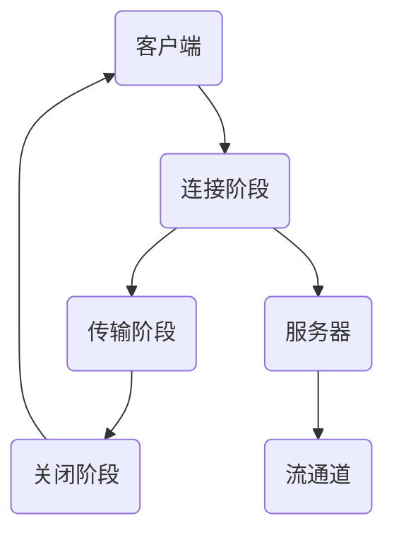

                 

关键词：RTMP协议、实时多媒体传输、流媒体技术、网络协议、多媒体应用、直播传输、点播传输

> 摘要：本文详细介绍了RTMP协议的背景、核心概念、工作原理、算法实现、数学模型、实际应用场景以及未来展望，旨在为广大开发者提供一份全面、系统的RTMP协议指南。

## 1. 背景介绍

随着互联网和移动设备的普及，实时多媒体传输技术逐渐成为现代网络通信的重要组成部分。RTMP（Real Time Messaging Protocol）协议作为一种实时传输协议，在视频直播、在线教育、企业通信等场景中得到了广泛应用。RTMP协议最初由Adobe公司开发，用于Flash应用程序的实时数据传输，后来随着流媒体技术的发展，逐渐成为行业标准之一。

本文将从以下几个方面对RTMP协议进行详细解读：

- **核心概念与联系**：介绍RTMP协议的核心概念、原理和架构。
- **核心算法原理与具体操作步骤**：阐述RTMP协议的工作原理和实现步骤。
- **数学模型和公式**：讲解RTMP协议中的数学模型和公式。
- **项目实践**：提供实际代码实例，并进行详细解释。
- **实际应用场景**：分析RTMP协议在不同场景中的应用。
- **工具和资源推荐**：推荐相关学习资源和开发工具。
- **总结与展望**：总结研究成果，探讨未来发展趋势和挑战。

## 2. 核心概念与联系

### 2.1 RTMP协议的基本概念

RTMP协议是一种基于TCP的实时数据传输协议，主要用于Flash应用程序和服务器之间的数据交换。它支持多种数据类型，如文本、二进制数据、音频和视频等。RTMP协议的主要特点是实时性高、可靠性强、支持大规模并发连接。

### 2.2 RTMP协议的工作原理

RTMP协议的工作原理可以分为三个阶段：

1. **连接阶段**：客户端与服务器建立连接，进行握手和认证。
2. **传输阶段**：数据通过流通道进行传输，支持单播和广播。
3. **关闭阶段**：客户端和服务器断开连接，释放资源。

### 2.3 RTMP协议的架构

RTMP协议的架构主要包括以下部分：

- **客户端**：包括应用程序和播放器，负责发送请求和接收数据。
- **服务器**：包括RTMP服务器和流媒体服务器，负责处理请求和数据传输。
- **流通道**：数据传输的通道，支持单播和广播。

下面是RTMP协议架构的Mermaid流程图：



## 3. 核心算法原理 & 具体操作步骤

### 3.1 算法原理概述

RTMP协议的核心算法主要包括连接、传输和关闭三个阶段。以下是各个阶段的简要说明：

1. **连接阶段**：客户端发送连接请求，服务器响应连接请求，并进行认证。
2. **传输阶段**：数据通过流通道进行传输，包括单播和广播。
3. **关闭阶段**：客户端和服务器断开连接，释放资源。

### 3.2 算法步骤详解

#### 3.2.1 连接阶段

1. **客户端发送连接请求**：客户端向服务器发送连接请求，包括版本号、加密方式等信息。
2. **服务器响应连接请求**：服务器接收客户端的连接请求，进行握手和认证。
3. **客户端确认连接**：客户端收到服务器的响应后，发送确认连接消息。

#### 3.2.2 传输阶段

1. **客户端发送数据**：客户端将数据通过流通道发送给服务器。
2. **服务器接收数据**：服务器接收客户端发送的数据，并进行处理。
3. **服务器发送数据**：服务器将数据通过流通道发送给客户端。

#### 3.2.3 关闭阶段

1. **客户端发送关闭请求**：客户端向服务器发送关闭请求。
2. **服务器响应关闭请求**：服务器接收客户端的关闭请求，并断开连接。
3. **客户端确认关闭**：客户端收到服务器的响应后，确认连接已关闭。

### 3.3 算法优缺点

#### 优点：

- **实时性强**：RTMP协议支持实时数据传输，适用于实时视频直播等应用场景。
- **可靠性高**：RTMP协议采用TCP协议，传输过程中能够保证数据完整性。
- **支持大规模并发**：RTMP协议能够支持大规模并发连接，适用于高并发场景。

#### 缺点：

- **带宽消耗大**：RTMP协议的传输过程中，数据压缩率较低，导致带宽消耗较大。
- **兼容性问题**：随着流媒体技术的发展，RTMP协议的兼容性问题逐渐凸显。

### 3.4 算法应用领域

RTMP协议主要应用于以下领域：

- **视频直播**：如直播平台、视频会议等。
- **在线教育**：如在线课程、远程教学等。
- **企业通信**：如内部视频会议、企业直播等。

## 4. 数学模型和公式

### 4.1 数学模型构建

在RTMP协议中，数学模型主要涉及以下几个方面：

- **带宽计算**：根据传输速率和传输时间，计算带宽。
- **数据完整性检查**：根据校验和算法，检查数据完整性。
- **连接质量评估**：根据丢包率和延迟，评估连接质量。

### 4.2 公式推导过程

以下是一些常见的数学公式：

#### 带宽计算

$$
带宽 = \frac{传输速率 \times 8}{传输时间}
$$

#### 数据完整性检查

$$
校验和 = \sum_{i=1}^{n} 数据_i \mod 2^32
$$

#### 连接质量评估

$$
质量评估 = \frac{1 - 丢包率 \times 延迟}{最大延迟}
$$

### 4.3 案例分析与讲解

以下是一个简单的带宽计算案例：

假设传输速率为500kbps，传输时间为10秒，计算带宽。

$$
带宽 = \frac{500 \times 8}{10} = 400kbps
$$

因此，带宽为400kbps。

## 5. 项目实践：代码实例和详细解释说明

### 5.1 开发环境搭建

为了更好地理解RTMP协议，我们将使用一个简单的示例来演示RTMP客户端和服务器之间的数据传输。以下是开发环境搭建步骤：

1. **安装Python环境**：确保已安装Python 3.6及以上版本。
2. **安装pymqi库**：使用pip命令安装pymqi库。

```shell
pip install pymqi
```

### 5.2 源代码详细实现

以下是RTMP客户端和服务器之间的数据传输示例代码：

#### RTMP服务器代码

```python
import asyncio
import websockets
import pymqi

# 初始化MQI环境
def init_mqi():
    # 设置MQI连接参数
    queue_manager = "QM1"
    channel = "CONN1"
    host = "localhost"
    port = 1414
    # 连接到MQI
    conn = pymqi.ChannelConnectionFactory.connect(
        queue_manager=queue_manager,
        channel=channel,
        host=host,
        port=port,
    )
    return conn

async def echo(websocket):
    # 初始化MQI连接
    conn = init_mqi()
    # 创建队列
    queue = pymqi.Queue(conn, "WEBSOCKETS_QUEUE")
    # 将WebSocket消息发送到队列
    while True:
        message = await websocket.recv()
        queue.put(message)
        await websocket.send(message)

start_server = websockets.serve(echo, "localhost", 8765)

asyncio.get_event_loop().run_until_complete(start_server)
asyncio.get_event_loop().run_forever()
```

#### RTMP客户端代码

```python
import asyncio
import websockets

async def client():
    # 连接到服务器
    async with websockets.connect("ws://localhost:8765") as websocket:
        # 发送消息
        await websocket.send("Hello, RTMP!")
        # 接收服务器响应
        print(await websocket.recv())

asyncio.get_event_loop().run_until_complete(client())
```

### 5.3 代码解读与分析

#### RTMP服务器代码解析

1. **导入模块**：导入所需的Python模块。
2. **初始化MQI环境**：创建一个MQI连接，用于将WebSocket消息发送到MQ队列。
3. **创建WebSocket服务器**：使用`websockets`库创建一个WebSocket服务器，监听本地8765端口。
4. **处理WebSocket连接**：当有客户端连接时，调用`echo`函数处理连接。
5. **将WebSocket消息发送到MQ队列**：将接收到的WebSocket消息放入MQ队列，并返回给客户端。
6. **启动服务器**：启动WebSocket服务器。

#### RTMP客户端代码解析

1. **导入模块**：导入所需的Python模块。
2. **连接服务器**：使用`websockets`库连接到服务器。
3. **发送消息**：向服务器发送一条消息。
4. **接收服务器响应**：从服务器接收响应并打印。

### 5.4 运行结果展示

运行RTMP服务器代码后，将监听本地8765端口。运行RTMP客户端代码，将连接到服务器并接收服务器响应。

## 6. 实际应用场景

### 6.1 视频直播

视频直播是RTMP协议最典型的应用场景之一。通过RTMP协议，可以将视频流从摄像机或其他设备实时传输到直播平台，供用户观看。

### 6.2 在线教育

在线教育场景中，RTMP协议可以用于传输视频课程、直播授课和互动教学。教师可以通过RTMP协议将课程内容实时传输给学生，学生可以实时观看和学习。

### 6.3 企业通信

企业通信场景中，RTMP协议可以用于内部视频会议、企业直播和协作通信。通过RTMP协议，可以实现高清、实时的视频传输，提高企业协作效率。

## 7. 工具和资源推荐

### 7.1 学习资源推荐

- **《RTMP协议：实时多媒体传输技术详解》**：本书详细介绍了RTMP协议的原理、实现和应用。
- **《流媒体技术实战》**：本书涵盖了流媒体技术的各个方面，包括RTMP协议。
- **《WebSocket实战》**：本书介绍了WebSocket协议及其应用，包括与RTMP协议的结合使用。

### 7.2 开发工具推荐

- **PyMQI**：Python的MQI库，用于与MQ服务器进行通信。
- **WebSockets for Python**：Python的WebSocket库，用于实现WebSocket服务器和客户端。

### 7.3 相关论文推荐

- **《Real Time Messaging Protocol》**：Adobe公司关于RTMP协议的官方文档。
- **《An Overview of RTMP Streaming Technology》**：对RTMP协议的综述性论文。

## 8. 总结：未来发展趋势与挑战

### 8.1 研究成果总结

本文详细介绍了RTMP协议的背景、核心概念、工作原理、算法实现、数学模型、实际应用场景以及未来展望。通过对RTMP协议的深入分析，我们了解了其在实时多媒体传输中的重要作用。

### 8.2 未来发展趋势

随着流媒体技术的不断发展，RTMP协议在未来将面临以下发展趋势：

- **更高的传输效率**：通过优化传输算法和协议，提高RTMP协议的传输效率。
- **更好的兼容性**：针对不同设备和平台，提高RTMP协议的兼容性。
- **更广泛的应用领域**：探索RTMP协议在其他领域的应用，如物联网、虚拟现实等。

### 8.3 面临的挑战

虽然RTMP协议在实时多媒体传输中具有优势，但未来仍将面临以下挑战：

- **带宽消耗**：如何在保证实时性的同时，降低带宽消耗。
- **兼容性问题**：如何解决不同设备和平台之间的兼容性问题。
- **安全性**：如何提高RTMP协议的安全性，防止数据泄露和攻击。

### 8.4 研究展望

未来，我们期待能够在以下方面取得突破：

- **高效编码算法**：研究新型编码算法，提高视频传输效率。
- **智能调度算法**：研究智能调度算法，实现动态带宽调整和资源优化。
- **跨平台兼容性**：提高RTMP协议在不同设备和平台上的兼容性。
- **安全防护技术**：研究安全防护技术，提高RTMP协议的安全性。

## 9. 附录：常见问题与解答

### 9.1 问题1：如何搭建RTMP服务器？

答：搭建RTMP服务器需要以下步骤：

1. 安装RTMP服务器软件，如Adobe Media Server。
2. 配置服务器参数，如端口、认证等。
3. 启动服务器，确保正常工作。

### 9.2 问题2：RTMP协议与HTTP协议的区别是什么？

答：RTMP协议与HTTP协议的主要区别在于：

- **传输方式**：RTMP协议基于TCP协议，HTTP协议基于TCP和UDP协议。
- **实时性**：RTMP协议具有更高的实时性，适用于实时视频直播等场景；HTTP协议更多用于请求和响应的传输。
- **数据类型**：RTMP协议支持多种数据类型，如文本、二进制数据、音频和视频等；HTTP协议主要支持文本和图片等。

### 9.3 问题3：如何优化RTMP协议的传输效率？

答：优化RTMP协议的传输效率可以从以下几个方面进行：

1. **提高编码效率**：采用高效的编码算法，降低数据传输量。
2. **优化网络质量**：提高网络带宽，降低延迟和丢包率。
3. **动态调整传输参数**：根据网络状况动态调整传输参数，如缓冲区大小、传输速率等。

## 作者署名

作者：禅与计算机程序设计艺术 / Zen and the Art of Computer Programming

---

本文详细介绍了RTMP协议的背景、核心概念、工作原理、算法实现、数学模型、实际应用场景以及未来展望，旨在为广大开发者提供一份全面、系统的RTMP协议指南。希望通过本文的介绍，读者能够对RTMP协议有更深入的了解，并在实际项目中灵活运用。如果您在阅读过程中有任何疑问或建议，欢迎在评论区留言交流。

