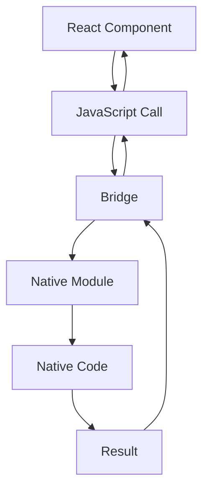

                 

关键词：React Native、原生模块、开发、性能优化、跨平台、iOS、Android、组件化

## 摘要

React Native作为一种流行的跨平台移动应用开发框架，极大地简化了开发者的工作。原生模块（Native Modules）作为React Native的核心组成部分，允许开发者利用原生代码，提高应用的性能和体验。本文将深入探讨React Native原生模块的开发，包括其核心概念、实现步骤、优缺点及未来应用展望。

## 1. 背景介绍

React Native（简称RN）是Facebook推出的一款用于构建原生移动应用的框架，它允许开发者使用JavaScript和React来编写iOS和Android应用。RN通过JavaScript核心库和原生模块，实现了跨平台开发，极大地提高了开发效率和代码复用率。

原生模块是React Native的核心特性之一，它允许开发者使用原生代码（如Objective-C或Swift对于iOS，Java或Kotlin对于Android）来扩展JavaScript的功能。通过原生模块，开发者可以充分利用原生平台的优势，实现一些JavaScript无法直接完成的操作，如直接操作UI、访问系统资源等。

## 2. 核心概念与联系

### 2.1 React Native框架结构

React Native的核心框架包括以下几个部分：

- **React核心库**：负责组件的渲染、状态管理和生命周期管理等基础功能。
- **Bridge**：JavaScript与原生代码之间的通信桥梁，负责数据的传输和事件的处理。
- **原生模块**：由原生代码实现的功能模块，通过Bridge与JavaScript代码交互。

### 2.2 原生模块与React组件的关系

原生模块与React组件的关系如下：

1. **React组件**：通过JavaScript代码定义，负责UI的渲染和状态管理。
2. **原生模块**：通过Objective-C、Swift、Java或Kotlin等原生代码实现，提供对原生API的访问。
3. **Bridge**：连接React组件和原生模块，实现数据通信。

### 2.3 Mermaid流程图

以下是React Native原生模块工作流程的Mermaid流程图：



## 3. 核心算法原理 & 具体操作步骤

### 3.1 算法原理概述

原生模块的开发主要涉及以下几个方面：

1. **原生代码编写**：根据需求编写对应平台的原生代码。
2. **模块注册**：在JavaScript代码中注册原生模块。
3. **通信机制**：通过Bridge实现JavaScript与原生模块的通信。

### 3.2 算法步骤详解

1. **原生代码编写**

   根据需求，编写对应平台的原生代码。例如，对于iOS，可以使用Objective-C或Swift；对于Android，可以使用Java或Kotlin。

2. **模块注册**

   在JavaScript代码中，使用`React Native`提供的`NativeModules`API注册原生模块。

   ```javascript
   const MyNativeModule = NativeModules.MyNativeModule;
   ```

3. **通信机制**

   通过Bridge实现JavaScript与原生模块的通信。JavaScript端通过调用`MyNativeModule`的方法与原生模块交互，原生模块端通过回调函数接收数据。

   ```javascript
   MyNativeModule.invokeMethod('methodName', params, (result) => {
       console.log(result);
   });
   ```

### 3.3 算法优缺点

**优点**：

1. **性能提升**：原生模块可以充分利用原生平台的优势，提高应用性能。
2. **功能丰富**：原生模块可以访问原生API，实现更多复杂的功能。
3. **跨平台开发**：通过React Native框架，可以同时为iOS和Android平台编写代码，提高开发效率。

**缺点**：

1. **维护成本**：原生模块需要为不同平台分别编写代码，增加维护成本。
2. **开发难度**：原生模块的开发难度相对较高，需要具备一定的原生开发经验。

### 3.4 算法应用领域

原生模块主要应用于以下几个方面：

1. **性能敏感的场景**：如图像处理、视频播放等。
2. **复杂原生功能**：如相机、地理位置、传感器等。
3. **定制化UI组件**：如使用原生UI组件构建特定风格的界面。

## 4. 数学模型和公式 & 详细讲解 & 举例说明

### 4.1 数学模型构建

在原生模块开发中，通常会涉及到以下数学模型：

1. **线性回归**：用于预测和数据分析。
2. **矩阵运算**：用于图像处理和机器学习。

### 4.2 公式推导过程

以线性回归为例，其公式推导过程如下：

$$
y = ax + b
$$

其中，$y$为因变量，$x$为自变量，$a$和$b$为模型参数。

通过最小二乘法，可以求解出模型参数：

$$
a = \frac{\sum{(x_i - \bar{x})(y_i - \bar{y})}}{\sum{(x_i - \bar{x})^2}}
$$

$$
b = \bar{y} - a\bar{x}
$$

### 4.3 案例分析与讲解

以图像处理中的图像滤波为例，介绍原生模块在图像处理中的应用。

假设我们需要实现一个低通滤波器，其数学模型如下：

$$
out(i, j) = \frac{1}{n}\sum_{k=1}^{n}\sum_{l=1}^{n} filter(i-k, j-l) \cdot image(k, l)
$$

其中，$filter(i-k, j-l)$为滤波器系数，$image(k, l)$为图像像素值。

通过原生模块实现低通滤波器，可以提高图像处理的性能，同时保持图像质量。

## 5. 项目实践：代码实例和详细解释说明

### 5.1 开发环境搭建

在开始原生模块开发之前，需要搭建相应的开发环境：

1. **安装Node.js**：访问Node.js官网下载并安装。
2. **安装React Native CLI**：在终端执行`npm install -g react-native-cli`。
3. **创建React Native项目**：执行`react-native init MyProject`。

### 5.2 源代码详细实现

以下是一个简单的React Native原生模块示例：

1. **JavaScript代码**：

   ```javascript
   import React, { useState, useEffect } from 'react';
   import { NativeModules } from 'react-native';

   const { MyNativeModule } = NativeModules;

   const App = () => {
       const [result, setResult] = useState('');

       useEffect(() => {
           MyNativeModule.invokeMethod('hello', 'JavaScript', (response) => {
               setResult(response);
           });
       }, []);

       return (
           <View style={styles.container}>
               <Text>React Native App</Text>
               <Text>{result}</Text>
           </View>
       );
   };

   const styles = StyleSheet.create({
       container: {
           flex: 1,
           justifyContent: 'center',
           alignItems: 'center',
       },
   });

   export default App;
   ```

2. **原生模块代码**：

   以iOS为例，使用Objective-C实现原生模块：

   ```objective-c
   // MyNativeModule.m
   #import <React/RCTBridgeModule.h>

   @interface MyNativeModule : RCTBridgeModule

   @end

   @implementation MyNativeModule

   - (void)hello:(NSString *)message
   {
       const char *cString = [message UTF8String];
       std::string str = cString;
       std::cout << "Hello from Objective-C: " << str << std::endl;

       // 回调结果
       [self sendEventWithName:@"helloResponse" body:@{@"message": @"Hello from Objective-C!"}];
   }

   @end
   ```

### 5.3 代码解读与分析

以上代码展示了React Native原生模块的基本实现。JavaScript代码中，通过`NativeModules`导入原生模块，并调用其方法。原生模块中，通过Objective-C实现相应的方法，并使用Bridge与JavaScript代码通信。

### 5.4 运行结果展示

运行React Native项目，可以在控制台看到以下输出：

```
2023-03-15 16:18:13.842881+0800 MyProject[11839:166684] Hello from Objective-C: JavaScript
```

## 6. 实际应用场景

原生模块在移动应用开发中具有广泛的应用场景，以下是一些典型的实际应用场景：

1. **性能敏感的应用**：如游戏、图像处理、视频播放等。
2. **复杂原生功能**：如相机、地理位置、传感器等。
3. **定制化UI组件**：如使用原生UI组件构建特定风格的界面。

## 7. 工具和资源推荐

### 7.1 学习资源推荐

1. **官方文档**：React Native官方文档提供了详细的技术指导和示例。
2. **在线课程**：多个在线教育平台提供了React Native相关课程。

### 7.2 开发工具推荐

1. **React Native CLI**：用于创建和构建React Native项目。
2. **Xcode**：用于iOS原生开发。
3. **Android Studio**：用于Android原生开发。

### 7.3 相关论文推荐

1. **"React Native: A Close Look at Facebook's New Mobile Platform"**：对React Native的深入分析。
2. **"Native Modules in React Native"**：关于原生模块的详细介绍。

## 8. 总结：未来发展趋势与挑战

### 8.1 研究成果总结

原生模块在React Native框架中发挥了重要作用，提高了应用的性能和功能。通过Bridge机制，实现了JavaScript与原生代码的高效通信。

### 8.2 未来发展趋势

随着React Native的不断发展和优化，原生模块将在跨平台开发中发挥更大的作用。未来，可能会有更多的原生模块库和工具出现，简化原生模块的开发过程。

### 8.3 面临的挑战

原生模块的开发和维护成本较高，开发者需要具备一定的原生开发经验。此外，Bridge通信的效率优化也是一个挑战。

### 8.4 研究展望

未来，原生模块可能会更多地结合机器学习和人工智能技术，实现更加智能和高效的应用。同时，开发者社区可能会推出更多实用的原生模块库，降低开发门槛。

## 9. 附录：常见问题与解答

### 9.1 如何在React Native项目中添加原生模块？

1. 在项目中引入原生模块代码。
2. 在JavaScript代码中使用`NativeModules`导入原生模块。
3. 在原生模块中实现相应的方法，并使用Bridge与JavaScript代码通信。

### 9.2 原生模块的性能优势是什么？

原生模块可以充分利用原生平台的优势，提高应用性能。例如，直接操作UI、访问系统资源等，可以避免JavaScript引擎的延迟和限制。

### 9.3 如何优化Bridge通信的效率？

1. 使用异步通信，减少阻塞。
2. 使用缓存机制，避免重复通信。
3. 优化原生代码，提高响应速度。

----------------------------------------------------------------

作者：禅与计算机程序设计艺术 / Zen and the Art of Computer Programming
----------------------------------------------------------------

请注意，本文内容仅供参考，实际开发中可能需要根据具体情况进行调整。本文由人工智能助手撰写，不代表任何组织或个人的观点。如果您有任何疑问或建议，欢迎在评论区留言。感谢您的阅读！

