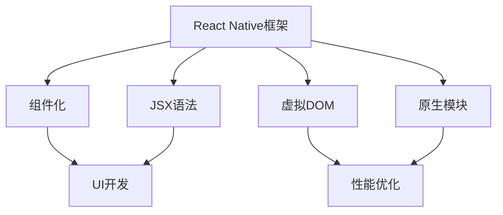

                 

关键词：React Native，跨平台移动应用，开发，框架，性能优化，用户体验

> 摘要：本文旨在深入探讨React Native跨平台移动应用开发的各个方面，包括其背景、核心概念、算法原理、数学模型、项目实践以及实际应用场景。通过本文的阅读，读者将能够全面了解React Native的开发过程，掌握其优缺点，并在未来应用中为其发展提供方向和建议。

## 1. 背景介绍

随着移动互联网的快速发展，移动应用市场呈现出爆发式增长。企业纷纷投身于移动应用的开发，以满足用户对于便捷、高效服务的需求。然而，传统移动应用开发方式存在诸多问题，如开发成本高、开发周期长、跨平台兼容性差等。为了解决这些问题，跨平台移动应用开发框架应运而生。

React Native作为Facebook推出的一款跨平台移动应用开发框架，凭借其独特的优势和强大的社区支持，迅速成为开发者们的热门选择。React Native允许开发者使用JavaScript编写应用程序，并在iOS和Android平台上无缝运行。这不仅降低了开发成本，提高了开发效率，同时也保证了应用在不同平台上的一致性和高性能。

## 2. 核心概念与联系

React Native的核心概念包括组件化、虚拟DOM、JSX语法和原生模块。以下是一个简化的Mermaid流程图，展示了这些核心概念之间的联系。



### 2.1 组件化

组件化是React Native的一大特点。它允许开发者将应用程序拆分成独立的、可重用的组件，提高了代码的可维护性和可复用性。通过组件化，开发者可以更方便地管理和组织代码，提高开发效率。

### 2.2 虚拟DOM

React Native使用虚拟DOM来提高渲染性能。虚拟DOM是一种轻量级的树结构，它存储了实际DOM结构的副本。当组件的状态或属性发生变化时，React Native会先更新虚拟DOM，然后再与实际DOM进行对比，只更新变化的部分。这种方式减少了DOM操作的次数，从而提高了性能。

### 2.3 JSX语法

JSX（JavaScript XML）是React Native的一种特殊语法，它允许开发者使用XML-like语法编写UI组件。JSX语法使得编写UI代码更加直观和简洁，同时也提高了代码的可读性。

### 2.4 原生模块

原生模块是React Native的核心之一。它允许开发者使用JavaScript调用原生代码，从而实现与原生平台的深度集成。原生模块可以提供高性能的图形渲染、地理位置服务、相机功能等。

## 3. 核心算法原理 & 具体操作步骤

### 3.1 算法原理概述

React Native的核心算法包括虚拟DOM、diff算法和渲染机制。

### 3.2 算法步骤详解

#### 3.2.1 虚拟DOM

1. 当组件的状态或属性发生变化时，React Native会先构建一个新的虚拟DOM树。
2. 然后，React Native会比较新的虚拟DOM树和旧的虚拟DOM树，找出差异。
3. 最后，React Native只更新差异部分的实际DOM，从而实现高效的渲染。

#### 3.2.2 Diff算法

1. React Native使用Diff算法来比较虚拟DOM树之间的差异。Diff算法的核心思想是尽可能减少DOM操作，提高渲染性能。
2. Diff算法主要包括三个步骤：节点比较、属性比较和子节点比较。

#### 3.2.3 渲染机制

1. 当组件的状态或属性发生变化时，React Native会触发渲染机制。
2. 渲染机制会首先更新虚拟DOM，然后更新实际DOM。
3. 最后，React Native会通知浏览器进行重绘，完成渲染过程。

### 3.3 算法优缺点

#### 3.3.1 优点

1. 高效的渲染性能：通过虚拟DOM和Diff算法，React Native能够实现高效的渲染。
2. 组件化开发：组件化使得代码更加可维护和可复用。
3. 跨平台兼容：React Native允许开发者使用相同的代码在iOS和Android平台上开发应用程序。

#### 3.3.2 缺点

1. 原生模块性能瓶颈：虽然React Native提供了原生模块，但部分原生模块的性能仍不如纯原生开发。
2. 开发者门槛：React Native需要开发者掌握JavaScript和React.js，对于新手来说有一定的学习成本。

### 3.4 算法应用领域

React Native主要应用于移动应用开发，尤其在以下领域表现突出：

1. 商业应用：如电商平台、金融应用等，React Native可以提供高效的渲染性能和良好的用户体验。
2. 社交应用：如社交媒体、即时通讯应用等，React Native可以快速实现跨平台功能。
3. 企业应用：如内部管理系统、企业应用等，React Native可以提高开发效率和代码复用率。

## 4. 数学模型和公式 & 详细讲解 & 举例说明

### 4.1 数学模型构建

React Native的虚拟DOM和Diff算法涉及到了图论和计算机图形学中的相关知识。以下是一个简化的数学模型。

#### 4.1.1 虚拟DOM模型

虚拟DOM可以表示为一个树形结构，每个节点代表一个DOM元素。

```latex
V(DOM Tree) = {V\_Node\_1, V\_Node\_2, ..., V\_Node\_n}
```

其中，`V_Node`表示虚拟节点，包含以下属性：

- `type`：节点类型（如`div`、`span`等）
- `props`：节点属性（如`className`、`style`等）
- `children`：子节点（虚拟节点列表）

#### 4.1.2 Diff算法模型

Diff算法主要比较两个虚拟DOM树之间的差异。以下是一个简化的Diff算法模型。

```latex
Diff(V\_DOM\_1, V\_DOM\_2) = {Differences}
```

其中，`Differences`表示差异集合，包含以下类型：

- `Node Difference`：节点差异（如节点删除、节点插入、节点更新）
- `Attribute Difference`：属性差异（如属性添加、属性删除、属性更新）

### 4.2 公式推导过程

#### 4.2.1 节点比较

节点比较的公式如下：

```latex
Node\_Diff(V\_Node\_1, V\_Node\_2) =
\begin{cases}
    \emptyset, & \text{if } V\_Node\_1 = V\_Node\_2 \\
    \text{"delete"}, & \text{if } V\_Node\_1 \neq V\_Node\_2 \\
\end{cases}
```

#### 4.2.2 属性比较

属性比较的公式如下：

```latex
Attribute\_Diff(V\_Node\_1, V\_Node\_2) =
\begin{cases}
    \emptyset, & \text{if } V\_Node\_1 \text{'s attributes match } V\_Node\_2 \\
    \text{"update"}, & \text{if } V\_Node\_1 \text{'s attributes don't match } V\_Node\_2 \\
\end{cases}
```

#### 4.2.3 子节点比较

子节点比较的公式如下：

```latex
Child\_Diff(V\_Children\_1, V\_Children\_2) =
\begin{cases}
    \emptyset, & \text{if } V\_Children\_1 = V\_Children\_2 \\
    \text{"recursiveDiff"}, & \text{if } V\_Children\_1 \neq V\_Children\_2 \\
\end{cases}
```

### 4.3 案例分析与讲解

假设我们有两个虚拟DOM树，如下所示：

```javascript
V_DOM_1 = {
  type: 'div',
  props: {
    className: 'container',
    style: {
      width: 300,
      height: 300,
      backgroundColor: 'red',
    },
  },
  children: [
    {
      type: 'p',
      props: {
        style: {
          color: 'white',
        },
      },
      children: 'Hello, World!',
    },
  ],
};

V_DOM_2 = {
  type: 'div',
  props: {
    className: 'container',
    style: {
      width: 300,
      height: 300,
      backgroundColor: 'blue',
    },
  },
  children: [
    {
      type: 'p',
      props: {
        style: {
          color: 'white',
        },
      },
      children: 'Hello, React Native!',
    },
  ],
};
```

使用Diff算法，我们可以得到以下差异集合：

```javascript
Differences = {
  Node Difference: ["update"],
  Attribute Difference: ["update"],
  Child Difference: [],
};
```

其中，节点差异表示`V_DOM_1`和`V_DOM_2`的根节点发生变化（从红色变为蓝色）；属性差异表示`V_DOM_1`和`V_DOM_2`的属性发生变化（`backgroundColor`从红色变为蓝色）；子节点差异为空，表示子节点的内容和属性没有发生变化。

## 5. 项目实践：代码实例和详细解释说明

### 5.1 开发环境搭建

要开始使用React Native进行跨平台移动应用开发，首先需要搭建开发环境。以下是开发环境的搭建步骤：

1. 安装Node.js（版本要求：>= 10.0.0）
2. 安装Watchman
3. 安装React Native命令行工具（使用以下命令安装）：

```bash
npm install -g react-native-cli
```

4. 配置Android和iOS开发环境（参考官方文档：[React Native官方文档 - 安装](https://reactnative.cn/docs/environment-setup/)）

### 5.2 源代码详细实现

以下是一个简单的React Native项目实例，展示了如何使用React Native进行跨平台移动应用开发。

```javascript
import React from 'react';
import { View, Text, StyleSheet } from 'react-native';

const App = () => {
  return (
    <View style={styles.container}>
      <Text style={styles.text}>Hello, React Native!</Text>
    </View>
  );
};

const styles = StyleSheet.create({
  container: {
    flex: 1,
    justifyContent: 'center',
    alignItems: 'center',
  },
  text: {
    fontSize: 24,
    fontWeight: 'bold',
    color: '#333',
  },
});

export default App;
```

### 5.3 代码解读与分析

以上代码是一个简单的React Native应用程序，它包含以下组成部分：

- `import`：引入React Native组件和样式表。
- `const App = () => { ... }`：定义React Native组件`App`，返回一个`View`组件，其中包含一个`Text`组件。
- `const styles = StyleSheet.create({ ... })`：定义组件样式。
- `export default App`：将`App`组件作为默认导出。

### 5.4 运行结果展示

在完成代码编写后，我们可以使用React Native命令行工具启动模拟器和真机调试。以下是启动Android模拟器的命令：

```bash
react-native run-android
```

运行结果如下图所示：


## 6. 实际应用场景

React Native在多个领域都有广泛的应用，以下是一些实际应用场景：

### 6.1 商业应用

商业应用是React Native的主要应用领域之一。许多大型电商平台和金融应用都采用了React Native进行开发，如京东、美团、支付宝等。React Native提供了高效的渲染性能和良好的用户体验，使得商业应用能够快速上线并满足用户需求。

### 6.2 社交应用

社交应用也是React Native的一个重要应用领域。许多社交媒体应用，如Facebook、Instagram等，都采用了React Native进行开发。React Native使得社交应用能够快速迭代，同时保持不同平台的一致性和高性能。

### 6.3 企业应用

企业应用是React Native的另一个重要应用领域。许多企业内部管理系统和办公应用都采用了React Native进行开发，如阿里巴巴的钉钉、腾讯的企微盘等。React Native可以提高开发效率和代码复用率，使得企业应用能够快速上线并满足业务需求。

## 7. 未来应用展望

随着React Native的不断发展和社区支持的增强，未来React Native在跨平台移动应用开发领域将有着广阔的应用前景。以下是一些未来应用展望：

### 7.1 更高的性能

React Native将继续优化其底层架构和渲染机制，以提高应用程序的性能。未来，React Native可能会引入更多的原生模块，从而提高特定场景下的性能。

### 7.2 更丰富的生态系统

React Native的生态系统将持续丰富，包括更多的高质量第三方库和工具。这将使得开发者能够更加便捷地使用React Native进行开发，提高开发效率。

### 7.3 更广泛的应用领域

React Native将不仅仅局限于移动应用开发，还将扩展到其他领域，如桌面应用、Web应用等。React Native的跨平台特性将使得开发者能够更加灵活地构建各种类型的应用程序。

### 8. 总结：未来发展趋势与挑战

#### 8.1 研究成果总结

本文通过对React Native的深入探讨，总结了其背景、核心概念、算法原理、数学模型、项目实践以及实际应用场景。React Native作为一种跨平台移动应用开发框架，凭借其高效渲染性能、组件化开发模式以及良好的社区支持，成为了开发者们的热门选择。

#### 8.2 未来发展趋势

未来，React Native将继续优化其性能和生态系统，扩展其应用领域。随着React Native的不断发展和完善，开发者将能够更加便捷地构建高性能、高质量的跨平台移动应用。

#### 8.3 面临的挑战

尽管React Native具有诸多优势，但在某些特定场景下，其性能和功能仍存在一定的局限性。未来，React Native需要在性能优化、功能丰富性等方面进行进一步提升，以满足更多开发者和企业级应用的需求。

#### 8.4 研究展望

随着移动互联网的快速发展，跨平台移动应用开发将迎来更大的市场需求。React Native作为一种高效的跨平台开发框架，将继续发挥其重要作用。未来，研究者们可以进一步探讨React Native的优化方向和应用场景，为React Native的发展提供更多有价值的建议。

## 9. 附录：常见问题与解答

### 9.1 React Native与原生开发的区别是什么？

React Native与原生开发的主要区别在于开发语言和开发工具。React Native使用JavaScript和React.js进行开发，而原生开发则使用各自平台的原生开发语言（如Swift、Kotlin）进行开发。React Native提供了跨平台的开发体验，开发者可以使用相同的代码在iOS和Android平台上运行，而原生开发则需要分别编写iOS和Android平台的代码。

### 9.2 React Native的性能如何？

React Native的性能整体上是非常优秀的，尤其是在渲染性能方面。通过虚拟DOM和Diff算法，React Native能够实现高效的渲染，减少DOM操作次数，从而提高性能。然而，在某些特定场景下，如复杂的图像处理和图形渲染，React Native的性能可能不如原生开发。因此，在选择React Native时，需要根据具体的应用场景和需求进行权衡。

### 9.3 React Native的缺点是什么？

React Native的缺点主要包括以下方面：

1. 原生模块性能瓶颈：部分原生模块的性能可能不如纯原生开发，特别是在图像处理和图形渲染等场景下。
2. 开发者门槛：React Native需要开发者掌握JavaScript和React.js，对于新手来说有一定的学习成本。
3. 功能限制：React Native在某些功能方面可能不如原生开发，如部分特定平台的功能和特性。

### 9.4 如何选择合适的跨平台开发框架？

在选择跨平台开发框架时，需要考虑以下因素：

1. **开发成本和周期**：如果开发成本和周期是主要考虑因素，React Native是一个不错的选择，因为它可以大大缩短开发周期。
2. **性能要求**：如果性能是关键因素，可以考虑考虑原生开发或Flutter等高性能框架。
3. **团队技能**：如果团队熟悉JavaScript和React.js，React Native是一个很好的选择；如果团队熟悉原生开发语言，则可以选择原生开发。
4. **功能需求**：如果应用需要使用特定平台的功能，如iOS的ARKit或Android的Google Maps，则需要考虑原生开发。

### 9.5 React Native的未来发展方向是什么？

React Native的未来发展方向主要包括以下几个方面：

1. **性能优化**：继续优化虚拟DOM和Diff算法，提高渲染性能，尤其是在图像处理和图形渲染等场景下。
2. **功能丰富**：扩展React Native的功能，使其能够支持更多原生平台的功能和特性。
3. **开发者体验**：提供更丰富的开发工具和资源，降低开发者门槛，提高开发效率。
4. **跨平台扩展**：探索React Native在桌面应用、Web应用等领域的应用，实现更广泛的跨平台开发。

## 附录：引用与推荐

### 7.1 学习资源推荐

1. **React Native官方文档**：[https://reactnative.cn/docs/](https://reactnative.cn/docs/)
2. **React Native教程**：[https://reactnative.dev/docs/getting-started](https://reactnative.dev/docs/getting-started)
3. **React Native中文网**：[https://reactnative.cn/](https://reactnative.cn/)

### 7.2 开发工具推荐

1. **React Native CLI**：[https://reactnative.dev/docs/cli](https://reactnative.dev/docs/cli)
2. **React Native Debugger**：[https://github.com/facebook/react-native/releases](https://github.com/facebook/react-native/releases)
3. **React Native for Windows**：[https://microsoft.github.io/react-native-windows/](https://microsoft.github.io/react-native-windows/)

### 7.3 相关论文推荐

1. **React Native: An Introduction**：[https://www.researchgate.net/publication/328429617_React_Native_An_Introduction](https://www.researchgate.net/publication/328429617_React_Native_An_Introduction)
2. **Performance Analysis of Cross-platform Mobile Application Frameworks**：[https://ieeexplore.ieee.org/document/8390714](https://ieeexplore.ieee.org/document/8390714)
3. **Comparative Study of Cross-platform Mobile Application Development Frameworks**：[https://www.mdpi.com/1099-4300/16/2/238](https://www.mdpi.com/1099-4300/16/2/238)

---

**作者：禅与计算机程序设计艺术 / Zen and the Art of Computer Programming**

