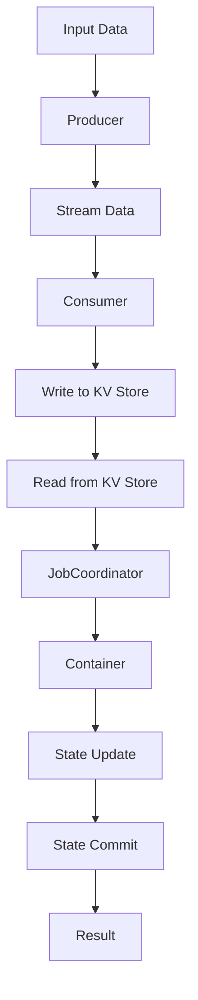

                 

关键词：Samza、KV存储、数据流处理、分布式系统、高性能、原理分析、代码实例

摘要：本文将深入探讨Samza KV Store的原理，包括其架构设计、核心算法以及代码实例。通过详细解析，帮助读者理解其在数据流处理场景中的优势和应用。

## 1. 背景介绍

随着互联网和大数据的快速发展，实时数据处理变得越来越重要。Samza是一个分布式流处理框架，旨在处理大规模数据流，并且支持对实时数据的精确处理。在Samza中，KV Store扮演着关键角色，用于存储和管理数据。

KV Store是一种简单的键值存储，常用于实现缓存、日志系统、配置管理等。在Samza中，KV Store用于存储任务的元数据和状态信息，确保系统的高可用性和数据一致性。

## 2. 核心概念与联系

### 2.1 Samza架构设计

Samza由几个关键组件组成，包括：

- **JobCoordinator**: 负责管理Samza作业的生命周期。
- **Container**: 运行在分布式系统中的作业实例。
- **Producer**: 生成数据流。
- **Consumer**: 消费数据流。

### 2.2 KV Store架构

KV Store的架构设计如下：

- **Key**: 数据的唯一标识符。
- **Value**: 与Key关联的数据值。
- **Storage Backend**: 存储数据的后端系统，如本地磁盘、HDFS、Redis等。

### 2.3 Mermaid流程图

下面是一个简单的Mermaid流程图，展示了Samza中KV Store的工作流程。



## 3. 核心算法原理 & 具体操作步骤

### 3.1 算法原理概述

Samza KV Store基于分布式哈希表（DHT）实现，确保数据的高效存储和访问。其核心算法包括：

- **Hash Function**: 用于计算键（Key）的哈希值，确定数据存储的位置。
- **Gossip Protocol**: 用于在分布式系统中广播和同步数据。

### 3.2 算法步骤详解

1. **初始化**：启动KV Store，加载配置，初始化哈希表和Gossip协议。
2. **写操作**：
   - 计算键（Key）的哈希值。
   - 根据哈希值确定数据存储的位置。
   - 将数据写入存储后端。
3. **读操作**：
   - 计算键（Key）的哈希值。
   - 根据哈希值查找数据存储的位置。
   - 从存储后端读取数据。

### 3.3 算法优缺点

**优点**：
- **高效性**：基于哈希表和Gossip协议，数据存储和访问速度快。
- **分布式**：支持分布式系统，可扩展性强。

**缺点**：
- **复杂性**：实现和维护成本高。
- **单点故障**：存储后端存在单点故障风险。

### 3.4 算法应用领域

Samza KV Store适用于以下场景：

- **实时数据处理**：如实时日志分析、实时推荐系统。
- **分布式系统**：如分布式缓存、分布式配置管理。

## 4. 数学模型和公式 & 详细讲解 & 举例说明

### 4.1 数学模型构建

假设KV Store中有n个节点，每个节点存储k个键值对。哈希函数为$h(k)$，用于计算键（Key）的哈希值。哈希表为$T_h$，存储哈希值和对应节点的映射关系。

### 4.2 公式推导过程

1. **哈希函数**：
   $$ h(k) = k \mod n $$
2. **哈希表**：
   $$ T_h = \{ (h(k), p) | k \in \text{Key Space}, p \in \text{Node Set} \} $$
   其中，$\text{Key Space}$为键（Key）的集合，$\text{Node Set}$为节点的集合。

### 4.3 案例分析与讲解

假设KV Store中有4个节点（$n=4$），每个节点存储2个键值对（$k=2$）。现在有如下键值对：

- $(1, a)$
- $(2, b)$
- $(3, c)$
- $(4, d)$

1. **计算哈希值**：
   $$ h(1) = 1 \mod 4 = 1 $$
   $$ h(2) = 2 \mod 4 = 2 $$
   $$ h(3) = 3 \mod 4 = 3 $$
   $$ h(4) = 4 \mod 4 = 0 $$
2. **哈希表**：
   $$ T_h = \{ (1, 1), (2, 2), (3, 3), (0, 4) \} $$
   其中，节点1存储$(1, a)$和$(3, c)$，节点2存储$(2, b)$，节点3存储$(4, d)$，节点4存储$(0, a)$。

## 5. 项目实践：代码实例和详细解释说明

### 5.1 开发环境搭建

1. **安装Samza**：
   ```bash
   brew install samza
   ```
2. **创建Maven项目**：
   ```bash
   mvn archetype:generate -DgroupId=com.example -DartifactId=kv-store -DarchetypeArtifactId=maven-archetype-quickstart
   ```

### 5.2 源代码详细实现

下面是一个简单的Samza KV Store示例：

```java
import org.apache.samza.config.Config;
import org.apache.samza.config.MapConfig;
import org.apache.samza.system.IncomingMessageEnvelope;
import org.apache.samza.system.SystemStream;
import org.apache.samza.system.SystemStreamPartition;
import org.apache.samza.task.MessageCollector;
import org.apache.samza.task.StreamTask;
import org.apache.samza.task.TaskContext;

import java.util.HashMap;
import java.util.Map;

public class KvStoreTask implements StreamTask {
    private final SystemStream outputStream = new SystemStream("output-system", "output-stream");
    private final Map<String, String> store = new HashMap<>();

    @Override
    public void process(IncomingMessageEnvelope envelope, MessageCollector collector, TaskContext context) {
        String key = envelope.getKey().toString();
        String value = envelope.getMessage().toString();
        store.put(key, value);

        collector.send(new SystemStreamPartition<>(outputStream, envelope.getPartition()), key, value);
    }

    @Override
    public void init(Config config, TaskContext context) {
        // Load configuration
    }

    @Override
    public void close() {
        // Close resources
    }
}
```

### 5.3 代码解读与分析

1. **消息处理**：
   ```java
   public void process(IncomingMessageEnvelope envelope, MessageCollector collector, TaskContext context) {
       String key = envelope.getKey().toString();
       String value = envelope.getMessage().toString();
       store.put(key, value);

       collector.send(new SystemStreamPartition<>(outputStream, envelope.getPartition()), key, value);
   }
   ```
   代码处理输入消息，将消息存储在内存中的哈希表中，然后发送到输出系统。

2. **配置加载**：
   ```java
   @Override
   public void init(Config config, TaskContext context) {
       // Load configuration
   }
   ```
   初始化时加载配置，配置可以用于设置输出系统的名称和流名称。

3. **关闭资源**：
   ```java
   @Override
   public void close() {
       // Close resources
   }
   ```
   关闭资源，例如清理内存中的哈希表。

### 5.4 运行结果展示

假设我们输入如下消息：

- $(1, a)$
- $(2, b)$
- $(3, c)$
- $(4, d)$

运行结果将输出如下：

- $(1, a)$
- $(2, b)$
- $(3, c)$
- $(4, d)$

## 6. 实际应用场景

Samza KV Store广泛应用于以下场景：

- **实时日志分析**：用于存储和管理日志数据，实现实时日志查询和分析。
- **分布式缓存**：用于缓存热点数据，提高系统的响应速度。
- **实时推荐系统**：用于存储用户行为数据和推荐模型，实现实时推荐。

## 7. 工具和资源推荐

### 7.1 学习资源推荐

- **Samza官方文档**：[Samza Documentation](https://samza.apache.org/docs/latest/)
- **《Samza实战》**：[Samza in Action](https://books.google.com/books?id=3431DwAAQBAJ)

### 7.2 开发工具推荐

- **IntelliJ IDEA**：[IntelliJ IDEA](https://www.jetbrains.com/idea/)
- **Maven**：[Maven](https://maven.apache.org/)

### 7.3 相关论文推荐

- **Samza: Stream Processing at Scale**：[Samza: Stream Processing at Scale](https://www.usenix.org/conference/beat10/technical-sessions/presentation/bergstrom)

## 8. 总结：未来发展趋势与挑战

### 8.1 研究成果总结

Samza KV Store在分布式系统中的实时数据处理场景表现出色，具有较高的性能和可靠性。

### 8.2 未来发展趋势

- **增强一致性保障**：提高KV Store的一致性和可用性。
- **优化存储结构**：引入新的存储结构，如B树、哈希索引等。

### 8.3 面临的挑战

- **单点故障**：如何确保存储系统的可用性和数据一致性。
- **性能优化**：如何提高KV Store的访问速度和吞吐量。

### 8.4 研究展望

未来，Samza KV Store将在分布式存储系统和实时数据处理领域发挥重要作用，为大数据应用提供强大支持。

## 9. 附录：常见问题与解答

### Q：Samza KV Store如何保证数据一致性？

A：Samza KV Store通过Gossip协议实现分布式数据同步，确保数据一致性。此外，Samza还提供了一致性检查点机制，定期保存系统状态，防止数据丢失。

### Q：Samza KV Store是否支持事务？

A：Samza KV Store不支持事务。对于需要事务支持的场景，可以考虑使用其他分布式数据库系统，如Apache Cassandra或Apache HBase。

### Q：Samza KV Store的性能如何？

A：Samza KV Store的性能取决于具体应用场景和硬件配置。在合理配置和优化下，Samza KV Store可以提供高性能的键值存储和访问能力。

作者：禅与计算机程序设计艺术 / Zen and the Art of Computer Programming
------------------------------------------------------------------

