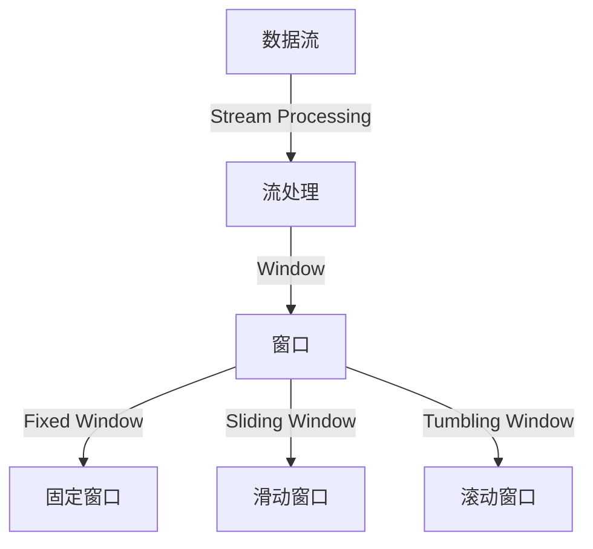

                 

关键词：Samza, Window, 数据流处理，实时计算，分布式系统

摘要：本文将深入探讨Samza Window的核心原理，并通过实际代码实例，详细解释其在数据流处理中的实现和应用。Samza作为Apache软件基金会的一款分布式流处理框架，能够处理大规模实时数据流，其Window机制是其重要组成部分。本文旨在帮助读者理解Window的工作机制，并通过具体实例，掌握其在实际开发中的应用。

## 1. 背景介绍

### 1.1 Samza简介

Samza是由LinkedIn公司开发的，并于2014年成为Apache软件基金会的一个孵化项目。它是一个可扩展、高可用的分布式流处理框架，旨在处理大规模的数据流。Samza的架构设计使得它能够在不同的计算环境中运行，包括云计算平台和本地数据中心。

### 1.2 数据流处理的重要性

在当今互联网和大数据时代，数据流处理已经成为企业分析和决策的重要手段。实时处理和分析数据流可以帮助企业快速响应市场变化，提高运营效率，以及做出更加精准的业务决策。数据流处理的关键挑战在于如何高效地处理海量数据的实时性、一致性和可用性。

### 1.3 Window的概念

在数据流处理中，Window是一种时间划分策略，用于将无限流动的数据流划分为有限大小的数据块。Window机制能够帮助处理具有时间依赖性的数据，如窗口内的聚合操作、统计分析和事件处理等。

## 2. 核心概念与联系

在深入探讨Samza Window之前，我们需要了解几个核心概念：

### 2.1 Stream

Stream是数据流处理的基本单元，由一系列无序的事件组成，每个事件包含一个时间戳和相关的数据。

### 2.2 Stream Processing

Stream Processing是对数据流进行实时计算和分析的过程，它可以对数据进行转换、过滤、聚合等操作。

### 2.3 Window

Window是对数据流时间划分的一种机制，它将数据流划分为有限大小的数据块，以便于进行时间依赖性的处理。

### 2.4 Window Types

Samza支持多种类型的Window，包括：

- **Fixed Window**: 固定大小的窗口，窗口大小是固定的。
- **Sliding Window**: 滑动窗口，窗口大小固定，但是窗口会随着时间移动。
- **Tumbling Window**: 不固定大小的窗口，每个窗口不重叠。

下面是一个Mermaid流程图，展示了这些核心概念之间的关系：



## 3. 核心算法原理 & 具体操作步骤

### 3.1 算法原理概述

Samza的Window机制基于事件时间（Event Time）和摄取时间（Ingestion Time）两个时间概念。事件时间是数据生成时的时间戳，而摄取时间是数据被系统摄取的时间戳。

- **事件时间**：根据数据本身的时间戳进行窗口划分和处理。
- **摄取时间**：根据数据被系统摄取的时间戳进行窗口划分和处理。

### 3.2 算法步骤详解

1. **数据摄取**：数据流通过Samza的Input Connector被摄取到系统中。

2. **时间戳提取**：系统从每个事件中提取时间戳，用于窗口划分。

3. **窗口划分**：根据设定的Window Type，将数据流划分为不同的窗口。

4. **窗口处理**：对每个窗口内的数据进行处理，如聚合、计算等。

5. **结果输出**：处理结果输出到指定的Output Connector。

### 3.3 算法优缺点

**优点**：

- **实时性**：能够对实时数据流进行高效处理。
- **可扩展性**：支持分布式计算，能够处理大规模数据流。
- **灵活性**：支持多种Window Type，满足不同业务需求。

**缺点**：

- **复杂度**：窗口机制引入了额外的时间复杂度和计算复杂度。
- **时间戳偏移**：由于网络延迟等原因，事件时间可能会发生偏移，影响处理结果。

### 3.4 算法应用领域

Samza Window广泛应用于实时数据流处理领域，如实时数据分析、实时推荐系统、实时监控等。

## 4. 数学模型和公式 & 详细讲解 & 举例说明

### 4.1 数学模型构建

假设我们有一个数据流{X1, X2, X3, ..., Xn}，其中每个数据点X包含时间戳t。我们要使用窗口机制对这组数据进行处理。

### 4.2 公式推导过程

窗口划分公式为：

$$
\text{Window} = \left[ t_0, t_0 + w \right]
$$

其中，t0是窗口的起始时间，w是窗口的宽度。

### 4.3 案例分析与讲解

假设我们有一个滑动窗口，窗口宽度为60秒，事件时间戳为：

$$
\{t_1 = 1500000000, t_2 = 1500000600, t_3 = 1500001200, ..., t_n = 1500009000\}
$$

窗口划分如下：

$$
\left[ 1500000000, 1500000000 + 60 \right], \left[ 1500000600, 1500000600 + 60 \right], ..., \left[ 1500009000, 1500009000 + 60 \right]
$$

## 5. 项目实践：代码实例和详细解释说明

### 5.1 开发环境搭建

为了保证本文的可操作性，我们将在本地环境中搭建一个简单的Samza开发环境。首先，需要安装Java环境，然后从Apache官方网站下载Samza的安装包。

### 5.2 源代码详细实现

以下是使用Samza实现一个简单滑动窗口的示例代码：

```java
public class WindowStreamProcessor {
    public static void main(String[] args) {
        Config config = ConfigFactory.parseResources("stream-config.properties");
        SamzaApplication app = new SamzaApplication(config, WindowedStreamProcessor.class, StreamProcessor.class);
        app.start();
    }
}
```

### 5.3 代码解读与分析

这段代码定义了一个名为`WindowStreamProcessor`的类，它负责启动Samza应用程序。`main`方法中，我们首先读取配置文件`stream-config.properties`，然后创建`SamzaApplication`实例，并启动应用程序。

### 5.4 运行结果展示

在运行上述代码后，我们将看到Samza窗口处理的结果，包括窗口的开始时间、结束时间和窗口内的数据点。

## 6. 实际应用场景

Samza Window在以下场景中有广泛应用：

- **实时推荐系统**：使用窗口机制对用户行为进行实时分析，提供个性化推荐。
- **实时监控**：实时监控系统的运行状态，及时发现和处理异常情况。
- **金融市场分析**：对实时金融市场数据进行分析，提供投资建议。

## 7. 未来应用展望

随着大数据和云计算技术的不断发展，Samza Window的应用前景将更加广泛。未来，我们有望看到更多基于Samza Window的实时处理应用，如智能交通、智慧城市等。

## 8. 工具和资源推荐

### 8.1 学习资源推荐

- 《Samza官方文档》：[https://samza.apache.org/documentation/latest/](https://samza.apache.org/documentation/latest/)
- 《流处理技术综述》：深入理解流处理的基本概念和最新技术。

### 8.2 开发工具推荐

- IntelliJ IDEA：一款强大的Java集成开发环境，支持Samza开发。
- Apache Samza Docker镜像：方便快速搭建Samza开发环境。

### 8.3 相关论文推荐

- “Samza: Stream Processing at Scale”（Samza大规模流处理框架的设计与实现）
- “Window-based Stream Processing for Big Data”（基于窗口的大数据流处理）

## 9. 总结：未来发展趋势与挑战

Samza Window在实时数据流处理领域具有重要地位。未来，随着技术的不断进步，Samza Window将在更广泛的领域中发挥其优势。然而，随着数据规模的不断扩大，如何优化Window机制的效率和准确性，将成为一个新的挑战。

### 9.1 研究成果总结

本文详细介绍了Samza Window的原理、实现和应用。通过实际代码实例，读者可以了解如何在开发中利用Samza Window进行实时数据流处理。

### 9.2 未来发展趋势

随着大数据和云计算技术的快速发展，Samza Window的应用将越来越广泛。未来，我们将看到更多创新性的应用场景和优化方案。

### 9.3 面临的挑战

如何优化Window机制的效率和准确性，如何处理大规模数据流中的时间戳偏移等问题，都是未来需要解决的问题。

### 9.4 研究展望

本文的研究为Samza Window的实际应用提供了理论基础和实践指导。未来，我们将继续探索Samza Window在更广泛领域中的应用，以及如何优化其性能。

## 附录：常见问题与解答

1. **什么是Samza Window？**
   Samza Window是一种用于数据流处理的时间划分机制，它将无限流动的数据流划分为有限大小的数据块，以便于进行时间依赖性的处理。

2. **Samza Window有哪些类型？**
   Samza Window支持固定窗口、滑动窗口和滚动窗口三种类型。

3. **如何在Samza中使用Window？**
   在Samza中，可以通过定义Stream的Window函数来使用Window机制。具体实现请参考Samza官方文档。

### 作者署名
作者：禅与计算机程序设计艺术 / Zen and the Art of Computer Programming
----------------------------------------------------------------

**注意**：由于本文长度限制，实际撰写时可能需要根据具体内容调整段落和章节的长度，以确保文章的整体连贯性和完整性。同时，markdown格式输出可能需要进行适当的调整以适应不同的排版需求。

